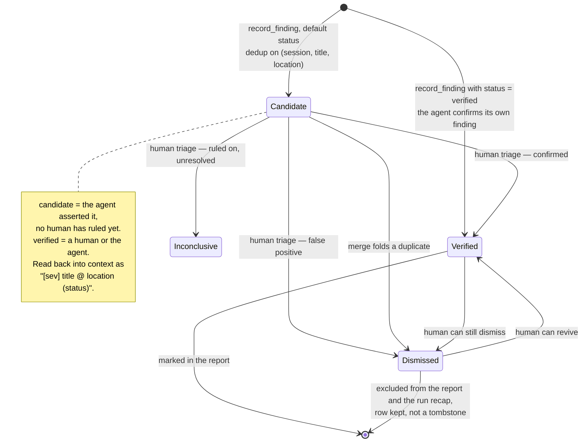

## 1. Executive Summary

REDCELL is an autonomous penetration-testing platform: an orchestrator LLM plans
an engagement, executor agents run real tools (nmap, nuclei, Metasploit, a
driven Chromium, reverse shells) inside a Kali container, and the system writes
the pentest report at the end. It is MIT, Python and TypeScript, about 12,000
lines of Python across a FastAPI API, an `arq` worker, and a `redcell_core`
engine on LangGraph and LiteLLM, with a React console.

Most of that is out of this atlas's scope, and two pieces of durable state
inside it need separating before the report can say anything useful.

The **checkpointer** is LangGraph's `AsyncPostgresSaver`, sharing the application
database and a small connection pool, and it lets the agent loop *"pick up where it left off"* after a crash. That is session
state — the same mechanism [LangGraph](../langgraph/) ships and this atlas treats
as resume-scoped rather than memory. It is not the subject.

The **engagement record** is: a Postgres table of **findings**, and sibling
tables of **loot** (credentials, keys, artifacts) and **attack-surface hosts**.
This is the subject, and it qualifies as memory on a stricter reading than
several borderline cases the atlas has excluded. A finding is *"[high] SQL
injection @ /login (candidate)"* — a **claim about the target that can be
false**. It is stored keyed to an engagement, it is read back into agent context — by
the chat assistant, and as a recap at the start of each new run in the same
engagement — it is scoped, and it is corrected: a human sets its `status` to
`verified`, `dismissed` or `inconclusive`, and a **dismissed finding is a false
positive kept in the table and removed from the report and from the next run's
recap**. That is the cleanest instance of a corrected memory in this atlas —
not a superseded value or a decayed one, but a stored claim a reviewer has
judged wrong.

What makes it a thin memory system, and worth being plain about, is the read
path. There is no search, no embedding, no ranking. `assistant.py` lists the
session's findings, loot and hosts, **truncates each list** — forty findings,
thirty loot items, thirty hosts — and pastes the survivors into the system
prompt as flat text. `summarize_progress` in `runner.py` does the same for a new
run, with the same forty-finding cap, minus dismissed findings. Recall is
`SELECT … WHERE session_id = ? ORDER BY created_at DESC`, sliced in Python. For a small engagement that is enough; for a large one
the oldest findings fall off the end of the context silently, and nothing
decides which forty matter.

And there is no cross-engagement memory. Everything is keyed to one `session_id`
and never leaves it — the platform learns nothing from one pentest that informs
the next. That is a defensible product choice (engagements are confidential and
scoped by contract) and it is the ceiling on what this layer is.

## 2. Mental Model

A memory is a **finding**: `{title, severity, cvss, cwe, location, status,
evidence_request, evidence_response, remediation, verification_method}`, keyed to
a `session_id` and optionally a `run_id`. Loot and hosts are the two sibling
units — a credential or an artifact, and a host with its IP and detected tech.

The finding is the only unit with a **state machine**, and it is a real one:

```text
agent records            -> status = "candidate"   (the default, agent-authored)
human triages            -> "verified"      (confirmed; marked in the report)
                         -> "dismissed"     (false positive or duplicate; excluded from the report)
                         -> "inconclusive"  (ruled on, not resolved)
merge(primary, dups)     -> each duplicate -> "dismissed", primary kept canonical
```

`candidate` is the agent's default, and `dismissed` and `inconclusive` are only a
person's. `verified` is not: the `record_finding` tool schema offers `status`
with the enum `["candidate", "verified"]`, and `_record_finding` stores
`args.get("status", "candidate")` without checking it against `VALID_STATUSES`.
So **the agent may assert and may confirm; only a human may reject**. A
`candidate` means "no human has ruled on this yet", but a `verified`
finding does not mean one has — the row carries no field that separates an
operator's verification from the agent's. This earns `trust_state`: the status
is a discrete field with at least candidate / verified / dismissed, set on the
value, and it changes what the value does downstream (a dismissed finding leaves
the report).

How a memory dies: `dismissed`. There is no hard delete on the ordinary path and
no decay. A dismissed finding stays in the table — so it is not a tombstone in
the atlas's sense, because nothing keys on the *rejected value* to stop the agent
re-recording it. The dedup predicate keys on `(session_id, title, location)`,
not on status, so an agent that re-derives a dismissed finding with the same
title and location is blocked by the `exists` check — but a re-derivation with a
reworded title would be recorded fresh as a new candidate, and the earlier
dismissal would not prevent it.



## 3. Architecture

Five processes, one of which owns the memory:

- **API** — FastAPI over Postgres, Redis and MinIO; serves the console, the
  triage endpoints and the WebSocket streams.
- **Worker** — `arq`, drains a Redis queue and runs the engine.
- **Engine** (`redcell_core`) — a LangGraph plan/act loop under LiteLLM. The
  orchestrator delegates objectives to executor agents that run tools over
  `docker exec` into a Kali container, local or remote over SSH.
- **Postgres** — the durable engagement record: `findings`, `loot`, `hosts`,
  `sessions`, `runs`, agents, chat, listeners, credentials.
- **Redis / MinIO** — the event bus and pub/sub, and file storage for reports
  and loot.

The memory layer proper is `packages/core/redcell_core/repositories/` —
`findings.py`, `loot.py`, `hosts.py` — plus the models and the two consumers:
`engine/runner.py`, which writes during the loop, and `engine/assistant.py`,
which reads the record back for the chat.

The agent-loop checkpointer is separate by design even though it shares the
database: its module docstring says it *"only holds transient agent-loop state;
business data lives in its own tables"*, keyed by `thread_id = run_id`. The
resume state and the engagement record are two sets of tables with two
lifetimes — the checkpointer is one run's conversation, the findings tables are
the engagement's memory.

### Deployment and ergonomics

- **This is a server platform, not a library.** Postgres, Redis, MinIO, a
  worker, and a Kali container are all required to do anything; `docker-compose`
  files are provided.
- **An LLM provider key is required** — pluggable through LiteLLM, per session.
- **The store is a normal relational database**, inspectable and correctable
  through the operator console's triage UI, which is the intended repair path.
- **Findings memory needs no vector service and no embedding key** — there is no
  semantic layer to stand up, because there is no semantic retrieval.
- Runs checkpoint continuously, so a crash or restart resumes; the memory record
  is committed per write and survives independently.

The screen found no auto-run surfaces, one build-time execution point, five
unpinned manifests and eight dependency surfaces inside the seven-day cooldown,
with `uv.lock` present for the Python core. A `README` warning states plainly
that the system *"runs real offensive tooling"* against authorized targets only;
nothing about the memory layer was installed or run, and the tree was read as
source.

## 4. Essential Implementation Paths

- **Write** — `engine/runner.py:856` (findings, in `_record_finding`), `:883`
  (loot), `:895` (hosts).
  Each executor tool parses its own output — nuclei JSONL, nmap, and so on — and
  calls `findings_repo.create` after `findings_repo.exists(session_id, title,
  location)` returns false.
- **Dedup predicate** — `repositories/findings.py:41`, keyed on
  `(session_id, title, location)`; `loot.py` on `(session_id, label, value)`;
  `hosts.py` on `(session_id, host)`.
- **Triage** — `set_status` at `repositories/findings.py`, validating against
  `VALID_STATUSES = ("candidate", "verified", "dismissed", "inconclusive")` and
  raising on anything else; `verify` is a shortcut for it.
- **Merge** — `repositories/findings.py`, folding duplicates by setting each to
  `dismissed`, keeping the primary canonical, and refusing to touch a duplicate
  whose `session_id` differs from the primary's.
- **Read for the agent** — `engine/assistant.py:92` lists findings, loot and
  hosts for the session; `_context` at `:62` truncates and formats them into the
  chat system prompt. `engine/runner.py:329` (`_prior_progress`) reads the same
  three lists for a run that has no checkpoint, and `summarize_progress` at `:55`
  drops dismissed findings and caps the rest into a second system message.
- **Report exclusion** — the reporting path filters out `dismissed` findings and
  marks `verified` ones (`tests/test_reporting.py`).
- **Checkpointer** — `engine/checkpoint.py`, LangGraph's `AsyncPostgresSaver`
  over a pool, created once under a lock; `runner.py:389` resumes *"from the last
  checkpoint"*.

## 5. Memory Data Model

The `findings` table (`models/finding.py`):

| Column | Meaning |
| --- | --- |
| `id`, `session_id` (indexed), `run_id` | identity and scope |
| `title`, `severity`, `cvss`, `cwe`, `location` | the claim |
| `status` | `candidate` default, then the triage states |
| `evidence_request`, `evidence_response` | the agent's ask and what it got back |
| `remediation`, `verification_method` | write-up fields |
| `created_at` | record time |

`loot` and `hosts` mirror the shape at a smaller size. There is no confidence
float, no embedding column, no version chain, and no author — a finding does not
record which agent proposed it or which operator triaged it, only the current
status. That is a gap against [RunarForge](../runar-forge/), which stores both
proposer and endorser; here the triage is a state transition with no actor
recorded on the row.

**Scoping is enforced and is the strongest guarantee here.** Every read in
`findings.py`, `loot.py` and `hosts.py` filters on `session_id`, the column is
indexed, and `merge` explicitly refuses to dismiss a duplicate whose session
differs from the primary's — so a triage action cannot reach across engagements
even by accident. That earns `scope_enforced`, and the merge guard is the kind
of check most systems omit.

Temporal fields are `created_at` only; nothing tracks when a vulnerability was
introduced versus when it was found, so `bitemporal` does not apply.

## 6. Retrieval Mechanics

There is no retrieval mechanism in the sense this atlas usually means. The read
path is `list_for_session`, which supports optional filters on `severity`,
`status` and a `q` substring search over `title`, `location` and `cwe`, ordered
`created_at DESC` with a limit. The **agent's** reads — the ones that matter for
memory — are two. `assistant.py` calls `list_for_session` with no query and
then caps: forty findings, thirty loot, thirty hosts, formatted into flat text
lines and prepended to the chat system prompt. A new run in the engagement calls
`_prior_progress`, which lists the same three and passes them to
`summarize_progress`: dismissed findings are dropped, the rest capped at forty
findings, forty hosts and thirty loot, and the result is added as a system
message telling the orchestrator to *"build on it and do not repeat completed
work"*. A run resumed from its checkpoint or reopened by the operator does not
get the recap; it carries its own conversation. The two reads disagree about
dismissal: the recap omits a dismissed finding, and the chat context shows it
with `(dismissed)` beside it.

So recall is: everything in the engagement, newest first, truncated to a fixed
count, unranked. Two consequences follow and both matter for a large pentest.

**The cap is silent and arbitrary by recency.** A forty-first finding is not
summarized, not ranked out, not flagged — it is absent from the agent's context
with no signal that anything was dropped, and which forty survive is decided by
`created_at DESC`, so the earliest findings in a long engagement disappear first.
The run recap repeats the cap.
For a pentest that runs for days, the reconnaissance findings that frame the
later exploitation are exactly the ones that age out.

**The human's search is better than the agent's.** The triage UI can filter by
severity and status and substring-search; the agent gets an unfiltered newest-40
paste. The operator can find a specific old finding; the agent cannot recall one
it is not currently shown.

This is the honest shape of the system: findings memory is a structured record
optimized for the report and for human review, and the agent reads it back as a
convenience rather than querying it as a memory. Nothing here would be hard to
improve — a severity-weighted or verified-first ordering is a one-line change to
the `list_for_session` call in `assistant.py` — and neither read does it.

## 7. Write Mechanics

Writes are synchronous and structured. An executor tool runs, parses its own
output into typed records, and each record is written after a dedup check. The
comment on `VALID_STATUSES` states the intended contract: *"candidate is the
default an agent records under"*. The code keeps it a default and no more — the
tool schema lets the model pass `verified`, and the create path does not
validate the status it is given, so the enum in the tool schema is the only
check and a value outside it would be stored.

Deduplication is a hard `exists` gate on `(session_id, title, location)` before
create, for findings; on `(session_id, label, value)` for loot; on
`(session_id, host)` for hosts. This is exact-match dedup, and it has the
strength and the weakness of exact match: it reliably stops the same tool
recording the same host twice, and it does nothing about two findings that are
the same vulnerability with different titles — which is precisely why the human
`merge` path exists. Dedup and merge are the two halves of duplicate handling,
one automatic and exact, one manual and semantic.

There is no consolidation pass, no decay, no background rewrite. The memory
grows monotonically within an engagement until a human dismisses or merges parts
of it. `created_at` is stamped on write and never changes.

The write path is on the agent's turn — a tool call records its findings before
returning — so there is no lag: a finding is in the record and readable the
moment the tool that found it completes. The cost is that a chatty scanner
(nuclei against a large surface) writes many candidates that a human must later
triage, and nothing bounds that inflow except the dedup predicate.

## 8. Agent Integration

Memory here has three distinct actors, and separating them is the design's
clearest idea.

**The agent writes**, through the executor tools, as `candidate` by default and
as `verified` when it passes that status to `record_finding`. Its write vocabulary is the structured tools
(nmap, nuclei, `record_loot`, `run_command`) that parse into the record.

**The human triages**, through the operator console: verify, dismiss, merge,
plus the severity/status/substring search. This is the correction surface, and
it is a real one — a person adjudicating the truth of each stored claim, which
is what `human_review` marks.

**The chat assistant reads**, through `assistant.py`, which assembles the
engagement record into context to answer questions or to steer a live or
reopened run. This is where memory re-enters the loop: a finished run can be
reopened, its findings and loot and hosts are read back, and the agent continues
with them in context.

That three-way split — agent proposes, human adjudicates, assistant recalls — is
the design's shape, and it holds for rejection: only a person dismisses. It does
not hold for confirmation. The agent can write `verified` at create time, and a
verified row records nothing about who set it, so an unattended run can produce
findings that read as confirmed in the console and in the PDF without a person
having ruled on any of them.

## 9. Reliability, Safety, and Trust

**The trust model is the finding status, and it is genuinely a trust state.**
Four values, two agent-writable and two human-only, applied on the row and
consumed downstream: `dismissed` leaves the report and the run recap, `verified`
is marked in the report.
This is stronger than a confidence float — it records *who has ruled* and *how*,
not a probability — and it is the mechanism that makes a false positive a
correctable memory rather than a permanent one. The near-miss on `tombstone` is
worth naming: dismissal changes a status but does not key on the rejected value,
so the store does not stop the agent re-proposing the same vulnerability under a
different title. The dedup `exists` check is title-and-location exact, so it
catches an identical re-derivation and misses a reworded one.

**Provenance is thin.** A finding records `evidence_request` and
`evidence_response` — the agent's ask and what came back, which is real evidence
— but not which agent proposed it or which operator triaged it. The status tells
you a human ruled; it does not tell you which human or when. For a security
deliverable that will be handed to a client, the absence of a triage audit trail
is a genuine gap.

**Scope is the strongest guarantee.** Session-keyed reads throughout, an indexed
`session_id`, and a merge that refuses cross-session dismissal. In a platform
that runs multiple clients' engagements against the same database, that
boundary is the one that matters most, and it is enforced in the repository
layer rather than left to the caller.

**Prompt-injection is a live risk this system runs toward.** The agent reads
tool output from hostile targets — a pentest is by definition pointed at systems
that may be adversarial — and that output is parsed into findings and then read
back into the agent's context. A target that emits crafted text into a scan
result is writing into the agent's memory. Nothing in the read path fences the
recalled findings as untrusted, and the whole engagement is against machines
whose output cannot be trusted. This is the sharpest safety consideration in the
system and it is not addressed at the memory layer.

The checkpointer gives crash-resume durability; the Postgres record is committed
per write. Multi-tenancy is the session boundary. There is no encryption
mentioned at the memory layer, and loot — which by definition holds captured
credentials — is stored in Postgres and MinIO; the credentials table is
separate and the code references secret handling for provider keys, but captured
loot is engagement data in the clear.

## 10. Tests, Evals, and Benchmarks

**132 test functions** in `packages/core/tests` and 26 in `apps/api/tests`
(counted, not run), and the memory-relevant ones are
better than the average in this atlas at testing the mechanism rather than the
happy path. `test_findings_triage.py` asserts the status transitions
(`candidate → verified → dismissed`), asserts that an unknown status **raises**
rather than being stored, and covers the merge folding duplicates to dismissed.
`test_reporting.py` covers the report excluding dismissed findings and marking
verified ones — which is the assertion that the trust state actually changes the
deliverable. `test_repo_core.py` and `test_repo_children.py` cover the
session-scoped repositories.

The reporting test asserts a dismissed finding is excluded from the *report*, a
client deliverable rather than anything the agent reads. The test that earns
`negative_eval` is on the agent side: `apps/api/tests/test_run_context.py`
asserts that `summarize_progress` over a single dismissed critical finding
returns `None`, so a false positive the operator rejected does not reach the next
run's opening context, and the neighbouring test is the positive control — a
verified finding's title, location and severity do appear. Nothing asserts the
same for the chat context, which includes dismissed findings by design, and
nothing tests that the agent cannot create a `verified` finding, because it can.

What is missing: nothing tests the forty-finding cap in `assistant.py`, so the
silent truncation has no guard, and nothing measures whether the agent's recall
of its own findings is complete. There is no retrieval-quality evaluation
because there is no ranked retrieval to evaluate.

## 11. For Your Own Build

### Steal

**Make the memory unit a claim that can be false, and give it a status a human
sets.** A finding with `candidate / verified / dismissed / inconclusive` is a
clean correction model — keep the agent to `candidate` in the create path itself,
which REDCELL states as its contract and does not enforce: the agent proposes, a person adjudicates, and the status changes what the
record does. If your agent produces assertions a human will review — findings,
extractions, claims — this beats a confidence float, because it records the
ruling rather than a probability.

**Separate the three memory authorities.** Agent writes, human triages,
assistant reads. Letting the writer also confirm its own output is the failure
mode most memory systems have, and the split only holds if the writer's schema
cannot name the reviewer's states — REDCELL's `record_finding` enum includes
`verified`, which is the gap to avoid copying.

**Enforce scope in the repository, and guard the cross-scope operation
explicitly.** Every read filters on `session_id`, and `merge` refuses to dismiss
a finding in another session. The second half is the one to copy — a bulk
operation that could reach across tenants should check, not assume.

**Dedup exactly on write, and merge semantically by hand.** An `exists` gate on
a natural key stops the same tool recording the same thing twice for free; the
duplicates it cannot catch — same vulnerability, different wording — are what the
human merge path is for. Two mechanisms, one cheap and automatic, one deliberate.

**Record the evidence, not just the claim.** `evidence_request` and
`evidence_response` on each finding mean a reviewer can adjudicate from what the
agent actually saw rather than from its summary.

### Avoid

**Do not paste your whole memory into context and cap it by recency.** Forty
findings, newest first, unranked, with no signal when the forty-first is
dropped, means a long engagement loses its early context silently and the agent
recalls what happened recently rather than what matters. If recall is a paste,
rank the paste; if it must be capped, say what was cut.

**Do not let dismissal be status-only if re-derivation is likely.** A dismissed
finding here does not stop the agent re-recording the same vulnerability under a
different title, because dedup keys on the title and dismissal keys on nothing.
A rejected-value key — the tombstone this atlas keeps asking for — would close
that loop.

**Do not omit the triage actor from a deliverable memory.** A finding records
that a human ruled and not which human, so a security report cannot show its own
review trail. If the memory becomes a document someone signs, the reviewer
belongs on the row.

**Do not read hostile output back into context unfenced.** A pentest target's
tool output becomes a finding becomes agent context. Any system whose memory is
populated from adversarial sources should treat recalled memory as untrusted
input; this one does not, and its sources are adversarial by definition.

### Fit

This suits a builder whose agent produces reviewable claims within a bounded
engagement and who wants the human in the loop as the source of truth. The
finding-as-memory model, the agent-proposes/human-confirms split, and the
session scoping are all worth lifting whole, independent of the pentest domain —
they are a good answer to "how does an agent remember things a person must
approve".

Walk away if you need cross-engagement learning: there is none, and the
`session_id` key is load-bearing everywhere, so adding it is not a small change.
Walk away if you need the agent to recall a large or ranked memory: the read
path is a truncated paste and the retrieval quality is whatever `created_at DESC
LIMIT 40` gives you. And treat the whole thing as engagement software, not a
memory library — there is no way to use the findings store without the platform
around it.

## 12. Open Questions

- Is the forty-finding cap in `assistant.py` a deliberate context-budget choice
  or an untuned default? Nothing documents it and nothing tests it.
- Does any path let the agent re-query its own findings mid-run? No tool reads
  them; the chat context and the new-run recap are both assembled once.
- Is `verified` in the `record_finding` enum intended — an agent that exploited
  a finding has evidence of its own — or a leftover the triage contract was meant
  to exclude?
- Is captured loot — credentials by definition — encrypted at rest anywhere, or
  is it engagement data in the clear in Postgres and MinIO?
- Does the triage UI record who dismissed or verified a finding, even if the
  row does not? An actor in an event log would change the provenance assessment.
- Would a reworded re-derivation of a dismissed finding be re-recorded as a new
  candidate? The dedup key and the dismissal key do not intersect, which
  suggests yes.

## Appendix: File Index

**Memory model and repositories**

- `packages/core/redcell_core/models/finding.py` — the `findings` schema.
- `packages/core/redcell_core/repositories/findings.py` — `list_for_session`, `create`, `exists`, `set_status`, `verify`, `merge`, `VALID_STATUSES`.
- `packages/core/redcell_core/repositories/loot.py`, `hosts.py` — the sibling records and their dedup predicates.

**Write and read paths**

- `packages/core/redcell_core/engine/runner.py` — the executor loop that writes findings, loot and hosts; `_prior_progress` and `summarize_progress`, the new-run recap.
- `packages/core/redcell_core/engine/tools.py` — the `record_finding` schema, whose `status` enum includes `verified`.
- `packages/core/redcell_core/engine/assistant.py` — `_context` and `answer_run`, the read-back into agent context.
- `packages/core/redcell_core/engine/webscan.py` — nuclei/scan output parsed into findings.

**Session state (out of scope)**

- `packages/core/redcell_core/engine/checkpoint.py` — the LangGraph Postgres checkpointer.
- `packages/core/redcell_core/config.py` — `checkpoint_enabled`.

**Tests**

- `packages/core/tests/test_findings_triage.py` — status transitions and merge.
- `packages/core/tests/test_reporting.py` — dismissed excluded from the report.
- `apps/api/tests/test_run_context.py` — dismissed excluded from the run recap, with a positive control.
- `packages/core/tests/test_repo_core.py`, `test_repo_children.py` — session-scoped repositories.

## History

**2026-09-15** — [`27b118b4e7f2171d7f70710720b9e5a07e978b8a`](https://github.com/martian56/redcell/commit/27b118b4e7f2171d7f70710720b9e5a07e978b8a) — 2,851 commits on, 2026-09-13, almost all by the author and most of them one-line `docs(...)` commits (1,212 under `docs(mobile)` alone); the pin is an ancestor. Screened before reading: no auto-run surface, one build-time execution point (`conftest.py`), five unpinned manifests and four dependency surfaces inside the seven-day cooldown, so nothing was installed or run and the test counts above are counted. The findings, loot and hosts repositories and the finding model are byte-identical to the pin. `negative_eval` is added and is new: a run with no checkpoint now opens with `summarize_progress`, a recap of the engagement's findings, hosts and loot that drops dismissed findings, and `test_run_context.py` asserts that exclusion beside a positive control. A claim present since the first reading was wrong and is corrected throughout: the agent is not limited to `candidate`. The `record_finding` schema at the previous pin already offered `status` with `["candidate", "verified"]`, and the create path stores the argument unvalidated, so only rejection is human-only; `human_review` is kept as a correction surface over agent writes, not an admission gate. The LangGraph checkpointer moved from SQLite to Postgres, and the write and resume line anchors moved with `runner.py`.

**2026-08-14** — [`323a3e11d8a2b50de4a8193c5ac356f4aa4d27e5`](https://github.com/martian56/redcell/commit/323a3e11d8a2b50de4a8193c5ac356f4aa4d27e5) — first reading, at a commit dated 13 August 2026. Screened before opening: no auto-run surfaces, one build-time execution point, five unpinned manifests, eight dependency surfaces inside the seven-day cooldown, `uv.lock` present. Nothing was installed or run; the scope call — findings in, checkpointer out — was made by tracing what `assistant.py` reads back against what the checkpointer stores.
