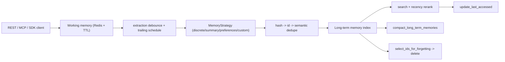

## 1. Executive Summary

Redis Agent Memory Server is Redis's Apache-2.0 reference implementation of agent memory, living under `V0/` in the repository (the directory name marks it as the open research foundation beneath a managed Redis Cloud offering). It is a REST + MCP service of roughly 14,500 lines, and it is the backend behind the official OpenClaw Redis memory plugin.

Its shape is the textbook version of a split this atlas repeatedly identifies as correct:

- **Working memory** — session-scoped conversation state held in Redis with a TTL, so expiry is the storage engine's job rather than a cleanup worker's.
- **Long-term memory** — extracted, deduplicated, embedded records that outlive the session, promoted from working memory in the background.

Three things make it worth a report of its own rather than a footnote to Redis.

**Pluggable extraction strategies.** `BaseMemoryStrategy` has four implementations — `DiscreteMemoryStrategy`, `SummaryMemoryStrategy`, `UserPreferencesMemoryStrategy`, and `CustomMemoryStrategy` — so *what counts as a memory* is configuration, not a hard-coded pipeline. Very few systems here make extraction policy swappable.

**Layered deduplication.** Hash-exact, ID-based, and semantic dedupe are separate functions, and the semantic path is guarded by `_semantic_merge_group_is_cohesive` before an LLM is allowed to merge a cluster — a check against the common failure where semantic dedupe silently fuses related-but-distinct facts.

**The most developed forgetting policy in the atlas.** `select_ids_for_forgetting` combines TTL, inactivity, pinning, per-type allowlists, and budget-based pruning, with separate half-lives for last-access (7 days) and creation (30 days), and a "hard age multiplier" so a recently-used memory survives its nominal TTL unless it is extremely old.

The notable gap is epistemic rather than operational: memory types are cognitive (`episodic`, `semantic`, `message`) rather than evidential, forgetting is real deletion with no tombstone, and there is no candidate/verified/rejected state — so a memory deleted by policy or by a user can be re-extracted from the same conversation on the next pass with nothing to prevent it.

## 2. Mental Model

Two stores with different lifetimes:

```text
Working memory   (Redis, session-scoped, TTL-expired)
  messages[]  — with created_at, persisted_at, discrete_memory_extracted flag
  structured state, context percentage
        |
        |  promote_working_memory_to_long_term()  [background]
        v
Long-term memory (indexed vector records, namespace-scoped)
  MemoryRecord(
      id, text, memory_type: episodic|semantic|message,
      namespace, user_id, session_id, topics, entities,
      created_at, last_accessed, pinned, ...
  )
```

`MemoryTypeEnum` is a cognitive taxonomy — `EPISODIC` (things that happened), `SEMANTIC` (facts), `MESSAGE` (raw turns) — rather than a trust or provenance taxonomy.

Lifecycle:

```text
client writes messages -> working memory (TTL)
-> should_extract_session_thread()? -> debounce -> schedule_trailing_extraction()
-> run_delayed_extraction() -> strategy.extract() -> MemoryRecords
-> deduplicate_by_hash -> deduplicate_by_id -> deduplicate_by_semantic_search
-> index_long_term_memories()
-> search_long_term_memories() with recency reranking; update_last_accessed()
-> periodic: compact_long_term_memories(), select_ids_for_forgetting() -> delete
```

## 3. Architecture

Largest modules under `V0/agent_memory_server/`:

- `long_term_memory.py` (2,525 lines) — extraction scheduling, dedupe, compaction, search, forgetting.
- `api.py` (1,394) — REST surface.
- `mcp.py` (1,308) — MCP server.
- `cli.py` (1,283), `models.py` (1,183), `memory_vector_db.py` (1,144).
- `working_memory.py` (819) — session state, TTL handling, Lua-scripted updates.
- `summary_views.py` (721), `config.py` (651), `memory_strategies.py` (560).
- `auth.py` (453), `extraction.py` (416), `filters.py` (345).
- `prompt_security.py` — validation for user-supplied prompts.
- `migrations.py`, `docket_tasks.py`, `tasks.py` — schema migration and background task execution.



## 4. Essential Implementation Paths

### Working memory and TTL

Session state lives in Redis under a TTL, and the code is careful about preserving it: `working_memory.py` uses a Lua script that reads the current TTL, rewrites the value as JSON, and restores the TTL only when it is still positive — so an update cannot accidentally make a session immortal or truncate its remaining life. Expired sessions disappear by key expiry rather than by a sweeper, which is the cheapest correct answer for ephemeral state.

Messages carry both a client `created_at` and a server-assigned `persisted_at`, plus a `discrete_memory_extracted` flag so extraction is idempotent per message.

### Extraction scheduling

Rather than extracting on every turn, `should_extract_session_thread` and `set_extraction_debounce` throttle work, and `schedule_trailing_extraction` / `run_delayed_extraction` defer it — a trailing-edge debounce. This keeps model calls off the interactive path, which is the [zero-LLM capture](../../patterns/zero-llm-capture/) discipline applied at the scheduling layer: the message is durable in working memory immediately, and the expensive derivation happens later.

`_parse_extraction_response_with_fallback` handles malformed model output rather than dropping the batch.

### Pluggable strategies (`memory_strategies.py`)

`BaseMemoryStrategy` is an ABC with four shipped implementations:

- `DiscreteMemoryStrategy` — atomic facts, the default shape.
- `SummaryMemoryStrategy` — thread summaries, with `_thread_summary_memory_id` and `_existing_summary_matches_source` so a summary is tied to the source range it covers and is not duplicated when unchanged.
- `UserPreferencesMemoryStrategy` — preference-focused extraction.
- `CustomMemoryStrategy` — a user-supplied prompt.

That last one is why `prompt_security.py` exists. `PromptValidator` screens user-provided prompts for injection and template-injection patterns (`ignore previous instructions`, `forget everything`, and similar) before they reach the model. This is an unusual and specific threat model — the *operator's own configuration* as an injection vector — and most systems that allow custom prompts do not check them at all.

### Deduplication and compaction

Three independent layers:

- `deduplicate_by_hash` — exact content collisions.
- `deduplicate_by_id` — identity collisions.
- `deduplicate_by_semantic_search` — near-duplicates, gated by `_semantic_merge_group_is_cohesive`, which verifies a candidate cluster actually is one thing before `merge_memories_with_llm` collapses it.

The cohesion guard is the interesting part. Semantic dedupe is dangerous precisely because "similar" and "same" diverge, and this is the only implementation in the atlas that puts an explicit cohesion test between the clustering step and the merge step.

`compact_long_term_memories` runs the whole pipeline periodically, and `delete_invalid_memories` removes records that fail validation.

### Forgetting (`select_ids_for_forgetting`)

The policy accepts `max_age_days`, `max_inactive_days`, `budget`, `memory_type_allowlist`, and `hard_age_multiplier` (default 12.0), and honours a `pinned` flag plus an explicit `pinned_ids` set.

Its central rule is a genuine improvement over naive TTL: when both age and inactivity thresholds are configured, a memory is deleted only if it is **both** older than `max_age_days` **and** inactive longer than `max_inactive_days` — unless it exceeds `max_age_days * hard_age_multiplier`, at which point it goes regardless. Recent use buys a memory time, but not forever.

Budget pruning then keeps the top N by a recency composite with `semantic_weight: 0.0`, `recency_weight: 1.0`, `freshness_weight: 0.6`, `novelty_weight: 0.4`, and **two half-lives**: 7 days on last access, 30 days on creation. Separating "recently used" decay from "recently learned" decay is a refinement over the single global half-life used by [OpenViking](../openviking/) and the unconditional age decay the atlas criticizes in [Swafra](../swafra/).

Note what this is: a deletion policy. There is no tombstone, so a forgotten memory can be re-extracted from a retained conversation.

## 5. Memory Data Model

`MemoryRecord` carries id, text, `memory_type`, namespace, `user_id`, `session_id`, topics, entities, `created_at`, `last_accessed`, and `pinned`. Vector storage is abstracted behind `memory_vector_db.py` and `memory_vector_db_factory.py`, so Redis is the reference backend rather than a hard requirement.

Scope is namespace + `user_id` + `session_id`, enforced through `filters.py` and `auth.py`. `migrations.py` gives the index a versioned upgrade path — a detail many systems in the atlas lack entirely.

Absent from the model:

- **No trust or status field.** Nothing distinguishes a candidate from a corroborated memory.
- **No rejected-value tombstone**, so corrections are not durable against re-extraction.
- **No evidence rows.** `session_id` links a memory back to its session, but not to the specific message spans that justify it.
- **Cognitive types, not epistemic ones.** `episodic` versus `semantic` describes what kind of thing is remembered, not how much it should be believed.

## 6. Retrieval Mechanics

`search_long_term_memories` performs vector search with metadata filtering, followed by recency reranking (`rerank_with_recency`) that blends semantic similarity, freshness, and novelty with the configurable weights and dual half-lives described above. `update_last_accessed` feeds the recency signal, and `count_long_term_memories` supports pagination.

Two observations for borrowers:

- The recency reranker is reused for budget-based forgetting with `semantic_weight` zeroed, which is elegant — the same ranking that decides what to show decides what to keep.
- Because `last_accessed` is updated on retrieval and feeds the recency score, this shares the popularity-reinforcement risk the atlas flags: frequently retrieved memories become more retrievable and more deletion-resistant, independent of whether they are correct.

## 7. Write Mechanics

Clients write messages, not memories. Long-term records are produced by the configured strategy during background extraction and passed through the dedupe chain before indexing. `update_long_term_memory` and `get_long_term_memory_by_id` provide direct record access, and `delete_long_term_memories` performs exact deletion by ID.

`promote_working_memory_to_long_term` is the single promotion boundary, which makes the transition auditable in one place — the sort of chokepoint [RainBox](../rainbox/) formalizes as a governed write path, though here it enforces deduplication rather than trust policy.

## 8. Agent Integration

REST API (`api.py`), MCP server (`mcp.py`, 1,308 lines), a CLI, and client SDKs with strategy and tool-call support. Authentication and authorization live in `auth.py`. Background work runs through `docket_tasks.py` / `tasks.py`.

It is the backend for the `redis-developer/openclaw-redis-agent-memory` plugin, and its working/long-term split maps cleanly onto the host-runtime memory interfaces described in the [pluggable memory provider](../../patterns/pluggable-memory-provider/) pattern.

## 9. Reliability, Safety, and Trust

Strengths:

- TTL-native session expiry with careful TTL preservation on update.
- Idempotent extraction via a per-message flag.
- Debounced, trailing background extraction that keeps model calls off the request path.
- Fallback parsing for malformed extraction responses.
- Cohesion-gated semantic merging.
- Pinning and per-type allowlists so forgetting cannot touch protected records.
- Prompt validation for operator-supplied custom strategies.
- Versioned index migrations.
- Pluggable vector backend.

Gaps:

- **No epistemic state or tombstones** — deletion is not durable against re-extraction.
- **No evidence linkage** below session granularity.
- **Recency reinforcement** through `last_accessed`.
- **`PromptValidator` is a denylist**, and pattern lists are never complete.
- **LLM merging can still lose nuance** even when the cohesion gate passes.
- The `V0/` framing means the open implementation and the managed product may diverge; conclusions here apply to the inspected code only.

## 10. Tests, Evals, and Benchmarks

The suite is substantial — roughly 27,000 lines across `V0/tests/`, including `test_forgetting.py`, `test_extraction.py`, `test_extraction_logic_fix.py`, `test_working_memory_strategies.py`, `test_working_memory_reconstruction.py`, `test_contextual_grounding.py` and its integration counterpart, `test_client_strategy_support.py`, `test_filters.py`, `test_auth.py`, plus `tests/integration/` and a `tests/benchmarks/` directory with Docker Compose definitions for real-backend runs.

The suites were not run for this review. Coverage is unusually well aligned with the risky logic — forgetting, extraction, strategies, and contextual grounding all have dedicated files, which is exactly where a memory service accumulates silent bugs. No committed end-to-end recall-quality benchmark result was found; the `benchmarks` directory provides harness scaffolding rather than published numbers.

## 11. Patterns Worth Stealing

- **TTL-native working memory.** Letting the store expire session state is simpler and more reliable than any cleanup worker, provided TTL is preserved correctly across updates — and the Lua script here shows how.
- **Trailing-edge debounced extraction**, decoupling durable capture from expensive derivation.
- **Extraction strategy as an interface**, so memory policy is configuration.
- **Cohesion gate before semantic merge.** The single most transferable idea in the repository.
- **Composite forgetting policy**: TTL and inactivity combined, with a hard-age escape hatch, pinning, type allowlists, and budget pruning.
- **Separate half-lives for access and creation.**
- **Reusing the retrieval reranker as the retention ranker.**
- **Validating operator-supplied prompts** as an injection surface.
- **Per-message extraction flags** for idempotency.

## 12. Antipatterns / Risks

- **Deletion without tombstones**, allowing re-extraction of forgotten content.
- **No verification tier** between extraction and durable memory.
- **Access-driven reinforcement** that makes popular memories both more visible and harder to forget.
- **Denylist prompt validation.**
- **Cognitive type taxonomy standing in for a trust model.**
- **Open reference implementation adjacent to a managed product**, where the visible code may not describe the hosted behaviour.

## 13. Build-vs-Borrow Takeaways

Borrow:

- The working/long-term split with TTL-native session expiry.
- `select_ids_for_forgetting` more or less wholesale; it is the best-specified retention policy in the atlas.
- The dedupe chain, especially `_semantic_merge_group_is_cohesive`.
- The debounce-and-trail extraction scheduler.
- The strategy ABC if you expect extraction policy to vary by deployment.

Do not copy:

- The absence of tombstones, if users can ask you to forget something and expect it to stay forgotten.
- Cognitive memory types as a substitute for trust state.
- Semantic dedupe without the cohesion gate.

## 14. Open Questions

- What stops a policy-deleted memory from being re-extracted on the next pass over retained working memory?
- Should `pinned` be joined by an explicit rejected state, so a user correction is durable rather than merely a deletion?
- How does `_semantic_merge_group_is_cohesive` behave on genuinely adjacent facts — is its precision measured anywhere?
- How much do the recency weights and dual half-lives matter in practice? They are configurable but undefended by published evaluation.
- How far has the managed Redis offering diverged from `V0/`?

## Appendix: File Index

- Long-term memory, dedupe, compaction, forgetting: `V0/agent_memory_server/long_term_memory.py`.
- Working memory and TTL handling: `V0/agent_memory_server/working_memory.py`, `working_memory_index.py`.
- Extraction strategies: `V0/agent_memory_server/memory_strategies.py`, `extraction.py`.
- Prompt validation: `V0/agent_memory_server/prompt_security.py`.
- Models and types: `V0/agent_memory_server/models.py`.
- Vector abstraction: `V0/agent_memory_server/memory_vector_db.py`, `memory_vector_db_factory.py`.
- Surfaces: `V0/agent_memory_server/api.py`, `mcp.py`, `cli.py`.
- Scope and auth: `V0/agent_memory_server/filters.py`, `auth.py`.
- Background work and migrations: `V0/agent_memory_server/docket_tasks.py`, `tasks.py`, `migrations.py`.
- Tests: `V0/tests/test_forgetting.py`, `test_extraction*.py`, `test_working_memory_*.py`, `test_contextual_grounding*.py`, `V0/tests/integration/`.
