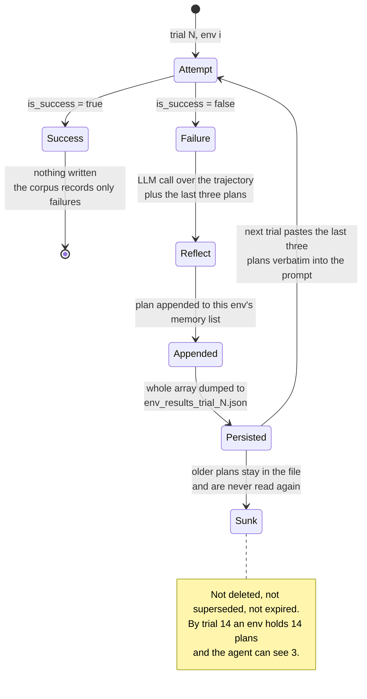

## 1. Executive Summary

Reflexion is the reference implementation of
[*Reflexion: Language Agents with Verbal Reinforcement Learning*](https://arxiv.org/abs/2303.11366)
(Shinn, Cassano, Berman, Gopinath, Narasimhan and Yao, NeurIPS 2023). Its
proposition is that an agent which fails a task should write down, in English,
what it should have done — and that this text, fed back on the next attempt, is
a usable substitute for a gradient. Four harnesses implement it: AlfWorld and
WebShop (embodied and web tasks), HotPotQA (multi-hop reasoning), and code
generation against HumanEval, MBPP and LeetCode.

Whether it belongs in this atlas at all is a real question, and the answer
differs by harness. The HotPotQA and code-generation paths keep reflections in a
Python list on an object that dies with the process — that is
[conversation-window management](../../compare/#not-in-scope-conversation-window-management)
wearing a different hat, and it is out of scope. **The AlfWorld and WebShop paths
are in scope**, and only just: `main.py` dumps a list of `env_configs` —
`{name, memory, is_success, skip}` — to `env_results_trial_N.json` after every
trial, and `--is_resume` loads that file into a fresh process and carries on. A
plan written on Monday is read by a process started on Tuesday. That is memory
outliving a session, stored, retrieved later, and scoped to a task.

What makes it worth reading is not the mechanism's sophistication — there is
almost none — but its extremity. Reflexion is the minimum viable memory system:
no embeddings, no search, no schema, no identity beyond a list position, no
update, no delete. It stores strings and pastes the last three into the prompt.
And with that it takes AlfWorld from 62.7% to 100% over fifteen trials, in run
logs committed to the repository.

Three properties of that minimum are worth carrying away, and two of them are
warnings. **Memory is written only on failure** — `update_memory` skips every
environment where `is_success` is true, so the corpus is exclusively a record of
things that went wrong. **Nothing is ever retracted**: a plan produced by a
wrong diagnosis stays in the list forever, and the only thing that removes its
influence is three newer plans pushing it out of the `[-3:]` window. And the
store grows without bound behind that fixed window, so by trial 14 an
environment can hold fourteen plans of which eleven are unreachable — present in
the file, invisible to the agent, and still costing nothing but confusion to
whoever reads the JSON later.

## 2. Mental Model

A memory is a **plan**: one paragraph of natural language, produced by asking a
model to look at a failed trajectory and "devise a concise, new plan of action
that accounts for your mistake with reference to specific actions that you
should have taken", answered after the literal token `Plan`.

It has no id, no timestamp, no author, no confidence and no link to the
trajectory that produced it. Its identity is *the environment it is filed under
and its position in that environment's list*. Its scope is that environment and
nothing else — not by a key that gets filtered, but by containment: the list
lives inside the `env_config` dict, so there is no way to read another
environment's plans because there is no query surface at all.

The state machine has two transitions, and the notable thing is what is missing
from it:

```text
trial N runs        ->  succeeded?  yes -> nothing is written, ever
                                    no  -> one LLM call over the trajectory
                                           + the last three plans
                                        -> new plan appended

trial N+1 starts    ->  the last three plans are pasted into the prompt
                        (plans 1 .. n-3 are still on disk, and unreadable)
```

There is no supersede, no correct, no expire, no decay and no delete. A memory
does not die; it sinks. And because the reflection prompt itself receives
`memory[-3:]`, a bad plan influences the next three plans written after it, then
stops mattering — a decay mechanism nobody designed, implemented as a slice.

Memory is entirely agent-generated and entirely uncurated. Nothing verifies that
a plan is correct, nothing checks whether following it helped, and the system
treats every plan as advice worth taking. There is exactly one signal in the
loop — `is_success` — and it gates *whether to write*, never *whether what was
written was any good*.



## 3. Architecture

Four sibling directories, no shared package, no installable module. Each is a
research harness with its own `requirements.txt`, its own copy of the utility
functions, and its own slightly different implementation of the same idea.

- **`alfworld_runs/`** — `main.py` (trial loop and persistence),
  `alfworld_trial.py` (the ReAct rollout), `generate_reflections.py`
  (`update_memory`), `env_history.py`, and `root/` with committed run logs.
  Depends on the AlfWorld environment and a `base_config.yaml`.
- **`webshop_runs/`** — the same four files against the WebShop environment,
  with four committed log directories.
- **`hotpotqa_runs/`** — `agents.py` (`ReactAgent`, `ReactReflectAgent`,
  `CoTAgent`), `react.py`, `prompts.py`, `fewshots.py`, plus notebooks. The
  reflection strategies are an enum: `NONE`, `LAST_ATTEMPT`, `REFLEXION`,
  `LAST_ATTEMPT_AND_REFLEXION`.
- **`programming_runs/`** — `main.py` dispatching to `simple.py`,
  `reflexion.py`, `immediate_reflexion.py`, `immediate_refinement.py` and
  `reflexion_ucs.py`, with `generators/` (Python and Rust), `executors/`, and a
  vendored `human-eval`.

Persistence, where it exists, is `json.dump` of a list of dicts. There is no
database, no index, no embedding model and no vector store anywhere in the
repository. Retrieval, in the sense this atlas uses the word, does not occur.

### Deployment and ergonomics

- **What has to be running:** an OpenAI key, and for AlfWorld and WebShop the
  respective simulator, which is the expensive part. `programming_runs`
  additionally executes generated code — the executors run untrusted model
  output.
- **Nothing runs offline** — every trial and every reflection is an API call.
- **The store is a human-readable JSON array** and trivially hand-editable,
  which is the right shape for a research artifact: deleting a bad plan means
  opening the file.
- Install is per-directory `pip install -r requirements.txt`; running is one of
  the shell scripts with a trial count, an environment count and a run name.
- The dependency era is 2023: `openai.ChatCompletion`, `text-davinci-003` as a
  default model, and pinned-nothing requirements files.

The screen of this checkout found one auto-run surface (`.gitmodules` — the
`--recursive` clone pulls further trees), one build-time execution point
(`programming_runs/human-eval/setup.py`), and three unpinned dependency
surfaces including `torch`, `transformers` and `accelerate` at any version.
Nothing was installed and nothing was run; the committed logs were read from
git.

## 4. Essential Implementation Paths

- **Trial loop and persistence** — `main()` in `alfworld_runs/main.py:29`.
  Initializes `env_configs` as `{name, memory: [], is_success: False, skip:
  False}` per environment, or loads them from
  `env_results_trial_{start-1}.json` when `--is_resume` is set. After each
  trial it calls `update_memory` (gated on `--use_memory`) and dumps the whole
  array.
- **Reflection generation** — `update_memory()` in
  `alfworld_runs/generate_reflections.py:30`. Splits the trial log on
  `#####\n\n#####`, asserts one segment per env config, and for each
  unsuccessful, unskipped environment calls the model once and appends the
  result.
- **The reflection prompt** — `_generate_reflection_query()` at
  `generate_reflections.py:12`. Two few-shot examples, the trajectory with
  everything before "Here is the task:" stripped, then `Plans from past
  attempts:` listing `memory[-3:]` as `Trial #i:`, then `New plan:`.
- **Injection** — `alfworld_run()` in `alfworld_runs/alfworld_trial.py:46`,
  which builds an `EnvironmentHistory` from the base prompt, the observation and
  `memory[-3:]`. Reached from `run_trial` at `:125`, which passes
  `env_config["memory"] if use_memory else []`.
- **The in-process variant** — `ReactReflectAgent.reflect()` in
  `hotpotqa_runs/agents.py:106`, which branches on a `ReflexionStrategy` enum
  and rebuilds `self.reflections_str`. Nothing here touches disk.
- **The per-item variant** — `run_reflexion()` in
  `programming_runs/reflexion.py:8`. `reflections = []` is re-initialized inside
  the dataset loop, so reflections never cross a problem boundary; they are
  written to the results file as `item["reflections"]` for inspection, and
  `enumerate_resume()` in `programming_runs/utils.py:50` resumes by counting
  completed lines, not by reloading them.
- **Delete path** — none, in any harness.
- **Tests** — none, in any harness.

## 5. Memory Data Model

The entire schema:

```json
{ "name": "env_0", "memory": ["…plan…", "…plan…"], "is_success": true, "skip": false }
```

`memory` is an array of strings. That is the whole data model. There is no
timestamp, no id, no provenance link back to the trajectory that produced the
plan, no version, no confidence, and no separation between episodic and semantic
material — a plan *is* the only kind of memory that exists.

Scoping is by position in an array. `env_configs[i]` corresponds to the *i*-th
environment the harness enumerates, and `update_memory` asserts
`len(env_logs) == len(env_configs)` to keep the trial log aligned with it. The
`name` field is `f'env_{i}'`, derived from the same index rather than from
anything about the task, so a run with a different environment ordering
reassociates every memory silently. This is the failure mode that makes the
atlas ask for stable ids, and here there is not even a candidate for one.

Two omissions shape everything downstream. **There is no record of success**, so
the store cannot answer "what worked here" — only "what I got wrong, three
times ago". And **there is no link from a plan to its outcome**, so nothing can
ever establish that a plan was bad; the loop that would let verbal
reinforcement learn from its own reinforcement is not closed.

The committed logs show what the model looks like in practice. Across the
fifteen AlfWorld trials, the `memory` arrays grow monotonically to a maximum of
14 entries with a mean of 1.49 — most environments are solved early and never
write again, while a handful of hard ones accumulate a plan per trial.

## 6. Retrieval Mechanics

There is none, and saying so precisely is the point.

The read path is `memory[-3:]`. No query is formed, no similarity is computed,
nothing is ranked, nothing is filtered, and the agent has no way to ask for
anything. The three most recent plans for this environment are concatenated
into the prompt with `Trial #i:` labels and that is the complete retrieval
mechanism.

The window appears twice, written slightly differently each time — as
`if len(memory) > 3: env_history = EnvironmentHistory(..., memory[-3:], ...)`
in `alfworld_trial.py:47` and as an `if/else` assigning the same slice in
`generate_reflections.py:38`. Both are equivalent to an unconditional
`memory[-3:]`.

Because injection is unconditional, the token cost is bounded and predictable —
three paragraphs — and does not grow with history. That is a real property most
retrieval-based systems lose. What it costs is relevance: the three most recent
plans are used whether or not they bear on the current failure, and a plan that
solved the problem four trials ago is not preferred over one written in the last
trial about a different mistake.

The failure mode is therefore neither over-recall nor under-recall in the usual
sense. It is that **the correct memory can become unreachable while remaining
stored**. An environment that fails eleven times has eleven plans on disk, and
if the useful one was written first, no mechanism in the system can ever surface
it again.

## 7. Write Mechanics

Writes are synchronous and between trials. `run_trial` returns, `update_memory`
makes one LLM call per failed environment in sequence, and only then does the
next trial begin. For a run with 134 environments and a low success rate, the
inter-trial gap is fifty-odd serial completions with no concurrency and no
batching — the reflection pass, not the rollout, is often the wall clock.

The trigger is `if not env['is_success'] and not env['skip']`. Success writes
nothing. This is a deliberate and defensible choice for a benchmark — you only
need advice where you failed — and it is the choice that makes the resulting
store useless as a knowledge base. Nothing in it records that anything ever
worked.

There is no deduplication: an environment that fails the same way twice gets two
near-identical plans, both of which then occupy slots in the three-item window.
There is no conflict handling, because there is no notion of two plans
disagreeing. There is no filtering of any kind on the generated text.

Persistence is a whole-file rewrite of the env-config array after each trial,
non-atomic, to a path that the harness first truncates
(`open(trial_env_configs_log_path, 'w').close()`). A crash between the truncate
and the dump leaves that trial's file empty, though the previous trial's file
survives and is what `--is_resume` reads.

Lag before a memory is retrievable is exactly one trial boundary, by
construction. Nothing rewrites the store wholesale beyond that per-trial dump,
and the token cost of the reflection pass scales with the number of *failing*
environments, which is the right thing for it to scale with.

## 8. Agent Integration

None. This is four benchmark harnesses, not a library: no package, no
`setup.py` at the root, no API, no MCP server, no framework adapter. Adopting
Reflexion means reimplementing it, which — given that the mechanism is a list
and a slice — is the correct outcome and takes about an hour.

The agent has no agency over its memory. It cannot choose to remember, cannot
choose to forget, and cannot query. It receives plans in its prompt and writes
one when the harness asks it to, in a separate call with a separate prompt. The
separation is clean and worth noting: the *acting* model never decides what
goes into memory, and the *reflecting* model never acts.

The HotPotQA harness exposes the one dial: `ReflexionStrategy` with `NONE`,
`LAST_ATTEMPT` (re-show the previous trajectory), `REFLEXION` (show generated
reflections) and `LAST_ATTEMPT_AND_REFLEXION` (both). That enum is the cleanest
statement in the repository of what is being claimed — that a *reflection* beats
a *transcript* — and it is the comparison a reader adopting the idea should run
first.

## 9. Reliability, Safety, and Trust

Provenance is absent by construction: a plan is a bare string in an array, with
no link to the trajectory it was derived from, no model identifier, and no
timestamp. The trial logs contain the trajectories, but nothing connects a plan
to its source segment except the order in which the file was written.

There is no trust model. A plan produced from a hallucinated reading of a
failure — "I should have opened the drawer before checking the shelf", when the
drawer was never there — is stored verbatim and injected as instruction on the
next three attempts, and it also becomes context for the *next three plans
written*, so a confident misdiagnosis propagates forward through the reflection
prompt. Nothing detects this and nothing can undo it.

The correctness of the whole pipeline rests on one alignment assertion:
`assert len(env_logs) == len(env_configs)` in `update_memory`, splitting the
trial log on a literal `#####\n\n#####` delimiter. Any trajectory whose text
contains that delimiter, or any environment that failed to log, shifts every
subsequent plan onto the wrong environment. The assertion catches a count
mismatch and nothing else — a compensating pair of errors passes silently, and
the corruption is then persisted and inherited by every later trial.

There is no auth, no multi-tenancy and no privacy consideration; this is
single-user research code. Concurrency is not handled and not needed. Data-loss
risk is confined to a crash inside the per-trial dump.

`programming_runs` executes model-generated code to test it, which is the
expected shape for a code benchmark and worth stating plainly for anyone
cloning it.

## 10. Tests, Evals, and Benchmarks

There are no unit tests anywhere in the repository.

The evaluation *artifacts*, on the other hand, are unusually complete for a
research release: the AlfWorld and WebShop directories ship the actual
per-trial env-config JSON from real runs. `alfworld_runs/root/` holds
`reflexion_run_logs/` with fifteen trials over 134 environments and
`base_run_logs/` with seven, plus the corresponding `world.log` and per-trial
transcripts. WebShop ships four run directories.

Read out of the committed files, the reflexion run's success trajectory over 134
environments is:

| Trial | 0 | 1 | 2 | 3 | 4 | 6 | 8 | 10 | 12 | 14 |
| --- | ---: | ---: | ---: | ---: | ---: | ---: | ---: | ---: | ---: | ---: |
| Solved | 84 | 103 | 111 | 113 | 117 | 123 | 128 | 130 | 131 | 134 |
| Rate | 0.627 | 0.769 | 0.828 | 0.843 | 0.873 | 0.918 | 0.955 | 0.970 | 0.978 | 1.000 |

The `base_run_logs/` run over the same 134 environments plateaus: 0.627, 0.701,
0.724, 0.731, 0.746, 0.754, 0.754.

**That comparison is weaker than it looks, and the reason is a reproducibility
gap worth naming.** The env-config files in `base_run_logs/` also contain
accumulated `memory` — up to four plans per environment — so the committed
"base" run was not produced with reflection disabled, at least not by the code
at this commit, where `--use_memory` gates generation and injection together.
The scripts in the tree do not resolve it either: `run_simple.sh` is the
no-memory configuration and it writes to `base_run_logs_gpt_35_turbo`, a
directory that does not exist here, while `run_reflexion.sh` names
`reflexion_run_logs`, which does. **The env-config format records no flags, no
model and no timestamp**, so the artifact that would say what was ablated is the
one artifact the harness does not write. Two runs are committed, they differ,
and the tree cannot say in what.

The claimed results live in the paper ([arXiv:2303.11366](https://arxiv.org/abs/2303.11366),
NeurIPS 2023): 91% pass@1 on HumanEval against GPT-4's 80%, and a 22-point
absolute improvement on AlfWorld over 12 iterative learning steps. Those numbers
are not reproduced by anything in this repository, and the committed logs are a
different run at a different scale.

Before trusting the mechanism, a reader would want: an ablation of the
three-item window against one and against unbounded, which nothing here runs; a
measurement of whether a plan's presence correlates with solving the environment
it was written for; and the log-format record of run parameters that would let
the two committed runs be compared at all.

## 11. For Your Own Build

### Steal

**Separate the acting model from the reflecting model.** Two prompts, two calls,
two jobs. The agent that just failed is the worst-placed thing to decide what
the lesson was while it is still holding the failed context, and splitting them
also means you can use a cheaper model for one and change either independently.

**Write memory only where there is a signal.** Reflexion writes on failure
because failure is the signal it has. The transferable rule is the shape: tie
the write trigger to an outcome your harness actually observes, rather than
extracting from every turn on principle. Most memory systems in this atlas
write constantly and know nothing about whether any of it helped.

**Bound the injected window rather than the store.** A fixed `[-3:]` gives a
predictable token cost per turn and a prompt prefix that does not grow with
history — properties that ranked retrieval usually gives up. If your corpus is
small and strongly scoped, this is a legitimate design rather than a shortcut.

**Feed the existing memories into the prompt that writes the next one.** The
reflection query includes `Plans from past attempts`, so the model is asked for
something new rather than restating what it already said. It is a two-line change
and the cheapest deduplication available.

### Avoid

**Do not let a store grow behind a fixed read window with no eviction.** Either
the old entries matter, in which case you need retrieval, or they do not, in
which case you should delete them and say so. Keeping them means the file grows
forever, an operator reading it sees content the agent cannot, and nobody can
tell the difference between a memory that was forgotten and one that sank.

**Do not derive a memory's scope from an array index.** `env_0` is a position,
not an identity. The moment the environment list is reordered, filtered or
resumed at a different length, every memory is silently attached to the wrong
task — and the only guard is an assertion on list length, which a reordering
passes.

**Do not write a store whose entries have no provenance and no outcome.** A
lesson with no link to what produced it and no record of whether following it
helped cannot be evaluated, corrected or retracted. The reinforcement in
"verbal reinforcement learning" is open-loop.

**Record run parameters inside the run artifact.** Two committed result sets
that cannot be told apart is the failure this repository actually demonstrates,
and it costs one dict of flags per file to avoid.

### Fit

Nobody should adopt this codebase — it is four unpackaged 2023 research
harnesses pinned to a removed OpenAI API — but the pattern is worth adopting
deliberately, and the conditions under which it works are visible in the logs.

It fits when a task is *retried*: same environment, same goal, bounded number of
attempts, an observable success signal, and a small enough scope that three
paragraphs of advice are plausibly the three that matter. Coding agents
retrying a failing test, an evaluation harness sweeping a fixed task set, and
any loop with a verifier are the natural homes.

It does not fit a long-lived assistant. There the tasks are not repeated, there
is no success signal to gate the write, the scope is a user rather than an
environment, and the corpus outgrows a three-item window on the first day —
which is the point at which you need everything Reflexion deliberately does not
have.

## 12. Open Questions

- What produced `alfworld_runs/root/base_run_logs/`? Its env configs carry
  memory, which the code at this commit only writes when `--use_memory` is set,
  and no script in the tree names that output directory.
- Why does the base run's memory stop growing after trial 3 while its success
  rate continues to creep up? Neither the code nor the logs record enough to say.
- Was the three-plan window chosen empirically? It appears as a bare literal in
  two files and is not discussed in the README.
- Does the `#####\n\n#####` delimiter ever appear inside a trajectory in
  practice? If it does, the alignment assertion would not catch it and the
  memories would be misfiled.
- Do the WebShop run directories numbered `_1` and `_2` represent seeds,
  configurations, or reruns? Nothing in them distinguishes the pairs.

## Appendix: File Index

**Persistence and trial loop**

- `alfworld_runs/main.py` — env-config initialization, `--is_resume` load, per-trial `json.dump`.
- `webshop_runs/main.py` — the same loop against WebShop.

**Write path**

- `alfworld_runs/generate_reflections.py` — `update_memory()`, `_generate_reflection_query()`, the `memory[-3:]` slice.
- `webshop_runs/generate_reflections.py` — the WebShop equivalent.
- `alfworld_runs/reflexion_few_shot_examples.txt`, `webshop_runs/reflection_few_shot_examples.txt` — the two few-shot examples in the reflection prompt.

**Injection**

- `alfworld_runs/alfworld_trial.py` — `alfworld_run()`, `run_trial()`, the second `memory[-3:]`.
- `alfworld_runs/env_history.py`, `webshop_runs/env_history.py` — prompt assembly.

**In-process variants (out of scope)**

- `hotpotqa_runs/agents.py` — `ReactReflectAgent`, `ReflexionStrategy`, `self.reflections`.
- `programming_runs/reflexion.py`, `immediate_reflexion.py`, `reflexion_ucs.py` — per-item reflection lists.
- `programming_runs/utils.py` — `enumerate_resume()`, which resumes by count.

**Committed run artifacts**

- `alfworld_runs/root/reflexion_run_logs/env_results_trial_0..14.json` — fifteen trials, 134 environments.
- `alfworld_runs/root/base_run_logs/env_results_trial_0..6.json` — the comparison run.
- `webshop_runs/{base,reflexion}_run_logs_{1,2}/` — four WebShop runs.

## History

**2026-08-14** — [`218cf0ef1df84b05ce379dd4a8e47f17766733a0`](https://github.com/noahshinn/reflexion/commit/218cf0ef1df84b05ce379dd4a8e47f17766733a0) — first reading, at a commit dated 13 January 2025. Screened before opening: one auto-run surface (`.gitmodules`), one build-time execution point (`programming_runs/human-eval/setup.py`), three unpinned dependency surfaces. Nothing was installed or run; the success trajectories in section 10 were computed from the committed JSON, not reproduced.
