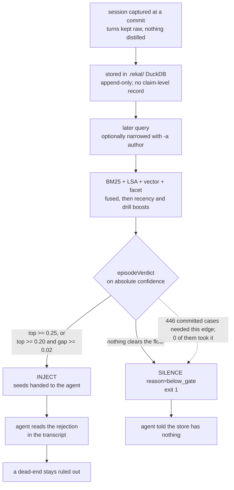

## 1. Executive Summary

Rekal is a Go CLI that captures an AI coding session at every git commit,
stores it raw in a `.rekal/` directory inside the repository, and moves it to
teammates over the `git push` they already run. Its best idea is a recall
citation graph that ranks on what agents opened rather than on what the ranker
surfaced. Its weakness is measured and committed beside the code: the verdict
meant to say "nothing here" fired on none of 446 questions that needed it.

There is no server, no account and no memory service. The embedding model, the
inference engine, the database and the full-text extension are compiled into
one ~170 MB binary, so recall works offline. The licence is Apache-2.0.

The citation graph records every session an agent reached and every session an
agent opened, keeps the two counts in separate columns, and ranks on only the
second. The reasoning is written where it is implemented: a recall edge "only
says the engine ranked this session into some window — its own past output,
which is why feeding it back into ranking is a loop." The comment carries the
measurement that produced it: 741 recall edges against 6 drills, 36 of 37
sessions "reached", and the top slot held by a three-turn session.

Recall emits a verdict — `INJECT`, `KNOWLEDGE` or `SILENCE` — and `SILENCE` is
the answer for a question the store cannot support. `scripts/industry-bench/runs/`
holds two scored LoCoMo runs of 1,888 questions each. Both report
`gates: {"INJECT": 1888}`. Of those questions 446 are adversarial, with no
answer in the corpus and a gold verdict of silence. Both runs record
`want_silence_pass: 0`. The 0.7638 pass rate is carried entirely by the 1,442
answerable questions, every one of which passed.

The measured gate is the shipped gate. The run's `eval.log` records the floors
it used — `CONF_MIN=0.25 CONF_SOFT=0.2 GAP_MIN=0.02` — and those are the
defaults `digestConfMin`, `digestConfSoft` and `digestGapMin` return.
`digest.go`'s header calls itself "the in-binary port of the skill's
`route.py`", and the verdict rule in that script is the same three branches
(section 10).

Two marks. `negative_eval` is earned on the 446 cases. `scope_enforced` is
earned on the author email every session row carries, which `rekal -a <email>`
applies on both recall paths; it is optional, and without it every teammate's
sessions are candidates. The other five are withheld, each for a reason in
section 9. The most instructive is `tombstone`: the README promises that
"dead-ends already ruled out stay ruled out; nobody re-proposes them", and the
only thing in the tree named for it is a wire constant with no producer.

## 2. Mental Model

A memory is a whole conversation, kept whole. Rekal does not extract facts,
summarise sessions into claims, or distil anything up front — the README makes
the refusal explicit against hosted memory layers, whose memories are
"distilled lossily up front". What is stored is the transcript: turns, roles,
tool calls, the files touched, and the commit it ended at.

That choice moves all of the judgement to read time, and it is where the design
lives or dies. Nothing in the store says a claim inside a session was wrong,
because the store holds conversations rather than claims. What makes a rejected
approach "stay rejected" is that recall surfaces the conversation where it was
rejected. There is no rejected-value record, and there is nothing to consult
before proposing something again — the guarantee is entirely a retrieval
guarantee.

Which is why the gate matters more here than in a system with an epistemic
layer. Recall returns a window of seeds with a per-seed confidence and one of
three verdicts. `INJECT` says relevant sessions were found. `KNOWLEDGE`
says the answer is in tracked files rather than in a conversation. `SILENCE`
says nothing cleared the floor, and it exits 1. The chain from the README's
promise to the code runs through that verdict: a dead-end stays ruled out only
if a later query retrieves the session containing it, and the system is honest
about an empty answer only if `SILENCE` can fire.



## 3. Architecture

One binary and a directory. `rekal init` installs a git hook and writes one
marked line into `CLAUDE.md`; from then on every commit captures whatever
sessions produced it. The store is `.rekal/` inside the repository, and it is
the repository that moves it: sessions are encoded into a compressed frame
format and pushed to an orphan branch named `rekal/<email>`, one per author
(`gitx/git.go:268`). `rekal sync` fetches every `rekal/*` branch into the local
index (`transport/sync.go:24`).

Inside `.rekal/` the split is deliberate and load-bearing. `data.db` is the
permanent DuckDB store of sessions, turns, tool calls, checkpoints and the
recall citation graph. `index.db` is derived and rebuildable — facets,
full-text, embeddings, and the aggregated reach counts. The compatibility
document freezes the store format, wire format, command surface and exit codes
under the version number while deliberately leaving ranking and `index.db`
unfrozen, so retrieval can keep changing without a major version.

What an operator stands up is nothing. There is no service, no model download on
first run, and no API key: the embedding model ships inside the binary as a
compressed `nomic-embed-text-v1.5` in Q8_0, with a small local daemon around it,
and DuckDB and the full-text extension are linked in. The cost is the binary —
~170 MB to download, ~200 MB on disk — and the project states that trade in the
quick-start rather than burying it.

Three tables are local-only by design and never cross the wire: `recall_edges`,
`checkpoint_state`, and `merge_gate_cache`. Each carries a comment saying why.
The merge-gate cache is the clearest: it "is a record of what this machine's git
could see, which says nothing useful to anyone else."

## 4. Essential Implementation Paths

- **Capture** — the commit hook collects sessions from whichever agent wrote
  them (`session/claude.go`, `codex.go`, `copilot.go`, `cursor.go`,
  `gemini.go`, `kiro.go`, `opencode.go`), each adapter normalising into the
  same `Turn`/`ToolCall` shape in `session/parse.go`. `checkpoint.go` stamps
  the committer's `user.email` and the capture clock on the row (`:110`,
  `:235`).
- **Scrub** — `scrub/secrets.go` and `scrub/paths.go` run before storage:
  pattern and entropy secret detection, and home-path anonymisation that
  replaces the current username with `user_<8hex>` derived from a SHA-256.
- **Recall** — `search/search.go` (1,873 lines) fuses BM25, LSA and vector
  similarity by configured weight, adds a max-normalised facet term over tool
  paths and steering text, then a min-max-normalised recency term and a
  max-normalised drill term before a subagent discount. The `-a`, `-A`, `-c`
  and `-p` filters apply in `buildFilterWhere` and `buildResults`
  (`:845-871`, `:1150-1172`).
- **Gate** — `digest.go:45` `episodeVerdict` sorts candidate confidences and
  returns `pass` when the top clears `CONF_MIN` (0.25) or clears `CONF_SOFT`
  (0.20) with a gap of at least `GAP_MIN` (0.02); otherwise `silence`.
- **Citation graph** — `graph/graph.go` appends one NDJSON edge per reached
  session to a lock-free spool so the hot recall path never takes DuckDB's
  single writer; the spool drains into `data.db.recall_edges` at the next
  checkpoint, which already holds that writer.
- **Export** — `transport/export.go:146` `filterMerged` drops checkpoints whose
  commits are not reachable from the mainline tip, so unmerged work never
  leaves the machine.

## 5. Memory Data Model

`sessions` carries `id`, `parent_session_id`, `session_hash`, `captured_at`,
`actor_type`, `agent_id`, `user_email`, `branch`, `source`, `team_name`,
`workflow_name`, `agent_type`, `description` and `spawn_depth`. `turns` carries
role, content, order and a timestamp. `checkpoints` carries the commit sha,
branch, author, timestamp and an `exported` flag. `session_facets` in
`index.db` repeats the session columns and adds `origin`, which labels sessions
imported from other repositories.

There is one time axis the ranking reads, and on the commit path it is the
capture clock. `checkpoint.go` sets `capturedAt := time.Now().UTC()` and writes
that into `sessions.captured_at` for every adapter (`:235`, `:264`). An
appended conversation keeps the row it was first captured into, so the value is
the first capture. Export and sync carry the same value to teammates.

The adapters compute something else, and the commit path discards it. Copilot
sets `payload.CapturedAt` to the earliest event time, with the comment
"captured_at is the session's real start, the earliest event time — not the
ingestion wall clock". Gemini uses the transcript's `StartTime` and Kiro the
sibling metadata's `created_at`. Claude, Codex, Cursor and OpenCode set
`time.Now().UTC()`. The only writer that reads `payload.CapturedAt` is the
cross-repo import (`local_import.go:177`), so an index built with
`rekal index --include-all` mixes the capture clock for this repository's
sessions with a conversation start for three imported adapters and the import
clock for four.

The real event time is not lost: `turns.ts` holds it, and `rekal query` exposes
SQL over it with a documented example filtering a date range. It is not joined
against a record-time axis, and the recorded search finds no as-of read in the
Go sources.

`session_supersedes` maps `old_session_id` to `survivor_session_id`. Its comment
places it precisely: it exists so that when duplicate copies of one conversation
collapse, the reach counts keyed to whichever copy was surfaced at the time fold
onto the survivor, rather than "a heavily used conversation read[ing] as never
used the moment its copies collapse". It is duplicate reconciliation, not a
judgement that anything was wrong.

## 6. Retrieval Mechanics

Three arms are fused by weight — BM25 at 0.35, LSA at 0.10, semantic at 0.55 in
`DefaultWeights` (`search/weights.go:81-92`) — over a window of 20 seeds. The
benchmark calibration file carries a different mix, 0.3/0.2/0.5 with the facet
layer at 0.1 (`calibration/skill-default.json:10`). That difference does not
reach the gate, because absolute confidence takes the maximum of the saturated
BM25, LSA and cosine scores rather than their weighted sum
(`search/confidence.go:75-90`).

Three additive layers then reorder within the retrieved set. `FacetBoost` ships
0.3 and scores BM25 over each session's tool paths, command prefixes and
steering text. It is the one layer that also feeds absolute confidence, as a
fixed `0.15 * saturate(facet)` term (`confidence.go:85`).

`RecencyBoost` ships 0.15 and is "inert whenever the candidate set shares a
timestamp (span 0)". `ReachBoost` ships 0.2 and is the interesting one. It reads
`session_reach.drill_count` — the edges where an agent chose to open a session —
and not `reach_count`, which counts every edge including the ones this engine
produced itself. The rationale is given twice, in the schema and at the loader,
and the second copy carries the numbers: a recall returns 20 seeds, so "on any
store smaller than a few hundred sessions one query marks most of the corpus
(measured: 36 of 37 sessions reached, top slot a three-turn session, an empty
session at 36)." Both of these carry the sentence "Never feeds absolute
confidence."

That is a real and reusable correction. A usage signal derived from the ranker's
own output is a feedback loop, and the separation here is between evidence the
ranker manufactured and evidence it did not. Both counts stay in the table; only
the one from outside the ranker reaches ranking. One cosmetic leftover: the
function that loads the drill count is called `loadReachCounts`, and its doc
comment has to say it reads the other column.

The gate runs on absolute confidence, never on the normalised score, which is
the right choice — a max-normalised top score is 1.0 whether the match is good
or the best of a bad set. `config.go` states that "RecencyBoost/ReachBoost never
feed the silence gate".

## 7. Write Mechanics

Capture is synchronous with the commit and cheap by construction: the recall
spool is a file append precisely so the hot path never contends for DuckDB's
single writer, and the drain happens at checkpoint time when that writer is
already held. Indexing and embedding run in a background pass; the knowledge
layer keys its watermark to the commit sha it was last built at, so a recall
whose HEAD matches skips the refresh after one `rev-parse` and a mismatch
re-chunks only files whose blobs changed.

Sessions are append-only. When a conversation continues past a commit, the next
capture checks that the stored turns are a prefix of the transcript and appends
the new turns to the existing row, which it leaves untouched
(`checkpoint.go:203-216`, `:258-261`). There is no consolidation pass that
rewrites stored memories and no summarisation step — the transcript that was
captured is the transcript that is retrieved, which is the point.

Scrubbing happens before storage rather than before transmission, so a secret
never reaches the database, let alone the wire. The path anonymiser hashes the
current username into `user_<8hex>` and rewrites both macOS and Linux home
layouts plus their hyphenated variants.

The export gate is the other write-shaped decision. `filterMerged` runs on the
push path and keeps a checkpoint only when its commit is reachable from the
mainline tip, and the verdicts are cached on `(git_sha, target_tip,
gate_version)`. The key includes the tip "because the answer genuinely changes
when the mainline moves: work that was unmerged at one tip may have landed by
the next", and the version because "a cache that outlives the reasoning behind
it is worse than no cache".

## 8. Agent Integration

`rekal init` writes one marked line into `CLAUDE.md` telling the agent to recall
before non-trivial work — and that line is where the product promise actually
lives. It says recall "returns the why, the decisions, and the dead-ends already
ruled out". No Go code extracts decisions or dead-ends; the sentence is a
description of what a retrieved transcript contains.

The shipped skill is prose plus two shell scripts. `SKILL.md` and
`references/ledger.md` tell the agent how to read the verdict, and they are
candid that it is advisory: "`INJECT`/`SILENCE` are **recommendations**, biased
toward more data than" the alternative. The guidance around abstention is
careful — "a weak seed is not absence — before concluding SILENCE, re-search
once", and "Only conclude SILENCE after a genuinely different re-search also
comes back" empty. Read against the benchmark, that instruction is carrying more
weight than it looks: the model is being asked to supply the abstention the gate
does not.

The one distilled tier is agent-written. `references/wiki.md` has the agent
summarise sessions into `docs/wiki/<topic>.md` pages listing "key decisions with
session/commit pointers", and says "Merge is the admission gate". The gate is
`scripts/wiki-gate.sh`, which exits 1 on the default branch, run by the agent
itself. Merged pages reach recall through the KNOWLEDGE layer, which indexes
prose from `git ls-tree -r HEAD` (`knowledge_index.go:16-19`).

Adapters cover Claude Code, Cursor, Copilot, Codex, Gemini, Kiro and OpenCode,
which is unusually broad, and the OpenCode adapter is the only place SQLite
appears — it reads that tool's store, rather than being one of Rekal's own.

## 9. Reliability, Safety, and Trust

**Negative eval — earned.** The 446 committed adversarial cases, the scored
result, the positive control and the corpus's producer are in section 10.

**Scope enforced — earned, on an optional key.** Every captured session row
carries the committer's email from `git config user.email`
(`checkpoint.go:110`, `:262-264`), and sync carries each teammate's email into
`session_facets` (`transport/sync.go:242`, `:326`). `rekal -a <email>` applies
it as `user_email = $n` in filter-only mode and as a per-candidate check in
hybrid mode, before grouping and before the gate (`search/search.go:855-858`,
`:1154`).

The limits are the mark's width. The key applies only when a caller passes it;
without `-a` every synced teammate session is a candidate. The KNOWLEDGE line,
`rekal find`, `query -s` and raw `query` SQL ignore it. The `--explain`
related-session join lists other sessions' ids without it
(`search/search.go:1268-1306`). No committed test seeds a second author and
asserts exclusion. Imported cross-repo sessions carry a NULL email, so `-a`
excludes them.

The privacy boundary the project names is a different mechanism and a stronger
one for its threat. "An unmerged spike never leaves your machine" is enforced on
egress: `filterMerged` is called only from `transport/export.go`, on the two
push paths. `branch` is stored on the session facet and no recall predicate
reads it.

**Tombstone — withheld, and the near-miss is exact.** The README's second bullet
is "Stop re-deciding — dead-ends already ruled out stay ruled out; nobody
re-proposes them." The mark asks for a durable record of a rejected value, keyed
on the value. There is none: the store holds conversations, not claims, and
nothing is consulted before an approach is proposed again. The one identifier in
the tree named for the mechanism is `FrameTombstone FrameType = 0xFF` in
`codec/body.go:44`, and it occurs exactly once in the repository — its own
declaration. No encoder emits it, no decoder branches on it, and no test
exercises it. It is a reserved wire slot for a deletion that was not built.

**Human review — withheld, with a near-miss outside the Go code.** The wiki
workflow in section 8 holds agent-written decision summaries on a feature branch
until a merge admits them. The gate is prose and a script the producing agent
runs itself, the approver is the git host's pull-request review outside this
tree, and the author's own checkout indexes the unmerged page at HEAD. A search
for `approve`, `review_status`, `adjudicat` and `curate` across the Go sources
returns nothing.

**Audit log — withheld, and the reason is a category the rubric draws.**
`recall_edges` is append-only, permanent, and carefully kept out of the wire.
But it records reads — which sessions an agent reached or opened — not
mutations of the store. A record of which sessions were retrieved cannot turn
out to be false; it happened. The mutation history of this store is git's,
which is a different mechanism.

**Trust state — withheld.** Nothing carries an epistemic status. `actor_type`
distinguishes human from agent and `source` names the tool; neither says whether
anything is true. Confidence is a float that drives the gate and is explicitly
never allowed to be fed by the recency or reach boosts.

**Bitemporal — withheld.** `captured_at` is the only axis the ranking reads, and
section 5 describes what it holds; the recorded search finds no as-of read.

## 10. Tests, Evals, and Benchmarks

The paper is [arXiv:2607.14390](https://arxiv.org/abs/2607.14390), "Why Git Is
the Memory Solution for the Agentic Development Lifecycle", Frank Guo, submitted
15 July 2026. It reports ~0.31 pooled MRR across an eight-corpus retrieval study
against a raw-transcript grep floor and a parsed-turn floor, 0.83 answer
sufficiency on a ~50k-LOC production system, and 382–980 tokens per question. It
also reports that single-shot retrieval scored 0.07–0.20 on real developer
questions, which is the honest number behind the router design.

The benchmark harness is committed, and its artifacts carry this report's
central finding. `scripts/industry-bench/` holds LoCoMo and LongMemEval
normalisers, a scoring shim, a calibration file, and `runs/` with per-question
output. The datasets are fetched by script, but the evaluated rows are
committed: `route.jsonl` holds all 1,888 questions with `question`, `evidence`,
`answerable`, `gold_silence`, `want_gate`, the verdict, `top_conf` and `pass`.

The corpus is built on the shipped capture path. `sh_gen/gen.py` runs
`rekal init`, then per conversation a `git commit` and `rekal checkpoint`, then
`rekal index` (`:109`, `:144`, `:148`, `:252`). So the sessions a wrong
`INJECT` hands over were produced by the same hook a user runs.

`eval_locomo_route.py` states the rule in its header: "Gold silence
(adversarial / abstention) → must SILENCE", and at line 307, "INJECT when an
answer is expected; SILENCE when gold is abstention." Both directions in one
harness is the right shape, and it is why the negative result here is not
vacuous — the same file proves the corpus is retrievable before asking whether
the excluded material stayed out.

The two committed runs agree exactly, and the counts recompute from
`route.jsonl`:

| | lowfloor | knfloor |
|---|---|---|
| questions | 1,888 | 1,888 |
| gates issued | `INJECT: 1888` | `INJECT: 1888` |
| want INJECT / passed | 1,442 / 1,442 | 1,442 / 1,442 |
| want SILENCE / passed | 446 / **0** | 446 / **0** |
| evidence@20 rate | 0.9854 | 0.9868 |
| token saving | 82.85% | 82.87% |

A representative failing row: `conv-26:q153`, category `adversarial`, question
"What did Caroline realize after her charity race?", `evidence: []`,
`answerable: false`, `gold_silence: true`, `want_gate: SILENCE`, `gate: INJECT`,
`n_results: 19`, `top_conf: 0.71`. Nineteen seeds at 0.71 confidence for a
question with no answer in the corpus.

The artifacts landed in
[`6dfd4d5610b48b62f4b2c897e2a04336d931f48c`](https://github.com/rekal-dev/rekal-cli/commit/6dfd4d5610b48b62f4b2c897e2a04336d931f48c)
on 19 July 2026. `route.py` was deleted in
[`873c2bc056626e3e44928afbaa9332f1335f5917`](https://github.com/rekal-dev/rekal-cli/commit/873c2bc056626e3e44928afbaa9332f1335f5917)
on 22 July. Between the two, its diff touches docstrings and output wording, and
`episode_verdict` keeps the floors and the three branches `episodeVerdict`
implements. The one later change to `confidence.go`,
[`79a4a1629f5602885c0e8da3cbeb624f0a5a2fa6`](https://github.com/rekal-dev/rekal-cli/commit/79a4a1629f5602885c0e8da3cbeb624f0a5a2fa6),
drops an argument the function never read.

The harness cannot be re-run at this pin as committed: it exits 2 when `route.py`
is missing (`eval_locomo_route.py:270-272`). The `notes/` directory shows the
team declining the cheap fix. The failed-case autopsy concludes that one case
"needs better retrieval or why-mode assembly, not a lower SILENCE bar."

The Go suite is substantial — 488 test functions, with integration tests for
checkpoint round-trips, recall, sync, schema migration and the codec, including
a 991-line frame test. It was not run here: the screen found a `.claude-plugin/`
marketplace manifest and a configured LFS smudge filter. `go.sum` last changed
on 16 July 2026, outside the seven-day cooldown.

## 11. For Your Own Build

### Steal

- **Split the usage signal by who produced it.** The recall edge is the ranker's
  own output; the drill edge is an agent's decision. Ranking on the first is a
  loop that amplifies whatever surfaced once. Any system boosting on "memories
  you keep returning to" needs this distinction, and most do not have it.
- **Put the measurement in the comment.** "36 of 37 sessions reached, top slot a
  three-turn session, an empty session at 36" is what makes the design decision
  reviewable years later, and it costs one line.
- **Version the cache key with the rule.** `merge_gate_cache` keys on
  `(git_sha, target_tip, gate_version)` because the answer changes when the
  mainline moves and when the rule does — "a cache that outlives the reasoning
  behind it is worse than no cache".
- **Gate on absolute confidence, never the normalised score.** A max-normalised
  top score is 1.0 for the best of a bad set.
- **Scrub before storage, not before transmission.** A secret that never enters
  the database cannot leak from it.
- **Keep the transport out of the derived tables.** Three tables carry an
  explicit comment saying they must never cross the wire, each with its reason.
- **Move team memory with `git push`.** One branch per author and a merge gate
  on export remove the sync service, its availability and its permission model.

### Avoid

- **A verdict whose negative branch is never taken.** `SILENCE` exists, is
  implemented, exits 1, and is documented for the agent — and on the one
  committed measurement that requires it, it fired zero times out of 446. An
  agent that trusts `INJECT` as a signal that relevant material exists is
  trusting a verdict issued 1,888 times out of 1,888.
- **A pass rate aggregated across branches.** Where 76% of cases need only the
  easy branch, the aggregate looks healthy while one branch is dead. Score each
  outcome of a three-way verdict separately.
- **Letting the skill carry the gate's job.** `ledger.md` asks the agent to
  re-search before concluding silence, which is sound advice and the only
  abstention in the system with committed evidence of working.
- **Computing a field the writer drops.** Three adapters derive a session start
  time and the commit capture path overwrites it with the capture clock, so the
  recency prior ranks this repository's sessions and imported ones on different
  clocks.
- **A product promise with no mechanism under it.** "Dead-ends already ruled out
  stay ruled out" is a claim about retrieval recall stated as a claim about
  memory, and the identifier named for the mechanism is unwired. A session where
  the team decided X and a later one reversing it are both retrievable, both
  unmarked.
- **Naming a table for a bug.** `session_supersedes` exists for "the duplicate
  bug", not for supersession, and should not be read as a model of it.
- **An optional scope with no test.** `-a` works on both recall paths, and no
  committed case writes two authors and asserts the second stays out.

### Fit

Take Rekal if your team already lives in git, works in one repository, and wants
the reasoning behind commits available to everyone's agent without operating
anything. The transport is the strongest part of the design: memory that
arrives with `git fetch` needs no sync job and no second source of truth about
who may see what, because the repository already answered both.

It fits badly where memory must contain judgements rather than conversations. If
you need to record that a claim was wrong, that a fact was superseded, or that
an approach is forbidden, none of that exists here, and the raw-transcript
design is against it in principle rather than by omission. Retrofitting
claim-level state would fight the design rather than extend it. It also fits
badly where an agent must be told reliably that nothing is known, which on this
evidence it will not be.

Be deliberate about the binary and the store. ~200 MB on disk per developer is
the price of no service and offline recall, and a per-seat trade. Sessions are
kept raw and append-only with no retention policy, so the store grows with the
repository, and the wire format's reserved deletion frame is unimplemented.

## 12. Open Questions

- Is the 0/446 tracked? The `notes/` directory shows the abstention cases being
  discussed and a lower SILENCE bar being explicitly rejected as the wrong fix,
  so the behaviour appears understood; whether the pass-rate-by-branch split is
  tracked outside these committed artifacts is not visible in the tree.
- Is discarding the adapters' start time on the commit path intended? The
  Copilot comment argues for the start time, and `checkpoint.go` writes the
  capture clock regardless.
- Should `-a` be a default rather than a flag for a team that shares one store,
  and should `find` honour it?
- What is `FrameTombstone` reserved for, and does the store format's version
  guarantee cover a frame type nothing writes?

## Appendix: File Index

**Capture and scrub**

- `cmd/rekal/cli/session/` — `parse.go` (the shared shape), `claude.go`,
  `codex.go`, `copilot.go`, `cursor.go`, `gemini.go`, `kiro.go`, `opencode.go`
- `cmd/rekal/cli/scrub/secrets.go`, `paths.go`
- `cmd/rekal/cli/checkpoint.go` (`:110` the committer email, `:203-216` the
  append check, `:235` the capture clock, `:262-264` the session insert)
- `cmd/rekal/cli/local_import.go` (`:177` the only reader of the adapters'
  `CapturedAt`)

**Store**

- `cmd/rekal/cli/db/schema.go` (`:270` schema meta, `:291` recall edges,
  `:334` sessions, `:468` the email index), `db.go`, `indexer.go`
- `cmd/rekal/cli/db/reach.go` (`:12-35` the two-count rationale, `:64`
  supersedes), `mergegate.go`, `knowledge.go`
- `cmd/rekal/cli/graph/graph.go` — the recall spool

**Retrieval, scope and the gate**

- `cmd/rekal/cli/root.go` (`:207` the `--author` flag)
- `cmd/rekal/cli/search/search.go` (`:845-871` the filter predicates, `:1150-1172`
  the per-candidate filters, `:1268` the related join, `:1443` the drill-count
  loader), `weights.go` (`:46` recency, `:59` reach, `:81-92` defaults),
  `confidence.go` (`:75-90`)
- `cmd/rekal/cli/digest.go` (`:45` `episodeVerdict`, `:207` the INJECT line,
  `:223` the SILENCE line), `recall.go:422`, `query.go`, `find.go`

**Transport**

- `cmd/rekal/cli/transport/export.go:146` — `filterMerged`
- `cmd/rekal/cli/transport/sync.go` (`:24` the `rekal/*` fetch, `:242` and
  `:326` the teammate email), `cmd/rekal/cli/gitx/git.go:268`
- `cmd/rekal/cli/codec/frame.go`, `body.go:44`, `dict.go`

**Benchmark**

- `scripts/industry-bench/eval_locomo_route.py` (`:9`, `:270-272`, `:307`),
  `calibration/skill-default.json`, `datasets/normalize_locomo.py`,
  `normalize_longmemeval.py`, `sh_gen/gen.py`
- `scripts/industry-bench/runs/locomo-route-lowfloor/` and
  `locomo-route-knfloor/` — `summary.json`, `route.jsonl`, `eval.log`
- `scripts/industry-bench/runs/notes/2026-07-17-failed-cases-skill-route.md`

**Agent surface**

- `cmd/rekal/cli/init.go:41` — the CLAUDE.md line
- `cmd/rekal/cli/skill/skills/rekal/SKILL.md`, `references/ledger.md`,
  `references/wiki.md`, `references/reference.md`, `scripts/wiki-gate.sh`

### Commands behind the absence claims

```sh
grep -rn 'FrameTombstone\|0xFF' --include='*.go' .
grep -rni 'tombstone\|rejected_\|blocklist\|denylist\|do not resurface' \
  --include='*.go' cmd/ | grep -v '_test'
grep -rn 'git_branch *=\|branch *= *?\|WHERE.*branch' --include='*.go' cmd/ | grep -v '_test'
grep -rn 'user_email = \|filters.Author' --include='*.go' cmd/ | grep -v '_test'
grep -rn 'Filters{' --include='*_test.go' cmd/ | grep -i 'author'
grep -rn -e '"--author"' -e '"-a"' --include='*_test.go' cmd/
grep -rn 'filterMerged(' --include='*.go' cmd/ | grep -v '_test'
grep -rni 'as_of\|asOf\|point.in.time\|valid_from\|valid_at\|known_at\|recorded_at' \
  --include='*.go' cmd/ | grep -v '_test'
grep -rni 'capturedat' --include='*.go' cmd/ | grep -v '_test' | grep -v '/session/'
grep -rni '"verified"\|"pending"\|"candidate"\|trust_state\|status *VARCHAR' \
  --include='*.go' cmd/ | grep -v '_test'
grep -rni 'approve\|review_status\|adjudicat\|curate' --include='*.go' cmd/ | grep -v '_test'
grep -rni 'decision\|rejected approach\|dead.end\|ruled out' --include='*.go' cmd/ | grep -v '_test'
find . -name 'route.py' -o -name 'recall-route.py' -o -name 'hunt-gate.py' | grep -v '.git/'
git log --format='%H %ci %s' -- cmd/rekal/cli/skill/skills/rekal/scripts/route.py
```

## History

**2026-09-26** — [`4550e602eaa347d7afe28cf7f38f25f8c43f9afc`](https://github.com/rekal-dev/rekal-cli/commit/4550e602eaa347d7afe28cf7f38f25f8c43f9afc) — audit at an unchanged pin; upstream HEAD is the pinned commit. Full clone, screened: the plugin manifest and LFS smudge filter as before, and `go.sum` 72 days unchanged — the cooldown finding was a shallow-clone artifact. `scope_enforced` awarded, withheld in error: `-a` applies the stored author email on both recall paths ([section 9](#9-reliability-safety-and-trust)). `negative_eval` holds; the corpus producer and the harness's exit at this pin are in [section 10](#10-tests-evals-and-benchmarks). Corrected: `captured_at` is the capture clock for every adapter on the commit path ([section 5](#5-memory-data-model)); sessions are append-only, not immutable; default weights are 0.35/0.10/0.55 with a fourth facet layer; the skill carries two scripts and a PR-gated wiki. Nothing installed, built or run.

**2026-09-13** — [`4550e602eaa347d7afe28cf7f38f25f8c43f9afc`](https://github.com/rekal-dev/rekal-cli/commit/4550e602eaa347d7afe28cf7f38f25f8c43f9afc) — first reading. Screened first: two auto-run surfaces — a `.claude-plugin/` marketplace manifest and a configured LFS smudge filter over the packed embedding model — plus `go.mod` and `go.sum` inside the 7-day cooldown and an uninstalled `scripts/pre-push` hook. Nothing was installed and no suite was run; the clone is shallow, so the LFS-tracked model is a pointer. One mark. `negative_eval` is earned on 446 committed adversarial rows whose gold verdict is silence, scored in two committed runs at the floors the binary ships, with 1,442 answerable rows passing in the same file as the positive control. Both runs report `want_silence_pass_rate: 0.0` against `gates: {INJECT: 1888}`. `tombstone` is withheld: the README promises that ruled-out dead-ends stay ruled out, and `FrameTombstone` occurs once in the repository, in its own declaration, with no encoder, decoder or test. `scope_enforced` is withheld because the merge gate filters the export path rather than the read path and `branch` never appears in a query predicate. `audit_log` is withheld because `recall_edges` is an append-only record of reads rather than of mutations. `bitemporal` is withheld: `captured_at` is the only axis the system reads, it means the session start for three adapters and the ingest clock for two, and no as-of read exists. `trust_state` and `human_review` are withheld on searches recorded in the appendix.
