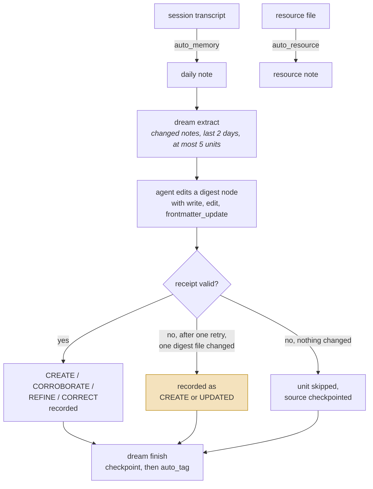
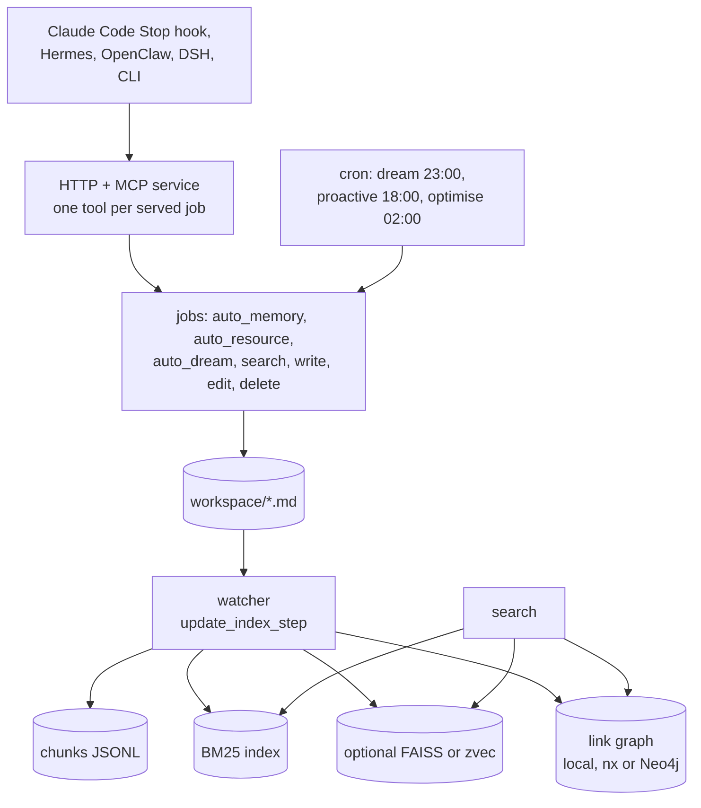

## 1. Executive Summary

ReMe is a local-first memory service in which memory is Markdown you can
read: per-session daily notes, resource notes and consolidated digest nodes,
each with YAML frontmatter and `[[wikilinks]]`. The notable parts are a
validated four-verb vocabulary for consolidation and per-category benchmark
tables committed with the weak categories left in. The weak part is that the
verb is a receipt for an edit an agent has already made with file tools, and
nothing checks the edit against it.

**The vocabulary.** When auto-dream integrates an extracted unit into a digest
node, the agent returns `CREATE`, `CORROBORATE`, `REFINE` or `CORRECT`, a
`Literal` on a Pydantic model (`reme/schema/dream.py:31`). `CORROBORATE` records
the same claim seen again without a second node. `CORRECT` tells the agent to
annotate inline with `> note: contradicted by [[<path>]] - <one-line>`, pointing
at the evidence. Every update is told to be additive: "never remove existing
wikilinks or source links" (`reme/steps/evolve/dream/integrate.yaml:61-62`).

**The benchmarks.** `benchmark/longmemeval/README.md` and
`benchmark/beam/README.md` carry per-category tables. LongMemEval
`single-session-preference` is 0.633 against 0.894 overall. BEAM
`contradiction_resolution` is 0.438 at 100K and 0.391 at 1M, the lowest
category at both sizes. The runs use a forked search step and auto-memory prompt from
`plugins/lme` and `plugins/beam`, not the shipped defaults, as section 10 sets
out.

**The seam.** The verb picks which bookkeeping list a path lands in; the file
change is made by an agent holding `write`, `edit` and `frontmatter_update`
under a prompt (`integrate.py:14`, `:225-235`). A receipt that fails validation
twice is still accepted when exactly one digest file changed, and recorded as
`CREATE` or as `UPDATED`, a label outside the `Literal` (`integrate.py:191-209`).
Change detection is modification time and size, not content (`integrate.py:17-36`).

## 2. Mental Model

A memory is a **Markdown note**. Frontmatter carries `name` and `description`,
and `FileFrontMatter` sets `extra="allow"`, so any key an author adds survives
parsing. The body is free-form, and wikilinks make the workspace a graph.

| Type | Holds |
| --- | --- |
| `FileNode` | `path`, `st_mtime`, outgoing `links`, owned `chunk_ids`, `front_matter` |
| `FileChunk` | an indexed span of a note, with scores and optional metadata |
| `FileLink` | an outgoing wikilink |
| `DreamUnit` | a cross-file abstraction: `name`, `bucket`, `summary`, source `paths` |

`DreamUnit.bucket` is `procedure | personal | wiki`: how to do something, what
is true of this person or team, what is true in general. Each bucket has its own
integration prompt, in English and Chinese.

A note becomes durable in one of three ways. Auto-memory writes one daily note
per session under `daily/<date>/`, linking the saved transcript. Auto-resource
writes a note for each file dropped into the resource directory. Auto-dream
reads the daily notes that changed in the last two days, extracts at most five
units, and integrates each into a digest node:

No dream step deletes a note: the integration agent holds no delete tool
(`integrate.py:14`). Correction is an annotation beside what it corrects, pointing at the note that contradicted it, so a disagreement stays
legible rather than being resolved away. That is the shape
[resolve, don't just detect](../../patterns/resolve-not-just-detect/) argues
for, expressed in prose rather than columns.

A note stops being a memory when someone deletes the file. `file_delete`
removes it, reports surviving inbound links, and leaves the watcher to prune
its chunks (`reme/steps/file_io/delete.py:1-22`). Nothing records the removal.

The one slot for a status is reserved and not consumed. The auto-memory and
auto-resource prompts both say "**Never set `status`** — it is a field reserved
for downstream processing" (`auto_memory.yaml:23`, `base_auto_resource.yaml:24`).
The tag index excludes `status` from tag keys (`local_tag_index.py:15-21`), and
the image-resource step refuses a note whose `status` the agent added, changed
or removed (`auto_image_resource.py:388-389`). Its test uses `queued` and `done`
as values. The delete docstring names `property_update(status=archived)` as
soft deletion for a "Decay algorithm" in `structure.md` (`delete.py:5-7`); no
such step or document is in the tree. Nothing filters or ranks on `status`, so
`trust_state` is withheld.

## 3. Architecture

- **Components** are registered by type and swappable: `as_llm`,
  `as_embedding`, `embedding_store`, `file_store`, `file_chunker`,
  `file_graph`, `file_catalog`, `keyword_index`, `tag_index`, `tokenizer`,
  `agent_wrapper`, `service`, `client`, `job`, `outbound_proxy`. File stores are
  `local` (a linear cosine scan over JSONL chunks), `faiss` and `zvec`.
- **Steps** under `reme/steps/` are the unit of work, in `evolve/`, `index/`,
  `file_io/`, `transfer/`, `common/` and `benchmark/`. Each evolve step pairs a
  `.py` with a `.yaml` holding its prompts.
- **Agent wrappers** let the pipelines drive AgentScope, Claude Code or Codex as
  the inner agent. Codex's approval mode is about tool calls, not memory.
- **Jobs** are `base`, `background` (the watchers), `cron` and `stream`.

### Deployment and ergonomics

`pip install reme-ai`, point `workspace_dir` at a folder (default `.reme`),
supply a model provider, and run `reme`. The shipped `default.yaml` binds the
`local` file store with `embedding_store: ""` (`reme/config/default.yaml:943-951`),
so search is BM25 only until an embedding store is configured. The cookbook and
benchmark configs turn it on.

A model is required for the evolve pipelines, not for reading. The memory is
Markdown, so `grep` and an editor work when the model does not. ReMe Studio, a
local web workspace under `reme_studio/`, browses and edits the same files and
can rebuild the derived indexes.

## 4. Essential Implementation Paths

**Capture** — `reme/steps/evolve/auto_memory.py`, with `auto_memory.yaml`. One
note per session; an update run is confined to that note by injecting
`_allowed_paths: [note_path]` (`auto_memory.py:415-416`). `auto_memory_cc.py`
resolves a Claude Code transcript by session id. `base_auto_resource.py`,
`auto_text_resource.py` and `auto_image_resource.py` do the same for files.

**Consolidation** — `reme/steps/evolve/dream/`: `extract.py` selects changed
daily notes by modification time against the dream catalog (`extract.py:77-78`)
and emits `DreamUnit`s; `integrate.py` hands each unit to an agent; `finish.py`
checkpoints; `auto_tag.py` tags what changed.

**The integration decision** — `integrate.py:115`, `_integrate_one()`. It packs
the source material, sends a per-bucket system prompt, and validates the reply
with `IntegrateOutcome.model_validate` (`:181`). `_valid_target` then requires a
real file under a digest bucket, and a `CREATE` to be new and in the unit's own
bucket (`:255-280`). An exception retries once; a second failure lands in
`failed_units` with its paths, so the unit is retryable. An invalid receipt with
no file change is skipped and its source checkpointed (`:217-223`).

**Retrieval** — `reme/steps/index/search.py`, `SearchStep`: two arms in
parallel, reciprocal rank fusion, filters, truncation, then link expansion from
`reme/utils/link_expansion.py`. `node_search.py` is the node-level variant that
auto-dream uses for recall. `traverse.py` builds a bounded graph for a frontend.

**Indexing** — `init_changes.py`, `watch_changes.py`, `update_changes.py`
(`UpdateIndexStep` upserts and deletes at `:329-333`), `_change_batch.py`,
`optimize_index.py`, `reindex.py`, `clear_paths.py`, `clear_store.py`.

**Schema** — `reme/schema/`: `file_node.py`, `file_chunk.py`, `file_link.py`,
`file_front_matter.py`, `dream.py`, `proactive.py`, `application_config.py`.

## 5. Memory Data Model

The model is thin because the note is the record. There is no id apart from the
path, no scope key, no validity interval, no version, no confidence and no
supersession pointer.

Provenance is a **convention in prose, not a field**. The integration prompts
require a `## Sources` section in which every source link sits inside a
sentence saying what it supports, and forbid standalone `derived_from::` lines
(`integrate.yaml:33-36`, `:69-75`). A digest traces back to its sources exactly
as reliably as the model followed that instruction.

Scoping is a deployment decision. `workspace_dir` is one string on
`ApplicationConfig` (`application_config.py:37-41`), and a searcher filters
on dates, paths, chunk metadata and tags, none of them a user, project or
tenant key. Tags are entity labels that `auto_tag.py` writes into the
`memory_tags` frontmatter key. A caller may pass them to `search`, but when the
tag index is missing or unhealthy the search runs unfiltered and reports
`applied: false` (`search.py:153-169`). A committed test asserts that fallback
(`tests/unit/test_search_step.py:965-996`). `scope_enforced` is withheld: no key
on the note is a boundary, and the facet that could act as one fails open.

`_allowed_paths` is a different boundary: a per-call confinement of the file
tools, enforced fail-closed in `reme/steps/file_io/_path.py:122-150`, which the
MCP layer refuses to let a caller supply (`mcp_tools.py:22-28`). It guards
writes by an inner agent, not reads by a searcher.

## 6. Retrieval Mechanics

`SearchStep` runs the vector and keyword arms in parallel over `limit * 5`
candidates, capped at 200, and fuses them with reciprocal rank fusion at
`k = 60` with a default vector weight of 0.7 (`search.py:54-85`, `:260`,
`:313-338`). With no embedding store, the vector arm returns nothing and the
BM25 list is used alone. Results over `min_score` are truncated to a default of
five, overridable by `REME_SEARCH_LIMIT`.

Each returned chunk carries one hop of wikilink neighbours in both directions,
up to ten per direction (`search.py:349-360`). That makes link traversal a peer
of similarity and keyword matching on every query, not a separate tool.

Filtering is a post-filter shared by both arms (`local_file_store.py:1060-1110`).
Caller dates are canonicalised before they reach it, because the comparison is
lexicographic against a `YYYY-MM-DD` date in the path; a malformed date is
dropped with a warning (`search.py:270-296`). An explicitly empty path list
matches nothing rather than widening to everything. A tag request whose index is
unavailable is the exception: it widens.

Two budgets apply per `tool_context_id`: chunks already returned are skipped
for 24 hours, and `max_search_calls` caps the number of searches
(`search.py:109-142`, `:239-258`). Both shape an agent's search loop rather than
the memory.

The failure modes are the file-canonical family's. Retrieval is chunk-level
while meaning is note-level, so a chunk can surface without the frontmatter that
qualifies it. Link expansion amplifies whatever the link graph got wrong, and
the same model writes the notes and the links.

## 7. Write Mechanics

Writes are agent-mediated. The pipelines assemble material and prompts; an
agent with file tools makes the edit; ReMe validates the agent's report of what
it did. The rules are the right ones:

- `CORROBORATE` — "same procedure observed again; append its source link and
  optionally strengthen wording."
- `REFINE` — "new pre-condition, edge case, failure mode, scope, or step."
- `CORRECT` — "wrong order, missing critical step, bad outcome, or conflict;
  tighten or annotate inline with `> note: contradicted by [[<path>]] - <one-line>`."
- For every update: "never remove existing wikilinks or source links," and
  "One target per session. Never edit other nodes sideways."

An additive-only rule would prevent the loss [Memobase](../memobase/) takes on
every profile rewrite, and the inline contradiction note is a durable record
pointing at its cause. Neither is checked. Integration snapshots each digest
file's modification time and size, so it knows which files changed and not what
changed in them. The one-target rule is prompt-only here: auto-memory, auto-tag
and auto-resource inject `_allowed_paths`, and `dream_integrate_step` passes its
tools without it.

The receipt is also optional. When the reply fails validation after one retry
and exactly one digest file changed, the step records that file as `CREATE` or
`UPDATED` and adds a warning (`integrate.py:191-209`). Its test is named for the
intent: "The file-native side effect wins when the agent's final receipt is
malformed" (`tests/unit/test_auto_dream.py:391-416`). The verb therefore
describes most integrations and constrains none.

Deletion is complete within the store. `LocalFileStore.delete` drops the path's
chunks; the FAISS store also tombstones their vector rows and compacts past a
threshold (`faiss_local_file_store.py:603-615`). There is no rejected-value
memory: a deleted note can be recreated by the next auto-memory run over the
same transcript, and nothing records that it was removed.

### Operational cost

- **Synchronous?** No. The Claude Code Stop hook double-forks and calls
  `auto_memory_cc` over MCP, so stopping never waits (`integrations/claude_code/reme/hooks/auto_memory.py:1-13`).
- **Lag?** A daily note is searchable once the inner agent finishes and the
  watcher reindexes it. A digest node waits for the 23:00 auto-dream.
- **Whole-store passes?** None. Auto-dream reads daily notes changed in the last
  two days and integrates at most five units, each recalling digest nodes
  through `node_search` (`reme/config/default.yaml:64-75`). The 02:00 job
  compacts the index.
- **Read path?** Five chunks by default, each followed by link-neighbour lines.

## 8. Agent Integration

The service enables MCP at `/mcp` by default and registers every served job as
a tool, including `search`, `read`, `write`, `edit`, `frontmatter_update` and
`delete` (`reme/components/service/mcp_tools.py:8-52`). The agent that searches
can also rewrite or delete any note; `file_delete` is unconditional by its own
docstring.

The Claude Code plugin under `integrations/claude_code/reme/` combines three
surfaces: an `.mcp.json` pointing at the local service, a Stop hook that records
each session, and `skills/reme-memory/SKILL.md`. That places it among systems
that use [skills as procedural memory](../../patterns/skills-as-procedural-memory/)
beside a tool list. `integrations/hermes_agent/` is a Python backend with
embedded and HTTP modes; `integrations/openclaw/` and `integrations/dsh/` are
TypeScript plugins.

Model agency is high, and that is the design's bet: a memory the agent edits
with ordinary file tools needs no bespoke vocabulary, and a person can edit the
same files. The cost is that every rule about how memory changes is a prompt,
which is section 7's finding at the architectural level.

## 9. Reliability, Safety, and Trust

Trust is not represented. A note written from a hallucinated turn and one
quoting the user are the same kind of file, though the auto-memory prompt's
instruction to "Quote original wording or numbers verbatim at key points" makes
the difference visible to a reader.

Prompt injection reaches memory through the transcript auto-memory reads, and
lands in a durable, wikilinked form that later dream passes abstract over. No
human-review surface sits in between. ReMe Studio edits files after the fact,
which is authoring rather than review, so `human_review` is withheld.

Multi-tenancy is not attempted (section 5), and the MCP tool surface gives any
connected agent write and delete over the whole workspace.

Failure handling is careful where it is mechanical. Integration serialises
under one application-wide lock (`integrate.py:102-113`), a failed unit keeps
its paths for retry, and the proactive steps carry numbered guards such as
"audit item 7" for strict path resolution (`reme/steps/evolve/proactive/utils.py:565`).
The proactive pipeline keeps follow-up topics in `daily/_proactive.yaml`;
a resolved topic is suppressed from the push and resurrected when mentioned
again, a task state rather than a belief.

The data-loss risk is the additive rule being unenforced. The recovery is that
everything is a file: a bad dream pass reverts with `git` if the workspace is a
repository, which is not built in.

## 10. Tests, Evals, and Benchmarks

The suite holds 1,286 test functions in 87 files. `tests/integration/` runs
the pipelines against a seeded workspace and a real model;
`test_auto_dream.py` asserts that units were extracted and integrated, that
changed paths were checkpointed, that the digest gained new signal, and that
source links and digest wikilinks appear. None was run for this reading.

**Two cases assert that material must not be retrieved, over a populated store
with a positive control.** `test_keyword_only_upsert_removes_old_chunks_and_docs`
builds the default keyword-only store, confirms `obsoleteword` returns its
chunk, rewrites the note, and asserts the same query returns nothing while
`freshword` returns the new chunk (`tests/unit/test_file_store_consistency.py:289-305`).
`test_zvec_delete_removes_vectors` deletes one of two notes and asserts a
matching query returns only the other (`tests/unit/test_zvec_file_store.py:226-245`).
The watcher's `update_index_step` produces both states on the reachable path,
so `negative_eval` is awarded. Both cover a whole edited or deleted note, not a
corrected value inside a surviving one.

Nothing tests the additive rule: no case runs an integration and asserts that
an existing source link or wikilink survived. The committed dream tests assert
the opposite property, that a malformed receipt's file change is accepted.

**The benchmark tables are committed and categorised.**
`benchmark/longmemeval/README.md` reports 500 cleaned-S items on 6 August 2026:
0.894 overall, `single-session-preference` 0.633. `benchmark/beam/README.md`
reports 20 cases at 100K (0.661 overall, `contradiction_resolution` 0.438) and
35 at 1M (0.650 overall, `contradiction_resolution` 0.391, `abstention` 0.429).
Each table names its configuration and agentscope version and none names a
revision. The raw `results_*.json` files are git-ignored, so no table
recomputes from the tree.

The runs do not measure the shipped search. `plugins/lme` and `plugins/beam`
register their own `auto_memory` and a forked `search_v2` with session-aware
deduplication and link expansion off, and the benchmark config enables an
embedding store the default leaves off. The weak categories are published
beside the strong ones, and they describe that configuration.

`contradiction_resolution` asks whether the answer uses the resolved value. It
does not ask whether the rejected one is still reachable, which is the question
the [benchmarks page](../../benchmarks/) separates.

**Papers.** The README cites *Remember Me, Refine Me: A Dynamic Procedural
Memory Framework for Experience-Driven Agent Evolution* (Findings of ACL 2026),
which describes distillation, context-adaptive reuse and utility-based
refinement of an experience pool. No utility scoring is in `reme/` at this
commit. It also cites
[arXiv:2608.03403](https://arxiv.org/abs/2608.03403) (4 August 2026), ExpG,
archived under `benchmark/toolmemory/` with flows naming operators absent from
the package; its code lives in a separate repository.

## 11. For Your Own Build

### Steal

- **Give correction a verb set, and validate it.** `CREATE | CORROBORATE |
  REFINE | CORRECT` as a `Literal` on structured output makes the decision
  inspectable and countable. `CORROBORATE` expresses the same claim seen again
  without a second row.
- **Write contradictions into the memory, pointing at their cause.**
  `> note: contradicted by [[<path>]] - <one-line>` keeps the disagreement
  legible to whoever reads the note next.
- **Confine an inner agent's file tools to its one target, fail-closed.**
  `_allowed_paths`, injected by the server and refused from the caller, is a
  few dozen lines and turns "edit only this note" from a request into a rule.
- **Test deletion on the read path with a positive control.** Assert the old
  term returned before the edit, nothing after, and the new term after.
- **Publish per-category tables with the configuration beside them.** A 0.391
  on contradiction resolution tells an adopter which workload not to bring.

### Avoid

- **Do not let a validated label stand in for a validated action.** Checking
  that the model said `CORROBORATE` is not checking that it corroborated, and
  accepting the file change when the label is missing gives up even that.
- **Do not detect a change by modification time and size when the rule is about
  content.** A diff of wikilinks before and after is the check the additive rule
  needs.
- **Do not let an optional filter widen silently.** A tag filter that falls
  back to an unfiltered search and reports it in metadata is safe only for a
  caller who reads the metadata.
- **Do not reserve a field in a prompt and leave it unconsumed.** A reserved
  `status` invites a reader to assume a trust model exists.

### Fit

ReMe suits one person or one agent with a workspace of their own: a knowledge
base an agent maintains and a person opens in an editor. Within that brief the
retrieval is properly hybrid when configured, the consolidation is bounded, and
the failure handling is real.

It is not a multi-user service. Anyone building toward one adds the scope key,
the read-path filter and per-tenant tool confinement, and removes `delete` from
the tool surface an untrusted agent sees.

The judgement that decides it: will you let correctness rules live in prompts?
ReMe's rules are carefully written. They are still prompts, and
the integration step accepts an edit whose receipt failed.

## 12. Open Questions

- **What was meant to consume `status`?** The prompts reserve it, the image
  step preserves it, its test uses `queued` and `done`, and a docstring names
  `status=archived` for a decay algorithm that is not in the tree.
- **Do the benchmark tables correspond to this commit?** They carry dates and an
  agentscope version and no revision, and were not reproduced here.
- **Is the shipped search close to the benchmarked one?** The forked
  `search_v2` differs in deduplication, chunk rendering and link expansion; no
  run compares them.
- **What is the multi-workspace story?** `workspace_dir` is one config value,
  and the LongMemEval runner creates one workspace per item.

## Appendix: File Index

**Schema** — `reme/schema/file_node.py`, `file_chunk.py`, `file_link.py`,
`file_front_matter.py`, `dream.py`, `proactive.py`, `application_config.py`

**Write / evolve** — `reme/steps/evolve/auto_memory.py` + `.yaml`,
`auto_memory_cc.py`, `base_auto_resource.py` + `.yaml`,
`auto_text_resource.py`, `auto_image_resource.py`, `auto_tag.py`,
`reme/steps/evolve/dream/{extract,integrate,finish,utils}.py` and their YAML
prompts, `reme/steps/evolve/proactive/`

**File tools** — `reme/steps/file_io/{write,edit,delete,frontmatter_update,read}.py`,
`_path.py`

**Retrieval** — `reme/steps/index/search.py`, `node_search.py`, `traverse.py`,
`reme/utils/link_expansion.py`,
`reme/components/file_store/local_file_store.py`

**Indexing** — `reme/steps/index/{init,watch,update,log}_changes.py`,
`_change_batch.py`, `optimize_index.py`, `reindex.py`,
`reme/components/tag_index/local_tag_index.py`

**Components** — `reme/components/file_store/{base,local,faiss_local,zvec_local}_file_store.py`,
`reme/components/{embedding_store,keyword_index,file_graph,agent_wrapper,service}/`

**Configuration** — `reme/config/default.yaml`, `cookbook.yaml`, `benchmark.yaml`

**Integration** — `integrations/claude_code/reme/` (hooks, `.mcp.json`,
`skills/reme-memory/SKILL.md`), `integrations/hermes_agent/`,
`integrations/openclaw/`, `integrations/dsh/`, `skills/reme_memory/SKILL.md`

**Tests/benchmarks** — `tests/unit/test_file_store_consistency.py`,
`test_zvec_file_store.py`, `test_search_step.py`, `test_auto_dream.py`,
`test_auto_resource_agent_inputs.py`, `tests/integration/test_auto_dream.py`,
`benchmark/longmemeval/README.md`, `benchmark/beam/README.md`,
`plugins/lme/src/reme_lme/`, `plugins/beam/src/reme_beam/`

## Appendix: Recorded Searches

Run in a full clone at the pinned revision, from the repository root.

| Claim | Check | Result at this pin |
| --- | --- | --- |
| Nothing filters or ranks on `status` | `grep -rn -E "[\"']status[\"']" reme --include='*.py'` | Six hits: the tag index's reserved keys, the image-resource preservation check, two Codex turn-status fields, and a service-status response. None reads a note's `status` to filter or rank. |
| No `property_update` step and no `structure.md` | `grep -rln 'def property_update\|"property_update' reme`; `git ls-files \| grep -i structure.md` | Nothing for either; the names appear only in the `delete.py` docstring. |
| No scope key in the package | `grep -rn -E '\b(user_id\|tenant\|namespace\|agent_id\|owner_id\|project_id)\b' reme --include='*.py'` | Only `argparse.Namespace` annotations. |
| Integration compares no content | `grep -rn 'difflib\|unified_diff' reme`; read `_snapshot_digest` | Nothing; the snapshot is `(st_mtime_ns, st_size)`. |
| No test of the additive rule or the contradiction note | `grep -rn -i 'additive\|never remove' tests`; `grep -rn 'contradicted by' tests reme --include='*.py'` | One unrelated comment in `test_proactive_refresh.py`; nothing for the second. |
| No audit log of mutations | `cat reme/steps/index/log_changes.py` | A step that writes each change to the process log, described as a placeholder. |
| No rejected-value record | `grep -rn -i tombstone reme --include='*.py'` | FAISS and zvec index-row tombstones, and resolved proactive topics that resurrect on a new mention. |
| No utility scoring from the paper | `grep -rn -i utility reme --include='*.py'` | Docstrings only. |
| The ExpG operators are not in the package | `grep -rn 'retrieve_tool_memory_op\|summary_tool_memory_op' reme` | Nothing. |
| No raw benchmark results committed | `git ls-files \| grep -i 'results_'` | Nothing; `.gitignore` excludes benchmark outputs. |

## History

**2026-09-26** — [`bebad3674573477ad294ca44eb15f508feea2665`](https://github.com/agentscope-ai/ReMe/commit/bebad3674573477ad294ca44eb15f508feea2665) — 25 commits on; the dream, schema and store code is unchanged, search gained a call budget, and auto-resource merged its text and image paths. Screened from a full clone: `pyproject.toml` inside the cooldown, two npm `prepare` hooks, twelve unpinned surfaces; nothing installed, built or run. `negative_eval` is awarded on two store cases present at both earlier pins ([section 10](#10-tests-evals-and-benchmarks)); `scope_enforced` stays withheld because tags fail open. Corrected, all wrong at the previous pin: the benchmark files and figures cited were replaced on 5 August 2026; a malformed integration receipt is accepted when one digest file changed ([section 7](#7-write-mechanics)); default search is BM25 only; auto-dream reads two days of changed notes, not the corpus; MCP is a tool surface; the prompts say source links, not `derived_from`. Two papers are cited.

**2026-09-13** — [`9ad3dafce5666c55e8cd5b16cc5ffba42da6cce1`](https://github.com/agentscope-ai/ReMe/commit/9ad3dafce5666c55e8cd5b16cc5ffba42da6cce1) — re-read, 98 commits past the previous pin across 640 files. `capabilities` stays empty and each candidate was checked against the new code rather than assumed. The largest addition is a rebuildable tag index over file frontmatter with filtered hybrid search, but `_resolve_tag_filter` in `reme/steps/index/search.py:144` merges tag-derived paths into the ordinary file-store filter on the caller's request, so tags are a facet the searcher chooses rather than a stored key the reader cannot widen, and `scope_enforced` stays withheld. `negative_eval` is the closer call and is refused on a stated distinction: `test_configured_frontmatter_key_contract` does build a populated fixture and pair its negative with a positive control in the same function — a file whose tags sit under the unconfigured key returns nothing while the configured one returns its path — but what it pins is which frontmatter key the index reads, a parsing contract, not that particular material must be kept out of a result for correctness or safety. No trust status, no rejected-value record and no second time axis appeared. Worth recording about the project: `reme/steps/evolve/proactive/` carries numbered annotations — *"audit item 2"*, *"audit item 3"*, *"audit item 7"*, *"audit item 9"* — tying each guard in the code back to the finding that prompted it. Screened again first; nothing was installed and no suite was run.

**2026-07-29** — [`550317c3bfb755d985a0401194827eaa9676a5bc`](https://github.com/agentscope-ai/ReMe/commit/550317c3bfb755d985a0401194827eaa9676a5bc) — first reading.
