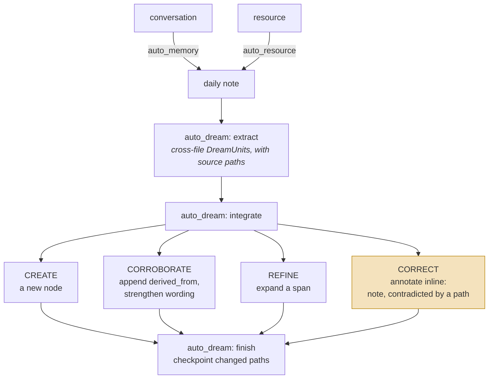
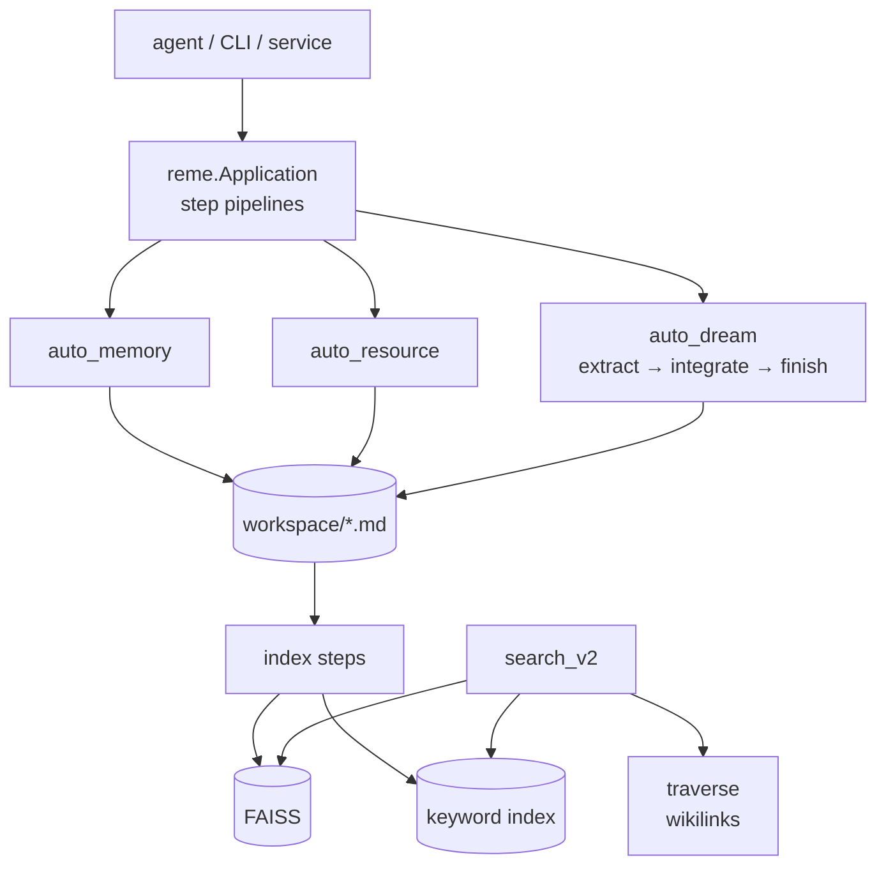

## 1. Executive Summary

ReMe is a local-first memory layer built on the idea that memory should be
Markdown you can read: notes with YAML frontmatter and `[[wikilinks]]`, indexed by
FAISS and BM25, consolidated by scheduled pipelines called auto-memory,
auto-resource and auto-dream. Architecturally it sits beside
[Basic Memory](../basic-memory/) and [llm-wiki-memory](../llm-wiki-memory/) — files
canonical, indexes disposable.

Two things make it worth reading past that.

**It has the most developed correction vocabulary in the atlas that is not
Memanto's.** When auto-dream integrates a new abstraction into an existing digest
note, the agent must return one of `CREATE`, `CORROBORATE`, `REFINE` or `CORRECT`
— a `Literal` on a Pydantic model, so a response outside the set fails validation.
`CORROBORATE` as a first-class action is close to unique here; almost every other
system in this atlas can only add or overwrite, and has no way to say *this is the
same claim, seen again*. The instructions attached to `CORRECT` go further:
annotate inline with `> note: contradicted by [[<path>]] - <one-line>`, and
"UPDATE must be additive: never remove existing wikilinks or derived_from
entries."

**And it commits its benchmark results, including the embarrassing ones.**
`benchmark/result-longmemeval.md` and `benchmark/result-beam.md` carry
per-category tables. LongMemEval `single-session-preference` is reported at
**26.7%**. BEAM `contradiction_resolution` is reported at **0.100** on the
prompted configuration. Publishing a 10% is the behaviour this atlas has been
asking for and has almost never seen — see section 10, which also records what
those tables taught the atlas about BEAM itself.

The weakness is the seam between those two things. The verb is validated; the
edit is not. `IntegrateOutcome.action` is checked against the enum and then used
only to decide which bookkeeping list the path lands in
(`integrate.py:103`); the actual file change is made by an agent with file tools
under a prompt. So ReMe has the vocabulary a governed correction needs and does
not have the gate — which is, precisely, what its own contradiction score
measures.

## 2. Mental Model

A memory is a **Markdown note**. Frontmatter carries `name` and `description`
(and, per `FileFrontMatter`, any extra keys the author adds); the body is
free-form; wikilinks make the corpus a graph.

| Type | Holds |
| --- | --- |
| `FileNode` | `path`, `st_mtime`, `links`, `chunk_ids`, `front_matter` |
| `FileChunk` | an indexed span of a note |
| `FileLink` | an outgoing wikilink, real or virtual |
| `DreamUnit` | a cross-file abstraction — `name`, `bucket`, `summary`, source paths |

`DreamUnit.bucket` is `procedure | personal | wiki`, which is a real functional
split — how to do something, what is true of this person, what is true in general
— and each bucket gets its own integration prompt.

The lifecycle is where the design is unusual:

Nothing is deleted by that path. Correction is an annotation that sits beside what
it corrects, and the contradiction points at the note that caused it, so the
disagreement remains legible in the corpus rather than being resolved away. That
is the shape [resolve, don't just detect](../../patterns/resolve-not-just-detect/)
argues for, expressed in prose instead of columns.

There is one clearly reserved slot for trust and it is empty. Both the
auto-memory and auto-resource prompts say: "**Never set `status`** — it is a field
reserved for downstream processing." No code in `reme/` reads or writes a `status`
key. The design has left room for a trust state and has not built one.

## 3. Architecture

- **Components** are registered by enum (`ComponentEnum`) and swappable:
  `as_llm`, `as_embedding`, `embedding_store`, `file_store`, `file_chunker`,
  `file_graph`, `file_catalog`, `keyword_index`, `tokenizer`, `agent_wrapper`,
  `service`, `client`. This is a cleanly factored plugin architecture, and
  `faiss_local_file_store.py` is the reference `file_store`.
- **Steps** under `reme/steps/` are the unit of work — `evolve/`, `index/`,
  `file_io/`, `transfer/`, `benchmark/`, `cookbook/` — each pairing a `.py` with a
  `.yaml` holding its prompts in English and Chinese.
- **Agent wrappers** let the pipelines drive an external coding agent; there is a
  Codex wrapper with an approval mode, which is about tool-call approval rather
  than memory review.

### Deployment and ergonomics

`pip install reme-ai`, point `workspace_dir` at a folder, supply a model provider.
Nothing else has to run — FAISS and the keyword index are local files, and both
are rebuildable from the notes.

An LLM is required for the evolve pipelines, but not for reading: the memory is
Markdown, so `grep` and an editor work when the model does not. That is the real
benefit of the file-canonical family and ReMe gets it.

The store is as human-repairable as it is possible to be. Fixing a wrong memory
means editing a Markdown file, and the watcher and index steps
(`watch_changes.py`, `update_changes.py`, `optimize_index.py`) reconcile the
projections afterwards.

## 4. Essential Implementation Paths

**Capture and daily notes** — `reme/steps/evolve/auto_memory.py` with
`auto_memory.yaml`. The prompt is explicit about what to keep ("Capture things
that are hard to re-obtain", "Quote original wording or numbers verbatim at key
points") and about what not to touch (`status`). `auto_memory_cc.py` is the Claude
Code variant. `auto_resource.py` does the same for documents.

**Consolidation** — `reme/steps/evolve/dream/`: `topics.py` proposes user-interest
topics, `extract.py` emits `DreamUnit`s and `DreamTopic`s with source `paths`,
`integrate.py` writes them into digest notes, `finish.py` checkpoints, and
`proactive.py` drives the whole thing.

**The integration decision** — `integrate.py:55`, `_integrate_one()`. It packs the
source material (`pack_paths`), sends a per-bucket system prompt, and validates
the reply with `IntegrateOutcome.model_validate(parse_structured_reply(...))`. On
failure the unit lands in `state.failed_units` with its paths, so a failed
integration is retryable rather than lost — the
[recoverable background work](../../patterns/recoverable-background-work/) shape.

**Retrieval** — `reme/steps/index/search_v2.py`: "Hybrid search: run vector +
keyword in parallel, fuse via RRF, filter, truncate", plus `traverse.py` for
wikilink expansion, `bm25_search.py` and `vector_search.py` for the arms, and
`node_search.py` for the graph.

**Indexing** — `init_changes.py`, `watch_changes.py`, `update_changes.py`,
`log_changes.py`, `_change_batch.py`, `_dedup.py`, `clear_paths.py`,
`clear_store.py`. The index is treated as a projection with an explicit change
pipeline, which is the right model for a file-canonical system.

**Schema** — `reme/schema/`: `file_node.py`, `file_chunk.py`, `file_link.py`,
`file_front_matter.py`, `dream.py`.

## 5. Memory Data Model

The model is deliberately thin, because the note is the record.

`FileNode` carries `path`, `st_mtime`, outgoing `links`, owned `chunk_ids` and
parsed `front_matter`. `FileFrontMatter` declares only `name` and `description`
and sets `extra="allow"`, so any additional key a note author writes survives
parsing. That is a good decision for a file-canonical store — the schema does not
punish a human for adding a field — and it is also why `status` can be reserved in
a prompt without existing anywhere in code.

What the model does not have: no id independent of the path, no scope key, no
validity interval, no version, no confidence, no explicit supersession pointer.
Provenance exists but as a **convention rather than a field**: `derived_from`
appears only in the integration prompts, where the agent is told to append to it
and never to remove entries. So the corpus can trace a digest back to its sources
exactly as reliably as the model followed instructions — which is a real mechanism
with a real failure mode, and worth distinguishing from
[Memori](../memori/)'s foreign key or [Basic Memory](../basic-memory/)'s parsed
relations.

Scoping is where the report has to be blunt. `workspace_dir` is a single string on
`ApplicationConfig`, defaulting to `.reme`. One application instance serves one
workspace; there is no per-request user, project or tenant key, and nothing in the
search path filters on one — `search_filter` handles dates and paths. Isolation is
therefore a deployment decision: run one process per boundary. That is a
legitimate architecture for a local-first personal tool and it is not
`scope_enforced` under this atlas's definition, which asks for a stored key applied
on the read path. Anyone putting ReMe behind a multi-user service is building that
themselves.

## 6. Retrieval Mechanics

The best-engineered part of the system, and a strong instance of
[hybrid retrieval fusion](../../patterns/hybrid-retrieval-fusion/).

`search_v2.py` runs vector and keyword search **in parallel** and merges them with
reciprocal rank fusion (`_rrf_merge`), then applies filters and truncates. On top
of that, `traverse.py` expands along wikilinks, which adds a third retrieval mode
the atlas rarely sees implemented: relationship expansion as a peer of similarity
and keyword matching, rather than as a graph store's only trick.

Date filtering is handled with more care than most. The code normalizes caller
date values before they reach `file_store` and comments on why — `_matches_search_filter`
does lexicographic comparison against a canonical `YYYY-MM-DD` `path_date`, so a
raw caller value would silently mismatch. A malformed date is deleted from the
filter rather than being allowed to filter everything out. `strict_date_filter`
opts into the harder behaviour.

The failure modes are the file-canonical family's usual ones. Retrieval is
chunk-level while the unit of meaning is the note, so a chunk can surface without
the frontmatter that qualifies it; and wikilink traversal amplifies whatever the
link graph got wrong, since links are written by the same model that writes the
notes.

## 7. Write Mechanics

Writes are agent-mediated. The pipelines assemble material and prompts, and an
agent with file tools performs the edit; ReMe validates the *report* of what it
did, not the diff.

That distinction is the most important thing in this section. The rules are good
and they are the right rules:

- `CORROBORATE` — "same procedure observed again; append derived_from and
  optionally strengthen wording."
- `REFINE` — "new pre-condition, edge case, failure mode, scope, or step."
- `CORRECT` — "wrong order, missing critical step, bad outcome, or conflict;
  tighten or annotate inline with `> note: contradicted by [[<path>]]`."
- And across all of them: "UPDATE must be additive: never remove existing
  wikilinks or derived_from entries."

An additive-only update rule is exactly the guard that would prevent the loss
[Memobase](../memobase/) takes on every profile rewrite, and the inline
contradiction note is a durable record pointing at its cause. But nothing compares
the file before and after. A model that removes a `derived_from` entry, or that
returns `CORROBORATE` while rewriting a paragraph, produces a valid
`IntegrateOutcome` and an unnoticed loss. The gap between "the vocabulary is
validated" and "the constraint is enforced" is one diff check wide, and closing it
would move ReMe from the best *stated* correction policy here to one of the few
enforced ones.

Deletion exists at the store level — `BaseFileStore.delete(path)`, with the FAISS
store carefully unlinking its sidecar files and guarding against persisting a
half-reset index. There is no rejected-value memory: a note deleted from the
workspace can be recreated by the next auto-memory run from the same conversation,
and nothing records that it was removed.

### Operational cost

- **Synchronous?** No. Capture is a pipeline run, not a hook on the turn.
- **Lag?** Until the next auto-memory run. The scheduling is the operator's
  choice, so the lag is a deployment parameter rather than a fixed number.
- **Whole-store passes?** Auto-dream is a global pass — `extract` reasons across
  files to emit cross-file units — so its cost scales with the corpus. `finish`
  checkpointing changed paths limits the write amplification, not the read.
- **Read path?** RRF-fused and truncated to a limit, with the notes' own
  frontmatter keeping injected chunks self-describing.

## 8. Agent Integration

`plugins/claude_code/` ships a plugin including
`reme/skills/reme-memory/SKILL.md`, which puts ReMe in the small group of systems
that treat [skills as procedural memory](../../patterns/skills-as-procedural-memory/)
as the integration surface rather than an MCP tool list.
`plugins/hermes_agent/` provides a client for Hermes. A service and CLI cover the
rest.

Model agency is high — the agent reads and writes Markdown directly — and this is
the design's central bet: a memory the agent can edit with ordinary file tools
needs no bespoke tool vocabulary, and a human can edit the same files. The cost is
that every guarantee is a prompt instruction, which is section 7's finding
restated at the architectural level.

## 9. Reliability, Safety, and Trust

Trust is not represented; the `status` field is reserved and unused. A note
written from a hallucinated conversation and one quoting the user verbatim are the
same kind of file, though the auto-memory prompt's instruction to "quote original
wording or numbers verbatim at key points" at least makes the difference
*visible* to a reader.

Prompt injection reaches memory the ordinary way — through the conversation the
auto-memory pipeline reads — and reaches it in a durable, wikilinked form that
later dream passes will abstract over.

Multi-tenancy is not attempted, per section 5. The relevant safety statement is
simply that it must be provided outside ReMe.

Failure handling is better than average: failed dream units are collected with
their paths and their error rather than dropped, and the FAISS store's delete path
comments on the ordering hazard it is avoiding. The `finish` step checkpointing
changed paths gives a run a recoverable boundary.

The data-loss risk is the additive-update rule being unenforced, and the
recoverable risk is that everything is a file — a bad dream pass is repairable with
`git revert` if the workspace is a repository, which is the standard mitigation for
this family and is not built in.

## 10. Tests, Evals, and Benchmarks

**This is the section that earns ReMe its place in the atlas.**

`tests/integration/` runs the pipelines end to end against a workspace fixture:
`test_auto_memory.py`, `test_auto_resource.py`, `test_auto_dream.py`,
`test_agent_session.py`, `test_reme_e2e.py`, plus provider tests. The assertions
are behavioural rather than structural — `test_auto_dream_and_proactive` asserts
that units were extracted, that integration produced results, that the checkpoint
recorded changed paths, that the digest gained the expected new signal, and that
the note ended up linked.

And `benchmark/` commits **scored results**, not just harnesses:

| Source | What is published |
| --- | --- |
| `result-longmemeval.md` | Per-category accuracy over 500 questions, with the configuration described (auto-dream off, modified auto-memory prompt, agentic answering capped at five searches) |
| `result-beam.md` | Per-category scores at 100K, comparing a prompted configuration against an agentic one |

The numbers are the point. LongMemEval overall is 71.4%, and the breakdown shows
`single-session-preference` at **26.7%** — a category where the system is worse
than most readers would guess, published beside the good ones. BEAM's
`contradiction_resolution` is **0.100** prompted and 0.384 agentic.

Two things follow for this atlas.

First, ReMe is a counterexample to the
[published benchmark numbers without committed artifacts](../../compare/#published-benchmark-numbers-without-committed-artifacts)
antipattern, and the strongest one in the corpus. The results are in the
repository, categorised, with the configuration stated and the weak scores
included. That is what the atlas has been asking for.

Second, the tables corrected something the atlas believed. **BEAM has a
`contradiction_resolution` category and an `abstention` category** — so the claim
that correction is entirely unmeasured needs qualifying: one benchmark scores an
adjacent thing, ReMe is the first system here to commit numbers on it, and the
numbers are low. The [benchmarks page](../../benchmarks/) now says so. It remains
true that nothing tests whether a *deleted* memory stays deleted;
`contradiction_resolution` asks whether the model answers with the resolved value,
not whether the rejected one is still reachable.

What is missing is a test over the additive-update rule: write a digest, run an
integration that should `CORROBORATE`, and assert no `derived_from` entry
disappeared. The integration tests assert that content was *added*; none asserts
that nothing was removed.

## 11. For Your Own Build

### Steal

- **Give correction a verb set, and validate it.** `CREATE | CORROBORATE | REFINE
  | CORRECT` as a `Literal` on a structured output is a few lines and it makes the
  decision inspectable, loggable and countable. `CORROBORATE` in particular buys
  something most designs cannot express: the same claim, seen again, without a
  second row.
- **Write contradictions into the memory, pointing at their cause.**
  `> note: contradicted by [[<path>]] - <one-line>` keeps the disagreement legible
  to whoever reads the note next, which is more than a resolved-and-forgotten
  overwrite gives anyone.
- **Make updates additive by rule — then enforce the rule with a diff.** The
  instruction is right. Checking it is the cheap half nobody does.
- **Fuse three retrieval modes, not two.** Vector, keyword and *link traversal*
  answer different questions, and RRF over the first two with expansion along the
  third is a genuinely better default than similarity alone.
- **Publish the category you are worst at.** A table with a 26.7% in it is more
  useful — and more persuasive — than a single headline number, and it tells an
  adopter which workload not to bring.

### Avoid

- **Do not let a validated label stand in for a validated action.** Checking that
  the model *said* `CORROBORATE` is not checking that it corroborated. If the
  outcome matters, compare the artifact before and after.
- **Do not reserve a field in a prompt and leave it unimplemented.** `status` is
  described to the model as "reserved for downstream processing" and no downstream
  reads it. Either build the state machine or drop the instruction; a reserved
  slot invites a reader to assume there is a trust model.
- **Do not treat a single configured directory as a security boundary.** It is a
  fine isolation model for one person and it does not become a multi-tenant one by
  running more processes carefully.

### Fit

ReMe suits a single user or a single agent with a workspace of their own — a
personal knowledge base that an agent maintains and a person can open in an
editor. Within that brief it is one of the better-considered designs here: the
retrieval is properly hybrid, the consolidation vocabulary is thoughtful, the
failure handling is real, and the project is unusually honest about what it cannot
yet do.

It is not a multi-user memory service and does not present itself as one. Anyone
building toward that will be adding the scope key, the read-path filter and the
per-tenant index themselves, and should cost that before adopting.

The judgement that decides it: are you willing to have your correctness rules live
in prompts? ReMe's rules are better than most systems' code. They are still
prompts, and its own committed contradiction score is the most honest available
statement of what that costs.

## 12. Open Questions

- **Is there a diff check anywhere on the additive-update rule?** None was found
  in `integrate.py` or the file store, but the agent wrapper's tool layer was not
  read in full.
- **What was meant to consume `status`?** The prompts reserve it in two places, in
  both languages, which suggests a planned pipeline rather than an accident.
- **Do the committed benchmark numbers correspond to this commit?**
  `result-longmemeval.md` describes its configuration but does not pin a revision,
  and the results were not reproduced here.
- **How does auto-dream cost scale?** `extract` reasons across files to find
  cross-file units; whether it re-reads the whole corpus each run or works from a
  change set was not established.
- **What is the intended multi-workspace story?** `workspace_dir` is a single
  config value, and the cookbook configs suggest one workspace per use case rather
  than per user.

## Appendix: File Index

**Schema** — `reme/schema/file_node.py`, `file_chunk.py`, `file_link.py`,
`file_front_matter.py`, `dream.py`, `application_config.py`

**Write / evolve** — `reme/steps/evolve/auto_memory.py` + `.yaml`,
`auto_memory_cc.py`, `auto_resource.py` + `.yaml`,
`reme/steps/evolve/dream/{topics,extract,integrate,finish,proactive}.py` and their
YAML prompts

**Retrieval** — `reme/steps/index/search_v2.py`, `search.py`, `vector_search.py`,
`bm25_search.py`, `traverse.py`, `node_search.py`

**Indexing** — `reme/steps/index/{init,watch,update,log}_changes.py`,
`_change_batch.py`, `_dedup.py`, `optimize_index.py`, `clear_paths.py`,
`clear_store.py`

**Components** — `reme/components/file_store/faiss_local_file_store.py`,
`base_file_store.py`, `reme/components/{embedding_store,keyword_index,file_graph,agent_wrapper}/`

**Integration** — `plugins/claude_code/reme/skills/reme-memory/SKILL.md`,
`plugins/hermes_agent/client.py`

**Tests/benchmarks** — `tests/integration/test_auto_dream.py`,
`test_auto_memory.py`, `test_reme_e2e.py`, `benchmark/result-longmemeval.md`,
`benchmark/result-beam.md`, `reme/steps/benchmark/{lme,beam}/`

## History

**2026-07-29** — [`550317c3bfb755d985a0401194827eaa9676a5bc`](https://github.com/agentscope-ai/ReMe/commit/550317c3bfb755d985a0401194827eaa9676a5bc) — first reading.
