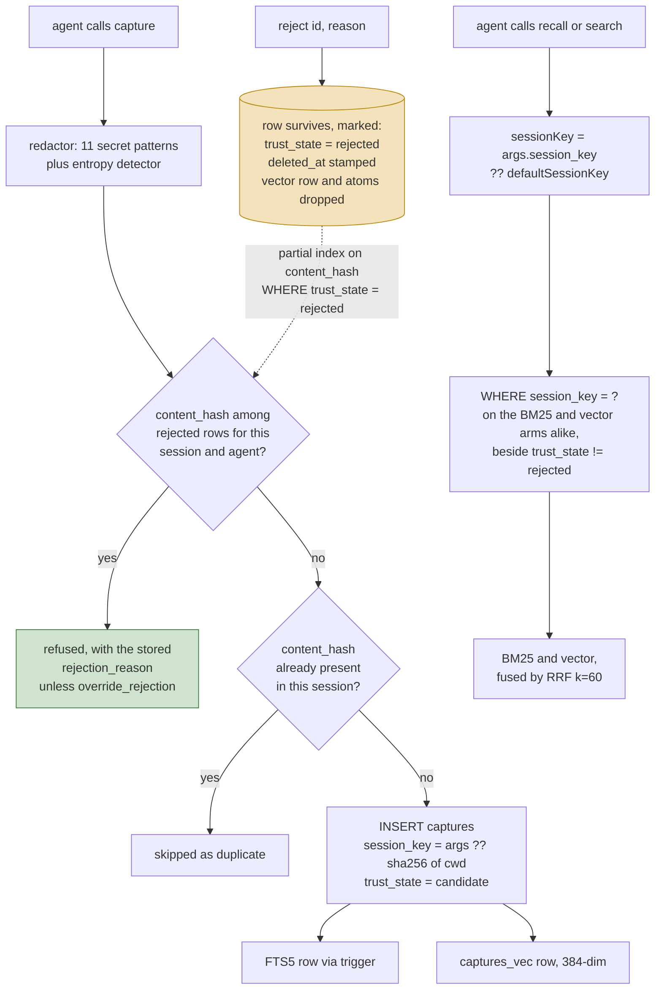

## 1. Executive Summary

remem-mcp is an MIT-licensed MCP memory server for coding agents — ~22,600 lines
of TypeScript over SQLite, with FTS5 for BM25, `sqlite-vec` for embeddings, and
`@huggingface/transformers` running a MiniLM model locally. Its own `server.json`
describes it accurately: *"Local-first MCP memory server for coding agents. No
API key, no cloud."* Nothing here calls a hosted model, for storage or retrieval.

**It has a rejected-value tombstone, and the code names it.** `handleCapture`
redacts secrets, takes `sha256` of the **redacted** content, and calls
`findRejectedByContentHash(contentHash, sessionKey, agentId)` before writing. A
hit refuses the capture and returns the stored `rejection_reason` with the
offending id. A partial index — `ON captures (content_hash) WHERE trust_state =
'rejected'` — backs the lookup.

The negative record is the capture row itself: `reject(id, reason)` sets
`trust_state = 'rejected'`, stamps `deleted_at`, writes the reason, and deletes
the row's vector and atoms — so the entry leaves retrieval while remaining on
disk *as* the thing the write path consults. That is the shape the
[rejected-value tombstone](../../patterns/rejected-value-tombstone/) pattern
argues for, reached in about forty lines.

**Retrieval is scoped on both arms.** `handleRecall` computes
`(args.session_key as string) ?? defaultSessionKey()`, so a call that names no
session gets the project's own key rather than an unfiltered search, and the
storage layer applies `session_key = ?` to the BM25 arm and the vector arm alike.
Three committed tests pin it: *"recall without session_key does not leak across
projects"*, the same for `search`, and a third asserting it **against the real
handler** rather than against a helper that supplies the default itself — the
distinction between testing the storage layer and testing the wiring.

Around the session key sit `agent_id`, `team_id`, `user_id` and `task_id`, plus
an `org` scope that deliberately drops the agent filter so a cross-agent handoff
can retrieve what another agent stored.

**Four of seven marks.** The limits belong with the mechanisms. The tombstone is
scoped to `(content_hash, session_key, agent_id)`, so the same rejected value
asserted under a different agent id or in another project is not refused — the
refusal is per-project rather than per-machine. `override_rejection` is an
ordinary tool argument, so a model that was refused can set it and try again. And
the audit log records tool calls to a file rather than mutations to the store,
which is why `audit_log` is withheld.

## 2. Mental Model

A memory is **a capture**: one row of text an agent chose to write down, typed
(`decision`, `learning`, and others), tagged, hashed, and stamped with a session
and an agent. There is no extraction, no summarisation and no inference — what
the agent passed to `capture` is what the store holds, minus any secrets the
redactor found.

The schema describes a three-level distillation and the code implements one
level:

| Level | Table | State |
| --- | --- | --- |
| L0 | `captures` | written on every `capture` call |
| L1 | `atoms` — `fact`, `confidence` | table created, never written |
| L2 | `scenarios` — `atom_ids`, `summary`, `persona_tags` | table created, never written |

The epistemic state machine is two states wide, and the second state is the
report. A capture arrives as `candidate`; `reject(id, reason)` moves it to
`rejected`, which every read path filters out and the *write* path looks up by
content hash; `superseded_by` points a correction at what it replaced and is
excluded from retrieval the same way; `forget` with a confirm destroys the row
outright. Nothing verifies a capture and nothing expires one, so `candidate` is
where almost everything stays.

Two questions then decide what a query can reach, and neither is about ranking.
The first is which session the caller is in, answered by a default the handler
supplies rather than by the caller. The second is whether the value was ever
refused.



The two shaded boxes are one mechanism seen from both ends. `reject` does not
remove the row: it marks it, stamps `deleted_at`, and drops its vector and its
atoms, so retrieval cannot reach it while its `content_hash` stays on disk as the
thing the next `capture` looks itself up in. The scope key runs the other loop,
and the storage layer never learns whether the caller named one.

## 3. Architecture

A single **stdio MCP server**, run as one Node process per agent, with all state
in one SQLite file. There is no daemon, no service and no network dependency at
run time — `LocalEmbedder` loads all-MiniLM-L6-v2 through
`@huggingface/transformers` and computes 384-dimension vectors in process.

`src/index.ts` wires it: `loadConfig`, `SQLiteBackend`, `LocalEmbedder`,
`NoopPipeline`, `AuditLogger`, then `createServer` over
`StdioServerTransport`. `src/server.ts` holds every tool handler.

`src/tools/` holds a single file, `format.ts`. Every tool's behaviour is decided
in the `handle*` functions of `src/server.ts`, so there is one file to read to
find out what a tool does and no second copy to drift against it.

Alongside the server: `hooks.ts` writes `SessionStart` and `Stop` entries into
`~/.claude/settings.json` and `~/.config/devin/config.json`, each running
`npx -y remem-mcp <subcommand>`; `backup.ts`, `export.ts`, `import.ts`,
`stats.ts`, `viewer.ts` and `install-skill.ts` are CLI subcommands beside the
server.

### Deployment and ergonomics

Genuinely nothing to stand up, and no key. One npx invocation, one SQLite file,
and the embedding model downloads on first use — which is the one hidden cost, a
model fetch on a cold start rather than an API key.

The store is a SQLite database, so it is inspectable with any client and
repairable by hand, and `export.ts` writes a JSON dump. `db-detection.test.ts`
covers the migration paths, including an old database with no `schema_version`
table, and `backup.ts` takes a copy before migrating — a discipline plenty of
older projects in this atlas lack.

## 4. Essential Implementation Paths

**Capture.** `handleCapture` in `src/server.ts` computes
`const sessionKey = args.session_key ?? defaultSessionKey()`, redacts the
content, hashes it, checks `findByContentHash(contentHash, sessionKey)` for a
duplicate within the session, inserts the row, and runs the pipeline — which
returns `{}`. `detectAgentId()` supplies `agent_id`.

**Redaction, before storage.** `security/redactor.ts` carries eleven regexes —
OpenAI `sk-`, Anthropic `sk-ant-`, GitHub `ghp_` / `gho_` / `github_pat_`, Slack
`xox[baprs]-`, AWS `AKIA`, a 40-character base64 secret with lookaround
boundaries, PEM private key blocks, Google `AIza`, and `Bearer` tokens — plus a
high-entropy scan over runs of 40 or more base64 characters. Matches become
`[REDACTED]` in the stored text. Putting this on the write path rather than the
read path is the right choice: a secret that never enters the database cannot
leak from a backup, an export or a future query.

**Retrieval.** `SQLiteBackend.search` runs `bm25Search` and `vectorSearch` at
`limit * 2` each and fuses with `rrfMerge`. Both arms append
`AND c.session_key = ?` when a session key is present and
`AND c.agent_id = ?` when `filters.agentId` is present. `utils/rrf.ts` sorts each
list, scores `1 / (60 + rank)`, and sums — a textbook RRF, credited to TencentDB
Agent Memory in its header.

**The read-side default.** `handleRecall`, at `src/server.ts:1403`:

```ts
const sessionKey = (args.session_key as string) ?? defaultSessionKey();
```

`handleSearch` (`:1908`) and `handleExplainRecall` (`:2236`) repeat the line
verbatim, so every read entry point substitutes `sha256(cwd).slice(0, 16)` before
`storage.search` sees the argument. That is what makes the filter unconditional
in practice: `sqlite.ts` appends its predicate under `if (sessionKey)` and treats
`undefined` as *no filter* rather than as *this project*, and no shipped caller
gives that branch a way to fire. The tool schema advertised to the model says the
default is `hash(cwd)`, and both sides of the store implement what it says.

Two environment variables move the boundary deliberately rather than by omission.
`REMEM_SESSION_KEY` replaces the hash outright. `REMEM_GLOBAL_SESSION_KEY` adds a
second key searched alongside the project's own, and only where the caller passed
no `session_key` of its own — a widening any caller can decline by naming a
scope.

**Deletion.** `handleForget` refuses without `confirm: true`, returning an error
that says so. With it, `storage.delete(id)` runs `DELETE FROM atoms WHERE
capture_id = ?`, a `LIKE` sweep over `scenarios`, `DELETE FROM captures`, and
`DELETE FROM captures_vec`, with FTS5 cleaned by the `captures_ad` trigger.
Deletion reaches every copy, which is more than several systems in this atlas
manage. Nothing records that the value was rejected.

**Audit.** `security/audit.ts` writes one `audit_log` row per tool call: `ts`,
`tool`, `args_hash`, `result_len`, `quota_hit`, `redacted`.

## 5. Memory Data Model

`captures` is the whole live model: `id` (ULID), `session_key`, `agent_id`,
`type`, `content`, `content_hash`, `tags`, `created_at`, `metadata`, the
`team_id` / `user_id` / `task_id` tenancy columns, `deleted_at`, `trust_state`,
`rejection_reason`, `superseded_by`, and a v7 group of access and correction
counters. Indexes on `(session_key, created_at DESC)`,
`(agent_id, created_at DESC)` and `content_hash`, plus a partial index on
`content_hash WHERE trust_state = 'rejected'` whose only job is to make the write
path's refusal lookup cheap.

**Two scope keys are stored and both are honoured on read when supplied**, which
is more scope machinery than most single-user tools carry. `session_key`
partitions by project directory; `agent_id` records which agent wrote the row and
is filterable through `filters.agent_id`. Neither is a security boundary —
everything is one file readable by one user — and neither is presented as one.

**Temporal fields are `created_at` and `deleted_at`.** No validity interval and
no updated-at, so the store records when it learned something and never when that
something was true — which is why `bitemporal` is withheld. What links a
correction to what it corrects is `superseded_by`, a self-reference both read
arms exclude on (`AND c.superseded_by IS NULL`), so a corrected capture leaves
retrieval without leaving the file.

**Provenance is the capturing agent and nothing else.** There is no record of the
prompt, the turn or the reason.

`content_hash` deserves a note: it arrived in the v1→v2 migration on the day this
was read, with a backfill, and it is used for duplicate suppression scoped to the
session. Dedup keyed on exact content is weak — two phrasings of one decision are
two rows — but it is honest about what it is.

## 6. Retrieval Mechanics

Three modes on one code path: `hybrid` (default), `keyword`, `vector`.

The BM25 arm queries the FTS5 external-content table. The vector arm queries
`captures_vec` by distance. `rrfMerge` sorts each list, converts position to
`1 / (60 + rank)` and sums, so the two arms never have to have comparable score
distributions — the property the
[hybrid retrieval fusion](../../patterns/hybrid-retrieval-fusion/) page argues
for.

Two failure modes are worth naming.

**The vector arm degrades silently.** If `embedder.embed` throws, the handler
logs to stderr and continues with `queryEmbedding = null`, which yields
keyword-only results. The response carries no indication that a channel dropped
out. This is the same shape the fusion pattern page records for Helm, and the
same fix applies: if a channel can degrade, the result should say which channel
ran.

**The fusion carries no scope signal of its own, which is why the filter has to
run underneath it.** RRF scores on rank position alone — no recency weighting, no
scope boost, nothing that would prefer this project's answer to another's. Were
the candidate set drawn from every project, `limit` would be applied to that pool
and a query about "the auth decision" would rank the local answer against every
other repository's on relevance alone, with nothing in the fusion able to break
the tie the right way. The session predicate is what stops that pool forming,
which is a stronger reason to push the default below the handler than tidiness.

Token budgeting is real and bounded: `enforceQuota` estimates tokens, truncates
at `max_tokens` (default 4,000, capped at 8,000) and appends a hint, and the
truncation is recorded in `audit_log.quota_hit`.

## 7. Write Mechanics

Writes are **synchronous, agent-initiated and cheap**. `capture` is a tool the
model calls deliberately; there is no background extraction, no hot-path model
call, and no consolidation pass. The lag before a memory is retrievable is zero.

`NoopPipeline` is the entire distillation story at this commit. The interface is
built for more — `PipelineStage` declares `requiresLLM`, and `Atom` and
`Scenario` types exist — but the shipped stage returns `{}` and the two upper
tables stay empty. A reader evaluating this against its schema should assume L0
and only L0.

Deduplication is exact-hash within a session. Conflict handling does not exist,
because nothing ever updates a row: `captures` has no update path outside the
FTS-sync trigger.

Agent-generated content and user-quoted content are stored identically. The
redactor is the only filter on the way in, and it looks for secrets, not for
injected instructions.

### Operational cost

Nothing blocks on a model. The write path is a redaction pass, a hash, an
embedding computed locally, and two inserts. The read path is two SQLite queries
and a local embedding of the query string.

No pass ever re-reads or rewrites the store. The context cost is bounded by
`max_tokens` per recall, and the `SessionStart` hook injects recent memory at the
top of a session — the placement most likely to be prefix-cache friendly, and the
one where the scope key matters most, since the injection happens before the
model has said anything. `hook-handlers.ts` derives that key from the working
directory the same way the server does, and its comment says so.

## 8. Agent Integration

Six MCP tools: `recall`, `capture`, `search`, `forget`, `handoff`, `adr`. Two are
worth separating from the rest — `adr` writes an architecture decision record
with structured metadata and an `adr` tag and refuses duplicates, and `handoff`
exists to be prompted at the end of a session by the `Stop` hook.

`hooks.ts` writes those hooks into the user's own agent configuration:
`SessionStart` runs `hook-recall` to inject recent memory into context, and
`Stop` runs `hook-stop` to remind the agent to call `handoff`. Editing
`~/.claude/settings.json` and `~/.config/devin/config.json` on a user's machine
is a strong default for a memory server to take, and it is at least done openly
in a file whose whole job is that.

The model has full agency: it decides what to capture, when to recall, and
whether to name a session.

## 9. Reliability, Safety, and Trust

**Redaction before storage** is the standout, and the pattern list is specific
enough to be checkable rather than gestural.

**Deletion gated on an explicit confirm**, then reaching all four tables plus the
FTS index, is a better delete than most of this corpus.

**A backup before migration**, and a migration path tested against a database
with no version table at all.

Against those:

**A rejected value cannot be re-captured**, because the refusal is keyed on the
hash of the redacted content rather than on the row. Its edges are where a reader
has to be careful: the lookup is scoped to
`(content_hash, session_key, agent_id)`, so the identical value asserted under a
different agent id or in another project is not refused, and `override_rejection`
is an ordinary tool argument the model that was just refused can set for itself.

**A two-value trust state that both read arms honour.** `candidate` on insert,
`rejected` after `reject(id, reason)`, with `AND c.trust_state != 'rejected'` on
the BM25 and vector arms alike, beside `AND c.superseded_by IS NULL`. It is a
state used for filtering rather than a score used for ranking, which is the
distinction the mark turns on.

**The audit log records that a tool ran, not what changed.** `args_hash` is a
hash, so the log answers "was `forget` called at 14:02" and cannot answer "what
did it delete". That is a usage log rather than a mutation record, and it is why
the append-only audit mark is withheld here.

**No multi-tenancy and none claimed.** One file, one user.

## 10. Tests, Evals, and Benchmarks

**No paper**, no `CITATION.cff`, and none implied.

30 `.test.ts` files, 5 unit and 24 integration — covering
tokenisation, quota, RRF fusion, redaction (both directions, including *"does not
redact normal text"* and *"does not redact normal long text"*), the ADR tool,
export/import, artifact handling, and database detection and migration.
**I did not run them.** Both manifests changed the same day, inside the seven-day
cooldown, so nothing was installed.

Three committed cases assert that one project's material must not be retrieved
from another's, and they are layered rather than repeated.
`tests/integration/atlas-fixes.test.ts` carries *"recall without session_key does
not leak across projects"* and the same for `search`.
`tests/integration/full-flow.test.ts:325` carries the one that decides the mark —
**"recall without session_key does NOT leak across projects (real handler)"** —
which builds the server through `createServer`, reaches into `_requestHandlers`
for the live `recall` handler, captures to `project-a` and to `project-b`, and
calls that handler with no `session_key` at all.

**Its comment names what it is guarding against, and that is the transferable
part.** A helper filling in `sessionKey ?? "test-session"` applies a default of
its own, so a suite built on one exercises `SQLiteBackend.search` with a key
always present and certifies the wiring by implication — and the wiring is where
a scope default goes missing. `full-flow.test.ts` keeps *"isolates memory by
session key"* beside it as the storage-layer version, so the two layers are
pinned separately rather than one standing in for the other: **integration tests
should enter through the same door as production.**

Before trusting this: an assertion that a degraded vector arm is visible in the
response; a case that the refusal survives a `forget` of the row `reject`
marked, since the two operate on the same row from opposite ends; and one that
pins what `override_rejection` is allowed to override.

## 11. For Your Own Build

### Steal

**Redact on the way in, not on the way out.** Eleven patterns and an entropy
check, applied before the row is written, mean the secret is absent from the
database, the FTS index, the vector table, the export file and the backup. A
redactor on the read path leaves all five holding the credential.

**Refuse a destructive tool without an explicit confirm argument, and say so in
the error.** `forget` returns *"Set confirm to true to execute the deletion. The
tool did not delete anything."* The model gets the instruction and the state in
one string, and a mis-generated call is a no-op rather than a loss.

**Back up before you migrate, and test the no-version-table case.** The migration
suite covers a fresh database, a current one, and an old one with no
`schema_version` table — which is the shape every project acquires the first time
it adds versioning after the fact.

**Attribute a borrowed mechanism in the file that borrows it.** The RRF module
and the pipeline interface both name TencentDB Agent Memory and link it. It costs
two lines and it tells the next reader where the design came from and what to
compare it against.

### Avoid

**Treating a missing scope argument as "no filter" rather than "the default
scope".** `if (sessionKey)` in `sqlite.ts` is the line that would turn an omitted
parameter into a cross-tenant read. What keeps it unreachable is three handlers
each typing `?? defaultSessionKey()` at their own edge — a default maintained in
as many copies as there are entry points, and from which a fourth entry point
would inherit nothing. Where a default decides which data a query can see, it
belongs below the handlers: in the storage layer, or in one helper they all call.
A store that has a scope key should require one or supply one; reading absence as
*everything* is the widest possible interpretation of an argument the caller
simply did not type.

**Writing integration tests against a reimplementation of your own caller.** A
helper that fills in a default the real handler omits will pass forever and prove
nothing about the code that ships. Enter through the same entry point production
uses, even when it is more awkward to set up — especially then.

**Shipping a schema for layers you have not built.** `atoms` and `scenarios`
exist with types, indexes and a `confidence` column, and nothing writes them. A
reader who checks the schema concludes there is a distillation pipeline; a reader
who checks `PipelineStage` implementations finds `NoopPipeline`. If the layers
are planned, the comment saying "phase 2" is right and the tables can wait.

### Fit

Right for one developer who wants durable decisions and learnings across sessions
of a coding agent, on one machine, with no account and no key — including across
several clients' repositories at once, which is the case the session key was
designed for and which holds because the key is derived from the working
directory rather than asked for. The redaction, the confirm-gated delete, the
local embeddings, the hash-keyed refusal and the SQLite file are a sound and
unusually complete package for the size.

Wrong wherever a refusal has to hold across agents or across projects: it is
keyed on `(content_hash, session_key, agent_id)`, and `override_rejection` is a
plain argument the refused caller can set. Wrong too as a base for a memory
*product*, and the reason is the audit rather than the store — `AuditLogger`
records that a tool ran and hashes its arguments, so "was `forget` called at
14:02" is answerable and "what did it delete" is not.

Weigh the age honestly. Seventeen commits on the day of first publication is not
a maturity signal in either direction — the code is better structured than most
first-week repositories, and none of it has been exercised by anyone but its
author.

## 12. Open Questions

- Three handlers each type `?? defaultSessionKey()` at their own edge, above a
  storage layer that reads `if (sessionKey)`. What is the next read entry point,
  and what makes it inherit the default rather than the guard?
- Is `override_rejection` meant to be the model's decision? It is an ordinary
  tool argument, so the caller a refusal was aimed at is the caller that can
  lift it.
- What is `detectAgentId()` reading, and what does it return when no agent is
  identifiable? The value is stored on every row and filterable on every query.
- Is the L1/L2 pipeline in progress somewhere, or is the schema aspirational?
  "Phase 2" appears in the schema comments and nowhere else.
- Does the `SessionStart` hook's injected recall pass a session key? The hook
  handler was not traced, and it is the one caller where an unscoped default
  would reach the model unprompted.

## Appendix: File Index

**Schema and storage**
- `src/storage/schema.sql` — captures with `trust_state`, `rejection_reason` and `superseded_by`, the partial index on `content_hash WHERE trust_state = 'rejected'`, atoms, scenarios, audit_log, FTS5 and vec0 virtual tables, three sync triggers
- `src/storage/sqlite.ts` — `search`, `bm25Search`, `vectorSearch`, `reject`, `setTrustState`, `delete`, `deleteByFilter`, `findByContentHash`, `findRejectedByContentHash`
- `src/storage/types.ts`

**Server and tools**
- `src/server.ts` — every live handler, `defaultSessionKey` and `globalSessionKey`, `handleCapture` with its rejected-hash lookup, `handleRecall`, `handleSearch`, `handleForget`
- `src/index.ts` — wiring
- `src/tools/format.ts` — result rendering, the only file left in that directory

**Retrieval**
- `src/utils/rrf.ts` — `rrfMerge`, k=60
- `src/embedding/local.ts` — all-MiniLM-L6-v2 in process
- `src/utils/tokenize.ts`

**Security**
- `src/security/redactor.ts` — eleven patterns plus the entropy scan
- `src/security/quota.ts` — `enforceQuota`
- `src/security/audit.ts` — the tool-call log

**Integration and operations**
- `src/hooks.ts`, `src/hook-handlers.ts` — SessionStart and Stop wiring
- `src/backup.ts`, `src/export.ts`, `src/import.ts`, `src/stats.ts`, `src/viewer.ts`, `src/install-skill.ts`
- `skills/remem-mcp/SKILL.md`

**Tests**
- `tests/integration/full-flow.test.ts:325` — `recall without session_key does NOT leak across projects (real handler)`, entered through `createServer`, with `isolates memory by session key` beside it at the storage layer
- `tests/integration/atlas-fixes.test.ts` — the same property asserted for `recall` and for `search`
- `tests/unit/redactor.test.ts`, `rrf.test.ts`, `quota.test.ts`, `tokenize.test.ts`
- `tests/integration/db-detection.test.ts` — migration and backup paths

## History

**2026-08-31** — [`53a8612dea423db1255817ce0cfdb13086462129`](https://github.com/tinhien11/remem-mcp/commit/53a8612dea423db1255817ce0cfdb13086462129) — `scope_enforced` resolved in favour of the mark, at the same pin, and the sections arguing the other way were describing an earlier shape of the handler. `src/server.ts:1403` reads `const sessionKey = (args.session_key as string) ?? defaultSessionKey();`; `handleSearch` at `:1908` and `handleExplainRecall` at `:2236` repeat it verbatim, so `sqlite.ts`'s `if (sessionKey)` guard — which does treat `undefined` as no filter — has no shipped caller that reaches it. `tests/integration/full-flow.test.ts:325` asserts the property through `createServer` and the live `_requestHandlers` entry rather than through a helper.

Sections 2, 4, 6, 7, 9, 10, 11 and 12 carried the earlier reading and state the mechanism instead. Two adjacent claims went with them, both of which the frontmatter already contradicted: `captures` carries `trust_state`, `rejection_reason` and `superseded_by`, all three consulted on the read arms, and the write path's `findRejectedByContentHash` lookup is what `tombstone` rests on. `src/tools/` holds `format.ts` alone, so the second, unwired tool layer described in section 3 is not in the tree.

**2026-08-16** — [`53a8612dea423db1255817ce0cfdb13086462129`](https://github.com/tinhien11/remem-mcp/commit/53a8612dea423db1255817ce0cfdb13086462129) — 203 commits on, and three of this report's findings are closed. Screened first: 1 auto-run surface (`server.json`, an MCP manifest declaring a start command), 2 build-time execution paths — an npm `postinstall` running `scripts/postinstall.js` and a `prepublishOnly` — and 2 manifests inside the seven-day cooldown; nothing was installed, built or run. Marks moved from one to four.

**The project renamed itself and the old name is now a different repository.** `tdai-memory-mcp` became `remem-mcp` carrying the history, and the old name was rebuilt from scratch as a three-commit stub — *"Rename to remem-mcp — stub package that redirects users"*. The two share no common ancestor and both are live, so the previous report's `source_url` pointed at a repository that does not contain its own pinned commit. The report is filed under the new slug with a redirect stub at the old one.

**The scope hole is fixed.** `handleRecall` computes `(args.session_key as string) ?? defaultSessionKey()` instead of passing `undefined`, and `session_key = ?` is applied to the BM25 and vector arms alike. The previous reading noted that the test which should have caught the defect called a helper applying the default itself; there are now three tests, and one of them asserts the property **against the real handler**. `scope_enforced` earned.

**A rejected-value tombstone was added, and the code calls it that.** `handleCapture` hashes the redacted content and calls `findRejectedByContentHash` before writing, refusing with the stored `rejection_reason` unless `override_rejection` is set; a partial index on `content_hash WHERE trust_state = 'rejected'` backs the lookup. `reject(id, reason)` produces the negative record by marking the row rejected, stamping `deleted_at` and dropping its vector and atoms, so the row survives as the thing the write path consults. `tombstone` earned, with the limits stated: the check is scoped to `(content_hash, session_key, agent_id)`, and `override_rejection` is a plain tool argument.

**`trust_state` earned** — `candidate` and `rejected` on the captures table, filtered out of every read path, beside `rejection_reason` and a `superseded_by` pointer, at schema version 8 (v5 added the three columns). `audit_log` stays withheld: `AuditLogger` writes tool calls to a file, not mutations to the store. `bitemporal` stays withheld; no validity time exists.

The tree grew from ~7,100 to ~22,600 lines with 503 test cases across 30 files. The L1/L2 layers reported as declared-and-empty were not re-verified in depth at this pin.

**2026-08-10** — [`281180e76bdf927ecebad33b23779328aec545ed`](https://github.com/tinhien11/tdai-memory-mcp/commit/281180e76bdf927ecebad33b23779328aec545ed)
— first reading, at the seventeenth commit of a repository created the same day.
Screened before reading: 1 auto-run surface (`server.json`, an MCP registry
manifest declaring an npm identifier and a stdio transport), 1 build-time exec
(`prepublishOnly: npm run build`), 11 floating ranges with a lockfile beside
them, and both manifests changed the same day — inside the seven-day cooldown,
so nothing was installed and nothing was executed.
