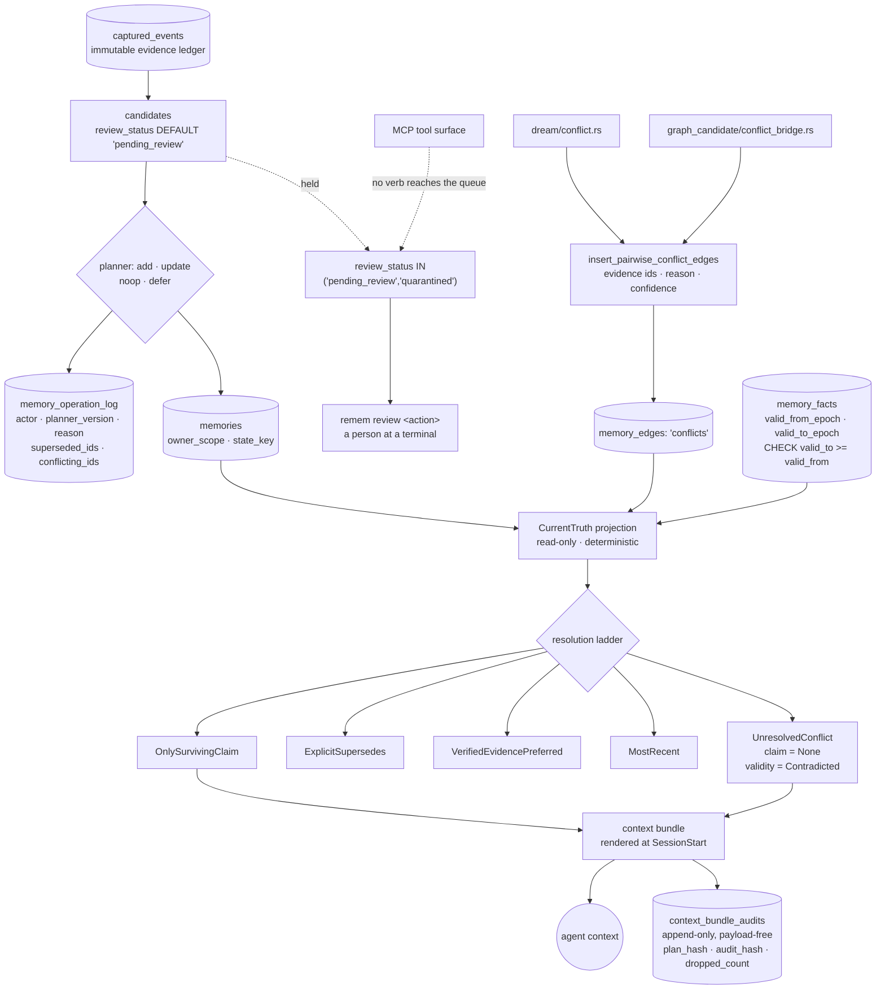

## 1. Executive Summary

remem is a local-first memory server for Claude Code and the OpenAI Codex CLI,
written in Rust over SQLite, reaching agents through hooks, MCP, a CLI and a
localhost REST API. MIT, and the tree is large — about 2,400 files.

**Five marks:** `trust_state`, `bitemporal`, `scope_enforced`, `human_review`
and `negative_eval`.

The centre of the design is a read-side projection called CurrentTruth, and its
header states the question it exists to answer: *"as of a given time, within a
given scope, which claims does the system currently consider true, which
conflict, and what evidence supports each conclusion?"* It is deterministic, it
never writes, and it *"never lets model-generated enrichment or stored
confidence numbers decide truth."*

What it does when it cannot decide is the thing worth carrying away. Two
surviving claims joined by a refutes relation do not get ranked; the projection
returns `claim: None` with `validity: Contradicted` and
`selected_reason: UnresolvedConflict`, listing both claims as evidence, under a
comment that is the whole policy in nine words: *"never silently pick a side."*
That projection is rendered into the context bundle the agent receives.

Two mechanisms are withheld, both over real machinery. The per-write
`memory_operation_log` records the actor, the planner version, the reason, and
the ids it superseded and conflicted with — and two paths `UPDATE` it after the
fact, so it is not append-only.

## 2. Mental Model

Nothing an agent produces becomes memory directly. Captured events become
candidates; candidates carry `review_status`, defaulting to `pending_review`;
promotion is a planner decision that writes a row in an operation log saying why
it was an add, an update, a noop or a defer. Reading is a separate question
again: the projection answers what is currently true over whatever survived, and
declines when the evidence does not settle it.

Storage posture and epistemic posture are two different axes and the code says
so — `RetentionState` carries the comment *"`Archived` does not mean false."*

## 3. Architecture

## 4. Essential Implementation Paths

**The refusal** — `src/truth/projection.rs:256-285`. A refutes relation between
two survivors returns a `CurrentTruthView` with `claim: None`,
`validity: ValidityState::Contradicted`, both claims under
`conflicting_claims`, and `selected_reason: TruthSelectionReason::UnresolvedConflict`.

**The ladder** — `src/truth/types.rs:149-159`. Five reasons in order:
`OnlySurvivingClaim`, `ExplicitSupersedes`, `VerifiedEvidencePreferred`,
`MostRecent`, `UnresolvedConflict`. Every projection carries the one that
applied, so the choice is inspectable rather than implied.

**The conflict producers** — `src/dream/conflict.rs:60` and
`src/graph_candidate/conflict_bridge.rs:48` both call
`insert_pairwise_conflict_edges`, which writes `MemoryEdgeType::Conflicts` rows
carrying evidence event ids, a source operation id, a confidence and a reason.
`src/truth/adapter.rs:502` maps the stored `"conflicts"` edge type to
`ClaimRelationKind::Refutes`.

**The review default** — `src/memory/types.rs:413`,
`review_status TEXT NOT NULL DEFAULT 'pending_review'`, with the same default in
the migrations for graph candidates, user-context candidates and user-context
claims. `src/memory_candidate/review.rs:204` reads
`WHERE c.review_status IN ('pending_review', 'quarantined')`.

**The validity read** — `src/context/hybrid_context.rs:497`,
`AND f.valid_from_epoch <= ?2`, with the same shape at `src/memory/facts.rs:242`
and `:299`. `src/memory/current_state.rs:327` composes
`COALESCE(valid_from_epoch, created_at_epoch) <= ?2`, which is the honest
fallback: when a fact carries no world time, record time stands in.

## 5. Memory Data Model

`memories` carry an `owner_scope` and a `state_key`. `memory_facts` are
subject/predicate/object with `valid_from_epoch` and `valid_to_epoch` under a
CHECK requiring `valid_to_epoch >= valid_from_epoch`, indexed as
`(project, subject, predicate, valid_from_epoch, valid_to_epoch)`.
`captured_events` is the evidence ledger the projection cites, and the claim
types name it as *"Immutable row in the `captured_events` ledger."*

Relations between claims are five kinds — `Supports`, `Refutes`, `Supersedes`,
`DerivedFrom`, `AppliesTo` — projected from `memory_edges`, trusted
`graph_edges`, and `user_context_claims.supersedes_claim_id`.

## 6. Retrieval Mechanics

A retrieval router over lexical and vector arms, assembled into a context bundle
at SessionStart. The CurrentTruth projection is rendered into that bundle
(`src/context/render.rs:497-506`), so the contradiction state reaches the model
rather than staying in a diagnostic.

Scope is `owner_scope` plus a resolved project set, composed into the
projection's own query (`src/truth/adapter.rs:60-75`).

## 7. Write Mechanics

The planner decides add, update, noop or defer, and records the decision in
`memory_operation_log` with the actor, the planner version, the source, the
owning scope, the candidate id, the resulting memory id, the superseded ids, the
conflicting ids, and a reason for a noop or a defer. The table's own header is
careful about its standing: *"an explanation layer, not the source of truth for
memory contents."*

## 8. Agent Integration

Hooks for Claude Code and Codex, an MCP server, a CLI, and a localhost REST API.
The CLI carries `Commands::Review` and `Commands::GraphReview`
(`src/cli/dispatch.rs:118-119`) with approve, edit and inbox actions.

## 9. Reliability, Safety, and Trust

**`trust_state`.** `ValidityState` is `Current`, `Superseded`, `Contradicted`,
`Stale`, `Expired`, `Unknown` — a discrete field, not a score, and
`Contradicted` withholds the claim by returning none. The separation is
deliberate: the projection refuses to let stored confidence decide, and
`RetentionState` is a second enum whose comment says archival is not falsity.

**`bitemporal`.** `valid_from_epoch`/`valid_to_epoch` against `created_at_epoch`,
constrained, indexed, and read on the retrieval path rather than only declared.

**`scope_enforced`.** `owner_scope` and the resolved project set compose into the
projection query and the fact reads.

**`human_review`.** Candidates default to `pending_review` and a person drains
the queue with `remem review`. The mark rests on reach: the MCP tool surface
carries no review or approve verb, so the agent that produced a candidate has no
path to promote it.

**`negative_eval`.** Committed must-not cases — section 10.

**`audit_log` is withheld.** `memory_operation_log` is the right content — one
row per write decision, with the actor and the reason — and two paths `UPDATE`
it afterwards to attach an activation id and a receipt
(`src/memory/scope_cleanup/plan.rs:285`, `receipt.rs:15`), so the table is not
append-only. The table that *is* append-only, `context_bundle_audits`, audits
injections rather than mutations and is deliberately payload-free: it stores a
`plan_hash`, an `audit_hash`, the degraded mode and the counts, not the
memories.

**`tombstone` is withheld.** A conflicts edge is keyed on a pair of memory ids
and a supersedes relation on another pair. Nothing is keyed on the value, so the
same claim arriving again is a new candidate that the projection will weigh
afresh rather than a re-assertion something refuses.

## 10. Tests, Evals, and Benchmarks

A large Rust suite beside the modules plus `tests/` at the root — `e2e_eval.rs`,
`benchmark.rs`, `api_public.rs`, `rate_limit.rs` — and CI at
`.github/workflows/ci.yml`. Nothing was installed and nothing was run: three
manifests sit inside the seven-day cooldown.

The must-not cases are about material reaching the agent, which is the right
place for this design. `src/context/tests/render_poisoning.rs:75` fails with
*"quarantined observations must not reach candidate generation"* — a negative
assertion on the extraction path, defended by a panic rather than a soft
comparison. `src/context/tests/current_truth_activation.rs` drives the
projection through a seeded `("conflicts", 75, 76)` edge and checks the
contradiction surfaces in the rendered bundle.

There is also an `eval/` directory and a committed benchmark harness, neither of
which was run here.

## 11. For Your Own Build

### Steal

- **Return no answer when two survivors refute each other.** Ranking a
  contradiction produces a confident wrong answer; `claim: None` with both
  claims attached produces a question the agent can act on.
- **Name the reason the winner won.** A projection that carries
  `ExplicitSupersedes` versus `MostRecent` can be argued with; one that returns
  only the winner cannot.
- **Keep retention and truth on separate enums, and say why in the type.**
  *"`Archived` does not mean false"* is four words that stop a whole class of
  bug.
- **Default the candidate status to `pending_review` in the schema.** A default
  in the column is harder to forget than a call to a gate.
- **Make the audit payload-free.** `context_bundle_audits` stores hashes and
  counts, so the record of what was injected does not duplicate the corpus.

### Avoid

- **Updating rows in your audit table.** `memory_operation_log` has exactly the
  content an audit wants and two `UPDATE` paths, which is the difference between
  a log and a record.
- **Leaving the same status vocabulary in four migrations.** `pending_review`
  is defaulted independently for memories, graph candidates, user-context
  candidates and user-context claims; a fifth surface will have to remember.

### Fit

Take it if you want per-project agent memory on one machine and are willing to
work a review queue. The contradiction policy is the part worth reading even if
you take nothing else.

## 12. Open Questions

- `memory_operation_log` is updated to attach an activation id. Could the
  receipt be a second row instead, and the table left append-only?
- The MCP surface has no review verb today. Is that a decision or an absence
  waiting to be filled by a convenience tool?
- `COALESCE(valid_from_epoch, created_at_epoch)` means an unsupplied world time
  silently becomes record time. Which extraction paths supply it?
- `context_bundle_audits` records `dropped_count` but not what was dropped. What
  would a reader do with a suspicious drop count?

## Appendix: File Index

| Path | What it holds |
| --- | --- |
| `src/truth.rs` | the projection's contract, stated in its module header |
| `src/truth/projection.rs` | the resolution ladder and the refusal to pick a side |
| `src/truth/types.rs` | `ValidityState`, `RetentionState`, `ClaimRelationKind`, `TruthSelectionReason` |
| `src/truth/adapter.rs` | the scope-composed query and the `conflicts` → `Refutes` mapping |
| `src/memory/edge.rs` | `insert_pairwise_conflict_edges` and the edge write context |
| `src/dream/conflict.rs` | the background pass that writes conflict edges |
| `src/memory/types.rs` | `review_status` defaulting to `pending_review` |
| `src/cli/dispatch.rs` | the `Review` and `GraphReview` commands a person runs |
| `src/migrations/v024_memory_operation_log.sql` | the per-write explanation layer |
| `src/migrations/v081_context_bundle_audits.sql` | the append-only, payload-free injection audit |
| `src/migrations/v013_memory_temporal_facts.sql` | the validity columns, their CHECK and their index |

## Appendix: Recorded Searches

Run from the root of the checkout at the pinned commit.

| Claim | Command | Result at this pin |
| --- | --- | --- |
| The MCP surface has no review or approve verb | `grep -rn "review\|approve" --include='*.rs' src/mcp` | Nothing naming a tool; the review commands live in `src/cli/dispatch.rs:118-119` |
| Conflict edges have live producers | `grep -rn "insert_pairwise_conflict_edges" --include='*.rs' src \| grep -v tests` | `src/dream/conflict.rs:60` and `src/graph_candidate/conflict_bridge.rs:48` |
| The projection reaches the agent, not only the doctor | `grep -rn "current_truth_projection" --include='*.rs' src/context` | Rendered at `src/context/render.rs:497-506` and in `render_bundle.rs` |
| The operation log is updated in place | `grep -rn "memory_operation_log" --include='*.rs' src \| grep -iE "insert\|update"` | Three `INSERT`s and two `UPDATE`s, at `scope_cleanup/plan.rs:285` and `scope_cleanup/receipt.rs:15` |
| `captured_events` is not mutated outside tests | `grep -rn "UPDATE captured_events\|DELETE FROM captured_events" --include='*.rs' src` | Four hits, all in test modules seeding or ageing fixtures |
| The validity window is read, not only declared | `grep -rn "valid_from_epoch" --include='*.rs' src \| grep -iE "where\|<=\|>="` | `context/hybrid_context.rs:497`, `memory/facts.rs:242` and `:299`, `memory/current_state.rs:327` |
| The licence carries no rider | `head -3 LICENSE`; `grep -n -i 'anthropic\|may not' LICENSE` | Stock MIT, no match |

## History

**2026-09-20** — [`335bb29440e829b233e2ae0302ca6f9710300e4c`](https://github.com/majiayu000/remem/commit/335bb29440e829b233e2ae0302ca6f9710300e4c) — first reading, at roughly 2,400 files. Screened before reading: one auto-run surface, two build-time execution points, three manifests inside the seven-day cooldown and no unpinned surface; nothing was installed and nothing was run, so the committed `eval/` harness and benchmark were read rather than executed. MIT. Five marks: `trust_state`, `bitemporal`, `scope_enforced`, `human_review` and `negative_eval`. `human_review` rests on reach rather than on a gate — candidates default to `pending_review` in the schema and the only surface that drains the queue is a terminal command the MCP tool list does not carry. `audit_log` is withheld over a per-write log with the right content and two in-place `UPDATE` paths, and `tombstone` over relations keyed on record pairs rather than on the value; each withholding rests on a search recorded in the appendix.
