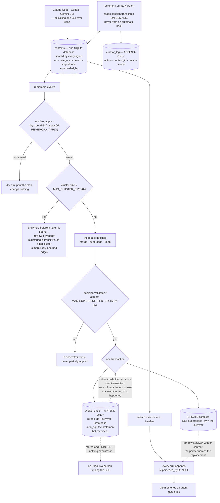

## 1. Executive Summary

Rememora is "[p]ersistent, cross-agent memory for AI coding agents. One SQLite
database, shared by every agent you use" — MIT, Rust, version 1.7.0, 17,313
lines across 56 files with 345 tests, plus a Tauri desktop app and a benchmark
harness. The premise is stated as a complaint: Claude Code, Codex and Gemini CLI
"each lose context between sessions", and switching agents mid-task starts you
from scratch.

**The mechanism to take away is how it sizes its guards.** Consolidation here is
a language model reading a cluster of similar memories and deciding to merge,
supersede or keep. Most systems in this corpus that do this bound the work by
what the model can handle. Rememora bounds it by what a wrong answer would cost:

> "Largest number of memories one consolidation decision may supersede. This is
> the blast radius of a single LLM call. It is deliberately much smaller than
> `MAX_CLUSTER_SIZE` so that even a fully-hallucinated decision can only retire
> a handful of records."

`MAX_SUPERSEDE_PER_DECISION` is five; `MAX_CLUSTER_SIZE` is eight. The gap
between those two numbers is the whole idea, and it only exists because someone
asked what happens when the model is confidently wrong rather than when it is
slow.

**The cluster limit is a refusal, not a cap.** A cluster over the limit is not
trimmed and processed — it is skipped before a token is spent, with the reason
handed back to the person:

> "cluster has {n} memories, over the safe limit of {MAX_CLUSTER_SIZE} — review
> it by hand"

and the argument for why is written above it: clustering is transitive, so a
large cluster "is more likely to be one bad edge chaining unrelated memories
than a genuine pile of duplicates". That is a system declining to act on its own
weakest inference rather than acting carefully.

**Writing is armed, not assumed.** `resolve_apply` is one line —
`!dry_run && (apply_flag || env_armed)` — so evolve is a dry run unless
`--apply` is passed or `REMEMORA_APPLY=1` is set, and `--dry-run` beats both.
The constant that holds the environment variable calls it the one that "arms the
destructive path".

**And the project removed the automation that would have gone around all of
this.** The v1.7.0 notes lead with it: Rememora "no longer wires any automatic
Claude Code / Gemini CLI hooks", `setup --apply` "self-heals any existing
install by stripping them out", and curation now runs from `rememora curate` or
`rememora dream`, "never from an automatic hook". Taking away a feature that
made the product feel autonomous, and shipping code that uninstalls it from
machines that already had it, is a stronger signal than any flag default.

**What retrieval withholds is a supersession.** `contexts.superseded_by` is a
pointer to the memory that replaced this one, and `superseded_by IS NULL` is
appended to the full-text search, the vector nearest-neighbour search and the
timeline — all three arms, not the one somebody remembered. The row survives
with its content intact, so the history is readable and the replacement is
named.

**The honest limits are three.** The epistemic vocabulary is one bit: superseded
or not, with nothing for a claim that is disputed or believed on thin evidence,
and the bit is set by a model. Reversibility is narrower than the release notes
suggest — the undo journal stores and prints the SQL that would reverse a
decision, and nothing executes it, which is why the cluster-size constant can
still call consolidation "irreversible" without contradicting itself. And the
project key does not bind: the search applies its URI prefix only when a project
is supplied, in a database the design deliberately shares across every agent on
the machine.

## 2. Mental Model

One database, many agents, and every interesting rule is about what happens when
something automated wants to change it.

A memory is a row addressed by a `rememora://` URI. Agents write memories by
calling the CLI over Bash. Curation reads session transcripts and proposes
memories; consolidation clusters similar ones and asks a model what to do with
each cluster. Both are commands, both write to an audit surface, and the second
one refuses work it judges unsafe to hand a model.



## 3. Architecture

| Area | Role |
| --- | --- |
| `src/models/` | The context record, relations, watermarks and the curator log |
| `src/migrations/` | Numbered SQL migrations with their design commentary |
| `src/search.rs` | Full-text search with boolean grouping and a BM25 noise floor, and the vector arm |
| `src/propagate.rs` | Graph propagation across relations with a depth bound |
| `src/evolve.rs`, `src/commands/evolve.rs` | The clustering limits, the consolidation pass, and the undo journal |
| `src/curator.rs`, `src/commands/curate.rs` | Transcript extraction, on demand |
| `src/commands/setup.rs` | Installation, and the code that strips the hooks the project removed |
| `app/` | The Tauri desktop application |
| `bench/`, `tests/eval_retrieval.rs` | Retrieval measurement |

## 4. Essential Implementation Paths

- `src/evolve.rs:24-35` — `MAX_CLUSTER_SIZE` and `MAX_SUPERSEDE_PER_DECISION`, with the blast-radius argument.
- `src/commands/evolve.rs:133-134` — `resolve_apply`, the arming rule.
- `src/commands/evolve.rs:205-228` — the oversized-cluster refusal and the discarded-decision path.
- `src/commands/evolve.rs:561-584` — the undo table and why it is created inside the decision transaction.
- `src/commands/evolve.rs:691-710` — `append_undo`.
- `src/models/context.rs:161` — the supersession write.
- `src/search.rs:178`, `:403`, `src/timeline.rs:96` — `superseded_by IS NULL` on all three arms.
- `src/migrations/003_curator.sql:27-40` — the curator audit log.
- `src/commands/setup.rs:274-280` — `strip_rememora_hooks`.

## 5. Memory Data Model

A context carries a `uri`, an optional `parent_uri`, a `context_type` constrained
to memory, resource, skill or project, an optional `category` constrained to
preference, entity, decision, event, case or pattern, a name, an abstract, an
overview, the content, tags, the `source_agent` and `source_session`, an
`importance`, an `active_count` and `superseded_by`.

The schema comment explains the single-table choice: it "outperforms a
table-per-kind design for long-tail entity types, and keeps hotness/importance
ranking uniform across all memory categories".

`category` is a write-time genre and `importance` is a ranking input, so neither
carries the trust mark; `superseded_by` is the one field retrieval consults to
withhold. Sessions carry their own `status` — active, ended or transferred —
which is a session lifecycle rather than a claim about a memory.

Every timestamp is a record time. There is no validity interval and no as-of
read, so `bitemporal` is withheld on an absence.

## 6. Retrieval Mechanics

Three arms, each filtering superseded rows. Full-text search supports grouped
boolean expressions and applies a noise floor, with a comment explaining the
number: FTS5 clamps non-positive IDF — a term in more than half the documents —
to 1e-6, so a hit whose whole score comes from such terms lands around 1e-6 and
is not a match. A vector arm searches context embeddings. Propagation walks
relations to a bounded depth.

Project scoping is a URI prefix, applied only when a project is passed.

## 7. Write Mechanics

An agent saves a memory through the CLI. Curation reads transcripts on demand,
tracking how far it has read in a `watermarks` table so a re-run does not
re-extract, and writing a `curator_log` row for every action including `noop`.

Consolidation is the pass with the guards. Clusters over eight memories are
refused outright; the model is asked about the rest; a decision that fails
validation is discarded whole "not partially applied, and the run continues with
the next cluster"; an applied decision writes its supersessions and its undo row
in one transaction.

## 8. Agent Integration

The CLI is the interface, callable over Bash by any agent, with a Tauri desktop
app beside it and a Homebrew tap for installation. `agent_invocations` and
`hook_invocations` tables record who called what.

The integration story is mostly about what was removed. v1.7.0 stopped wiring
lifecycle hooks into Claude Code and Gemini CLI, and `setup --apply` now strips
any it previously wrote — "preserving all non-rememora user content untouched",
dropping an event array that ends up empty rather than leaving it as `"Event":
[]`, and treating a missing file as a no-op rather than an error.

## 9. Reliability, Safety, and Trust

**Human review — awarded.** The dry-run default and the explicit arming are the
gate; the oversized-cluster refusal is what actually routes work to a person,
because it hands the cluster back with a reason rather than proceeding; and the
hook removal is the strongest evidence, because it is a feature the project took
away and wrote code to uninstall.

**Audit log — awarded, and bounded.** Two append-only records, one of them
transactional, covering curation and consolidation. An ordinary save is not
journalled, and the mark is awarded on what these two tables do rather than on
coverage of every mutation.

**Trust state — awarded, and thin.** One bit and a pointer, consulted on all
three retrieval arms. There is no vocabulary for a disputed or unverified claim,
and the bit is a model's judgement.

**Negative evaluation — awarded.** The search cases assert presence and absence
over the same populated result set, which is what stops a must-not assertion
passing on an empty answer.

**Tombstone — withheld.** A superseded memory is retained and its replacement
named, which is the right shape for history, but nothing is keyed on the
memory's content and no write path consults the retired row. A claim
consolidation removed from retrieval can be saved again as a new row.

**Scope enforced — withheld.** The project prefix is applied only when a project
is supplied, in a database shared across every agent on the machine.

## 10. Tests, Evals, and Benchmarks

345 test attributes, with behaviour tests organised by subject —
`behavior_search`, `behavior_propagation`, `behavior_timeline`,
`behavior_worktree`, `behavior_hotness` — plus a scenarios directory and a
written `SCENARIOS.md`. `tests/eval_retrieval.rs` and the `bench/` directory
carry retrieval measurement separately from the assertions.

The consolidation tests are the load-bearing ones for this report:
`test_applied_supersession_is_journalled_in_the_database` drives an armed run
and checks that the journal row names the retired and surviving ids and that the
recorded SQL "really does put the memory back".

## 11. For Your Own Build

- **Size the cap by what a wrong answer costs.** Five is not five because five
  memories fit in a prompt; it is five because a hallucinated decision should
  only be able to retire five records. Set the blast radius below the batch
  size, deliberately, and write down why.
- **Refuse the input you distrust rather than handling it carefully.** A cluster
  built by transitive similarity is exactly where a bad edge hides, so the safe
  move is to hand it back, not to process it with more prompting.
- **Write the undo row in the same transaction as the change.** It costs
  nothing and it buys the property that the journal cannot claim a decision that
  did not happen.
- **Store the statement that reverses it.** Even unexecuted, a recorded
  `undo_sql` turns "we changed something" into "here is exactly what to run" —
  though if you say reversible in your release notes, say who runs it.
- **Removing your own automation is a legitimate safety change.** This project
  shipped code that uninstalls hooks it had previously installed, rather than
  leaving them and documenting a flag.

## 12. Open Questions

- Will anything execute `undo_sql`? The journal has the statement, the ids and
  the timestamps; what is missing is the command that applies one and a column
  recording that it was applied.
- Should the project prefix be mandatory in a shared database? The design
  deliberately shares one store across agents, which is exactly the setting in
  which an omitted predicate reads across everything.
- Is one bit enough? A memory can be superseded or current, and nothing can say
  a claim is disputed, unverified, or believed on evidence the curator flagged
  as thin.
- What stops a consolidated claim returning? Nothing is keyed on content, so the
  same memory can be saved again after being retired.

## Appendix: File Index

| Path | What lives there |
| --- | --- |
| `src/evolve.rs` | The cluster and supersession limits with their rationale, and the BM25 noise floor |
| `src/commands/evolve.rs` | The consolidation pass, the arming rule, the refusals and the undo journal |
| `src/commands/curate.rs`, `src/curator.rs` | Transcript extraction on demand |
| `src/models/context.rs` | The context record, its loads and the supersession write |
| `src/models/watermark.rs` | The curator-log insert and the read watermark |
| `src/search.rs` | Both retrieval arms, each filtering superseded rows |
| `src/propagate.rs` | Depth-bounded graph propagation |
| `src/commands/setup.rs` | Installation, and `strip_rememora_hooks` |
| `src/migrations/001_initial.sql` | Contexts, sessions and relations, with the single-table argument |
| `src/migrations/003_curator.sql` | The curator audit log and the consolidation-run record |
| `tests/behavior_search.rs` | The presence-and-absence search cases |
| `tests/behavior_propagation.rs` | The superseded-exclusion case |

Searches behind the absence claims above, run from the repository root:

```sh
grep -rn 'DELETE FROM curator_log\|UPDATE curator_log' src --include='*.rs'   # nothing: append-only
grep -rn 'DELETE FROM evolve_undo\|UPDATE evolve_undo' src --include='*.rs'   # nothing: append-only
grep -rn 'undo_sql' src --include='*.rs'                  # stored and printed; no execute
grep -rn 'valid_from\|valid_to\|as_of' src --include='*.rs'   # no validity axis
```

## History

**2026-09-16** — [`9fe78eba7d68b4387e867492268cc82ed104bbf3`](https://github.com/Rememora/rememora/commit/9fe78eba7d68b4387e867492268cc82ed104bbf3) — first reading, at a commit dated 15 September 2026, version 1.7.0. Screened before opening, from a full clone so dependency ages are the project's own rather than the clone's: fourteen files scanned, one auto-run surface, one build-time execution point, two unpinned dependency surfaces and two dependency files inside the seven-day cooldown, with `app/src-tauri/Cargo.lock` unchanged for 143 days and `bench/pnpm-lock.yaml` for 168. `AGENTS.md` and `CLAUDE.md` are addressed to a reading agent and were recorded as data. Nothing was installed, built or run, and no benchmark was reproduced.
