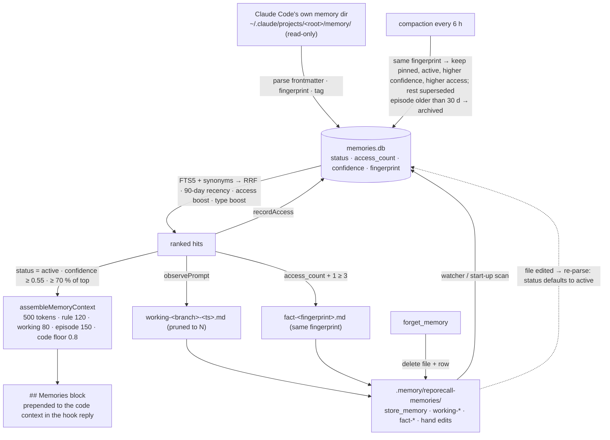

## 1. Executive Summary

Reporecall is a **codebase memory for Claude Code**: a local daemon that
indexes a repository with tree-sitter into chunks, a call graph and an
import graph, answers a `UserPromptSubmit` hook with pre-assembled code
context so the agent stops grepping, and — from version 0.3.0 on
21 March 2026 — carries a memory layer beside the code index. MIT, 40
commits between 17 and 21 March 2026 under two author names sharing one
address, 18,810 lines of TypeScript in `src/` and 54 test files with
646 test functions. The tree at this URL is a copy: `package.json`
names `proofofwork-agency/reporecall` as the repository and
`@proofofwork-agency/reporecall` as the package, the GitHub repository
returns 404, the npm package has 23 versions with a latest of 0.9.1
published 4 August 2026, and the copy's owner made none of the commits.
This report reads version 0.3.3, the last commit here.

The memory layer is 2,711 lines. A memory is a markdown file with YAML
frontmatter — `name`, `description`, `type`, and from Memory V1 a
`class` of `rule`, `fact`, `episode` or `working`, a `scope`, a
`status`, a `summary`, a `sourceKind`, a `fingerprint`, `pinned`,
`confidence`, `supersedesId` and related files and symbols
(`src/memory/types.ts`, `parser.ts`). Two directories are indexed: the
project's `.memory/reporecall-memories/`, which the tools write, and
Claude Code's own memory directory for the project,
`~/.claude/projects/<encoded root>/memory/`, discovered by path
encoding and treated as read-only (`indexer.ts:34-60,:455-460`) — so
the files the agent writes for itself become retrievable through the
hook with a default confidence of 0.8 (`:131`). Files are parsed into a
SQLite `memories` table with an FTS5 index (`storage/memory-store.ts:199-230`),
searched by keyword with a synonym map and scored by reciprocal rank
plus a 90-day recency decay, an access-count boost and a type boost
(`search.ts:78-140`), and assembled into a `## Memories` block under
a 500-token budget split per class — 120 for rules, 80 for working, 150
for episodes — with a code floor of 80 % of the total context
(`context.ts:71-205`, `hooks/prompt-context.ts:83-101`).

**Where it is thin is the part that is memory rather than index.** The
lifecycle state — `archived` after 30 days for episodes, `superseded`
for a duplicate fingerprint — is written by compaction to the index
row only (`memory-store.ts:633-651`); the markdown that the README
calls the readable, editable source of truth never learns it, and a
re-index after any edit re-parses `status` from frontmatter and defaults
it to `active` (`indexer.ts:260`). The promotion pass writes a `fact`
file with the source's own fingerprint after three retrievals
(`daemon/memory/runtime.ts:321-356`); the next compaction groups the two
by fingerprint and keeps the one with the higher confidence, then the
higher access count (`memory-store.ts:675-685`) — the original, on every
default path — and marks the promoted copy `superseded`. The `scope`
column is stored on every row and applied only when an MCP caller asks
for it; the hook path passes `statuses: ["active"]` and a confidence
floor and no scope (`prompt-context.ts:186-187`), so a branch-scoped
memory from another branch is injected like any other. `forget_memory`
deletes the file and the row and records nothing; a Claude Code file
with the same content is re-imported when it next changes.

One mark, `negative_eval`, for a committed case that stores an active
and an archived copy of the same text and asserts the archived one is
absent from the default search and present when asked for. No paper;
the README cites an Amazon Science preprint on keyword retrieval as
context for the code index, not for the memory.

## 2. Mental Model

A memory is a file someone wrote: the agent through `store_memory`, the
agent's host through its own memory feature, the daemon through its two
generated kinds, or a person with an editor. It becomes retrievable when
the watcher or a start-up scan parses it, tags it, fingerprints it and
upserts the row. It is retrieved by keyword — the FTS5 match is the
primary signal, and the recency of the file's modification time, how
often it has been retrieved and its type (feedback above user and
project above reference) adjust the rank; a hit whose score is below
70 % of the top hit is dropped, and on the hook path so is anything
below confidence 0.55 or not `active`. Every retrieval increments the
row's access count, which feeds the next ranking and, at three, the
promotion pass.

It stops being retrievable three ways. Compaction marks an episode
`archived` after 30 days of index age and marks every duplicate
fingerprint but one `superseded`, both in the row; the default search
sees neither, and `recall_memories` can ask for either. `forget_memory`
removes the file and the row. And a working memory is replaced by the
next one: each observed prompt writes a timestamped `working-*` file —
the query, the code route, the branch, the active files, the top
symbols, the memory hits — and prunes the history to a configured
count, one by the README's default. A `pinned` file survives compaction
whatever its age or fingerprint.



## 3. Architecture

`src/` is a daemon (`daemon/server.ts`, `daemon/mcp-server.ts` with 18
tools, `daemon/scheduler.ts`, `daemon/memory/runtime.ts`), an indexer
(`indexer/pipeline.ts`, tree-sitter chunking for 22 languages, a Merkle
tree for change detection, an optional embedder), a search stack
(`search/hybrid.ts` at 2,310 lines — FTS5 and vector fusion, seed
resolution, intent routing to R0/R1/R2, call-tree building, context
assembly), storage over `better-sqlite3` and LanceDB, and the memory
layer: `memory/{types,parser,indexer,search,context,files}.ts`,
`storage/memory-store.ts` and `daemon/memory/runtime.ts`. The CLI is
`reporecall init | index | serve | search | stats | doctor | mcp`, also
installed as `memory`. `init` writes `.memory/`, a `.memoryignore`, the
two hooks into Claude Code's settings as `curl` calls to the daemon, an
`.mcp.json` and a `CLAUDE.md` instruction block (`cli/init.ts`). The
repository's own `.claude/` carries 31 agent prompt files for its
development and an empty settings file.

Storage under `.memory/`: `metadata.db` (files, chunks, call edges,
imports, targets, conventions), `fts.db`, `lance/` when the semantic
provider is on, `merkle.json`, `memories.db`, and
`reporecall-memories/`. The memory table's schema
(`memory-store.ts:199-230`) adds `access_count`, `last_accessed`,
`importance` and `tags` by migration on older files.

### Deployment and ergonomics

Node, a lockfile, tree-sitter grammars as WebAssembly, and an optional
local embedding model through `@huggingface/transformers` or Ollama; the
daemon binds to 127.0.0.1:37222 with a bearer token in a file with
restrictive permissions, rate limits per client, and refuses symlink
escapes and path traversal. Nothing leaves the machine. The screen found
two auto-run surfaces — the committed `.mcp.json` starts `npx reporecall
mcp` for any harness that reads it, and a `.claude/settings.json` that is
empty — a `prepublishOnly` build, and 22 floating ranges pinned by a
lockfile 169 days old at this commit.

## 4. Essential Implementation Paths

- **Discover and index.** `createMemoryIndexer` (`indexer.ts:438-483`)
  adds the Claude Code directory as read-only and
  `.memory/reporecall-memories/` as writable; `indexAll` and `indexFile`
  (`:187-312`) skip a file whose mtime matches the row, parse
  frontmatter, infer `sourceKind` from the directory (`:123-127`),
  default `class` from `type` (feedback → rule, the rest → fact),
  `scope` from `type`, `status` to `active`, `fingerprint` to a SHA-256
  of name, description and content, and `confidence` by source (`:131-135`).
- **Search.** `MemorySearch.search` (`search.ts:78-230`): FTS5 with the
  original query, then with synonym expansion when fewer than three
  hits; scores from rank, recency, access count, contextual boosts for
  active files and top symbols, a class boost and a type multiplier;
  filters for status, class, scope, confidence, the 70 % relative cut.
- **Assemble.** `assembleMemoryContext` (`context.ts:71-205`): sort by
  class priority then score, compress a memory below half the top score
  to its summary, drop on the total budget or the class budget, report
  a route of M0, M1 or M2.
- **Inject.** `prompt-context.ts:83-160`: the code context first, the
  memory budget as the smaller of 500 and what remains, the `##
  Memories` block prepended to the code text; `recordAccess` on each
  included hit (`:208`); the daemon then calls `observePrompt`
  (`server.ts:787`).
- **Generate.** `observePrompt` (`runtime.ts:145-156`) writes the
  working file (`:275-319`) and runs `promoteFacts` (`:321-356`);
  `pruneWorkingHistory` (`:358-370`) keeps the newest N.
- **Compact.** `MemoryStore.compact` (`memory-store.ts:659-712`): group
  by fingerprint, keep one, supersede the rest; archive unpinned active
  episodes older than the threshold; `MemoryRuntime` runs it at start
  and every `memoryCompactionHours`.
- **Tools.** `store_memory` writes through `buildMemoryMarkdown`
  (`files.ts`) into the first writable directory, warning on a similar
  name; `forget_memory` deletes after checking the path is inside an
  indexed directory (`mcp-server.ts:1097-1160`); `recall_memories`
  passes every filter through; `explain_memory` reports the route and
  budgets; `compact_memories` and `clear_working_memory` do what they
  say; `list_memories` lists.

## 5. Memory Data Model

The file is the record and the row is its index. `type` is Claude
Code's own vocabulary — `user`, `feedback`, `project`, `reference` —
and `class` is Reporecall's, derived when absent. `status` is
`active`, `archived` or `superseded`; `scope` is `global`, `project` or
`branch`; `sourceKind` is `claude_auto`, `reporecall_local` or
`generated`. `fingerprint` is the dedup key and is either declared in
the file or computed. `confidence` is a number in [0, 1]. `supersedesId`
and `reason` are written by compaction and by the promotion pass — into
the row; `buildMemoryMarkdown` can serialise all of them, and only the
daemon's generated files carry them. `access_count` and `last_accessed`
exist only in the row.

The consequence is the report's main finding. `archive` and `supersede`
call `updateMetadata` on the row (`memory-store.ts:633-651`) and nothing
touches the file; `indexFile` re-parses a changed file and sets
`status = parsed.status ?? "active"` (`indexer.ts:260`). An archived
episode a person edits is active again; a superseded duplicate whose
file changes is current again; and the Claude Code directory is
read-only by design, so its files can never carry the state the index
assigned them. The README's *"readable, editable, deletable without
tooling"* is true of the content and not of the lifecycle.

## 6. Retrieval Mechanics

Keyword only, by the module's own doc comment: *"memories are short
structured text where FTS5 with auto-tagging and synonym expansion
outperforms embedding-based retrieval. Benchmarked at 12-50 memories."*
The synonym map is sixteen entries (`search.ts:47-64`). The rank is
`0.6 / (60 + rank)` plus `0.15 × recency` over a 90-day linear decay of
the file's mtime plus `0.25 × min(1, access/10) / 61` plus small
contextual bumps, times a type multiplier of 1.3 for feedback; the
recency term dominates the reciprocal-rank term for any memory under a
few weeks old, which is what puts a fresh episode above a stale copy in
the benchmark suite. Working memories are branch-scoped when a branch
is detected and project-scoped otherwise, and the hook does not filter
on scope, so the previous branch's working set is a candidate for the
next branch's prompt until it is pruned.

The code index beside it is the larger machine: FTS5 and cosine fused
by reciprocal rank, seeds from identifier-shaped tokens, a rule-based
intent classifier that routes to a fast lookup, a call-tree flow, a
broad architecture bundle or a skip, and a context assembler that
prefers implementation over tests. The committed `benchmark-results.json`
records 54 queries in keyword mode at NDCG@10 0.455 and MRR 0.637 with
route accuracy of 87 %, matching the README.

## 7. Write Mechanics

Writes are files. `store_memory` blocks on a file write and an index
update; the watcher picks up hand edits with a debounce; Claude Code's
own writes arrive the same way. Nothing is extracted from a
conversation — the daemon's only automatic writes are the working file
per prompt and the promoted fact — and no model is called anywhere in
the memory layer. A memory is retrievable as soon as its row exists,
which is the debounce after the write.

Two passes rewrite state. Compaction touches rows only, as above. The
promotion pass writes a new file: for each hit of class `rule` or `fact`
that is not itself generated and whose access count will reach three,
`fact-<12 hex of fingerprint>.md` with the source's fingerprint,
`confidence = max(0.7, source)`, `sourceKind: generated`, and the
source's content under a *Promoted fact from* line. At the next
compaction the two rows share a fingerprint; the sort keeps the pinned
one, then the active one, then the higher confidence — a tie for a
Claude Code source at 0.8 and for a local one at 0.7 — then the higher
access count, which the source has and the copy does not. The promoted
file is marked `superseded` and stays on disk. The runtime test asserts
the promoted file exists after `observePrompt`; no test runs compaction
after promotion. Whether promotion was meant to replace the source or to
duplicate it, the tree does neither for long.

Deletion is a file and row removal with no record; the store's
`remove` and the tool's path check are the whole path. Duplicate
detection at `store_memory` is a name match and an FTS similarity
warning, not a block.

### Operational cost

Indexing a memory file is a parse and one upsert; a search is one or two
FTS5 queries and a scoring loop over at most twenty rows; the hook's
memory step is bounded by the 500-token budget. The daemon holds the
SQLite files open and the code index is the memory cost. No tokens are
spent on the memory layer at all, which is the design's point.

## 8. Agent Integration

The agent sees a `## Memories` block ahead of the code context on every
routed prompt, with class labels — *Guidance* for a rule, *User
context*, and so on — and a compressed summary line for weaker hits,
and it sees seven memory tools beside eleven code tools over MCP. The
session-start hook injects a behaviour instruction and a conventions
summary; the 0.3.3 changelog records the instruction being reworded to
*"use whichever tool fits"* after a version that told Claude to prefer
the MCP tools, and the `PreToolUse` hook being reverted from a hard deny
of redundant searches to a nudge, because it had blocked subagents.

A person has the files. `MEMORY.md` is regenerated in the writable
directory as a one-line index, up to 190 entries sorted by importance,
and never in the Claude Code directory. There is no review surface, no
approval and no status a person sets other than by editing frontmatter,
which the index honours only on the next change.

## 9. Reliability, Safety, and Trust

**Negative evaluation — awarded.** `search.test.ts:155-180` stores two
memories with the same text, one archived, and asserts the archived id
is absent from a populated default result and present when its status
is requested. The benchmark suite's compaction case pins a stricter
fact: the archived episode stays out even of the search that asks for
archived rows (`memory-benchmark.test.ts:579-583`), which the assertion
treats as correct; the 70 % relative cut and the class filter are the
likely reason, and a reader who relies on `statuses: ["archived"]` to
audit what was archived should know the result can be empty.

**Trust state — withheld.** `status` is a lifecycle label written by
compaction, not an epistemic one; `confidence` is a number set by source
and used as a floor. Nothing marks a memory candidate, verified or
rejected, and nothing reviews one.

**Tombstone — withheld.** `forget_memory` removes the file and the row
and records nothing; a file with the same content in the read-only
Claude Code directory is re-imported on its next change, and a
superseded duplicate returns as active if its file is edited.

**Scope — withheld.** The `scope` column is stored on every row and is a
filter only when an MCP caller passes `scopes`; the hook path does not,
and the per-project `.memory/` directory is deployment topology.

**Bitemporal, audit, human review — withheld.** One `fileMtime` and one
`indexedAt` per row; no event record; no surface but the files.

**State in the wrong place.** The lifecycle the compaction pass
maintains lives in `memories.db` and the files are authoritative on
every re-parse, so the pass's work is undone by an edit, a re-clone, or
a rebuild of the index from disk; `status` defaults to `active` at
parse time and `pinned` to `false`.

**A copy of a moved project.** The manifest's repository returns 404;
the package it names has released 23 versions to 0.9.1 by 4 August
2026; this tree is 0.3.3 from 21 March with no commits by the account
hosting it. Everything above is true of this commit and says nothing
about the package a user installs.

## 10. Tests, Evals, and Benchmarks

54 test files and 646 test functions under vitest; 65 of them in the
memory layer across `test/memory/{parser,indexer,memory-store,search,context}.test.ts`,
`test/daemon/memory-runtime.test.ts` and two benchmark suites. The
store tests cover upsert, lookup, FTS, migration of an older table and
one compaction case (duplicate fingerprints superseded, an old episode
archived); the search tests cover keyword hits, type filters, the
feedback boost and the archived exclusion; the runtime test covers
import from both directories, incremental refresh on add, change and
unlink, and one prompt producing a working file and a promoted fact.
Each can fail, and the negative case has its positive control.

`memory-benchmark.test.ts` (666 lines) is a deterministic suite over a
fixture of every class with thresholds: indexing latency, retrieval of
expected memories per class, fresher episodes above stale copies,
class- and file-aware working retrieval, the M0/M1/M2 routes, token
budgets, and the compaction case above; it prints a scorecard. The live
wrapper validates a report schema and *soft floors*. Neither runs
compaction after promotion, and no test asserts what a file re-parse
does to a row's status.

The code benchmark is committed: `benchmark-results.json` with 54
queries, per-route and per-category tables, and latencies, recomputable
with `npm run benchmark` in keyword mode; the README's DUTO section
reports a fleet test on a 1,032-file project by eight parallel agents
with a per-query table. The `ROADMAP.md` lists *memory compaction
quality metrics* — dedup accuracy, promotion precision, recall after
compaction — as not yet measured. No paper.

## 11. For Your Own Build

### Steal

- **Index the agent's own memory directory.** Claude Code writes
  frontmatter markdown for itself; reading it read-only and ranking it
  costs nothing and gives the hook the agent's notes without a second
  store.
- **Budget per class, with a code floor.** Rules get 120 tokens that
  episodes cannot take, and memory never displaces more than 20 % of
  the code context.
- **Derive class and scope from the type when absent.** Feedback is a
  rule and global; a project note is a fact and project-scoped; the
  defaults are the sensible ones and the file need not say.
- **A deterministic benchmark for the memory layer with thresholds** —
  latency, retrieval per class, freshness ordering, budgets — that runs
  in the unit suite.

### Avoid

- **Lifecycle state in the index when the file is the source of
  truth.** Write `status`, `supersedesId` and `reason` back to the
  frontmatter, or accept that any edit resurrects.
- **Promoting by copying the fingerprint.** A copy that shares its
  source's dedup key is the row compaction removes; give the promoted
  fact its own identity and supersede the source explicitly, or do not
  write it.
- **A scope column the injection path never reads.** Branch working
  sets leak across branches until pruned.
- **A test that pins the wrong answer.** An archived row absent from a
  search that asked for archived rows is a defect the suite
  protects.

### Fit

As a code index for Claude Code it is a serious piece of work — 22
languages, a call graph, an intent router, a committed benchmark — and
the memory layer is a thin, deterministic, honest addition that costs
nothing and reads the notes the agent already keeps. A single developer
who wants their Claude Code memories ranked into the prompt with a
budget gets that. Anyone who needs archival or supersession to hold, a
delete to stay deleted, or a branch's working set to stay on its
branch, will find each of those a few lines from working and none of
them working at this commit — and should first find out where the
project went after 0.3.3, because it is not here.

## 12. Open Questions

- Where is the source for `@proofofwork-agency/reporecall` 0.9.1, and
  did any of its twenty later releases move lifecycle state into the
  files?
- Is the promoted fact meant to replace its source? The stem, the
  shared fingerprint and the tie-break say three different things.
- What does `statuses: ["archived"]` return on a real store, given the
  benchmark case where it returns nothing?
- How does the hook behave when the Claude Code memory directory and
  the writable directory hold the same fingerprint — which one does the
  first compaction keep, given both default to `active`?

## Appendix: File Index

| Path | Lines | What it holds |
| --- | --- | --- |
| `src/storage/memory-store.ts` | 809 | The `memories` table, FTS5, `recordAccess`, `archive`, `supersede`, `compact` |
| `src/memory/indexer.ts` | 483 | Directory discovery, parsing to rows, defaults, `MEMORY.md` regeneration |
| `src/daemon/memory/runtime.ts` | 396 | Watcher, compaction timer, `observePrompt`, working memory, promotion |
| `src/memory/search.ts` | 345 | FTS5 with synonyms, RRF plus recency, access and type boosts, filters |
| `src/memory/context.ts` | 257 | Per-class budgets, compression, M0/M1/M2 |
| `src/memory/types.ts`, `parser.ts`, `files.ts` | 176, 158, — | The vocabulary, the frontmatter parser, the markdown writer |
| `src/hooks/prompt-context.ts:83-210` | — | Memory budget, injection, `recordAccess` |
| `src/daemon/mcp-server.ts:675-1200` | — | The seven memory tools |
| `src/daemon/server.ts:787` | — | The `observePrompt` call |
| `src/cli/init.ts` | 448 | Hooks, `.mcp.json`, `CLAUDE.md` block |
| `test/memory/*.test.ts`, `test/daemon/memory-runtime.test.ts` | 1,298 | 47 memory cases |
| `test/benchmark/memory-benchmark.test.ts`, `live-memory-benchmark.test.ts` | 666, 106 | The deterministic memory scorecard and its live wrapper |
| `benchmark-results.json`, `benchmark/` | — | The committed code-retrieval benchmark |
| `CHANGELOG.md`, `ROADMAP.md`, `README.md` | — | Memory V1 entry, unmeasured compaction quality, the DUTO fleet test |

Searches behind the absence claims above, run from the repository root:

```sh
rg -n 'writeFile' src/storage/memory-store.ts                       # none: archive and supersede touch the row only
rg -n 'scopes:' src/hooks/prompt-context.ts                          # none: the hook passes statuses and minConfidence only
rg -n 'tombstone|deleted_|forgotten' src --glob '*.ts'               # none: forget leaves no record
rg -n 'compact\(' test/daemon/memory-runtime.test.ts                 # none: no compaction after promotion is tested
rg -n -i 'arxiv|citation|doi' README.md                              # one Amazon Science link, about keyword code retrieval
gh api repos/proofofwork-agency/reporecall                           # 404
curl -s https://registry.npmjs.org/@proofofwork-agency%2Freporecall  # 23 versions, latest 0.9.1, modified 2026-08-04
git log --format=%an | sort | uniq -c                                # Nillo 38, de-nial-lo 2; none by the hosting account
```

## History

**2026-09-06** — [`0c0a9ff61a99ac428927f99c1c449c04cadd0702`](https://github.com/jags111/reporecall/commit/0c0a9ff61a99ac428927f99c1c449c04cadd0702) — first reading, at the head of `main`, version 0.3.3 of 21 March 2026. Screened first: two auto-run surfaces (a committed `.mcp.json` that starts the server under `npx`, and an empty `.claude/settings.json`), a `prepublishOnly` build, 22 floating ranges behind a lockfile 169 days old, a `CLAUDE.md` treated as data; nothing installed or run. One mark; the six withheld are each explained in section 9. The tree is a copy of a project whose manifest repository no longer resolves and whose npm package continued to 0.9.1, recorded in section 1 and the appendix so the pin is read as what it is.
