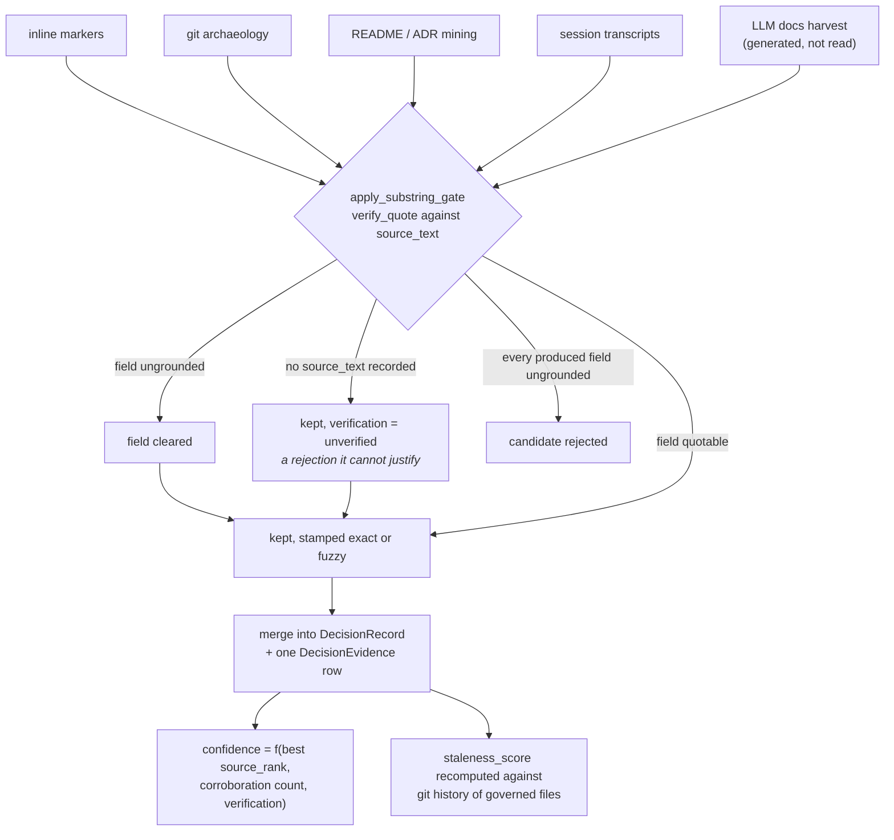

## 1. Executive Summary

repowise is a codebase intelligence layer — roughly 362,000 lines of Python
across a core, a server and a CLI, plus TypeScript for a dashboard, a VS Code
extension and a web UI, AGPL-3.0, 1,743 commits and 94 contributors since 23
March 2026, at version 0.51.0. The premise is that an agent spends most of its
budget rediscovering a repository it has already been told about, so the
repository is indexed once into five layers and served over MCP.

The layer this atlas is here for is the fourth: **decision records**. repowise
mines architectural decisions from inline markers, git archaeology, README and
ADR text, pull requests, session transcripts and — since it began *generating*
documentation rather than only reading it — from an LLM harvest of its own
pages. That last source is what makes the rest of the design necessary, and the
project says so in the module that handles it: the generator produces decision
candidates, so something has to stop *"a fluent-but-invented rationale from being
stored as institutional memory."*

That something is a substring gate, and it is the best idea here. Every produced
`decision`, `rationale` and `source_quote` must substring- or token-match the
verbatim source span the producer recorded. A field that does not is **cleared**,
not flagged. A candidate with no surviving grounded field is **rejected**. What
survives is stamped `exact`, `fuzzy` or `unverified`, and that verdict is kept
separate from both the decision's lifecycle `status` and its numeric
`confidence`, because it answers a different question: not is this current, not
how much corroboration does it have, but *is there a sentence in the source that
says this*.

Two things about the gate are worth more than the gate. First, it operates on a
duck-typed protocol rather than on either producer's class, so the extractor and
the generator are physically unable to diverge on what grounding means. Second,
it declines a case it cannot decide: a candidate whose producer recorded no
source text at all is kept and labelled `unverified`, on the stated grounds that
*"we never fabricate a rejection we cannot justify."* That is the correct
instinct and it is also the gate's boundary — the guarantee is conditional on the
producer having recorded something to check against, and the gate cannot make it.

The benchmarking has the same character. The published numbers name their sample
size and their test, the 112-instance ContextBench corpus was split 70/42 by
instance id *"pinned before any of it started"* with the 42 sealed until the
final measurement, grading is deterministic with no LLM judge, and the summary
table includes a row headed **we lose** — indexing time, by 22x. Where two tools
have not actually been run head to head, the cell reads "not measured" rather
than carrying a checkmark. The caveat a reading of this repository must add is
that the harnesses and the graded cells are not in this tree: they live in a
separate `repowise-bench` repository, so this page is a claim about evidence held
elsewhere rather than evidence.

**Authority is a recorded acceptance, not a status word.** Extraction can only
propose. A decision governs — reaches the rules an agent is shown, the alignment
score, the risk directives and the answer prompt — only when the append-only
`decision_acceptances` table holds a row for it, and that table's CHECK
constraints demand a reason, a scope, an evidence reference, and an accepter or a
git-tracked artifact. The project measured why it mattered on its own store: the
status column claimed 122 active decisions and the acceptance join found none,
because the session miner had been promoting decisions that recurred in two
agent sessions with nobody involved. Dismissal goes through the same log and
leaves the row behind, so re-extracting the same decision does not propose it
again.

Against that, the scope story is the weak seam. `FullTextSearch.search` takes an
optional `repository_id`, added for workspaces that share one database, and the
server router passes it when a request names a repository and fans out per
repository when none is given. The default deployment is safe by construction —
one SQLite file at `<repo>/.repowise/wiki.db`, so the store *is* the scope — but
the same module documents a fallback to a global `~/.repowise/wiki.db`, and the
product is sold hosted for teams on PostgreSQL. Wherever one store holds two
repositories, the boundary between them is a parameter the caller may omit.

## 2. Mental Model

Think of repowise as a compiler for a repository whose output is five artifacts
that share one database and one identity space.

**Pages** are generated prose — a wiki over the codebase — and they are the unit
retrieval actually returns. **Graph nodes and edges** are the structural layer:
functions, classes, call chains, HTTP routes. **Decision records** are the
institutional layer, and the only one whose content is a claim rather than an
observation. **Health, security and dead-code findings** are judgments with
scores. **Git metadata** — commits, blame, fix events — is the temporal
substrate the other four are dated against.

The split that matters is between the layers that are *derived* and the layer
that is *asserted*. A graph edge is wrong only if the parser was wrong, and the
parser can be measured against a compiler — which §8 of the benchmark page does,
by taking the answer key from a compiler rather than from the project. A decision
record is different: it says *why*, and why is not recoverable from an AST. It
comes from prose written by a person, or increasingly from prose written by a
model reading prose written by a person. The gate exists at exactly that seam.

The second idea worth holding is that **provenance accretes rather than
overwrites**. When two sources describe the same decision they do not produce two
records; they merge into one `DecisionRecord` with N `DecisionEvidence` rows
beneath it. The headline fields are taken from the highest-ranked source, and
confidence is a function of that best rank *plus the corroboration count* — so a
decision attested by a commit, an ADR and a session outranks the same decision
attested once, without either attestation being discarded. Most systems in this
atlas collapse duplicates and keep a counter. This keeps the rows.

## 3. Architecture

Eight packages. `core` carries ingestion, analysis, generation, persistence,
precedent, distillation and the pipeline; `server` carries a FastAPI application
and the MCP server; `cli` carries the commands; `types`, `api-client`, `ui`,
`web` and `vscode` carry the surfaces.

Persistence is SQLAlchemy async over either SQLite or PostgreSQL, with the
dialect branch pushed down to the individual query rather than abstracted away —
`FullTextSearch` has a `_search_sqlite` using FTS5 and a `_search_postgresql`
using a GIN index, and the deletion path notes that Postgres removes rows from
the index by cascade where SQLite must be told. Vector storage has three
implementations behind one base: LanceDB, pgvector, and in-memory.

The pipeline has a full mode and an incremental mode, with checkpointing, resume
and a reparse path, and a `watch` command drives it on change.

## 4. Essential Implementation Paths

`packages/core/src/repowise/core/analysis/decisions/gate.py` is the file to read
first — 110 lines, one function, and the whole product guarantee.

`apply_substring_gate` takes a list of duck-typed candidates and returns
`(kept, rejected_count)`. For each candidate it normalizes the source span once
and reuses it across the field checks, which keeps the pass linear in the span
rather than quadratic. Then, for each of `decision`, `rationale` and
`source_quote` that the producer actually populated, it calls `verify_quote` and
either records a verdict or clears the field outright. If the producer populated
something and nothing survived, the candidate is dropped. Otherwise
`verification` takes the strongest surviving verdict, and `source_text` is
cleared on the way out with a comment saying why: it is a transient and *"must
never reach persistence."*

The complementary path is `crud/decisions.py`, where `rec.verification =
best_ver` aggregates the per-evidence verdicts up onto the record, and
`compute_staleness` is re-run over the git metadata of the files a decision
governs — with a nice piece of counting discipline at the end of the rescore,
which returns the staleness count alone because the callers print it as *"N
decisions rescored"* and folding a silent module repair into that number *"would
report a rescore that did not happen."*

The third path is `persistence/information_floor.py`, which decides whether a
generated page earns a vector at all.

## 5. Memory Data Model

`DecisionRecord` carries title, status, context, decision, rationale, JSON arrays
for alternatives, consequences, affected files and modules, tags and evidence
commits; a provenance triple of source, evidence file and evidence line; a
`confidence` float; the `verification` verdict; and a staleness group of
`last_code_change`, `staleness_score` and `superseded_by`. Uniqueness is
`(repository_id, title, source, evidence_file)`.

`DecisionEvidence` is one verbatim provenance row per supporting source, unique
on `(decision_id, source, evidence_file, evidence_commit)`.

`DecisionEdge` is a typed directed edge over decisions —
`supersedes`, `refines`, `relates_to`, `conflicts_with` — carrying its own
confidence and evidence. `build_lineage_chain` walks `supersedes` and `refines`
back to roots with a cycle guard, so a *why* question renders a chain (the
module's own example: sessions → JWT → OAuth2) rather than a flat list.
`conflicts_with` is the interesting one: an explicit representation that two
recorded decisions disagree, which most systems here have no way to say.

`DecisionNodeLink` is the decision-to-code linkage, queryable in both directions.

`PageVersion` archives a page before every overwrite, carrying the superseded
content, its `source_hash`, the model and provider that generated it, its input
and output token counts and its confidence.

## 6. Retrieval Mechanics

Lexical and dense retrieval over generated pages, fused, with neighbor reranking
and a graph walk for structural questions. Document frequency is cached per
instance on the argument that a term's frequency only moves when the corpus is
rewritten and questions reuse vocabulary heavily.

The part worth copying is on the way out. `get_answer` grades itself on two
axes, and the module states what each is for: `confidence` says how much to trust
the synthesized text, `retrieval_quality` says how good the retrieval that fed it
was — *"the agent reads the first to decide whether to re-read the source, the
second to decide whether to search again."* Two different repairs, so two
different numbers.

The grading is a **monotone demotion cascade**: one starting grade from retrieval
dominance, then a run of gates that *can only demote*. A cascade that can only
lose points cannot be talked back up by a later signal, which is the failure mode
of an additive score.

One of those gates reads the answer text for an admitted non-answer, because
retrieval dominance says nothing about whether the model produced something
usable — it *"happily admits insufficiency even on a top-scoring hit."* The
implementation carries the bug report in its own docstring: the hedge markers are
written with an ASCII apostrophe, the model routinely emits U+2019, and every
apostrophe-bearing marker therefore missed, letting a hedged answer ride through
as high confidence. The fix normalizes two Unicode apostrophes to ASCII before
matching. It is a one-line repair to a mechanism whose entire job is to be
skeptical, and it is a good argument for testing an abstention path with the
characters a model actually emits.

### Two failures the project diagnosed in its own commit messages

Both are shapes this atlas looks for and rarely gets a worked instance of, and
both are described in the fix rather than in a release note.

**A hybrid retriever whose vector leg failed on every cold start, invisibly.**
The first vector query in a process pays for opening the store, the first embed
and the first ANN probe — measured at *"6.3s + 13.4s on a cold Windows index
where a warm query takes 0.19s"*. Every call site bounded that at a hardcoded
8-second timeout **inside `contextlib.suppress`**, so, in the commit's own words,
*"the first query of every process expired, the leg returned `[]`, and search
silently degraded to full-text with nothing logged and `embedder_degraded` still
false."* Three failures compose there: a budget set from warm-path intuition, a
suppression that makes the expiry unobservable, and a degradation flag that stays
false while the system is degraded — so the one field an operator would check to
detect this reported health. The fix moves the budget to a single
`vector_search_timeout_s()` at 30 seconds, capped at 120 and overridable, with an
unusable override warning and keeping the default *"rather than disabling the
leg"*.

**An incremental pass that eroded stored data, concentrated on the records
someone was working on.** The incremental pipeline constructed its
`HealthAnalyzer` without a coverage map, so every changed file was scored as
though no coverage had ever been ingested, and the partial-health writer then
upserted those metrics — *"overwriting the stored `line_coverage_pct` with NULL
for exactly the files that just changed — eroding coverage one file per update,
starting with files under active development."* The bias is the part to
generalise: an incremental writer that rebuilds a record from partial inputs and
upserts the whole row nulls whatever its inputs did not cover, and because
incremental passes run on what changed, the loss lands on the most-touched
records — the ones a reader is most likely to consult. The fix loads the
persisted coverage rows before re-scoring and returns an empty map when the store
is unreadable, so the analyzer scores without coverage rather than scoring
against a false zero.

## 7. Write Mechanics

Writes are batch, through the pipeline, in a full or an incremental mode.

The admission control is the interesting half. `information_floor.py` decides
whether a generated page is substantive enough to be given a vector, and the
reasoning is stated as a budget argument rather than a quality one: search
fetches a fixed number of rows before it filters anything, so *"a page that
restates its own filename and then says three sections' worth of nothing still
takes one of those slots from a page that could have"* answered. The page is
kept — it is a valid link target, and a reader arriving at it learns the file
exists and has no callers — but it is held out of the index. The module also
keeps a process-wide count of pages denied a vector, so the gap between a run's
page count and its vector count is explainable rather than alarming.

That is the cleanest statement of index admission as a *retrieval-precision*
decision anywhere in this corpus, and it separates two things most systems
conflate: whether a memory is worth keeping, and whether it is worth ranking.

## 8. Agent Integration

An MCP server is the primary surface, built around `get_answer`,
`search_codebase`, `blast_radius` and `change_risk`, with a Claude Code plugin
directory, a CLI, a VS Code extension and a dashboard beside it. The MCP tree
carries a budget module, a failure shield, a watchdog and a tool-selection
helper, which is more operational machinery around the tool surface than most
servers in this atlas ship.

## 9. Reliability, Safety, and Trust

Three axes on a decision, kept separate: `status` for lifecycle, `confidence` for
weight of evidence, `verification` for grounding. Keeping the third apart from
the second is the design decision worth naming — a heavily corroborated decision
that nobody can quote and a single-sourced decision quoted verbatim are different
failures, and one number cannot say both.

Two limits are worth stating plainly.

**The gate's guarantee is conditional on its producers.** A candidate arriving
with no `source_text` is kept and labelled `unverified` rather than rejected.
This is deliberate and defensible, but it means the strength of the guarantee is
a property of the extractors, not of the gate: a producer that neglects to record
the span it read yields memory the gate has, by its own rule, declined to judge.
Nothing in the gate can detect the difference between a source that genuinely had
no quotable span and a producer that forgot to pass one.

**Dismissal is retraction; supersession is not.** `superseded_by`, the
`deprecated` and `superseded` statuses and the `supersedes` edge record that a
decision was replaced. `dismissed` records that it was wrong, and it is terminal:
the row stays, `_PROTECTED_STATUSES` makes `_merge_status` keep it whenever a
re-extraction arrives as `proposed`, and because a decision's id derives from
`(repository_id, title, source, evidence_file)` the re-extracted candidate lands
on the dismissed row rather than beside it. That earns `tombstone`, keyed on the
decision's identity rather than on its meaning — a reworded title from the same
file is a new candidate.

**Review is an admission gate with a self-declared reviewer.** `repowise decision
confirm` and `dismiss`, the dashboard's review lanes, and a committed ADR that
says accepted and names a scope are the ways a decision gains or loses authority,
and all of them write through `record_acceptance`. That earns `human_review`. The
accepter is whatever the surface supplies — `web` from the dashboard, the git
identity or `--as` from the CLI — and the commands have machine-readable forms,
so the gate establishes that an acceptance was recorded with its reason, scope and
evidence, not that a person rather than an agent issued it.

**Scope is mostly the store.** Covered in section 1; the failure mode is a single
database holding two repositories with a caller that omits `repository_id`, which
the documented `~/.repowise/wiki.db` fallback and any shared PostgreSQL deployment
both allow.

## 10. Tests, Evals, and Benchmarks

The test tree is large and structured by subsystem — ingestion, distill,
generation, persistence, server, MCP, providers, CLI — with a `conftest.py` at
each level.

The committed evaluation this atlas counts is the **information floor**: three
separate suites assert that a page below the substance threshold is refused a
vector, at the floor itself, at the embed recipe, and at generation. Those are
negative retrieval assertions in the strict sense — committed cases that
particular material must *not* be indexed. `test_decision_provenance.py` pins the
source-rank ladder and the confidence function, including that an `unverified`
verdict lowers confidence relative to the same rank verified.

The benchmark page is the part worth reading whether or not you use this tool.
It publishes ten rows, and the discipline is in what it refuses to claim:

- The retrieval numbers come from a 70/42 split of ContextBench pinned *before*
  the work started, with the 42 sealed until final measurement, graded
  deterministically with no LLM judge.
- The precision column is published alongside the coverage column, and it is
  unflattering — `get_answer` reaches 0.876 file coverage at 0.087 precision by
  serving 19.2 files, where a competitor reaches 0.445 coverage at 0.240.
- One row says **we lose**: indexing is 22x slower, attributed to building four
  more layers in the same pass.
- Two capability comparisons are labelled "not measured" and kept out of the
  measurement table, with the stated reason that the project would *"rather write
  'not measured' than let a checkmark do a number's job."*
- §8 takes its answer key from a compiler rather than from the project.

The claim a reading of this repository can support is about the *shape* of the
evidence, not its content: the harnesses, the pre-registrations and the graded
cells live in a separate `repowise-bench` repository, and this page summarizes
them. That is a defensible way to organize it, and it means this tree contains
the claim rather than the proof.

## 11. Patterns Worth Stealing

**Clear the field, don't flag it.** A rationale that cannot be quoted is set to
the empty string. Nothing downstream has to remember to check a boolean, because
the ungrounded text is not there to be read.

**Type the gate on a protocol, not on a class.** Both the extractor and the
generator satisfy a five-attribute `Protocol`, so neither can drift into its own
definition of grounded and the gate depends on neither.

**Refuse the rejection you cannot justify.** No source span means `unverified`,
not rejected — the system distinguishes "I checked and it failed" from "I could
not check."

**Two ratings for two repairs.** Confidence tells the agent to re-read the
source; retrieval quality tells it to search again. One blended score would tell
it neither.

**Demotion-only cascades.** Start from a grade and let each gate lower it. A
score that can be raised late can be raised past a signal that should have
stopped it.

**Admission as a precision decision.** Whether a memory is worth keeping and
whether it is worth ranking are separate questions, and the second has a budget
argument behind it that the first does not.

**Publish the row you lose.** A benchmark table with a *we lose* row and two
"not measured" cells is more credible than one without, and costs nothing that
was true anyway.

## 12. Open Questions

- How many decision records in a real index carry `verification = unverified`
  because their producer recorded no source span, as against because a check
  failed? The two are the same value and the distinction is the whole strength
  of the gate; nothing in the schema separates them.
- Does any deployment actually put two repositories in one store? The code
  documents a global `~/.repowise/wiki.db` and sells a hosted PostgreSQL
  offering, and the answer decides whether the missing repository predicate is a
  latent defect or an unreachable one.
- What happens to a `conflicts_with` edge downstream? The edge kind exists and
  is listed, and an explicit contradiction between two recorded decisions is
  rare enough in this corpus to be worth following into the answer path.
- Would the sealed split survive a second sealing? A split pinned before the
  work and opened once is the strongest form of this claim available to a
  project measuring itself; the next instance of it is the test of whether the
  discipline holds when the first result is already published.

## Appendix: File Index

| Path | What it carries |
| --- | --- |
| `packages/core/src/repowise/core/analysis/decisions/gate.py` | The substring gate — the product guarantee in one function |
| `packages/core/src/repowise/core/analysis/decisions/provenance.py` | `verify_quote`, `normalize_text`, the source-rank ladder and the confidence function |
| `packages/core/src/repowise/core/persistence/models.py` | Every ORM model, including `DecisionRecord` and `DecisionEvidence` |
| `packages/core/src/repowise/core/persistence/decision_graph.py` | Typed decision edges and the cycle-guarded lineage walk |
| `packages/core/src/repowise/core/persistence/crud/decisions.py` | Verdict aggregation onto the record and the staleness rescore |
| `packages/core/src/repowise/core/persistence/information_floor.py` | Index admission, and the count of pages denied a vector |
| `packages/core/src/repowise/core/persistence/crud/pages.py` | The `PageVersion` archive written before every overwrite |
| `packages/core/src/repowise/core/persistence/search.py` | Lexical retrieval, dialect-split, with no repository predicate |
| `packages/server/src/repowise/server/mcp_server/tool_answer/confidence.py` | The demotion cascade, and the curly-apostrophe repair |
| `docs/BENCHMARKS.md` | Ten rows, one of them a loss, two of them "not measured" |

## History

**2026-09-25** — [`04e1dc67afdaf4c491e846a1fc75805931e132e8`](https://github.com/repowise-dev/repowise/commit/04e1dc67afdaf4c491e846a1fc75805931e132e8) — census re-measured at the same commit, read and never run. The commits API gives 1,743 commits reachable from this pin with 94 distinct author logins, the oldest dated 23 March 2026; the same method gives 1,310 and 64 at `370793f`, the first reading's figures. The root `pyproject.toml` declares 0.51.0. Python under `packages/core`, `packages/server` and `packages/cli` counts 362,402 lines from a depth-1 fetch, against 284,136 at `370793f`. The summary and the verdict carried the first reading's figures and now state these. No mark moved.

**2026-09-19** — re-pinned to [`04e1dc67afdaf4c491e846a1fc75805931e132e8`](https://github.com/repowise-dev/repowise/commit/04e1dc67afdaf4c491e846a1fc75805931e132e8), 30 commits on. All five marks stand; `human_review`'s anchors all moved and were re-verified. `record_acceptance` is now at `crud/authority.py:480` and the module states its own invariant at `:495` — *"The only writer of `decision_acceptances`"* — with the single `DecisionAcceptance(` construction at `:564` inside it. The mark was producer-tested rather than carried forward: the MCP server's nineteen tool modules are all reads and analyses, so nothing on the agent's declared surface accepts a decision, and the read path still joins the acceptance table — `test_an_active_status_without_an_acceptance_is_a_candidate` is the assertion that makes it checkable. The limit is recorded as what it is: the accepter's identity is self-declared and unverified, and a general shell can drive the CLI, which this atlas treats as distinct from an approve verb the agent holds. Screened again first; nothing was installed and no suite was run.

**2026-09-15** — [`fbfe6dec2a1c529573b0b4958ecf0777cd130081`](https://github.com/repowise-dev/repowise/commit/fbfe6dec2a1c529573b0b4958ecf0777cd130081) — 320 commits on, 2026-09-15, most of them workspace, MCP, health and CLI work. Screened before reading: two auto-run surfaces (`.claude-plugin/`, `server.json`), fourteen build-time execution points, nine unpinned surfaces and three dependency surfaces inside the cooldown; nothing was installed or run. Two marks are added. `human_review` is new: from 1–2 September (#2067, #2069, #2070) extraction can only propose, authority is a row in an append-only `decision_acceptances` table whose CHECK constraints require reason, scope, evidence and an accepter or tracked artifact, and every governance read joins it — the project found its status column claiming 122 active decisions its acceptance join did not support. `tombstone` was missed: at the previous pin `dismissed` was already a protected terminal status that re-extraction of the same decision could not walk back, with `test_dismissed_decision_survives_reindex_untouched` pinning it; the first reading considered only supersession. The acceptance log also strengthens `audit_log`. The scope finding moved: `FullTextSearch.search` gained an optional `repository_id` for shared-database workspaces (#2195), so the boundary is a parameter the caller may omit rather than only the engine selected, and `scope_enforced` stays withheld. Decision ids now derive from their dedupe identity (#2071).

**2026-08-21** — [`e2bb8a2e4eff3d00005a602ac65a8e4be7daa4a3`](https://github.com/repowise-dev/repowise/commit/e2bb8a2e4eff3d00005a602ac65a8e4be7daa4a3) — re-pinned 34 commits and +15,873 lines on, at release v0.45.0. Screened again: two auto-run surfaces (`.claude-plugin/`, `server.json`), build-time execution in the `Makefile` and `conftest.py`; nothing was installed and nothing was run. Marks unchanged at `trust_state`, `audit_log` and `negative_eval`.

**The scope finding is unchanged and was re-checked rather than carried forward.** `FullTextSearch.search` still takes `(self, query, limit)` and no repository argument, so the boundary is still which engine the router opened rather than a predicate in the statement.

New in section 7: two failures the project diagnosed in its own commit messages — a vector leg that expired on every process's first query inside a `contextlib.suppress`, degrading search to full-text with `embedder_degraded` still false; and an incremental health re-score that overwrote stored coverage with NULL for exactly the files that had just changed. Also arriving in this range: Eden AI as a first-class provider and embedder, unified refactoring recommendation contracts, and ingestion fixes for Go field-call capture, TypeScript `#private` members and Java and C# return types.

**2026-08-19** — [`370793f9b4e3357f6bf605f0bb86ef421a567548`](https://github.com/repowise-dev/repowise/commit/370793f9b4e3357f6bf605f0bb86ef421a567548)
— first reading, at v0.44.0. Screened before reading: 2 auto-run surfaces (a
`.claude-plugin/` directory and `server.json`, an MCP manifest), 5 dependency
surfaces changed inside the seven-day cooldown, and a large set of build-time
`conftest.py` files, which is ordinary for a pytest tree of this size. Nothing
was installed and nothing was executed; the benchmark numbers were read, not
reproduced, and the harnesses that produce them are in a separate repository.
