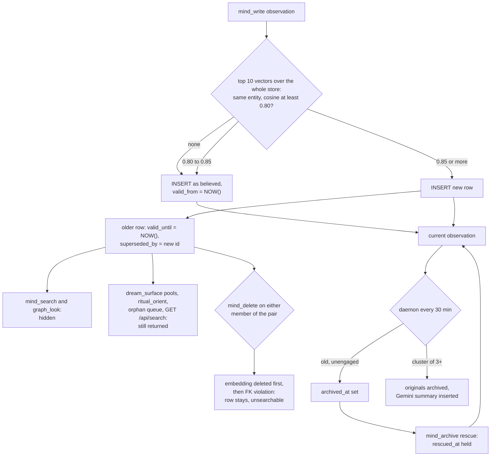

## 1. Executive Summary

Resonant Mind is a Cloudflare Worker that gives one long-running AI a
persistent store over Neon Postgres and pgvector: 47 MCP tools grouped into
"regions", and a daemon every 30 minutes that decays novelty, archives, runs
Gemini consolidation, composes dreams and proposes identity rows. What is
notable is contradiction handling on the write path. Each new observation
looks up similar observations on the same entity and retires any at cosine
0.85 or above. What is weak is that the retirement is honoured by two of the
read paths and ignored by the rest, and that a retired pair cannot then be
deleted.

The licence restricts use. The tree carries the Codependent AI Source-Available
License, which permits personal, educational and non-commercial use and requires
a commercial licence otherwise. The first public commit, on 22 March 2026, was
released as Apache 2.0; the licence changed at
[`81bb4d1e0eff22d4a2481f194287fac2755f5851`](https://github.com/codependentai/resonant-mind/commit/81bb4d1e0eff22d4a2481f194287fac2755f5851)
on 30 March 2026. The project was published as Mind Cloud up to v2.3.1
(`CHANGELOG.md:3`).

The unit is an observation, a line of text on a named entity. It carries a
`certainty` of `tentative`, `believed` or `known`, a `source`, an emotional
`weight` and `charge`, and a novelty score that the daemon recomputes. The
agent is the only author and the only reviewer. It writes through `mind_write`,
and it accepts or rejects what the daemon proposes through `ritual_tend`.

No capability marks. Section 9 names each of the seven and the reason it is
withheld; the nearest is `trust_state`, whose `certainty` field is read only to
draw an icon.

## 2. Mental Model

A memory becomes a belief the moment `mind_write` inserts it. The default
`certainty` is `believed`, the writer may say `known` or `tentative`, and no
later step changes it (`src/legacy-tools/write.ts:183-188`). There is no
candidate state and no extraction: the agent states the observation in its own
words.

**It stops being current in five ways, and they are not equivalent.**

- **Superseded.** A later observation on the same entity whose embedding scores
  0.85 or more against it sets `valid_until = NOW()` and `superseded_by` on the
  older row (`src/legacy-tools/write.ts:213-256`, thresholds at
  `src/shared/constants.ts:59-61`). The newer row always wins. Nothing asks
  whether the two disagree; similarity is the whole test.
- **Archived.** The night-time deep-archive pass sets `archived_at` on light
  observations never sat with and unsurfaced for 30 days, and on medium ones
  older than 90 days and unsurfaced for 60
  (`src/daemon/archive.ts:19-55`). Consolidation archives a cluster of three or
  more co-surfacing observations and inserts one Gemini summary with
  `source = 'consolidated'` (`src/daemon/consolidation.ts:101-162`). The agent
  can archive from the orphan queue.
- **Metabolized.** `active_resolve` sets `charge = 'metabolized'`
  (`src/legacy-tools/resolve.ts:46`). That drops the row from the surfacing
  pools and leaves it in search. It means *processed*, not *false*.
- **Deleted.** `mind_delete` removes the row and its embedding
  (`src/shared/surgery.ts:178-208`).
- **Edited.** `mind_edit` overwrites the text in place after copying the old
  text to `observation_versions` (`src/shared/surgery.ts:98-120`).

**Archive is not an ending.** `rescueObservation` clears `archived_at` and
stamps `rescued_at`, and every daemon pass that would re-archive or decay it
checks that stamp until the row next surfaces
(`src/shared/archive-observation.ts:55-62`). The redolence pass lets an archived
row "rise" into the subconscious snapshot when a fresh observation lands close
to it in vector space, without unarchiving it (`src/daemon/redolence.ts:170-191`).

**The daemon proposes, the agent disposes.** Relation, resonance, proximity,
compass and identity additions wait in `daemon_proposals` as `pending` until the
agent calls `ritual_tend` with `accept` or `reject`, or until they expire after
30 days (`src/daemon/proposals.ts:55-65`). No person sits on that path.

## 3. Architecture

The Worker's `fetch` handler serves the MCP protocol and a REST API; its
`scheduled` handler runs `processSubconscious` on the cron in `wrangler.toml:23-24`
(`src/index.ts:67-105`). Postgres is reached through Hyperdrive by a
D1-compatible adapter that rewrites SQLite idioms and opens a new `pg.Client`
for every statement (`src/adapter.ts:1-13`, `:128-144`). There are no
transactions on the runtime path, so the code orders its statements instead:
the delete engine removes dependents before the row, and consolidation archives
before it inserts.

Vectors live in the same database. `createVectorAdapter` gives a
Vectorize-shaped `upsert` and `query` over one `embeddings` table with an HNSW
cosine index (`src/vectors.ts:56-141`, `migrations/postgres/0001_core.sql:382-395`).
Embeddings come from `gemini-embedding-2-preview` at 768 dimensions, and text
generation for consolidation and reflection from `gemini-2.5-flash-lite`
(`src/embeddings.ts:10-12`). Dreams are composed by Workers AI. Image bytes go to
R2.

### Deployment and ergonomics

- **What has to be running:** a Cloudflare account with a Worker, Hyperdrive,
  an R2 bucket and a Workers AI binding; a Neon Postgres with the `vector`
  extension; a Gemini API key. There is no local mode, and the README names D1
  as unsupported from v4.
- **Offline:** not possible. Every search embeds the query through Gemini, so a
  Gemini outage fails `mind_search` outright. Writes still land, reported as
  "stored without vectors", and nothing re-embeds an observation or journal
  later; only dreams have a sweep (`src/daemon/dream-processing.ts:380-410`).
- **First run:** `npm ci`, three `wrangler secret put` calls, a Hyperdrive
  binding, then `npm run db:migrate` against Neon directly. The runner takes an
  advisory lock, checksums each file into `schema_migrations`, and refuses an
  untracked existing schema (`scripts/migrate-postgres.mjs:25-58`). In-place
  upgrade from v3.2 is refused by design.
- **Repair by hand:** plain Postgres rows, readable with SQL. The one trap is
  that `embeddings` is keyed by strings such as `obs-12-345` with no foreign key,
  so a hand-deleted observation leaves its vector behind.

## 4. Essential Implementation Paths

**Capture.** `mind_write` with `type: "observation"` resolves or creates the
entity by name, then for each string: runs `detectContradictions`, inserts the
row, runs the startle fast path, embeds and upserts the vector, and applies
supersession (`src/legacy-tools/write.ts:139-272`). `episode_record` wraps the
same handler with `context` defaulting to `episodic`
(`src/regions/episodes.ts:18-51`). `POST /api/observations` is a second door
that inserts and embeds with no contradiction check and no `valid_from`
(`src/http/handlers/observations.ts:54-73`).

**Contradiction detection.** `detectContradictions` embeds `"<entity>: <text>"`,
asks for the top 10 vectors across the entire `embeddings` table, keeps matches
at 0.80 or more whose metadata names the same entity, and re-reads each to
confirm it is not archived, superseded or expired (`src/legacy-tools/write.ts:104-137`).
Candidates between 0.80 and 0.85 are returned and then ignored; only those at
0.85 or more are acted on (`:217-218`). Because the top 10 is taken before the
entity filter, a store where other entities or journals crowd the neighbourhood
yields no candidates at all.

**Retrieval.** `mind_search` tints the query with mood words from the daemon's
snapshot, embeds it, and takes `n_results` vectors, or ten times that when a
type filter is set (`src/legacy-tools/search.ts:31-58`). It classifies hits as
entity, image, journal or observation; batch-reads the observation rows; applies
the optional filters; drops superseded and expired rows unless
`include_expired` is set (`:206-220`); scores; and bumps `access_count` on what
it returns (`:258-271`). If the vector query returns nothing it falls back to
`LIKE` over observations and journals with no status filter at all (`:60-84`).

**Context assembly.** `ritual_orient` reads identity rows, context entries,
relational state, the last journal, the last dream, the subconscious snapshot
and two "orphans" — medium or heavy observations unseen for 30 days — in one
`Promise.all` (`src/legacy-tools/orient.ts:52-103`). The orphan pick filters
archived and metabolized rows and not superseded ones (`:17-34`).
`dream_surface` builds four pools: core and edge from vector hits, novelty and
dormant from SQL, then re-reads the rows filtering archived and metabolized
only (`src/legacy-tools/surface.ts:88-185`, `src/daemon/pools.ts:17-90`).

**Update, delete, forget.** `editObservation` snapshots the old text, weight and
emotion into `observation_versions`, updates in place and re-embeds
(`src/shared/surgery.ts:67-158`). `deleteObservation` deletes sits, versions,
orphan rows and the embedding, then the observation last (`:178-208`).
`mind_delete` with `text_match` deletes the most recent observation whose text
contains the string (`src/legacy-tools/delete.ts:25-35`). `spine_amend` with
`remove` soft-archives identity rows and demands a `reason`, which it echoes in
the reply and does not store (`src/regions/spine.ts:150-180`).

**Schema.** `observations` and its sidecars are in
`migrations/postgres/0001_core.sql:167-283`; supersession, validity and
consolidation groups in `0002_enhanced_memory.sql:10-29`; the `CHECK` enums in
`0007_enum_constraints.sql:15-25`; compass and its provenance in
`0004_compass.sql:13-39`.

**Background.** `processSubconscious` runs each pass in its own `try`
(`src/daemon/index.ts:38-426`). Night-gated passes are deep archive, retention
and full consolidation (`:175-228`). Retention thins mood logs, drive events
and co-surfacing rows, and keeps the newest 20 versions per observation
(`src/daemon/retention.ts:174-201`).

**MCP and API.** The handler map and the 47 tool schemas are in
`src/mcp/registry.ts:76-139` and `:141` onward. Auth is one shared key, as
Bearer or as Basic with the fixed client id `resonant-mind`, with an optional
internal header and an optional secret connector path (`src/http/auth.ts:18-61`).

**Tests.** Section 10.

## 5. Memory Data Model

`observations` carries the content and eighteen lifecycle columns: `weight`
(`light | medium | heavy`), `charge` (`fresh | active | processing |
metabolized`), `certainty` (`believed | known | tentative`), `source`
(`conversation | realization | external | consolidated | inferred | journal`),
`salience`, `context`, `novelty_score`, `surface_count`, `access_count`,
`archived_at`, `rescued_at`, `resolved_at`, `linked_observation_id`,
`valid_from`, `valid_until`, `superseded_by`, `supersedes` and `source_date`
(`migrations/postgres/0001_core.sql:169-192`, `0002_enhanced_memory.sql:2-14`,
`0007_enum_constraints.sql:16-25`). `entity_id` routes by trigger to `person_id`
or `node_id`, and a `CHECK` requires exactly one (`0005d_routing_triggers.sql:19-35`,
`0005e_people_nodes_constraints.sql:16-18`).

**Temporal fields record time, not validity.** `valid_from` is `NOW()` at insert
and `valid_until` is `NOW()` at supersession, so both are system time. The
nearest thing to world time is `source_date`, which `mind_search` filters on
through `date_from` and `date_to` (`src/mcp/registry.ts:236-237`). No code path
writes it. A date filter therefore drops every observation from the results,
while journals and dreams, which carry no details row, pass through
(`src/legacy-tools/search.ts:186-200`).

**Versioning is snapshots of edits, not of the lifecycle.** `observation_versions`
receives the pre-edit content on each `editObservation`. It records nothing on
insert, supersession, archive or delete, is deleted with its observation, and is
pruned to 20 rows per observation at night.

**Other stores.** `journals` hold dated entries and, with `journal_type =
'reflection'`, the daemon's Gemini insights (`src/daemon/reflection.ts:37-48`).
`identity` holds sectioned "spine" rows with a soft `archived_at`. `compass`
holds values, beliefs, boundaries, commitments and ideologies, with a
`compass_provenance` edge table (`0004_compass.sql:13-39`). `compass_calibrate`
overwrites a compass row's content with no history (`src/regions/compass.ts:302-322`).
`consolidation_groups` records each summary's source observation ids.

**Scoping.** One mind per deployment; the README lists "no hard-coded person or
household tenancy" as a v4 property. `context` is a topic label such as
`research` or `values-ethics`. `graph_look` passes it through as an optional
filter (`src/legacy-tools/read-entity.ts:34-42`); `mind_search` declares a
`context` parameter and its handler never reads it.

## 6. Retrieval Mechanics

The search is vector-only in practice. The `LIKE` fallback runs only when the
vector query returns no rows, which with an unthresholded `LIMIT` over a
non-empty table does not happen, and an embedding failure throws before the
fallback is reached (`src/shared/mind-helpers.ts:15-18`).

**Ranking.** Each observation scores `0.50 * similarity + 0.20 * recency +
0.20 * importance + 0.10 * access`, plus 0.1 when its emotion matches the current
mood (`src/legacy-tools/search.ts:222-254`, `src/shared/constants.ts:55-57`).
Recency decays at `exp(-0.02 * days)`; importance maps heavy, medium and light
to 1.0, 0.6 and 0.3; access saturates at around 20 reads. Because `mind_search`
and `graph_look` both write `access_count`, reading an observation raises its
rank for the next search.

**Mood changes the query.** When the daemon's mood confidence is not `low`, the
query string gains a parenthesised list such as *"warm, gentle, caring, soft"*
before it is embedded (`src/legacy-tools/search.ts:36-54`). The same question
therefore returns different results as the daemon's mood computation moves.

**Filtering happens after the top k.** Superseded, expired and optionally
filtered observations are removed from the `n_results` already fetched, so a
store with many superseded near-duplicates returns fewer than asked. The
supersede filter also fails open. If the batch read of observation details
throws, the empty catch leaves the map empty, the guard `obsDetails.size > 0`
is false, and every superseded row is returned (`:178-181`, `:208`).

**Generated content shares the index.** Reflections are upserted as
`journal-<id>` and render as `[journal]` with no mark that Gemini wrote them.
Dream vectors carry `source: 'dream'` and fall through the type classifier into
the observation list, then appear again under **Dreams**
(`src/legacy-tools/search.ts:91-107`, `:327-339`).

**Token budget.** None is computed. Search truncates each hit to 300 characters
and defaults to ten; `ritual_orient` caps each block with `LIMIT`.

## 7. Write Mechanics

Writes are explicit tool calls. The agent names the entity, supplies one or more
observation strings, and optionally sets weight, emotion, certainty, source and
context; the registry describes `known` as *"verified fact"*
(`src/mcp/registry.ts:212`). Nothing checks that claim.

**Deduplication and conflict are the same operation.** Supersession fires on
similarity, so a paraphrase of an existing observation retires it as surely as
a correction does. The reply says `Superseded 1 older observation` with no id
and no text (`src/legacy-tools/write.ts:268-270`). Two observations on the same
entity that share most of their wording and differ in one fact are exactly the
pair this catches. They are also the pair where retiring the older one is right
only when the fact changed rather than a second fact arrived.

**The pair is written in two statements.** Without transactions, the old row is
retired first and the back-pointer set second; a failure between them is logged
with the SQL to reconcile it rather than swallowed (`:217-253`). The guard
`AND valid_until IS NULL` makes a concurrent double-supersede a no-op.

**Consolidation replaces originals with a summary.** For up to three entities
with ten or more live observations, clusters of three or more that co-surfaced
at least twice are summarised by Gemini under the prompt *"Summarize these …
observations into ONE concise observation (1-2 sentences)"*, the originals
archived, and the summary inserted as `believed`
(`src/daemon/consolidation.ts:23-162`). A mismatch in the archive count restores
what was archived and skips the cluster. The summary goes through no
contradiction check.

**The identity hunt ignores rejections.** Every four hours it clusters medium
and heavy observations from three stance contexts over the last 14 days by
word overlap and inserts up to three `compass_addition` or `identity_addition`
proposals (`src/daemon/identity-hunt.ts:61-168`). It checks novelty against
existing compass and identity text. It reads `daemon_proposals` only for the
rate limit and the pending count, so a cluster the agent rejected is proposed
again at the next run while its seed is inside the window. The `ritual_tend`
description promises that *"reject dismisses permanently"*
(`src/mcp/registry.ts:157`); that holds for co-surfacing pairs, whose eligibility
clause excludes rejections (`src/daemon/proposals.ts:109-122`), and not here.

**Malicious input.** No filter. Anything the agent writes is stored as
`believed`, and anything it reads is eligible to become a stance proposal.

### Operational cost

- **Blocking:** yes. Each observation costs two identical Gemini embedding
  calls — one in `detectContradictions`, one for the upsert, both on
  `"<entity>: <text>"` (`src/legacy-tools/write.ts:108`, `:198`) — plus a
  Postgres connection per statement. The memory is retrievable when the call
  returns.
- **Background:** every 30 minutes the daemon reads the whole `relations` table
  for centrality (`src/daemon/index.ts:54-57`), runs one Gemini call per
  consolidated cluster (one entity by day, up to an affect-modulated cap at
  night), one reflection call when five or more observations arrived in 35
  minutes, up to five embedding calls for redolence, and a nightly dream through
  Workers AI. No pass rewrites the whole store; archive and retention sweeps are
  capped at 50 and 500 rows.
- **Read path:** nothing is injected unasked. What the agent receives per call
  is bounded by `LIMIT`s, and the prefix cache is the client's concern.

## 8. Agent Integration

The agent holds all 47 tools. The wake ritual is written into tool descriptions
rather than a hook: *"First call on wake"* for `ritual_orient`, *"Second call on
wake"* for `ritual_ground`, and `ritual_tend` as *"The third practice"*
(`src/mcp/registry.ts:144-157`). A client that does not follow the ritual gets
nothing at session start. There is no compaction handling; the server does not
see sessions.

The agency is complete. The same tool list writes, edits, deletes, archives,
rescues, accepts daemon proposals into compass and identity, calibrates compass
weights and content, and soft-archives identity rows. `drive_safeword` and the
drive tools are also agent-held. A REST surface mirrors much of this for a
separate client behind the same key (`src/http/router.ts`).

Porting to another agent is an MCP URL and a key. Porting the design to another
host means replacing Hyperdrive, R2, Workers AI and the cron trigger.

## 9. Reliability, Safety, and Trust

**The supersede filter is on two of seven read paths.** `mind_search` and
`graph_look` exclude superseded rows (`src/legacy-tools/search.ts:206-220`,
`src/legacy-tools/read-entity.ts:34-42`). The pools behind `dream_surface`
(`src/legacy-tools/surface.ts:169-171`, `src/daemon/pools.ts:18-20`), the orphan
pick in `ritual_orient` (`src/legacy-tools/orient.ts:22-31`), the orphan queue
behind `ritual_tend` (`src/daemon/orphans.ts:26-38`), the identity hunt's source
query (`src/daemon/identity-hunt.ts:89-99`) and `GET /api/search`
(`src/http/handlers/search.ts:25-35`) filter archived or metabolized rows and
not superseded ones. A corrected observation can come back at wake, as a
surfaced memory or as the seed of a proposed value.

**A supersede pair cannot be deleted, and trying costs the embedding.**
`superseded_by`, `supersedes` and `linked_observation_id` reference
`observations(id)` with no `ON DELETE` clause (`migrations/postgres/0001_core.sql:183`,
`0002_enhanced_memory.sql:13-14`), so Postgres' default `NO ACTION` refuses to
delete either member while the other points at it. `deleteObservation` deletes
the embedding, versions and sits first and the row last
(`src/shared/surgery.ts:189-205`). The final `DELETE` then fails, the client
sees *"Internal error"* (`src/mcp/protocol.ts:106-115`), and the row stays in
Postgres — reachable by the SQL pools and `ritual_orient`, invisible to vector
search, with its edit history gone. `consolidation_groups.consolidated_observation_id`
and `entity_id` have the same shape (`0002_enhanced_memory.sql:20-27`), so
deleting an entity with a consolidation behind it fails the same way. This
follows from the schema and the statement order; I did not run it.

**Provenance.** `source` is the writer's choice from a fixed list, and the
daemon stamps `consolidated` on its summaries. Consolidation keeps the source
ids. Compass rows carry provenance edges. Nothing records which client or
session wrote an observation, and the reason `spine_amend` requires is not
stored.

**Auth and tenancy.** One key for everything. Any holder can read and rewrite
the whole mind, and the design has no second principal to separate.

**Failure recovery.** Honest reporting is the house style: writes return
`(N vectorized, M stored without vector)`, a failed re-embed after an edit says
*"search will serve stale text"*, and scheduled failures now propagate to the
Cloudflare scheduler (`src/scheduled.ts:1-15`). The 3.2.0 changelog records the
opposite era, in which *"every affected write failed silently inside
`try/catch`"* against a schema the code no longer matched.

**Withheld marks.**

- **`tombstone` — withheld.** Deletion is hard, supersession is keyed on row
  ids, and nothing records a rejected value. Re-asserting a retired observation
  inserts a new row that supersedes the correction. Rejected co-surfacing
  proposals are remembered by observation-id pair, which is record-keyed, and
  rejected identity proposals are not remembered at all.
- **`trust_state` — withheld.** `certainty` is the discrete field, and its only
  readers draw ✓ or ? beside a surfaced row (`src/legacy-tools/surface.ts:348`,
  `:422-423`); `rg` finds no `WHERE` on it. The column that does filter is
  `superseded_by`, which is a correction chain set by similarity, not a status
  anyone assigns. `charge = 'metabolized'` filters the surfacing pools and means
  emotionally processed.
- **`bitemporal` — withheld.** `valid_from` and `valid_until` are both
  `NOW()` at write, and `source_date` has no writer.
- **`scope_enforced` — withheld.** No user, agent or tenant key exists; the
  deployment is the boundary. `context` is a topic label, and the main search
  ignores it.
- **`audit_log` — withheld.** `observation_versions` holds pre-edit snapshots
  only, is deleted with the row and pruned to 20. `drive_states` is append-only
  by design (`migrations/postgres/0011_drives.sql:39-47`), and it records drive
  levels, not memory mutations.
- **`human_review` — withheld.** The proposal queue is real, filled by the
  daemon and drained by `accept` and `reject`. Both are values of the `action`
  enum on `ritual_tend`, a tool the agent holds (`src/mcp/registry.ts:93`,
  `:156-166`), and the agent can write compass and identity rows directly with
  `compass_create` and `spine_amend` besides.
- **`negative_eval` — withheld.** No test calls `mind_search`, `graph_look` or
  the supersede path; section 10.

## 10. Tests, Evals, and Benchmarks

85 Vitest cases in 18 files. Five files and 42 of the cases are image
ingestion and serving: byte-level format validation, R2 cleanup on failure,
redirect limits for remote fetches. The memory-relevant files are small.

- `tests/postgres-v4.integration.test.ts` applies every migration to a fresh
  pgvector Postgres, writes one observation through `handleMindWrite` with a
  mocked all-zero embedding, checks the stored row and vector metadata, edits
  it, and reads the edit history back. The CI job `postgres-contracts` sets
  `TEST_DATABASE_URL` so this runs there (`.github/workflows/verify.yml`); without
  it, `describe.runIf` skips all three cases.
- `tests/rescue-persistence.test.ts` records the SQL strings the daemon passes
  emit and asserts that each contains the pending-rescue predicate. It proves
  the predicate is in the query text; it does not execute a query.
- `tests/active-context.test.ts` and `tests/observation-read.test.ts` cover
  context clearing and the edit-history response shape.

**No test reaches search, supersession or consolidation.** One observation is
written in the only database test, so `detectContradictions` has nothing to
find, and no case asserts that a superseded row is excluded from anything.
The tests that assert on SQL text explain how the read paths drifted: a
predicate was added to the passes the suite pins, and the passes it does not pin
were never compared.

No benchmark, eval harness or paper is in the tree.

## 11. For Your Own Build

### Steal

- **Resolve contradictions where the write happens.** Looking up the entity's
  near neighbours before insert, and retiring with both pointers, costs one
  query and closes the case most stores leave to a nightly pass.
- **Order statements for the failure you can live with.** Without transactions,
  delete dependents first and the row last, archive before inserting the
  summary, and restore what you archived when the count is wrong.
- **Hold a deliberate rescue against every pass that would undo it.** A
  `rescued_at` that decay, orphaning, archive and consolidation all respect
  until the next real surfacing is what makes "bring this back" stick.
- **Report partial success in the reply.** "2 vectorized, 1 stored without
  vector" is information the agent can act on.
- **Expire your own suggestions.** A 30-day TTL and a pending cap stopped a
  queue that had reached 11,512 rows.

### Avoid

- **Treating similarity as contradiction.** Cosine 0.85 on the same entity
  catches updates and paraphrases alike, and silently retires the older one.
  Type the finding before disposing of it.
- **A lifecycle predicate written into each query by hand.** Seven read paths
  here re-derive "live observation", and five of them leave supersession out. Put it in one view or one
  function that every read uses.
- **Self-referencing foreign keys with no delete rule, behind a delete that
  removes dependents first.** The row survives and loses exactly the parts that
  made it findable.
- **A required reason that is not stored.** Asking for provenance and echoing it
  back teaches the caller that it was kept.
- **Pinning SQL text instead of outcomes.** A test that the query contains a
  predicate cannot notice a second query that lacks it.

### Fit

This is built for one AI, one operator and one Cloudflare account, and for a
maintainer who wants the memory to feel alive — mood, dreams, redolence, drives —
more than to be auditable. It suits that reader, with the licence permitting
non-commercial use only. A team that needs corrections to hold everywhere,
several principals, or deletion that can be relied on should take the write-path
supersession idea and not the system. So should anyone who cannot depend on
Gemini being reachable: search stops when it is not.

## 12. Open Questions

- What does a running deployment return for `mind_delete` on a superseded
  observation — is the foreign-key failure seen in practice, and are there
  stranded rows without embeddings?
- How often does auto-supersession fire on paraphrase rather than correction at
  0.85 with Gemini Embedding 2?
- How many identity and compass proposals are duplicates of rejected ones in a
  live queue?
- Is the `source_date` column populated by the v3.2 migration path or an import
  script outside this repository?

## Appendix: File Index

- **Schema:** `migrations/postgres/0001_core.sql`, `0002_enhanced_memory.sql`,
  `0004_compass.sql`, `0007_enum_constraints.sql`, `0017_schema_cleanup.sql`,
  `0018_rescued_at.sql`; `scripts/migrate-postgres.mjs`.
- **Storage adapters:** `src/adapter.ts`, `src/vectors.ts`, `src/embeddings.ts`,
  `src/shared/mind-helpers.ts`.
- **Write path:** `src/legacy-tools/write.ts`, `src/regions/episodes.ts`,
  `src/http/handlers/observations.ts`, `src/shared/constants.ts`.
- **Retrieval:** `src/legacy-tools/search.ts`, `src/legacy-tools/read-entity.ts`,
  `src/legacy-tools/read.ts`, `src/legacy-tools/surface.ts`, `src/daemon/pools.ts`,
  `src/http/handlers/search.ts`.
- **Context assembly:** `src/legacy-tools/orient.ts`, `src/legacy-tools/ground.ts`.
- **Correction and deletion:** `src/shared/surgery.ts`, `src/legacy-tools/delete.ts`,
  `src/shared/archive-observation.ts`, `src/regions/spine.ts`, `src/regions/compass.ts`.
- **Background:** `src/daemon/index.ts`, `archive.ts`, `consolidation.ts`,
  `retention.ts`, `redolence.ts`, `proposals.ts`, `identity-hunt.ts`,
  `reflection.ts`, `orphans.ts`, `novelty.ts`; `src/scheduled.ts`.
- **MCP and API:** `src/mcp/registry.ts`, `src/mcp/protocol.ts`,
  `src/http/router.ts`, `src/http/auth.ts`, `src/legacy-tools/proposals.ts`.
- **Tests:** `tests/postgres-v4.integration.test.ts`,
  `tests/rescue-persistence.test.ts`, `tests/observation-read.test.ts`,
  `tests/active-context.test.ts`, `.github/workflows/verify.yml`.

### Recorded searches

Checked against the checkout at the pinned revision.

- `rg -n 'superseded_by|supersedes' .` — written at `write.ts:222`, `:228`; read in `search.ts`, `read-entity.ts`, `consolidation.ts`, `read.ts`, and in the contradiction check; no match in `surface.ts`, `pools.ts`, `orient.ts`, `orphans.ts`, `identity-hunt.ts`, `http/handlers/search.ts`, and none in `surgery.ts`, so no delete path clears the pointers.
- `rg -n 'REFERENCES observations|REFERENCES entities|DROP CONSTRAINT|ALTER CONSTRAINT|consolidation_groups' migrations src` — `superseded_by`, `supersedes`, `linked_observation_id`, `consolidation_groups.entity_id` and `consolidated_observation_id` carry no `ON DELETE`, and no later migration alters them.
- `rg -n "certainty|'tentative'|tentative" src tests` — selected in `surface.ts`, `pools.ts`, `read.ts`, `http/handlers/entities.ts`; used only for the icon at `surface.ts:348` and `:423`; no `WHERE` clause.
- `rg -n "source_date|valid_from|valid_until" src migrations scripts tests` — `source_date` is declared, indexed, selected and filtered on, and never written.
- `rg -n 'params.context|params\["context"\]' src/legacy-tools/search.ts` — no match.
- `rg -n "rejected|status" src/daemon/identity-hunt.ts` — one match, the pending count at `:79`.
- `rg -n -i 'supersed|contradict' tests` and `rg -n -i 'mind_search|handleMindSearch|handleApiSearch' tests` — no match.
- `rg -n -i 're-?embed|backfill|vectorized_at|missing embedding|without vector' src` — the only re-embed sweep is for dreams.
- `rg -n "audit|event_log|history" migrations` — comments only; no mutation log table.
- `grep -rliE 'arxiv|bibtex|@article|@misc|doi\.org|CITATION' . --exclude-dir=.git` — no match.

## History

**2026-09-26** — [`9a08410b538f9dc56119ee34e8de044aef867e51`](https://github.com/codependentai/resonant-mind/commit/9a08410b538f9dc56119ee34e8de044aef867e51) — first reading, at the head of `master`, the v4.0.1 merge dated 19 September 2026. No marks. Screened before reading: 0 RUNS, 0 EXEC, 0 FLOAT, 2 FRESH (`package.json`, `package-lock.json`). The depth-1 clone dates every file to the tip, and the API confirms the lockfile itself changed on 19 September 2026. No agent-instruction files are in the tree. Read with `rg` and `sed`; nothing installed, built or run.
