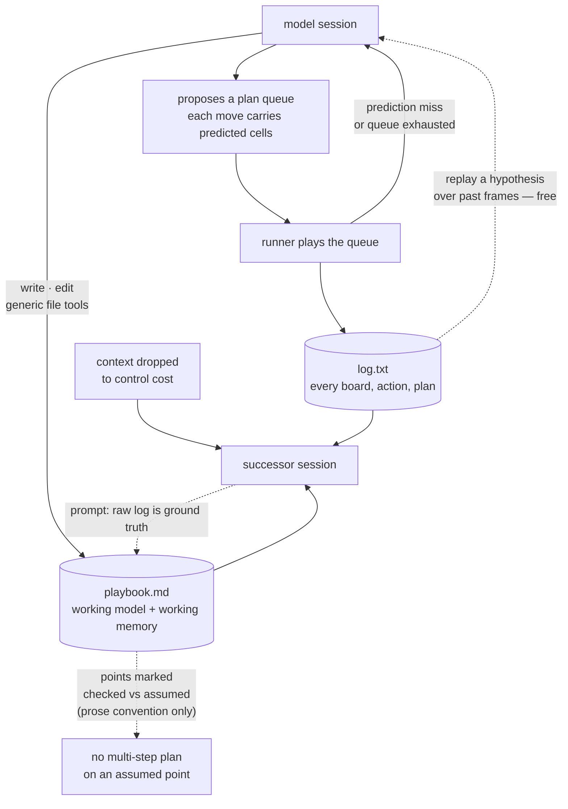

## 1. Executive Summary

Retrodict is an ARC-AGI-3 agent — 3,888 lines of Python, 46 commits since 5
July 2026 — that reports solving every level of all 25 public games at 99.86%
mean RHAE for $654 of API list price, on a published scorecard.

The memory design is one file. *"What it establishes about a game is curated
into a playbook memory file that outlives its context window."* The agent's
context is dropped periodically to control cost; a fresh session resumes with
the workspace and no recollection, reads `playbook.md`, and continues.

**No marks**, and the report exists because the *contract* around that file is
the most carefully written statement of the summarise-for-your-successor
problem in this corpus — and because none of it is machinery. Everything below
is a prompt instruction addressed to a model that may or may not comply, with
nothing in code checking that it did.

## 2. Mental Model

The prompt states the problem before the solution, which is why it is worth
quoting at length:

> *"To control cost, your in-context conversation is periodically dropped and
> you resume in a fresh session with no memory of your own reasoning — only
> your workspace files survive. log.txt survives but is large and raw: it
> records every board and action, not the conclusions you drew from them, so a
> fresh session relying on log.txt alone re-derives and re-tests rules you
> already settled, wasting actions and cost. Prevent this by maintaining
> playbook.md, a curated briefing for the successor who wakes up with your
> files but none of your memory."*

That is the clearest articulation of why a raw log is not memory that this
atlas has read. The log is complete and useless at scale; the playbook is
lossy and load-bearing; the successor needs the second and can check it against
the first.

## 3. Architecture

## 4. Essential Implementation Paths

**Hypotheses are tested against the record before they cost anything.** The
agent writes Python that replays a candidate rule over past frames in
`log.txt`, *"where being wrong costs nothing."* Only a hypothesis that survives
the log earns real actions. That is a verification step, and it is the reason
the playbook can carry a *checked* marking at all.

**The plan queue makes a wrong belief cheap to detect.** A committed queue
carries, per move, the exact cells the agent predicts the board will show. The
runner plays it out and returns to the model only when the queue is exhausted
or a prediction misses — with the diff. A falsified model announces itself.

**The playbook is written with generic tools.** `write` creates or overwrites
*"a fresh, compacted playbook.md"*; `edit` replaces a string for *"cheap
incremental updates."* Grepping the harness for `playbook` finds it in
`prompts.py` and nowhere else — not in `runner.py`, not in `tools.py`. The file
is a convention between the prompt and the model, and the code neither creates,
validates, parses nor backs it up.

## 5. Memory Data Model

There is none. `playbook.md` is markdown with a two-part structure the prompt
asks for — a *working model* and a *working memory* — and no parser.

The trust convention is the part worth recording, because it is a good design
that stops one step short of being a mechanism:

> *"Mark each point by how well the log supports it (checked against the log
> vs. still assumed), and do not build multi-step plans on merely-assumed
> points. The moment the log contradicts a point — or a plan built on it turns
> out impossible — [revise it]."*

Two epistemic states, a rule about what may be built on each, and a trigger for
revision. As a specification of `trust_state` it is better than several
implementations in this corpus. As an implementation it is a sentence in a
prompt: nothing extracts the marking, nothing refuses a plan built on an
assumed point, and nothing detects a point that was marked *checked* without
being checked. The mark is withheld for that reason and not for the design's
quality.

The same is true of precedence. *"The raw log is the ground truth"* and
*"nothing here is permanent"* are exactly the right rules for a lossy summary
over a complete record — and they are enforced by the model choosing to obey
them.

## 6. Retrieval Mechanics

The successor reads `playbook.md` first, then works over `log.txt` with code
rather than by looking at frames. There is no index, no embedding and no
ranking; retrieval is the model deciding what to grep. For a single-game
workspace of one agent's own making, that is a defensible answer and it does
not generalise past it.

## 7. Write Mechanics

Compaction is a full rewrite: the model lays down a fresh playbook when the old
one has drifted. Nothing records what the rewrite dropped. If a point was
falsified and the compaction removed both the point and the note that it was
falsified, the successor's only path back is the log — which is exactly what
the playbook exists to avoid re-reading.

That is the design's central risk and it is inherent rather than an oversight:
a curated briefing that is cheaper than the record is also lossier than the
record, and there is no diff.

## 8. Agent Integration

ThinHarness, gpt-5.6-sol at `max` reasoning effort, one workspace per game with
`arclog.py` and a `scratch/` package seeded from `workspace_template/`. The
log-as-context and plan-queue foundation is credited to RGB-Agent.

## 9. Reliability, Safety, and Trust

The honest summary: this is a system whose memory guarantees are entirely
prompt-level, in a setting where that is close to reasonable. One agent, one
game, one workspace, no other principal, no adversary, and a raw log that can
adjudicate any dispute. There is no scope to enforce, no audit consumer, and no
second party to review.

What the corpus should take from it is the contract, not the architecture. The
questions the prompt answers explicitly — why is the raw record not enough,
what is the summary *for*, which parts of it may be planned on, what triggers a
revision — are questions most memory systems in this atlas never write down at
all.

## 10. Tests, Evals, and Benchmarks

1,435 lines of tests across eight files, and none of them touches the playbook.
The suite covers the log writer, the plan parser, the live cache, the prompt
assembly and the tool sandbox — including `assert not result.ok, f"{module}
must not be importable by the agent"`, a real must-not assertion, but about
import isolation rather than memory retrieval. `negative_eval` is withheld on
that: no committed case asserts that particular material stays out of a recall
or out of the playbook.

The public result is unusually well qualified for a self-report. The README
gives 99.86% mean RHAE at $654 against a linked official scorecard, names
[Tycho](../tycho/) as scoring higher at 100.00% and an estimated $2,986, and
sends the reader to a comparison methodology document with the warning that
*"cost methods and run-selection rules differ."* A vendor comparison that names
the system beating it, and links the qualifications, is rarer than the number.

Nothing was run for this review.

## 11. For Your Own Build

**Write down why the summary exists.** The paragraph explaining that a raw log
makes a successor re-derive settled rules is the reason a curated file earns
its cost. Most systems here have the file and not the argument.

**If you ask a model to mark confidence, read the marking.** Two states and a
rule about what may be planned on each is a good design; it becomes a mechanism
the moment something parses the mark and refuses the plan.

**Record what a compaction dropped.** A full-rewrite briefing with no diff can
silently lose the note that a belief was falsified, and the only recovery is
the record the briefing exists to avoid reading.

## 12. Open Questions

**Does anything survive between games?** The playbook is per-game. Whether a
lesson learned in game 3 can reach game 17 — the thing that would make this a
memory system rather than a per-run scratchpad — was not found in the tree.

**What does a compaction actually keep?** No committed artifact shows a
before-and-after playbook, so the compaction's loss rate is unmeasured.

**Is the checked/assumed marking honoured?** The blog post may report on it; the
repository does not, and no test asserts it.

## Appendix: File Index

| Path | What it holds |
| --- | --- |
| `src/arc3/prompts.py` | The playbook contract, the checked/assumed rule, the tool descriptions |
| `src/arc3/runner.py` | The plan queue and the return-on-mismatch loop |
| `src/arc3/tools.py` | `write` and `edit`, the only path to the playbook |
| `src/arc3/logwriter.py` | `log.txt`, the ground truth the playbook is checked against |
| `workspace_template/` | The seeded per-game workspace |
| `docs/arc-agi-3-harness-comparison.md` | The cost and run-selection qualifications |

## History

**2026-08-27** — [`71672e8e5adb008360f52a61ef9e2adf91a62d89`](https://github.com/ryanbbrown/Retrodict/commit/71672e8e5adb008360f52a61ef9e2adf91a62d89) — first reading, 3,888 lines of Python, 46 commits since 5 July 2026. Screened before reading: no auto-run surface, no unpinned surface, and one execution surface — `tests/conftest.py`, which runs on pytest collection before any test does. `AGENTS.md` and `CLAUDE.md` are addressed to a reading agent and were treated as data. Nothing was installed and nothing was run. No marks. The durable memory is one model-authored `playbook.md` written through generic `write` and `edit` tools; grepping the harness finds `playbook` only in `prompts.py`, so no code creates, parses, validates or backs up the file. `trust_state` is withheld although the prompt specifies two epistemic states — a point *checked against the log* versus *still assumed*, with a rule against building multi-step plans on the second — because nothing reads the marking; it is a convention addressed to the model. `tombstone`, `bitemporal`, `scope_enforced`, `audit_log` and `human_review` are absent. `negative_eval` is withheld: the suite's must-not assertions are about module import isolation, not about material staying out of a recall. The reading covers the prompts, the runner, the tools and the tests; the ThinHarness dependency and the linked comparison methodology were not traced.
