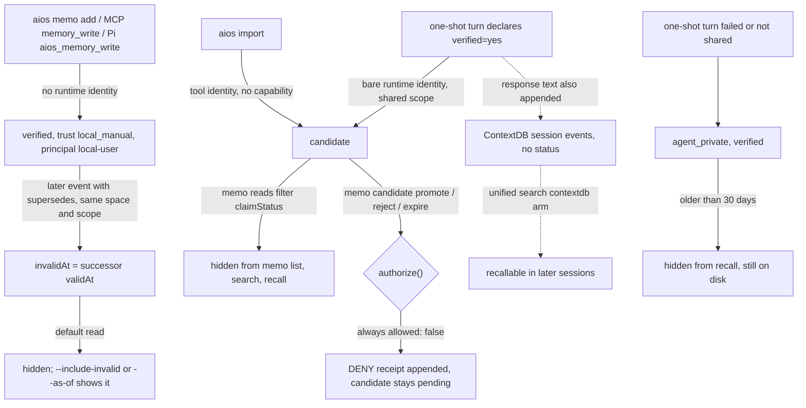

## 1. Executive Summary

aios (rexleimo) is a local control plane that wraps coding-agent CLIs — Codex,
Claude Code, Gemini, OpenCode and others — with hooks, a planning runtime and a
project memory. It is not [agiresearch/AIOS](https://github.com/agiresearch/AIOS).
This report reads only the memory: the `memo` event log, its governance and
dream lanes, and the ContextDB session store that unified search reads beside it.

What is notable is the belief model. A memo is an append-only event with a
provenance block, a `claimStatus`, a `validAt` and optional `supersedes` links.
Correction is an appended event, checked against an ACL on which scope and
agent may retire what. An automatic write from a model's `verified=yes`
declaration lands as `candidate`, which every memo read drops.

What is weak is that the governance is sealed at both ends. The promote,
reject and expire verbs are hard-wired to deny, so no candidate is ever
promoted. Every agent-facing explicit write — MCP `memory_write`, the Pi tool,
`aios memo add` — carries no identity and lands `verified` as `local-user`.

The agent-facing memo skill contradicts the code on exactly this. It tells the
model that `memo add` *"proposes — the entry lands as `candidate`"*
(`skill-sources/memo/SKILL.md:92-94`). The project's own test asserts the
opposite: a CLI `memo add` is `verified` with `trust: local_manual`
(`scripts/tests/memo-provenance.test.mjs:196-225`).

Five marks: `trust_state`, `bitemporal`, `scope_enforced`, `audit_log` and
`negative_eval`. Section 9 names the two withheld, `tombstone` and
`human_review`, and why.

## 2. Mental Model

A memory is a memo event: text, refs, a space, a scope, an agent, a claim
status, a provenance block and a validity start. It becomes a belief in one of
two ways. A write with no runtime identity is `verified` with provenance
`local_manual`, principal `local-user` (`scripts/lib/memo/storage/provenance.mjs:47-68`).
A write with a runtime identity is `verified` only if the identity is `human` or
carries a publish capability; otherwise a shared-scope write is `candidate`
(`:71-75`).

**A caller cannot declare its own status.** `createMemoEvent` honours a supplied
`claimStatus` only when it rides on trusted provenance, which only migration
passes. Anything else takes the authority verdict, so a forged `verified`
degrades (`scripts/lib/memo/storage/events-write.mjs:62-75`). Environment
variables do not count as identity; a test poisons `AIOS_RUNTIME_*` and asserts
the verdict is unchanged (`scripts/tests/memo-authority-env.test.mjs:40-59`).

**Who passes an identity decides everything.** The automatic write after a
one-shot turn builds a bare runtime identity with `shared: false`
(`scripts/lib/memo/autopilot.mjs:228-235`), and `aios import` does the same
(`scripts/lib/memo/import-external.mjs:96-106`). Those land as candidates. The
MCP `memory_write` handler, the Pi tool and the CLI pass none, so their writes
land verified (`scripts/memory-mcp-server.mjs:96-115`, `packages/aios-pi/lib/aios-cli.mjs:87`,
`scripts/lib/cli/dispatch.mjs:398-400`).

**A belief stops being live by supersession or by age.** A later event whose
`supersedes` names it sets `invalidAt` to its own `validAt` at read time
(`scripts/lib/memo/storage/temporal.mjs:112-139`). Shared events may retire
shared events; private events may retire only the same agent's private events;
a shared event retires a private one only when it is a verified promotion
(`:69-88`). Unknown targets are denied at write time and recorded in
`supersedeDenied` (`:90-108`). Private rows older than 30 days are hidden from
recall without deletion (`scripts/lib/memo/storage/query.mjs:35-60`).

**A candidate never becomes a belief.** The governance module lists candidates,
scans a promoted text for injection, and would append a verified event carrying
`promotionOf`. But `authorize` returns `allowed: false` with
`trusted_authority_unavailable` for every action, and `hasBrokerReviewAuthority`
returns `false` (`scripts/lib/memo/storage/candidates.mjs:181-183`, `:230-237`).
Each attempt writes a DENY receipt. The comment calls it a broker-reserved seam
(`scripts/lib/memo/cli/run.mjs:46`); no broker exists in the tree.

## 3. Architecture

The memory is Node.js modules invoked by the `aios` CLI, by client hooks and by
two stdio MCP servers. There is no daemon. Everything lives under the
workspace's `.aios/` state root (`scripts/lib/aios/state-root.mjs:42-56`).

- **Memo store** (`scripts/lib/memo/storage/`, about 3,000 lines): events in
  `.aios/memo/file/events.jsonl`, or one `NNNNNNNNNNNN.json` per sequence under
  `split/events/`. Pinned Markdown per space under `file/pinned/`. A
  lockfile serialises writers (`lock.mjs`).
- **ContextDB** (`mcp-server/src/contextdb/`, TypeScript, about 5,800 lines):
  per-session `l2-events.jsonl` and checkpoints, index JSONL files, and a SQLite
  FTS5 sidecar marked rebuildable (`sqlite/schema.ts:75-140`).
- **Governance and telemetry**: candidate receipts, dream receipts, recall
  feedback and automatic-write receipts, each an append-only JSONL.
- **Unified search** (`scripts/lib/search/unified-search.mjs`) merges memo,
  pinned, ContextDB, plans, docs and code for the CLI, the MCP recall tool and
  per-turn recall.
- **rex-harness** is a git submodule at
  `869b87fee3283cbfcca61d86dbf537e44c5ba202` holding the planning runtime; its
  tree has no path naming memory or recall, and it was not read.

### Deployment and ergonomics

Node 24 and a local filesystem are all it needs; nothing calls a model or a
network service to store or recall. No API key is required. The install path is
a `curl | bash` release installer followed by `aios init --all`, which writes
hooks and MCP entries into each detected client. The memo store is JSONL a
person can read and repair by hand, and the SQLite sidecar is rebuilt from the
JSONL on demand.

## 4. Essential Implementation Paths

- **Explicit write.** `aios memo add` → `handleMemoAddCommand`
  (`scripts/lib/memo/cli/commands/events.mjs:53-122`) → safety and length checks
  → `appendMemoEvent` (`scripts/lib/memo/storage/events-write.mjs:159-216`),
  which partitions `supersedes` against the space's events under the lock. A
  verified add is also mirrored into a legacy ContextDB workspace-memory
  session (`events.mjs:100-102`, `scripts/lib/memo/cli/legacy.mjs:87-111`).
- **Automatic write.** The shell bridge routes a print-mode client call to the
  one-shot flow (`scripts/lib/contextdb/shell-bridge/main.mjs:52-55`). After the
  response, `parseMemoryDeclaration` reads a trailing
  `<!--memory: verified=yes|no, ...-->` block, and only `verified=yes` calls
  `recordAutomaticMemory` (`scripts/lib/ctx-agent-core/run.mjs:409-438`). That
  function redacts secrets, runs the content-safety scan, dedups by source ref
  and appends (`scripts/lib/memo/autopilot.mjs:163-282`).
- **Session close.** `autoMemoSessionClose` writes a
  `session-close-memory-candidate.json` sidecar beside the ContextDB session,
  never into the memo log (`scripts/lib/lifecycle/session-hooks/close.mjs:69-123`).
- **Retrieval.** `searchMemoEvents` reads the whole space, drops dream-archived
  ids, applies temporal, candidate, scope and TTL filters, token-matches, scores
  and slices (`scripts/lib/memo/storage/query.mjs:304-358`).
- **Context assembly.** The UserPromptSubmit hook calls `collectTurnRecall`
  (`scripts/lib/planning/user-prompt-submit.mjs:34-45`), which queries memory,
  ContextDB and plans with six hits and 2,000 characters
  (`scripts/lib/planning/turn-recall.mjs:17-20`, `:218-228`), then appends the
  declaration instruction.
- **Correction.** `memo add --supersedes`, or `memo supersede --apply`, which
  re-asserts the winning text as a new event retiring every revision at
  similarity 0.82 (`scripts/lib/memo/cli/commands/supersede.mjs:74-86`,
  `temporal.mjs:15`, `:160-195`).
- **Governance.** `memo candidate list|inspect|promote|reject|expire` →
  `decideCandidate` (`scripts/lib/memo/storage/candidates.mjs:283-406`); `dream`
  approve, archive, restore and GC → the same shape in
  `scripts/lib/lifecycle/dream/governance.mjs:187-214`.
- **MCP.** `aios-memory` exposes `memory_recall`, `memory_write` and
  `memory_checkpoint` (`scripts/memory-mcp-server.mjs:26-62`), registered for
  Codex (`scripts/lib/native/emitters/codex-config.mjs:91-100`) and Pi
  (`scripts/lib/components/pi/mcp-adapter.mjs:66-71`).

## 5. Memory Data Model

A memo event carries `schemaVersion`, `eventId`
(`memo:<space>:<timestamp>-<uuid8>`), `storage`, `space`, `spaceKey`, `seq`,
`ts`, `role`, `kind`, `text`, `refs`, `scope`, `agent`, `claimStatus`,
`provenance`, `validAt`, and optionally `supersedes`, `supersedeDenied`,
`promotionOf`, `entities`, `confidence`, `evidenceRef` and `turn`
(`scripts/lib/memo/storage/events-write.mjs:80-107`). `invalidAt` and
`supersededBy` are never stored; they are derived per read.

Provenance is a fixed record: `trust` in `runtime_attested`, `local_manual` or
`legacy_unknown`; `producerType`; `principalId`; `agentId`; session, run and
activation ids; `policyRevision`; `sourceRef`; a sha256 `sourceHash`; and
capabilities (`scripts/lib/memo/storage/provenance.mjs:97-134`). Rows written
before provenance read back as `legacy_unknown`.

Scopes are `project_shared`, `agent_private` and `agent_ephemeral`, with
`project`, `shared` and `global` folded into the first
(`scripts/lib/memo/storage/normalizers.mjs:46-52`). The space is a second key,
filtered in `collectEvents`; in split mode it is also a directory.

ContextDB is a different kind of record. Its events are session transcript
lines — prompt, response, error — keyed by `sessionId#seq` with `project` and
`agent` from the session, and checkpoints carry a status, summary, next actions
and telemetry (`mcp-server/src/contextdb/sqlite/schema.ts:78-131`). Nothing in
it has a claim status or a supersede link.

## 6. Retrieval Mechanics

Memo retrieval is lexical and computed per query. A row matches when the
lowercased query is a substring, or when enough query tokens hit: all of two,
half of up to six, a third beyond (`scripts/lib/memo/storage/query.mjs:94-123`).
Tokens are Latin or identifier runs kept whole, ICU word segments, and CJK
character bigrams as a fallback (`:74-92`).

Ranking adds 2 for a text substring hit, 1 for a refs hit, four times a BM25
score normalised by its best case, and an entity score (`:188-199`). BM25's IDF
is computed over the matched set rather than the whole store (`:161-186`). The
entity layer boosts rows whose declared entities hit the query and spreads half
of that one hop to rows sharing an entity (`:216-274`). Recall feedback adds up
to 4.5 for rows marked useful and multiplies by 0.6 after five impressions with
no use (`scripts/lib/memo/storage/feedback.mjs:83-88`). Ties inside 0.2 fall to
recency.

The optional embedder is a 256-bucket signed hash of the same tokens, not a
model (`scripts/lib/memo/storage/embedding.mjs:16-45`). It can only add rows to
the matched set, and a comment in unified search states there is no vector
backend.

**The trust filter covers one arm of a merged result.** Unified search puts
ContextDB transcript events beside memo rows (`scripts/lib/search/unified-search.mjs:263-321`).
The one-shot flow appends the full response, up to 8,000 characters, as a
ContextDB event before the automatic memo write
(`scripts/lib/ctx-agent-core/run.mjs:80-88`). So the text a candidate holds is
recallable in a later session through the ContextDB arm while the memo arm
hides it.

Per-turn injection is bounded: six hits, 320 characters per memory, 2,000 in
total, placed in the hook's `additionalContext` after the cached system prefix.

## 7. Write Mechanics

Writes are deterministic; no model extracts or consolidates anything. The model
contributes only its declaration block: whether the turn is verified, which
recalled ids it used, and a one-line conclusion
(`scripts/lib/memo/declaration.mjs:1-57`). The automatic memo text is assembled
from changed files, the declared conclusion, the task, a clipped result and the
outcome (`scripts/lib/memo/autopilot.mjs:103-132`).

A failed, errored or blocked turn is filed `agent_private` even when the model
declared success (`autopilot.mjs:220-223`). A duplicate is detected by source
ref, not by text. `aios import` skips facts whose normalised text already
exists. Content matching the workspace-memory safety scan is refused on the
explicit and automatic paths and at promotion.

Supersession is the only correction. `memo add` prints a hint when a live fact
scores 0.7 or more against the new text and writes nothing
(`scripts/lib/memo/storage/temporal.mjs:197-220`); the writer then passes
`--supersedes`. The memo CLI's verbs are `use`, `gui`, `storage`, `space`,
`persona`, `pin`, `checkpoint`, `useful`, `add`, `recall`, `list`, `search`,
`supersede`, `candidate`, `hygiene` and `report`; none deletes an event
(`scripts/lib/memo/cli/run.mjs:57-189`).

The pinned block is the exception to append-only. `writePinnedMemo` and
`appendPinnedMemo` rewrite `file/pinned/<space>.md` under the lock, with an
optional hash guard against a stale read
(`scripts/lib/memo/storage/pinned.mjs:89-126`). It has no provenance and no
status, and MCP `memory_checkpoint` appends to it.

### Operational cost

The explicit write is a synchronous append under a file lock; the automatic
write runs after the response is printed, so the turn does not wait on it and
a memo is retrievable on the next read. Every search reads the space's whole
event file (an in-process parse cache exists) and scores the matched set in
JavaScript, so cost grows with the store. The optional embedder hashes every
row's tokens per query. Nothing rewrites the store in the background:
autodream is opt-in through `AIOS_AUTODREAM_AUTO=1`, runs preview only, and
writes a proposal file (`scripts/lib/memo/autodream-auto.mjs:1-30`).

## 8. Agent Integration

Three surfaces reach the model. The UserPromptSubmit hooks for Claude Code,
Codex and Grok inject recall and the declaration instruction each turn. The
`aios-memory` MCP server gives Codex and Pi recall, write and checkpoint tools.
The Pi extension adds `aios_memory_useful` and maps each tool to an `aios memo`
command (`packages/aios-pi/lib/tools.mjs:25-70`).

The model's agency is uneven by surface. Through MCP it writes verified
shared memory; through the CLI it can also supersede any shared fact in the
space. Through
the one-shot wrapper its declaration yields a candidate it cannot promote. The
declaration block is requested on every hooked turn, but only the one-shot flow
parses it for a write (`run.mjs:412`); in an interactive native session it is
read only for useful-feedback ids (`scripts/lib/planning/turn-recall.mjs:178`).

Adapting the store to another agent is cheap: `appendMemoEvent` and
`searchMemoEvents` are plain async functions over files.

## 9. Reliability, Safety, and Trust

**The candidate queue is sealed.** Promotion, rejection and expiry all return
DENY with `trusted_authority_unavailable`, and candidate text cannot be listed
or inspected (`scripts/lib/memo/storage/candidates.mjs:181-237`). The suite
asserts the denial against a spoofed human identity, eight concurrent
promotions and the CLI (`scripts/tests/memo-candidate-governance.test.mjs:143-183`,
`:221-236`). The
result is a write-only queue: every automatic memory from a verified shared
turn is withheld forever.

**The explicit write surfaces bypass it.** `handleMemoryWrite` calls
`appendMemoEvent` with scope `project_shared` and no `runtimeIdentity`
(`scripts/memory-mcp-server.mjs:96-115`). The authority falls to the manual
branch: `verified`, `local_manual`, principal `local-user`, capability
`memo:publish-shared` (`scripts/lib/memo/storage/provenance.mjs:49-68`). The
model-written memo is recorded as a person's. The project's own backlog states
the rule the MCP server breaks: any non-manual writer must carry a runtime
identity (`docs/plans/2026-09-08-memo-optimization-backlog.md:126`).

**The skill misdescribes the gate to the model.** `skill-sources/memo/SKILL.md:90-98`
says `memo add` lands as `candidate` and a self-awarded `verified` is demoted.
The code does the reverse for `memo add`, and
`scripts/tests/memo-provenance.test.mjs:196-225` asserts it.

**Scope is a label, not an identity.** `--agent` and `AIOS_AGENT_ID` name the
reader; any process naming an agent reads its private rows. Supersession is
better guarded: the ACL denies cross-scope and cross-agent retirement and fails
closed on unknown ids (`scripts/lib/memo/storage/temporal.mjs:69-108`).

**Withheld marks.** `tombstone`: nothing records a rejected value. Supersession
is keyed on event ids, the dream lane's `tombstone` actions are keyed on event
ids and never applied (`scripts/lib/lifecycle/dream/index.mjs:115-131`), and the
reject verb is denied. `human_review`: a queue exists, but no actor can resolve
it; a queue nothing drains fails the mark.

**Data loss and concurrency.** Writers take a lockfile; tests cover concurrent
appends (`scripts/tests/memo-storage-locking.test.mjs`). Nothing deletes a memo
event. The ContextDB mirror of a verified add is a second copy that supersession
does not reach.

## 10. Tests, Evals, and Benchmarks

The memo and dream suites hold 228 test cases in 32 files; ContextDB adds 46 in
three TypeScript files. CI runs the scripts regression suite
(`.github/workflows/ci-main.yml:77-98`). I read the tests and ran none.

The negative cases are the strongest part. The scope case asserts exact
equality to the shared row for another agent (`scripts/tests/memo-scope.test.mjs:38-54`).
The provenance case asserts the active fact is present and the candidate absent
(`scripts/tests/memo-provenance.test.mjs:106-126`). The temporal CLI case
matches the new value before asserting the superseded line is gone
(`scripts/tests/memo-temporal.test.mjs:197-221`).

`scripts/lib/memo/eval/recall-ab.mjs` is a deterministic A/B over synthetic fact
chains, with arms for no links, explicit links, auto-detected links, entity
boost and the embedder. Its test asserts the baseline's stale rate exceeds 0.4
and the explicit arm's is zero. It also asserts the automatic detector covers
fewer than half the chains, labelled *"Recorded as a measurement, not an
aspiration"* (`scripts/tests/memo-ab-eval.test.mjs:43-71`).

Two gaps matter. No test exercises MCP `memory_write` and asserts its claim
status. No test asserts that candidate text stays out of unified search.

The project has no paper. A design report in the tree cites *Agentic Context
Management* ([arXiv:2607.21503](https://arxiv.org/abs/2607.21503), 23 July 2026)
as an input and states its mechanisms were not reproduced
(`docs/reports/2026-07-28-context-lifecycle-competitor-analysis-and-plan.md:6`, `:48`).

## 11. For Your Own Build

### Steal

- **Put the status verdict in the write function, not the caller.** Derive
  `candidate` or `verified` from the identity and scope inside the append, and
  ignore any status the payload claims. Then test it with a poisoned
  environment.
- **Make supersession an appended event with an ACL.** Store only the forward
  link, derive `invalidAt` at read, let the earliest supersede win, and deny
  unknown targets at write time so a dangling id cannot later retire a fact in
  another space.
- **Record the denial, not only the grant.** A governance receipt for every
  DENY, with the reason code and the content-safety verdict, makes a sealed gate
  auditable.
- **Assert the limits of your own detector.** An eval that fails if automatic
  supersede detection starts claiming full coverage keeps a heuristic honest.

### Avoid

- **A fallback identity that is the most trusted one.** When the no-identity
  branch is `verified` as `local-user`, every new integration that forgets the
  identity argument inherits publish authority. Make the absent identity the
  least trusted.
- **A trust filter on one arm of a merged search.** If transcripts and beliefs
  share a result list, the status gate has to hold on both, or the transcript
  arm returns what the belief arm withholds.
- **A review queue with no reviewer.** Shipping the deny-all seam before the
  broker turns every automatic memory into a permanent orphan.
- **Agent guidance that describes intended behaviour.** A skill that tells the
  model its writes are candidates, when they are not, trains it to trust a gate
  that is absent.

### Fit

For a single developer who writes memos by hand and uses the one-shot wrapper
little, this is a sound local store: append-only, repairable by hand, with real
supersession and time travel, no model and no service. For anyone relying on
the candidate gate to keep model-authored claims out of shared memory, it does
not yet do that job. The MCP and Pi tools let the model publish verified facts
under a human principal, and the only path that produces candidates leads to a
queue no command can empty. Adopt the storage and supersession design; treat
the governance as a specification awaiting its broker.

## 12. Open Questions

- Is a broker planned that would supply `hasBrokerReviewAuthority`, and would it
  also sign the MCP server's writes?
- Does a rebuilt ContextDB index pick up the legacy workspace-memory mirror,
  making superseded memo text searchable through the ContextDB arm?
- How large does `events.jsonl` grow in practice before per-query full reads
  and scoring become noticeable?
- Is `observed` produced anywhere, or is it reserved?

## Appendix: File Index

- **Storage and schema:** `scripts/lib/memo/storage/events-write.mjs`,
  `events-read.mjs`, `normalizers.mjs`, `provenance.mjs`, `temporal.mjs`,
  `pinned.mjs`, `lock.mjs`, `paths.mjs`; `scripts/lib/aios/state-root.mjs`;
  `mcp-server/src/contextdb/sqlite/schema.ts`, `mcp-server/src/contextdb/core.ts`.
- **Write path:** `scripts/lib/memo/cli/commands/events.mjs`,
  `scripts/lib/memo/autopilot.mjs`, `scripts/lib/memo/declaration.mjs`,
  `scripts/lib/memo/import-external.mjs`, `scripts/lib/memo/cli/legacy.mjs`,
  `scripts/lib/ctx-agent-core/run.mjs`,
  `scripts/lib/lifecycle/session-hooks/close.mjs`.
- **Retrieval:** `scripts/lib/memo/storage/query.mjs`, `feedback.mjs`,
  `embedding.mjs`; `scripts/lib/search/unified-search.mjs`.
- **Context assembly:** `scripts/lib/planning/turn-recall.mjs`,
  `scripts/lib/planning/user-prompt-submit.mjs`.
- **Governance and background:** `scripts/lib/memo/storage/candidates.mjs`,
  `scripts/lib/lifecycle/dream/governance.mjs`, `index.mjs`,
  `scripts/lib/memo/autodream-auto.mjs`.
- **MCP and integration:** `scripts/memory-mcp-server.mjs`,
  `scripts/lib/native/emitters/codex-config.mjs`,
  `scripts/lib/components/pi/mcp-adapter.mjs`, `packages/aios-pi/lib/tools.mjs`,
  `packages/aios-pi/lib/aios-cli.mjs`, `skill-sources/memo/SKILL.md`.
- **Tests and evals:** `scripts/tests/memo-scope.test.mjs`,
  `memo-provenance.test.mjs`, `memo-temporal.test.mjs`,
  `memo-candidate-governance.test.mjs`, `memo-authority-env.test.mjs`,
  `memo-ab-eval.test.mjs`, `dream-governance.test.mjs`;
  `scripts/lib/memo/eval/recall-ab.mjs`.

### Recorded searches

Checked against the checkout at the pinned revision.

- `rg -n 'runtimeIdentity' -g '!scripts/tests/**' -g '!**/*.test.*'` — callers passing an identity are `autopilot.mjs`, `import-external.mjs`, the candidate and dream CLIs and a benchmark; `memory-mcp-server.mjs` and `cli/dispatch.mjs:400` pass none.
- `rg -n 'recordAutomaticMemory|promoteMemoryCandidate|hasBrokerReviewAuthority|trusted_authority_unavailable' -g '!docs/**'` — one automatic-write caller (`ctx-agent-core/run.mjs:424`); both `hasBrokerReviewAuthority` definitions return `false`.
- `rg -n 'parseMemoryDeclaration\(' -g '!scripts/tests/**' scripts packages` — `ctx-agent-core/run.mjs:412` and `planning/turn-recall.mjs:178` only.
- `rg -n 'memory_write|handleMemoryWrite' scripts/tests` — no match; the Pi test names `aios_memory_write` only.
- `rg -n -i "forget|'delete'|'remove'|'rm'" scripts/lib/memo scripts/lib/cli/parse-args/memo.mjs scripts/memory-mcp-server.mjs` — no match.
- `rg -n -i 'tombstone' -g '*.{mjs,ts,js}' .` — dream proposal actions keyed on `eventId` and capability names in tests; no value-keyed record.
- `gh api repos/rexleimo/rex-harness/git/trees/869b87fee3283cbfcca61d86dbf537e44c5ba202?recursive=1 --jq '.tree[].path' | grep -i -E 'memo|memory|recall'` — no match over the untruncated 217-entry tree.
- `grep -rliE 'arxiv|bibtex|@article|@misc|doi\.org' . --exclude-dir=.git --exclude-dir=node_modules` — two design reports citing other work; no `CITATION.cff`.

## History

**2026-09-30** — [`6e2910a99ad51d7da30e7186c0f5dcb278be77ec`](https://github.com/rexleimo/aios/commit/6e2910a99ad51d7da30e7186c0f5dcb278be77ec) — first reading, at the head of `main`, a commit dated 28 September 2026. Five marks: `trust_state`, `bitemporal`, `scope_enforced`, `audit_log`, `negative_eval`. Screened before reading: 1 auto-run surface (`.gitmodules`), no build-time execution, 14 dependency files inside the cooldown — every file in a depth-1 clone dates to the tip — and 6 unpinned surfaces; `AGENTS.md`, `CLAUDE.md` and `GEMINI.md` recorded as data. The `rex-harness` submodule was not cloned. Read with `grep` and `sed`; nothing installed, built or run. Only the memory subsystem is covered.
