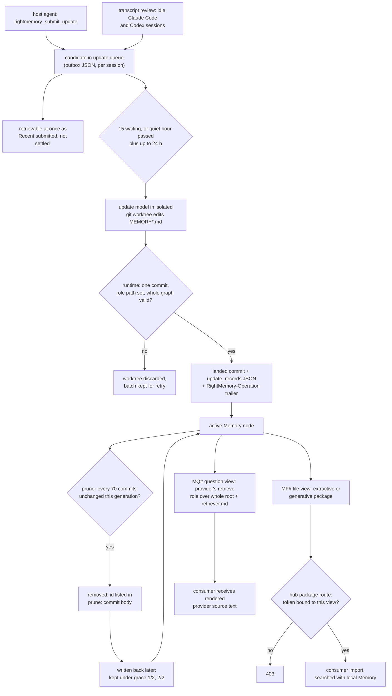

## 1. Executive Summary

RightMemory is a memory runtime for coding agents that stores durable context
as Markdown trees in a git repository and keeps ordinary agent work from
editing them directly. A coding agent submits evidence; a batched model updater decides what becomes
Memory, in a throwaway git worktree, and the runtime lands the result only if
the role's path set and the whole graph validate. A human-owned direction map,
Pursuit, sits in the same graph, and a hub shares selected views between roots.

What is notable is the machinery around the model rather than the model. Exact
candidate batches are committed beside the diff they produced. Updaters on
several devices coordinate through a git lease with a fencing token. The update
role cannot land a write to Pursuit, even when Codex runs it with full
filesystem access.

What is weak is the trust boundary on reads. Raw submitted evidence is
retrievable, labelled pending, before any judgement. The pruner protects a
removed memory that is written back rather than refusing it. A question view
lets a consumer's question reach a retriever with the provider's whole root in
reach, scoped by a prompt file.

The project is a single author's repository from 1 May 2026 to the pin, and
describes itself as Alpha in `pyproject.toml`.

One mark, `negative_eval`, on the committed hub test that refuses a consumer
another view's package after a positive download. `scope_enforced` is withheld:
the package route carries the view key, and the question path over the same
view's data does not. Section 9 names the six withheld.

## 2. Mental Model

Memory has three modules. **Memory** is durable context: an addressable node,
`` `id` statement → [edges] ``, under anchored headings, with detail files
behind `{F#id}` headings, free-form evidence behind `{M#id}` and instruction
files behind `{S#id}`. **Pursuit** is the user's map of directions, in the same
id namespace. **Agent Corrections** are two capped files of concrete
redirection cases, at most ten entries each (`rightmemory/corrections.py:8-11`).

**Nothing an agent says is Memory until the updater says so.** The host agent's
MCP tool `rightmemory_submit_update` writes a candidate to a queue
(`rightmemory/mcp.py:297-311`). The updater prompt calls candidates
*"evidence, not stored wording"* and tells the model to revalidate stale claims
(`rightmemory/prompts/update.md:3`, `:15`). A queued candidate is already
visible to retrieval, as *"pending updater submissions, not settled Memory"*
(`rightmemory/recent_submitted.py:15-19`). That label is prose to a model; no
read path drops pending material.

**A memory stops being one in four ways.** The updater rewrites or removes it
while reconciling later evidence. Dreamer restructures the tree after enough
landed updates. The pruner removes memory unchanged across a 70-commit
generation (`rightmemory/config.py:47`). Or a person edits the Markdown through a
maintenance skill. Git keeps every earlier text, and `rightmemory history`
asks a historian model to search prune ledgers and old snapshots.

**A pruned memory that comes back is protected, not refused.** The pruner reads
the previous `prune:` commit body. An item removed there and present again is
kept for two further prunes, recorded as `grace K/N`
(`rightmemory/prompts/pruner.md:24-28`; `rightmemory/prune.py:140-184`). The
design reads a rewrite as a signal of use. It is also the opposite of a
tombstone.

**Uncertainty is a wording convention.** `Uncertain:` prefixes and a global
`# Open Context Questions` heading are rules in
`rightmemory/reference/MEMORY_RULES.md:21`; nothing parses them.

## 3. Architecture

A memory root is a git repository, `~/.rightmemory` by default, holding
`MEMORY.md`, `PURSUITS.md`, their detail files, the correction collections,
`update_records/`, `insight_logs/` and a machine-local `.runtime/`. A
fresh-root install writes a tracked `.gitignore` allowlist so only those paths
are committed. Profiles select a different root per project through
`--profile` or a `.rightmemory-profile` file (`rightmemory/profiles.py:20`,
`:117`).

Every model role runs one of two ways: retrieve, update, reviewer, dreamer,
insight, pruner, historian, sync-reconciler and shared-view-builder. In
standalone mode a Pydantic AI agent gets bounded tools rooted at the memory
root (`rightmemory/tools.py`). In CLI-agent mode the runtime shells out to the
Codex SDK or `claude -p`. Read roles run Codex `read-only` or Claude `plan`,
and write roles run Codex `full-access` or Claude `auto`
(`rightmemory/agent_cli.py:822-835`).

Writes are safe against that because the runtime, not the model, lands them.
Automatic update, dreamer, insight and pruner turns run in
`.runtime/worktrees/` on temporary branches. `_validate_commits` allows one
commit for an update turn and rejects any changed path outside the role's set
(`rightmemory/isolated_write.py:659-683`, `:860-879`). The whole graph must
validate before landing.

The optional hub is a FastAPI service over SQLite and a package directory
(`rightmemory/hub/`). Providers publish versioned view packages with a publish
token; consumers accept an invitation and download with a connect token. The
optional embedding service is a separate process that loads the embedding and
reranker models (`rightmemory/embedding_service.py`).

Sync pushes the root to a private git remote. Incoming commits merge in a
candidate worktree, a sync-reconciler model repairs conflicts there, and the
active root fast-forwards only to a validated commit.

### Deployment and ergonomics

The minimum is Python 3.11, git, and either a model API key for standalone mode
or an installed Codex or Claude Code CLI. Nothing else has to run. The watcher
set (`rightmemory watch start`) adds background loops; the hub and the
embedding service are separate opt-ins, the second run on a GPU in the
maintainer's own experiments. Retrieval and writes both call a model, so
nothing works offline without a local provider. The store is plain Markdown in
git, readable and repairable by hand, and `rightmemory validate` checks it.

## 4. Essential Implementation Paths

**Submit.** `rightmemory_submit_update` → `DefaultMcpBackend.submit_update`
(`rightmemory/mcp.py:175-192`) → `AsyncUpdateStore.submit`
(`rightmemory/async_update.py:263-312`), which writes the candidate to an
outbox and enqueues it under the session. `rightmemory update undo` cancels a
still-pending candidate (`async_update.py:146`).

**Batch selection.** `_select_candidates` takes every waiting session at once
when 15 candidates are waiting in aggregate. Otherwise it takes sessions whose
one-hour quiet period has passed, once 24 hours have elapsed since the oldest
became ready (`async_update.py:822-842`; constants at `:36` and
`config.py:43-45`). Session queues are never split.

**Claim across devices.** With sync on, `UpdateQueueGit` writes
`update_queue/lease.json` with a random token and a six-hour expiry and pushes
it by compare-and-swap (`rightmemory/update_queue_git.py:47`, `:228-258`).
Finalisation looks up both a batch and a token trailer, so an expired holder's
result cannot land.

**Update.** The isolated writer runs the update role in a worktree, validates,
then `_prepare_managed_artifacts` adds `update_records/<batch>.json` and
amends the commit, or makes a record-only commit for a no-change batch, with a
`RightMemory-Operation` trailer (`rightmemory/isolated_write.py:45`,
`:714-769`). `UpdateRecord` refuses an operation id that does not hash its
candidates (`rightmemory/update_record.py:29-58`).

**Transcript review.** `scan_once` normalises idle sessions from
`~/.claude/projects` and `~/.codex/sessions`, runs the read-only reviewer
role, and submits one candidate bundle (`rightmemory/review.py:249-413`). The
reviewer is told never to edit or submit itself (`prompts/reviewer.md:8`).

**Retrieve, agent backend.** The retrieve role gets only typed readers —
`read_detail`, `read_markdown`, `read_skill`, `read_mf`
(`rightmemory/runtime.py:1861-1868`) — plus a snapshot of the root documents
and diffs. It returns a strict JSON selector
(`rightmemory/reference/RETRIEVE_CONTRACT.md`), and
`RetrieveSelectionRenderer` renders source text with ancestors. Before reading,
`_pull_file_views_for_retrieve` refreshes sync and pulls every accepted file
view (`runtime.py:1715-1727`).

**Retrieve, embedding backend.** `build_retrieval_corpus` indexes every graph
entry, backing passage, import entry, correction entry and pending candidate
(`rightmemory/retrieval_index.py:60-105`). `EmbeddingRetriever._select`
scores all passages by dot product, keeps 40, reranks and returns ten. The
caller retries once if the corpus changed during scoring
(`rightmemory/embedding_retrieval.py:121-154`).

**Prune.** `prune_due_status` counts commits since the last `prune:` commit;
`build_pruner_message` hands the pruner the boundary, the head and the parsed
previous ledger (`rightmemory/prune.py:68-121`, `:197-221`).

**Guidance inbox.** `rightmemory_capture_guidance` appends a `GI-` entry to
`AGENT_GUIDANCE_INBOX.md` through a worktree commit
(`rightmemory/guidance.py:94-141`). The `review-agent-guidance-inbox` skill
curates it.

**Sharing.** File views render packages from a recipe
(`rightmemory/shared_view_files.py`); `download_package` serves one to a
connect token (`rightmemory/hub/app.py:415-427`). Question views are answered
by `answer_question_view` (`rightmemory/shared_view_questions.py:284-325`).

## 5. Memory Data Model

| Element | Where | Notes |
| --- | --- | --- |
| heading | `#` to `###` in `MEMORY*.md`, `PURSUIT*.md` | optional `{#id}`, `{F#id}`, `{M#id}`, `{S#id}`, `{MF#id}` or `{MQ#id}` anchor; optional body and edge list |
| node | `` - `id` text → [edges] `` | one statement; ids share one namespace across Memory and Pursuit |
| edge | `dep:`, `ver:`, `doc:`, `todo:`, `rel:` and others | typed, targets an id |
| correction entry | `MEMORY_agent-corrections-writing.md`, `-design.md` | at most ten entries, 180 lines, 200 characters a line |
| candidate | `update_queue/` or `.runtime/` JSON | uid, session id, display id, message, submitted_at |
| update record | `update_records/update-batch-*.json` | schema version, operation id, exact candidates |

The graph is parsed from Markdown on every operation and never persisted as a
second index (`rightmemory/graph.py`). A node carries no author, time, source
or status. Provenance is the git commit and, for queued updates, the record
whose trailer links input to diff. Direct maintenance, Dreamer and the pruner
produce no record.

**Scope is placement.** Project scope is a heading; the rules say to express
narrower guidance *"through tree placement or explicit wording"*. The hard
local boundary is the root: one git repository per profile.

**Shared memory carries a view id.** An imported file view lives under
`.runtime/shared_views/imports/<view>/dist/` and its ids are addressed as
`MF#view:id`. On the hub, `view_versions`, `invitations` and `connections`
carry `view_id NOT NULL`, and `tokens` carries a nullable `view_id`
(`rightmemory/hub/store.py:2006-2050`).

`corrections.md` is a separate collection: *"RightMemory Edit Feedback"*, each
entry a candidate, a proposed edit and the accepted edit or `[no change]`,
capped at ten
(`rightmemory/reference/RIGHTMEMORY_EDIT_CORRECTION_RULES.md:31-32`).

## 6. Retrieval Mechanics

The default retriever is a model reading documents. It starts from a stable
snapshot of `MEMORY.md`, `PURSUITS.md` and the correction collections, receives
diffs as the root changes, and selects ids, line ranges and skills. There is no
lexical index and no score. The runtime renders the selection with parent
context and suppresses content already delivered unchanged in that session.
Output is capped at 100,000 characters and fails rather than truncates.

The embedding backend brute-forces a dot product over every cached passage
vector, keeps the best passage per entry, and reranks 40. It has no score
cutoff: the maintainer's experiment found a cutoff dropped required context,
so a query with no stored answer still returns ten entries (`DESIGN_NOTES.md`).
A service failure falls back to the agent retriever for that query.

**Pending candidates compete with settled Memory.** Both backends include
queued evidence. The agent retriever sees it as a volatile block, and the
embedding corpus adds each as a `pending:` entry
(`rightmemory/retrieval_index.py:97-98`, `:224-230`). The retrieve prompt says
to treat them as unsettled (`prompts/retrieve.md:11`). A candidate an agent
submitted a minute ago can reach the next session's context before any updater
has judged it, marked only by its source label.

**Imports are searched with local Memory.** Every accepted file view is pulled
and indexed, and the retriever is not told which views a task may use. Root
`corrections.md` and the guidance inbox are outside retrieval
(`RETRIEVE_CONTRACT.md:13`; the inbox is read only by `sync.py`,
`entrypoint.py` and `guidance.py`).

## 7. Write Mechanics

Writes are model-mediated and deferred. The host agent or the transcript
reviewer submits free text. The updater reconciles a batch, forms a tentative
edit, reads `corrections.md` *"as a late check"*, and makes the smallest
coherent change (`prompts/update.md:21`). It may write Memory and the two
correction collections. A commit touching Pursuit, `corrections.md` or anything
else is rejected at landing. Tests cover a rename into Memory and a Pursuit
write hidden before the squash
(`tests/test_isolated_write_candidate_validation.py:206-273`).

**Deduplication is the model's job.** The prompt tells it to update a matching
canonical item rather than append. Nothing in code compares new text to old.

**Deletion is by rewrite and by pruning.** The updater removes obsolete
content. The pruner removes unchanged content every 70 commits and records the
ids in the `prune:` body; the memory files carry no lifecycle marker by design.
Every removed text remains in git history and in the private remote.

**Agent-generated and transcript-derived content is handled alike.** Both
become candidates and pass the same updater. Nothing filters content before the
model; the admission bar is the rules document.

**Privacy.** The reviewer reads full Claude Code and Codex transcripts. Every
candidate's exact text is committed to `update_records/` and pushed with sync,
and the README says the remote must be private for that reason.

### Operational cost

- Write: submission is synchronous and cheap. Judgement is one updater model
  turn per batch, run at 15 waiting candidates, or one hour after a session goes
  quiet plus up to 24 hours when fewer are waiting. Settled Memory lags by that;
  the pending candidate is retrievable at once.
- Background: transcript review wakes every two hours over sessions idle six
  hours, three per batch. Dreamer runs after 50 landed updates and Insight
  after 150, each reading the active Memory. The pruner compares the root at
  two commits every 70 commits.
- Read: one retrieve model turn per query on the default backend. The snapshot
  is a stable prefix, forked per session in CLI-agent mode to keep the
  provider's cache warm. The embedding backend costs one query embedding and a
  rerank over 40 candidates, a 1,168.6 ms warm median in the maintainer's GPU-backed runs.

## 8. Agent Integration

The installer writes five skills into `~/.codex/skills` and `~/.claude/skills`
(`rightmemory/install_core.py:953-954`). The default,
`rightmemory-auto-orchestrator`, retrieves when stored context could change
the approach and submits qualifying evidence at a natural boundary. An
approval-gated variant asks the user in chat before submitting. The MCP server
registers three tools, `rightmemory_retrieve`, `rightmemory_submit_update` and
`rightmemory_capture_guidance` (`rightmemory/mcp.py:277-325`); none edits,
approves or deletes.

The host agent still has a direct path. The `maintain-rightmemory` and
`maintain-pursuit-map` skills edit the Markdown in a worktree when the user
asks, and the host agent runs them with its own shell. The skill text is the
boundary there.

Session continuity is per logical session id. Standalone retrieve keeps exact
message history, and CLI-agent retrieve keeps one provider fork per session.
Every internal provider conversation gets an ownership record, so transcript
review does not mine the memory system's own threads.

## 9. Reliability, Safety, and Trust

**The write surface is enforced after the fact, where it holds.** A Codex write
role has full filesystem access, and the runtime still refuses to land a commit
touching a path outside the role's set, more than one commit, or an invalid
graph. The Pursuit map is the user's by code, not by prompt.

**Cross-device updates are fenced.** The lease is claimed by a
compare-and-swap push, and a finalisation must carry the claim's token. A
crashed holder delays takeover by up to six hours and cannot commit a stale
result.

**Question views are scoped by a prompt.** `answer_question_view` checks the
view is approved, prepends `retriever.md` to the consumer's question, and runs
the provider's retrieve role (`shared_view_questions.py:284-325`). That role
reads the whole provider root — Memory, Pursuit, corrections and the provider's
own imports — and returns rendered source text. Every consumer of a view
shares the session `shared-view-question-<view>` (`:347-355`). One consumer's
questions are then in the history, and the delivery suppression, of the next.
This was read, not reproduced.

**Unjudged evidence is retrievable.** Section 6 covers it. A prompt-injected
transcript line becomes a candidate that reaches the next retrieval before the
updater's revalidation instruction applies.

**No provenance on a node.** The link from a node back to the evidence that
produced it is a git blame and a trailer, and only for queued updates.

Capability marks:

- `scope_enforced` — withheld, on the second way to consume a view. A
  package download needs a connect token minted with the view's id, and a
  token bound to another view gets 403 (`rightmemory/hub/app.py:415-418`,
  `:492-499`; `rightmemory/hub/store.py:1458-1488`). A question view skips
  that key. `answer_question_view` prepends `retriever.md` and runs the
  provider's retrieve role over the whole root
  (`rightmemory/shared_view_questions.py:284-325`, `:347-355`), so a
  consumer's read over the view's data is bounded by a prompt. Locally, the
  root and the MF# namespace partition memory, and retrieval carries no
  predicate.
- `negative_eval` — awarded; section 10.
- `tombstone` — none. The pruner's revival grace protects a memory written
  back. `corrections.md` holds rejected edit fragments for the updater model to
  read, capped at ten and evicted by priority. The update role cannot write it;
  among runtime roles only the sync-reconciler can
  (`rightmemory/tools.py:1425-1443`), and the maintenance skills edit it
  directly. No code refuses a value.
- `trust_state` — no status field. Pending candidates are rendered with a
  label, not filtered. The guidance inbox holds unreviewed guidance in a file
  retrieval never reads, which is a location, not a state.
- `bitemporal` — no validity time; git commit time only.
- `audit_log` — the hub appends `audit_events` for token, invitation,
  connection and `view.version.created` events, with the actor token and
  package hash (`rightmemory/hub/store.py:1318-1325`, `:1490-1512`). Those
  record publication of a rendered package. The Memory it renders changes
  through git commits, with `update_records` holding inputs for queued updates
  only.
- `human_review` — the updater admits memory with no approval state. Guidance
  inbox entries wait for review, but the host agent that captured them applies
  the approved proposals itself. `share approve` and `approve_question_view`
  flip an `approved` flag from a CLI with no actor check. They gate disclosure
  of a view, not admission.

## 10. Tests, Evals, and Benchmarks

Nothing was built or run for this report. The suite is 1,557 test functions,
and CI runs all of it with `python -m tests` on Ubuntu and Windows. On Linux
it also runs the frontend's typecheck and tests and a byte check of the
committed bundle (`.github/workflows/tests.yml`).

**The negative case.** `test_publish_invite_accept_pull_interact_and_inbox_flow`
(`tests/test_http_hub.py:797-905`) downloads a view's package with a connect
token and asserts the current version's text. It then publishes a second view
for the same provider and asserts that token gets 403. The retrieval-side case
`test_mf_ids_are_scoped_and_metadata_is_not_exposed`
(`tests/test_retrieve_selection.py:217-228`) asserts the selected imported
content, then that the provider's `recipe.toml`, fixture line `secret = true`,
is absent from the rendered result.

**Projections, not retrieval.**
`test_exact_node_preserves_ancestor_bodies_without_sibling_leaks`
(`tests/test_shared_views.py:343-384`) renders an extractive view whose recipe
includes a node under an excluded heading. It asserts the export keeps the
included context and drops the excluded node, its siblings and the unrelated
section. That tests what leaves the provider, not what a reader retrieves.

**Writes and coordination.** The isolated-write suites assert every
forbidden-path shape at landing. The queue suites cover one-claimant leases,
takeover fencing of an old token, and exact trailer lookup
(`tests/test_update_queue_git_claims.py:75-272`). `tests/test_update_record.py`
covers the record's immutable format.

**Retrieval quality.** `experiments/README.md` reports 32 frozen
labelled cases, 28 with a required answer, on which the embedding backend kept
every required id in the top ten across three passes. The cases and corpus
live under an ignored `tmp/` directory and are not committed, so the figures
cannot be recomputed from the tree. `tests/test_retrieval_experiment.py` tests
the metric code, not a result.

**Not covered.** No committed case asserts that a pruned, rewritten or pending
memory stays out of retrieval, or that a question view keeps anything out.
There is no paper: the experiments README cites related retrieval work on
arXiv, and the tree has no citation block for the project.

## 11. For Your Own Build

### Steal

- **Let the model write anywhere and validate the result.** Run write roles in
  a throwaway worktree, then refuse the commit if it touches a path outside the
  role's set or leaves the graph invalid. The agent CLI's permission model then
  stops mattering.
- **Commit the exact input beside the diff.** A per-batch record whose id is
  the hash of its candidates, in the same commit, with a trailer, turns "why
  did this change" into two file reads.
- **Coordinate devices through the store you already sync.** A lease file
  pushed by compare-and-swap, plus a fencing token on finalisation, gives
  single-writer updates over plain git without a server.
- **Bind the consumer credential to the thing it may read.** A token minted
  with a view id, checked on every fetch, is a scope key a caller cannot widen.
- **Keep human-owned structure out of the agent's write surface in code.**
  Pursuit is readable by every role and writable by none of the automatic ones.

### Avoid

- **Serving unjudged evidence through the same read path as memory.** A label
  asking the model to be careful is not a filter. Keep candidates out of
  retrieval, or behind an explicit flag.
- **Scoping a sharing channel with a prompt.** If a remote question can reach a
  retriever over the whole store, the prompt is the boundary. Give the question
  path the same key the package path has.
- **One session per shared endpoint.** History and delivery state keyed by the
  view mix consumers; key them by connection.
- **Protecting what comes back after a prune without recording why it left.**
  Grace for a rewrite is reasonable only when a rejection cannot look the same.

### Fit

This suits one developer who works across Codex and Claude Code on several
machines, wants memory curated rather than accumulated, and accepts model
tokens on every write, every read and several background loops. The
Markdown-in-git store is inspectable and repairable, and the write discipline
is strict. Walk away if memory must stay on one machine, if transcripts must
not be mined, or if one root must hold memory for several parties. The hub is
well built for file views; do not enable question views for a consumer you
would not show the whole root to.

## 12. Open Questions

- Does a question-view answer in practice reach content outside what
  `retriever.md` describes? Settling it needs a provider run with a
  deliberately narrow prompt.
- How often do pending candidates reach a session's context before judgement,
  and do agents act on them?
- What share of updater batches end in no change, and how often does the
  pruner's grace keep a memory an updater had removed?
- Are question-view sessions meant to be shared across consumers?

## Appendix: File Index

- **Schema and rules:** `rightmemory/reference/rightmemory-schema.md`,
  `MEMORY_RULES.md`, `RETRIEVE_CONTRACT.md`,
  `RIGHTMEMORY_EDIT_CORRECTION_RULES.md`, `rightmemory/graph.py`,
  `rightmemory/corrections.py`.
- **Write path:** `rightmemory/mcp.py`, `rightmemory/async_update.py`,
  `rightmemory/update_queue.py`, `rightmemory/update_queue_git.py`,
  `rightmemory/isolated_write.py`, `rightmemory/update_record.py`,
  `rightmemory/tools.py`, `rightmemory/prompts/update.md`.
- **Capture:** `rightmemory/review.py`, `rightmemory/transcripts/`,
  `rightmemory/guidance.py`, `rightmemory/prompts/reviewer.md`.
- **Retrieval:** `rightmemory/runtime.py:1567-1727, 1861-1868`,
  `rightmemory/retrieve_selection.py`, `rightmemory/retrieve_context.py`,
  `rightmemory/recent_submitted.py`, `rightmemory/retrieval_index.py`,
  `rightmemory/embedding_retrieval.py`.
- **Background:** `rightmemory/prune.py`, `rightmemory/prompts/pruner.md`,
  `rightmemory/dreamer_trigger.py`, `rightmemory/insight_trigger.py`,
  `rightmemory/sync.py`, `rightmemory/watch.py`.
- **Sharing:** `rightmemory/hub/app.py`, `rightmemory/hub/store.py`,
  `rightmemory/shared_view_files.py`, `rightmemory/shared_view_questions.py`,
  `rightmemory/web/app.py:442-465`.
- **Agent CLI:** `rightmemory/agent_cli.py`, `rightmemory/codex_sdk.py`,
  `rightmemory/install_core.py`.
- **Tests:** `tests/test_http_hub.py`, `tests/test_retrieve_selection.py`,
  `tests/test_shared_views.py`, `tests/test_isolated_write_candidate_validation.py`,
  `tests/test_update_queue_git_claims.py`, `tests/test_embedding_retrieval.py`,
  `tests/test_update_record.py`.

### Recorded searches

Checked against the checkout at the pinned revision, from the tree root.

- `grep -rniE 'tombstone|blocklist|denylist|deny_list|never re-?add|forbidden_values' --include='*.py' --include='*.md' .` — no match.
- `grep -rniE 'valid_from|valid_to|valid_at|effective_at|as_of' --include='*.py' rightmemory` — no match.
- `grep -rniE 'verified|unverified|trust_state|status *=' rightmemory/graph.py` — no match; the node grammar has no status.
- `grep -rn 'isatty' --include='*.py' .` — no match; no approval verb checks for a terminal.
- `grep -rn 'GUIDANCE_INBOX\|AGENT_GUIDANCE_INBOX' --include='*.py' rightmemory` — `guidance.py`, `sync.py`, `entrypoint.py`; no retrieval reader.
- `grep -rn 'corrections\.md' --include='*.py' rightmemory` — sync, install, validation, prompt assembly and the role write policy; `tools.py:62` grants read access to `update` and `sync-reconciler` only.
- `grep -n 'pending' rightmemory/retrieval_index.py rightmemory/embedding_retrieval.py` — set at `retrieval_index.py:26` and `:229`; never read to exclude an entry.
- `grep -n 'UPDATE \|DELETE FROM' rightmemory/hub/store.py` — no statement names `audit_events`.
- `grep -rliE 'arxiv|bibtex|@article|@misc|doi\.org|CITATION' . --exclude-dir=.git` — `experiments/README.md`, citing other work, and one skill using the word "citations"; no `CITATION.cff`.
- `grep -rniE 'renamed|formerly' README.md docs DESIGN_NOTES.md AGENTS.md` — no match. The first commit is titled "rightmem memory system"; no atlas page names either spelling.

## History

**2026-09-30** — [`0cd5e8680a1196077c198be6ceefd4fc51c8825d`](https://github.com/RightL/RightMemory/commit/0cd5e8680a1196077c198be6ceefd4fc51c8825d) — first reading, at the head of `main`, a commit dated 30 September 2026. One mark, `negative_eval`, on the shared-view hub; section 9 names the six withheld, `scope_enforced` among them because question views reach the whole provider root under a prompt. Screened before reading: no auto-run surface, no build-time execution point, one unpinned surface (`pyproject.toml` has no lockfile), and three dependency files inside the cooldown, every file in the depth-1 clone dating to the tip. `AGENTS.md` was recorded as data. Read with `grep`, `sed` and `awk`; nothing installed, built or run.
