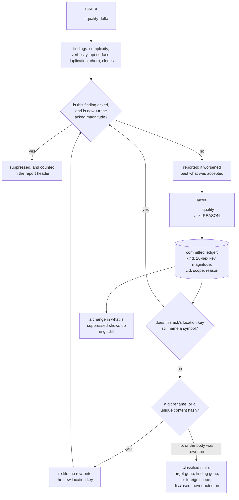

## 1. Executive Summary

ripwire is a code-context engine for coding agents — Apache-2.0, 1,917 commits
between 31 July and 8 September 2026, 156,391 lines of C++23 across 156 files
under `src/`, with 559 gate scripts named by its own regression runner and all
559 resolving to a file. Ten commit identities appear, of which one accounts for
1,895 of them. The screen found two auto-run surfaces — an MCP manifest and a
hooks directory — and four unpinned surfaces; nothing was installed or run, and
the read was made from a full clone.

**Most of the tool is out of this atlas's scope, and two files in it are
squarely in.** The call graph, the ranking and the lenses are a code index, and
a code index is a projection of source that cannot turn out to be false. What
this report is about is the pair of committed sidecars beside them:
`.ripwire_quality_acks`, 955 rows recording findings a person or an agent
deliberately accepted, and `.ripwire_notes`, a field-notes file whose entries are
surfaced beside the symbol they name. Both hold judgements that can be wrong,
both survive every session, and both can be corrected.

**The ack ledger is a ratchet, and that is the idea worth carrying.** A row is
`ack <kind> <16-hex key> <magnitude> [cid=…] [by=…] <reason>`, and the whole
mechanism is one comparison (`src/quality.h:4899-4903`):

```cpp
const auto it = acks.find( ackMapKey( ackKindToken( r ), r.key ) );
return ( it != acks.end() && r.now <= it->second.ackNow ) ? &it->second : nullptr;
```

An ack accepts a finding **at the size it was accepted at**. The moment the
finding worsens past that magnitude it reappears, which the source states as the
contract — *"an ack accepts a finding AT its acked size, never a blank check"*
(`src/quality.h:3940`). Suppression is disclosed rather than silent: the report
header carries an `acked` count. And the contract has been defended against its
own degenerate case: a finding whose magnitude is zero would make the test
`0 <= 0` and suppress forever, *"a permanent blank check, which the ack contract
explicitly promises never to be"* (`src/quality.h:3694-3696`), so the kind token
is qualified by origin to keep that from happening.

**Two marks.** `human_review` on a ledger the project keeps committed precisely
so that a change in what is suppressed shows up in a diff, beside a `--notes`
listing that flags a note whose target no longer resolves so a person can prune
it. `negative_eval` on a case that writes a note against a target that does not
exist and asserts its text appears in neither the task-scoped retrieval nor the
default map, with the positive control in the same script.

**Why `tombstone` is withheld, and it is the most interesting call in this
report.** Everything about the ack ledger looks like the mark: durable,
committed, consulted before the tool speaks again, with a magnitude floor that
stops it being a blanket. Three things decide against it. The key is a location
— `fnv1a64(relative path \0 scope \0 symbol name)` (`src/quality.h:565-573`) —
so it identifies *where* a finding was, not *what* was rejected. What the row
records is an **accepted** finding rather than a rejected value; it suppresses a
warning about code that stays. And it is consulted when a report is rendered
rather than when anything is written, so nothing prevents the same code being
written again. The near-miss is written up in section 9 because the one part of
the mechanism that *is* value-keyed — the `cid` content hash — is used with an
unusual precision the mark's own definition is about.

**Four findings sit against the design.** The location key does not survive a
move, and the project measured that against its own history rather than
asserting it. The comment reports that `git mv` destroys them, and that across
fifty-nine canonical ids, the same number of path-qualified keys and four clone
groups, not one survived (`src/quality.h:4694-4700`). A
stale ack is classified into three reasons and never acted on. The notes store
has none of the ack side's protections — no rescue route, no write lock — and
its single committed row is out of date, with nothing in the format able to say
so. And the MCP verb advertised as *"most relevant memory notes / docs for a
task"* (`src/mcp.h:62`) does not read the notes store at all.

## 2. Mental Model

A memory here is **a judgement about a place in the code**, and there are two
kinds.

An **ack** says *this finding is acceptable, at this size, for this reason*. It
is written when a person or an agent has looked at a warning and decided to keep
the code. It is not an exemption: it is a floor, and crossing the floor brings
the warning back.

A **note** says *here is what someone learned about this thing*. It attaches to
a canonical id or a path, and it rides along whenever the tool next describes
that symbol or file to an agent, so the knowledge arrives at the moment it is
relevant rather than when someone thinks to look for it.

Neither has a status, a confidence or a validity window. Both are corrected by
being rewritten, and both are forgotten by being deleted from a file a person
edits.

The identity question is the whole design problem, and the project treats it as
one. A judgement about a symbol has to survive the symbol being renamed or moved,
and must *not* survive the symbol being rewritten — because the thing that was
judged is gone. The ack side has two rescue routes and a published measurement
of how well they work. The notes side has neither.



## 3. Architecture

A single compiled binary, header-heavy: 148 headers and six translation units.
The largest are `src/serialize.h` (7,479 lines), `src/quality.h` (6,078),
`src/graph.h` (5,787), `src/mcpverbs.h` (4,824), `src/cli.h` (4,548) and
`src/main.cpp` (4,062). Everything this report is about lives in
`src/quality.h` and `src/notes.h`, with the verbs in `src/verbs_quality.h` and
the surfacing in `src/serialize.h`.

Around them: `test/` holds 1,347 files including 610 shell gates and per-language
fixture corpora; `bench/` holds harnesses, locked datasets and committed results;
`third_party/` vendors the container and parser libraries; `docs/` holds a
12,678-line evaluation document and a lineage table; `skills/` holds the agent
skills that tell a model when to ack.

### Deployment and ergonomics

- **What has to run:** the binary. Runtime dependencies are none by design.
- **Fully local and offline:** yes, entirely.
- **Hand-repairable:** both stores are sorted text a person can edit, and both
  are committed, so a bad row is a revert away.
- **Install:** a script, a release binary, or a source build.

## 4. Essential Implementation Paths

- **Key a finding.** `pathQualifiedKey` (`src/quality.h:565-573`) hashes the
  root-relative path, the scope and the name with a null byte between each;
  `qualityKey` (`:654-658`) is the symbol-level caller. The two clone kinds key
  on a member-set hash instead.
- **Compute the content id.** `scrubbedBody` and `scrubbedBodyHash` (`src/quality.h:828-898`)
  hashes the body after collapsing whitespace, replacing the symbol's own name
  with a sentinel and dropping ack comment lines. Built corpus-wide with a
  count per id, so a body shared by two symbols refuses to resolve.
- **Heal an identity.** `remapAckIdentity` (`src/quality.h:4677-4755`) runs
  before the ratchet and re-files a row only when its own key resolves to
  nothing, it carries a content id, and that id is unique — preferring a
  git-recorded rename over a content match. The comment states the boundary:
  *"Identity that follows a rename must not become identity that follows a
  rewrite; that is the blank check the ack contract forbids"* (`:4673-4675`).
- **Apply the ratchet.** `findSuppressingAck` (`:4899-4903`) and
  `applyAckRatchet` (`:4907-4918`).
- **Write an ack.** `--quality-ack[=REASON]` (`src/cli.h:2667`, `:4506`) implies
  the delta, refuses reason-less spellings unless the delta is also requested,
  and is gated by `refuseForeignAckSelection` (`src/verbs_quality.h:401-441`)
  against an `--ack-only` that names rows outside the scope under review. The
  row is built at `:1141-1144` and published at `:1157` through an atomic write
  under a cross-process lock.
- **Add a note.** `resolveNoteAddTarget` (`src/main.cpp:606-670`) resolves the
  selector through the same resolver the read verbs use: unique stores the
  canonical id, ambiguous refuses and names every candidate, and a path that
  resolves to nothing stores with a loud dangling warning.
- **Surface a note.** `fileNoteTarget` and `symbolNoteTarget`
  (`src/serialize.h:503-511`) spell the two lookup keys once;
  `renderNoteChildren` (`:471-489`) attaches them, reached from the task map,
  the default map, the expansion, the edit check and three MCP verbs.
- **List notes for pruning.** `--notes` (`src/main.cpp:798-860`) recomputes the
  live target set and emits per-target rows with a dangling flag.

## 5. Memory Data Model

An **ack row**: a kind token, the 16-hex key, the accepted magnitude, an
optional `cid`, an optional `by` scope and a reason to end of line. Of the 955
committed rows, 629 carry a content id and 180 carry a scope, all of the latter
with the same value. The kind distribution is led by short-horizon churn (297),
new-symbol api-surface (141) and api-surface (124). Magnitudes run from 0 — 142
rows — to 1,731.

A **note**: a target, a date taken from git's committer clock, the text, and
optionally the HEAD sha and branch. One row is committed.

**Temporal:** one time on a note, none on an ack, and the absence is deliberate:
*"Deliberately NOT pinned to a HEAD sha: an acked finding … stays accepted
across commits"* (`src/quality.h:3941-3943`). `bitemporal` withheld.

**Trust:** none applied. `StaleAckWhy` (`src/quality.h:4936-4941`) is a real
three-value classification — the target is gone, the finding is gone, or the row
was filed from a foreign scope — and it is emitted as disclosure rows and never
read by the suppression test. `trust_state` withheld.

**Scoping:** the `by` field is written and read only to build a disclosure row.
`scope_enforced` withheld.

**Tombstone:** withheld — see section 9.

## 6. Retrieval Mechanics

Notes are retrieved by **exact string match** on a root-relative path or a
canonical `path::scope::name`, through a map built once per run. There is no
ranking, no fuzzy match and no fallback, which is the right choice for a store
whose whole value is arriving beside the right symbol — and it is also the reason
a rename silences a note without any error.

Acks are not retrieved at all in the ordinary sense. They are a filter applied
when the quality delta is rendered, and the number suppressed is disclosed.

**Failure modes.** A note whose target moves becomes inert: the lookup misses,
nothing surfaces, and only the `--notes` listing reveals it. An ack whose symbol
moves is rescued if a rename is recorded in git or its body is unchanged and
unique, and is otherwise classified stale and left in place. And because the
rescue routes were added after most of the ledger was written, the source is
explicit that they *"can never rescue the 443 rows already committed here, and
the report says so"* (`src/quality.h:4668-4669`).

## 7. Write Mechanics

Both stores are written by command-line verbs only — no MCP verb writes either —
and both are sorted on every write so that two branches merge cleanly.

The ack writer is careful in ways worth naming. It publishes atomically under a
cross-process lock, added after a measured torn-write incident. It root-qualifies
the file name rather than trusting the working directory, after an observed case
where acking one root rewrote another root's committed ledger. And it refuses an
`--ack-only` selection that names rows outside the scope under review, which is
the rubber-stamp guard.

Two things it does not do. A reason is not required — a bare `--quality-ack`
alongside the delta is accepted and renders the literal string
`(no reason given)`, though no committed row carries it. And the reason chain is
capped at one hop, so a row acked three times keeps the newest reason and the one
before it, *"without turning the ledger into an append-only reason log"*
(`src/quality.h:3988`).

The note writer has none of this: a plain truncating stream with no lock, in a
file whose header cites the ack precedent for its sorted format.

### Operational cost

- Reading both sidecars is two file reads per run.
- The identity heal is a pre-pass over the ledger against the live symbol table.
- Nothing runs in the background and nothing calls a model.

## 8. Agent Integration

Thirty-one MCP verbs, all read-only with respect to these two stores. Notes ride
along with the symbol descriptions the agent already asked for, which is the
integration decision that matters: the agent does not have to know the memory
exists to receive it.

The agent skills close the loop on the ack side, telling a model to
*"record a trade-off instead of re-reading it forever"* with a worked command.
That is the mechanism working as designed, and it is also why the review
qualification in section 9 matters: the same verb a person uses deliberately is
one an agent is instructed to use unattended.

## 9. Reliability, Safety, and Trust

**Human review — awarded, with both halves qualified.** The adjudication is
`--quality-ack`: a finding is looked at and accepted at a magnitude with a
reason, and the verdict is committed to a file the project keeps in version
control for exactly this reason — *"the ack file is committed precisely so a
change in what is suppressed is reviewable"* (`src/quality.h:4033`). The
inspection is `--notes`, which recomputes the live target set so a person can see
what has gone dangling, described in the source as *"listed here so the human can
prune it"* (`src/main.cpp:686`). What is missing on both sides is an action:
pruning a note and retiring a stale ack are manual file edits, and the source
records what that costs — *"A past round hand-retired 109 such dead rows out of
this repo's own committed acks file — a whole session of manual audit for a
question the tool could answer in one pass"* (`src/quality.h:4925-4927`). No CI
job reads either sidecar.

**Negative evaluation — awarded.** The notes case is the strongest shape this
mark takes: a note is written against a target that does not exist, the listing
is asserted to show it as dangling and to show a live target as not dangling, and
then its text is asserted absent from both a task-scoped retrieval and the
default map. Two populated emissions, one must-not, and the positive control in
the same script. The identity case adds the anti-blank-check assertion: a body
that was moved *and rewritten* must not be content-matched onto its old ack.

**Tombstone — withheld, and the near-miss is precise enough to be worth more
than the mark.** The ledger is durable, committed, consulted before the tool
reports again, and ratcheted so it cannot become a blanket exemption. Three
things decide against it. The lookup key is a location rather than the rejected
content. The row records a finding that was *accepted* — the code stays, the
warning goes — rather than a value that was refused. And the consultation happens
when a report is rendered, not when anything is written, so nothing stops the
same code being written again. What the mechanism does have is the distinction
the mark's definition is really about: `cid` is a hash of the symbol's body with whitespace collapsed and
its own name replaced, and it is used to re-file an ack across a rename and
deliberately refuses to match a rewritten body. The project states the rule in
one sentence — *"Identity that follows a rename must not become identity that
follows a rewrite"* — and defends it with a committed test. That is a considered answer to a
question about identity that this design had to face and most stores do not.

**Trust state — withheld.** The three stale reasons are computed and disclosed
and never consulted; a stale ack keeps suppressing. Notes carry no status field
at all, and the dangling flag is derived at listing time rather than stored,
filtering nothing — a dangling note is invisible because its key misses, not
because a state excludes it.

**Scope — withheld.** The `by` field is recorded and read in three places, all
of them building disclosure rows. The suppression test never consults it, so an
ack filed from one scope suppresses findings anywhere.

**Audit log — withheld.** Both stores are read-modify-rewrite rather than
append-only, and the reason chain is capped at one hop by an explicit decision
against a reason log. The record of what changed is git's, which the rubric
excludes by name.

**The measurement the project made against itself.** Rather than asserting that
its identity keys are durable, ripwire measured them across its own history and
published the result: across fifty-nine canonical ids, the same number of
path-qualified keys and four clone groups, not one survived a `git mv`. That
number is the argument for the content-hash rescue route, and it is in a comment
above the code that implements it. Reporting the survival rate of your own
identity scheme, in the negative, is the thing to copy here.

**One live memory that is wrong.** The single committed field note, dated
23 August, says a claim in the README is not enforced and names what would close
it. The gate was widened on 6 September and the README now passes; the note's
target still resolves, so it is not dangling, and nothing marks it superseded.
The one row in the notes store is out of date, which is precisely the class of
failure the ack side built its stale classification to catch.

**And the verb named for memory does not read it.** `src/mcp.h:62` advertises
`memory_recall` as returning *"most relevant memory notes / docs for a task, full
text"*. `src/recall.h` is a lexical search over markdown documents and contains
zero references to the notes store, its index or its namespace, against 179
occurrences of `doc`. An agent taking the tool list at face value would never
reach the field notes; they arrive only as riders on other verbs.

## 10. Tests, Evals, and Benchmarks

559 gate scripts are named by the regression runner and all 559 resolve to a
file, alongside 169 C++ harnesses and per-language fixture corpora, in a test
tree of 1,347 files.

`docs/EVALS.md` is 12,678 lines and opens with a provenance rule: every number
names the instrument that produced it, the corpus it ran on and the file that
pins it. The localization and retrieval benchmarks ship with locked datasets, an
instance file, label files and committed results, so those numbers are
re-derivable given a build; the head-to-head arms depend on external tools that
are not vendored, so those are attested by committed reports rather than
re-runnable here. Nothing was run for this review.

The section worth naming is the one listing what the project does *not* claim: a
benchmark evaluator that has never executed with every pilot record left null, a
design whose minimum detectable effect is stated so that *"a null result from
this design would not be evidence of no effect"*, a token-cost figure removed for
having no in-tree citation, and an improvement figure disavowed as belonging to a
rejected candidate's baseline. Publishing the claims you have withdrawn, with the
reasons, is the counterweight to a README this long.

**One README count is off by one against the project's own data.** The README
says seventeen of the folded papers are from 2026, and the gate that checks it
counts arXiv identifier stems beginning with 26. The repository's own dates file
warns against exactly that — the identifier stem does not track publication date,
and it records one paper whose stem is 2602 and whose date is December 2025. By
published date the figure is sixteen. The same gate uses dates, correctly, for
the two-month and thirty-day counts beside it.

## 11. For Your Own Build

### Steal

- **Ratchet an acceptance instead of suppressing it.** Recording the magnitude a
  finding was accepted at, and re-reporting it the moment it worsens, is the
  difference between a decision and an exemption — and it is one comparison.
- **Guard the degenerate case.** A finding with no magnitude makes the ratchet
  test trivially true and turns the whole record into a blank check; noticing
  that before shipping is the kind of thing that separates a mechanism from an
  intention.
- **Separate identity that follows a rename from identity that follows a
  rewrite.** A content hash that re-files a judgement when the code moved, and
  refuses when the code changed, is the exact distinction a durable judgement
  about code needs.
- **Measure your identity scheme's survival and publish the number.** A measured
  survival rate of none is a better argument for building a rescue route than any
  amount of reasoning about it.
- **Disclose what you suppressed.** A count in the report header means a reader
  can tell a clean run from a quiet one.
- **Root-qualify a sidecar's path.** A bare relative filename reads and writes
  the working directory's copy, and the observed failure was acking one
  repository and rewriting another's committed ledger.

### Avoid

- **Classifying staleness and never acting on it.** Three reasons are computed,
  emitted and ignored; the retirement they imply was done by hand, once, for 109
  rows.
- **Giving one store the protections and not the other.** The acks publish
  atomically under a lock and have two rescue routes; the notes truncate without
  a lock and have none, in a file whose header cites the ack precedent.
- **A memory that cannot be told it is wrong.** The single field note is stale
  and there is no status, no expiry and no supersession to record that.
- **Advertising a verb as memory recall when it reads a different store.**

### Fit

Right if you want a code-quality gate whose accepted debt is a reviewable
artifact rather than a suppression comment, and if the ratchet's discipline —
accept a number, not a warning — is what you want from it. The ack mechanism is
worth reading whatever you are building. Wrong as a general memory: retrieval is
exact-match on a path, there is no status, no validity and no scope, and the
notes half is one row with none of the ack half's care.

## 12. Open Questions

- Will a stale ack ever be retired automatically? The classification exists, the
  reasons are named, and the source records what doing it by hand cost.
- Will the notes store get the ack side's identity healing? The same rename
  problem applies and the notes have no rescue at all.
- Should the ledger key on content rather than location? The content hash is
  computed already, and the argument against is that a rewritten body is a
  different finding — which is the same argument that makes the current key
  fragile under a move.
- Will `memory_recall` read `.ripwire_notes`? The name says it does.

## Appendix: File Index

| Path | Lines | What it holds |
| --- | --- | --- |
| `src/quality.h` | 6,078 | `pathQualifiedKey` (565), the content hash (828-898), the ack record and map key (3945-3969), the ratchet contract (3934-3941), the zero-magnitude guard (3694-3696), the reader (4193-4251), the write lock (4255-4345), the writer (4351-4391), `remapAckIdentity` (4677-4755), the survival measurement (4694-4700), `findSuppressingAck` (4899-4903), `StaleAckWhy` (4936-4941) |
| `src/verbs_quality.h` | — | The delta basis and both ack reads (191, 251), the rubber-stamp guard (401-441), the row build and write (1141-1157) |
| `src/notes.h` | — | The note record (67-74), the path (107-116), the reader (305-354), the writer (374-388, the truncating stream at 379), `addNote` (394-416), the index (424-458) |
| `src/serialize.h` | 7,479 | `renderNoteChildren` (471-489) and the two lookup keys (503-511) |
| `src/main.cpp` | 4,062 | `resolveNoteAddTarget` (606-670), the note write (786), the `--notes` listing (798-860) |
| `src/mcp.h`, `src/mcpverbs.h` | —, 4,824 | Thirty-one verbs; the `memory_recall` description (mcp.h:62) and the read-only ack access (mcpverbs.h:3138) |
| `src/recall.h` | — | Lexical search over markdown documents; no reference to the notes store |
| `.ripwire_quality_acks` | 955 rows | The committed ledger; 629 rows carry a content id, 180 a scope |
| `.ripwire_notes` | 1 row | The committed field notes |
| `test/notescheck.sh`, `test/identitycheck.sh` | — | The dangling-note exclusion (149-159) and the rename and rewrite arms (111-125, 195-199) |
| `docs/EVALS.md`, `docs/LINEAGE.md` | 12,678, 348 | The evaluation record with its withdrawn-claims section, and the lineage table |
| `test/` | 1,347 files | 559 named gates, 169 C++ harnesses, fixture corpora |

**Searches recorded for the negative claims**

```sh
rg -niE 'valid_from|valid_to|validity time|transaction_time|as_of|bitemporal' src/   # 0; control: 17 hits for 'date' in notes.h
rg -niE 'append-only|audit_log|event log' src/                                       # 2, both prose declining the pattern
rg -nE 'confidence|trust|verified|status|revoked|retracted' src/notes.h              # 0; control: the five field declarations at 69-73
rg -n '\.by\b|->by\b|second\.by' src/                                                # 10, none in a suppression decision; control: 25 reads of ackNow
rg -c 'NoteIndex|ripwire_notes|notes::' src/recall.h                                 # 0; control: 179 hits for 'doc'
rg -niE 'cid|remap|alias|rename|heal' src/notes.h                                    # 7, none identity healing; the ack side has remapAckIdentity
rg -n 'acks.erase' src/quality.h                                                     # 2, both inside the re-key move, never a retirement
rg -n 'writeAckRecords|addNote\(' src/                                               # writes only from CLI paths; no MCP verb writes either store
```

## History

**2026-09-08** — [`8c20e10856d347206ccbd52fd1b83d90c5cbb5e3`](https://github.com/redhat-et/ripwire/commit/8c20e10856d347206ccbd52fd1b83d90c5cbb5e3) — first reading, at the head of `main`, on a commit from the same day. Screened before anything was read: two auto-run surfaces (an MCP manifest and a hooks directory), four unpinned surfaces, no build-time execution; nothing was installed or run, and the read was made from a full clone. The scope decision is recorded here because it shapes the report: the call graph and the lenses are a code index, which is a projection of source and cannot turn out to be false, so the subject is the two committed sidecars beside them — the ack ledger and the field notes — and the engine is context. Two marks. `human_review` rests on a ledger kept committed so that a change in what is suppressed appears in a diff, plus a listing built for pruning, with both qualifications stated: no action exists in the tool and no CI job reads either file. `negative_eval` rests on a dangling note asserted absent from two populated emissions with a control in the same script. `tombstone` was examined at length and withheld — the key is a location, the row records an accepted finding rather than a rejected value, and the consultation is on a read — with the near-miss written up because the content-hash rescue draws the rename-versus-rewrite distinction the mark's definition is about. `trust_state`, `scope_enforced`, `bitemporal` and `audit_log` were each examined and withheld on the read path rather than on the schema. Four claims were verified against the tree rather than repeated: the survival measurement, the off-by-one in the README's 2026 paper count against the project's own dates file, the staleness of the single committed note, and the MCP recall verb's failure to read the notes store.
