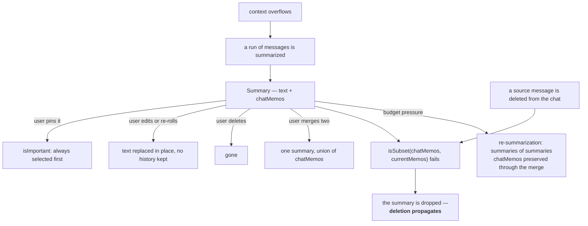
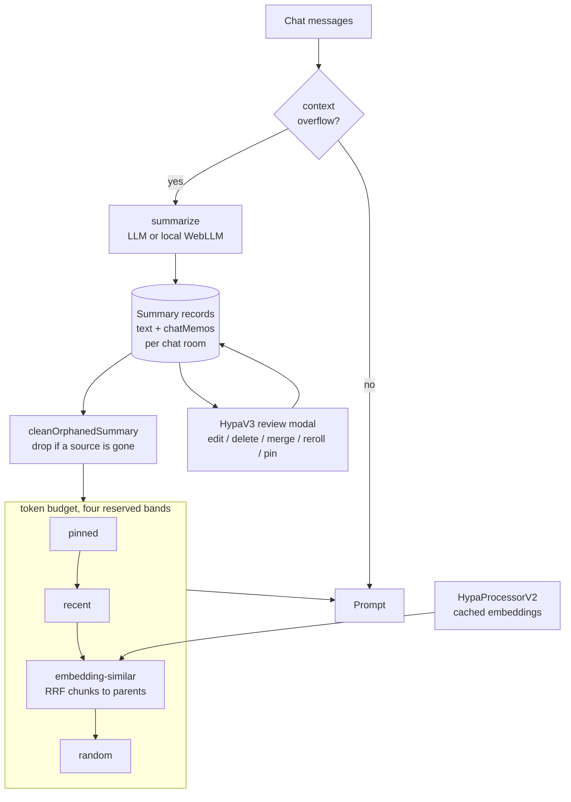

## 1. Executive Summary

RisuAI is a roleplay chat client, GPL-3.0, and it is in this atlas for a reason
none of the other entries offers: **its team has replaced its own memory system
twice, and all three generations are still in the tree.** SupaMemory arrived on
2023-06-29, HypaV2 on 2024-05-23, HypaV3 on 2025-01-12, and the repository at
this commit ships every one of them as a user-selectable mode. That makes the
directory a rare, honest record of what a team learned by living with its own
design — the kind of evidence usually lost when a rewrite deletes what came
before.

The lesson is legible in the diff between generations, and it is a lesson this
atlas keeps asking for:

- **SupaMemory (2023)** is chained lossy summarization in its purest form. When
  the accumulated summary reaches four paragraphs it summarizes *the summary*
  (`supaMemory.ts:361-370`), then keeps doing that for as long as the chat runs.
  Nothing links a summary to the messages it came from.
- **HypaV2 (2024)** introduces `chatMemos: Set<string>` — **the ids of the
  messages a summary was derived from** (`hypav2.ts:20`) — and
  `cleanInvalidChunks`, which discards any summary whose sources are no longer
  all present (`:275-283`).
- **HypaV3 (2025)** keeps that, adds a review surface where a person can edit,
  delete, merge, re-roll and pin any summary, and splits the memory token budget
  into four explicitly reserved bands: pinned, recent, embedding-similar, and
  **random**.

The middle change is the important one. A summary in HypaV2 and HypaV3 knows
which messages it came from, and **deleting a message destroys every summary
derived from it**. That is deletion propagating into derived artifacts — the gap
this atlas records as unimplemented and untested nearly everywhere else — shipped
in a roleplay client in 2024.

What is missing is equally clear. Three generations of summarizer, in a
repository with roughly thirty test files covering the ChatML parser, the
scripting language, storage and networking, and **not one test touches memory**.
The team learned these lessons in production, twice, and encoded none of them as
a regression test.

## 2. Mental Model

A memory is a **summary of a contiguous run of chat messages**:

```ts
interface Summary {
    text: string;
    chatMemos: Set<string>;   // which messages this was derived from
    isImportant: boolean;     // a user pin
    categoryId?: string;
    tags?: string[];
}
```

The state machine is short, and the interesting transitions are the ones that
kill a memory:



Memory is **hybrid**: an LLM writes it, the token budget decides when, and a
person can overrule any of it through the review modal. Nothing is treated as
verified — `isImportant` records that a *user cared*, not that anything is true.

The one state the model has no word for is *wrong*. An incorrect summary can be
edited or deleted, and nothing records that it was ever asserted.

## 3. Architecture

TypeScript and Svelte, GPL-3.0, running as a web app and a Tauri desktop build.
It is a client: there is no server, no database process and no worker queue.
Everything below runs in the user's browser.



**Six files, three eras.** `hypamemory.ts` (2023-06-29) is `HypaProcesser`, the
original in-memory vector store, still used by SupaMemory and by
`hanuraiMemory.ts` (2024-04-23), a separate mode that embeds the chat log itself
rather than summaries. `hypamemoryv2.ts` (2025-05-10) is `HypaProcessorV2`, a
rewritten embedding layer with a content-and-model-keyed cache, chunk-size
selection per model, sequential execution for local models and parallel for API
ones. `taskRateLimiter.ts` arrived the same day.
`contextualEmbedding.ts` (2026-04-03) is the newest addition.

### Deployment and ergonomics

- **What has to be running:** nothing but the client. Storage is the app's own
  local database.
- **Local and offline: yes, fully.** Summarization can run through WebLLM in the
  browser (`chatCompletion(..., settings.summarizationModel)`), and embeddings
  through a local MiniLM on WebGPU or WASM (`hypamemoryv2.ts:421-422`). No API
  key is required to store anything.
- **Hand-repairable: better than that.** The HypaV3 modal is a purpose-built
  editor for the memory store, which is the strongest answer to this question in
  the atlas — most systems answer it with "the rows are in SQLite".

## 4. Essential Implementation Paths

**Generation 1 — SupaMemory** (`src/ts/process/memory/supaMemory.ts`, 431 lines).
`supaMemory()` at `:12` is called on overflow. The compression loop is
`:286-376`: chunk the oldest messages up to `maxChunkSize`, summarize the chunk,
append to the running summary — and at `:360-370`, once the summary has four
paragraphs, **summarize the summary**. `:311` shrinks the chunk size by 30% and
retries when a pass fails to free enough. The `asHyper` path (`:141-170`) embeds
the discarded chunks and re-injects the top three as `"past events: "`.

**Generation 2 — HypaV2** (`hypav2.ts`, 668 lines). `HypaV2Data.mainChunks[]`
carries `chatMemos: Set<string>` — *"UUIDs of summarized chats"* (`:20`).
`isSubset` at `:158`, `cleanInvalidChunks` at `:275` filtering on
`isSubset(mainChunk.chatMemos, currentChatMemos)` at `:283`. `OldHypaV2Data`
(`:147`) and `convertOldToNewHypaV2Data` (`:188`) migrate stores written before
provenance existed, reconstructing `chatMemos` by walking the chat (`:223-257`) —
a best-effort backfill of a field that was never recorded.

**Generation 3 — HypaV3** (`hypav3.ts`, 2,042 lines). `hypaMemoryV3()` at `:118`
dispatches to `hypaMemoryV3Main` (`:955`) or, behind
`settings.useExperimentalImpl`, to `hypaMemoryV3MainExp` (`:176`) — the two are
near-duplicates, which is where most of the file's length comes from.

- Validation at `:188` rejects `recentMemoryRatio + similarMemoryRatio > 1`.
- `cleanOrphanedSummary` (`:1646`) runs unless `preserveOrphanedMemory` (`:207`).
- Selection at `:501-855`: pinned summaries first (`:509`), then
  `availableMemoryTokens * recentMemoryRatio` (`:541`), then
  `* similarMemoryRatio` (`:589`), then the remainder as random (`:807-855`),
  with unused recent and similar tokens rolled into the random reservation
  (`:820`).
- Ranking: `simpleCC` (`:1832`), `simpleRRF` (`:1854`), `childToParentRRF`
  (`:1874`) fusing chunk-level hits up to their parent summary, and
  `normalizeScores` (`:1895`).
- `summarize()` at `:1681` takes an `isResummarize` flag selecting a different
  prompt, strips `<Thoughts>` and `<think>` blocks, and throws on an empty
  result rather than storing one.
- Selection provenance is written back as `metrics` (`:57-62`):
  `lastImportantSummaries`, `lastRecentSummaries`, `lastSimilarSummaries`,
  `lastRandomSummaries`.

**Review surface.** `src/lib/Others/HypaV3Modal.svelte` and
`HypaV3Modal/modal-summary-item.svelte`: pin (`:143`), re-roll accepted into
place (`:274` — `summary.text = rerolled`), delete-from-here (`:233`), bulk merge
(`HypaV3Modal.svelte:276`), bulk pin (`:405`), bulk re-summarize with a result
preview (`bulk-resummary-result.svelte`), plus category and tag managers.

**Tests.** None for any of the above. See section 10.

## 5. Memory Data Model

`Summary` is quoted in section 2. The field that matters is `chatMemos`, and it
is worth being precise about what it buys:

- It is **provenance in the only form that is checkable** — not a model name or a
  timestamp, but the identity of the source rows.
- It makes **deletion propagate**. `isSubset` requires *every* source to still
  exist, so removing one message in a summarized run destroys the whole summary
  rather than leaving a summary that half-describes deleted content. That is the
  conservative direction, and it is the right one.
- It makes **merges honest**: merging two summaries unions their `chatMemos`, so
  the merged artifact inherits both dependencies and dies if either does.

Against that: no created-at, no model, no version, no history. `summary.text =
rerolled` overwrites in place. There is no supersession chain and no tombstone —
a summary the user deleted for being wrong can be regenerated from the same
messages on the next overflow, with nothing recording the rejection.

`isImportant` is a pin, not an epistemic state. `categoryId` and `tags` are
organisation. **`trust_state` is withheld**: no field distinguishes asserted from
verified from disputed.

**Scoping** is per chat room and character. There is no user, tenant or agent
key, because the deployment is one person's client. `scope_enforced` is withheld
on that basis.

## 6. Retrieval Mechanics

The budget is `maxContextTokens * memoryTokensRatio`, split into four **reserved**
bands rather than one ranked list — and the fourth is the unusual one.

**Pinned** summaries are taken first and unconditionally, subject only to a
single summary not exceeding the whole budget (`:513-517`).

**Recent** takes `recentMemoryRatio` of what is left, newest first.

**Similar** takes `similarMemoryRatio` through embeddings, and this is where the
engineering is. Summaries are split into chunks by a user-configurable separator
(`splitBySeparator`, `:105`, falling back to `\n\n` on a bad regex), chunks are
embedded and searched, and `childToParentRRF` (`:1874`) fuses chunk-level
rankings up to the parent summary — so a long summary is not penalised for
diluting its own embedding, and a single strongly-matching passage can surface
the whole thing. `enableSimilarityCorrection` (`:1371`) issues several queries
from the last few messages and fuses them with `simpleRRF`.

**Random** gets the remainder — `1 - recentMemoryRatio - similarMemoryRatio` —
and fills it by shuffling (`.sort(() => Math.random() - 0.5)`, `:835`). Unused
recent and similar tokens are added to this reservation (`:820`) rather than
returned.

That random band is a deliberate design choice and I have not seen it elsewhere
in this atlas. Recency and similarity together have a failure mode everyone who
has run a long chat recognises: the middle of the history becomes unreachable,
because it is neither recent nor topically close to the current turn. Reserving
budget for a random draw from the whole store means old material keeps
resurfacing at some rate, which is the cheapest possible answer to that problem
and costs one shuffle. It is also non-deterministic by construction — the same
turn produces different context twice — which is a real cost on any turn where
reproducibility matters, and roleplay is a domain where it mostly does not.

The `metrics` object records which summaries each band selected on the last turn,
and the modal surfaces it. **Storing why each item was retrieved, where the user
can see it, is rarer in this atlas than it should be** — though it is
last-turn-only and overwritten, so it explains rather than audits.

Failure modes: a summary is only as good as the summarizer, and nothing measures
that; the random band guarantees some proportion of injected context is
irrelevant by design; and re-summarization compounds loss with no floor.

## 7. Write Mechanics

Writes happen **on the hot path, on overflow**. There is no background pass and
no queue. When the context exceeds its budget, the oldest messages are batched to
`maxChatsPerSummary`, summarized by an LLM, and replaced by the summary.

`summarize()` (`:1681`) refuses to store an empty result — it throws on an empty
response and again after stripping reasoning blocks, so a model that returns only
`<think>` does not silently write a blank memory. That is a small check and most
systems in this atlas do not make it.

**Re-summarization** is the compounding-loss path, and all three generations have
it. SupaMemory does it automatically at four paragraphs
(`supaMemory.ts:361-370`). HypaV3 separates the prompt (`reSummarizationPrompt`,
defaulting to *"Re-summarize this summaries."*) and exposes it as a bulk action a
person triggers deliberately, with a preview of the result before it is accepted.
Moving an automatic lossy rewrite behind an explicit, previewed user action is the
clearest single improvement between generation one and generation three.

**Deletion** is the strong part, covered in section 5: derived summaries die with
their sources. `preserveOrphanedMemory` turns that off, which is a setting whose
default matters — off by default means the safe behaviour is the default.

**No deduplication, no conflict handling.** Two summaries can assert opposite
things and both be selected; the model resolves it, or does not.

### Operational cost

- **The write path is synchronous and blocking.** The user waits on a
  summarization call at the moment the context overflows — the worst possible
  moment, mid-conversation.
- **The lag to retrievability is zero**; the summary is in the store before the
  turn completes.
- **No background pass re-reads the store.** Re-summarization is user-triggered
  in HypaV3 and budget-triggered in SupaMemory.
- **Embeddings are cached** by content and model (`hypamemoryv2.ts:152,
  :374-383`), so re-embedding an unchanged summary is free, and
  `taskRateLimiter.ts` plus `summarizationRequestsPerMinute` /
  `embeddingRequestsPerMinute` bound the burst.
- **On the read path** the injection is one `Past Events Summary` block at a
  fixed position, bounded by `memoryTokensRatio` — but its contents change every
  turn, including randomly, so it invalidates any prompt-prefix cache behind it.

## 8. Agent Integration

There is no agent API and no tool interface. RisuAI is the client, the model
never calls anything to retrieve, and the selected summaries arrive as one
system block wrapped in a `Past Events Summary` tag. The model has no agency over
memory whatsoever — it writes summaries when told to and never decides what to
keep.

The transferable part is not an API but a data shape: a summary carrying the set
of source ids it was derived from is trivially portable, and would work in any
system that has stable message identity.

## 9. Reliability, Safety, and Trust

**Provenance exists and is the good kind.** `chatMemos` is not a claim about
where a memory came from, it is a set of ids that can be checked against the
store — and the code does check, every turn.

**No trust model.** No confidence, no verification, no dispute. `isImportant` is
attention, not belief.

**Human review is the real safety mechanism**, and it is unusually complete: a
person can read every summary the system wrote, edit its text, re-roll it and
accept or reject the result, delete one or delete from a point onward, merge
several, pin them, and file them into categories. Most systems in this atlas that
hold `human_review` offer approval of a queue; this offers editing of the store.
It earns the mark.

**Prompt injection is unaddressed.** Chat content is summarized by an LLM and the
output is injected as a system message. Text in the conversation instructing the
summarizer will be obeyed, and nothing sanitises the result beyond stripping
reasoning tags and image inlays. In a client where character cards are downloaded
from strangers, that is a live path.

**Data loss:** local storage in a browser, with the app's own sync. **Deletion is
honest** — removing a message removes what was derived from it, which is more
than most systems here can say — but there is no record that anything was
removed, so `tombstone` and `audit_log` are both withheld.

**Uncertainty cannot be expressed.** A summary is prose that is either selected
or not.

## 10. Tests, Evals, and Benchmarks

The repository has roughly thirty test files. They cover the ChatML parser, the
CBS scripting language across five files, storage and remote-save cleanup, chat
paging, the source map, networking, the translator, TTS hooks, inlays, MCP
modules and request parameters. This is a team that writes tests.

**Not one of them touches memory.** Searching every test file for `hypa`,
`supaMemory` or `summar` returns two files, both unrelated — a translator preset
test and an OpenAI request test.

So: three generations of summarizer, a provenance invariant, an orphan-cleaning
rule, a four-band budget with a validation constraint, and an RRF fusion — none
of it tested, in a repository that tests its string parser thoroughly.

The tests that would matter are small and obvious, which is what makes the
absence notable:

- Delete a message, assert every summary whose `chatMemos` include it is gone.
- Merge two summaries, assert the result's `chatMemos` is the union.
- Set `recentMemoryRatio + similarMemoryRatio > 1`, assert it is rejected.
- Assert the selected set never exceeds `availableMemoryTokens`.
- Assert `summarize` throws rather than storing an empty summary.

Every one of those is a property the code already tries to enforce. `negative_eval`
is withheld: there is no test asserting that anything must *not* be retrieved,
which is the one the orphan rule most deserves.

No benchmarks, and none of the ones in [this atlas's survey](../../benchmarks/)
would fit — they score recall of extracted facts, and this system extracts
nothing.

## 11. For Your Own Build

### Steal

- **Store the source ids on every derived artifact.** `chatMemos: Set<string>` is
  one field, and it turns "delete this message" into "delete this message and
  everything computed from it" for free. Require the *whole* set to survive, as
  `isSubset` does — over-deleting a summary is a far better failure than a
  summary that describes rows the user removed.
- **Reserve retrieval budget in bands rather than ranking one list.** Pinned,
  recent, similar and random cannot starve each other, and the ratios are one
  knob each.
- **Reserve some budget for a random draw.** Recency plus similarity makes the
  middle of a long history unreachable; a random band is the cheapest fix and
  costs a shuffle.
- **Fuse chunk hits up to the parent.** `childToParentRRF` stops a long memory
  from being penalised for diluting its own embedding.
- **Put lossy rewrites behind a preview.** HypaV3's bulk re-summarize shows the
  result before it replaces anything; SupaMemory did the same operation silently,
  on a threshold. The preview is the whole difference.
- **Refuse to store an empty generation.** Throw rather than write a blank
  memory, and strip reasoning blocks before you measure emptiness.
- **Record which retrieval band selected each item, and show it.** The `metrics`
  object costs four arrays and makes the context explicable to the user.

### Avoid

- **Summarizing summaries on a threshold.** SupaMemory compounds loss with no
  floor and no record of what was compressed away, and the same team moved off it
  twice.
- **Editing memory in place with no history.** `summary.text = rerolled` makes a
  re-roll unrecoverable, and a deleted summary can be regenerated from the same
  messages with nothing recording it was rejected. Provenance without a rejection
  record only solves half the problem.
- **Shipping the new implementation beside the old one behind a flag.** HypaV3's
  two near-duplicate main functions are most of a 2,042-line file, and a fix to
  one is a fix to neither by default.
- **Blocking the user on summarization at the overflow boundary.** The moment the
  context fills is the worst moment to make someone wait for a model call.
- **Testing your parser and not your memory.** The invariants here are cheap to
  assert and were learned the expensive way.

### Fit

This is a client-side design for a single person's long-running conversations,
and within that scope it is well-judged: no server, local models throughout, a
bounded budget, and an editor for the store. If you are building something with
that shape — one user, one machine, a history longer than the context — the
selection design is worth copying wholesale.

If you need multiple principals, an audit trail, or a memory an agent can query,
this is not the shape. There is no scope key, no history, and no API.

The reason to read it anyway is the three-generation record. It is one of the few
places where you can see a team meet the chained-summarization problem, then the
deleted-source problem, then the unreachable-middle problem, and watch the data
model grow a field for each. That progression is the argument for `chatMemos`
better than any of this atlas's prose about it.

## 12. Open Questions

- **Why do `hypaMemoryV3Main` and `hypaMemoryV3MainExp` both exist?** They are
  near-duplicates behind `useExperimentalImpl`. Whether the experimental path is
  converging on replacing the other, or has diverged, needs the PR history.
- **What does `contextualEmbedding.ts` (added 2026-04-03) change** about how
  summaries are embedded? It is the newest piece and its role in the selection
  path was not traced.
- **What proportion of users are still on SupaMemory or HypaV2?** All three ship;
  which one most conversations actually run on decides whether the lessons above
  reached the users who needed them.
- **Does `preserveOrphanedMemory` get switched on in practice?** It disables the
  best property in the system, and its existence implies someone wanted it.
- **How does the random band interact with regenerating a reply?** A re-roll
  draws a different random set, so the same turn is answered from different
  memory — deliberate, or unnoticed?

## Appendix: File Index

**Generation 1 (2023-06-29)**

- `src/ts/process/memory/supaMemory.ts` — `supaMemory()` (12), hypa branch
  (141-170), summarize (185-283), compression loop (286-376), summary-of-summary
  (360-370)
- `src/ts/process/memory/hypamemory.ts` — `HypaProcesser` (38), `addText` (157),
  `similaritySearch` (198-210)

**Generation 2 (2024-05-23)**

- `src/ts/process/memory/hypav2.ts` — `HypaV2Data` with `chatMemos` (15-27),
  `isSubset` (158), old-format detection and migration (147-257),
  `cleanInvalidChunks` (275-283)
- `src/ts/process/memory/hanuraiMemory.ts` (2024-04-23) — separate mode embedding
  the chat log itself

**Generation 3 (2025-01-12)**

- `src/ts/process/memory/hypav3.ts` — settings (29-51), `Summary` (77-83),
  `splitBySeparator` (105), entry point (118), experimental main (176), main
  (955), selection bands (501-855), `cleanOrphanedSummary` (1646), `isSubset`
  (1663), `summarize` (1681), presets (1775-1830), fusion (1832-1917)
- `src/ts/process/memory/hypamemoryv2.ts` (2025-05-10) — `HypaProcessorV2` (30),
  embedding cache (152, 374-383), chunk sizing (206), local vs API execution
  (251, 288), WebGPU/WASM selection (421)
- `src/ts/process/memory/taskRateLimiter.ts` (2025-05-10)
- `src/ts/process/memory/contextualEmbedding.ts` (2026-04-03)

**Review surface**

- `src/lib/Others/HypaV3Modal.svelte` — merge (276), bulk pin (405)
- `src/lib/Others/HypaV3Modal/modal-summary-item.svelte` — pin (143),
  delete-from-here (233), accept re-roll (274)
- `src/lib/Others/HypaV3Modal/bulk-edit-actions.svelte`,
  `bulk-resummary-result.svelte`, `category-manager-modal.svelte`,
  `tag-manager-modal.svelte`

**Tests**

- None covering memory. ~30 test files elsewhere in `src/`.
