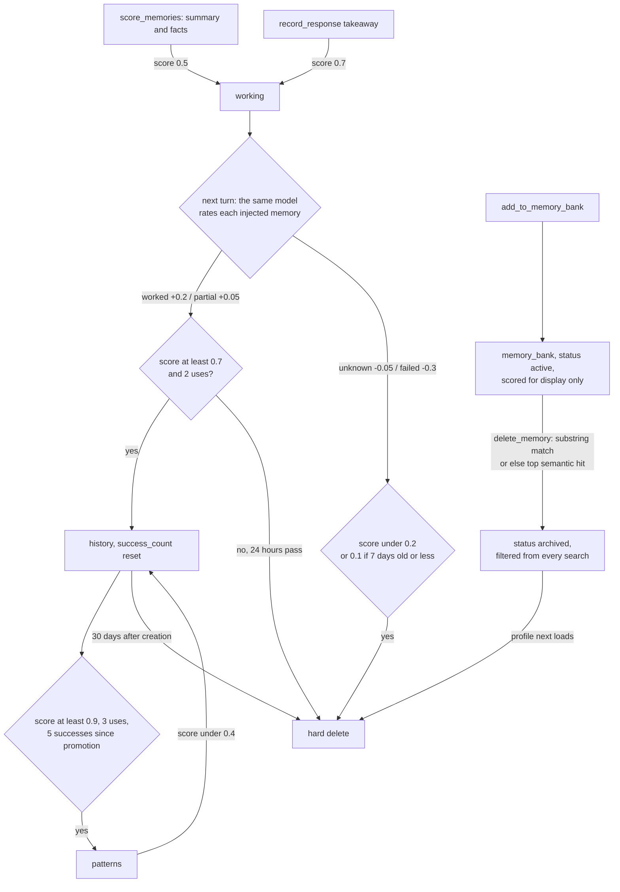

## 1. Executive Summary

Roampal Core is a local memory server for Claude Code and OpenCode. Hooks
inject eight retrieved memories before each prompt; the next turn asks the
model to rate each one `worked`, `partial`, `unknown` or `failed`, and those
ratings move a raw score that promotes an exchange summary from `working` to
`history` to `patterns`, or deletes it. A separate `memory_bank` holds
permanent facts the agent writes and edits through MCP.

What is notable is the operational care and the honesty of the companion
paper. Profile routing is per request and refuses an unknown profile rather
than falling back. A down embedder produces a visible marker instead of an
empty injection. The paper removed its own Wilson ranking after measuring that
it hurt retrieval.

What is weak is the loop the product is named for. The model that used a
memory is the one that rates it, and a memory retrieved and not used loses
score until it is demoted or deleted. `delete_memory` archives the nearest
semantic match when no text matches, and archived rows are hard-deleted the
next time the profile loads. The 85.8% LoCoMo figure on the README was measured with
promotion and decay switched off.

The final order is a cross-encoder score over a tag-routed vector pool
(`search_service.py:195-231`). Outcome scores and Wilson bounds are shown to
the model beside each memory; in ranking they only choose which candidates
reach the reranker when there are more than 40, and set the order when the
reranker is unavailable. Their main effect is on what survives.

One mark, `negative_eval`, on a committed integration case asserting an
archived fact is absent after identical text is re-added, beside a positive
control. Section 9 names the six withheld.

## 2. Mental Model

A memory is one of three things. An **exchange summary** or **atomic fact**
the model writes when it answers a scoring prompt; a **key takeaway** it writes
with `record_response`; or a **memory_bank fact** it writes with
`add_to_memory_bank`. Book chunks are reference material and are never scored.
Nothing is extracted by a background model from transcripts on the Claude Code
path: every durable row is text the agent chose to write.

**Summaries and facts have to earn survival within a day.** They land in
`working` at score 0.5; takeaways at 0.7. `worked` adds 0.2, `partial` 0.05,
`unknown` subtracts 0.05 and `failed` 0.3 (`outcome_service.py:237-284`). A
working row reaching 0.7 with two uses moves to `history`; a history row at
0.9 with three uses and five successes counted since its promotion moves to
`patterns`; a pattern under 0.4 moves back
(`promotion_service.py:118-133`). A working row not promoted within 24 hours
is deleted, and a history row is deleted 30 days after its original creation
unless it reached `patterns` (`:492-588`).

**Deletion by score has two thresholds.** At runtime a row under 0.2 is
deleted, or under 0.1 if it is seven days old or younger
(`promotion_service.py:282-317`). The startup pass deletes every
working, history and patterns row under 0.2 regardless of age
(`unified_memory_system.py:786-835`). A row under a week old at 0.15 survives
at runtime and is deleted at the next start.

**The rater is the reader.** On Claude Code the scoring prompt asks the same
model to label each memory it was shown, and says `unknown` means *"didn't use
this memory"* (`hooks/session_manager.py:562-569`). Each `unknown` subtracts
0.05, so a pattern the retriever keeps surfacing for queries it does not
answer drifts under 0.4 after about ten turns and is demoted. Demotion keeps
the original `created_at`, and the history cleanup deletes by that date, so a
demoted pattern more than 30 days old is deleted at the next cleanup
(`promotion_service.py:254-280`, `:540-588`). On OpenCode the rater is an
optional sidecar model, off until configured.

**memory_bank facts do not die by score.** They are scored for display, and
`_handle_deletion` returns early for `memory_bank` and `books`
(`promotion_service.py:290-294`). They stop being believed only when
`delete_memory` sets `status=archived`, and stop existing when the profile next
loads and `cleanup_archived()` hard-deletes every archived row
(`server/main.py:1021-1025`, `memory_bank_service.py:441-472`).

**Nothing is held as unconfirmed.** The injected block tells the model
*"Memories may be outdated or wrong. Verify before treating as ground truth"*
and heads facts *"use for direction, not authority"*
(`unified_memory_system.py:1476-1479`, `:1543-1545`). That is a request to the
model. Every row that survives the filters is injected.

## 3. Architecture

One process owns the data. `roampal init` wires Claude Code hooks and an MCP
entry, or copies a TypeScript plugin into OpenCode. The first hook or tool call
spawns a FastAPI server on `127.0.0.1:27182` that holds a `UnifiedMemorySystem`
per profile (`server/main.py:973-1051`). The MCP server is an HTTP client of
it (`mcp/server.py:522-544`), and so are the hooks. The server retires itself
after 30 idle minutes and is respawned by the next client.

Storage is ChromaDB's embedded `PersistentClient`: five collections named
`roampal_books`, `roampal_working`, `roampal_history`, `roampal_patterns` and
`roampal_memory_bank` in `<profile>/chromadb`, with SQLite WAL and `FULL`
synchronous on the catalog (`chromadb_adapter.py:21-55`,
`unified_memory_system.py:576-595`). Session transcripts are JSONL files under
`mcp_sessions/`, kept 30 days (`hooks/session_manager.py:46-62`).

Two ONNX models run on CPU: a multilingual mpnet INT8 embedder
(`embedding_service.py:50-51`) and the `mmarco-mMiniLMv2-L12-H384-v1` INT8
cross-encoder, shared across profiles (`search_service.py:77-82`). Tag
extraction for summaries without `noun_tags` goes to a sidecar LLM when one is
configured and is skipped otherwise.

`ContextService` is constructed at initialization and has no caller outside
its own module and tests (`unified_memory_system.py:630-634`), so its
per-conversation repetition check never runs.

### Deployment and ergonomics

- **Running:** a Python process with two ONNX models; the README gives about
  500 MB of RAM and 500 MB of model files, downloaded from Hugging Face on
  first use. No GPU, no external database.
- **Offline:** fully local once the models are cached. Tag extraction and
  OpenCode scoring need a sidecar model; with none, retrieval still works and
  OpenCode memories are never scored.
- **API key:** none to store anything. A sidecar may use one, read from an
  environment variable.
- **Install:** `pip install roampal` and `roampal init`. There is no lockfile;
  `chromadb` and `mcp` are capped below 2.0 and the other eight dependencies
  have a floor only.
- **Repair by hand:** poor. The store is ChromaDB's SQLite and HNSW files; the
  code works around HNSW phantoms in four places. `roampal stats`, `books` and
  `remove` exist; no command lists, restores or edits memory rows.

## 4. Essential Implementation Paths

**Injection.** `hooks/user_prompt_submit_hook.py` posts to
`/api/hooks/get-context` (`server/main.py:1096-1377`). On the first message of
a session `_build_cold_start_profile` adds one `memory_bank` fact per priority
tag (`:448-609`). `get_context_for_injection` runs two concurrent searches of
limit four, one with `memory_type != fact` and one with `memory_type == fact`
(`unified_memory_system.py:1382-1395`), and `_format_context_injection` renders
the block (`:1414-1553`). Surfaced ids are cached per conversation for scoring
(`server/main.py:1274-1298`).

**Scoring and capture.** The next get-context builds a scoring prompt listing
those ids (`hooks/session_manager.py:517-594`). The model calls
`score_memories`, which posts to `/api/record-outcome`
(`mcp/server.py:1273-1317`, `server/main.py:1947-2288`). Each rated id goes to
`OutcomeService.record_outcome` (`outcome_service.py:56-189`), which writes
score, uses, success count and a ten-entry outcome history onto the row, then
schedules `handle_promotion` as a fire-and-forget task (`:173-186`). The
summary and each fact are stored in `working` by `store_working`
(`unified_memory_system.py:1870-1940`).

**Explicit writes.** `add_to_memory_bank` → `/api/memory-bank/add` →
`store_memory_bank`, which embeds, checks for a near-duplicate inside
`memory_bank` only, and writes (`unified_memory_system.py:1157-1206`,
`memory_bank_service.py:59-128`). `update_memory` rewrites by id
(`memory_bank_service.py:172-221`). `delete_memory` → `archive()`
(`:223-290`).

**Retrieval.** `UnifiedMemorySystem.search` delegates to
`SearchService.search` (`search_service.py:309-407`), then drops ghost book ids
and archived rows (`unified_memory_system.py:957-967`).

**Lifecycle.** `PromotionService._handle_promotion_inner`
(`promotion_service.py:98-139`); TTL cleanups (`:492-588`), called at startup
and every 50 outcome recordings (`outcome_service.py:222-230`). The hourly
batch promoter `promote_valuable_working_memory` (`promotion_service.py:323-339`)
is called only by a unit test.

**Profile routing.** `_resolve_profile_name` takes the `X-Roampal-Profile`
header, then an `X-Roampal-Cwd` directory binding, then the persisted default,
then the launch pin (`server/main.py:911-970`).

## 5. Memory Data Model

There is no schema file; a row is ChromaDB metadata. Working rows carry
`content`, `text`, `score`, `uses`, `created_at`, `conversation_id`,
`memory_type` (`exchange_summary` or `fact`), `noun_tags` as a JSON string, and
after scoring `success_count`, `last_outcome`, `last_used` and
`outcome_history` truncated to its last ten entries
(`unified_memory_system.py:1906-1915`, `outcome_service.py:142-159`). Promotion
appends to a `promotion_history` JSON field and sets `original_id`, so a stale
id in a later rating is found in the next tier (`promotion_service.py:153-166`,
`outcome_service.py:90-112`).

A `memory_bank` row adds `tags` (the MCP schema offers six values), `importance`,
`confidence`, `status`, `mentioned_count`, and on update `updated_at` and
`update_reason` (`memory_bank_service.py:104-118`, `:197-203`). Ids are
`<collection>_<8 hex>`, and the prefix is how a rating finds its collection.

**Scope** is physical. A named profile is a registered directory
(`profile_manager.py`), and the server keeps one `UnifiedMemorySystem` per
profile name. `conversation_id` is stored and not read by any retrieval; the
one query that filters on it is the write-side duplicate check
`_merge_into_recent_summary` (`server/main.py:334-342`). The per-conversation
caches that scoring uses — `_search_cache`, `_injection_map` — are module
globals keyed by conversation id, not by profile (`server/main.py:73-89`).
When `ROAMPAL_DATA_PATH` is set, every profile name opens a
`UnifiedMemorySystem` on that one path (`server/main.py:990-1013`).

**Time** is `created_at` or `timestamp` and `updated_at`, record time only.
**Correction** is overwrite in place for `memory_bank` and archival; nothing
records the prior text. **Provenance** is absent: no row records which tool,
session or model wrote it, beyond the `conversation_id` on working rows.

## 6. Retrieval Mechanics

Retrieval is automatic on every prompt and tool-mediated through
`search_memory`. Both reach the same `SearchService.search`.

**Tag routing, then vectors.** `TagService.match_query_tags` word-boundary
matches the query against every `noun_tags` value seen, longest first, up to
eight (`tag_service.py:616-642`). For each matched tag and collection it runs a
vector query of `limit * 8` with no tag predicate and keeps rows whose
`noun_tags` contain the tag, in Python (`search_service.py:437-484`). Results
are pooled by how many tags they matched, cosine order within a tier, and the
pool is filled to 40 from an untagged cosine search (`:509-550`). With no tag
match, the pool is the cosine search alone. BM25 was removed in v0.4.1.2
(`chromadb_adapter.py:353-374`).

**The cross-encoder is the rank.** `apply_scoring_to_results` first sorts
the pool by a blend of embedding similarity and a learned score that becomes
the Wilson bound after three uses (`scoring_service.py:151-193`, `:313-343`).
`_rerank_with_ce` then replaces `final_rank_score` with the raw cross-encoder
score for the first 40 and sorts them (`search_service.py:195-231`); the
docstring cites the benchmark finding that Wilson hurt retrieval at every
stage. The blend survives in one place: on the untagged path each collection
contributes `limit * 3` candidates, 48 for an injection lane over four
collections, so the blend chooses which 40 are reranked. Collection boosts —
patterns ×0.9 distance, memory_bank cold-start quality, books under seven days
×0.7 — act on the same pre-rerank order (`:645-674`).

**Filters.** Archived `memory_bank` rows are excluded by a `status != archived`
predicate on every ChromaDB query of that collection
(`search_service.py:446-455`, `:617-627`) and again after search
(`unified_memory_system.py:962-967`). Direct lookup by id through
`search_memory(id=...)` goes to `get_by_id`, which applies neither
(`unified_memory_system.py:1252-1274`).

**Budget.** Eight memories per turn, no size cap. Full text is repeated only
when content changed: on Claude Code a memory already delivered this session
renders as a one-line pointer, recorded only after the hook acknowledges
delivery (`unified_memory_system.py:1509-1520`, `server/main.py:1300-1332`).

**Failure modes.** A ChromaDB query error returns `[]` from `query_vectors`
(`chromadb_adapter.py:287-289`) and reads as no memories. An embedder failure is
surfaced as a degraded marker instead (`server/main.py:1348-1371`). Tag routing
over-fetches from the whole collection, so a tag's rows outside the nearest
`limit * 8` vectors are not seen. The empty-query path behind the
SessionStart recency list reads at most 1,000 rows per collection before it
sorts (`search_service.py:701`).

## 7. Write Mechanics

Every write is a tool call or a hook, synchronous in the request. On Claude
Code the Stop hook stores the raw exchange in the session JSONL only; the
durable summary arrives with the next turn's `score_memories`
(`server/main.py:1420-1432`). On OpenCode the plugin's sidecar summarizes and
the Stop hook stores the summary in `working` (`:1433-1499`).

**Length is refused, not truncated.** Summaries and memory_bank entries over
600 characters and facts over 150 get an HTTP 400 carrying a rewrite message,
and nothing is stored (`memory_limits.py:30-32`, `server/main.py:1966-1981`).

**Dedup is per tier and by vector.** A `fact` in working, history or patterns
is skipped when any of the four tiers holds a fact within L2 distance 0.32;
a `memory_bank` write checks `memory_bank` only, so a permanent write is never
blocked by a transient copy (`unified_memory_system.py:402-416`, `:517-554`,
`:1181-1187`). Archived rows are excluded from dedup.

**Conflict** is not handled. Two memory_bank facts that disagree are both
stored and both injected; the tool description tells the model to call
`update_memory` or `delete_memory`.

**Deletion by content picks a neighbour.** `archive()` searches `memory_bank`
for the given text, takes the first active hit where either string contains the
other, and otherwise takes the top active hit (`memory_bank_service.py:244-269`).
The MCP description states this (`mcp/server.py:853`). `restore()` exists and
has no caller outside tests, and `cleanup_archived()` runs on the first access
to each profile after a server start. A wrong archive is reversible by editing
ChromaDB metadata until the next restart, and then it is gone.

### Operational cost

- **Blocking:** the agent blocks on an embedding per write and a scoring call
  per turn. There is no LLM on the Claude Code write path; the model writes the
  summary itself as a tool argument.
- **Lag:** a stored row is searchable when the call returns. Promotion runs in
  a background task seconds later.
- **Whole-store passes:** startup reads every working, history and patterns
  row's metadata, re-reads every memory_bank row for the status backfill once,
  and sweeps HNSW phantoms. The TTL cleanup every 50 ratings iterates every
  working and history id with one `get` per id. `_format_context_injection`
  lists the whole `memory_bank` on every prompt to find the user's name
  (`unified_memory_system.py:1435`); the bank is capped at 500 active rows.
- **Injection:** eight memories and, on a scoring turn, a prompt listing their
  ids. It arrives through the UserPromptSubmit hook's stdout, so it sits in the
  user turn rather than in a cached system prefix.

## 8. Agent Integration

Six MCP tools: `search_memory`, `add_to_memory_bank`, `update_memory`,
`delete_memory`, `score_memories` and `record_response`
(`mcp/server.py:608-996`). `score_memories` is hidden on OpenCode when a
sidecar scores. The descriptions are long and specific, with WHEN TO USE,
BEHAVIOR and ERRORS blocks that cite source lines.

The model has wide agency. It writes, edits and archives permanent facts, sets
their `importance` and `confidence`, and rates every memory it was shown. The
scoring prompt says it *"MAY also score any other memory visible"*
(`hooks/session_manager.py:569`), and `memory_scores` accepts any id
(`server/main.py:2098-2107`).

**An empty rating scores someone else's cache.** When no memories were
surfaced, the prompt itself tells the model to send `memory_scores={}`
(`hooks/session_manager.py:585-590`). The MCP handler drops the empty map
(`mcp/server.py:1287-1288`), and the endpoint falls through to scoring cached
doc ids with the exchange outcome. With no cache under the resolved
conversation it takes the most recent entry of any conversation still inside
the 30-minute TTL (`server/main.py:2081-2094`, `:2129-2140`). With two
sessions on one server, one session's `failed` exchange is applied to the
other's injected memories.

**Session boundaries.** `roampal init` registers `roampal context
--recent-exchanges` as the SessionStart hook for `startup`, `compact` and
`clear` (`cli/setup.py:528-543`). It resets the per-conversation pointer
record, so a compacted session receives full text again, and prints the four
most recent exchange summaries by recency (`cli/memory_cmds.py:714-804`).

Adapting it to another agent means reusing the HTTP API: the hooks and plugin
are thin clients of `/api/hooks/get-context` and `/api/hooks/stop`.

## 9. Reliability, Safety, and Trust

**Scope: withheld.** Profiles are separate directories, one ChromaDB per
profile, and the routing is careful. An unregistered profile name gets a 404
naming `roampal profile create` instead of a silent write to the default store
(`server/main.py:985-1007`), and the server never resolves a profile from its
own cwd. That is a physical partition with no key on the row and no predicate
on the read. `conversation_id` is on working rows and nothing retrieves by it.
Setting `ROAMPAL_DATA_PATH` collapses every profile onto one directory.

**Tombstone: withheld.** Archival is keyed on the row and purged at the next
load. `test_archive_then_add_similar_fact_succeeds` asserts that re-adding an
archived fact's exact text succeeds with a new id
(`test_archive_dedup_cycle.py:62-85`): re-assertion is the intended behaviour,
fixed for issue #8. The `ghost_ids.json` registry for removed books is durable
and keyed on chunk ids.

**Trust state: withheld.** `status` holds `active` or `archived`, a deletion
flag. `confidence` is a float the agent sets. It scales a distance boost for
memory_bank rows with fewer than three uses, before the cross-encoder reranks,
and orders the cold-start profile (`search_service.py:653-662`,
`server/main.py:471-479`). Wilson scores, uses and last outcome are
rendered for the model to weigh, and no read excludes a row on them.

**Audit log: withheld.** `outcome_history` keeps the last ten ratings on the
row (`outcome_service.py:142-149`) and `promotion_history` travels with it;
both are overwritten or deleted with the row. `update_memory` overwrites text
with no prior copy. Session JSONL files are transcripts with a 30-day TTL.

**Human review: withheld.** No path holds a memory for a person. Every write,
edit, archive and rating verb is on the agent's MCP surface, and the CLI has no
command to list, approve or restore memory rows.

**Bi-temporal: withheld.** Record time only.

**Prompt-injected memories.** Anything the model writes is stored and injected
next turn, subject to the length rule and dedup. A poisoned fact loses score
only if the same model later labels it `failed`. The paper's poison run is the
evidence on this, with lifecycle enabled, and it states that the mechanism was
not isolated.

**Local surface.** The server binds `127.0.0.1` with no authentication
(`server/main.py:2696`). Any local process can read, write or archive any
registered profile by naming it in a header.

**Data loss.** A wrong semantic archive (section 7) becomes a hard delete at
restart. Repeated `unknown` ratings demote a pattern, and a demoted pattern
past 30 days is deleted. The startup pass deletes new rows its runtime
counterpart would keep. `update_by_id` does not check `status`, so updating an
archived id reports success and the row stays invisible
(`memory_bank_service.py:190-221`).

**Crash safety** is taken seriously: WAL with `FULL` synchronous on the
ChromaDB catalog, atomic temp-file replace for transcript state, a
single-writer server, and phantom sweeps for HNSW entries left by hard deletes.

## 10. Tests, Evals, and Benchmarks

I ran nothing. The counts come from the checkout: 1,090 pytest functions,
mostly unit tests with mocked collections, plus six integration files against
a real ChromaDB. CI runs unit tests on Linux and macOS across Python 3.10–3.13,
integration tests on Linux and Windows, WAL tests in-process, a CLI golden
suite on three operating systems, and a Bun parse of the OpenCode plugin
(`.github/workflows/tests.yml`).

**The negative case that earns the mark.** `test_search_after_archive_and_readd`
archives a fact, re-adds identical text, and asserts the archived id is absent
and the new id present in a `memory_bank` search
(`test_archive_dedup_cycle.py:178-202`). The integration job runs the directory
with the real embedder (`tests.yml:295`, `:314`). The case above it,
`test_search_excludes_archived_after_cycle` (`:153-175`), asserts only the
absence, and its comment concedes the other fact may not match.

**A scope-boundary case.** `test_many_profiles_at_once_route_independently`
stores a marker per profile through four routing paths, asserts each client
finds its own, then asserts no foreign marker in any client's results
(`test_multi_profile_routing.py:276-396`). It uses a fake embedder and disables
the cross-encoder.

**A regression guard with a negative control.** `test_dedup_regression.py`
stores three distinct facts through the real `store_memory_bank` path and
asserts all three survive, forces the v0.5.9 broken threshold to show the same
case can fail, and repeats both over recorded real-model vectors in
`dedup_real_vectors.json` (`:159-200`, `:308-370`).

**Not covered.** No test exercises the semantic fallback in `archive()` or the
purge of archived rows on load. `test_record_outcome_marks_scored` sends an
empty `memory_scores` and asserts only that the turn is marked scored
(`test_fastapi_endpoints.py:727-737`); no test asserts which ids the cache
fallback then scores. Score-driven deletion is tested on `PromotionService`
with mocks, not through the HTTP path. No retrieval-quality evaluation is
committed to this repository.

**The paper.** The README cites *Beyond Ingestion: What Conversational Memory
Learning Reveals on a Corrected LoCoMo Benchmark* (Logan Teague, April 2026)
and links [roampal-labs](https://github.com/roampal-ai/roampal-labs) for data
and scripts. It is `paper.md` in that repository at
[`6b20c0d8f40c4f1eec0ccd0bb9e73cffea961ae7`](https://github.com/roampal-ai/roampal-labs/commit/6b20c0d8f40c4f1eec0ccd0bb9e73cffea961ae7);
an arXiv title search returned no entry. Three points bear on the code:

- The 85.8% non-adversarial figure is in its section 4.1, headed *learning
  OFF*, and its method section describes that run as *"promotion and decay
  disabled — all memories remain in working tier, outcome scores tracked but
  not acted on"*. The lifecycle ran only in the poison runs.
- It measured that Wilson scoring hurt retrieval at every stage. The code lets
  the cross-encoder set the final order, and the blend still picks which
  candidates reach it on the untagged path (section 6).
- Its pipeline used English `ms-marco-MiniLM-L-6-v2` and ChromaDB's default
  `all-MiniLM-L6-v2` embedder. The code ships the multilingual mmarco
  cross-encoder and a multilingual mpnet INT8 embedder. The paper states the
  reranker difference in its limitations and does not list the embedder.

It also states that the contribution of the outcome metadata shown to the
model was not isolated, and neither were the three candidate explanations for
poison resilience. Those are the paper's own limits, not findings here.

## 11. For Your Own Build

### Steal

- **Route by an explicit client-named scope and refuse the unknown one.** A
  header every client must send, a 404 for an unregistered name, and a server
  that never infers scope from its own environment.
- **Make a degraded read loud to the model.** "Embedder down, do not claim
  memories were checked" in the injected block is better than an empty block
  that reads as "no memories".
- **Ablate your own trust signal before shipping it into ranking.** The paper
  measured the Wilson blend, found it harmful, and the code keeps it out of the
  final order while still showing it.
- **Refuse over-long writes with a rewrite message** instead of truncating.
- **Dedup facts per tier, with the permanent tier checking only itself**, so a
  transient near-copy never blocks a durable write.
- **Deduplicate repeated injections by id and content hash, committed only on
  delivery acknowledgement.**

### Avoid

- **Letting the consumer grade the memory.** The model that was shown a memory
  and the model that rates it are the same, and "not used this turn" counts
  against the memory. Usefulness for one query is not truth, and retrieval
  noise becomes demotion and then deletion.
- **Deleting by nearest neighbour.** A delete keyed on content that falls back
  to the top semantic hit removes a memory the caller did not name. Resolve to
  an id first, and refuse when the match is not exact.
- **A soft delete that a restart hardens.** Reversibility that lasts until the
  next process start, with no restore verb on any surface, is a hard delete
  with a delay.
- **A fallback that reaches across sessions.** When the scoring target cannot
  be resolved, score nothing.
- **Two thresholds for one deletion rule.** The startup and runtime paths
  disagree about new rows.

### Fit

This suits one developer who wants hook-injected memory in Claude Code or
OpenCode, running locally on CPU, and who is comfortable with the model
curating its own store. The operational engineering is careful: crash-safe
writes, explicit degraded states, routing that fails loudly. A reader who needs a stored fact to stay put until a
person removes it should use `memory_bank` only, and read section 7 before
exposing `delete_memory`. A team, or anyone who needs to know why a memory
exists or who changed it, will find no provenance, no history and no review
surface, and should walk away. The outcome loop is the distinctive part and
the least evidenced: its own headline benchmark ran without it.

## 12. Open Questions

- How often does `delete_memory` fall back to the top active hit in practice,
  and do the tool descriptions steer models to paste exact text?
- What fraction of summaries survive the 24-hour working window under normal
  use, given that a summary needs two ratings in that window, one of them
  `worked`?
- Does ChromaDB's `$ne` on `memory_type` include `memory_bank` rows that carry
  no `memory_type`, as the lane comment assumes?
- Is the empty-`memory_scores` cache fallback hit with multiple sessions in the
  field?
- Would the poison-run result hold with the metadata tags stripped, which the
  paper names as untested?

## Appendix: File Index

- **Storage and schema:** `roampal/backend/modules/memory/chromadb_adapter.py`,
  `memory_types.py`, `config.py`, `roampal/memory_limits.py`,
  `roampal/profile_manager.py`.
- **Write path:** `unified_memory_system.py` (`store_working`,
  `store_memory_bank`, `_find_duplicate_fact`), `memory_bank_service.py`,
  `server/main.py:1392-1585, 1742-1818, 1910-2288`.
- **Scoring and lifecycle:** `outcome_service.py`, `promotion_service.py`,
  `scoring_service.py`, `unified_memory_system.py:786-897`.
- **Retrieval:** `search_service.py`, `tag_service.py`, `routing_service.py`,
  `embedding_service.py`.
- **Context assembly:** `unified_memory_system.py:1335-1553`,
  `server/main.py:448-609, 1096-1377`, `roampal/hooks/session_manager.py`.
- **Integration:** `roampal/mcp/server.py`, `roampal/hooks/`,
  `roampal/plugins/opencode/roampal.ts`, `roampal/cli/`.
- **Tests:** `tests/integration/test_archive_dedup_cycle.py`,
  `tests/integration/test_multi_profile_routing.py`,
  `tests/unit/test_dedup_regression.py`, `tests/unit/test_search_service.py`,
  `tests/unit/test_memory_bank_service.py`, `.github/workflows/tests.yml`.

### Recorded searches

Checked against the checkout at the pinned revision, from the tree root.

- `grep -rniE 'audit|event_log|append-only|appendonly' roampal --include='*.py' --include='*.ts' | grep -v '/tests/'` — comments only (hook output described as append-only, an audit finding id); no mutation record.
- `grep -rniE 'valid_(from|to|at|until)|invalid_at|effective_(from|at)' roampal --include='*.py' --include='*.ts'` — no match.
- `grep -rniE '\b(approve|approval|pending_review|needs_review|quarantine|candidate)\b' roampal --include='*.py' --include='*.ts' | grep -v '/tests/'` — candidate pools and path candidates only.
- `grep -rniE 'tombstone|reject(ed)?_value|blocklist|denylist|suppress' roampal --include='*.py' --include='*.ts' | grep -v '/tests/'` — two unrelated comments.
- `grep -rn '\.restore(\|delete_permanent(\|cleanup_archived(' roampal --include='*.py' | grep -v '/tests/'` — `restore` and `delete_permanent` have no caller; `cleanup_archived` is called at `server/main.py:1023` and `memory_bank_service.py:412`.
- `grep -rn 'context_service\|ContextService' roampal --include='*.py' | grep -v '/tests/'` — imports and the constructor at `unified_memory_system.py:630`; no call.
- `grep -rn 'promote_valuable_working_memory' roampal --include='*.py' --include='*.ts'` — the definition and one unit test.
- `grep -rnE '"where"|where=' roampal --include='*.py' | grep -v '/tests/'` — `conversation_id` appears only in `_merge_into_recent_summary` (`server/main.py:335-340`); retrieval filters come from `metadata_filters`, which no caller fills with a scope key.
- `grep -rliE 'arxiv|bibtex|@article|@misc|doi\.org|CITATION' . --exclude-dir=.git` — `README.md` (a paper cited by title, no identifier) and a test comment; no `CITATION.cff`.
- `curl -s 'https://export.arxiv.org/api/query?search_query=ti:%22Beyond%20Ingestion%22&max_results=5'` — no entry.
- `find . -iname AGENTS.md -o -iname CLAUDE.md -o -iname GEMINI.md -o -iname .cursorrules` — none in the tree.

## History

**2026-09-30** — [`211e7e05bb1e364471d29dd98c45d8b3bb3f12b0`](https://github.com/roampal-ai/roampal-core/commit/211e7e05bb1e364471d29dd98c45d8b3bb3f12b0) — first reading, at the head of `main`, a commit dated 26 September 2026. One mark, `negative_eval`. Screened before reading: no auto-run surface, four build-time execution points (three `conftest.py` files and `roampal/cli/setup.py`), one unpinned surface (`pyproject.toml` with no lockfile), and one file inside the cooldown, which in a depth-1 clone dates every file to the tip. No agent instruction files were present. The companion paper was read in `roampal-ai/roampal-labs`. Read with `grep` and `sed`; nothing installed, built or run.
