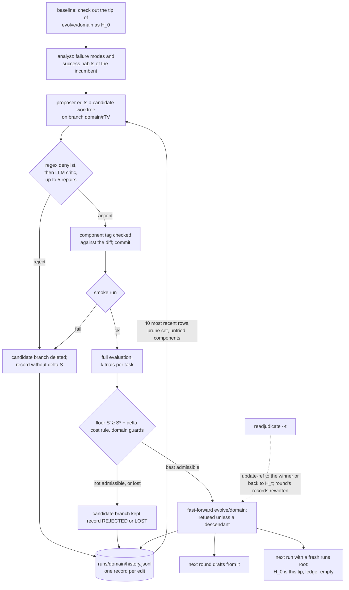

## 1. Executive Summary

RRSI is a search loop that rewrites an LLM agent's harness — prompts, control
flow, tools, skills, subagents — and keeps a rewrite only when it survives a
gate. What it remembers is the survivor: the incumbent harness is a commit on
`evolve/<domain>` in the operator's own checkout, the next round drafts from
it, and the next run's baseline starts from it. Notable: the gate is explicit
about what may become permanent — a noise floor, a cost rule that makes added
tokens pay for themselves, a leakage critic, and component tags checked
against the diff. Weak: the evidence behind that program is scoped to one run
while the program is not, so a later run inherits machinery with an empty
ledger, and the refusal to retry a falsified idea is a sentence in a prompt.

Three layers are memory-shaped and they differ in lifetime:

- **Durable, cross-run:** the harness itself, on a branch that accepting a
  candidate fast-forwards (`rrsi/gitops.py:121-126`, `rrsi/loop.py:327-329`)
  and that `baseline` checks out as H_0 (`rrsi/loop.py:181-184`).
- **Run-scoped:** `runs/<domain>/history.jsonl` and four JSON siblings, read by
  the proposer's prompt and the selector (`rrsi/loop.py:80-87`,
  `rrsi/loop.py:277-280`, `rrsi/loop.py:305`).
- **Offered and unused:** a JSONL `Memory` class in each starting harness that
  no committed harness imports (`third_party/harbor_terminus2/mechanisms.py:65-132`).

The durable layer is what the paper calls permanent state: its §3.3 says the
selection side regularizes *which candidates are allowed to become permanent
state*. That is the sense in which this is memory, and the only sense. The
harness is program text; nothing stores a fact about a user or a task, and the
committed harnesses carry no memory an agent reads across tasks.

The project website's evolution explorer publishes four real runs, every
candidate with its critic verdict, gate decision and diff. In the Claude Opus
4.8 coding run, three candidates were tagged `memory` and none was admitted;
the five admitted edits were three prompt edits and two subagent edits. Those
figures come from the website, not the repository; the evolved harnesses are
published there as patches and are not committed.

No marks. Section 9 names the seven and why each is withheld; the nearest
misses are `audit_log`, on a ledger that one command rewrites in place, and
`tombstone`, on a refusal that lives only in prompt text.

## 2. Mental Model

**A memory is an admitted edit.** A candidate harness is a git commit on a
branch `<domain>/r<t><variant>` off the incumbent (`rrsi/loop.py:458-474`).
It becomes part of what the system remembers when the round's selector picks
it and `fast_forward` moves `evolve/<domain>` to it (`rrsi/loop.py:327-337`).
From then on it is not a record anything consults; it is the code the next
evaluation runs. The ledger row that says why it was admitted lives beside it
and dies with the run directory.

**The admission path has four refusals, in order.** A deterministic denylist
and an LLM critic reject diffs that encode task names, answers, grader paths
or inert machinery, with up to five repair attempts
(`rrsi/critic.py:105-121`, `rrsi/loop.py:499-552`). A smoke run rejects a
harness that does not start (`rrsi/loop.py:562-568`). The full evaluation is
voided when more than a configured fraction of trials is missing
(`rrsi/loop.py:595-602`). Then `judge` applies the floor
`S' >= S* - delta`, the cost rule and the domain guards
(`rrsi/selection.py:97-121`), and the admissible candidate with the highest
score wins (`rrsi/selection.py:124-137`).

**The cost rule decides what kind of memory accumulates.** Above the noise
band a gain buys at most `beta0 + beta1 * dS` of relative token growth; inside
it a candidate needs `w_s*dS - w_c*dC + w_n*nu > 0`, where `nu` counts
structural component types never admitted before (`rrsi/selection.py:81-94`,
`rrsi/components.py:103-108`). The coding instance sets `w_s` to 0
(`domains/coding/rrsi.json`), so a within-band score gain alone never admits a
coding candidate. The floor is against the best score seen, `S*`, not the
incumbent's, so a candidate slightly below the incumbent is admissible if it
is cheaper.

**A memory dies only by being overwritten by a later admitted edit.** The
prune set `B_t` names components with no strictly positive measured gain in
the last `n_prune` rounds, together with the admitted edits carrying them
(`rrsi/history.py:143-163`). It reaches the proposer as prompt text
(`rrsi/propose.py:262-263`, `rrsi/propose.py:276-278`); nothing removes code.
A removal is a candidate like any other and must pass the same gate. The one
path that un-admits an edit is `readjudicate`, which re-runs the selector on
stored measurements and may move the branch back to the previous incumbent
(`rrsi/loop.py:398-420`).

**The ledger is evidence, not belief.** Each record states what a candidate's
edit claimed and what was measured (`rrsi/history.py:77-99`). A record can
be wrong only in its hypothesis, and nothing marks a hypothesis as falsified
beyond `outcome: REJECTED` and a negative `delta_S`. The proposer is told to
treat those as negative evidence and not to redraw them unchanged
(`rrsi/propose.py:266-271`); no code compares a new hypothesis or diff with
an old one.

## 3. Architecture

RRSI is a Python CLI (`rrsi.py`) driving a loop over one domain at a time.
The operator's clone of the repository is also the store: candidate commits,
the `evolve/<domain>` branch and the candidate branches are written into it by
`rrsi/gitops.py`, which shells out to `git` with a fixed `rrsi@localhost`
identity (`rrsi/gitops.py:45-56`). Worktrees live under `runs/<domain>/wt/`
(`rrsi/loop.py:82`), and nothing pushes a branch anywhere.

Three model roles run through LiteLLM (`rrsi/llm.py:92`): a proposer that
edits files through a path-jailed JSON action protocol
(`rrsi/propose.py:140-194`), an analyst that dispatches per-task digesters
over the incumbent's traces (`rrsi/analyst.py:121`), and the critic. The
configured model for all three is Claude Opus 4.8 (`rrsi/config.py:82-84`).
Evaluation is the domain adapter's business: Terminal-Bench 2.1 through
harbor and Docker for coding, Harvey LAB through a vendored archipelago runner
and an MCP gateway for the workspace instance, and EngDesign behind a jailed
tool gateway for engineering (`domains/*/adapter.py`).

The run directory holds five files the loop reads back: `history.jsonl` (the
ledger), `frontier.json` (incumbent, `S*`, trajectory), `attribution.jsonl`
(per-edit prediction hits), `global_analysis.json` (the last round's failure
modes and habits) and `calibration.json` (the noise band)
(`rrsi/loop.py:80-87`). Per-round directories `r<t>/` hold proposals, critic
verdicts, diffs and `eval.json` files, which make a crashed round resumable
(`rrsi/loop.py:461-473`, `rrsi/loop.py:581-585`).

A sequential driver runs each round as a subprocess, stops on a `STOP` file,
and gives up after three consecutive rounds that do not settle
(`rrsi/driver.py:54-99`).

### Deployment and ergonomics

Nothing needs to run for the memory itself: it is git refs and JSON files in
a checkout. Everything around it is heavy. Each round evaluates two candidates
on a whole evolve set — 178 trials for coding, 244 for engineering — against
a hosted model; the README's configuration is Vertex AI with application
default credentials, and the coding instance needs Docker and a harbor
virtualenv (`README.md`). There is no offline mode: the proposer, analyst,
critic and policy are all API calls.

The store is readable and repairable by hand, which the loop depends on:
`readjudicate` refuses to run while later rounds exist in the frontier and
tells the operator to remove them first, and no command does that removal
(`rrsi/loop.py:356-357`). The operator edits `frontier.json` and the branch
directly.

## 4. Essential Implementation Paths

**Capture (drafting a candidate).** `Run._draft` creates a worktree on a
fresh branch from `evolve/<domain>` (`rrsi/loop.py:474`), then calls
`propose` with the analyst report, the rendered ledger, the constitution
files `SKILL.md` and `PATTERNS.md`, the edit budget `b_t`, the exploration
directive and the prune set (`rrsi/loop.py:490-493`). The proposer finishes
with `done(edits=[...])`; `done` bounces an over-budget, untagged or
unreserved submission back to the model (`rrsi/propose.py:328-359`).

**Screening.** `review` runs the domain denylist first and returns a
rejection without a model call on any hit (`rrsi/critic.py:116-121`); the
coding denylist adds every Terminal-Bench task name as a word-bounded pattern
(`domains/coding/adapter.py:137-141`). The LLM review follows, and a
rejection goes back to the proposer as a repair brief, up to `repair_rounds`
times (`rrsi/loop.py:500-547`).

**Tagging.** After the critic accepts, each edit's declared component is
kept only if the diff carries that component's signal; otherwise it is
re-tagged from the diff (`rrsi/components.py:82-100`,
`rrsi/loop.py:554-558`). The commit follows (`rrsi/loop.py:559-560`).

**Admission.** `select_round` judges every candidate
(`rrsi/selection.py:124-137`); the winner fast-forwards the branch
(`rrsi/loop.py:328-329`), and `fast_forward` raises unless the branch tip is
an ancestor of the commit (`rrsi/gitops.py:121-126`). `S*` becomes the
maximum of itself and the winner's score (`rrsi/loop.py:335`).

**Ledger writes.** `append_candidate` writes one record per declared edit,
all sharing the candidate's single measurement (`rrsi/history.py:77-99`),
called for every candidate in the round (`rrsi/loop.py:310-322`). A resumed
round skips candidates already recorded (`rrsi/loop.py:311-312`).

**Ledger reads.** `tried` (components with a measured edit), `prune_set`,
`exploration` and `render` feed the proposer (`rrsi/loop.py:277-280`);
`incumbent_component_counts` feeds the novelty term (`rrsi/loop.py:305`);
`scoreboard` returns the last 20 attribution rows (`rrsi/loop.py:152-157`).

**Correction.** `readjudicate` replaces round `t`'s records
(`rrsi/history.py:101-106`, `rrsi/loop.py:386`) and moves the branch with a
bare `update-ref`: to the new winner after checking it descends from H_t, or
back to H_t when nothing is admissible (`rrsi/loop.py:398-413`).

**Inheritance across runs.** `baseline` calls `ensure_branch`, which creates
`evolve/<domain>` at `HEAD` only when it does not exist, and evaluates its tip
(`rrsi/gitops.py:75-77`, `rrsi/loop.py:181-189`). A run pointed at a fresh
`--runs` root therefore starts from the last run's winner with an empty
ledger (`rrsi.py:69`). No option names a different base.

**Tests.** `tests/test_core.py` covers the schedule, estimator, calibration,
cost rule, selection and ledger summaries; section 10 says what it leaves out.

## 5. Memory Data Model

**The durable unit is a commit.** Each candidate commit stages only the
harness path (`rrsi/gitops.py:115-118`); its message is
`r<t><variant>: <mechanism>` (`rrsi/loop.py:559-560`). The frontier records
the harness tree hash beside the commit, and that hash is the incumbent's
identity, so commits outside the harness path do not register as a change
(`rrsi/gitops.py:34-36`, `rrsi/gitops.py:67-68`). A round refuses to start
when the branch's harness tree differs from the frontier's
(`rrsi/loop.py:235-237`).

**The ledger record** carries `t`, `variant`, `edit_id`, `component`,
`hypothesis`, `targets_mode`, `predicted_affected`, `diff` (a path to the
patch file), `delta_S`, `delta_C`, `accepted`, `outcome`, `S`, `C`, `bundle`,
`detail` (capped at 600 characters) and a `ts` wall-clock string
(`rrsi/history.py:72`, `rrsi/history.py:84-99`). Outcomes are `ACCEPTED`,
`REJECTED`, `LOST` for measured candidates and the gate-failure name
(`critic_reject`, `smoke_fail`, `eval_invalid`, `no_proposal`) for the rest
(`rrsi/history.py:52`, `rrsi/loop.py:313-319`).

**Components** are a fixed vocabulary of nine: `prompt`, `control_flow`,
`config`, `output_plumbing`, `context_mgmt`, `client_tool`, `skill`, `memory`,
`subagent`; the last four are structural (`rrsi/components.py:44-46`). The
tried set, the prune set and the novelty term are all keyed on component, not
on hypothesis or diff.

**Scope** is physical: one branch and one run directory per domain name
(`rrsi/loop.py:80-88`). No record carries a scope key.

**Time.** `ts` is record time only. The trajectory in `frontier.json` is
indexed by round and is truncated and rewritten on each settlement
(`rrsi/loop.py:341-344`).

**The offered `Memory` store** is two JSONL files, `semantic` and `episodic`,
of `{"note", "tags"}` records with no timestamp, source or status
(`third_party/harbor_terminus2/mechanisms.py:76-103`). The archipelago copies
prefix the files with `mem_` (`third_party/archipelago/harness_eng/mechanisms.py:82-84`).

## 6. Retrieval Mechanics

Nothing is retrieved by relevance. The durable layer is read whole: the next
round's worktree is a checkout of the branch tip, and the harness runs as it
stands (`rrsi/loop.py:474`, `rrsi/domain.py:106-107`).

The ledger reaches the proposer by recency. `render` walks the records
backwards, keeps at most four without a measurement, and stops at 40
(`rrsi/history.py:166-185`), and `render()` is called with that default
(`rrsi/loop.py:280`). The README says the proposer *is conditioned on the
full edit history* (`README.md:23`), and the paper describes credit assigned
over the full evolution history. The website's Opus coding run has about 58
edit records over 20 rounds, so late rounds see a window that no longer holds
the early rejections. The derived summaries — tried set, prune set, untried
components — are computed over all records and do survive.

The analyst gets the previous round's failure-mode and habit names only for
stable naming (`rrsi/analyst.py:131-137`); `global_analysis.json` is
overwritten each round (`rrsi/loop.py:265-267`). The proposer also gets the
last 20 attribution rows, each listing predicted task ids that moved and
unpredicted regressions (`rrsi/loop.py:152-178`).

The unused `Memory.read` filters by a case-folded substring over note and
tags and returns the last eight matches; `digest` formats them as a prompt
block (`third_party/harbor_terminus2/mechanisms.py:105-132`).

## 7. Write Mechanics

Writes happen once per round, after evaluation, on the loop's own thread;
there is no agent-facing write. A candidate's ledger records are written in
the same step that moves the branch, and the next round reads both
(`rrsi/loop.py:304-346`).

**What is refused at write.** A diff hitting the denylist, a critic rejection
that survives the repairs, a failed smoke run, or an evaluation with too many
missing trials never reaches the branch, and its record carries no `delta_S`
(`rrsi/loop.py:313-316`). Such records do not enter the tried set or the
yield (`rrsi/history.py:113-119`). A measured candidate that fails the floor,
the cost rule or a guard is recorded `REJECTED`; an admissible one that
scored lower is `LOST` (`rrsi/loop.py:318-319`).

**What the candidate branches keep.** A candidate that fails a gate before
evaluation has its branch deleted (`rrsi/loop.py:481-488`,
`rrsi/gitops.py:88-94`). An evaluated one keeps its branch; only the worktree
is removed (`rrsi/loop.py:345-346`). `worktree_add` deletes an existing branch
of the same name before recreating it (`rrsi/gitops.py:80-84`), so a second
run on the same checkout deletes the first run's candidate branches round by
round. Admitted commits stay reachable from `evolve/<domain>`.

**Deduplication.** None across candidates. Two variants of a round are
drafted independently from the same incumbent (`rrsi/loop.py:476-479`), and
in the website's Opus run both variants of round 0 proposed a verification
audit with long-running-work guidance.

**The unused `Memory.write`** refuses an empty note or one matching a
per-harness `_LEAKY` regex, deduplicates by exact note text under an
exclusive `fcntl` lock, and appends (`third_party/harbor_terminus2/mechanisms.py:80-103`).

### Operational cost

A write blocks nothing an agent is doing, because no agent is running: it
happens between rounds. The lag before an admitted edit takes effect is the
rest of the round — the next draft is taken from the new tip. What dominates
is the price of admission: each round is up to two full evaluations plus the
proposer, critic and analyst calls, and the website's champion patch dates
the 20-round Opus coding run from 4 to 12 September 2026. No background pass
rewrites anything; `readjudicate` is operator-invoked. Nothing is injected
per turn, so there is no runtime prompt-cache question; the proposer's
constitution and pattern library are passed as a stable cache prefix
(`rrsi/propose.py:253-256`, `rrsi/propose.py:311-312`).

## 8. Agent Integration

There are two agents and neither holds a memory tool. The **proposer** is an
agent over the harness source: `list_files`, `read_file`, `list_traces`,
`read_trace`, `edit_file`, `write_file`, `done` (`rrsi/propose.py:71-105`).
Its context holds the ledger window, the attribution scoreboard, exploration
directives, prune set, analyst report, digests, the whole current harness
source and the edit budget (`rrsi/propose.py:264-304`). It cannot touch the
branch, the ledger or the gate; `Workspace._safe` jails every path to the
harness directory (`rrsi/propose.py:147-155`).

The **policy agent** is the harness being evolved, run by the domain adapter
from a worktree. It receives whatever the admitted program does. The three
starting harnesses — a Terminus-2 fork for coding and two archipelago ReAct
toolbelts with ReSum context summarization — carry no cross-task state; ReSum
summarizes within one trial (`third_party/archipelago/harness_eng/resum.py:15-20`).

The constitution files are hand-kept cross-run memory of a different kind.
The engineering `PATTERNS.md` says it exists so the proposer does not spend a
round re-measuring a mechanism an earlier run already measured
(`domains/eng/PATTERNS.md:3-6`), and each `SKILL.md` carries undated priors
such as textual skills washing out and sub-calls hurting small policies
(`domains/coding/SKILL.md:155-172`). The loop reads them from the main
checkout (`rrsi/domain.py:109-111`) and the proposer's jail keeps it from
editing them, so they change only by a person's commit.

Adapting the loop to another agent is a `Domain` subclass: splits, `run`,
`score`, trace rendering, smoke, denylist, component signals, briefs and
guards (`rrsi/domain.py:55-111`).

## 9. Reliability, Safety, and Trust

**The durable layer outlives its evidence.** The branch persists across runs
and the ledger does not (`rrsi/loop.py:80-87`, `rrsi/gitops.py:75-77`). A
second run's `accepted_edits` is empty, so its prune set cannot name the
inherited machinery, and `incumbent_component_counts` is zero for every
component, so the novelty bonus pays again for structure the first run
already admitted (`rrsi/history.py:129-141`, `rrsi/components.py:103-108`).
The website shows the shape in practice: its Gemini 3.5 Flash coding run is
two 15-iteration legs, *v2 from the v1 champion*, by its own run note.

**The branch is not append-only.** `fast_forward` refuses a non-descendant
(`rrsi/gitops.py:121-126`), but `readjudicate` uses `update-ref` directly and
moves the branch back to H_t when the re-applied gate admits nothing
(`rrsi/loop.py:412-413`). Its only precondition is that no later round
remains in the frontier (`rrsi/loop.py:356-357`). The un-admitted commit
stays reachable from its candidate branch until a later run reuses the name.

**Refusal is prompt text.** The proposer's context header says a rejected
mechanism is negative evidence, *do not redraw it unchanged*
(`rrsi/propose.py:266-270`), and each constitution repeats it
(`domains/coding/SKILL.md:44-46`, `domains/coding/SKILL.md:204-206`). The
code-enforced exploration checks are about untried components, not about
retried hypotheses (`rrsi/propose.py:349-354`, `rrsi/loop.py:523-530`).

**Leakage screening is the strongest part.** The denylist rejects before a
model call, the coding list includes every task name, and the critic's rule 5
asks specifically whether a memory or skill edit persists task-specific data
across trials (`rrsi/critic.py:84-90`). The critic payload has a
`STATE FILES` section for what a mechanism persisted
(`rrsi/critic.py:114`, `rrsi/critic.py:128`), and its one caller never fills
it (`rrsi/loop.py:503-505`), so that rule is judged on the diff alone.

**The offered `Memory` store would share one path.** No runner sets
`RRSI_STATE_DIR` or `APEX_STATE_DIR`, so a harness that wires the store
resolves the `/tmp` default (`third_party/harbor_terminus2/mechanisms.py:57`,
`third_party/archipelago/harness_eng/mechanisms.py:58-62`). Every candidate,
round and run on one host would read what earlier candidates wrote, including
rejected ones. The domain memory signals `TBMH_STATE_DIR` and
`DRMH_STATE_DIR` name variables nothing reads
(`domains/coding/adapter.py:123`, `domains/eng/adapter.py:101`); the generic
`Memory\(` signal still catches a wiring (`rrsi/components.py:50`).

**Cost can pass silently.** `relative_cost_change` returns 0 when either side
has no token count (`rrsi/evaluate.py:131-135`), so a candidate whose token
counts are missing passes the cost rule as cost-neutral.

**Marks.** None is awarded.

- `audit_log` — withheld. The ledger is the closest thing: a named record in
  the system's own store with one row per edit to the remembered program,
  admitted or not. `replace_round` rewrites a round's rows in place
  (`rrsi/history.py:101-106`), and it is scoped to one run while the program
  it describes is not. The branch's history is git history.
- `tombstone` — withheld. Rejected candidates keep branches and records, but
  no code consults them when a new candidate is drafted or admitted; the tried
  set and prune set are keyed on component.
- `trust_state` — withheld. `outcome` and `accepted` are selection verdicts
  on edits. `accepted_edits` filters on `accepted` to build the prune set
  (`rrsi/history.py:129-138`), and `render` shows rejected rows to the
  proposer as evidence rather than withholding them.
- `human_review` — withheld. The critic is a model and the gate is a
  function; no admission waits on a person.
- `scope_enforced` — withheld. Branch and run directory per domain are a
  physical partition.
- `bitemporal` — withheld. `ts` is record time.
- `negative_eval` — withheld; section 10 gives the near miss.

## 10. Tests, Evals, and Benchmarks

**The suite is 8 test functions, and I did not run it.** They cover the
annealed budget, the estimator and weights, calibration, both branches of the
cost rule, selection, ledger summaries, component normalization and config
loading (`tests/test_core.py:56-180`).

**The nearest `negative_eval` case is an admission test.**
`test_selection_floor_argmax_and_sstar` builds four candidates, asserts the
two above the floor are admissible and the winner is the higher, then asserts
the one below the floor and the critic-rejected one are not
(`tests/test_core.py:99-125`). `test_history_summaries_prune_and_explore`
asserts a critic-rejected `config` edit stays out of the tried set beside
three measured components (`tests/test_core.py:128-140`). Both have positive
controls. Both keep material out of a write decision or a derived summary,
not out of a retrieval, and the mark is withheld on that.

**Untested:** `fast_forward` and the `readjudicate` rewind, `replace_round`,
the 40-row `render` window, the critic and its denylists, `done()`'s budget
and slot checks, the component re-tagging inside `_draft`, and every
`Memory` method. `screen_subset` in `domains/eng/bench/score.py:206` has no
caller in the tree.

**The paper.** *RRSI: Regularized Recursive Self-Improvement of Agent
Harnesses* ([arXiv:2609.24972](https://arxiv.org/abs/2609.24972), v1 21
September 2026, v2 23 September 2026). Its Table 2 ablates the two groups of
regularizers on Harvey LAB: RRSI scores 90.5 on the evolve set, 89.2 on the
in-distribution held-out split and 43.6 on the out-of-distribution average at
2.42 million tokens per trial, against 92.8, 88.9, 40.3 and 3.80 for
unregularized evolution. The appendix definitions of the ledger, tried set,
prune set and novelty term (its Eqs. 10-16) match the code.

**The website** ([regularized-rsi.com](https://regularized-rsi.com/)) serves
the evolution explorer from `data/evolution.js`, which its header says was
generated from the raw run directories. I parsed that file; the figures below
come from it, not from the repository.

| Run | Evolve set | H_0 → final | Admitted | Blocked |
| --- | --- | --- | --- | --- |
| Coding, Claude Opus 4.8 | 89 tasks × k=2, 20 rounds | 74.2% → 80.9% | 5: prompt ×3, subagent ×2 | 35: floor 24, cost 8, smoke 2, critic 1 |
| Coding, Gemini 3.5 Flash | 89 tasks × k=2, 30 iterations | 64.6% → 78.7% | 10 | 20 |
| Harvey LAB | 120 tasks × k=2, 20 rounds | 89.67% → 90.85% | 4: control_flow, client_tool ×3 | 36 |
| EngDesign | 61 tasks × k=4, 40 rounds | 50.0% → 54.9% | 4 | 36 |

In the Opus coding run three candidates were tagged `memory`. `r6A` and `r6B`
wired `Memory` and wrote a fixed list of proposer-authored lessons into it at
task start, then injected the digest: the store was used as a route for
constant prompt text, not for lessons written from outcomes. `r6A` scored
77.0% and failed the cost rule; `r6B` scored 74.2% and failed the floor.
`r4B` was tagged `memory` and its published diff contains no memory wiring.
In Harvey LAB the proposer declined a round, writing that memory *cannot hold
the per-task source enumeration these modes need*. No champion patch
references `Memory`.

Three discrepancies are recorded. The website's Opus and Harvey finals (80.9%,
90.85%) differ from the paper and README (80.2, 90.5), which report a
re-measurement against H_0 in one window. The Opus run's noise band is 0.034,
recalibrated per its run note, where `domains/coding/rrsi.json` fixes 0.017.
And only the Opus coding run is labelled *Unified RRSI codebase*; the Gemini
run's note describes one candidate per iteration and a 24-task screen the
committed loop does not run, and the published patch paths name a
`domains/coding/harness/` layout that is not the pinned one.

## 11. For Your Own Build

### Steal

- **Make the admitted state a commit and move it only forward.** A
  fast-forward check makes "what is in force" one ref and its history one
  log, and resuming is checking out a tip.
- **Price growth at admission.** Require added inference cost to be paid for
  by measured gain, and refuse gains inside a measured noise band unless they
  are cheaper; this keeps an accreting store from growing on noise.
- **Check the label against the payload.** Keep a declared category only when
  the change carries evidence of it, and re-derive it otherwise, before the
  record is written. A ledger whose categories are the writer's own word is a
  ledger of claims.
- **Screen before you measure.** A leaking candidate that is never scored
  never produces the inflated number that would make it attractive later.

### Avoid

- **Evidence with a shorter life than the state it justifies.** When the
  remembered artifact persists and its provenance is per session, the next
  session inherits conclusions without reasons and re-credits them as new.
  Store the ledger with the artifact, or key it by the artifact's lineage.
- **Refusal by instruction.** "Do not redraw" in a prompt, over a window that
  scrolls, is a hope. A durable refusal is a lookup the admission path runs.
- **A store whose default location is shared.** A `/tmp` default for a
  per-candidate store turns an A/B comparison into a contaminated one.
- **A review payload with an empty slot.** A reviewer told to judge what a
  mechanism persists, and never shown it, is judging the code's intent.

### Fit

RRSI suits a team with a fixed benchmark, a hosted-model budget large enough
for hundreds of full evaluations, and a harness they are willing to let a
model rewrite. As agent memory it fits only one reading: the program is the
memory, and the gate is its admission policy. A reader wanting an agent that
remembers across tasks will find a declared, unwired store and three
published candidates in which it was not admitted. The part to take is the
gate and the tag check; the loop around them is a research harness with a
single-operator workflow, including hand edits to `frontier.json` before a
re-adjudication.

## 12. Open Questions

- How were the paper's per-run H_0 baselines produced on one checkout, given
  that `baseline` starts from the existing branch tip? Deleting the branch by
  hand would do it; nothing in the tree does.
- Do the published runs predate the component re-tagging? `r4B`'s published
  diff has no memory signal and keeps its `memory` tag.
- Were `r6A` and `r6B` evaluated on the same host, and did one read the
  other's lessons through the shared `/tmp/tbmh_state`?
- Is the 40-row `render` window deliberate, and was it the window in the
  published runs?

## Appendix: File Index

- **Durable layer:** `rrsi/gitops.py`, `rrsi/loop.py:116-128`,
  `rrsi/loop.py:181-207`, `rrsi/loop.py:327-346`, `rrsi/loop.py:348-422`.
- **Ledger and summaries:** `rrsi/history.py`, `rrsi/components.py`,
  `rrsi/loop.py:133-178`.
- **Admission:** `rrsi/critic.py`, `rrsi/selection.py`, `rrsi/evaluate.py`,
  `rrsi/calibrate.py`, `rrsi/schedule.py`, `domains/*/rrsi.json`.
- **Proposal:** `rrsi/propose.py`, `rrsi/analyst.py`, `rrsi/digester.py`,
  `domains/*/SKILL.md`, `domains/*/PATTERNS.md`, `domains/*/briefs.py`.
- **Domains:** `rrsi/domain.py`, `domains/coding/adapter.py`,
  `domains/workspace/adapter.py`, `domains/eng/adapter.py`.
- **Offered memory:** `third_party/harbor_terminus2/mechanisms.py`,
  `third_party/archipelago/harness_eng/mechanisms.py`,
  `third_party/archipelago/harness_workspace/mechanisms.py`.
- **CLI and driver:** `rrsi.py`, `rrsi/driver.py`.
- **Tests:** `tests/test_core.py`.

### Recorded searches

Checked against the checkout at the pinned revision, from the tree root.

- `git grep -nE 'import mechanisms|from \.?mechanisms|mechanisms import|Memory\(' -- '*.py'` — no match; `git grep -nE 'class Memory' -- '*.py'` finds the three definitions.
- `git grep -nE 'RRSI_STATE_DIR|APEX_STATE_DIR' -- . ':!*mechanisms.py'` — no match.
- `git grep -nE 'TBMH_STATE_DIR|DRMH_STATE_DIR'` — only the three adapters' signal lists.
- `git grep -n 'state_files'` — `rrsi/critic.py:114` and `:128` only.
- `git grep -nE 'self\.history\.|History\(' -- rrsi rrsi.py` — every reader and writer of the ledger, all in `rrsi/loop.py`.
- `git grep -nE 'redraw|re-propose' -- rrsi domains` — the proposer's context header and the three `SKILL.md` files; no code.
- `git grep -nE '"push"|branch", "-[fD]"|"reset"|update-ref' -- rrsi rrsi.py domains` — `gitops.py:94`, `:102` and `:126`, `loop.py:402` and `:413`; no push.
- `git grep -nE 'render\(' -- rrsi rrsi.py` — the definition at `history.py:166`, `loop.py:280` with the default 40, and `rrsi.py:131` with 60.
- `git grep -n screen_subset` — the definition only.
- `git ls-files | grep -iE 'champion|\.patch$'` — no match.
- `git grep -nE -i 'arxiv|bibtex|@article|@misc|doi\.org|CITATION' -- .` — the README's paper links and BibTeX block, and ReAct and ReSum references in the vendored harnesses.
- `gh api repos/google-research/rrsi/branches --jq '.[].name'` — `main` only.

## History

**2026-09-28** — [`be50316e1db05914068a973f322770ef08ed7ba1`](https://github.com/google-research/rrsi/commit/be50316e1db05914068a973f322770ef08ed7ba1) — first reading, at the head of `main`, a commit dated 23 September 2026. No marks. The website's evolution data was parsed for the four published runs. Screened before reading: 0 auto-run surfaces, 0 build-time execution points, 2 dependency files inside the cooldown — every file in a depth-1 clone dates to the tip — and 1 unpinned surface, `pyproject.toml` with no lockfile. The `SKILL.md` and `PATTERNS.md` constitutions were read as data. Nothing installed, built or run.
