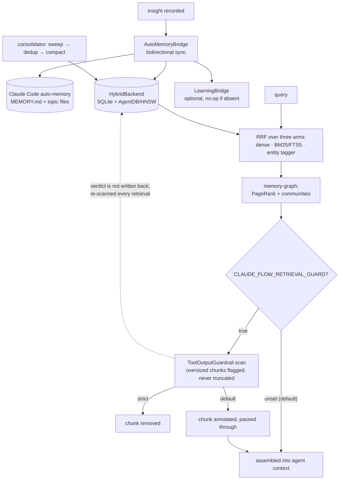

## 1. Executive Summary

ruflo — shipped on npm as `claude-flow`, and formerly named Claude-Flow — is an
agent meta-harness: swarm orchestration for Claude Code and Codex, with a
`v3/@claude-flow/memory` package of 24,166 lines across 57 source files that the
rest of the harness consumes.

Most of that package is a competent build of a shape this atlas has seen many
times: a hybrid backend (SQLite for structured queries and ACID, AgentDB with an
HNSW index for vectors), reciprocal rank fusion over dense, sparse and entity
arms, a knowledge graph with PageRank and label-propagation communities, a
consolidator that sweeps expiries and dedups by content hash, and a bridge that
syncs with Claude Code's own Markdown memory files.

One file is not that, and it is why this report exists.
`agentdb-retrieval-guard.ts` screens retrieved chunks for prompt injection
**before they are assembled into an agent's context**, and its header states the
threat model with a citation: *"AgentDB's retrieval path has zero certified
defenses against poisoned memory entries — SMSR ([arXiv:2606.12703](https://arxiv.org/abs/2606.12703)) shows 93-100%
undefended attack success, reduced to 0% behind a certified content guard."*

Three details make it worth copying rather than merely noting. It **does not
reimplement the pattern library** — it wraps `@claude-flow/security`'s
`ToolOutputGuardrail`, the same screening the harness already applies to tool
output, on the argument that a retrieved memory chunk is the same category of
untrusted input. It **refuses to truncate an oversized chunk**, because
*"truncation would let an attacker pad a payload past the guardrail's own scan
window"* — the second-order failure most size gates walk into. And it is honest
about its own status: **off unless `CLAUDE_FLOW_RETRIEVAL_GUARD=true`**, and even
then annotate-only unless `..._STRICT=true` makes it drop.

That default is the weakness as well as the honesty. A defence that ships
disabled protects nobody by default, and the guard is the only thing in this
memory package that treats stored content as potentially hostile.

The rest of the correction story is the atlas's usual absence. Nothing supersedes,
nothing is marked wrong, and the consolidator's dedup collapses duplicates by
content hash rather than adjudicating between them.

## 2. Mental Model

A memory is a `MemoryEntry`: content, a namespace, a content hash, an `expiresAt`,
and — the field that matters structurally — a `references` list. That list is what
`memory-graph.ts` walks to build a graph, so an entry is simultaneously a document
and a node.

The lifecycle is maintenance-shaped rather than epistemics-shaped:

- **Recorded.** An insight arrives through `AutoMemoryBridge`, which per ADR-048
  bridges Claude Code's Markdown auto-memory — `~/.claude/projects/<project>/memory/`,
  with `MEMORY.md` as the entrypoint and topic files read on demand — with the
  unified store. The sync is bidirectional, so the same fact exists as a Markdown
  line a person can edit and as a row a vector index can find.
- **Learned from.** `LearningBridge` fires a neural learning trajectory on each
  recorded insight, *"so the system continuously improves from its own
  discoveries"* — with the dependency optional and every operation degrading to a
  no-op when it is absent, which is the right way to make a speculative subsystem
  removable.
- **Expired, deduped, compacted.** `MemoryConsolidator` runs `sweepExpired()`,
  `dedup(strategy)` over content-hash duplicates, and `compactHnsw()` — in that
  order under `runAll()` — from a background timer or from the `nightlyLearner`
  controller.
- **Transferred.** `agent-memory-scope.ts` moves knowledge between agents with a
  `minConfidence` default of 0.8 and a `maxEntries` default of 20, so a transfer
  is a filtered copy rather than a merge.

What is missing from that list is any transition that means *this was wrong*. An
entry leaves by expiry or by being a hash-duplicate of another. Confidence exists
and gates a transfer; it does not gate retrieval and it never falls.

The guard adds a state the rest of the design does not have, and only at read
time: a retrieved chunk can be **annotated unsafe**, and in strict mode removed
from the result set. That judgement is not written back — the entry in the store
is unchanged, so the same chunk is re-screened on every retrieval.

## 3. Architecture

`@claude-flow/memory` is one workspace package inside a monorepo of 5,491 files.
It is consumed by the swarm layer (`@claude-flow/swarm`'s queen coordinator among
others) rather than being an application in its own right.

| Concern | Files |
| --- | --- |
| Backends | `hybrid-backend.ts`, `agentdb-backend.ts`, `agentdb-adapter.ts`, `database-provider.ts` |
| Indexes | `hnsw-index.ts`, `hnsw-persistence.test.ts`, `fts5.test.ts` |
| Retrieval | `entity-tagger.ts`, `query-builder.ts`, `memory-graph.ts`, `graceful-retrieval.test.ts` |
| Safety | `agentdb-retrieval-guard.ts`, `json-security.ts` |
| Maintenance | `consolidator.ts`, `cache-manager.ts`, `migration.ts` |
| Bridges | `auto-memory-bridge.ts`, `learning-bridge.ts`, `agent-memory-scope.ts` |
| Wiring | `controller-registry.ts`, `index.ts`, plus `agents/`, `application/`, `domain/`, `infrastructure/` |

The layout is deliberate — a `domain`/`application`/`infrastructure` split with a
controller registry — and the ADR numbers in the file headers (ADR-009 for the
hybrid backend, ADR-048 for the auto-memory bridge, ADR-125 for the consolidator,
ADR-131 for the guardrail, ADR-147 for the entity arm, ADR-377 for the retrieval
guard) suggest a project that records decisions. Those ADRs were not read here;
the headers are the evidence.

### Deployment and ergonomics

Node and npm, installed as `claude-flow`. SQLite is embedded; AgentDB is a
dependency rather than a service you stand up, and the HNSW index persists to
disk. Nothing external is required to store something, and the Markdown side of
the bridge is human-readable and hand-editable by construction — that is what
Claude Code's auto-memory is.

The cost is scale of surface. Adopting the memory package means adopting a
harness with swarm orchestration, a security package, a neural learning system
and a controller registry, most of which a reader who wants a memory store does
not need. The package boundary is clean enough that lifting a single file — the
guard, most likely — is the realistic form of reuse.

## 4. Essential Implementation Paths

**Write and bridge.** `AutoMemoryBridge` (ADR-048) syncs between the Markdown
auto-memory tree and the unified store. Its header describes the read side
precisely: `MEMORY.md`'s *first 200 lines* is the entrypoint Claude loads into its
system prompt, and topic files are *read on demand* — the index-in-the-prefix,
body-on-demand arrangement, inherited from the host rather than invented here.

**Retrieval.** Three arms fused by RRF. `entity-tagger.ts` is the third and its
justification is the clearest thing in the package: *"BM25 weights documents by
overall token frequency; a per-entity exact match avoids downweighting for tokens
that happen to be common but mention an entity by name"*, with a worked example —
querying "Alice OAuth tokens", where BM25 may rank generic OAuth above the
document that actually mentions Alice. `memory-graph.ts` then re-ranks with
PageRank over `MemoryEntry.references` and label-propagation communities, in pure
TypeScript with no graph library.

**The guard.** `AgentDbRetrievalGuard` wraps
`createToolOutputGuardrail(guardrailConfig)` from `@claude-flow/security`.
`maxPayloadBytes` defaults to 8,192 and an oversized chunk is flagged or dropped,
never truncated. `blockOnSuspicion` defaults to `false`, so the default enabled
behaviour is to annotate a `GuardedSearchResult` and let the caller decide.

**Maintenance.** `MemoryConsolidator.runAll()` is `sweepExpired()` →
`dedup(strategy)` → `compactHnsw()`. It is invoked from
`UnifiedMemoryService`'s background timer when `consolidator.autoRun === true`,
from `close()`, and from the `nightlyLearner` controller in
`controller-registry.ts`, which the header notes *"delegates to `runAll()` instead
of hitting AgentDB directly"*.

**Scope and transfer.** `agent-memory-scope.ts` maps Claude Code's three scopes —
`project` (shared, in git), `local` (machine-specific, gitignored), `user` (global
across projects) — onto per-agent subdirectories, and `TransferOptions` gates a
copy between agents on `minConfidence` (0.8) and `maxEntries` (20).

## 5. Memory Data Model

`MemoryEntry` carries content, a namespace, a content hash, `expiresAt`, and
`references`. The hash is a dedup key; the references list is the graph.

Scoping is directory-shaped and inherited: `project`, `local` and `user`, each
holding per-agent named subdirectories, *"enabling isolated yet transferable
knowledge between agents"*. Namespaces sit inside that. This is scoping as
**placement** rather than as a filter composed into a query — a read is a read of
a directory or a namespace — and no committed test in the memory package was
found asserting that one agent's namespace cannot surface in another's results,
which is why the scope mark is withheld here.

There is no validity interval separate from record time, no supersession pointer,
no discrete trust state and no tombstone. Confidence is a number used once, at
transfer time.

The one structural field the atlas rarely sees is `references`, because it makes
the store a graph without a graph database — and it is populated by whoever writes
the entry, so the graph is only as good as the writer's discipline.

## 6. Retrieval Mechanics

Three arms and a re-rank, and the arms are genuinely different signals rather than
three spellings of similarity:

- **Dense** — HNSW over AgentDB embeddings.
- **Sparse** — FTS5/BM25.
- **Entity** — a regex proper-noun and structured-token extractor, added
  specifically because BM25's frequency weighting buries a document that names
  the entity you asked about.

Fusion is RRF, which is the right choice when the arms' scores are not
commensurable. `memory-graph.ts` then offers PageRank and community-aware
re-ranking on top, so an entry cited by many others can outrank a closer match.

The guard runs after all of that, on the assembled top-K, which is the correct
position — it screens exactly what would have reached the model and nothing else.

Failure modes: PageRank rewards well-connected entries, which in a store whose
`references` are written by an agent means it rewards whatever the agent linked
most, not what is most true. Community detection on a small store is noise. And
because the guard's verdict is not persisted, a chunk that fails screening on
every retrieval is re-scanned every time and nothing escalates.

## 7. Write Mechanics

Writes go through the bridge and are **not model-gated**: an insight is recorded,
synced to Markdown and to the store, and a learning trajectory fires. There is no
extraction prompt in this package and no adjudication.

Dedup is content-hash equality with a selectable strategy, applied in the
background rather than at write, so two spellings of the same fact both persist
until a consolidation run and neither is ever preferred on content.

Expiry is the primary forgetting mechanism and it is per-entry `expiresAt`, swept
in bulk. There is no delete-by-scope, no forget-by-content and no propagation of a
deletion into the Markdown side that this reading traced — the bridge is described
as bidirectional, and what a deletion does to the other side is the question a
reader should check before relying on it.

Malicious input is handled on the **read** path only. Nothing screens a memory as
it is written, which is a defensible ordering — screening at read catches content
poisoned before it reached the store as well — and it means the store is knowingly
allowed to contain payloads.

### Operational cost

The write path costs no model call. The learning bridge may cost one when a neural
system is wired in, and degrades to a no-op when it is not.

Retrieval costs three index queries plus fusion, plus an optional graph pass, plus
— when enabled — a guardrail scan per chunk. The guard's cost is regex screening
rather than inference, so it is the cheap kind of defence, which makes the
off-by-default posture harder to justify on performance grounds.

Consolidation rebuilds the HNSW index, so its cost scales with the whole store
rather than with the day's writes, and it runs on a timer.

On injection, the package inherits rather than decides: Claude Code loads the
first 200 lines of `MEMORY.md` into the system prompt and reads topic files on
demand. That is a stable prefix plus on-demand bodies, which is the friendly shape
for [cache-preserving injection](../../patterns/cache-preserving-injection/) — but
it is the host's arrangement, and nothing in this package guarantees a sync will
not rewrite the prefix mid-session.

## 8. Agent Integration

Memory here is a **library inside a harness**, not a service or an MCP surface.
The swarm layer consumes it; agents get memory because the orchestrator gives it
to them, and the auto-memory bridge means part of the store is whatever Claude
Code already had.

The agency question therefore has two answers. Through Claude Code's own memory
files, an agent edits Markdown with ordinary tools. Through the unified store, an
agent does not participate — insights are recorded by the harness.

The `agent-memory-scope` transfer is the distinctive integration idea: knowledge
moves from one agent's namespace to another's as an explicit, confidence-filtered,
count-capped copy. Most multi-agent designs in this atlas either share one store
or keep them wholly separate; a governed copy between them is a third position and
the right one for a swarm where agents specialise.

## 9. Reliability, Safety, and Trust

The retrieval guard is the strongest safety artifact in this report and deserves
its detail:

- **The threat is named and cited.** Poisoned memory entries, SMSR
  ([arXiv:2606.12703](https://arxiv.org/abs/2606.12703)), 93–100% undefended success against 0% behind a certified
  guard. Whether that transfers to this deployment is not established here, and
  the citation is still worth more than the usual silence.
- **It reuses the existing defence.** `ToolOutputGuardrail` (ADR-131) is the
  harness's tool-output screening, with its OWASP LLM01/LLM08 pattern library and
  policy engine. Treating a retrieved memory chunk as the same category of
  untrusted input as tool output is the right classification, and reusing the
  library means one place to fix a missed pattern.
- **It refuses to truncate.** *"Truncation would let an attacker pad a payload
  past the guardrail's own scan window."* Most size gates truncate; this one flags
  or drops.

Against that, the posture: **off by default**, then annotate-only, then strict.
Three states where the safest is the least likely to be configured. The header is
candid about it, which is better than a `SECURITY.md` claiming otherwise, and a
reader adopting this should assume the guard is not running.

Everything else is the ordinary set of gaps. No provenance beyond what a writer
puts in the entry. No audit of mutations. No way to mark a memory false — a
poisoned entry that the guard flags on every read stays in the store, flagged
nowhere durable. And the bidirectional Markdown bridge means a file a person edits
and a row a machine writes can disagree, with no stated winner.

## 10. Tests, Evals, and Benchmarks

Nineteen `*.test.ts` files inside the memory package holding 452 `it()` cases,
plus `benchmarks/memory-write.bench.ts` — a committed write benchmark, which is
more than most systems here have.

Coverage tracks the structure: `agentdb-backend.test.ts`,
`agentdb-retrieval-guard.test.ts`, `hnsw-persistence.test.ts`, `fts5.test.ts`,
`consolidator.test.ts`, `memory-graph.test.ts`, `entity-tagger.test.ts`,
`migration.test.ts`, `graceful-retrieval.test.ts`, `agent-memory-scope.test.ts`.
A guard with its own test file, and a graceful-retrieval test asserting the
degraded path, are both good signs.

What is not here: no retrieval-quality evaluation, no memory benchmark such as
LoCoMo or LongMemEval, and — the one that matters given the design — no committed
case asserting that one agent's namespace cannot surface in another's results.
The transfer path is confidence-gated and tested; the isolation the transfer
implies is not, which is why this report withholds the scope mark rather than
awarding it on the directory layout.

I ran nothing. Every claim here comes from reading the tree at
`913f9eaedee92627950544424e50339feaf98271`. Note that the project renamed from
Claude-Flow to ruflo and still publishes under the old npm name, so a reader
matching by package name will find `claude-flow` and a reader matching by
repository will find this.

## 11. For Your Own Build

### Steal

- **Screen retrieved memory with the same guard you use on tool output.** A chunk
  coming back from a vector index is untrusted input that is about to enter a
  prompt, which is the definition of the thing your tool-output screening already
  covers. Reuse the library rather than writing a second pattern list that will
  drift.
- **Flag or drop an oversized chunk; never truncate it.** Truncating lets an
  attacker push the payload past your scanner's window. This is a two-line
  decision and almost every size gate gets it wrong.
- **Give the guard three states and name them.** Off, annotate, drop. Annotating
  and letting the caller decide is what makes it deployable in front of an
  existing system, and being explicit about the default is what lets an adopter
  know what they actually have.
- **Add an entity arm to a hybrid search.** BM25 downweights a document because
  its tokens are common; an exact per-entity match is a genuinely independent
  signal, and the "Alice OAuth tokens" example is the clearest statement of why
  in this atlas.
- **Make a cross-agent copy explicit, filtered and capped.** `minConfidence` and
  `maxEntries` turn "these agents share memory" into a decision with parameters.

### Avoid

- **Do not ship your only content defence disabled.** A guard behind an
  environment variable protects the deployments that already knew to worry. If
  the cost is regex screening rather than inference, the default should be on.
- **Do not throw away the guard's verdict.** Re-scanning the same chunk on every
  retrieval and never recording the result means the store cannot learn that one
  of its entries is hostile — which is the one thing you would want it to
  remember.
- **Do not let PageRank stand in for truth.** Ranking by how often stored entries
  cite each other rewards whatever the writer linked, and the writer is the agent.

### Fit

Take the guard, and take the entity arm. Both are single files with clear
justifications and neither requires the harness.

Take the whole thing only if you are already adopting a swarm orchestrator over
Claude Code and Codex — the memory package is a component of that, sized for it,
and carries the monorepo, the controller registry and the optional neural learning
system with it. And note the naming history before you go looking: the project was
Claude-Flow, publishes as `claude-flow`, and the repository is `ruflo`.

## 12. Open Questions

- Does a delete or expiry on the store side propagate to the Markdown auto-memory
  files the bridge syncs with, and which side wins a conflict? The bridge is
  described as bidirectional and the resolution rule was not found.
- What do the ADRs the file headers cite actually say? ADR-009, 048, 125, 131, 147
  and 377 are referenced throughout; none was read for this report.
- Is the retrieval guard wired into the default assembly path at all when enabled,
  or does a caller have to opt in per call site? The class is clear; its call
  sites were not traced.
- Does any committed test cover namespace isolation between agents? None was found
  in the memory package, and the answer decides whether the scope mark belongs
  here.

## Appendix: File Index

**Backends and indexes**
`v3/@claude-flow/memory/src/hybrid-backend.ts` · `agentdb-backend.ts` ·
`agentdb-adapter.ts` · `database-provider.ts` · `hnsw-index.ts`

**Retrieval**
`entity-tagger.ts` · `query-builder.ts` · `memory-graph.ts`

**Safety**
`agentdb-retrieval-guard.ts` · `json-security.ts`

**Maintenance**
`consolidator.ts` · `cache-manager.ts` · `migration.ts`

**Bridges and scope**
`auto-memory-bridge.ts` · `learning-bridge.ts` · `agent-memory-scope.ts`

**Wiring**
`controller-registry.ts` · `index.ts`

**Tests and measurement**
`agentdb-retrieval-guard.test.ts` · `consolidator.test.ts` ·
`memory-graph.test.ts` · `entity-tagger.test.ts` · `agent-memory-scope.test.ts` ·
`graceful-retrieval.test.ts` · `benchmarks/memory-write.bench.ts`

## History

**2026-08-09** — [`913f9eaedee92627950544424e50339feaf98271`](https://github.com/ruvnet/ruflo/commit/913f9eaedee92627950544424e50339feaf98271) —
first reading, from the
[awesome-ai-tokenomics triage](https://github.com/QuesmaOrg/awesome-ai-tokenomics),
where the entry describes cost-adjusted model routing and mentions persistent
memory in one clause. Screened before reading: 2 auto-run surfaces
(`.claude/settings.json`, `.githooks/`) and two `AGENT`-class files treated as
data. Nothing was executed and nothing was installed.
