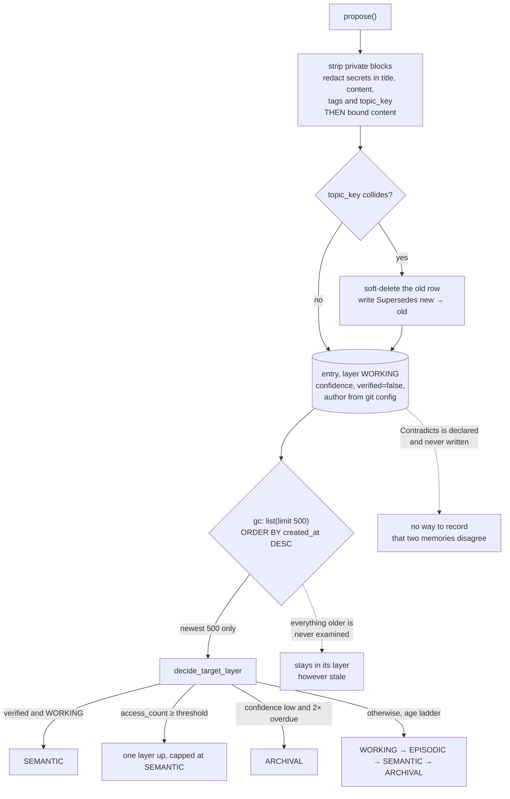

## 1. Executive Summary

RunarForge is a memory product for coding agents — one static Rust binary,
54,895 lines in a single crate named `muninn`, MIT, **694 tests**, SQLite or
Postgres, twenty-two MCP tools, and a CLI that any MCP-aware editor can mount.
It is named for Odin's ravens and split accordingly: Huginn crawls the codebase
and builds a dependency graph, Muninn stores and ranks and graduates, and a
Curator answers questions by assembling context from both.

The memory model is four layers — working, episodic, semantic, archival — with
entries moving between them on a schedule, decaying on an exponential curve, and
carrying an unusual amount of epistemic furniture: a `confidence` float with a
named preset vocabulary (verified 1.0, observed 0.9, inferred 0.7, speculative
0.4), a separate owner-endorsed `verified` boolean with its own timestamp and
`verified_by`, an `author` resolved from `git config user.name`, and a typed
edge table with five relation kinds.

**The finding is that the graduation sweep is pointed away from the material it
exists to move.** `graduate_layers_inner` fetches candidates with
`ListFilters { limit: Some(500), .. }`, never sets the `offset` that
`ListFilters` provides, and no caller loops. `list` ends in
`ORDER BY created_at DESC LIMIT … OFFSET …`. Graduation is an aging ladder
driven by days since last access, so the entries that need demoting to archival
are the oldest ones — and in any namespace past five hundred entries those are
precisely the rows the sweep can never reach. The mechanism reads the newest
five hundred, forever.

**The second finding is a vocabulary that is mostly unwired.** `EdgeType`
declares `Supports`, `Contradicts`, `Supersedes`, `Elaborates` and `Related`.
`Supersedes` is constructed on dedup and asserted in tests; `Related` is written
by the auto-linker. `Contradicts`, `Supports` and `Elaborates` each appear
exactly once in the whole crate — in the enum that declares them. Nothing
constructs them and nothing reads them. So a system with a confidence scale, a
verification flag, human attribution and a supersession graph still has **no way
to record that two memories disagree**, and it has named the edge that would do
it.

What is genuinely good here is the write path and the honesty. `propose` is a
single chokepoint through which MCP saves, prompt capture, extraction and the
crawler all pass, and it strips `<private>` blocks, redacts secret patterns from
title, content, tags *and* the caller-supplied topic key, and bounds content —
in that order, because "truncating first could cut a secret in half and hide it
from the matchers". Supersession soft-deletes the old row so every read excludes
it and writes a `Supersedes` edge so the lineage keeps it.

And the codebase writes its own postmortems into the comment above each fix,
with counts. That habit is rare enough to be a finding in itself, and section 9
takes it seriously.

## 2. Mental Model

A memory is an **entry**: a title and content, an `EntryType`, a
`MemorySource` of `Human`, `Agent`, `Scout` or `System`, tags, a namespace, an
optional `project_id` and `topic_key`, a `MemoryLayer` of 1–4, `importance`,
`decay_score`, `access_count`, `injected_count`, `confidence`, `verified`,
`author`, `verified_by`, four timestamps and a `deleted_at`.

The layer is the state, and four rules move an entry between layers
(`decide_target_layer`):

1. **Verified fast-promote** — a `verified` entry in WORKING jumps straight to
   SEMANTIC.
2. **Hebbian citation bump** — `access_count` past `citation_threshold` promotes
   one layer, up to SEMANTIC.
3. **Low-confidence aggressive demote** — an entry below
   `low_confidence_threshold` that has gone untouched for twice its layer's
   threshold drops directly to ARCHIVAL.
4. **Standard age ladder** — otherwise, WORKING → EPISODIC → SEMANTIC →
   ARCHIVAL on days-since-access thresholds.

That is a real epistemic state machine, and rules 1 and 3 are the interesting
ones: human endorsement short-circuits the ladder upward, and low confidence
short-circuits it downward at double speed. Belief and age are both inputs, and
they can disagree.

Death has two paths and one of them is reversible in principle. A **topic-key
collision** on `propose` soft-deletes the prior entry — `deleted_at` set, every
normal read filtered on `deleted_at IS NULL` — and writes `Supersedes` from new
to old, so the superseded value is unreachable by search and reachable by
lineage. **Deprecation** is the same soft delete without a replacement. Nothing
is hard-deleted on the ordinary path, and nothing records a *rejected value*, so
an entry removed by dedup can be re-proposed from the same source with no
memory that it was displaced.

Confidence is a float with names attached, not a state. `verified` is a boolean
with attribution. Neither can express *rejected*, and the edge that could
express *disagrees with* is never written — which is why this report withholds
`trust_state` despite the system having more trust machinery than most things
here.

## 3. Architecture

One crate, `crates/muninn`, with a thin npm wrapper in `packages/cli-wrapper`
that fetches the platform binary. Subsystems:

- **`librarian/`** (3,268 lines) — the core: `propose`, `deprecate`, search,
  `recall_for_prompt`, decay, graduation, edges, sessions, the observation
  queue, `mark_verified`, outbox enqueue.
- **`storage/`** — `sqlite.rs` (5,375) and `postgres.rs` (3,121) behind one
  trait, with numbered SQL migrations.
- **`huginn/`** — the crawler: `crawl.rs`, `git.rs`, `analysis/file_analyzer.rs`,
  `analysis/pattern_extractor.rs`, a benchmark harness.
- **`codegraph/`** — `resolve.rs` (2,323), `store.rs` (2,234), `refresh.rs`,
  `freshness.rs`, and tree-sitter extractors per language.
- **`curator/`** — natural-language question answering over memory.
- **`mcp/`** (2,824) — twenty-two tools.
- **`embedding/`**, **`sync/`**, **`redact.rs`**, **`extract.rs`**,
  **`hooks_runtime.rs`**, **`maintenance.rs`**, **`doctor.rs`** (1,620),
  **`setup.rs`** (1,868), **`wizard.rs`**.

Storage is a memory-entry table with FTS and embeddings, an edge table, a
sessions table, a `debug_log` (migration 005), an observation queue and a sync
outbox. The outbox exists for hybrid mode: a local SQLite store that drains
row payloads to a remote Postgres.

### Deployment and ergonomics

- **One static binary, no runtime.** ~16 MB on macOS arm64, ~70 MB with bundled
  local embeddings — so semantic search can run with no API key and no service.
- **SQLite by default**, Postgres for the shared case, hybrid via
  `RUNAR_STORAGE_LOCAL` with an outbox between them.
- **The store is a database, not files** — inspectable with any SQLite client,
  not hand-editable the way a markdown tree is.
- Setup is a wizard (`setup.rs`, `wizard.rs`) that writes the MCP config for
  whichever editors it finds, and there is a `doctor` with 1,620 lines of
  diagnostics.
- Operator surface: `runar gc` with `--dry-run` that previews planned layer
  transitions without mutating, `sync repair`, `merge_projects`, and a debug log
  behind `RUNAR_DEBUG=true`.

The screen of this checkout found **no auto-run surfaces, no build-time
execution and no unpinned manifests**, with `Cargo.lock` present and four
dependency surfaces inside the seven-day cooldown. That is the cleanest screen
of anything read for this atlas recently. A `CLAUDE.md` is present and was read
as data. Nothing was installed and nothing was built or run.

## 4. Essential Implementation Paths

- **Write chokepoint** — `Librarian::propose` at `librarian/mod.rs:125`:
  `strip_private`, `redact_secrets` over title, content and each tag, then
  `scrub` on `topic_key`, then `bound_content`, then author stamping, then save,
  then synchronous embedding, then the `Supersedes` edge, then the outbox
  enqueue.
- **Supersession** — `librarian/mod.rs:220`, writing `EdgeType::Supersedes`
  from the new entry to `result.superseded`.
- **Dedup lookup** — `storage/sqlite.rs:387` on `namespace + content_hash`, and
  `:414` on `namespace + topic_key`, both filtered `deleted_at IS NULL`.
- **Soft delete** — `Librarian::deprecate` at `librarian/mod.rs:265`, which
  deletes first and *then* snapshots through `get_including_deleted`.
- **Decay** — `compute_decay_score` at `:961`:
  `base_weight * exp(-lambda * days_since) + access_boost`, clamped to `[0,1]`,
  with a lower `base_weight` for ARCHIVAL.
- **Graduation** — `graduate_layers_inner` at `:990` and `decide_target_layer`
  at `:1447`.
- **List** — `storage/sqlite.rs:694` onward, `WHERE namespace = ?1 … ORDER BY
  created_at DESC LIMIT {} OFFSET {}`.
- **Verification** — `mark_verified` at `librarian/mod.rs:1124`, resolving
  `verified_by` from `identity::resolve_author()`.
- **Recall** — `recall_for_prompt` at `:547` and `fused_search` at `:525`.
- **Edges** — `save_edge`, `get_edges`, `delete_edge` at `:1037`–`:1049`; the
  auto-linker writes `EdgeType::Related` at `:1538`.
- **Observation queue** — `enqueue_observation`, `claim_observations`,
  `confirm_observations`, `recover_stale_observations` at `:1080`–`:1105`.
- **Debug log** — `write_debug_log` at `storage/sqlite.rs:1100`, gated by
  `debug::enabled()` reading `RUNAR_DEBUG`.
- **MCP dispatch** — `mcp/mod.rs:285` onward.

## 5. Memory Data Model

`MemoryEntry` carries more per-row epistemic state than almost anything in this
atlas:

| Field | Meaning |
| --- | --- |
| `layer` | 1–4, working through archival, clamped on construction |
| `importance`, `decay_score` | ranking inputs, decay recomputed by `gc` |
| `access_count` | ranked-search hits; feeds the Hebbian promote and the decay boost |
| `injected_count`, `last_injected_at` | automatic-recall injections, **reporting only** |
| `confidence` | float, with presets verified 1.0 / observed 0.9 / inferred 0.7 / speculative 0.4 |
| `verified`, `verified_at`, `verified_by` | owner endorsement, its time, and who did it |
| `author` | proposer, from `git config user.name`, NULL for agent-origin rows |
| `topic_key` | the supersession key |
| `deleted_at` | soft delete; every normal read filters it out |

**The split between `access_count` and `injected_count` is the schema's best
moment, and the comment on it is the reason.** Verbatim:

> Separate from `access_count` (ranked search) on purpose: one counter for two
> channels is what let "95.9% never retrieved" stand for three months while
> 15,819 injections went unrecorded. Reporting only — deliberately not an input
> to ranking or decay.

Two decisions in three lines: split the counter because one number over two
channels produced a headline statistic that was false, and then keep the new
counter *out of ranking and decay* so that a memory injected automatically does
not thereby become more likely to be injected again. The second half is the part
most systems get wrong — [Reflexion](../reflexion/) and the retrieval-boost
designs in this corpus all close that loop without noticing.

**Scoping** is `namespace`, and it is applied as `WHERE namespace = ?1` on
`list`, on both dedup lookups, on topic-key reads and on the search paths —
a stored scope key filtered on the read path, which earns `scope_enforced`.
`project_id` and `topic_key` sit beneath it, and `merge_projects` exists to fold
one namespace into another with a preview.

There is no bitemporality: `created_at`, `updated_at`, `last_accessed_at` and
`deleted_at` are all record time.

## 6. Retrieval Mechanics

Fused lexical and vector search — FTS5 over entry text plus embeddings, which
can be local (bundled, no key) or remote. Ranking multiplies in a **1.25×
verified bonus**, and the tests assert its direction rather than its value:
*"verified entry must outrank speculative peer"*, and separately that the bonus
"cannot recover" an entry below a relevance floor — so the bonus is a tiebreak
among plausible results, not an override.

Decay feeds ranking through `decay_score`, and `access_count` feeds decay
through a capped boost. `injected_count` feeds neither, by design.

Edge traversal is a **separate surface**, not a fused arm: `muninn_related`
walks the edge table from an entry. So the graph is queryable on demand and
does not influence ranked search — which means a `Supersedes` chain is visible
to an agent that asks and invisible to one that searches. Since supersession
also soft-deletes the old row, that is the right call, and it leaves `Related`
edges doing nothing for relevance.

The failure mode worth naming is what the layer model does *not* do at read
time: nothing in the ranked path filters or weights by `layer`. An entry
demoted to ARCHIVAL gets a lower `base_weight` in the decay computation and is
otherwise a normal search result. Graduation therefore changes a number, not a
visibility — so the four-layer taxonomy is a decay-rate schedule wearing the
vocabulary of a tiered store.

## 7. Write Mechanics

Everything funnels through `propose`, and the ordering inside it is the design.
`<private>…</private>` blocks are stripped first; secret patterns are redacted
from title, content and each tag; the caller-supplied `topic_key` is scrubbed
separately because — the comment again — a secret pasted into it "outlived the
scrubbing of every other field. Only the *derived* key was clean, because that
one is built from an already-redacted title." Content is bounded **after**
redaction, because truncating first "could cut a secret in half and hide it from
the matchers". Each of the three outcomes tags the row: `redacted`,
`redacted:secret`, `truncated` — so the fact that a memory was modified on the
way in is itself stored and searchable.

That is one chokepoint covering MCP save, prompt capture, extraction and the
crawler, with the hazard ordering reasoned out in comments. It is the strongest
write-path hygiene in this atlas.

Writes are synchronous, including the embedding: `propose` awaits
`embedding.embed()` before returning, so a memory is semantically searchable the
moment it is saved and the caller pays the embedding latency. With local
embeddings bundled in the binary that is a defensible trade.

Deduplication is two-level: a `content_hash` match within a namespace, and a
`topic_key` match. The topic-key path is the supersession path. Without a topic
key, two entries stating opposite things both persist, with nothing relating
them — which is where the missing `Contradicts` edge would earn its keep.

Background work is `runar gc`: recompute decay, then graduate layers. Its
`--dry-run` returns the planned transitions without mutating, which is the right
affordance for a destructive-feeling operation and is rare here. The sync outbox
drains separately, with a dead-letter cap and a `sync repair` path.

## 8. Agent Integration

Twenty-two MCP tools, and the breadth is the product: `muninn_save`,
`muninn_search`, `muninn_context`, `muninn_get`, `muninn_related`,
`muninn_timeline`, `muninn_stats`, `muninn_verify`, `muninn_capture_passive`,
session start/end, `muninn_merge_projects`, `muninn_debug`, a four-tool icebox
and a five-tool plan surface.

The agent has broad agency: it can save, search, verify, and manage sessions,
plans and an icebox. There is no delete tool in the MCP set — deprecation is a
CLI and internal path — so the model can add and endorse but not retract, which
is the [memoir](../memoir-cli/) shape.

Automatic recall runs through `recall_for_prompt` and a hook runtime, and this
is where `injected_count` comes from: entries served into context by a PreToolUse
hook rather than by a model's search. The `Injection` debug event records which
entries were injected, how many, how large and how long it took.

`muninn_verify`'s description tells the model when to use it: *"Use when
reviewing an agent-generated memory that is accurate and worth surfacing
first."*

## 9. Reliability, Safety, and Trust

**The trust machinery is extensive and stops one step short.** There is a
confidence float with a named vocabulary, an owner-endorsed flag with its own
timestamp and attribution, a proposer recorded from git config, and a
supersession graph. What there is not is a *rejected* state or any way to relate
two entries that conflict, so the `trust_state` mark is withheld. The near-miss
is precise: `verified` is a two-valued flag, and the enum member that would make
it three — `Contradicts` — is declared and never written. A system can say "this
is endorsed" and "this replaced that", and cannot say "this is wrong" or "these
two disagree".

**`human_review` is earned, with a caveat that should be read alongside it.**
`muninn_verify` is an explicit endorsement surface, `verified_by` records who
performed it from `git config user.name`, and it is separate from `author` so
proposer and endorser are distinguishable. The caveat is that the only surface
is an MCP tool — no CLI `verify` subcommand exists at this commit — so the
*caller* can be the same agent that wrote the memory, while the *attribution*
records whichever human's git config is configured. That is the
self-endorsement hazard [Open Second Brain](../open-second-brain/) has in its
counters, relocated to a review flag, and it means a verified entry attests to a
review having been requested rather than performed.

**`audit_log` is withheld, and two near-misses are why.** The `debug_log` table
is append-only and records real memory mutations — `LayerGraduation`,
`DedupDecision`, `TouchPromotion`, `Injection`, `SearchScoring`, `DecayCompute`,
`AutoLink` — but it is gated on `RUNAR_DEBUG=true`, off by default, and
`prune_debug_log(older_than_days)` exists to age it out. It is a diagnostic
channel, not a record of what the store did. The sync outbox is append-only and
carries full row payloads for every Create, Update and Delete, but its purpose
is a replication queue that gets drained.

**`negative_eval` is withheld for a reason worth stating**, because the tests
look like the mark and are not. `test_propose_redacts_private_content` and
`test_propose_redacts_secret_patterns` assert that a secret does not appear in
`entry.content` — material kept out of a *write*. The atlas draws that line
explicitly: keeping material out of a write is a different and weaker thing than
asserting it must not be *retrieved*. No test here indexes something, searches
for it, and asserts absence.

**Provenance is the strongest in its class.** Every entry knows its source
category, its human proposer where one exists, its endorser, its redaction
history via tags, and its supersession lineage via edges. That is more than any
markdown-based system here can offer, and it is the payoff for storing rows
rather than files.

**The graduation cap is a correctness bug, not a tuning choice**, and it is
worth stating separately from the finding because of what it interacts with.
Rule 3 — low-confidence aggressive demote — is the mechanism that clears
speculative material out of the ranked set. It runs only over the newest five
hundred entries. So in a mature namespace, the low-confidence entries most
overdue for archival are the ones the rule cannot see, and they keep their
`base_weight` of 1.0 in the decay computation indefinitely.

Concurrency is handled with an observation queue that supports claim, confirm
and stale-recovery, and the outbox has a dead-letter cap. Redaction is described
in its own comment as "best-effort privacy hygiene; not a security boundary",
which is the correct disclaimer for regex secret matching.

## 10. Tests, Evals, and Benchmarks

**694 tests in the crate**, and they are written against behaviour rather than
coverage: the supersession test asserts the edge direction, the ranking tests
assert that a verified entry outranks a speculative peer *and* that the bonus
cannot rescue an entry below the relevance floor, and the author test asserts
that an explicit `author` survives propose → storage → get while
`mark_verified` sets `verified_by` "without disturbing `author`".

`huginn/benchmark.rs` is a crawler benchmark — throughput of the scout, not
retrieval quality.

What is missing is the pair a reader would most want. **Nothing tests
graduation at scale**: there is no case with more than five hundred entries in a
namespace, which is exactly why the cap survives. And there is no
retrieval-quality evaluation of any kind — no dataset, no recall measurement, no
negative case — so the 1.25× verified bonus, the decay lambda, the access boost
cap and the four graduation thresholds are all unmeasured constants with tests
that assert their direction and nothing that assesses their value.

## 11. For Your Own Build

### Steal

**Split your counters by channel, and keep the new one out of ranking.** One
counter over ranked search and automatic injection produced a false headline
statistic here for three months. Splitting it fixed the reporting; refusing to
feed the injection counter back into ranking or decay is what stops automatic
recall from becoming self-reinforcing.

**Put redaction on one chokepoint, and order it before truncation.** Every write
path through one function, `<private>` blocks and secret patterns stripped from
every caller-supplied field including the ones that look like keys, and the
bound applied afterwards so a truncation cannot hide half a secret from the
matcher. Then tag the row so the redaction is itself a fact you can query.

**Supersede by soft-delete plus an edge.** The old row leaves every read because
reads filter `deleted_at IS NULL`, and the lineage survives because the edge
points new → old. You get correct retrieval and a recoverable history from two
writes.

**Give a destructive maintenance pass a `--dry-run` that returns the plan.**
`runar gc --dry-run` lists the layer transitions it would make and mutates
nothing. Anything that reclassifies or deletes in bulk should be previewable.

**Distinguish the proposer from the endorser.** `author` and `verified_by` are
separate columns, and one test exists specifically to assert that verifying does
not overwrite authorship.

**Write the postmortem into the comment above the fix.** See below — it is the
most transferable thing in this repository and it costs nothing.

### Avoid

**Do not page a maintenance sweep by recency when the sweep is about age.**
`LIMIT 500 ORDER BY created_at DESC` over an aging ladder selects exactly the
rows that least need processing. If a background pass must be bounded, bound it
by the property it acts on, or paginate to exhaustion, or process oldest-first.

**Do not declare a vocabulary you do not wire up.** Three of five edge types
here are never constructed and never read. A reader — and a future maintainer —
reasonably infers that a system with a `Contradicts` edge can represent
contradiction, and this one cannot.

**Do not let a layer taxonomy imply a retrieval boundary it does not have.**
Nothing in the ranked read path filters or weights on `layer`; archival entries
are ordinary results with a lower decay base. The four names promise a tiered
store and deliver a decay schedule.

**Do not ship a review flag whose only caller can be the thing being
reviewed.** If verification grants a ranking bonus and a graduation
fast-promote, the surface that grants it needs an actor the memory's author
cannot be.

### Fit

This suits a developer who wants durable, structured, queryable memory across
several coding tools and is content for it to live in a database rather than in
files. The one-binary, no-runtime, local-embeddings-included deployment is the
best in this atlas for that use case, the write-path hygiene is the best full
stop, and 694 tests over 55,000 lines is a real maintenance signal.

Walk away if you want memory you can edit in a text editor and diff in git —
this is rows, and the markdown-tree systems serve that better. Walk away if you
need contradiction handling, because the type exists and the mechanism does not.
And if your namespaces will exceed five hundred entries, treat graduation as
non-functional until the cap is paginated: the store still works, but the layer
field stops meaning what the documentation says it means.

## 12. Open Questions

- Is the 500-entry graduation limit a deliberate bound with pagination intended
  elsewhere? `ListFilters::offset` exists and is unused by this caller.
- Were `Contradicts`, `Supports` and `Elaborates` wired up previously, or
  reserved for future use? Nothing in the tree constructs them at this commit.
- Is there a non-MCP path to `mark_verified`? No CLI subcommand appears here,
  which decides whether the review surface has a human in it.
- What are the shipped values of `lambda`, `citation_threshold`,
  `low_confidence_threshold` and the four graduation thresholds, and were any of
  them measured? They live in `DecayConfig` and nothing evaluates them.
- Does the remote in hybrid mode enforce the same namespace scoping the local
  reads apply? The outbox pushes rows; the read-side story on the remote is not
  in this crate.
- How often is the `95.9%` statistic in the `injected_count` comment now
  recomputed, and against which counter?

## Appendix: File Index

**Core**

- `crates/muninn/src/librarian/mod.rs` — `propose`, `deprecate`, `mark_verified`, `compute_decay_score`, `graduate_layers_inner`, `decide_target_layer`, `fused_search`, `recall_for_prompt`, edges, observation queue, outbox.
- `crates/muninn/src/types.rs` — `MemoryEntry`, `MemoryLayer`, `EdgeType`, `DebugEvent`, `ListFilters`, `resolve_confidence`.

**Storage**

- `crates/muninn/src/storage/sqlite.rs` — schema, `list`, dedup lookups, `write_debug_log`, FTS.
- `crates/muninn/src/storage/postgres.rs` — the shared backend.
- `crates/muninn/src/storage/sql/005_add_debug_log.sql` — the debug table.

**Write hygiene**

- `crates/muninn/src/redact.rs` — `strip_private`, `redact_secrets`, `scrub`.
- `crates/muninn/src/identity.rs` — `resolve_author`.

**Scout and graph**

- `crates/muninn/src/huginn/` — `crawl.rs`, `git.rs`, `analysis/`, `benchmark.rs`.
- `crates/muninn/src/codegraph/` — `resolve.rs`, `store.rs`, `refresh.rs`, `freshness.rs`, `extract/`.

**Agent surface**

- `crates/muninn/src/mcp/mod.rs` — twenty-two tools and their descriptions.
- `crates/muninn/src/hooks_runtime.rs`, `src/curator/mod.rs`.

**Operations**

- `crates/muninn/src/maintenance.rs`, `src/doctor.rs`, `src/setup.rs`, `src/wizard.rs`, `src/sync/`.

## History

**2026-08-14** — [`682248790ee1a6d916bd70a910d765be975270aa`](https://github.com/crlome/runar-forge/commit/682248790ee1a6d916bd70a910d765be975270aa) — first reading, at release 0.19.0 dated 11 August 2026. Screened before opening: no auto-run surfaces, no build-time execution, no unpinned manifests, `Cargo.lock` present, four dependency surfaces inside the seven-day cooldown, and a `CLAUDE.md` read as data. Nothing was installed and nothing was built or run; the graduation cap was established by reading the caller against `list`'s `ORDER BY`, not by observing a store.
