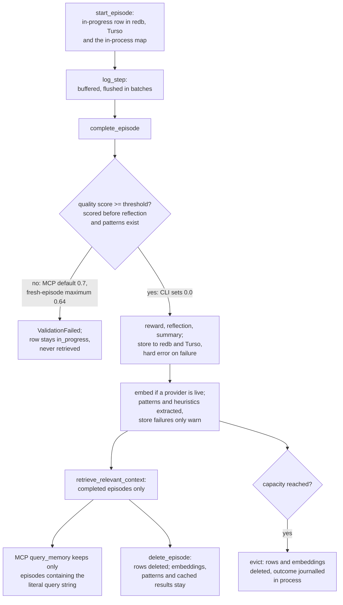

## 1. Executive Summary

Rust Self-Learning Memory is a Rust workspace — a core library, two storage
crates, an MCP server and a CLI — that records a coding agent's work as
*episodes*. An episode is a task, its context, the tool steps taken and an
outcome. Completing one scores it, writes a rule-based reflection, and extracts
reusable *patterns*: tool sequences, decision points, error recoveries and
context rules. Later tasks retrieve similar episodes, patterns and generated
playbooks.

What is notable is that no step calls a language model. Reward, reflection,
salient-feature extraction, summaries, patterns and playbooks are all
deterministic, so capture cannot fail on a provider outage. Around that core
sits careful plumbing: the episode store hard-errors instead of warning, and
cache keys and the ANN index carry the embedding provider's identity.

What is weak is the lifecycle at its two ends. The shipped MCP server runs with
a quality threshold its own gate cannot be passed at, because two of the five
scored features are computed after the gate. Explicit deletion removes the
episode row and leaves its embeddings, derived patterns and cached results.

The pin is [`67edf6ce27e7bb75052171790296b4be065a238a`](https://github.com/d-o-hub/rust-self-learning-memory/commit/67edf6ce27e7bb75052171790296b4be065a238a),
a merge dated 29 September 2026. Triage recorded
[`9f50c607a9758e39ab0889e94ced4d2b74ef50c2`](https://github.com/d-o-hub/rust-self-learning-memory/commit/9f50c607a9758e39ab0889e94ced4d2b74ef50c2)
from 28 September; the head had moved by the time of cloning.

The `LICENSE` file is the MIT text with the copyright line *"Copyright (c) 2019
Zachary Rice"*, while `Cargo.toml` declares `license = "MIT"` for *"Self-Learning
Memory Contributors"*. The grant is MIT either way; the named holder does not
match the project.

The README's headline retrieval feature, a four-tier *"CSM Cascading
Retrieval"* over BM25, hyperdimensional vectors, a concept graph and API
embeddings, is a library type (`memory-core/src/retrieval/cascade/`) that the
retrieval benchmark and the CLI's `eval benchmark` construct. The retrieval an
agent receives through MCP or the library is a different function (section 6).

One mark, `negative_eval`, on a test asserting that a capacity-evicted episode
is not returned while the survivor is. Section 9 names the six withheld.

## 2. Mental Model

A memory is an episode, and it becomes retrievable only by completing. Nothing
is extracted from conversation: the agent, or code driving it, calls
`start_episode`, logs steps, and calls `complete_episode` with a verdict. The
derived records — patterns, heuristics, summaries, playbooks — are computed from
completed episodes and stand for *"this worked before"*.

**States.** `start_episode` writes an in-progress episode to both backends and
the in-process map (`memory-core/src/memory/episode.rs:94-108`). Retrieval takes
only `is_complete()` episodes (`memory/retrieval/context.rs:213-218`). So an
episode has two states, in progress and complete, and the first is withheld from
every retrieval tier. That is a lifecycle filter rather than a belief status: an
in-progress episode is unfinished, not doubted.

**The gate between them.** `complete_episode` computes a quality score before
anything else and refuses to store the episode below `quality_threshold`
(`completion.rs:141-166`). A refused episode keeps its in-progress row in storage
and in the map, since the completed copy was a local clone that is dropped. The
score is a weighted sum of five features, and two of them read fields the same
function fills only afterwards (section 7).

**Outcome is not truth.** A `Failure` outcome is stored and retrieved like a
success; reward and success rate rank it lower. Patterns carry `success_rate` and
an `effectiveness` score that move with use and feedback, and both are ranking
inputs (`patterns/types.rs:155-197`). Nothing marks a pattern as wrong, and
nothing stops one being re-extracted.

**How a memory stops being one.** Delete removes the episode row. Capacity
eviction removes the row and its embeddings. Archive sets a metadata key that only
the list filter reads. Nothing decays out of the store: `pattern decay` prints a
removal it does not make (section 7).

## 3. Architecture

Nine workspace members (`Cargo.toml`). The memory is in `do-memory-core`
(`memory-core/`); `do-memory-storage-turso` wraps libSQL; `do-memory-storage-redb`
is an embedded key-value cache; `do-memory-mcp` is the JSON-RPC server;
`do-memory-cli` is the command line. `SelfLearningMemory` holds an in-process
`episodes_fallback` map, an optional cache backend and an optional durable
backend, and every read goes through the map first (`memory/episode.rs:404-423`).

**Storage selection in the MCP server** tries, in order, a named mode, a local
Turso file, remote Turso plus redb, redb alone, and finally in-memory storage,
with only a `warn!` for the last (`memory-mcp/src/bin/server_impl/storage.rs:25-94`).
A server whose database path is unwritable therefore serves a memory that
vanishes at exit. Every path builds `MemoryConfig::default()` (`storage.rs:49`,
`:130`, `:188`, `:266`).

**Durable writes** are synchronous by default. `MemoryConfig::durable_write_queue`
moves the Turso write behind a bounded queue, and backpressure is an error
(`completion.rs:14-27`). Pattern extraction is synchronous unless
`enable_async_extraction` starts a worker pool (`completion.rs:451-466`).

**Schema.** Turso tables `episodes`, `patterns`, `heuristics`, per-dimension
`embeddings_*`, `episode_summaries`, `episode_tags`, `episode_relationships`,
`episode_pattern_relationships`, `procedural_memory` and two recommendation tables
(`memory-storage-turso/src/schema/mod.rs`). Several declare `ON DELETE CASCADE`,
and nothing in the tree issues `PRAGMA foreign_keys`, which SQLite leaves off by
default. Whether libSQL enforces those clauses on a connection that never enables
them was not checked.

**Embeddings** are off by default (`enable_embeddings: false`, `types/config.rs:229`).
Providers are OpenAI, Mistral and local ONNX, each behind a Cargo feature.

### Deployment and ergonomics

One binary for the MCP server and one for the CLI, from release archives or a
`cargo build`; the default store is a local libSQL file and needs no account or
key. Remote Turso needs `TURSO_DATABASE_URL` and `TURSO_AUTH_TOKEN`. Episodes are
JSON columns in SQLite, readable and repairable with any SQLite client. redb is
binary postcard and is not.

## 4. Essential Implementation Paths

**Start and log.** `start_episode` (`memory/episode.rs:63`) validates, stores to
cache and Turso with warnings on failure, and inserts into the map (`:94-108`).
`log_step` buffers into `step_buffers`, flushed at 50 steps or 5,000 ms by
default (`memory/step_buffer/config.rs:46-54`).

**Complete.** `complete_episode` (`memory/completion.rs:107-491`): flush steps,
clone the episode, `complete()` it, run the quality gate (`:141-166`), extract
salient features, compute reward and reflection (`:186-200`), summarise
(`:213-233`), evict for capacity (`:240-317`), store to both backends with a hard
error on either failure (`:328-357`), index spatiotemporally, embed and upsert
the ANN index (`:403-426`), invalidate the whole query cache (`:431-440`), then
extract patterns (`:451-466`).

**Extract.** `extract_patterns_sync` (`memory/learning.rs:13-110`) runs the rule
extractors, stores each pattern and heuristic to both backends with warnings on
failure, and re-persists the episode with the new ids.

**Retrieve episodes.** `retrieve_relevant_context` (`memory/retrieval/context.rs:92`)
checks the query cache (`:104-145`), backfills the map from redb and Turso when
fewer than `limit` completed episodes are in memory (`:149-203`), then tries four
tiers in order: hybrid ANN (`:231-244`), semantic (`:246-261`), hierarchical
(`:267-319`), legacy keyword (`:321-378`). MMR diversity follows on the
hierarchical tier (`:383`).

**Retrieve patterns.** `retrieve_relevant_patterns` (`memory/retrieval/patterns.rs:26-73`)
loads every pattern from storage, ranks, deduplicates and truncates, and records
the retrieval on the in-memory copy.

**MCP query.** `query_memory_with_options` (`memory-mcp/src/server/tools/core.rs:125`)
builds a `TaskContext` from `domain` and `task_type`, calls
`retrieve_relevant_context`, then filters the result to episodes whose
description, step action, parameters or result contain the lowercased query
string (`:188-223`).

**Delete.** `delete_episode` (`memory/management.rs:61-107`) removes the episode
from the map, the step buffer, redb and Turso. The MCP tool requires
`confirm: true` in its arguments (`memory-mcp/src/server/tools/episode_get.rs:98-108`).

**Evict.** `delete_evicted_from_backends` (`memory/eviction.rs:72`) deletes the
episode and its embedding from each backend (`:84-109`) and returns per-backend
failures that `completion.rs:280-298` records in `OperationJournal`.

**Tools.** The dispatcher at `memory-mcp/src/bin/server_impl/handlers/call_tool.rs:69-170`
names 48 tools; `batch_execute.rs` repeats the table for batched calls.

## 5. Memory Data Model

| Record | Fields that matter | Where |
| --- | --- | --- |
| Episode | `episode_id`, `task_type`, `task_description`, `context` (domain, language, framework, complexity, tags), `start_time`, `end_time`, `steps`, `outcome`, `reward`, `reflection`, `patterns`, `heuristics`, `applied_patterns`, `salient_features`, `metadata`, `tags`, `checkpoints` | `episode/structs/mod.rs:130-168` |
| episodes row | the above as JSON columns plus `domain`, `language`, `created_at`, `archived_at` | `schema/mod.rs:5-24` |
| Pattern | `ToolSequence`, `DecisionPoint`, `ErrorRecovery`, `ContextPattern`, each with `context`, a success rate or outcome stats, and `effectiveness` | `patterns/types.rs:155-197` |
| patterns row | `pattern_data` JSON, `success_rate`, `context_domain`, `occurrence_count`, `created_at`, `updated_at` | `schema/mod.rs:33-45` |
| heuristics row | `condition_text`, `action_text`, `confidence`, `evidence` | `schema/mod.rs:49-58` |

**Provenance** is the link from pattern to episode: `ContextPattern.evidence`
holds episode ids, and `episode_pattern_relationships` is a join table. No record
names who wrote it; the MCP audit takes a `client_id` from the tool arguments,
defaulting to `"anonymous"` (`memory-mcp/src/bin/server_impl/tools/mod.rs:58-63`).

**Time.** `start_time` and `end_time` are when the task ran; `created_at` is when
the row was written. There is no validity interval on any derived record, and
`archived_at` is set only by `archive_episode`, which neither the MCP server nor
the CLI calls.

**Scope.** No user, agent, project or tenant key exists on any record. `domain` is
a free-text topic the caller supplies at `start_episode`.

## 6. Retrieval Mechanics

**Which tier answers depends on configuration, and each filters differently.**
The shipped defaults are `retrieval_mode: Keyword`, embeddings off and
spatiotemporal indexing on (`types/config.rs:226-261`), so the hybrid and
semantic tiers return `None` and the hierarchical tier answers.
`filter_by_domain` keeps only episodes whose `domain` equals the query's
(`spatiotemporal/retriever/scoring.rs:18-31`). The legacy tier, reached when the
hierarchical one fails, treats a domain match as one of five OR conditions
beside language, framework, tags and a four-letter word in the description
(`memory/retrieval/scoring.rs:12-45`). The semantic tier has no domain predicate
at all (`embeddings/storage.rs:31-36`).

**What the MCP tool returns is narrower again.** After ranking, `query_memory`
keeps an episode only if the whole query string, lowercased, is a substring of
its description or a step (`tools/core.rs:188-223`). A natural-language query
such as *"handle API rate limiting with retries"* returns an episode only if
those exact words appear together in it, whatever the ranker scored.

**Backfill bounds the candidate set.** When the map holds fewer completed
episodes than `limit`, retrieval loads up to `MAX_QUERY_LIMIT` (1,000) from each
backend (`context.rs:163-203`). Turso returns the newest by `start_time`
(`storage/episodes/query.rs:100-110`), and redb returns the first 1,000 in key
order (`memory-storage-redb/src/episodes_queries.rs:44-53`). In-progress rows
count toward both caps and are then discarded, so a store full of refused
episodes displaces completed ones.

**Caching.** Results are cached for 60 seconds (`retrieval/cache/types.rs:14`),
keyed on the query, the context, the retrieval mode, the provider identity, a
ranking version and an index generation (`context.rs:104-110`). Completion
invalidates everything; delete invalidates nothing.

**Patterns** are not filtered: every stored pattern is ranked on context match,
sample size, success rate and effectiveness (`extraction/utils.rs:31`), then deduplicated.

**The cascade and its evidence stage** — BM25, HDC, concept graph and API tiers,
plus a keep/flag/demote/drop classifier — are constructed only by the
retrieval eval runner (`retrieval/eval/runner.rs:119`) and the CLI's
`eval benchmark`. Their prompt-injection *Flag* and default no-drop policy
(`retrieval/evidence.rs:33-44`) therefore protect a benchmark rather than the
agent's read path.

## 7. Write Mechanics

**Every write is explicit** and no model is called on any of them. Rule-based
reflection, salient features, summaries (`semantic/summary/summarizer.rs:145-157`)
and template playbooks (*"NO LLM on the hot path"*, `memory/playbook/generator.rs:16`)
make capture deterministic.

**The quality gate cannot be passed at the MCP server's default.**
`assess_episode` weights task complexity 0.25, step diversity 0.20, error rate
0.20, reflection depth 0.20 and pattern novelty 0.15
(`pre_storage/quality/types.rs:50-56`; `assessor.rs:85-98`). At the gate,
`episode.reflection` is `None` and scores 0.0, and `episode.patterns` is empty and
scores 0.2 (`assessor.rs:205-232`), because both are filled later in the same
function (`completion.rs:199-200`, `:451-466`). The ceiling is therefore
0.25 + 0.16 + 0.20 + 0 + 0.03 = 0.64. The MCP server uses `MemoryConfig::default()`
with `quality_threshold: 0.7` (`types/config.rs:231`), so by this arithmetic every
`complete_episode` it receives returns `ValidationFailed`. This was read, not
reproduced.

The code around it is consistent with that reading. The CLI sets
`quality_threshold: 0.0` *"to complete minimal episodes"*
(`memory-cli/src/config/storage/mod.rs:314`). Every MCP test that builds a memory sets 0.0, and the
core test named `test_high_quality_episode_accepted` lowers it to 0.5
(`memory-core/tests/premem_integration_test.rs:134`).

**Update** rewrites the description and merges metadata keys
(`memory/management.rs:239-280`). The metadata map is open, so a caller can set
`archived_at` directly.

**Delete reaches less than eviction does.** `delete_episode` removes the episode
row from redb and Turso (`management.rs:89-103`; Turso's body is one `DELETE FROM
episodes`, `storage/episodes/crud.rs:111-129`). It does not delete the embedding,
which eviction does (`eviction.rs:92`, `:109`). Patterns and heuristics extracted
from the episode stay, and so does its vector in the ANN index, whose `remove` is
called only in tests. The query cache is not invalidated, so a cached result
containing the episode is served for up to 60 seconds. The ANN tier resolves hits
against the live map (`retrieval/semantic_retriever.rs:101`), so that tier drops
the vector at read time.

**Pattern decay is a report.** `do-memory-cli pattern decay --force` lists
patterns below 0.3 effectiveness, warns *"This will permanently remove
ineffective patterns"* and prints *"Successfully decayed N"* (`memory-cli/src/commands/pattern/core/decay.rs:164-167`,
`:199-202`). The comment between them reads *"in real implementation, this would
remove from storage"* (`:186`), and nothing is removed.

**Agent-written content is trusted as given.** The verdict, the steps and the
outcome come from the caller; nothing checks that a claimed success happened.

### Operational cost

- Write: synchronous, with no model call. Completion blocks on both storage writes
  unless the durable queue is on, and on pattern extraction unless async workers
  are on. An embedding call is added when a provider is live.
- Lag: none beyond the call; the cache is invalidated on completion.
- Background: optional extraction workers and the write queue; no pass rewrites
  the store.
- Read: bounded by `limit`. Nothing is injected into a prompt by the system, so
  prefix-cache placement is the caller's decision.

## 8. Agent Integration

The agent drives the lifecycle through MCP tools: `create_episode`,
`add_episode_step`, `complete_episode`, `update_episode`, `delete_episode`,
`query_memory`, `search_patterns`, `recommend_patterns`, `recommend_playbook`,
checkpoint and handoff tools, and tag and relationship tools. Tool loading is lazy
(ADR-024). `execute_agent_code` is present and fails closed.

Nothing is automatic. There is no SessionStart hook or context injection shipped
for users; the `.claude/settings.json` in the tree is the project's own
development configuration. The agent must remember to open an episode, log steps
and close it, and must know to query.

**The MCP audit writes to the protocol stream.** `AuditConfig::default()` is
enabled with `AuditDestination::Stdout` (`memory-mcp/src/server/audit/types.rs:64-84`),
and `log_event` emits each entry with `println!` (`audit/core.rs:122-133`). The
server speaks JSON-RPC on stdout (`server_impl/jsonrpc.rs:217-264`) and routes
`tracing` to stderr precisely to keep it clean (`src/bin/memory-mcp-server.rs:39`).
`create_episode`, `complete_episode` and `delete_episode` each call the audit
(`tools/episode_handlers.rs:134`, `:202`, `:238`). Unless `AUDIT_LOG_DESTINATION=file`
is set, audit JSON lines interleave with protocol responses. Read, not
reproduced.

The library is easy to adapt: `SelfLearningMemory` is one struct with a
`StorageBackend` trait, and the CLI and MCP server are thin over it.

## 9. Reliability, Safety, and Trust

**Store failures are handled unevenly, and the asymmetry is deliberate for
episodes only.** A completed episode that fails to store in either backend
aborts completion with an error (ADR-075, `completion.rs:328-357`). A pattern or
heuristic that fails to store is a `warn!` (`learning.rs:42-52`, `:76-86`), and so
is an in-progress episode at start.

**Eviction is reconcilable.** Each backend's delete is attempted, failures are
kept in `pending_eviction_failures` and journalled, and a reconcile path retries
them (`eviction.rs:72-133`; tested in `s14b_partial_eviction_failure_is_reconcilable`).
The journal is a bounded `VecDeque` in process (`op_journal.rs:58-63`), so the
debt it records does not survive a restart.

**Provider identity is carried into caches and the vector index.** Switching the
embedding provider drops incomparable vectors and bumps the cache generation
(`memory/embedding_activation.rs:158`), so a query is never scored against
vectors from another model.

**No protection against injected content on the served path.** The
instruction-like flag lives in the cascade's evidence stage, which the agent's
read path does not run (section 6).

**Uncertainty is numeric only.** Reward, quality, success rate and effectiveness
are floats used for ranking.

Capability marks:

- `negative_eval` — awarded; evidence in section 10.
- `tombstone` — delete is a hard delete of one row, and the quality gate's
  refusal is not recorded. Nothing keyed on a rejected value exists; `tombstone`
  appears nowhere in the tree.
- `trust_state` — no status field on any record. In progress versus complete is a
  lifecycle filter, and the cascade's `EvidenceDisposition` is computed per query
  in a benchmark path and never stored.
- `bitemporal` — `start_time`/`end_time` date the task and `created_at` the row;
  no derived record carries a validity interval.
- `scope_enforced` — no principal key on any record. `domain` is a caller-chosen
  topic, hard-filtered on one of four tiers.
- `audit_log` — two audit loggers and an operation journal, none in the memory
  store. The core logger is disabled by default (`security/audit/types.rs:195-207`).
  The MCP logger writes stdout by default and, with `file`, a rotated file capped
  at ten files of 100 MB that drops lines when its queue is full
  (`audit/types.rs:77-79`; `audit/core.rs:14-17`). Its actor is a caller-supplied string. The journal is
  in process and records evictions, never an explicit delete.
- `human_review` — no review state. The MCP delete's `confirm: true` is a flag the
  caller sets, and the CLI decay prompt guards an operation that does nothing.

## 10. Tests, Evals, and Benchmarks

Nothing was built or run for this report; everything below is from reading the
tree at the pin.

**The negative case that earns the mark.** `s14_capacity_eviction_deletes_from_backends`
(`memory-core/tests/s13_s14_lock_free_durable_eviction.rs:89-146`) completes two
episodes under `max_episodes: Some(1)` and asserts the first was deleted from both
backends, is not returned by `get_episode`, and that the second is (`:132-142`).
Two unit tests assert exclusions on retrieval tiers. `test_reconcile_drops_vectors_for_new_provider`
retrieves an episode, switches provider, and asserts *"stale vectors from the
previous provider must not be returned"* (`retrieval/semantic_retriever_identity.rs:318-350`).
`test_domain_filtering` asserts a `backend` episode is excluded while two
`web-api` episodes are kept (`spatiotemporal/retriever/tests.rs:47-68`).

**Two e2e targets compile and run nothing.** `tests/e2e/mcp_tag_chain.rs` and
`tests/e2e/mcp_episode_chain.rs` are written as `harness = false` binaries — plain
`async fn` cases called from a `fn main` (`mcp_tag_chain.rs:522-540`) — and
registered with `harness = true` (`tests/Cargo.toml:148-151`). With the libtest
harness, a user `main` is not the entry point and neither file has a `#[test]`, so
both report zero tests. The best negative case in the tree is inside one:
`test_mcp_tag_based_episode_filtering` seeds four tagged episodes and asserts a
tag search includes two and excludes two (`mcp_tag_chain.rs:412-467`). Read, not
reproduced.

**Tests configure around the gate.** 122 occurrences across 51 files set
`quality_threshold` below 0.7, and the MCP tests that build a memory all use 0.0, so no test
exercises the server's own configuration. The `complete_episode` doctest
(`completion.rs:69-104`) declares `async fn example()` and never calls it, so it
compiles and asserts nothing. The relationship suite's `complete_test_episode`
helper, which would complete under the default, is `#[allow(dead_code)]`
(`memory-core/tests/relationship_integration.rs:28-39`).

**Retrieval benchmark.** `benches/fixtures/retrieval_benchmark_corpus.json` holds
15 documents and 15 queries, and `retrieval_baseline.json` records recall@1 of
1.0 for every strategy, all answered by the BM25 tier, at round latencies (p50 50
µs, p95 200 µs). It measures the cascade, not `retrieve_relevant_context`. The
README's *"50-70% reduction in external API embedding calls"* has no artifact
behind it in the tree; the baseline records zero embedding calls.

**Other suites.** 173 tests are `#[ignore]` and run nightly with
`--run-ignored only` (`.github/workflows/nightly-tests.yml:149`). Property tests,
snapshot tests, a soak suite and cargo-mutants runs are committed. Not covered:
explicit delete followed by retrieval, the MCP server's default configuration,
and the stdout audit.

**Papers.** The plans under `plans/` cite third-party papers the features are
named for — PREMem and GENESIS among them — and arXiv ids in research notes. None
is the project's own, the README has no citation block, and there is no
`CITATION.cff`. Whether the five-feature gate matches PREMem's method was not
assessed.

## 11. For Your Own Build

### Steal

- **Keep the write path free of model calls** and derive reflection, features and
  procedures by rule, so capture never depends on a provider.
- **Put the embedding provider's identity in every cache key and on the vector
  index**, and drop incomparable vectors on a switch rather than scoring across
  models.
- **Fail completion when the durable store fails**, and say in the error which
  backend did.
- **Record per-backend outcomes of a multi-store delete** and keep a reconcile
  path for the ones that failed — then persist that record.

### Avoid

- **Scoring a record on fields the same call fills later.** A gate placed before
  the enrichment it measures cannot pass, and test configurations that lower the
  threshold hide it.
- **Two delete paths with different reach.** Route explicit deletion through the
  same function eviction uses, and invalidate caches on both.
- **A command that reports work it did not do.** A no-op should say it is one.
- **An audit logger whose default sink is the protocol's own stream.**
- **Test binaries whose harness setting contradicts their shape.** A target that
  reports zero tests should fail the build.

### Fit

This suits a team that wants coding-agent runs recorded as structured episodes
and mined deterministically for tool sequences, and that will drive the lifecycle
from its own harness through the library or the CLI. It does not suit anyone
expecting an agent to learn through the shipped MCP server without first setting
the quality threshold, or anyone who needs deletion to reach derived records.
The workspace is large for what reaches the agent, so a reader should budget for
working out which of its subsystems are on the served path.

## 12. Open Questions

- Does the MCP server reject every fresh episode in practice? The arithmetic says
  so; running one `create_episode`/`complete_episode` pair would settle it.
- Do MCP clients tolerate the audit JSON lines on stdout, or drop the session?
- Does libSQL enforce the `ON DELETE CASCADE` clauses without `PRAGMA
  foreign_keys`, locally and on Turso's hosted service?
- Do orphaned embedding rows surface through Turso's similarity search after an
  explicit delete? `storage/search/episodes.rs` was not traced.
- Were `mcp_tag_chain` and `mcp_episode_chain` ever run under `harness = false`?

## Appendix: File Index

- **Lifecycle:** `memory-core/src/memory/episode.rs`, `completion.rs`,
  `learning.rs`, `management.rs`, `eviction.rs`, `op_journal.rs`,
  `step_buffer/config.rs`.
- **Scoring:** `memory-core/src/pre_storage/quality/assessor.rs`, `types.rs`;
  `memory-core/src/types/config.rs`.
- **Retrieval:** `memory-core/src/memory/retrieval/context.rs`,
  `context_branches.rs`, `scoring.rs`, `patterns.rs`;
  `memory-core/src/spatiotemporal/retriever/scoring.rs`;
  `memory-core/src/retrieval/semantic_retriever.rs`,
  `semantic_retriever_identity.rs`, `cache/`, `cascade/`, `evidence.rs`,
  `eval/runner.rs`.
- **Storage:** `memory-storage-turso/src/schema/mod.rs`,
  `storage/episodes/crud.rs`, `storage/episodes/query.rs`;
  `memory-storage-redb/src/episodes_queries.rs`.
- **MCP:** `memory-mcp/src/bin/memory-mcp-server.rs`,
  `bin/server_impl/storage.rs`, `jsonrpc.rs`, `handlers/call_tool.rs`,
  `tools/episode_handlers.rs`, `tools/mod.rs`; `memory-mcp/src/server/tools/core.rs`,
  `episode_get.rs`, `audit/`.
- **CLI:** `memory-cli/src/config/storage/mod.rs`,
  `commands/pattern/core/decay.rs`, `commands/eval/mod.rs`.
- **Tests:** `memory-core/tests/s13_s14_lock_free_durable_eviction.rs`,
  `premem_integration_test.rs`, `relationship_integration.rs`;
  `tests/Cargo.toml`, `tests/e2e/mcp_tag_chain.rs`, `mcp_episode_chain.rs`;
  `benches/fixtures/`.

### Recorded searches

Checked against the checkout at the pinned revision.

- `rg -n -i 'tombstone' . -g '!.git'` — no match.
- `rg -c 'valid_from|valid_to|valid_at|invalid_at|bitemporal' --type rust .` — OAuth and config-validation files only.
- `rg -c 'tenant_id|tenant|namespace|agent_id|project_id|user_id' --type rust .` — four files: two sandbox modules, one snapshot test, one e2e test; none on a memory record or read.
- `rg -n 'approve|Approve|pending_review|human_review|HumanReview' --type rust .` — one match, a comment about snapshot review in `tests/behaviour_harness.rs`.
- `rg -n 'CascadeRetriever::' --type rust .` — `retrieval/eval/runner.rs:119` and one test; no caller in `memory/`, `memory-mcp` or `memory-cli` outside the eval command.
- `rg -n 'retriever\.remove\(' --type rust memory-core/src` — only inside `#[cfg(test)]` modules.
- `rg -n -i 'foreign_keys' . -g '!target'` — one match, `docs/LOCAL_DATABASE_SETUP.md:429`.
- `rg -n 'EpisodeDelete\b' --type rust .` — the enum, a journal test, a CLI label and a Turso metric; no writer on the delete path.
- `rg -n 'store_episode_with_capacity' --type rust .` — definitions and tests only.
- `rg -n 'archive_episode|restore_episode' --type rust memory-mcp/src memory-cli/src` — no match.
- `rg -n 'quality_threshold' memory-mcp/tests/*.rs` — every `MemoryConfig` construction uses 0.0; the 0.7 values in `quality_metrics_integration_test.rs` are tool inputs.
- `rg -n 'AUDIT_LOG_DESTINATION|AUDIT_LOG_ENABLED' . -g '!target'` — docs and `memory-mcp/tests/audit_tests.rs`; no launcher sets it.
- A script over `tests/Cargo.toml` counting `#[test]`/`#[tokio::test]` per `[[test]]` target — `mcp_episode_chain` and `mcp_tag_chain` have `harness = true`, zero test attributes and a `fn main`.
- `rg -n -- '--doc' scripts/ .github/` — `scripts/check-doctests.sh` and `scripts/release-manager.sh`; no workflow runs doctests.
- `grep -rliE 'arxiv|bibtex|@article|@misc|doi\.org' . --exclude-dir=.git` — `CHANGELOG.md`, ADRs and archived plans citing third-party papers; no `CITATION.cff`.
- `grep -rniE 'renamed|formerly|previously known' README.md CHANGELOG.md` — no match.

## History

**2026-09-30** — [`67edf6ce27e7bb75052171790296b4be065a238a`](https://github.com/d-o-hub/rust-self-learning-memory/commit/67edf6ce27e7bb75052171790296b4be065a238a) — first reading, at the head of `main`, a merge dated 29 September 2026; triage had recorded `9f50c607`, dated 28 September 2026. One mark, `negative_eval`. Screened before reading: five auto-run surfaces (`.claude/settings.json`, whose hooks run `cargo check`, `cargo build` and `cargo test` on edits and at session stop; `.claude/hooks/`; `.githooks/`; `.opencode/`; `.vscode/settings.json`), no build-time execution point, no unpinned surface, and sixteen dependency files inside the cooldown, every file in the depth-1 clone dating to the tip. `AGENTS.md`, `CLAUDE.md` and `GEMINI.md` were read as data. Read with `grep`, `sed` and `rg`; nothing installed, built or run.
