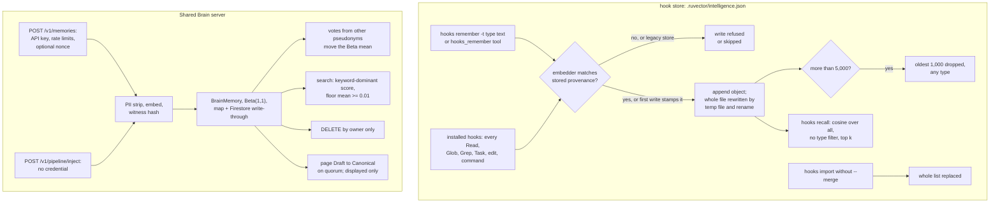

## 1. Executive Summary

RuVector is a Rust monorepo of 363 Cargo manifests around a vector engine — HNSW,
quantization, graph and GNN crates, a Postgres extension, an LLM runtime —
whose README opens by calling it a substrate for *"agent memory across
sessions"*. Two agent-memory surfaces ship. The `ruvector` npm package keeps a
per-project `.ruvector/intelligence.json` that `ruvector hooks remember` and
`recall` read and write, from the CLI, from a stdio MCP server, and from Claude
Code hooks that `ruvector hooks init` installs. The Shared Brain is an axum
server, in the tree as `crates/mcp-brain-server`, that the package's `brain_*`
tools call at `pi.ruv.io` by default.

What is notable is the store's defensive engineering. Every `remember` is
checked against an embedding-provenance stamp, and a store stamped by one
embedder refuses writes from another rather than mixing spaces. A corrupt file
is renamed aside and reported instead of being read as empty and saved back.

What is weak is correction. The hook store has no per-memory update or forget,
and the hooks `init` installs write a record for every file read, search, edit
and shell command into the same 5,000-entry FIFO as the decisions a person
asked it to keep. On the brain, the inject route takes no credential and writes
as a system contributor, and a page correction is a logged delta that never
changes the page.

Two library crates model more than either store does and are not wired to
them. `ruvector-agent-memory` implements a TARL ledger with `Accepted`,
`Pending` and `Rejected` states and cascading demotion of dependents; it has no
persistence of its own and no consumer in the tree, and the README's *Known
boundaries* item 6 says compaction is not wired into core, MCP or RVF.
`ruvector-core::AgenticDB` persists episodes, skills and a hash-linked witness
log behind a Rust API the hook store does not use.

No marks. Section 9 names the seven and why each is withheld.
[ruflo](../ruflo/), from the same author, keeps its memory in its own package
over SQLite and AgentDB; none of that package's files is in this tree.

## 2. Mental Model

**Hook store.** A memory is one object in the `memories` array of
`intelligence.json`. It becomes a belief the moment it is appended: there is no
candidate state, extraction or model call. Two kinds of writer produce it. A
person or agent runs `hooks remember -t decision "…"` or the `hooks_remember`
tool. And the hooks installed by `hooks init` append on their own: *"Reading:
path"* before every Read, *"Search: pattern"* before every Glob or Grep,
*"Agent: type"* before every Task (`npm/packages/ruvector/bin/cli.js:4353-4355`),
and the full command text after every Bash call (`:4814`).

A memory stops being one in three ways, none aimed at it. Past 5,000 entries
the oldest 1,000 are spliced off, whatever their type (`cli.js:3534`). `hooks
import` without `--merge` replaces the whole list (`:6676-6680`). `hooks reembed
--drop-missing` drops entries without source text. There is no command or tool
that updates or deletes one memory, so a wrong decision stays until a thousand
newer entries push it out.

**Shared Brain.** A `BrainMemory` is shared, PII-stripped, embedded and
witness-hashed, and enters search at once with a `Beta(1,1)` quality score.
Votes from other pseudonyms move the Beta; the author cannot vote on their own
(`crates/mcp-brain-server/src/store.rs:877-884`). It leaves search when its
owner deletes it, or when its Beta mean falls below the 0.01 default floor,
which takes 99 downvotes against no upvote (`routes.rs:1755`,
`store.rs:712`). A Brainpedia page is the same record plus a status that moves
`Draft` to `Canonical` on a quorum; search never consults the status.

## 3. Architecture

The npm package is a Node CLI (`bin/cli.js`) and a stdio MCP server
(`bin/mcp-server.js`), each with its own copy of an `Intelligence` class over
the same JSON file. Both resolve the path the same way: the project's
`.ruvector/intelligence.json` when that directory or a `.claude` directory
exists, else the home one (`cli.js:3232-3240`; `mcp-server.js:269-276`).
`save()` rewrites the whole document through a temp file and `rename()`, whose
own comment says the final rename *"is last-writer-wins"*
(`cli.js:3080-3101`, `:3305-3332`).

An optional `IntelligenceEngine` (`src/core/intelligence-engine.ts`) adds ONNX
MiniLM embeddings and an HNSW `VectorDB` from `@ruvector/core`, the native
binding built from `crates/ruvector-node`. That index is in process only
(`intelligence-engine.ts:314-324`): each process imports the JSON into it
(`:1268-1290`) and discards it on exit. The MCP server constructs the engine
whenever it loads (`mcp-server.js:220-243`); the CLI builds it lazily, when a
command first touches it.

The Shared Brain is `crates/mcp-brain-server`: axum routes over a `DashMap`
cache, written through to Firestore and hydrated from four collections at
start (`store.rs:536-632`), with `.rvf` blobs in GCS and Cloud Run deployment
scripts. `mcp-brain-server-local` is a separate binary over SQLite. The npm
tools reach the hosted instance through `@ruvector/pi-brain` with `BRAIN_URL`
and a key from the `PI` variable (`mcp-server.js:158-175`); `crates/mcp-brain`
is a Rust MCP client over the same API.

### Deployment and ergonomics

The hook store needs Node and nothing else: no server, no API key. Semantic
mode downloads `all-MiniLM-L6-v2` on first use. The store is one readable JSON
file, repairable by hand, and `hooks init` adds `.ruvector/` to `.gitignore`
(`cli.js:4678`). Self-hosting the brain means a GCP project with Firestore and
GCS, or building the local binary; the default is a service the author runs.

## 4. Essential Implementation Paths

**Write, CLI.** `hooks remember` (`cli.js:4856-4886`) picks an embedder with
`hooksUseSemanticEmbedder` (`:4838-4854`), then calls `rememberAsync` or
`remember`. The sync path (`:3526-3544`) builds a 64-dimension character-hash
embedding (`:3337-3353`), gates it through `guardVectorWrite` (`:3428-3446`),
appends `{id, memory_type, content, embedding, metadata, timestamp}` with id
`` `mem_${this.now()}` `` in whole seconds, and applies the FIFO cap. The
command then calls `save()`.

**Write, MCP.** `hooks_remember` (`mcp-server.js:2036-2049`) calls
`Intelligence.remember` (`:490-520`), which stores through the engine when it
can and appends `{content, type, created, embedding}` — no `id`, a different
type field, no cap — and saves.

**Ambient writes.** `hooks init` writes the PreToolUse hooks at
`cli.js:4343-4356` and the PostToolUse ones at `:4357-4360`. `post-edit` and
`post-command` call `tryRemember` (`:4788`, `:4814`), which swallows a
provenance refusal so the hook never fails (`:3550-3560`).

**Read.** `hooks recall` (`cli.js:4888-4898`) runs the sync `recall`
(`:3610-3616`) — cosine against every memory, sort, slice — or `recallAsync`
(`:3583-3608`) through the engine. `hooks_recall` (`mcp-server.js:2051-2069`)
goes through the engine whenever it exists (`:522-552`). `hooks rag-context`
is the same recall with an optional reranker (`cli.js:5603-5625`).

**Correct and delete.** Nothing per memory. `hooks import` (`cli.js:6626-6689`)
replaces or content-dedup merges; `hooks_import` (`mcp-server.js:2235-2310`)
replaces or appends. `hooks reembed` (`cli.js:4903-5005`) rewrites every
embedding and can drop entries without text.

**Brain.** Routes are registered at `routes.rs:318-413`. `share_memory`
(`:1420`) checks the nonce, key and IP rate limits, strips PII and stores.
`search_memories` (`:1740`) scores the whole corpus. `vote_memory` (`:2254`)
and `delete_memory` (`:2365`) call `store.update_quality` (`store.rs:871`)
and `store.delete_memory` (`:671-693`). `pipeline_inject` (`routes.rs:3760`)
runs `process_inject` (`:3553-3757`). Pages are `create_page` (`:4564`),
`submit_delta` (`:4727`), `add_evidence` (`:4851`) and `promote_page` (`:4904`).

## 5. Memory Data Model

**The two writers disagree on the schema of one file.** The CLI writes `id`,
`memory_type` and a Unix `timestamp`; the MCP server writes `type` and an ISO
`created` and no `id`. Each reader looks for its own names. `hooks recall`
prints `r.memory_type || 'unknown'` and `r.timestamp || ''`
(`cli.js:4897`), so an MCP-written memory recalls from the CLI as type
`unknown` with no time. The CLI's `convertLegacyData` reads `m.memory_type`
(`:3198`) and the MCP server's reads `m.type` (`mcp-server.js:252`), so each
imports the other's memories into the engine as `general`.

**Ids collapse on the engine path.** The engine keys memories in a `Map` by
`id` (`intelligence-engine.ts:1280`). The CLI's sync id has one-second
resolution (`cli.js:3527`), so ambient hooks that fire twice within one second
write duplicate ids. The MCP server assigns id-less rows
`` `mem-${Date.now()}` `` inside one `map` call (`mcp-server.js:249`), so rows
converted in the same millisecond share a key. In both cases the later row
overwrites the earlier in the engine, and a recall that goes through the
engine searches fewer memories than the file holds.

**Scope is physical.** The file is the boundary: one per project directory, or
the home one. Nothing on a row names a project, agent or user, and `recall`
filters on nothing, not even the type a caller supplied.

**Shared Brain.** `BrainMemory` (`crates/mcp-brain-server/src/types.rs:155-179`)
holds category, title, content, tags, embedding, `contributor_id`, a
`BetaParams` quality score, a witness hash, optional redaction log,
differential-privacy proof and witness chain, and `created_at`/`updated_at`.
A contributor is a pseudonym: SHAKE-256 of any bearer string of 8 to 256
characters (`auth.rs:23-41`, `:82-84`). Pages add `PageStatus`
(`types.rs:753-758`), `PageDelta` and `EvidenceLink`, whose `verified` flag is
caller-supplied and never read by promotion.

## 6. Retrieval Mechanics

**Hook store.** Retrieval is tool-mediated only. No hook injects memories: the
installed SessionStart runs `session-start`, which prints a banner
(`cli.js:4744-4750`), and UserPromptSubmit runs `suggest-context`, which prints
two counts (`:4825-4829`). An agent sees a memory only by calling `hooks
recall` or `hooks_recall`. The sync path embeds the query with the same
character hash and returns the top k by cosine over every entry, file-access
logs included; the CLI truncates each result to 200 characters.

The hash embedding counts characters into 64 buckets by code point and
position (`cli.js:3337-3353`), so *"Reading: src/auth.ts"* and a decision about
authentication compete on letter statistics. Semantic mode replaces it with
MiniLM through the engine, subject to the id collapse above.

**Shared Brain.** `search_memories` embeds the query, fetches every memory that
passes the category, tag and quality filters (`store.rs:696-731`), and scores
each. When any query token matches, the score is `1.0 + keyword * 0.85 +
cosine * 0.05 + PageRank * 0.04 + reputation * 0.03 + vote * 0.03`, otherwise
a weighted sum of cosine, PageRank, reputation and vote
(`routes.rs:1992-2004`). The vote term there is `(mean - 0.5).max(0.0) * 0.3`
(`:1917-1918`), so a downvote only removes an upvote's boost. A second pass
re-scores each result as `0.85 * hybrid + 0.10 * mean + 0.05 * recency`
(`ranking.rs:31-46`), where a downvote does count. Recency is read from
`updated_at`, which every vote, up or down, resets to now (`store.rs:909`), so
a downvote also makes a memory look fresh.

## 7. Write Mechanics

Every hook-store write is synchronous and whole-file. Each hook is its own
short-lived process that loads the JSON, appends, and renames a fresh copy
over it. Two hook processes that overlap each load the same version, and the
second rename discards the first's append. The atomic rename removed torn
reads, the defect its comment was written for; it did not add a lock, and the
comment says so.

A memory is retrievable as soon as `save()` returns. Nothing rewrites the
store in the background; `reembed` rewrites every embedding on request. There
is no deduplication on the write path, so the same *"Reading: …"* line is
appended once per read.

The provenance gate is the one write-side check. `checkVectorWrite`
(`cli.js:3401-3420`) stamps `embeddingProvenance` on the first write, refuses a
later write whose embedder kind, model, dimension, normalization or prefix
policy differs, and makes a store with vectors but no stamp read-only until
`hooks reembed` (`src/core/embedding-provenance.ts:379-388`). The MCP
`hooks_import` enforces it (`mcp-server.js:2270-2296`); the CLI `hooks import`
does not, and appends or replaces whatever vectors the file holds
(`cli.js:6660-6680`).

### Operational cost

No model call on the default path. The ambient hooks add one Node start and
one full parse and rewrite of the file per Read, Glob, Grep, Task, edit and
command; `--fast` swaps `npx` for a local wrapper with 300 to 1,000 ms
timeouts (`cli.js:4330-4332`). The engine path rebuilds an HNSW index over the
whole file in every process that uses it. Recall injects nothing unless called
and returns five results by default.

## 8. Agent Integration

`hooks init` writes `.claude/settings.json` hooks for PreToolUse, PostToolUse,
SessionStart and Stop, and with the default options a UserPromptSubmit and
PreCompact set and a permission allowlist (`cli.js:4037-4730`). Its MCP step
enables a server named `claude-flow` in `enabledMcpjsonServers`, not this
package's own (`:4200-4211`). The UserPromptSubmit set also calls `npx
agentic-flow@alpha workers …` with the user's prompt as an argument
(`:4409-4427`).

The MCP server registers hooks, workers, RVF, rvlite, brain, edge, identity
and decompiler tools. A policy module filters them by `RUVECTOR_MCP_ALLOW`, `RUVECTOR_MCP_DENY` and `RUVECTOR_MCP_PROFILE`
(`bin/mcp-policy.js`). Its header calls this a *"default-deny posture"*, and
`isToolAllowed` returns `true` when no variable is set (`:82-87`), so an
unconfigured server exposes `hooks_import`, which can replace the whole store,
beside `hooks_recall`. The `readonly` profile (`:23-43`) excludes both
`hooks_remember` and `hooks_import`; the README recommends it.

Porting the hook store to another agent is a matter of calling the CLI; the
store format is plain JSON. The brain tools need `@ruvector/pi-brain`
installed, or return a missing-dependency result (`mcp-server.js:158-175`).

## 9. Reliability, Safety, and Trust

**Privacy of the ambient record.** `post-command` stores `` `${cmd} succeeded` ``
verbatim (`cli.js:4814`), so a token passed on a command line lands in
`intelligence.json` and in any `hooks export`. The Shared Brain strips PII on
share and inject; the hook store strips nothing. The installed hooks pass no
`--success` or `--error`, so every command is recorded as succeeded
(`:4810`).

**The brain's inject route has no credential.** `pipeline_inject`
(`routes.rs:3760-3776`) takes no `AuthenticatedContributor`, no nonce and no
rate limit, and `process_inject` creates the contributor
`pipeline:<source>`, with the source chosen by the caller, as a system
contributor (`:3648-3653`). A system contributor starts at composite
reputation 1.0 against a new key's 0.1 (`store.rs:1031-1038`;
`types.rs:240-247`), and search weights every result by its author's
reputation (`routes.rs:1903-1907`). Delete is owner-only by pseudonym
(`store.rs:671-693`), and no API key hashes to `pipeline:…`, so injected
memories cannot be deleted through the API. Whether a deployment fronts the route with anything else is outside
the tree; `deploy.sh:132-136` offers `--allow-unauthenticated`.

**The promotion quorum can be met by one caller on one clause.** Promotion
needs quality at least 0.7 over five votes and three evidence links from two
distinct contributors (`store.rs:1285-1303`). `add_evidence` overwrites
`contributor_id` with the caller (`routes.rs:4871-4873`); `submit_delta` passes
the delta's `evidence_links` through untouched (`:4788-4798`) and the store
appends them to the page evidence (`store.rs:1227-1232`). The vote clause is
held by one vote per pseudonym and per IP (`store.rs:888-893`;
`routes.rs:2278-2293`).

**Corrections and evidence live in process memory.** `submit_delta` and
`add_evidence` write only the `page_deltas` and `page_evidence` maps
(`store.rs:1215-1256`); hydration loads memories, contributors, page status and
nodes and nothing else (`:536-632`). A `Correction` delta never touches the
page's `content`. A Firestore write that fails is logged and the handler
returns success (`store.rs:240-298`).

**The repository's own development hooks.** The committed
`.claude/settings.json` posts each `git commit` message and a session summary
of branch, last five commits and diff stat to `pi.ruv.io/v1/pipeline/inject`,
with a fallback bearer string written into the file. It is not what `hooks
init` installs; it runs for anyone opening this checkout in Claude Code.

**What is solid.** A corrupt store is renamed to `.corrupt-<timestamp>` and the
command fails loudly (`cli.js:3256-3274`); the MCP server quarantines and
starts empty (`mcp-server.js:282-302`). On-disk fields are shape-checked so a
hand edit cannot crash a reader (`cli.js:3277-3302`).

**Marks withheld.**

- `tombstone` — no record keyed on a rejected value on either store. The
  brain's negative cache blacklists query signatures, off by default
  (`routes.rs:1757-1771`).
- `trust_state` — `PageStatus` has `Draft` and `Canonical` writers and is read
  only for display and to refuse deltas to `Archived`; search never filters on
  it, and `Contested` and `Archived` have no writer. The TARL ledger's
  `Rejected` (`crates/ruvector-agent-memory/src/ops.rs:51-58`) does withhold:
  `accept` refuses an entry whose dependency is not `Accepted`
  (`ledger.rs:450`). It sits in a crate nothing in the tree calls and that
  persists nothing.
- `bitemporal` — one `timestamp` or `created`; the brain's `updated_at`
  overwrites.
- `scope_enforced` — the hook store is partitioned by directory with no key on
  a row; the brain is one global corpus.
- `audit_log` — the brain's `brain_votes` collection records votes, one
  document per memory and voter, not creates or deletes; the page delta log is
  not persisted. `AgenticDB::WitnessLog::append` is a caller-invoked API that
  no write path calls, stored in a vector table `delete` can reach.
- `human_review` — promotion is a vote-and-evidence quorum any pseudonym can
  contribute to, and `brain_page_promote` is a tool on the agent's MCP surface
  (`crates/mcp-brain/src/tools.rs:254`).
- `negative_eval` — no committed case asserts that a memory is absent from a
  hook-store recall or a brain search; section 10.

## 10. Tests, Evals, and Benchmarks

I read the tests and ran none of them.

**Provenance and durability are tested with assertions that can fail.**
`tests/adr-210-acceptance.test.mjs` drives the CLI against fixture stores and
asserts a legacy 256-dimension store refuses a write with
`ERR_LEGACY_STORE_READONLY`, that `reembed` unlocks it, and that a MiniLM store
refuses a forced hash write naming both sides (`:156-231`). CI runs
`node --test tests/*.test.mjs` (`.github/workflows/ruvector-npm-ci.yml:132`).
`test/mcp-intel-durability.js` writes a torn store, calls `hooks_remember`, and
asserts one quarantine file with the original bytes and no leftover temp files.

**The remember and recall smoke tests cannot fail.** Both cases in
`test/cli-commands.js:535-544` assert `code === 0 || stdout.length > 0 || true`.

**No retrieval test on either store checks what comes back.** The ADR-210
recall gate (`tests/adr-210-recall-benchmark.test.mjs:45-150`) measures
recall@10 at least 0.9 on 600 documents through `VectorDB`, not through the
hook store. The brain server's 148 tests cover embeddings, PII stripping,
witness chains, graph and learning components; `store.rs` has none and no test
builds the router. A CI job asserts the four hydration log lines exist
(`.github/workflows/regression-guard.yml:325-345`), which also fixes the four
collections the server reloads.

Missing before trusting either store: concurrent hook writes asserting no lost
append; a CLI-write, MCP-read round trip; a per-memory forget with a recall
asserting its absence; and an inject call without credentials expected to fail. No paper describes the
system; the arXiv references in `ruvector-agent-memory` cite third-party work
it draws on.

## 11. For Your Own Build

### Steal

- **Stamp the embedding space on the store and refuse writes from another.**
  Record embedder kind, model, dimension, normalization and prefix policy on
  first write; refuse a mismatch naming both sides; make an unstamped store
  read-only until re-embedded. Keep source text so re-embedding is possible.
- **Quarantine a corrupt store, never default it.** A parse failure that
  becomes an empty object and is saved back is the silent total loss; rename
  the file aside and fail.
- **Demote dependents when a belief is rejected.** The TARL ledger's
  containment cascade — a rejected or revised entry pulls every accepted entry
  that depends on it back to pending — is a small, testable answer to poisoned
  premises, even though nothing here uses it.

### Avoid

- **One FIFO for telemetry and memory.** When every tool call writes an entry,
  explicit memories age out by volume. Keep ambient records in a separate,
  separately capped structure.
- **Two writers with two schemas for one file.** Share one serializer, or the
  field each reader expects is missing on half the rows.
- **Ids from a clock.** A one-second or one-millisecond id collides under
  hooks; use a random suffix, as the engine's own `remember` does.
- **A privileged route beside an authenticated one.** A convenience ingest
  endpoint that skips auth, nonce and rate limits, and writes as a system
  principal, undoes every control on the main route.
- **A correction that only logs.** A delta typed `Correction` that never
  rewrites the record is an annotation.

### Fit

The hook store fits a single developer who wants a local, dependency-free
scratch memory and will delete the ambient recorders `hooks init` writes,
which even `--minimal` keeps. It does not
fit anyone who needs to retract a memory, share a store between concurrent
agents, or keep command lines out of a file on disk. The Shared Brain is a
hosted commons with a vote-weighted ranking; its correction and audit paths
are not persisted, so treat it as a public board rather than a memory of
record. For a vector engine to build memory on, the Rust crates are the
product, and the memory design is left to the adopter, as the README says.

## 12. Open Questions

- Does Claude Code set `$TOOL_INPUT_file_path` and `$TOOL_INPUT_pattern` in a
  hook's environment? If not, the installed PreToolUse hooks record the prefix
  alone; running the hooks would settle it.
- Is `/v1/pipeline/inject` reachable without credentials on the hosted
  `pi.ruv.io`, or fronted by something outside the tree?
- How often do concurrent hooks lose appends in practice, on the Claude Code
  harness's hook scheduling?
- Does inserting 64-dimension hash vectors into the engine's 256-dimension
  `VectorDB` fail silently in `import`, leaving the MCP engine index empty for
  a hash-stamped store?

## Appendix: File Index

- **Hook store:** `npm/packages/ruvector/bin/cli.js` (`Intelligence` at
  `:3126`, the `hooks` commands from `:4001`), `npm/packages/ruvector/bin/mcp-server.js`
  (`Intelligence` at `:220`, handlers at `:2036-2310`),
  `npm/packages/ruvector/bin/mcp-policy.js`.
- **Engine and provenance:** `npm/packages/ruvector/src/core/intelligence-engine.ts`,
  `npm/packages/ruvector/src/core/embedding-provenance.ts`.
- **Shared Brain:** `crates/mcp-brain-server/src/routes.rs`, `store.rs`,
  `types.rs`, `auth.rs`, `verify.rs`, `deploy.sh`; `crates/mcp-brain/src/tools.rs`.
- **Library crates:** `crates/ruvector-agent-memory/src/{ops,ledger,lib}.rs`,
  `crates/ruvector-core/src/agenticdb.rs`.
- **Tests:** `npm/packages/ruvector/tests/adr-210-acceptance.test.mjs`,
  `test/mcp-intel-durability.js`, `test/cli-commands.js`,
  `crates/mcp-brain-server/src/tests.rs`,
  `crates/ruvector-agent-memory/tests/tarl_ledger.rs`.

### Recorded searches

Checked against the checkout at the pinned revision.

- `grep -n "tryRemember\|data.memories\s*=\|memories.filter\|memories.splice\|forget\|hooks_forget\|memory_delete\|deleteMemory" bin/cli.js bin/mcp-server.js` in `npm/packages/ruvector` — assignments only in `reembedAll`, the two imports and the FIFO splice; no forget command or tool.
- `grep -rn "PageStatus::Contested\|PageStatus::Archived" crates npm --include='*.rs' --include='*.js' --include='*.ts'` — one read at `routes.rs:4771`, no writer.
- `grep -n "page_status\|get_page_status" crates/mcp-brain-server/src/*.rs` — list, get, delta and evidence handlers; none in `search_memories`.
- `grep -rn "brain_page_deltas\|brain_page_evidence" crates/mcp-brain-server/src/` — MCP tool names only; no Firestore collection.
- `grep -rln "ruvector_agent_memory\|ruvector-agent-memory" --include='*.rs' --include='*.toml' --include='*.js' --include='*.ts' .` — the crate itself, the workspace manifest, and doc comments in `ruvector-staged-workspace`.
- `grep -rn "witness_log()" --include='*.rs' .` — only `ruvix` kernel tests; no caller of `AgenticDB::witness_log`.
- `grep -rn "oneshot\|create_router\|TestServer" crates/mcp-brain-server/src/` — the router is built in `main.rs` and the worker binary, never in a test.
- `grep -rln "TieredMemoryStore\|agentdb-retrieval-guard\|HybridBackend" --include='*.ts' --include='*.js' --include='*.mjs' --include='*.cjs' .` — no match; ruflo's memory package is not in this tree.
- `grep -n "arxiv\|bibtex\|@article\|@misc\|doi.org\|citation" README.md` (case-insensitive) and `ls CITATION*` — no match, no file.

## History

**2026-09-26** — [`5356a84e2f784a33fa497da2e73440d469eb5542`](https://github.com/ruvnet/RuVector/commit/5356a84e2f784a33fa497da2e73440d469eb5542) — first reading, at the head of `main`, a commit dated 23 September 2026. No marks. Screened before reading: four auto-run findings (`.claude/settings.json` hooks that post to `pi.ruv.io`, `.claude/hooks/`, a `.githooks/` payload inert until installed, and `.gitmodules`, whose three submodules were left uninitialised), 71 build-time execution points, 79 unpinned surfaces, and 594 dependency surfaces inside the cooldown — inflated, since a depth-1 clone dates every file to the tip. `CLAUDE.md` was read as data. Read with `grep`, `sed` and `awk`; nothing installed, built or run.
