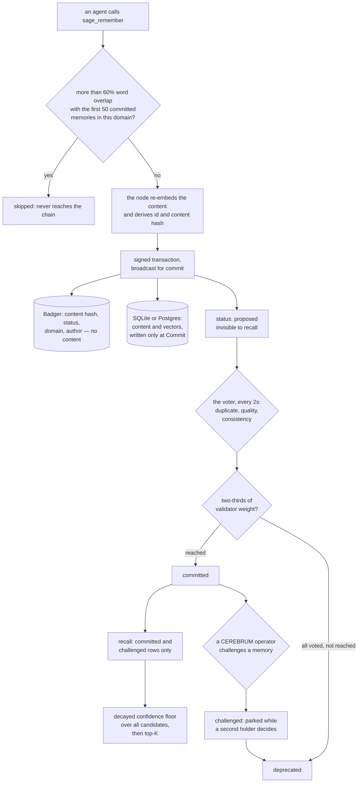

## 1. Executive Summary

The atlas carries a second, unrelated system of the same name: the
[SAGE Novelty Gate](../sage-novelty-gate/), a mem0 fork from a different
author. The two share nothing but the word.

SAGE is a memory node built on a vendored CometBFT chain — Apache-2.0, 1,559
commits between 2 March and 7 September 2026 by nine authors, 213,143 lines of
Go outside tests and outside the vendored consensus engine, beside 209,255
lines of tests holding 4,752 test functions. The screen found two auto-run
surfaces, five build-time execution points and five unpinned surfaces; nothing
was installed or run, and the read was made from a full clone. Storage is two
tiers: BadgerDB holds the consensus state covered by the application hash, and
SQLite or PostgreSQL holds the serving projection with the content and vectors.

**The idea is that a memory has to be voted in.** A submitted memory is written
as `proposed` (`internal/abci/app.go:5350`) and the HTTP response says so
(`api/rest/memory_handler.go:1627`) even as it reports the transaction
committed. Every recall path then hard-codes a committed status filter
(`internal/mcp/tools.go:1161`, `:1404`) which the store turns into
`AND status IN ('committed','challenged')` (`internal/store/sqlite.go:2032`).
So a memory nothing has voted on is not ranked low — it is not there. That is a
genuine `trust_state`, and the shape is unusual: the default state of a new
memory here is unreadable.

**The confidence model is literal and applied where it matters.**
`conf(M,t) = conf₀ · exp(−λ·Δt) · (1 + 0.1·log(1+corroborations))`
(`internal/memory/confidence.go:38-59`), λ defaulting to 0.005 per day with
per-domain overrides, evaluated at read time so no sweep is needed, and open
tasks exempt. The floor is applied **across the whole candidate set before the
top-K trim** (`internal/store/sqlite.go:2131-2137`), which is the ordering most
implementations get wrong. The stored column is never updated — decay is a
function, not a background job.

Three more marks: `scope_enforced` on a domain filtered in SQL and authorized
again per record, `audit_log` on append-only vote, corroboration and challenge
tables written from the consensus path, and `human_review` on a dashboard where
an operator's delete becomes a challenge transaction that, on a domain with two
modify-verb holders, only parks the memory pending a second confirmation.

**Four findings sit against the design, and the first is the headline.** The
README's opening line says memories go through *"BFT consensus validation"*. On
the default personal install the genesis has exactly one validator
(`cmd/sage-gui/node.go:3532-3540`), and the vote that decides admission is
`internal/voter/decision.go:75-87`: a duplicate check, a quality check that
rejects content under twenty characters and eight hardcoded phrases such as
*"user said hi"* and *"brain online"*, and a consistency check on the
caller-asserted confidence. With one validator the two-thirds quorum is
arithmetically trivial in both directions. The project states this plainly
itself, 130 lines below the headline — *"Personal mode runs one real CometBFT
validator with a per-node memory auto-voter; it has no Byzantine redundancy"*
(`README.md:135-138`) — and adds *"Block inclusion is not the same as memory
acceptance"*. The qualification is honest and it is not where the claim is made.

**The dedup lookup is committed-only, so nothing blocks a rejected memory
returning.** `FindByContentHash` selects `WHERE content_hash = ? AND status =
'committed'` (`internal/store/sqlite.go:4990`), and the comment above it
explains why: the predicate used to be `status != 'deprecated'`, which matched
the candidate's own proposed row and — on a single-validator chain where that
self-match was unanimous — *"every memory was deprecated on arrival"*. The fix
was correct and it removed the only thing that would have made this a tombstone.

**The MCP client drops writes before the chain sees them.** `toolRemember`
compares a new memory against the first fifty committed memories in the domain
and returns `skipped` at more than sixty per cent significant-word overlap
(`internal/mcp/tools.go:815`, `:4177-4213`) — a lossy filter in front of a store
whose value proposition is that admission is decided by consensus.

**And the papers' priority anchor is not in this history.** `papers/README.md:30`
cites initial commit `23b4593` of 2 March 2026. That commit is not an ancestor
of this pin; the current initial commit carries the same message and the same
author timestamp with a different tree. Comparing them, the cited commit holds
41 files and 6,609 lines the published history does not — the Level Up
experiment pipeline and its run records, which are the material behind two of
the four papers. The reason is visible and stated: `.gitignore:160-167` excludes
those paths under a heading of intellectual-property protection, calling the
pipeline proprietary. The consequence is stated here too: the papers cite a
commit outside the published history for priority, and their statistics cannot
be reproduced from this tree.

## 2. Mental Model

A memory is **a claim awaiting admission**. It enters signed, hashed and
anchored, and it sits outside retrieval until something votes for it. What votes
depends entirely on deployment: on a cluster it is a set of validators; on the
personal node it is that node's own key running three checks.

Belief has two independent axes. **Status** decides whether a memory may be read
at all — proposed and deprecated are both invisible, challenged is readable
while contested. **Confidence** decides where it ranks and whether it clears a
floor, and it erodes with time unless corroboration pushes back.

Correction is adjudication, not editing. A challenge transaction is the only way
to unmake a memory, it carries a reason, and where a domain has more than one
holder of a modify verb it opens a dispute instead of settling one.

Nothing summarises. The agent writes the sentence; the node re-embeds it and
refuses to trust the caller's vector.



## 3. Architecture

Thirty-four packages under `internal/`, of which the memory model itself is
328 lines and the machinery around it is most of the repository:
`store` 46,635 lines, `federation` 26,261, `abci` 21,872, `mcp` 10,353,
`tx` 8,575. Beside them `web/` is 31,860 lines of dashboard, `cmd/` 27,835
across eight binaries, `api/` 20,811, and `third_party/cometbft` is a vendored
116,822-line consensus engine with its own module file.

The two tiers matter. Badger is authoritative and holds no content — only the
hash, the status, the domain, the author and a classification. The SQL store
holds the content and the vectors and is a projection, written from exactly one
place: the code marks it as *"the ONLY path that writes memories to the offchain
store, enforcing consensus-first ordering"* (`internal/abci/app.go:5401-5402`).
Before disclosure, the projection is validated against the Badger application
hash (`api/rest/appv23_record_disclosure.go:69`).

### Deployment and ergonomics

- **What has to run:** a CometBFT node, an embedding provider, and SQLite for a
  personal install or PostgreSQL with pgvector for a cluster. A desktop bundle,
  a tray app and an installer ship.
- **Fully local and offline:** the chain and the store are; embeddings depend on
  the configured provider.
- **Hand-repairable:** partly. The SQL projection is inspectable and
  rebuildable, but the authority is a Badger key space under an application
  hash, and repairing that means replaying the chain.
- **Install:** a release download for the desktop, or Go from source.

## 4. Essential Implementation Paths

- **Submit.** `internal/mcp/tools.go:750` checks the vault lock, resolves the
  domain, runs the overlap guard (`:815`), asks an advisory pre-validate
  endpoint (`:839`) that can refuse before any transaction exists, embeds
  (`:864`) and submits (`:948`). `api/rest/memory_handler.go:1196` validates,
  checks the domain ACL (`:1331`), **re-embeds authoritatively** (`:1345-1352`),
  mints the id and the content hash (`:1355`, `:1371`), builds and signs the
  transaction (`:1399-1453`), and broadcasts for commit (`:1497-1501`).
- **Land the block.** `internal/abci/app.go:4987` `processMemorySubmit` writes
  the Badger keys — hash and status (`:5350`), domain (`:5362`), author
  (`:5388`), classification (`:5477`) — and buffers the SQL row (`:5445`),
  flushed at `Commit` (`:9983`, dispatch at `:10347`).
- **Vote.** `internal/voter/voter.go:156` polls every two seconds, calls
  `Decide` (`:341-347`) and broadcasts a vote transaction (`:354-375`).
  `internal/voter/decision.go:75-87` is the whole decision: `dedupCheck`
  (`:89-103`), `qualityCheck` (`:105-119`), `consistencyCheck` (`:121-131`).
- **Reach quorum.** `internal/abci/app.go:6441` `checkAndApplyQuorum` commits at
  two-thirds accept weight (`:6597`) or, once every validator has voted without
  reaching it, deprecates (`:6624`).
- **Recall.** `internal/store/sqlite.go:1996` `QuerySimilar` prefilters in SQL
  on the embedding provider, the domain, the confidence and the status
  (`:2004-2063`), scores by cosine with the comment *"Compute similarity for
  ranking only — no minimum threshold"* (`:2108-2111`), sorts, applies the
  decay floor across all candidates (`:2131-2137`), runs the per-record
  authorization pass (`:2138`) and trims to top-K (`:2148-2156`). A scan budget
  returns an explicit error rather than ranking an arbitrary prefix (`:2114`).
- **Challenge.** `web/handler.go:3558-3583` gates on a loopback operator and
  builds the challenge transaction; `internal/abci/app.go:7351-7399` opens a
  dispute where a domain has two modify-verb holders and deprecates otherwise.
- **Decay.** `internal/memory/confidence.go:38-59` computes;
  `ComputeConfidenceForRecord` (`:29-34`) exempts open tasks; seven call sites
  apply it at read time. The stored column is never written outside a test.

## 5. Memory Data Model

`MemoryRecord` (`internal/memory/model.go:39-73`) with the fields listed in the
matrix. Three of its parts are worth naming. `CorroborationCount` is documented
as display-only and not persisted on the struct (`:69-71`). `MemoryType` is a
four-value enum with a CHECK constraint in the DDL. And `ParentHash` gives a
memory a lineage pointer that the schema keeps but no read path walks.

Around it: `knowledge_triples`, `validation_votes`, `corroborations`,
`challenges`, `validator_scores`, `epoch_scores`, `domains` with a per-domain
decay rate, `access_logs`, `memory_links`, `memory_tags`, and a federation
`sync_tombstone`.

**Temporal:** `created_at`, `committed_at`, `deprecated_at`, all record time
taken from block time. `bitemporal` withheld — a search for validity columns
across the Go outside the vendored engine returns nothing.

**Trust:** four statuses gating readability plus a decaying float.
`trust_state` earned.

**Scoping:** a required domain plus per-record authorization.
`scope_enforced` earned.

**Tombstone:** withheld — see section 9.

**Three mechanisms with no production caller.** The lifecycle state machine says
so about itself: *"this map is documentation / SQLite hygiene only — it has
ZERO production callers. Consensus writes statuses imperatively … which performs
no transition check"* (`internal/memory/lifecycle.go:10-13`).
`ValidateMemoryRecord` has callers only in its own test file, and the REST layer
re-implements the checks inline. And `knowledge_triples` is written by the REST
path and the SDK and read back by nothing: the only production statements
naming it are the idempotency guard inside its own insert.

## 6. Retrieval Mechanics

The prefilter is where the marks live. Before any scoring, the query pins the
embedding provider so vectors from different models are never compared, and adds
the domain and the status. Then cosine similarity ranks — with no minimum, which
the code says outright — and the decayed floor drops everything below the
threshold **across the whole candidate set**, before the top-K trim. That
ordering is the difference between a floor that means something and one that
only prunes a page.

The per-record authorization pass runs after ranking and before the trim, and
denied records *"consume no visible limit"* — so a caller who cannot read half a
domain still gets a full page.

A text search and a hybrid mode sit beside the vector path, and an off-by-default
cross-encoder reranker lives in its own package.

**Failure modes.** A memory nobody voted on is silently absent, which is the
design and is also the first thing a new operator will hit if the voter is
disabled. A vector produced by a different provider is invisible rather than
mis-ranked, which is the right trade. And the scan budget converts an unbounded
authorization pass into an explicit error rather than a quietly truncated
answer.

## 7. Write Mechanics

**The node does not trust the caller's vector.** The MCP client embeds for its
own pre-check, and the REST handler re-embeds authoritatively before hashing.
For a store whose integrity claim rests on hashes, that is the right boundary.

**Consensus-first ordering is enforced by having one writer.** The SQL row is
buffered during block execution and flushed at Commit, and the code says this is
the only path that writes memories to the serving store.

**Nothing extracts.** The agent writes the content, chooses the type and asserts
the confidence. The README concedes the last point directly, and the voter's
consistency check is the only thing that pushes back: a `fact` below 0.7 is
rejected.

**Deletion is a challenge.** There is no delete path that removes a row;
deprecation stamps a timestamp and leaves the record. The optional cleanup pass
can evict on a decayed-confidence threshold, is disabled by default, and
requires an operator and an explicit dry-run flag.

### Operational cost

- A write is a blocking `broadcast_tx_commit`, so the caller waits for a block.
- Admission is asynchronous after that: the voter polls every two seconds.
- A read is one SQL prefilter, an in-process cosine over the candidates, a decay
  computation per row and an authorization call per survivor.

## 8. Agent Integration

38 MCP tools, of which seven touch memory, plus 119 REST routes, a Python SDK
and the dashboard's own 65. The agent-facing story is the four verbs —
remember, recall, forget, corroborate — and the shipped skill file describes the
system to a model in the same unqualified terms as the README's headline.

The human-facing story is CEREBRUM: a loopback dashboard behind a passphrase
where an operator searches, selects and challenges memories, and sees an
advisory pre-vote panel showing the same three checks the real vote applies.

## 9. Reliability, Safety, and Trust

**Trust state — awarded.** Where a system scores everything and returns it, this
one makes a new memory unreadable and requires an event to change that. Two of the four
states withhold, the filter is a SQL predicate rather than a weight, and all
four states have reachable producers on the consensus path.

**Scope — awarded.** A domain validated on write, filtered in the query, and
authorized per record afterwards, with denied rows not consuming the page.

**Audit log — awarded, with one component unwired.** Votes, corroborations and
challenges are append-only tables written from block execution, each backed by a
signed transaction. The table actually named `access_logs` is not part of it:
its only producer is an access-query transaction type, and nothing in the REST
layer, the MCP tools, the CLI or the SDK constructs that type. Recall writes no
access record.

**Human review — awarded.** The operator's challenge is a real adjudication that
mutates the store, and the two-holder rule makes it a dispute rather than a
verdict where the domain has more than one steward.

**Negative evaluation — awarded.** The decay-floor case inserts three real rows
and asserts the aged one absent while the fresh and the corroboration-boosted
ones are present, so the exclusion cannot pass on an empty result. The
cross-domain case asserts an unreadable domain's content absent from an HTTP
response body while a readable domain's is present.

**Tombstone — withheld, and the reason is a bug fix.** The only value-keyed
lookup in the system is `FindByContentHash`, and it selects committed rows only.
The comment above it explains that the predicate was narrowed from `status !=
'deprecated'` because the old form matched the candidate's own proposed row and,
on a single-validator chain, made that self-match unanimous — *"every memory was
deprecated on arrival"*. A repair routine for the damage still ships. The
narrowing was right, and it means a memory the node rejected does not stop the
identical bytes being submitted again. The `sync_tombstone` table is a
federation delete-sync marker keyed on origin chain and memory id, which the
rubric excludes by name.

**Bitemporal — withheld.** Three timestamps, all record time.

**What the consensus claim is worth on one node.** Not nothing, and the report
should be precise about both halves. What a single-validator chain does buy: an
Ed25519-signed, hash-anchored, replay-safe append-only transaction log; fork-gated
deterministic execution; an application hash the serving projection is checked
against before disclosure; and a single documented write path into that
projection. What it does not buy is Byzantine fault tolerance, because there is
one fault domain, and the admission decision is three string heuristics rather
than a distributed judgement. The README says so; the headline does not.

**The published results and the rewritten history.** Four papers ship as PDFs
with Zenodo identifiers and checksums. Their throughput and latency figures
appear in this tree only as prose in an architecture document; the load test the
reproducibility section points at asserts thresholds an order of magnitude below
the published numbers and writes nothing to disk, and its alternative sends a
literal placeholder signature. The statistical results in two of the papers
depend on a pipeline whose code, scripts and run records are excluded by
`.gitignore` as proprietary — and were present at the commit the papers cite for
priority, which is not an ancestor of this history. Both facts are checkable in
three commands and both are recorded in the appendix.

**The benchmark files are committed, and one of them argues against a shipped
feature.** Four result JSONs sit in `bench/results/`. LongMemEval over five
hundred questions gives R@5 of 0.9053, and the same corpus with the reranker
enabled reports 0.8927 at roughly twenty-five times the median query latency.
Reranking made recall worse. Nothing in the tree comments on it. Committing the
unflattering run is to the project's credit; the documented make targets do not
reproduce either file, because they pass no expansion parameter while both
records carry one.

## 10. Tests, Evals, and Benchmarks

4,752 test functions in 639 files and 209,255 lines, heaviest in `internal/abci`
(802), `internal/store` (746), `web` (710) and `api/rest` (557). The memory
model itself — the decay and lifecycle arithmetic — has one test file of 149
lines.

Three suites do not run in a checkout. The integration tests need a four-validator
Docker network and a Postgres; the Byzantine suite is the only network suite CI
runs; and the 203 Playwright end-to-end specs hardcode a localhost port with no
web server configured and no script or make target that invokes them.

The benchmark harnesses are in-tree and honest about their inputs, and an
outsider still cannot run them: the datasets are gitignored with no fetch target
for one of them, an API key is a hard exit, and the v7.1 rows need a 2.3 GB
reranker download. The recorded commit in each result file is the harness
repository's head, not the version of the node under test, and one file carries a
hand-written note explaining that its rerank metadata was patched in after the
run because the harness environment variable was unset. That note is the most
useful line in the directory: it says exactly what was not machine-recorded.

## 11. For Your Own Build

### Steal

- **Make a new memory unreadable until something admits it.** A status filter in
  the query is a stronger guarantee than any confidence weighting, and it turns
  admission into an event you can audit.
- **Apply the decay floor across the whole candidate set before the top-K
  trim.** Applying it after is the common bug and it silently turns a
  correctness floor into pagination.
- **Re-embed on the server.** If your integrity story is hashes, a
  caller-supplied vector is a hole in it.
- **Pin the embedding provider in the query.** Comparing vectors from two models
  is worse than returning nothing, and one SQL predicate prevents it.
- **Let denied records consume no page slots.** A caller who cannot read half a
  domain should still get a full page, not a half-empty one that leaks the size
  of what they cannot see.
- **Return an explicit budget error instead of ranking a prefix.** A truncated
  authorization pass that looks like a complete answer is the failure nobody
  notices.

### Avoid

- **Putting the qualification 130 lines below the claim.** The README is honest
  about single-node consensus; the shipped skill file that describes the system
  to a model is not, and a reader who takes the headline at face value will
  believe a memory was adjudicated by a quorum when one key ran three string
  comparisons.
- **A dedup lookup that only sees the accepted.** Narrowing the predicate to
  committed rows fixed a real bug and removed the only mechanism that would have
  stopped a rejected memory returning.
- **A client-side overlap filter in front of a consensus store.** Sixty per cent
  word overlap against the first fifty rows is a heuristic; dropping the write
  before the chain sees it means the store's own admission rules never get to
  decide.
- **Citing a commit for priority that your history no longer contains.** If
  material has to be removed for licensing, say where it went; a priority claim
  that resolves to an orphaned tree is weaker than one that admits the rewrite.

### Fit

Right if you want admission to be an explicit, signed, auditable event and are
deploying more than one validator — the status ladder, the write ordering and
the decay floor are all sound, and the test suite is serious. Wrong if you are
running the personal node and expect the consensus story to mean what the
headline says, or if you need a memory to be corrected rather than deprecated,
or a rejected claim to stay rejected.

## 12. Open Questions

- What would make single-node admission more than three string comparisons? The
  advisory pre-validate endpoint already exists and could carry a real check.
- Will the dedup lookup ever see the deprecated? The self-match bug that forced
  the narrowing is fixable by excluding the candidate's own row rather than by
  excluding every non-committed row.
- Will `access_logs` get a producer? The table, the transaction type and the
  handler are all written; nothing constructs the transaction.
- Will the reranker regression be addressed or the feature withdrawn? Both
  result files are committed and they disagree with the feature's premise.

## Appendix: File Index

| Path | Lines | What it holds |
| --- | --- | --- |
| `internal/memory/model.go` | 328 (package) | `MemoryRecord` (39-73), the status, type and task enums (11-36) |
| `internal/memory/confidence.go` | — | The decay formula (38-59), per-domain rates (14-17), the open-task exemption (29-34) |
| `internal/memory/lifecycle.go` | — | The transition map, documented as having zero production callers (10-13) |
| `internal/voter/decision.go` | — | The three checks (75-131) and the eight noise phrases (56-60) |
| `internal/voter/voter.go` | — | The two-second poll (156) and the vote broadcast (341-375) |
| `internal/abci/app.go` | 21,872 (pkg) | `processMemorySubmit` (4987), the consensus-first comment (5401), quorum (6441-6647), challenge (7351-7399) |
| `internal/store/sqlite.go` | — | The DDL (457-491), `QuerySimilar` (1996-2156), the decay floor (2131-2137), `FindByContentHash` (4990) |
| `api/rest/memory_handler.go` | — | Submit (1196-1635), query (1903-2040), the decay floor setup (1717-1723) |
| `api/rest/appv23_record_disclosure.go` | — | Per-record authorization (139-153) and the app-hash check (69) |
| `internal/mcp/tools.go` | — | 38 tools; `toolRemember` (750), the overlap guard (815, 4177-4213), `toolRecall` (1081) |
| `web/handler.go` | — | The operator gate (3558) and the challenge build (3575-3583) |
| `bench/results/` | 4 files | LongMemEval n=500 R@5 0.9053; the reranked run at 0.8927 and ~25× latency; LoCoMo n=1986 R@5 0.6394 |
| `papers/` | 4 PDFs | With Zenodo identifiers, checksums and the priority claim (README:30) |
| `third_party/cometbft` | 116,822 | The vendored consensus engine, own module |
| tests | 209,255 in 639 files | 4,752 test functions |

**Searches recorded for the negative claims**

```sh
rg -c -i -e valid_from -e valid_to -e bitemporal -e as_of --glob '*.go' --glob '!third_party/**' .   # 0 files
rg -c -e rejected_hash -e refused_value -e never_readmit --glob '*.go' --glob '!third_party/**' .    # 0 files
rg -n 'TxTypeAccessQuery' --glob '*.go' --glob '!*_test.go' --glob '!internal/abci/**' --glob '!internal/tx/**' .  # 0: access_logs has no reachable producer
rg -n 'memory\.ValidTransition|memory\.Transition\(' --glob '*.go' --glob '!third_party/**' .        # 0: the state machine has no callers
rg -n 'FROM knowledge_triples' --glob '*.go' --glob '!*_test.go' .                                   # 2, both the idempotency guard inside the insert
rg -n 'UPDATE memories SET' --glob '*.go' --glob '!third_party/**' .                                 # confidence_score updated only in a test
git merge-base --is-ancestor 23b45930b0dc097f56978a99f45a11c93571b60b HEAD                           # false: the papers' priority commit is not in this history
git diff --stat f2097605 23b45930                                                                    # 41 files, 6,609 lines present there and not here
```

## History

**2026-09-08** — [`5c6b32e51586a9e8b9153e827dffa4491916e8c1`](https://github.com/l33tdawg/sage/commit/5c6b32e51586a9e8b9153e827dffa4491916e8c1) — first reading, at the head of `main`, one day after the last commit. Screened before anything was read: two auto-run surfaces, five build-time execution points, five unpinned surfaces; nothing was installed or run, and the read was made from a full clone. Five marks. `trust_state` is the strongest instance in the corpus of a status that withholds rather than ranks — a memory is unreadable until a vote commits it. `scope_enforced`, `audit_log` and `human_review` rest on the domain filter plus per-record authorization, the append-only vote and challenge tables, and the operator challenge that opens a dispute where a domain has two stewards. `negative_eval` rests on a decay-floor case with two surviving controls. `tombstone` and `bitemporal` were examined and withheld, the first with its near-miss in section 9. Two claims were verified rather than repeated: the consensus headline was traced to a single-validator genesis and a three-check voter, with the project's own qualification quoted; and the papers' priority commit was checked with `merge-base` and compared by tree, confirming it is not an ancestor of this history and that 41 files of experiment material present there are absent here, for a licensing reason the repository states. The reading covers the memory model, the submit and vote paths, the store's ranking and decay, the disclosure layer and the dashboard's adjudication; federation, the natter relay, the desktop shell and the vendored consensus engine were treated as context.
