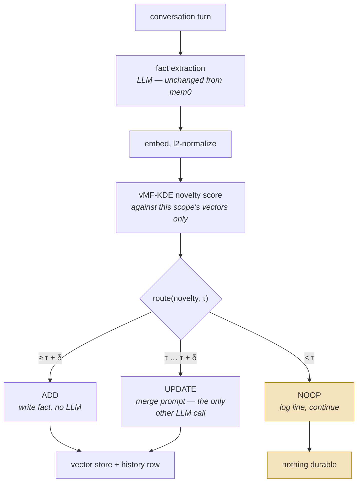

## 1. Executive Summary

SAGE is a fork of [mem0](../mem0/) that answers one question: **does deciding what to write require an LLM?** Base mem0 sends every extracted candidate fact, together with the existing memories near it, to a model that returns ADD, UPDATE, DELETE or NOOP. SAGE replaces that call with vector arithmetic — a von Mises–Fisher kernel-density novelty score against an adaptive per-scope threshold — and reserves the LLM for the band where the answer is genuinely ambiguous.

The extraction step is untouched, so this is a swap of the write *decision*, not of the write path as a whole. Everything else in the report — the vector store, the scope filter, the history table — is base mem0 and is described here only because a reader evaluating the gate needs to know what it sits inside.

Two things make it worth reading.

**The published numbers recompute from committed artifacts, offline.** `evaluation/paper_results/` holds per-question judge output for both arms of the headline run — 1,540 rows each, carrying the question, the reference answer, the system's response, the category and the judge's binary score. Recomputing the macro accuracy from those files gives 53.5 for mem0 and 52.2 for SAGE, matching the README to the decimal, with no API key and nothing installed. Almost nothing in this corpus can be checked that way.

**The framing chosen is the one that makes the system look worse.** The headline is a macro average over four LoCoMo categories, and on that measure SAGE loses 1.3 points. On the raw per-question count the two are level — 58.2 against 58.3, with SAGE marginally ahead — because macro weighting gives a 96-question category the same weight as an 841-question one. Reporting the number that disfavours your own system is rarer here than it should be.

Two things sit against it, and the second is small but exact.

**A refused candidate leaves nothing behind.** A NOOP is `logger.info("NOOP for Memory.")` followed by `continue`. There is no record — not a tombstone, not a counter, not a row in the history table the fork inherits — that a fact was extracted and discarded. The efficiency claim is measured; what the gate dropped is not auditable after the fact.

**The generated results paragraph names the wrong category.** `make_results_tex.py` builds the takeaway prose with computed numbers plugged into fixed sentences, and one of them reads *"The residual gap is concentrated in single-hop recall"*. Single-hop drops 2.1 points; temporal drops 7.3. The committed table shows both honestly, and the temporal category is the smallest at n=96 so the swing is roughly seven questions — but the sentence is templated, so it will name single-hop whatever the numbers do.

## 2. Mental Model

A candidate fact is a point on a unit sphere. Memory is the set of points already there, for this scope. The question "is this new?" becomes "how far is this point from the density of what I already hold?"

```text
novelty(x)  =  vMF-KDE score of x against the scope's memory vectors
τ_t         =  per-scope threshold, decaying as the scope's density ρ_t rises

           novelty ≥ τ + δ   →  ADD     (new fact, no LLM)
   τ ≤ novelty <  τ + δ      →  UPDATE  (merge into nearest, one LLM call)
           novelty <  τ      →  NOOP    (discard, no LLM, no record)
```

`δ` is a hysteresis margin, so the two boundaries are not the same number and a candidate sitting exactly at the threshold does not flip between ADD and UPDATE on noise.

The threshold decays deliberately, and the repository explains why: as a scope fills, new facts are more likely to land near an existing one, so a fixed threshold would make the system monotonically more conservative until it stopped writing. `τ_t` tracks a density proxy so that "novel enough" means novel *relative to how full this scope already is*.



The highlighted branch is the whole saving and the whole cost. Base mem0 spends
a model call to reach that decision and records the outcome; SAGE reaches it with
arithmetic and records nothing.

## 3. Architecture

The fork is base mem0 with the sub-projects removed — no docs site, no JS/TS SDKs, no server, no examples — plus one module and an evaluation harness.

- `mem0/memory/novelty_gate.py` (615 lines): `NoveltyScorer`, the per-scope state, the projection choices, the vMF concentration estimate, and the `AdaptiveThreshold` that owns `route()`.
- `mem0/memory/main.py`: the write path, carrying both the original LLM router (kept, and documented as *"Original Mem0 LLM-based gating"*) and the gated path beside it.
- `evaluation/`: the harness, the LoCoMo dataset wiring, the table generators and `paper_results/`.
- `demo/`: a browser demo of the gate, with no service behind it.

Keeping the LLM router in the tree rather than deleting it is the right call for a paper artifact: the baseline arm is the same code the comparison ran against.

## 4. Essential Implementation Paths

### The score

`NoveltyScorer` l2-normalizes the scope's vectors, optionally projects them — random projection or PCA, selectable — and estimates a von Mises–Fisher concentration from the data rather than fixing it. A Gaussian KDE is available as an alternative method, and an unknown method name raises rather than falling back silently, which a committed case pins.

FAISS is imported behind a `try`, so the index is optional and the gate degrades to a dense computation without it.

### The threshold

`AdaptiveThreshold` keeps one EMA per scope key. In `fixed` mode it returns a configured constant and refuses to be constructed without one; in `adaptive` mode the threshold moves with the scope's density proxy. `reset_scope` and `reset_all` exist and are tested, which matters for an evaluation harness that runs many conversations through one process.

### The scope key

```python
def _scope_key(filters):
    return "|".join([
        str(filters.get("user_id") or ""),
        str(filters.get("agent_id") or ""),
        str(filters.get("run_id") or ""),
    ])
```

The same three ids that filter mem0's reads partition the gate's state. A candidate is scored only against its own scope, so one user's memory cannot suppress another user's fact as redundant — which is a failure mode a global novelty index would have, and it is closed here by construction rather than by a check.

### Hydration

A scope's vectors are loaded lazily and marked hydrated with a TTL; `is_hydrated_fresh` decides whether to re-read from the vector store. Concurrency is handled with a per-scope lock and two committed cases — one serializing concurrent `add_to_scope`, one scoring and adding at the same time.

This is the part most likely to bite an adopter, and the report states it plainly: the gate's view of a scope is an in-process cache of a store that other processes can write. The TTL bounds the staleness; it does not eliminate it.

## 5. Memory Data Model

Unchanged from mem0: a fact is text plus an embedding plus scope ids and metadata. The gate adds no field to it.

That is the honest description of what this contribution is and is not. There is no status, no confidence, no provenance, no validity interval, and no record of a rejected value — and none of those absences are new here, because SAGE changes the decision and not the record. A reader wanting those should read the [mem0](../mem0/) report and treat this as a write-path swap on top of it.

## 6. Retrieval Mechanics

Unchanged mem0 vector search, with the scope ids passed as filters into the store's own query. The gate is not consulted at read time at all — it exists only to decide what gets written.

That asymmetry is worth naming, because it bounds what the efficiency claim means. SAGE makes writes cheaper. The committed latency file shows the search phase at 66.7 minutes for mem0 and a comparable figure for SAGE, against add phases of 39.3 and 15.7 — so on this benchmark the ingest saving is real and the end-to-end saving is diluted by a read phase the gate does not touch.

## 7. Write Mechanics

Extraction is one LLM call per turn, unchanged. Then, per candidate fact: embed, score, route. ADD and NOOP cost no further model call. UPDATE costs exactly one, against a merge prompt the module ships in two variants with a comment explaining the choice — the short prompt for smaller models, which "tend to do BETTER with the short prompt" because a rule-heavy one overloads them, and a longer rule-bearing prompt preserved in a comment for stronger models.

Shipping both variants with the reasoning, rather than one tuned default, is a small thing done well.

## 8. Agent Integration

Whatever mem0 integrates with, since the public surface is unchanged. The contribution is a config choice, not a new API.

## 9. Reliability, Safety, and Trust

Strengths:

- The scope key partitions the gate's state, so novelty is judged within a boundary rather than across one.
- The routing rule is a pure function of two numbers and is tested as one.
- The optional dependency degrades rather than failing, and an unknown method name raises rather than defaulting.
- Concurrency around the per-scope index is locked and tested.
- The baseline arm is the same code in the same tree, so the comparison is not against a description of mem0.

Gaps:

- **A discarded candidate leaves no record.** This is the one that matters. The gate's entire value is a decision to not write, and that decision is unauditable: no tombstone, no counter, no history row. An operator asking "what did the gate drop last week, and was it right?" has a log file or nothing.
- **The in-process scope cache can be stale** against a store other writers share, bounded by a TTL rather than invalidated.
- **The threshold is not explainable to a user.** A fact was dropped because a density estimate over a projected sphere put it below a moving line. That is a defensible engineering answer and a poor answer to "why don't you remember that I told you?"
- **No trust state.** A routing decision is a write-time genre, and nothing survives it.

## 10. Tests, Evals, and Benchmarks

Sixteen committed cases in `tests/memory/test_novelty_gate.py` cover the scorer under two projection methods and both KDE variants, the density-tracking threshold, three-way routing, per-scope add/update/remove including an idempotent remove, two concurrency cases, the hydration TTL, and both reset paths. They test the gate as a component. None of them asserts anything about what a search returns, so there is no negative retrieval evidence here.

**The evaluation is the reason this report exists.** `evaluation/paper_results/` commits per-question judge output for both arms — 1,540 rows each — and the headline accuracy recomputes from it exactly:

```python
rows = [r for conv in json.load(open(path)).values() for r in conv]
macro = mean(per-category means of r["llm_score"])
# mem0  overall 58.2  macro 53.5
# sage  overall 58.3  macro 52.2
```

Those macro figures are the README's, to the decimal, computed offline. The efficiency numbers have the same property: `measured_latency.json` carries the add and search phases per arm with a comment naming their provenance as `[TIMER]` lines from the run logs, and `action_stats_analysis.csv` carries per-model action counts across seven open-weight backbones.

`reproduce_main_result.sh` regenerates the whole thing and is honest about the price — *"a long, paid run (~2h ingest+search per system on gpt-4o-mini)"* — with a smoke split documented for a cheaper check. Nothing was run for this review.

### What the per-category table shows and the paragraph does not

| Category | n | mem0 | SAGE | Δ |
|---|---:|---:|---:|---:|
| single-hop | 282 | 56.0 | 53.9 | −2.1 |
| multi-hop | 321 | 52.3 | **56.1** | +3.8 |
| temporal | 96 | 42.7 | 35.4 | −7.3 |
| open-domain | 841 | 62.9 | **63.3** | +0.4 |

The committed `results_summary_twocol.tex` prints this table honestly, bolding mem0 as the winner where it wins. The generated takeaway paragraph above it says the residual gap is *"concentrated in single-hop recall"* and quotes the 53.9-against-56.0 pair. The larger drop is temporal, by more than three times, and it does not appear in the paragraph.

Two things keep this a caveat rather than an accusation. The table is right there, so nothing is hidden. And temporal is the smallest category at n=96, so 7.3 points is about seven questions and carries a wide interval — which is also why the macro headline is sensitive to it, and why the micro count has the two systems level.

The structural point is the durable one: the sentence is a template with numbers substituted, so it will report the gap as concentrated in single-hop no matter which category actually regresses. A results narrative that cannot change its conclusion is not reporting a result.

## 11. For Your Own Build

### Steal

- **Ask whether the write decision needs a model at all.** Extraction and routing are different problems, and this is a clean demonstration that the second one may not need the first one's tool.
- **Partition the novelty index by the same key that scopes reads.** It closes cross-tenant suppression by construction.
- **Let the threshold move with density.** A fixed novelty bar makes a system quietly stop writing as it fills.
- **Use a hysteresis band rather than one boundary**, and reserve the expensive path for the band.
- **Commit per-question judge output, not just aggregates.** It is what makes an accuracy claim checkable by someone with no budget, and it costs nothing.
- **Keep the baseline arm in the tree** so the comparison runs against code rather than a description.
- **Ship the prompt variants with the reasoning for each**, rather than one tuned default.

### Avoid

- **Discarding a candidate with no record.** Whatever the gate is, it is a policy that loses information, and a policy that loses information should be able to say what it lost.
- **Templated results prose.** Compute the sentence, or write it by hand after reading the table; do not fix the conclusion and substitute the numbers.
- **An in-process index of a shared store**, unless the staleness window is a decision rather than a default.

### Fit

Borrow the gate if your write path is LLM-routed and your bill is dominated by it. Read section 10 before borrowing the accuracy claim: the macro-versus-micro choice moves the headline across zero, and the authors picked the unflattering one.

Do not borrow this as a memory system. It is a write-decision component inside one, and every property a memory system is judged on here — status, provenance, correction, forgetting with a record — belongs to the base it forks.

## 12. Open Questions

- What did the gate drop? Nothing in the repository can answer this after a run, and a NOOP counter per scope would cost almost nothing.
- Does the temporal regression survive a larger temporal split, or is n=96 the whole story?
- Should a NOOP write a rejected-value record, so that a fact refused as redundant can be distinguished from one never seen?
- What happens to the threshold when a scope is heavily deleted rather than only appended to? `remove_from_scope` updates the index; the density proxy's response to shrinkage is not shown.
- How stale can the hydrated scope get in a deployment with several writers, and what is the consequence of scoring against a stale view — a false ADD, or a false NOOP?

## Appendix: File Index

- The gate: `mem0/memory/novelty_gate.py` — `NoveltyScorer` `:122`, the vMF concentration estimate `:164`, projection selection `:180-238`, `score` `:534`, `AdaptiveThreshold` `:550`, `route` `:603`.
- The write path: `mem0/memory/main.py` — `_scope_key` `:413`, scope hydration `:450-480`, the gated branch and its NOOP `continue` `:1005-1030`, the retained LLM router `:863`.
- Inherited from mem0, unchanged: `mem0/memory/storage.py` (the `history` table `:66,106`, `add_history` `:127`), `_build_filters_and_metadata` `:171`, `_search_vector_store`.
- Tests: `tests/memory/test_novelty_gate.py` (16 cases), `tests/memory/test_reconciliation.py`.
- Evaluation: `evaluation/paper_results/` (per-question judge output for both arms, `measured_latency.json`, `action_stats_analysis.csv`, `results_summary_twocol.tex`), `evaluation/make_results_tex.py` `:185-215` (the takeaway template), `reproduce_main_result.sh`.
- Paper: `sage.pdf` in the tree, and [arXiv:2605.30711](https://arxiv.org/abs/2605.30711).

**Searches recorded for the negative claims**

```sh
grep -rn "add_history" mem0/memory/main.py        # add/update/delete paths only; the NOOP branch reaches none of them
grep -n "NOOP_EVENT" mem0/memory/main.py          # :1012 — logger.info then `continue`, nothing durable
grep -rn "tombstone\|rejected" mem0/memory/novelty_gate.py   # 0: a refused candidate is not recorded
grep -rn "not in\|assertNotIn" tests/memory/test_novelty_gate.py  # 0: no case asserts a search omits anything
```

**Recomputing the published accuracy from committed artifacts** (offline, no key):

```python
import json, statistics, collections
for arm in ("mem0", "sage"):
    d = json.load(open(f"evaluation/paper_results/full_{arm}_gpt-4o-mini/eval_metrics_judge4omini.json"))
    rows = [r for conv in d.values() for r in conv]
    by = collections.defaultdict(list)
    for r in rows:
        by[str(r["category"])].append(int(r["llm_score"]))
    print(arm, round(100 * sum(int(r["llm_score"]) for r in rows) / len(rows), 1),
          round(statistics.mean(100 * sum(v) / len(v) for v in by.values()), 1))
# mem0 58.2 53.5
# sage 58.3 52.2
```

## History

**2026-09-09** — [`be5893e170278dc739235d109a4fb1259c8f00e9`](https://github.com/swang1024/SAGE/commit/be5893e170278dc739235d109a4fb1259c8f00e9) — first reading, at the head of `main`, Apache 2.0. Screened before anything was read: no auto-run surface, three build-time execution points, one unpinned requirements file, and a `poetry.lock` unchanged for 88 days so the tree sits outside the seven-day cooldown; nothing was installed and no suite was run.

Two marks, both inherited from the mem0 core this forks rather than contributed by the gate, and the evidence records say so. `scope_enforced` rests on the base filter reaching `vector_store.search` — with the observation that the fork puts the same three ids to a second use, partitioning the novelty index so a candidate is scored only within its own scope. `audit_log` rests on the base `history` table, with the limit that matters here stated: a candidate the gate refuses never reaches a path that writes to it. `tombstone`, `trust_state`, `bitemporal`, `human_review` and `negative_eval` are absent — a NOOP is a log line and a `continue`, a routing decision is a write-time genre rather than a state a fact carries, and no committed case asserts anything about what a search returns.

The reading spent most of its time on the evaluation, because it is the rare case where a published number can be checked rather than repeated. The README's macro accuracy figures — 53.5 for mem0 and 52.2 for SAGE — recompute exactly from `evaluation/paper_results/`, offline and without an API key, from 1,540 committed per-question judge rows per arm. On the raw per-question count the two systems are level (58.2 against 58.3), so the macro framing the authors chose is the one that disfavours their own system.

One caveat is recorded against the generated prose rather than the data. `make_results_tex.py` builds its takeaway paragraph from fixed sentences with computed numbers substituted, and one of them states that the residual gap is "concentrated in single-hop recall" (−2.1 points) when the larger per-category drop is temporal (−7.3). The committed table prints both honestly and marks mem0 as the winner where it wins, and temporal is the smallest category at n=96 so the swing is roughly seven questions — but the sentence is a template and will name single-hop whatever the numbers do.

A note on the name: the atlas already carries a report titled [SAGE](../sage-memory/) for the unrelated `l33tdawg/sage`. The two share nothing but a name.
