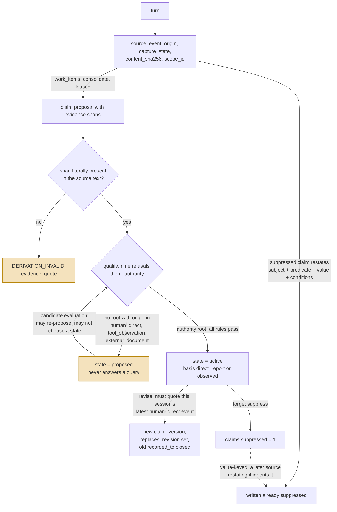

## 1. Executive Summary

Scope Recall 3.1 is a local memory core with host adapters, shipped as `hermes-scope-recall` and imported as `scope_recall`. SQLite is the only authority; the vector index holds metadata and a vector against an empty payload and can be deleted and rebuilt without losing a memory. MIT, 269 stars, five contributors, created 15 May 2026 and pushed through 18 September 2026, 48,289 lines of Python in the package beside 35,453 in tests and 1,479 test functions. Four runtime dependencies, all bounded; LanceDB, Codex support and the embedding stack are optional extras.

This is not a revision of the 2.x this report used to describe. The changelog says so in the first paragraph — *"we did not write a patch on top of 2.0 — we rebuilt most of the project"* — and the storage, retrieval, background worker, host boundary and deletion path are all new code.

The organizing idea is that **a claim has to quote its source, word for word, and the quote is checked.** `claim_storage.py:340-341` refuses a derivation whose `span["quote"]` is not literally present in the stored source text. Everything else follows from that: recall can show why it believes something, a wrong memory can be traced to the sentence that caused it, and — the part that matters for this atlas — *promotion* becomes a property of the evidence rather than of whoever asked.

`qualify` (`claims.py:514-539`) is the ladder that decides. A proposal is `proposed` unless a cited root survives nine refusal rules, and one of those rules requires a root whose origin is `human_direct`, `tool_observation` or `external_document`. The agent's write tool stamps `assistant_visible`, which lends none of them. Five kinds — preference, constraint, decision, intention, alias — require a human root specifically. The docstring is exact about what the rule is for: it *"neither invents dates nor converts the model's requested state into governance authority."*

Marks: all seven. `tombstone` is new and is the reversal — `_inherits_suppression` keys on subject, predicate, value and conditions rather than on a row id, and runs inside every source write.

The honest caveat is the project's own. `scripts/check.py --tier release` runs 900 tests with none failing and still exits 2, reporting `missing_gates: ["model"]`, because the P18 acceptance corpus it demands is not committed — `tests/eval/public_fixture.jsonl` holds two rows and both are flagged `"simulation": true`. The README says to read a green test count as exactly that and never as a passing release gate. This report does.

## 2. Mental Model

A turn is a `source_event`, and a source event is not a memory. It carries an `origin` from a closed set — `human_direct`, `assistant_visible`, `tool_observation`, `external_document`, `host_generated`, `memory_reinjection`, `imported`, `origin_unknown` — a `capture_state` of `complete`, `partial` or `gap`, and two content hashes. Memory is what a background pass extracts from it: a `claim`, held as a chain of `claim_versions`, each quoting the exact span of the exact source revision that supports it.

A claim version's `state` is the whole trust model. `proposed` means the evidence did not clear the ladder; such a version is never the answer to a query and exists so retrieval can show it labelled. `active` is a belief. `disputed`, `superseded` and `retracted` are the three ways one stops being current, and none of them deletes anything — a change appends a version and closes the previous one's record interval.



The loop worth naming is the dashed edge. Most stores in this atlas key a deletion on the record, so re-extraction from a later conversation produces a new record that walks straight past it. Here the suppressed claim itself is the ledger: `_inherits_suppression` asks whether an incoming source event's text contains that claim's subject, its predicate, its `value_text` and every one of its conditions, and if it does the new event is written suppressed. The old version of this report withheld `tombstone` because 2.x keyed its purge tombstones on a hash of scope and row id. This is the thing it was looking for.

## 3. Architecture

A Python package with a core that knows nothing about any host, and adapters that do. `core/` holds the schema, the claim rules, the storage transactions, recall, consolidation and deletion — 75 modules. `adapters/hermes/` and `adapters/codex/` bind identity, authorization and a tool surface each. `runtime/` owns the background worker: launch, watchdog, leases, budgets and embedding retry. `vector/` is the companion — LanceDB natively, a SQLite table as fallback, and a subprocess store when the native library has to be isolated. `contracts/` is a directory of JSON Schemas for every request and view shape, which is unusual and useful: `recall_packet.schema.json`, `forget_request.schema.json` and the rest are the boundary, checked rather than described.

Background work is durable rather than threaded-and-hoped. `work_items` carries a `work_type` of `consolidate`, `embed`, `rebuild_projection`, `purge` or `evaluate_candidate`, a `state` of `pending`, `leased`, `done`, `failed` or `obsolete`, an `attempt` count, an `available_at`, a lease token, owner and expiry, and a `UNIQUE(work_type, subject_ref, subject_revision)` so the same subject cannot be queued twice. A crashed pass loses its lease and the item returns to `pending`.

### Deployment and ergonomics

`pip install hermes-scope-recall`, then the adapter's installer; `hermes-scope-recall` and `scope-recall` are both console entry points into `maintenance/cli.py`. The four required dependencies are PyYAML, jsonschema, packaging and tzdata-on-Windows, so the base install is light and the vector arm is an extra. The store is one SQLite file and readable by hand.

## 4. Essential Implementation Paths

- **Capture.** A host adapter writes a `source_event` through `storage.py:put_source` (`:381`). Before the insert, `_inherits_suppression` (`:371-379`) asks whether the content restates a suppressed claim in this scope, and `_check_source_group` refuses a revision whose hash disagrees with one already stored at that revision.
- **Consolidation.** A `consolidate` work item leases the event and asks the configured model for a `consolidation_result`. `worker_consolidation.py:217` and `consolidate.py:225` both check `quote not in content` before a proposal is allowed out of the pass, so the model's citation is checked twice before storage checks it a third time.
- **Storage of a claim.** `claim_storage.py:322-345` inserts the new `claim_versions` row, closes the previous revision's `recorded_to`, and writes one `evidence_links` row per span — after `if span["quote"] not in source.event["content"]: raise ContractError("DERIVATION_INVALID", "evidence_quote")` and after `require_live_source`. A suppressed source marks the claim suppressed in the same transaction (`:343-344`).
- **Qualification.** `claims.py:_cite` (`:336-360`) keeps only roots that are both cited and `capture_state == "complete"` with no capture gaps — *"a summary may link to a root for lineage, but cannot lend its own wording that root's authority"* — and narrows each root's text to the neighbourhood of its quote. `qualify` (`:514-539`) then runs nine refusals; any one of them returns `Qualification("proposed", "inferred_suggestion", reason)`.
- **Recall.** `recall.py` runs exact-reference, lexical, claim, recent and vector channels, fuses them by reciprocal rank, and hydrates each survivor through `retrieval_storage.py:hydrate` (`:636`), which re-reads the object from the scoped transaction, applies the time window, and marks a superseded source `historical` rather than dropping it. The vector call is given three quarters of the remaining deadline so hydration and the packet's authority checks keep the rest (`recall.py:142-145`).
- **Answering a claim.** `select_effective` (`claims.py:577-599`) applies `known_at` first, dropping versions recorded after the cutoff, then picks the version whose validity interval covers the instant, and returns `None` for `retracted`.
- **Revision.** `mutate.py:revise` requires `expected_revision` and calls `claim_storage.py:current_human` (`:391-401`), which finds the session's most recent `human_direct` source event in scope and raises `ACCESS_DENIED` unless the caller's `source_evidence_refs` name that exact `event@revision`, then checks the source is complete and ungapped.
- **Deletion.** One `deletion_operations` row keyed on `request_sha256` carries mode, scopes, requested refs, expected revisions, memory epoch and the layers it covered. `delete_storage.py:194-239` blocks the objects, rewrites removed sources to a content-free marker, and blanks `claim_versions.payload_json`; `restored_absence_blocks` fences the derived layer so a rebuild cannot resurrect what was removed.

## 5. Memory Data Model

| Table | Holds |
| --- | --- |
| `source_events` | the captured turn: `origin`, `role`, content and two hashes, `scope_id`, `session_id`, `project_id`, `branch_id`, `occurred_at`/`recorded_at`/`persisted_at`, `time_precision`, `capture_state`, capture gaps, `read_blocked`, `suppressed` |
| `claims`, `claim_versions` | the claim and its append-only revision chain: `state`, `basis`, `qualification_reason`, `valid_from`/`valid_to`, `recorded_from`/`recorded_to`, `replaces_revision`, conflicts |
| `evidence_links` | per object version, the source ref and revision, the relation (`supports`, `derived_from`, `contradicts`), the quote and its location |
| `work_items`, `work_error_details` | the leased background queue and the field that caused each failure |
| `candidate_lifecycle`, `candidate_evidence`, `candidate_evaluations`, `candidate_trigger_terms`, `candidate_source_triggers`, `candidate_scan_cursors` | processing state beside a claim version — never the fact state |
| `deletion_operations`, `deletion_members`, `object_blocks`, `source_group_blocks`, `restored_absence_blocks` | the deletion ledger and the fences that keep a rebuild from undoing it |
| `episodes`, `episode_versions`, `episode_events`, `artifacts`, `artifact_versions`, `reference_bindings`, `reference_versions` | the other versioned object kinds, built on the same pattern |
| `lexical_projection`, `instance_scopes`, `instance_meta`, `consolidation_fragments`, `consolidation_outcomes`, `capture_inbox`, `unresolved_updates` | the rebuildable index, the scope registry and the consolidation bookkeeping |

Every table is `STRICT`, and the constraints do real work: five states on a claim version, five bases, eight origins, three capture states, three evidence relations, and two interval checks per version.

The separation worth copying is `candidate_lifecycle` versus `claim_versions.state`. The first is *processing* — `pending_evaluation`, `waiting_evidence`, `archived`, `blocked` — and its module says what it is not: *"Candidate processing is metadata beside a claim version. It never replaces the fact state and it never grants source, identity or write authority."* The second is the epistemic state, and only `qualify` writes it.

## 6. Retrieval Mechanics

Five channels, fused by reciprocal rank: exact reference, lexical projection, claim, recent-raw and vector, with a relation and a background channel beside them. Each is budgeted separately (`retrieval.py:67` sets `vector_limit: 48`) and a channel that cannot run contributes a named gap rather than silence — `vector_unavailable`, `deadline_exceeded_vector`, `vector_rejected:<reason>`.

The scope predicate is built the same way everywhere: `sorted(context.allowed_scope_ids)` becomes a placeholder list and the query carries `scope_id IN (…)`. `_scope()` (`storage.py:160-161`) raises rather than widen when a caller names a scope outside the set.

The vector arm is treated as a claim to verify, not a result to trust. A candidate that survives `vector_admission` still has to pass `hydrate`, which re-reads the object from the scoped transaction; a companion row pointing at another scope, another branch, a deleted object or a retired embedding space hydrates to `None`. That is precisely what the negative test asserts, with five candidates failing five different ways and a 0.999 score among them.

The packet then states an `answerability` of `supported`, `partial`, `ambiguous` or `unknown` (`recall_packet.py:283-308`). A store that can say *this corpus cannot answer that* is rarer here than one that can rank.

## 7. Write Mechanics

**Capture is cheap and synchronous; meaning is neither.** The adapter writes a source event and returns. A `consolidate` work item then leases the event, asks the model for claim proposals, and every proposal must quote its source. The model is asked for a citation, and three separate places check the citation is real — twice in the consolidation pass and once at the storage boundary, which is the one that raises.

**Promotion is not a write verb.** There is no promote, approve or apply anywhere on either adapter's tool surface. A proposal becomes `active` because `qualify` found an authority-bearing root among the sources it cites, and stays `proposed` otherwise. The candidate evaluator can re-propose the same claim against fresh sources, and its system prompt ends with the sentence that makes it safe: *"Do not choose a fact state: Core qualification owns that decision."* The code enforces that by not reading a state from the model's reply.

**Correction appends.** `revise` takes a `target_ref`, an `expected_revision`, a new value, conditions, source evidence refs and a `valid_from`, and writes a new `claim_versions` row with `replaces_revision` set while closing the old row's `recorded_to`. The previous payload stays readable.

**Forgetting has two modes and one record.** `suppress` sets `claims.suppressed=1` and blocks automatic reads while leaving an explicit read working; `delete` rewrites the source content to a marker and blanks the version payloads. Either way one `deletion_operations` row, keyed on the request hash, makes the operation idempotent — `test_delete_idempotence_is_zero_mutation_even_after_authorization_source_removed` asserts the database file is byte-identical after a repeat.

## 8. Agent Integration

Two adapters, both read-mostly. Hermes publishes `recall`, `inspect`, `profile`, `entity`, `revise`, `forget`, `status` and `trace` (`adapters/hermes/tool_surface.py`). The Codex MCP server publishes those plus `propose_memory` and marks each with MCP annotations — read-only for the six read tools, `destructive_hint=True` for `revise` and `forget`.

Three details make the surface worth reading closely.

`propose_memory` is described as recording *"an assistant-visible candidate without promoting it to authority"*, and the handler stamps `origin="assistant_visible"` itself rather than accepting an origin argument — so the agent's own writes cannot lend authority to anything.

`_request_context` binds the call to Codex's reserved MCP thread metadata and says why: *"The model cannot provide this value as a tool argument. A missing or malformed host binding remains usable for reads with an explicit gap, while mutations fail closed."*

And `revise` over the stdio server passes `origin="human_direct"` with a comment admitting the label is a formality — *"The stdio server has no attested Codex user turn. Core still requires its own human evidence and expected revision before changing state."* That comment is checkable and it is true: `current_human` reads `source_events`, not the context label, so the label buys nothing.

## 9. Reliability, Safety, and Trust

**Authority is a property of the source, not of the caller.** This is the single design decision the whole report turns on, and it is the answer to the weakness the 2.x version of this page recorded: there, the promote transition was on the model's own tool surface behind a `dry_run` flag. Here there is no promote transition. A claim's state is recomputed from what it cites.

**The state gate is enforced where the answer is chosen.** `select_effective` never returns a `proposed` version and never returns a `retracted` one. `select_proposal` returns the head only so a caller can display it labelled, and refuses for `as_of` queries on the stated ground that an unpromoted proposal cannot answer about the past.

**Suppression is by value.** The tombstone check runs inside `put_source`, so it applies to material arriving from any host, in any session, in the same scope — not only to a re-derivation that happens to cite the suppressed source.

**Deletion is fenced against its own rebuild.** `restored_absence_blocks` exists because the vector index is rebuildable, and a rebuild from a stale snapshot would otherwise resurrect what a deletion removed.

**Three limits.** A claim version has no actor column, so the answer to *who changed this* is reached by following the cited source event rather than read off the change. Both adapters run in the user's own process, so a general shell there is outside what these marks measure. And the Codex MCP server's `revise` context label is decorative — harmless because the check ignores it, but a reader skimming for `human_direct` will find it in a place where it means nothing.

## 10. Tests, Evals, and Benchmarks

1,479 test functions across `tests/contract`, `tests/unit`, `tests/integration`, `tests/host`, `tests/migration`, `tests/packaging` and `tests/storage_native`. I ran none of it: a dependency surface changed inside the seven-day cooldown, so nothing was installed.

The negative case is `test_P08_high_score_candidates_still_no_match_after_authority_hydration` (`tests/contract/test_v11_recall_admission.py:190-220`) and it is well built: five vector candidates, five distinct exclusion reasons, one of them scored 0.999, asserting `result.items == ()` and an `unknown` answerability. Its positive controls sit on either side of it in the same file.

`tests/contract/test_recall_probe_set.py` is worth reading for its honesty about what a gate can and cannot check. The probe set has answerable and unanswerable questions with regex predicates, and the test file's own docstring says scoring it *"against a real corpus, which no gate has"* is not something it does — so it checks instead that every question is asked once, no question is in both sets, and no predicate is loose enough to match an audit dump. The comment beside the specificity assertion names the failure it prevents: *"A bare common word would match an audit dump quoting other events, which is the false positive that once made a worse ranking look better."*

The release gate does not pass, and the README leads with that rather than burying it. `scripts/check.py --tier release` exits 2 with `missing_gates: ["model"]`. The gate wants a P18 acceptance receipt over 120 independent core items and 240 paired variants with evidence marked `real`, a method adjudication accepted by an independent party, and an independent semantic scorer. The machinery is in the tree; the corpus is not, and the two rows in `tests/eval/public_fixture.jsonl` are flagged `"simulation": true`. Integration is reported at 1223/0 and packaging at 114/0, both exit 0.

No paper.

## 11. For Your Own Build

### Steal

- **Check the quote at the storage boundary.** Asking a model to cite its source is a prompt; refusing the write when `span["quote"] not in source.event["content"]` is a constraint. The same check appears three times here, and only the innermost one matters.
- **Derive authority from the cited source's origin.** A closed origin vocabulary on the source event, an authority subset, and a rule that reads the subset — so the question "may this be believed" is answered by what it quotes rather than by who called the tool. Nothing on the tool surface then needs to be locked down, because nothing on it grants anything.
- **Split processing state from epistemic state.** `candidate_lifecycle.processing_state` and `claim_versions.state` are different columns with different writers, and the module that owns the first says in its docstring that it never touches the second. A model may move the first.
- **Require the change to quote the human turn that asked for it.** `current_human` does not check a role or a flag; it finds the latest `human_direct` event in the session and requires the caller to have named it. A caller that was not in the conversation cannot guess it.

### Avoid

- **A context label that looks like an authority.** `origin="human_direct"` on the stdio `revise` path is inert, and the comment says so, but it is the kind of string a later reader trusts by sight. Let the check be the only place the word appears.
- **A value-keyed rule with no test for its own branch.** `_inherits_suppression` is the strongest thing in the deletion path and the test beside it exercises the cited-source branch of the same `or`. An uncited restatement is the case the mechanism exists for.

### Fit

For a local, single-user memory under Hermes or Codex where you care more about being able to trace a belief than about recalling everything, this is now one of the most carefully built things in this corpus. It is also a release candidate that says it is not a release, and a 48,000-line core; adopt it as a product with a version you pin, not as a library to lift pieces from. If you want a store that simply accumulates what the model thinks, this will frustrate you by design: the model's own writes stay `proposed` until something in the conversation supports them.

## 12. Open Questions

- Whether an uncited restatement of a suppressed claim is caught in practice. The SQL uses `instr` against the whole event content, so it matches a paraphrase only when subject, predicate, value and conditions all survive verbatim; the failure direction is a missed suppression rather than a false one.
- What fraction of consolidated proposals end `proposed` in a real conversation, and whether that queue is read. Nothing automatic promotes them, which is the design, and nothing measures how large it grows.
- Whether the P18 acceptance corpus is intended to be published. The gate is written, the machinery ships, and the release stays a candidate until a corpus exists that nobody in the tree can currently supply.

## Appendix: File Index

- Claim rules and states: `core/claims.py`, `core/claim_storage.py`, `core/claim_normalization.py`, `core/schema.py`.
- Capture and consolidation: `core/storage.py`, `core/capture.py`, `core/capture_inbox.py`, `core/consolidate.py`, `core/worker_consolidation.py`.
- Candidates: `core/candidate_lifecycle.py`, `core/candidate_evaluations.py`, `core/candidate_tables.py`, `core/candidate_intake.py`.
- Retrieval: `core/recall.py`, `core/recall_packet.py`, `core/retrieval.py`, `core/retrieval_storage.py`, `core/recall_policy.py`.
- Mutation and deletion: `core/mutate.py`, `core/deletion.py`, `core/delete_storage.py`, `core/restore.py`.
- Hosts: `adapters/hermes/tool_surface.py`, `adapters/codex/mcp_server.py`, `adapters/codex/boundary.py`, `adapters/lance.py`.
- Background: `runtime/worker_entry.py`, `runtime/scheduling.py`, `core/work_storage.py`.
- Contracts and tests: `contracts/`, `tests/contract/`, `scripts/check.py`.

**Searches recorded for the negative claims**

```sh
rg -n 'promote|approve' adapters/hermes/tool_surface.py adapters/codex/mcp_server.py   # 0: no promotion verb on either tool surface
rg -n '"name"' adapters/hermes/tool_surface.py                                          # recall, inspect, profile, entity, revise, forget, status (+ trace)
rg -n 'CREATE TABLE' core/schema.py | rg -i 'audit'                                     # 0: governance_audit_events is gone with 2.x
rg -n '(UPDATE|DELETE FROM) claim_versions' core/                                       # recorded_to only, plus the deletion path's payload blanking
rg -n 'fact_state' --glob '!tests/**' .                                                 # candidate_tables.py and candidate_lifecycle.py only; never written from a model reply
rg -n '_inherits_suppression' core/                                                     # defined storage.py:371, one caller at :412, inside put_source
rg -n 'inherit' tests/ | rg -i suppress                                                 # test_v11_deletion.py:83, the cited-source branch
rg -n 'missing_gates' README.md                                                         # the release gate exits 2 and the README says so
```

## History

**2026-09-19** — [`abe54277867ca516b09b230093b9e2e6a9dbaaa6`](https://github.com/410979729/scope-recall-hermes/commit/abe54277867ca516b09b230093b9e2e6a9dbaaa6) — full re-read, and the report above is new rather than revised. The entry below explains why it was owed: the tree was rebuilt, not patched, and every file the six evidence records anchored into is gone. All six marks are re-earned on new code, and a seventh is **awarded**. `tombstone` had been withheld because 2.x keyed its purge tombstones on a hash of scope and row id; 3.1 has `_inherits_suppression` (`core/storage.py:371-379`), which runs inside every `put_source` and asks whether the incoming text restates a suppressed claim's subject, predicate, value and every condition — the value, not the record. `human_review` is the other change of footing: there is no promotion verb on either adapter's tool surface, because promotion is not a verb. `qualify` recomputes a claim's state from what it cites, and refuses `active` unless a cited root carries an origin in `('human_direct','tool_observation','external_document')` — which the agent's own `propose_memory` cannot produce, since the handler stamps `assistant_visible` itself. `revise` and `forget` additionally have to name the session's most recent human turn by `event@revision`. Recorded as a limit: the Codex stdio server labels its revise context `human_direct`, and the label is inert because the check reads source events instead. Screened again first; a dependency surface was inside the cooldown, so nothing was installed and no suite was run.

**2026-09-18** — checked against `abe54277867ca516b09b230093b9e2e6a9dbaaa6` and **deliberately not re-pinned**. The tree has been rewritten rather than revised: 1,130 files changed, +95,899 and −294,328 lines, the flat modules replaced by packages, and every file this report's six evidence records anchor into — `candidate_review.py`, `tooling.py`, `memory_quality.py`, `memory_browser.py` — is gone. Moving the pin without re-reading would leave six records pointing at nothing, so the report stays at `578b955`, which it still describes accurately, and a full re-read is owed.

One change is worth recording now because it answers this report's own stated weakness. The `human_review` record noted that the promotion transition was *"exposed to the model as `scope_recall_memory` with `dry_run=false`"*, and at the old pin `tooling.py:141-170` did exactly that — `dry_run` defaulted to `True` and passing `false` applied the change. At HEAD the agent-facing surface is `adapters/hermes/tool_surface.py`, and it publishes seven tools: `recall`, `inspect`, `profile`, `entity`, `revise`, `forget`, `status`. There is no promotion verb, no candidate verb and no `scope_recall_memory`. The candidate lifecycle itself survives and has grown — `candidate_lifecycle`, `candidate_evidence`, `candidate_evaluations` and `work_items`, with `JUDGEABLE_STATES` of `proposed` and `disputed` — but whether a person or an evaluation moves a candidate out of those states is the question the re-read has to answer, and it is not one to settle from a file listing.

**2026-09-11** — [`578b955802df753f2e2208e26eab6f71971285a0`](https://github.com/410979729/scope-recall-hermes/commit/578b955802df753f2e2208e26eab6f71971285a0) — first reading. Screened with `scripts/screen_repo.py`: no auto-running configuration, one `conftest.py`, and `pyproject.toml` inside the seven-day cooldown with no lockfile beside it. Read only; nothing was installed, built or run.
