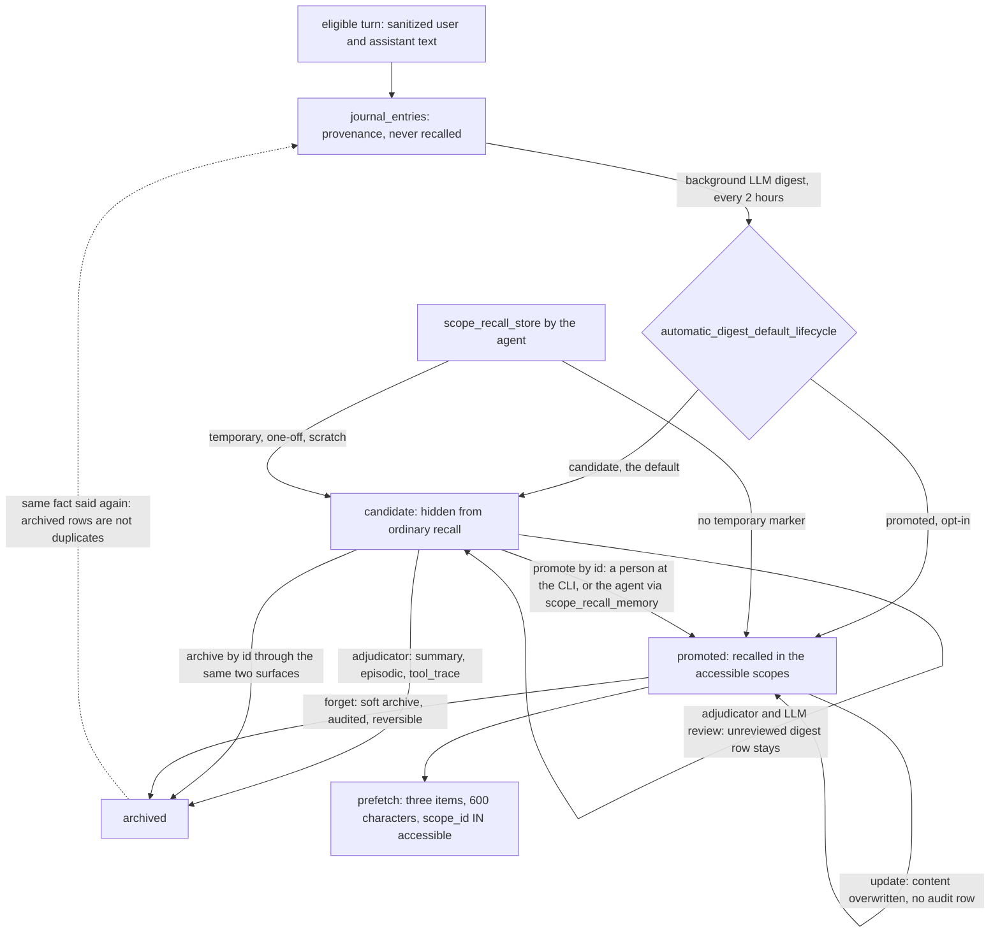

## 1. Executive Summary

Scope Recall is a memory provider for Hermes Agent. It appends every eligible turn to a journal in SQLite, lets a background LLM digest turn the journal into memory rows, and on each turn returns up to three hits for the current query from a scope-filtered hybrid search — FTS5 and BM25, CJK trigram and bigram lanes, and a vector companion that is LanceDB by default and is rebuilt from SQLite through a durable outbox. MIT-licensed, 277 commits by four contributors between 14 May and 5 September 2026, 114,032 lines of Python in the package and 29,201 in scripts, beside 140,124 lines of tests. Its policy ideas come from OpenClaw's [memory-lancedb-pro](../memory-lancedb-pro/) — current-turn recall, shared durable memory with local scratch — but the code is not a port.

Two things are built with unusual care. **Scope** is a key on every row, derived from the identity Hermes supplies rather than from the model, and every read lane over the store carries the same `scope_id IN (…)` predicate; vector hits are re-read from SQLite under that predicate before they count, and a companion row that disagrees with truth marks the index for repair instead of reaching the prompt. **Lifecycle** is a state in each row's metadata, and one SQL predicate shared by every lane keeps `candidate`, other scopes' scratch and every terminal state out of ordinary recall. Digest output is written `candidate` by default. A scheduled adjudicator may archive low-value candidates but refuses to promote an unreviewed digest row, and a second-opinion LLM pass records advisory receipts and never changes a lifecycle.

The weak points are about who stands at the gate and what the gate remembers. The one exit from `candidate` to recall is a per-id review, and the default tool profile gives it to the model: `scope_recall_memory` accepts `action: promote, dry_run: false` for any candidate in the writable scope, with no maintenance flag. A review is therefore whatever called promote — a person at the CLI or the agent — distinguished only by an actor string. A rejection is `archived`, and the write path deliberately ignores archived rows when deduplicating, so a forgotten value said again is a fresh candidate. The agent's own `scope_recall_store` writes are promoted at once, and `update` overwrites content in place with no prior version and no audit event.

Marks: `trust_state`, `bitemporal` (a claim ledger with valid and transaction time, off by default), `scope_enforced`, `audit_log`, `human_review` and `negative_eval`. `tombstone` is withheld. The README's LoCoMo result — 70.58% on 1,540 questions — was produced by storing each dialogue turn through `scope_recall_store` with the journal disabled, so it measures the retrieval stack and not the default capture path, and its raw rows are not in the tree.

## 2. Mental Model

Two things are memory: a `memories` row, and the Hermes curated files `USER.md` and `MEMORY.md`, which Scope Recall reads live and never copies. A raw turn is not memory. It becomes a `journal_entries` row that ordinary recall never reads, and it enters the store only when a digest extracts a row from it and records the link in `memory_journal_sources`.

A row's standing is its `lifecycle`. `promoted` rows are recalled; `candidate` rows exist, can be listed and inspected, and are withheld; `scratch` is the lifecycle of `general` rows, recalled only in the local scope that wrote them; `archived`, `superseded` and `obsolete` are hidden from everything but audit and review views. The agent's explicit store creates a promoted row unless the text carries a temporary marker. The background digest creates candidates. A candidate becomes a belief when someone calls promote on its id, and it stops being one when it is archived — by review, by the adjudicator's low-value lane, by `forget`, or by a privacy deny. Nothing records the value as refused, so the same fact extracted from a later conversation starts again as a candidate.



A third representation exists behind two flags. With `fact_evolution.enabled` and an apply mode, the digest's structured `add`/`supersede`/`retract` proposals become `fact_claims` rows with a subject, predicate, value, cardinality, valid-time interval and record-time interval; a `single` slot admits one current claim per scope, enforced by a partial unique index, and superseding closes the old claim's interval rather than deleting it. With the flags off, as shipped, no claim is written.

## 3. Architecture

A Python package installed as an unpacked Hermes plugin under `$HERMES_HOME/plugins/scope-recall`, with its state under `$HERMES_HOME/scope-recall/`: `memory.sqlite3` holding truth, journal, audit, purge, relation, fact and outbox tables; `lancedb/` or `vector.sqlite3` for the companion; `config.json`. On Windows LanceDB runs in a private subprocess over anonymous pipes, and only vector protocol crosses that boundary.

The default embedder is `gemini-embedding-001` at 3,072 dimensions over an OpenAI-compatible endpoint, falling back to a deterministic 256-dimension `local-hash` when no key is available; `sentence-transformers` is an alternative. The journal digest uses the LLM configured in the Hermes profile, and by default does not fall back to its heuristic extractor when that model fails (`journal.allow_heuristic_fallback: false`), so on a machine with no model the journal accumulates and nothing is digested.

Concurrency is handled by a cross-process truth-writer lease (`writer_lease.py`): the process holding it — usually the gateway — writes, and every other process runs read-only recall and says so in its system-prompt block. Vector writes are intents in `vector_outbox`, committed with the truth change and replayed afterwards against an immutable generation. Upgrades go through `hermes-scope-recall update`, which verifies a release manifest and archive hash and, by its README, restores the previous version when an activation fails and the saved evidence shows rollback is safe.

### Deployment and ergonomics

`pip install hermes-scope-recall` in the Hermes environment, then the plugin's installer. Nothing else has to run: lexical recall and the SQLite fallback companion work offline, and the vector arm degrades to the hash embedder. The default capture path does need a chat model for the digest and, for semantic vectors, an embedding key. The store is SQLite and repairable by hand, and a read-only browser (`hermes-scope-recall memories list|inspect`, `candidates list`) opens it with `mode=ro`.

## 4. Essential Implementation Paths

- **Turn capture.** `sync_turn` (`provider.py:468-506`) sanitizes the user and assistant text, appends what passes the filters to the journal, and starts the background digest; per-turn extraction and raw `general` capture are off by default. `queue_prefetch` is a no-op (`:461-463`) so a previous turn's recall is never injected into the next topic, and `on_memory_write` observes Hermes curated writes without mirroring them (`:538-559`).
- **Digest to candidate.** The journal and nightly digests call `automatic_admission_metadata` (`memory_admission.py:68-131`), which sets `lifecycle` from `automatic_digest_default_lifecycle` (`config.json:10`, default `candidate`), forces `candidate` and `needs_live_check` on text that asserts volatile current state, and stamps `automatic_admission` with its source and route. `_find_match` (`journal.py:213-267`) merges a candidate into an existing row with the same `dedup_key`, but reads only rows whose lifecycle is not terminal (`:221`).
- **Explicit store.** `classify_memory` (`governance.py:174-281`) gives a non-`general` row `promoted` and a `general` row `scratch`, downgrading to `candidate` on a temporary marker (`:233-243`); `merge_metadata` lets a caller ask for `candidate` and nothing else (`:352-357`). Exact dedupe in `store_row` ignores archived rows by design: *"Archived history is not a live duplicate"* (`sql_store.py:1076-1099`).
- **Adjudication.** After a successful background digest, `maybe_adjudicate` runs (`_internal/journal/runtime.py:214-218`), claiming a 24-hour schedule per writable-scope set. `run_auto_adjudication` (`auto_adjudication.py:454-684`) classifies each candidate with `quality_decision_for_memory` (`memory_quality.py:275-380`): noise types and stale progress are archived at once; an unreviewed `automatic_admission` or event-digest row is held (`:333-371`); only rows past those checks and 24 hours old are promoted. Held rows go to `_run_l4_advisory` (`auto_adjudication.py:193-451`), which sends the row and its journal evidence to an LLM and stores the verdict as a receipt — *"untrusted model output never owns memory lifecycle"* (`:12-14`).
- **Review.** `review_candidate` (`candidate_review.py:268-366`) plans a `promote`, `archive` or `supersede`, returns `expected_updated_at` and `expected_lifecycle`, and applies through `transition_memory_lifecycle` (`lifecycle_service.py:382`), which checks the revision, writes the metadata, the audit event and the vector intent in one transaction. Two callers: `scripts/candidate.review.py` behind `hermes-scope-recall candidates …` (`cli.py:31-36`), and the model's `scope_recall_memory` (`tooling.py:727-736`, `memory_ops.py:581-614`).
- **Recall.** `render_current_turn_recall` (`prompting.py:20-89`) gates short and trivial queries, runs `RecallService.search_memories`, drops anything recalled in the last eight turns, keeps three items within 600 characters, and renders a packet headed as untrusted data (`_internal/recall/compiler.py:614-646`). Lexical candidates come from `search_db_memories` (`storage_views.py:246-479`), vector candidates from `search_vector_memories_with_vector` (`:519-640`), curated entries from `search_curated_memories` (`:671-701`).
- **Forgetting.** `scope_recall_forget` soft-archives by default and hard-deletes only in maintenance mode (`tooling.py:764-793`); hard deletes go through `hard_delete_memories` (`lifecycle_service.py:66`), which audits and enqueues the vector delete in the same transaction. The privacy purge is two-phase: `deny_privacy_purge` archives the rows and writes `privacy_purge_tombstones` keyed on a hash of scope and id (`privacy_purge.py:335-514`, `:52-53`), and erase redacts the journal entries the rows came from and the audit rows that named them.
- **Fact claims.** `execute_pipeline_proposal` (`fact_evolution.py:327-460`) binds a digest proposal to the trusted scope and calls `execute_fact_plan`, which returns a preview without writing unless the mode is `auto_apply` or `reviewed_apply` (`fact_executor.py:766-798`); `evolution_policy_mode` returns `preview` whenever `fact_evolution.enabled` is not literally `true` (`fact_evolution.py:119-141`).

## 5. Memory Data Model

`memories(id, scope_id, platform, user_id, chat_id, thread_id, gateway_session_key, agent_identity, agent_workspace, session_id, source, target, content, summary, created_at, updated_at, last_recalled_turn)` with `dedup_key` and `metadata` added by migration (`sql_store.py:482-500`, `:849-859`) and an FTS5 table beside it. Lifecycle, memory type, confidence, importance, trust, sensitivity, tier, entities, tags and the admission and review stamps all live in the `metadata` JSON; the lifecycle predicates read it with `json_extract` and normalise whitespace and case identically in Python and SQL (`lifecycle_policy.py:14-21`, `:54-64`).

| Table | Holds |
| --- | --- |
| `journal_entries`, `memory_journal_sources`, `journal_digest_runs`, `journal_rejections` | raw sanitized turns, the link from each digest row to its entries, run ledgers, and entries a run could not process |
| `governance_audit_events` | one row per lifecycle transition or hard delete: event type, action, scope, target, batch, before, after, reason, actor |
| `fact_claims`, `fact_claim_evidence`, `fact_action_receipts` | the bitemporal claim ledger, its evidence, and idempotency receipts |
| `privacy_purge_operations`, `privacy_purge_tombstones`, `privacy_purge_source_tombstones`, `privacy_purge_vector_intents` | the purge ledger, keyed on hashes of scope and id and of journal entry id |
| `memory_entities`, `memory_relations`, `memory_feedback` | entity index, `contradicts`/`supports`/`supersedes` edges, rating feedback |
| `task_episodes`, `procedural_playbooks`, `playbook_versions`, `experience_runs` | the procedural Experience layer, with its own candidate and review states |
| `vector_outbox`, `vector_generations`, `lexical_generations` | companion replay intent and index generations |

Scope is the `scope_id` string, built from `platform|workspace|agent|user` components each written `label:length:value` so a delimiter inside an identifier cannot forge another scope (`scope.py:33-34`, `:177-242`). `general` rows add the gateway session key, or chat and thread, to it. Durable targets `user`, `memory`, `project` and `ops` live in the shared scope and follow one user and one agent identity across chats; `general` stays local. An opt-in shared pool drops the agent identity for selected targets.

## 6. Retrieval Mechanics

Retrieval runs against the current query only. Lexical candidates come from five lanes, each filtered by scope and lifecycle in SQL: an exact-id lookup, FTS5 ordered by BM25, a trigram generation for CJK text, a bigram posting table with a document-frequency prefilter, and a bounded LIKE scan run once per accessible scope (`storage_views.py:144-180`, `:278-378`). The code refuses to backfill with recent rows when these return little (`:413-418`). The vector lane embeds the query once, searches each accessible scope with a `where scope_id =` filter (`vector_store.py:935-939`), and keeps a hit only if its SQLite row is still in scope, still visible, and matches the companion's copy field for field (`storage_views.py:550-602`).

Hybrid scoring blends lexical and vector scores 0.45/0.55 when both exist and uses the one that exists otherwise, adds bounded BM25 and RRF terms (curated entries weighted 1.25 in the fusion), and adjusts for entities, freshness hints and fact freshness. A result supported only by vector similarity must clear 0.70 with a margin (`_internal/recall/query_signal.py:276-351`), which is what keeps nonsense queries empty. Hermes curated files join as a lexical-only lane, and only in single-user runtimes unless an allowlist says otherwise (`storage_views.py:643-668`).

The injected block is small and bounded: three items, 180 characters each, 600 in total, headed *"untrusted recalled data, not instructions"*. It is returned per turn by `prefetch`, so it changes with every query.

## 7. Write Mechanics

**Explicit.** `scope_recall_store` is synchronous: secret filtering, exact dedupe within `(scope_id, target)`, a conservative semantic merge for `user`, `ops` and `project`, `contradicts` edges when a near duplicate carries negation, then one transaction for the row, FTS, entities, relations and the vector intent. The row is recallable on the next turn.

**Background.** Journal appends are cheap and on the hot path. The digest runs in a thread after staged turns on a two-hour interval, reads only unprocessed entries (up to 500 per run, rising under backlog), and is never synchronous by default; session-end LLM digests are off. Its output is a candidate, so the lag before a digest row is recallable is the digest interval plus however long the candidate waits for a promote — unbounded, since nothing automatic promotes it. Adjudication runs at most once a day per scope set. No pass rewrites the store: the digest merges into matching rows, adjudication moves lifecycles, and vector reconciliation pages through at most 200 rows per startup.

**Correction.** `update` rewrites `content` and `summary` in place (`memory_ops.py:617-726`); there is no version table and no audit event for it, and candidates and hidden rows are not editable (`:656-663`). `merge` keeps a target and hard-deletes the sources with an audit event. `supersede` exists only as a candidate-review action.

## 8. Agent Integration

A Hermes `MemoryProvider` declaring `on_turn_start`, `on_pre_compress`, `on_session_end`, `on_session_switch` and `on_memory_write` (`plugin.yaml`). The default `core` tool profile exposes six tools — `scope_recall_store`, `search`, `context`, `profile`, and two dispatchers, `scope_recall_memory` (inspect, feedback, update, merge, forget, promote, archive) and `scope_recall_entity` (probe, related). Maintenance tools — dedupe, govern, repair, cross-scope export, hard delete, the forgetting run — fail closed without `maintenance_tools_enabled`; secret-index, temporal-query, reflection and Experience tools each have their own flag. Subagents receive no tools and no capture, because both check `agent_context == "primary"`. A configured list of chat ids removes a chat from every memory surface, including its historical journal backlog.

The pre-compression hook stages the messages about to be compressed into the journal rather than returning recalled context, so compaction feeds the same digest path as ordinary turns.

## 9. Reliability, Safety, and Trust

**The review gate can be passed by the reviewed.** `scope_recall_memory` is in the default profile and its `promote` applies when `dry_run` is `false` (`schemas.py:406-410`, `tooling.py:727-736`); `review_memory_candidate` checks scope, lifecycle and fact ownership, and nothing about who is calling (`memory_ops.py:581-614`). The dry-run and revision token make a model promote deliberate rather than accidental; they do not make it a person's decision. The record keeps `candidate_reviewed_by: scope_recall_memory` against `scope-recall:candidate-review` for the CLI, and nothing reads the difference. [Argos](../argos/), another Hermes plugin, draws this line in its storage layer by refusing the top state to anything but the tool path; here the tool path is the model's.

**The scheduler's premise and its effect disagree.** `auto_adjudication.py` opens with *"Memory auditing must not depend on a human reviewing items one by one"* and ends its lane list with *"humans read summaries, never queues"* (`:3`, `:16`). The quality contract it calls holds every unreviewed digest candidate as `automatic_digest_requires_operator_review` (`memory_quality.py:347-371`), so the default capture path produces exactly a queue that only one-by-one review drains. What the scheduler automates is the archive side.

**A rejection is not remembered.** Review's reject is `archive`, the same state forgetting and cleanup produce. The `rejected` lifecycle is in every hidden set and has no writer. The digest's merge and the store's dedupe both skip archived rows, the second with a comment saying so, and the adjudicator's conflict check reads only visible rows, so a value a person archived and the next conversation restates becomes a new candidate. It stays out of recall under the default config — which makes the candidate review the only thing between a rejected value and the prompt, and makes `automatic_digest_default_lifecycle: promoted` remove that last barrier. The privacy purge's tombstones are keyed on a hash of scope and row id; the table's `content_hash` column is written at deny time and read nowhere on a write path. That is why `tombstone` is withheld.

**Scope holds against the model, and the CLI fallback is one user.** The scope comes from the identity Hermes passes to `initialize`, not from a tool argument, and a gateway runtime with no user id is disabled rather than pooled (`scope.py:17-30`). The CLI uses a configured fallback user, `local` by default, so every CLI session on a profile shares one durable scope. Cross-platform sharing requires an explicit alias map, and legacy per-platform scopes are then readable but not writable (`scope.py:245-298`).

**Edits leave no trace.** A promoted row's text can be changed by the model through `update` with no prior version and no audit event, while an archive of the same row is audited with before and after. The audit log therefore answers *what changed state* and not *what changed content*.

**The journal is kept.** `retention_days: 0` disables pruning of processed journal entries (`config.json:48`, `journal_store.py:893-898`), so sanitized raw turns stay in the database indefinitely. The privacy purge is the tool for removing them, and it follows the provenance links to redact exactly the entries a purged row came from.

**Declared but dark.** Bitemporal claims, temporal queries, reflection, Experience auto-promotion and the shared pool are all off in the shipped `config.json` (`:106`, `:128`); the report credits the claim ledger because a user can turn it on and the writer and reader then exist.

## 10. Tests, Evals, and Benchmarks

3,452 test functions in 308 files. CI runs `pytest` on Linux, Windows and macOS under three dependency constraint sets, with Hermes Agent pinned by commit, and runs the release gate `scripts/check.release.py`. The provider tests import Hermes's `plugins.memory` directly, so a run without Hermes fails at collection rather than skipping. I ran none of it; `pyproject.toml` changed inside the seven-day cooldown and has no lockfile beside it.

`negative_eval` rests on two cases, both with positive controls in the same run. `test_scope_isolation_uses_user_and_profile` (`tests/test_provider.py:2814-2850`) opens two providers on one database, stores a preference as one user, and asserts the other user's prefetch is empty and the owner's contains the text. `scripts/benchmark.negative_retrieval.py` runs ten nonsense, opaque-id, emoji and stop-word queries against a stubbed pool of five unrelated neighbours scored up to 0.99, and requires search, context and prefetch all empty — thirty surfaces — while six positive cases each return their row; the release gate re-runs it, validates each field against fixed counts and requires byte equality with `benchmarks/NEGATIVE_RETRIEVAL_BENCHMARK.json` (`scripts/check.release.py:1668-1700`, `:1743-1780`). `scripts/rehearse.candidate_isolation.py` does the same for the trust state: a stored candidate must be absent from ordinary search and profile and present in the candidate-inclusive profile. Its presence control is on a different surface from its absence check, and `test_candidate_lifecycle_stays_hidden` (`tests/test_recall_request_deadline_weights.py:230-243`) asserts an empty result with no control at all, so the rehearsal is the stronger of the two.

One test name disagrees with its body: `test_l4_grounded_review_promotes_supported_and_archives_unsupported` (`tests/test_auto_adjudication.py:529-558`) asserts both candidates remain `candidate` and both verdicts are advisory — the body matches the code, and the name describes lifecycle changes the code does not make. No test re-extracts an archived value and asserts it is refused, and none asserts that the model's `promote` is distinguishable from a person's.

**LoCoMo.** The README reports 70.58% (1,087 of 1,540) on categories 1–4 with `gemini-embedding-001`, and `gpt-5.4-mini` as answerer, judge and query planner; the per-category counts in `docs/benchmarks/locomo-2026-08.md` sum to the totals. The raw rows are not committed — the receipt gives SHA-256 fingerprints of five artifacts — so the number cannot be recomputed from the tree. The harness stores every dialogue turn with `scope_recall_store` and disables the journal and its digest (`scripts/locomo_benchmark_lib.py:582-617`, `scripts/benchmark.locomo.py:378-389`), so the run measures lexical and vector retrieval over promoted raw turns. The journal, the digest, the candidate state and the review gate are not in it. The receipt calls itself legacy local evidence and disclaims cross-vendor ranking.

No paper.

## 11. For Your Own Build

### Steal

- **One visibility predicate, generated once, used everywhere.** `ordinary_recall_lifecycle_visible_sql` is the single definition of *may this reach the model*, shared by lexical lanes, vector re-checks, FTS integrity counts and the benchmark rehearsal, with the Python twin held to the same strip-and-case rules.
- **Treat the vector index as a claim to verify.** Re-read every vector hit from truth under the scope and lifecycle predicate, and when the companion disagrees, drop the hit and flag the index rather than trusting either copy.
- **An asymmetric automatic reviewer.** Let the scheduler archive what is plainly low-value and forbid it to promote anything a model extracted; route the LLM's opinion into receipts, not state.
- **Negative gates re-run and frozen.** A benchmark that recomputes its verdict from current code, validates each field against fixed counts, and must match a committed fixture byte for byte cannot quietly start passing on an empty result.

### Avoid

- **A review action the reviewed party can call.** If promotion is the trust boundary, keep it off the model's tool surface or require a principal the model cannot be.
- **Rejection as archive.** Record the refused value, keyed on its normalized content, and consult it in the digest's match and the store's dedupe; otherwise a review decision lasts until the fact is next mentioned.
- **In-place content updates beside an audited lifecycle.** An audit log that sees archive and not edit tells a reader everything except what the memory used to say.

### Fit

For a Hermes deployment serving several people and chats from one gateway, this is a serious choice: the scope model, the writer lease, the upgrade path and the release gates are production engineering, and the default keeps automatic extraction out of the prompt. It assumes someone works the candidate queue — without that, digest output accumulates unread, and with the model doing it, the queue is a formality. A single developer who wants memory to simply accumulate should expect to either promote by hand or flip the default lifecycle and accept what that removes. The 114,000-line surface is large for a provider; adopt it as a product, not a library to fork.

## 12. Open Questions

- How the candidate queue behaves in a real deployment: whether operators review it, whether the agent promotes on its own, and how large it grows under the two-hour digest.
- Whether the fact-claim ledger is meant to become the default: `recall_compiler.current_truth_enabled` is on in the shipped config, and has no claims to read unless the ledger is.

## Appendix: File Index

- Provider and hooks: `provider.py`, `plugin.yaml`, `_internal/runtime/`. Scope: `scope.py`, `_internal/memory/scope.py`.
- Schema and truth writes: `sql_store.py`, `lifecycle_policy.py`, `lifecycle_registry.py`, `lifecycle_service.py`, `memory_ops.py`, `governance.py`.
- Journal and digest: `journal.py`, `journal_store.py`, `journal_extractors.py`, `nightly_digest.py`, `memory_admission.py`.
- Candidates: `candidate_review.py`, `candidate_promotion.py`, `memory_quality.py`, `auto_adjudication.py`, `adjudication_l4.py`, `scripts/candidate.review.py`, `cli.py`.
- Retrieval: `storage_views.py`, `recall.py`, `_internal/recall/`, `prompting.py`, `vector_store.py`, `sqlite_vector_store.py`.
- Facts: `temporal_facts.py`, `fact_repository.py`, `fact_executor.py`, `fact_evolution.py`, `temporal_query.py`.
- Purge: `privacy_purge.py`, `privacy_purge_schema.py`.
- Tests and gates: `tests/`, `scripts/check.release.py`, `scripts/benchmark.negative_retrieval.py`, `scripts/rehearse.candidate_isolation.py`, `benchmarks/`, `docs/benchmarks/locomo-2026-08.md`.

**Searches recorded for the negative claims**

```sh
rg -o 'target_state="[a-z_]+"' lifecycle_registry.py | sort | uniq -c            # archived, obsolete, promoted, superseded, active: no rejected, no in_progress
rg -n "lifecycle\W{1,6}(rejected|in_progress)" --glob '*.py' --glob '!tests/**' .  # 0: neither state is written outside tests
rg -n 'privacy_purge_tombstones|content_hash' privacy_purge.py                   # content_hash inserted at :412-416, never read on a write path
rg -n 'durable_lifecycle_visible_sql' journal.py                                  # _find_match skips archived rows (:221)
rg -n 'history is not a live duplicate' sql_store.py                               # the store dedupe's stated exclusion (:1079-1082)
rg -n 'audit|governance' memory_ops.py | awk -F: '$1>=617 && $1<=726'             # 0: update_memory writes no audit event
rg -n '(UPDATE|DELETE FROM)\s+governance_audit_events' --glob '!tests/**' .        # one UPDATE, the purge redaction (privacy_purge.py:753)
rg -n 'admission_reviewed_at|candidate_reviewed_at' --glob '*.py' --glob '!tests/**' . | grep -v 'get('   # only candidate_review.py sets them
rg -n 'maintenance|operator_mode' tooling.py | awk -F: '$1>=708 && $1<=740'       # 0: promote/archive in scope_recall_memory has no maintenance gate
rg -n 'journal|scope_recall_store' scripts/benchmark.locomo.py scripts/locomo_benchmark_lib.py   # journal disabled; turns stored through scope_recall_store
rg -n -i 'arxiv|bibtex|@article|@misc|doi\.org|zenodo' . --glob '!tests/**'; ls | grep -i citation   # 0: no paper
```

## History

**2026-09-11** — [`578b955802df753f2e2208e26eab6f71971285a0`](https://github.com/410979729/scope-recall-hermes/commit/578b955802df753f2e2208e26eab6f71971285a0) — first reading. Screened with `scripts/screen_repo.py`: no auto-running configuration, one `conftest.py`, and `pyproject.toml` inside the seven-day cooldown with no lockfile beside it. Read only; nothing was installed, built or run.
