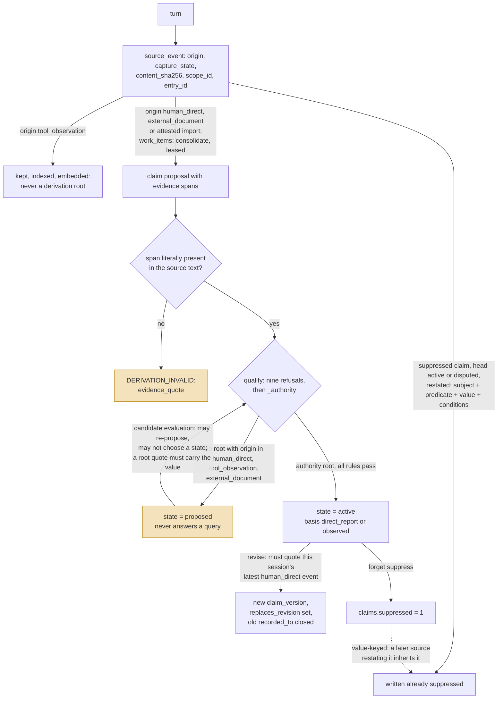

## 1. Executive Summary

Scope Recall is a local memory core with host adapters for Hermes, Codex and Claude Code, shipped as `hermes-scope-recall` and imported as `scope_recall`. **A claim has to quote its source, word for word, and the quote is checked at the storage boundary**; a claim becomes a belief only when a quoted source carries an origin that nothing on the agent's tool surface can stamp. The weak side is the project's own admission: no test measures recall quality, and the gate written for it was removed unpassed.

SQLite is the only authority. The vector index holds metadata and a vector against an empty payload and can be deleted and rebuilt without losing a memory. `claim_storage.py:339-340` refuses a derivation whose `span["quote"]` is not literally present in the stored source text, so recall can show why it believes something and a wrong memory traces to the sentence that caused it.

`qualify` (`claims.py:514-539`) decides whether a proposal is believed. A proposal stays `proposed` unless a cited root survives nine refusal rules, and one of them requires a root whose origin is `human_direct`, `tool_observation` or `external_document`. The agent's write tool stamps `assistant_visible`, which lends none of them. Five kinds — preference, constraint, decision, intention, alias — require a human root specifically. The docstring states the purpose: it *"neither invents dates nor converts the model's requested state into governance authority."*

Both automatic writers are stricter than `qualify`. Consolidation shows the model only what a person said, a document stated or an attested import, and the candidate evaluator writes a version only when a root quote carries the value (`evidence_question.py:50`, `:169-192`). Tool output is kept, embedded and searchable, and roots no claim.

Marks: all seven. The `tombstone` is keyed on subject, predicate, value and conditions rather than on a row id, and runs inside every source write.

The README states the caveat before installation: `scripts/check.py --tier release` runs about 2,300 tests, *"none of them measures recall quality"*, and every accuracy figure in the notes was measured by the authors, by hand, on their own corpora. The P18 model-evaluation gate meant to close that needed an evaluation corpus and an independent scorer. [`69064095fa0b9a73ba1d6ec48fc75abfbe97eb23`](https://github.com/410979729/scope-recall-hermes/commit/69064095fa0b9a73ba1d6ec48fc75abfbe97eb23) removed it on 27 September 2026 rather than keep a gate no release could pass.

## 2. Mental Model

A turn is a `source_event`, and a source event is not a memory. It carries an `origin` from a closed set — `human_direct`, `assistant_visible`, `tool_observation`, `external_document`, `host_generated`, `memory_reinjection`, `imported`, `origin_unknown` — a `capture_state` of `complete`, `partial` or `gap`, and two content hashes. Memory is what a background pass extracts from it: a `claim`, held as a chain of `claim_versions`, each quoting the exact span of the exact source revision that supports it.

Only three origins can root a derivation: `human_direct`, `external_document` and an attested `imported` source (`evidence_question.py:50`). A tool's output is stored, indexed and embedded, and no automatic writer derives a claim from it. The comment above the constant gives the measurement behind the rule: on one pilot, 93% of 3,175 claims rested on tool output alone, and not one of the owner's 30 real questions was answered by one.

A claim version's `state` is the whole trust model. `proposed` means the evidence did not clear the ladder; such a version is never the answer to a query and exists so retrieval can show it labelled. `active` is a belief. `disputed`, `superseded` and `retracted` are the three ways one stops being current, and none of them deletes anything — a change appends a version and closes the previous one's record interval.


```mermaid
%% caption: a proposal becomes active only if a cited root carries an authority origin, and nothing on the agent's tool surface stamps one; tool output roots nothing — a suppressed claim then rejects a later restatement by its value rather than by its id
flowchart TD
  T["turn"] --> E["source_event: origin, capture_state,<br/>content_sha256, scope_id, entry_id"]
  E -->|"origin tool_observation"| EMB["kept, indexed, embedded:<br/>never a derivation root"]
  E -->|"suppressed claim, head active or disputed,<br/>restated: subject + predicate + value + conditions"| SUP["written already suppressed"]
  E -->|"origin human_direct, external_document<br/>or attested import;<br/>work_items: consolidate, leased"| PROP["claim proposal with evidence spans"]
  PROP --> Q{"span literally present<br/>in the source text?"}
  Q -->|"no"| REJ["DERIVATION_INVALID:<br/>evidence_quote"]
  Q -->|"yes"| L{"qualify: nine refusals,<br/>then _authority"}
  L -->|"no root with origin in<br/>human_direct, tool_observation,<br/>external_document"| PR["state = proposed<br/>never answers a query"]
  L -->|"authority root, all rules pass"| AC["state = active<br/>basis direct_report or observed"]
  PR -->|"candidate evaluation: may re-propose,<br/>may not choose a state;<br/>a root quote must carry the value"| L
  AC -->|"revise: must quote this session's<br/>latest human_direct event"| NV["new claim_version,<br/>replaces_revision set,<br/>old recorded_to closed"]
  AC -->|"forget suppress"| SC["claims.suppressed = 1"]
  SC -.->|"value-keyed: a later source<br/>restating it inherits it"| SUP

  style PR fill:#f4e2bd,stroke:#b8860b
  style REJ fill:#f4e2bd,stroke:#b8860b
```

The dashed edge is the tombstone. A deletion keyed on the record lets re-extraction from a later conversation produce a new record that walks straight past it. Here the suppressed claim itself is the ledger: `_inherits_suppression` asks whether an incoming source event's text contains that claim's subject, its predicate, its `value_text` and every one of its conditions, and if it does the new event is written suppressed. The rule covers claims whose head version is `active` or `disputed`; a suppressed `proposed` claim does not propagate (`storage.py:395-403`).

## 3. Architecture

A Python package with a core that knows nothing about any host, and adapters that do. `core/` holds the schema, the claim rules, the storage transactions, recall, consolidation and deletion — 77 modules. `adapters/hermes/` binds a Hermes memory provider; `adapters/codex/` is one adapter of hooks and an MCP server for both Codex and Claude Code. `runtime/` owns the background worker: launch, watchdog, leases, budgets and embedding retry. `vector/` is the companion — LanceDB natively, a SQLite table as fallback, and a subprocess store when the native library has to be isolated. `contracts/` holds JSON Schemas for every request and view shape: `recall_packet.schema.json`, `forget_request.schema.json` and the rest are the boundary, checked rather than described.

A store is local to one agent home or **shared**. A shared store is one SQLite file that several entries write, each named in an `entries` table. Every source carries the `entry_id` it came in through, and `put_source` refuses one that names no entry or an unregistered one (`storage.py:408-420`). Each entry keeps its own installation's grants, and what one entry is told another recalls where their scope strings are equal.

A Codex or Claude Code client on another machine is an entry over HTTP (`adapters/codex/remote_server.py`). Its hooks forward payloads with the entry's token, and the server binds the entry, its grants and its capture scope from the token rather than from anything the client sends.

Background work is durable rather than threaded-and-hoped. `work_items` carries a `work_type` of `consolidate`, `embed`, `rebuild_projection`, `purge` or `evaluate_candidate`, a `state` of `pending`, `leased`, `done`, `failed` or `obsolete`, an `attempt` count, an `available_at`, a lease token, owner and expiry, and a `UNIQUE(work_type, subject_ref, subject_revision)` so the same subject cannot be queued twice. A crashed pass loses its lease and the item returns to `pending`.

### Deployment and ergonomics

`pip install hermes-scope-recall`, then the adapter's installer; `hermes-scope-recall` and `scope-recall` are both console entry points into `maintenance/cli.py`. The four required dependencies are PyYAML, jsonschema, packaging and tzdata-on-Windows, so the base install is light and the vector arm is an extra. The store is one SQLite file in WAL mode, readable by hand. `init-shared`, `attach`, `detach`, `adopt` and `import-entry` build and populate a shared store; Claude Code installs only as an entry of one.

## 4. Essential Implementation Paths

- **Capture.** A host adapter writes a `source_event` through `storage.py:put_source` (`:405`). After the insert, `_inherits_suppression` (`:395-403`, called at `:450`) asks whether the content restates a suppressed claim in this scope; before it, `_check_source_group` refuses a revision whose hash disagrees with one already stored at that revision. `capture.py:71` then calls `link_source`, which suppresses a non-authority source that cites a suppressed parent (`claim_storage.py:263-286`).
- **Consolidation.** A `consolidate` work item leases the event and asks the configured model for a `consolidation_result` over roots filtered to `DERIVATION_ROOT_ORIGINS` (`worker_consolidation.py:121-135`). `worker_consolidation.py:187` and `consolidate.py:225` both check `quote not in content` before a proposal is allowed out of the pass, so the model's citation is checked twice before storage checks it a third time.
- **Storage of a claim.** `claim_storage.py:318-343` inserts the new `claim_versions` row, closes the previous revision's `recorded_to`, and links one `evidence_links` row per span — after `if span["quote"] not in source.event["content"]: raise ContractError("DERIVATION_INVALID", "evidence_quote")` and after `require_live_source`. A suppressed source marks the claim suppressed in the same transaction (`:342-343`).
- **Qualification.** `claims.py:_cite` (`:336-360`) keeps only roots that are both cited and `capture_state == "complete"` with no capture gaps — *"a summary may link to a root for lineage, but cannot lend its own wording that root's authority"* — and narrows each root's text to the neighbourhood of its quote. `qualify` (`:514-539`) then runs nine refusals; any one of them returns `Qualification("proposed", "inferred_suggestion", reason)`.
- **Recall.** `recall.py` runs exact-reference, lexical, claim, recent and vector channels, fuses them by reciprocal rank, and hydrates each survivor through `retrieval_storage.py:hydrate` (`:643`). Hydration re-reads the object from the scoped transaction, applies the time window, and marks a superseded source `historical` rather than dropping it. The vector call gets three quarters of the remaining deadline, so hydration and the packet's authority checks keep the rest (`recall.py:145-149`).
- **Answering a claim.** `select_effective` (`claims.py:577-599`) applies `known_at` first, dropping versions recorded after the cutoff, then picks the version whose validity interval covers the instant, and returns `None` for `retracted`.
- **Revision.** `mutate.py:revise` requires `expected_revision` and calls `claim_storage.py:current_human` (`:389-403`). It finds the session's most recent `human_direct` source event in scope and raises `ACCESS_DENIED` unless the caller's `source_evidence_refs` name that exact `event@revision`, then checks the source is complete and ungapped and, where the host passes recent messages, inside the latest one.
- **Deletion.** One `deletion_operations` row keyed on `request_sha256` carries mode, scopes, requested refs, expected revisions, memory epoch and the layers it covered (`delete_storage.py:203-206`). The purge rewrites removed sources to a content-free marker and blanks `claim_versions.payload_json` (`:303-309`). `restored_absence_blocks`, written on restore and read by `visibility.allowed`, fences the derived layer so a rebuild cannot resurrect what was removed.

## 5. Memory Data Model

| Table | Holds |
| --- | --- |
| `source_events` | the captured turn: `origin`, `role`, content and two hashes, `scope_id`, `session_id`, `project_id`, `branch_id`, `entry_id`, `occurred_at`/`recorded_at`/`persisted_at`, `time_precision`, `capture_state`, capture gaps, `read_blocked`, `suppressed` |
| `claims`, `claim_versions` | the claim and its append-only revision chain: `state`, `basis`, `qualification_reason`, `valid_from`/`valid_to`, `recorded_from`/`recorded_to`, `replaces_revision`, conflicts |
| `evidence_links` | per object version, the source ref and revision, the relation (`supports`, `derived_from`, `contradicts`), the quote and its location |
| `work_items`, `work_error_details` | the leased background queue and the field that caused each failure |
| `candidate_lifecycle`, `candidate_evidence`, `candidate_evaluations`, `candidate_trigger_terms`, `candidate_source_triggers`, `candidate_scan_cursors` | processing state beside a claim version — never the fact state |
| `deletion_operations`, `deletion_members`, `object_blocks`, `source_group_blocks`, `restored_absence_blocks` | the deletion ledger and the fences that keep a rebuild from undoing it |
| `episodes`, `episode_versions`, `episode_events`, `artifacts`, `artifact_versions`, `reference_bindings`, `reference_versions`, `object_dependencies` | the other versioned object kinds, built on the same pattern |
| `entries` | a shared store's entries: id, display name, host, first and last seen |
| `lexical_terms`, `lexical_postings`, `expired_vectors`, `instance_scopes`, `instance_meta`, `consolidation_fragments`, `consolidation_outcomes`, `capture_inbox`, `unresolved_updates`, `authorization_payloads`, `source_authorizations` | the rebuildable term index, the vector retention ledger, the scope registry, consolidation bookkeeping and the migrated 2.x authorizations |

Every table is `STRICT`, and the constraints do real work: five states on a claim version, five bases, eight origins, three capture states, three evidence relations, and two interval checks per version.

`candidate_lifecycle` and `claim_versions.state` are separate columns with separate writers. The first is *processing* — `pending_evaluation`, `waiting_evidence`, `resolved`, `archived`, `blocked` — and its module says what it is not: *"Candidate processing is metadata beside a claim version. It never replaces the fact state and it never grants source, identity or write authority."* The second is the epistemic state, and only `qualify` writes it.

## 6. Retrieval Mechanics

Five channels, fused by reciprocal rank: exact reference, lexical index, claim, recent-raw and vector, with a relation and a background channel beside them. The lexical index is a term dictionary with integer postings. Each channel is budgeted separately (`retrieval.py:67` sets `vector_limit: 48`), and a channel that cannot run contributes a named gap rather than silence — `vector_unavailable`, `deadline_exceeded_vector`, `vector_rejected:<reason>`.

The scope predicate is built the same way everywhere: `sorted(context.allowed_scope_ids)` becomes a placeholder list and the query carries `scope_id IN (…)`. `_scope()` (`storage.py:184-186`) raises rather than widen when a caller names a scope outside the set.

The vector arm is treated as a claim to verify, not a result to trust. `_partition_hits` (`adapters/lance.py:583-614`) sends the store every trusted partition literal in one request, filtered before ranking, and falls back to one partition at a time for a store without `search_scopes`. A candidate that survives `vector_admission` still has to pass `hydrate`, which re-reads the object from the scoped transaction. A companion row pointing at another scope, another branch, a deleted object or a retired embedding space hydrates to `None`. The negative test asserts exactly that, with five candidates failing five different ways and a 0.999 score among them.

The packet then states an `answerability` of `supported`, `partial`, `ambiguous` or `unknown` (`recall_packet.py:296-303`), so a recall can say the corpus cannot answer the question instead of returning the nearest text.

## 7. Write Mechanics

**Capture is cheap and synchronous; meaning is neither.** The adapter writes a source event and returns. A `consolidate` work item then leases the event, asks the model for claim proposals, and every proposal must quote its source. Three separate places check the citation is real — twice in the consolidation pass and once at the storage boundary, which is the one that raises.

**Tool output is a source, not a root.** Admission queues a tool output for embedding only, so it is found by its words and by meaning and never consolidated. The changelog records the cost, measured on a copy of the pilot store: a question worded exactly like a tool-derived claim found its answer 38 times in 40 with those claims and 12 times without.

**Promotion is not a write verb.** There is no promote, approve or apply on any adapter's tool surface. A proposal becomes `active` because `qualify` found an authority-bearing root among the sources it cites, and stays `proposed` otherwise. The candidate evaluator can re-propose the same claim against fresh sources, and its system prompt ends *"Do not choose a fact state: Core qualification owns that decision."* The code enforces that by not reading a state from the model's reply, and `rooted_verdict` refuses a verdict whose value appears only outside a root quote.

**Correction appends.** `revise` takes a `target_ref`, an `expected_revision`, a new value, conditions, source evidence refs and a `valid_from`, and writes a new `claim_versions` row with `replaces_revision` set while closing the old row's `recorded_to`. The previous payload stays readable.

**Forgetting has two modes and one record.** `suppress` sets `suppressed=1` and blocks automatic reads while leaving an explicit read working; `delete` rewrites the source content to a marker and blanks the version payloads. Either way one `deletion_operations` row, keyed on the request hash, makes the operation idempotent — `test_delete_idempotence_is_zero_mutation_even_after_authorization_source_removed` asserts the database file is byte-identical after a repeat. In a shared store a deletion through one entry is gone for every entry.

## 8. Agent Integration

Two adapters, both read-mostly. Hermes publishes `recall`, `inspect`, `profile`, `entity`, `revise`, `forget`, `status` and `trace` (`adapters/hermes/tool_surface.py`), and refuses a mutation unless the session is on the CLI platform with a `human_direct` actor (`:226-240`). The MCP server publishes those plus `propose_memory` for Codex and Claude Code alike, and marks each with MCP annotations — read-only for the six read tools, `destructive_hint=True` for `revise` and `forget`.

`propose_memory` is described as recording *"an assistant-visible candidate without promoting it to authority"*, and the handler stamps `origin="assistant_visible"` itself rather than accepting an origin argument (`mcp_server.py:373`). The agent's own writes cannot lend authority to anything.

`_request_context` binds the call to the client's reserved MCP thread metadata and says why: *"The model cannot provide this value as a tool argument. A missing or malformed host binding remains usable for reads with an explicit gap, while mutations fail closed…"* Only Codex sends that metadata (`_THREAD_META = {"codex": "threadId"}`), so a Claude Code client's `revise` and `forget` are refused.

`revise` over the stdio server passes `origin="human_direct"` with a comment admitting the label is a formality — *"The stdio server has no attested Codex user turn. Core still requires its own human evidence and expected revision before changing state."* That comment is checkable and it is true: `current_human` reads `source_events`, not the context label, so the label buys nothing.

Claude Code's turns reach the store two ways: its hooks, and at `Stop` a read of its own session record (`adapters/codex/transcript.py`). The reader keeps only entries the record marks `origin.kind == "human"` and the model's visible text, and skips tool results, compaction summaries, task notifications and meta entries.

## 9. Reliability, Safety, and Trust

**Authority is a property of the source, not of the caller.** A claim's state is recomputed from what it cites, and there is no promote transition to guard.

**The state gate is enforced where the answer is chosen.** `select_effective` never returns a `proposed` version and never returns a `retracted` one. `select_proposal` returns the head only so a caller can display it labelled, and refuses for `as_of` queries on the stated ground that an unpromoted proposal cannot answer about the past.

**Suppression is by value.** The tombstone check runs inside `put_source`, so it applies to material arriving from any host, in any session, in the same scope. A re-derivation that cites the suppressed source is covered separately, by `link_source`.

**Deletion is fenced against its own rebuild.** `restored_absence_blocks` exists because the vector index is rebuildable, and a rebuild from a stale snapshot would otherwise resurrect what a deletion removed.

**Four limits.** A claim version has no actor column, so *who changed this* is answered by following the cited source event to its origin, session and entry. The hosts run in the user's own process, so a general shell there is outside what these marks measure. The stdio `revise` context label is decorative — harmless because the check ignores it. And a remote entry's record lines are read on the client machine and arrive as `human_direct` on the store's side (`remote_server.py:209`, `handler.py:559`), so on that path authority rests on the entry's token and the client's own reader.

## 10. Tests, Evals, and Benchmarks

1,817 test functions across `tests/contract`, `tests/unit`, `tests/integration`, `tests/host`, `tests/migration`, `tests/packaging` and `tests/storage_native`. I ran none of it: `pyproject.toml` and `uv.lock` changed inside the seven-day cooldown, so nothing was installed.

The negative case is `test_P08_high_score_candidates_still_no_match_after_authority_hydration` (`tests/contract/test_v11_recall_admission.py:190-220`): five vector candidates, five distinct exclusion reasons, one of them scored 0.999, asserting `result.items == ()` and an `unknown` answerability. Its positive controls sit on either side of it in the same file.

`tests/contract/test_tool_output_is_not_derived.py` pins the derivation-root rule in both writers, and `tests/contract/test_evidence_question.py` pins `rooted_verdict`. The value-keyed suppression rule has no isolating test. `test_v11_deletion.py:83` restates a suppressed claim in a source that also cites the suppressed source, and `link_source` would suppress that source without `_inherits_suppression`.

`tests/contract/test_recall_probe_set.py` checks what a gate can check about a probe set it cannot run. Its docstring says scoring recall *"against a real corpus, which no gate has"* is out of reach, so it checks that every question is asked once, no question is in both sets, and no predicate is loose enough to match an audit dump. The comment beside the specificity assertion names the failure it prevents: *"A bare common word would match an audit dump quoting other events, which is the false positive that once made a worse ranking look better."*

Recall quality has no automated check, and the README leads with that. The P18 gate wanted 120 independent core items, 240 paired variants, a method adjudication accepted by an independent party and an independent semantic scorer. The corpus and the party never existed, and every release from 3.1.0 to 3.3.0 shipped with the gate reported missing. The removal commit states the result: a release run whose tests pass exits 0. The README reports integration at about 2,120 tests and packaging at about 150, both exiting 0; I did not reproduce either figure. The README names the missing recall regression suite as the first item under *What is not finished*.

No paper.

## 11. For Your Own Build

### Steal

- **Check the quote at the storage boundary.** Asking a model to cite its source is a prompt; refusing the write when `span["quote"] not in source.event["content"]` is a constraint. The same check appears three times here, and only the innermost one matters.
- **Derive authority from the cited source's origin.** A closed origin vocabulary on the source event, an authority subset, and a rule that reads the subset — so the question "may this be believed" is answered by what it quotes rather than by who called the tool. Nothing on the tool surface then needs to be locked down, because nothing on it grants anything.
- **Keep tool output out of the derivation roots.** Store and embed it for search, and let no automatic writer derive a claim from it; the comment on `DERIVATION_ROOT_ORIGINS` shows what the store held before.
- **Split processing state from epistemic state.** `candidate_lifecycle.processing_state` and `claim_versions.state` are different columns with different writers, and the module that owns the first says in its docstring that it never touches the second. A model may move the first.
- **Require the change to quote the human turn that asked for it.** `current_human` does not check a role or a flag; it finds the latest `human_direct` event in the session and requires the caller to have named it. A caller that was not in the conversation cannot guess it.

### Avoid

- **A context label that looks like an authority.** `origin="human_direct"` on the stdio `revise` path is inert, and the comment says so, but it is the kind of string a later reader trusts by sight. Let the check be the only place the word appears.
- **A value-keyed rule tested only through a case another rule also catches.** `_inherits_suppression` is the strongest thing in the deletion path, and its one test would pass without it. An uncited restatement is the case the mechanism exists for.

### Fit

For a local memory shared by Hermes, Codex and Claude Code, where tracing a belief to a sentence matters more than recalling everything, this is a carefully built option. It is also a 55,000-line core on a release-candidate line whose recall quality nothing automated measures; adopt it as a product with a version you pin, not as a library to lift pieces from. If you want a store that simply accumulates what the model thinks, this will frustrate you by design: the model's own writes stay `proposed` until a person's words support them.

## 12. Open Questions

- Whether an uncited restatement of a suppressed claim is caught in practice. The SQL uses `instr` against the whole event content, so it matches a paraphrase only when subject, predicate, value and conditions all survive verbatim; the failure direction is a missed suppression rather than a false one.
- What fraction of consolidated proposals end `proposed` in a real conversation, and whether that queue is read. Nothing automatic promotes them, which is the design, and nothing measures how large it grows.
- Whether a recall regression suite returns, and against what corpus. The README lists it first under *What is not finished*, and no release gate asks for one.

## Appendix: File Index

- Claim rules and states: `core/claims.py`, `core/claim_storage.py`, `core/claim_normalization.py`, `core/evidence_question.py`, `core/schema.py`.
- Capture and consolidation: `core/storage.py`, `core/capture.py`, `core/capture_inbox.py`, `core/admission.py`, `core/consolidate.py`, `core/worker_consolidation.py`, `core/lineage.py`.
- Candidates: `core/candidate_lifecycle.py`, `core/candidate_evaluations.py`, `core/candidate_tables.py`, `core/candidate_intake.py`, `core/worker_candidates.py`.
- Retrieval: `core/recall.py`, `core/recall_packet.py`, `core/retrieval.py`, `core/retrieval_storage.py`, `core/recall_policy.py`, `adapters/lance.py`, `vector/sqlite_store.py`.
- Mutation and deletion: `core/mutate.py`, `core/deletion.py`, `core/delete_storage.py`, `core/restore.py`, `core/visibility.py`.
- Hosts: `adapters/hermes/tool_surface.py`, `adapters/hermes/identity.py`, `adapters/codex/mcp_server.py`, `adapters/codex/boundary.py`, `adapters/codex/handler.py`, `adapters/codex/transcript.py`, `adapters/codex/remote_server.py`.
- Background: `runtime/worker_entry.py`, `runtime/scheduling.py`, `core/work_storage.py`.
- Contracts and tests: `contracts/`, `tests/contract/`, `scripts/check.py`.

**Searches recorded for the negative claims**

```sh
git grep -n -E 'promote|approve' -- adapters/hermes/tool_surface.py adapters/codex/mcp_server.py   # 0: no promotion verb on either tool surface
git grep -n -E '"name"' -- adapters/hermes/tool_surface.py                                        # recall, inspect, profile, entity, revise, forget, status (+ trace)
git grep -n -E 'CREATE TABLE' -- core/schema.py | grep -i audit                                    # 0: governance_audit_events is gone with 2.x
git grep -n -E '(UPDATE|DELETE FROM) claim_versions' -- core/                                      # recorded_to closures (claim_storage.py, restore.py) and the purge's payload blanking
git grep -n -E 'fact_state' -- . ':!tests'                                                         # candidate_tables.py and candidate_lifecycle.py only; never written from a model reply
git grep -n -E '_inherits_suppression' -- core/                                                    # defined storage.py:395, one caller at :450, inside put_source
git grep -n -E 'inherit' -- tests/ | grep -i suppress                                              # test_v11_deletion.py:83 only, a restatement that also cites the suppressed source
git grep -n -E 'DERIVATION_ROOT_ORIGINS = ' -- core/                                               # evidence_question.py:50, no tool_observation
git grep -n -E 'P18_INDEPENDENT_CORE|--model-receipt' -- scripts/check.py README.md                # 0: the model gate is removed
git ls-tree -r --name-only HEAD tests/eval                                                         # empty: no evaluation fixture in the tree
```

## History

**2026-09-28** — [`365e578406536e7439b9b08157bae44f24d627c3`](https://github.com/410979729/scope-recall-hermes/commit/365e578406536e7439b9b08157bae44f24d627c3) — re-pinned. `main` was rewritten on 2026-09-27 to drop co-author trailers, so the previous pin sits on no upstream branch, only in the archive fork. Its tree equals [`aead957a2ff9c6b87ef7c35c4746deb2e2b41e96`](https://github.com/410979729/scope-recall-hermes/commit/aead957a2ff9c6b87ef7c35c4746deb2e2b41e96) on `main`, and every tree on the orphaned line recurs there, so no content was lost. 194 commits later all seven marks hold. Moved: the P18 release gate was removed rather than passed ([§10](#10-tests-evals-and-benchmarks)); tool output roots no claim ([§7](#7-write-mechanics)); a shared store serves Hermes, Codex and Claude Code entries ([§3](#3-architecture)). Corrected: `tests/eval/public_fixture.jsonl`, cited from the README, was absent from the previous pin's tree, and the suppression test also passes through `link_source`. Screened: two FRESH, three EXEC, one AGENT; nothing installed, built or run.

**2026-09-19** — [`abe54277867ca516b09b230093b9e2e6a9dbaaa6`](https://github.com/410979729/scope-recall-hermes/commit/abe54277867ca516b09b230093b9e2e6a9dbaaa6) — full re-read, and the report above is new rather than revised. The entry below explains why it was owed: the tree was rebuilt, not patched, and every file the six evidence records anchored into is gone. All six marks are re-earned on new code, and a seventh is **awarded**. `tombstone` had been withheld because 2.x keyed its purge tombstones on a hash of scope and row id; 3.1 has `_inherits_suppression` (`core/storage.py:371-379`), which runs inside every `put_source` and asks whether the incoming text restates a suppressed claim's subject, predicate, value and every condition — the value, not the record. `human_review` is the other change of footing: there is no promotion verb on either adapter's tool surface, because promotion is not a verb. `qualify` recomputes a claim's state from what it cites, and refuses `active` unless a cited root carries an origin in `('human_direct','tool_observation','external_document')` — which the agent's own `propose_memory` cannot produce, since the handler stamps `assistant_visible` itself. `revise` and `forget` additionally have to name the session's most recent human turn by `event@revision`. Recorded as a limit: the Codex stdio server labels its revise context `human_direct`, and the label is inert because the check reads source events instead. Screened again first; a dependency surface was inside the cooldown, so nothing was installed and no suite was run.

**2026-09-18** — checked against `abe54277867ca516b09b230093b9e2e6a9dbaaa6` and **deliberately not re-pinned**. The tree has been rewritten rather than revised: 1,130 files changed, +95,899 and −294,328 lines, the flat modules replaced by packages, and every file this report's six evidence records anchor into — `candidate_review.py`, `tooling.py`, `memory_quality.py`, `memory_browser.py` — is gone. Moving the pin without re-reading would leave six records pointing at nothing, so the report stays at `578b955`, which it still describes accurately, and a full re-read is owed.

One change is worth recording now because it answers this report's own stated weakness. The `human_review` record noted that the promotion transition was *"exposed to the model as `scope_recall_memory` with `dry_run=false`"*, and at the old pin `tooling.py:141-170` did exactly that — `dry_run` defaulted to `True` and passing `false` applied the change. At HEAD the agent-facing surface is `adapters/hermes/tool_surface.py`, and it publishes seven tools: `recall`, `inspect`, `profile`, `entity`, `revise`, `forget`, `status`. There is no promotion verb, no candidate verb and no `scope_recall_memory`. The candidate lifecycle itself survives and has grown — `candidate_lifecycle`, `candidate_evidence`, `candidate_evaluations` and `work_items`, with `JUDGEABLE_STATES` of `proposed` and `disputed` — but whether a person or an evaluation moves a candidate out of those states is the question the re-read has to answer, and it is not one to settle from a file listing.

**2026-09-11** — [`578b955802df753f2e2208e26eab6f71971285a0`](https://github.com/410979729/scope-recall-hermes/commit/578b955802df753f2e2208e26eab6f71971285a0) — first reading. Screened with `scripts/screen_repo.py`: no auto-running configuration, one `conftest.py`, and `pyproject.toml` inside the seven-day cooldown with no lockfile beside it. Read only; nothing was installed, built or run.
