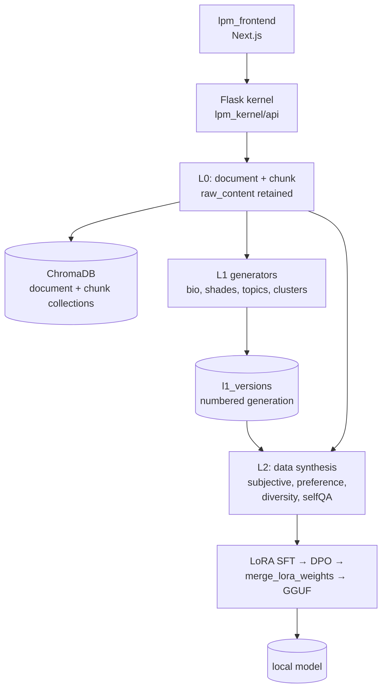

## 1. Executive Summary

Second Me trains a small language model on your own documents so that the model
*is* the memory. Uploads land in SQLite as L0 with their raw content retained; an
L1 pass derives a biography, "shades" and topic clusters as a **numbered
version**; L2 synthesizes training data from both and runs LoRA supervised
fine-tuning followed by DPO, merges the adapter, and converts the result to GGUF
for local inference. It is a 2025 research prototype from Mindverse with a paper
behind it, and its last commit at the analyzed revision is September 2025.

**It is the only system in this atlas with parametric memory**, and that is why
it earns an entry despite its age. Every other report here describes memory as
rows, files or graph edges that a query returns. Second Me's L2 layer holds memory
in weights: nothing is retrieved, the model simply answers as though it knows.
That makes it the atlas's one data point on a whole branch of the field — and one
system is not coverage, which the limitations say plainly.

**The finding that matters most is what deletion does.** `delete_file_by_name` is
a genuinely careful cascade — it removes the `memories` row, the document
embedding from ChromaDB, every chunk embedding, every chunk row, the document row,
and the physical file. That is more thorough than most deletions in this atlas,
which routinely forget the vector store. And it touches **nothing** in L1 or L2.
The biography that summarized the deleted document remains at its version; the
model fine-tuned on data synthesized from it keeps whatever it learned. So a user
who deletes a memory here has cleaned the retrieval path and left the belief
intact.

It is the one system in this atlas where machine unlearning is not a different
field's problem — see the [benchmarks page](../../benchmarks/) on why that
literature is usually irrelevant here, and why it is not for this.

## 2. Mental Model

Three layers, and the atlas's usual vocabulary only reaches the first two.

```text
L0   document(raw_content, insight, summary, keywords) + chunk
       │  retained; the source of everything below
       ▼
L1   l1_versions(version, status, description)
       ├─ l1_bios          content + summary, first and third person
       ├─ l1_shades        named aspects of the person
       ├─ l1_clusters      memory_ids + cluster_center
       └─ l1_chunk_topics  topic + tags
       │  a numbered generation, regenerable from L0
       ▼
L2   LoRA SFT → DPO → merged weights → GGUF
       │  memory as parameters; nothing is retrieved
```

**L1 being versioned is the best idea in the system.** Every derived table carries
a `version` foreign key into `l1_versions`, so the whole biography is a numbered
generation over retained source rather than a mutable summary. Regenerating after
adding documents produces version *n+1* and leaves version *n* intact and
comparable. The atlas praises [Basic Memory](./basic-memory/) and
[Cognee](./cognee/) for treating derived state as a rebuildable projection; this
goes one step further by giving each rebuild an identity.

The state machine is entirely about *processing*, not about belief:

```text
document.extract_status    INITIALIZED | SUCCESS | FAILED
document.embedding_status  INITIALIZED | SUCCESS | FAILED
document.analyze_status    INITIALIZED | SUCCESS | FAILED
memories.status            active | deleted
l1_versions.status         (pipeline state)
```

Four CHECK-constrained status columns and none of them says whether a memory is
true, disputed or superseded. This is the same observation as
[Acontext](./acontext/)'s: a codebase can be full of statuses and have no trust
model, because pipeline state and epistemic state are different things that look
alike in a schema.

Note also that `memories.status` allows `'deleted'` — a soft-delete state exists in
the schema — while `delete_file_by_name` calls `session.delete(memory)` and removes
the row outright. The state is declared and unused.

## 3. Architecture



- **Kernel** is Flask (`lpm_kernel/app.py`, `lpm_kernel/api/domains/`), with SQLite
  behind `lpm_kernel/database/` and versioned Python migrations under
  `database/migrations/`.
- **Retrieval** is ChromaDB with two collections — documents and chunks —
  managed by `file_data/embedding_service.py` and `chroma_utils.py`.
- **Training** is `lpm_kernel/L2/`: `data.py` and `data_pipeline/` for dataset
  construction, `dpo/` for the preference stage, `merge_lora_weights.py` using
  `peft`, `convert_hf_to_gguf.py` and a vendored `gguf-py`, plus an MLX path for
  Apple silicon.
- **Network** — `spaces` and `space_messages` tables plus `space_routes.py`
  support the project's "AI Space", where multiple trained selves interact.

### Deployment and ergonomics

The heaviest ask in the atlas, and unavoidably so: you are training a model. The
README's own table maps host memory to feasible parameter counts — 8 GB gets you
under a billion parameters, 16 GB gets 1.5B on Docker — and the repository vendors
`llama.cpp` and two GraphRAG tarballs under `dependencies/`.

The compensation is the project's whole point: it runs locally and the output is a
GGUF file you own. No API key is required for inference once trained, and the
privacy posture — "your data, your control" — is the reason the design is shaped
this way rather than as a hosted service.

Repairability is asymmetric and worth stating plainly. L0 is SQLite and a
directory of files, so it is as inspectable as anything here. L1 is SQL and
regenerable. L2 is a binary; if it learned something wrong, there is no edit —
only retraining.

## 4. Essential Implementation Paths

**Upload and L0** — `lpm_kernel/api/domains/memories/routes.py`,
`lpm_kernel/file_data/document_service.py`, `document_repository.py`,
`chunker.py`, `embedding_service.py`. The `document` table keeps `raw_content`
alongside derived `insight`, `summary` and `keywords`, with three CHECK-constrained
status columns tracking the pipeline.

**L1 generation** — `lpm_kernel/L1/l1_generator.py`, with `bio.py`,
`shade_generator.py`, `topics_generator.py` and `status_bio_generator.py`. Output
is written against a row in `l1_versions`, and `l1_bios` carries both
`content`/`summary` and `content_third_view`/`summary_third_view` — the same
biography in first and third person, which is an unusual and deliberate touch for
a system whose product is a persona.

**L2 data synthesis** — `lpm_kernel/L2/l2_generator.py`: `data_preprocess`,
`gen_subjective_data`, `gen_preference_data`, `gen_diversity_data`,
`gen_selfqa_data`, then `merge_json_files`. Four distinct synthesis strategies is
more care than "fine-tune on the transcripts", and `gen_preference_data` is what
feeds DPO.

**Training and packaging** — `lpm_kernel/L2/dpo/dpo_train.py` and
`dpo_pipeline.sh`, `merge_lora_weights.py` (`peft.PeftModel` merged into an
`AutoModelForCausalLM`), `convert_hf_to_gguf.py`, `convert_model_to_gguf.sh`,
`mlx_training/` for Apple silicon.

**Deletion** — `lpm_kernel/file_data/document_service.py:520`,
`delete_file_by_name(filename)`. Seven numbered steps in the source: find the
`memories` row, take `document_id` and `path`, delete the row, delete the document
embedding from `document_collection`, delete every chunk embedding from
`chunk_collection`, delete the chunk rows, delete the document row, remove the
file. No step touches L1 or L2.

**Review surface** —
`lpm_frontend/src/app/dashboard/train/memories/page.tsx`, which lists uploaded
memories and calls `deleteMemory`, described in its own copy as "View and manage
all your uploaded training materials. Organize and review your memories **before
starting the training process**."

## 5. Memory Data Model

L0 keeps the source. `document.raw_content` is retained beside the derived
`insight`, `summary` and `keywords`, and `chunk` rows hang off it. That is
[evidence before belief](../../patterns/evidence-before-belief/) at the base of the
stack, and it is what makes L1 regenerable.

L1 is the versioned layer, and the shape is worth copying:

```sql
l1_versions(version PK, create_time, status, description)
l1_bios(version FK, content, content_third_view, summary, summary_third_view)
l1_shades(version FK, name, aspect, desc_second_view, content_second_view, ...)
l1_clusters(version FK, cluster_id, memory_ids, cluster_center)
l1_chunk_topics(version FK, chunk_id, topic, tags)
```

Because everything derived is keyed to a version, a regeneration is additive: the
previous biography stays, and two versions can be diffed. This is closer to
[bi-temporal fact validity](../../patterns/bi-temporal-fact-validity/)'s spirit
than most of the systems that only stamp `updated_at` — though the flag is
withheld, because a version is a record-time generation and there is no
application-time validity on any individual claim.

`l1_clusters.memory_ids` is the one provenance link from the derived layer back to
the source, and it is a JSON list rather than a join table, so it cannot be
queried backwards: given a document, there is no index answering "which biography
versions used this".

L2 has no data model at all in the relational sense. That is the honest
description: the memory is a `.gguf` file.

There is no scope key anywhere, and that is by design — the product is one
person's AI self on one machine. `scope_enforced` is withheld on that basis rather
than as a criticism.

## 6. Retrieval Mechanics

Two mechanisms that do not know about each other.

The retrievable one is ordinary: ChromaDB with separate document and chunk
collections, queried through `embedding_service.py`. Nothing unusual, and no
hybrid or lexical arm.

The parametric one is not retrieval at all. After training, the model answers from
its weights. There is no top-*k*, no threshold, no citation, and no way to ask what
the model is drawing on — which is the property that makes parametric memory
attractive (fluent, personal, no injection latency) and the property that makes it
unauditable.

The failure mode specific to this pairing is that the two can disagree and nothing
notices. Delete a document and the retrieval layer stops returning it while the
model keeps answering from it. Add a correction and the retrieval layer updates
immediately while the model stays wrong until the next training run. There is no
reconciliation step, no staleness marker on the model relative to L0, and — from
what was inspected — nothing recording which L1 version a given GGUF was trained
from.

## 7. Write Mechanics

Writing is a pipeline the user runs, not a background process: upload documents,
review them, generate L1, then train. Each stage is explicit and visible in the
UI, which is a real strength for a system whose output is otherwise opaque.

The training-data synthesis deserves credit for not being naive. Four generators —
subjective, preference, diversity, self-QA — produce different kinds of example
from the same corpus, and the preference set exists specifically to feed DPO after
SFT. Compared with "fine-tune on the chat log", that is a considered pipeline.

**Correction is the weak point and it is structural rather than sloppy.** At L0 it
is good: the cascade in section 4 is one of the more complete deletions in this
atlas, and it is one of the few that remembers the vector store. At L1 it is
adequate: regenerate and get a new version. At L2 there is no correction, only
retraining, and nothing in the repository triggers retraining when L0 changes.

So the layers have three different forgetting stories and the strongest one is at
the bottom. A user deleting a document sees it disappear from search and has no
signal that the model they are talking to was trained on it. There is no
tombstone, so re-uploading the same file after deletion re-enters it cleanly — and
the trained model never lost it in the first place.

### Operational cost

- **Synchronous?** No. Upload is fast; L1 and L2 are jobs the user starts.
- **Lag?** Between a document arriving and the *model* knowing it: an entire
  training run. This is the largest write-to-recall lag in the atlas by orders of
  magnitude, and it is inherent rather than incidental.
- **Whole-store passes?** Both L1 generation and L2 training read the whole corpus
  by construction. Cost scales with everything you have ever uploaded, every time.
- **Read path?** Inference against a local model, plus whatever Chroma returns.
  No per-turn memory injection cost, which is the parametric approach's real
  payoff.

## 8. Agent Integration

There is no MCP server, no SDK for a third-party agent, and no plugin: the
integration surface is the local web app plus the GGUF file. Exporting a model
that any `llama.cpp` host can run is a genuine portability story — better, in one
sense, than any API — but it is portability of the *artifact*, not of the memory
system.

The "Second Me Network" and AI Space are the project's distinctive integration
idea: `spaces` and `space_messages` tables let multiple trained selves converse,
with the user's model acting as their delegate. It is a memory-sharing model
nothing else in this atlas attempts, and the atlas can say little about it beyond
noting the tables exist, since the network side is not in this repository.

The model has no agency over memory. It cannot save, correct or forget — it *is*
the memory.

## 9. Reliability, Safety, and Trust

Trust is unrepresented, per section 2's list of pipeline statuses.

`human_review` is granted, and on the strong form of the definition rather than
the weak one. The memories page lists uploaded material and lets the user delete
it *before* training runs, which is review before the memory takes effect — the
rubric's preferred shape, and rarer here than after-the-fact deletion. It is worth
noting that this is also the only review that can work: after training, there is
nothing to review.

The privacy design is the project's foundation and it is coherent — local
training, local inference, local storage, no vendor. The corresponding hazard is
the one this report keeps returning to: personal documents get compiled into
weights, and weights do not forget on request. Anyone treating "it's local" as
equivalent to "it's deletable" has the wrong model of what has happened to their
data.

Prompt injection has an unusual and severe form here. Injected content in an
uploaded document does not merely become a retrievable row; it becomes training
data, and after DPO it can shape *preferences*. The blast radius of one poisoned
document is a persistent change in how the model behaves, with no row to delete
and no provenance to trace.

## 10. Tests, Evals, and Benchmarks

Four files in the repository match "test", and all four are vendored or
peripheral: `lpm_kernel/L2/gguf-py/tests/test_metadata.py` and `test_quants.py`
belong to the bundled `gguf-py` library, and `lpm_kernel/L2/mlx_training/test_mlx.py`
is a platform smoke check. **There are no tests of Second Me's own memory
pipeline** — not of L0 ingestion, not of the deletion cascade, not of L1
generation, not of the training-data synthesis.

The deletion cascade is the one I would most want covered, because it is seven
sequential steps across three stores with `try/except` blocks that log and
continue on ChromaDB failures. A partial delete — the row gone, the embedding
still present — is silent by construction.

There is no eval harness, no benchmark, and no committed results. The
[paper](https://arxiv.org/abs/2503.08102) reports on Hierarchical Memory Modeling
and the Me-Alignment algorithm; those results were not verified against this
repository, and nothing here reproduces them. That is the atlas's standard
caveat, and it applies more strongly than usual because the claims are about model
quality rather than about a retrieval score.

## 11. For Your Own Build

### Steal

- **Version the derived layer.** `l1_versions` with every derived table
  foreign-keyed to it turns "regenerate the summary" from a destructive operation
  into an additive one. It costs a table and an integer, and it means you can
  compare two generations instead of trusting the latest.
- **Delete the embeddings too, and in a numbered sequence.** The cascade in
  `delete_file_by_name` is worth reading as a checklist: row, document embedding,
  chunk embeddings, chunk rows, document row, file. Most deletions in this atlas
  miss at least one of those.
- **Review before the memory takes effect.** Letting a person cull the corpus
  before a training run is cheap, and it is the only review that exists once the
  material is in weights.
- **Synthesize training data more than one way.** Subjective, preference,
  diversity and self-QA generators from one corpus is a more considered pipeline
  than fine-tuning on raw transcripts, and the preference set is what makes the
  DPO stage meaningful.

### Avoid

- **Do not let deletion stop at the retrieval layer when a model was trained on
  the data.** This is the transferable lesson and it generalizes well beyond this
  project: the moment you fine-tune on user content, "delete my data" acquires a
  second half that a database cascade cannot reach. Decide before you train what
  your answer is — retrain on a schedule, keep a per-model manifest of what it saw,
  or tell users plainly what deletion does and does not do.
- **Do not declare a status you do not use.** `memories.status` permits
  `'deleted'` and the delete path removes the row. A reader auditing the schema
  would conclude soft deletion exists.
- **Do not let the retrieval layer and the parametric layer drift silently.**
  If both exist, record which corpus version the weights were trained from, so
  "the model is 200 documents behind" is a question the system can answer.
- **Do not ship an ingestion cascade with no test.** Seven steps across three
  stores, with exception handlers that log and continue, is exactly the shape that
  fails partially and quietly.

### Fit

Second Me suits someone who wants to *experiment* with parametric personal memory
— a researcher, or a technically comfortable individual with a machine that can
train and a genuine preference for local weights over a hosted API. As a
demonstration that the whole pipeline can run on a laptop it is convincing, and
the L0-to-L1 half is better engineered than the prototype framing suggests.

It does not suit production use, and the reasons are not fixable by patching: no
tests over its own pipeline, no scope model, no correction path at L2, and a
September 2025 commit at the analyzed revision. Treat it as a reference for the
architecture, not a dependency.

The judgement that should decide it: are you prepared to tell your users that
deleting a memory removes it from search and not from the model? If that sentence
is acceptable for your product, the design is coherent. If it is not, then
parametric memory is the wrong substrate for anything a user can ask you to
forget — and that conclusion, rather than anything specific to this codebase, is
what this report is mainly evidence for.

## 12. Open Questions

- **Is any L1 version or corpus state recorded against a trained model?** No
  manifest linking a GGUF to the `l1_versions` row or document set it was trained
  from was found, which is what would let the system report staleness.
- **Does anything trigger retraining when L0 changes?** No such path was found;
  training appears to be user-initiated.
- **What are the `l1_versions.status` values?** The column is a free `VARCHAR(50)`
  rather than a CHECK constraint, and the generator's usage was not traced
  exhaustively.
- **How does the network side handle memory?** `spaces` and `space_messages` exist
  locally; what crosses the network, and under what consent, is not in this
  repository.
- **Do the paper's HMM and Me-Alignment results correspond to this code?** Not
  established; nothing was run.

## Appendix: File Index

**Schema** — `docker/sqlite/init.sql`, `lpm_kernel/database/migration_manager.py`,
`lpm_kernel/database/migrations/`, `lpm_kernel/file_data/models.py`

**L0 ingestion** — `lpm_kernel/L0/l0_generator.py`,
`lpm_kernel/file_data/document_service.py`, `document_repository.py`,
`chunker.py`, `embedding_service.py`, `chroma_utils.py`

**L1 derivation** — `lpm_kernel/L1/l1_generator.py`, `bio.py`,
`shade_generator.py`, `topics_generator.py`, `status_bio_generator.py`,
`serializers.py`

**L2 training** — `lpm_kernel/L2/l2_generator.py`, `data.py`, `data_pipeline/`,
`dpo/dpo_train.py`, `dpo/dpo_data.py`, `merge_lora_weights.py`,
`convert_hf_to_gguf.py`, `mlx_training/`

**Deletion** — `lpm_kernel/file_data/document_service.py` (`delete_file_by_name`),
`lpm_kernel/api/domains/memories/routes.py`

**Review surface** — `lpm_frontend/src/app/dashboard/train/memories/page.tsx`,
`lpm_frontend/src/service/memory.ts`

**Network** — `lpm_kernel/api/domains/space/space_routes.py`,
`space_repository.py`, `space_schema.py`
