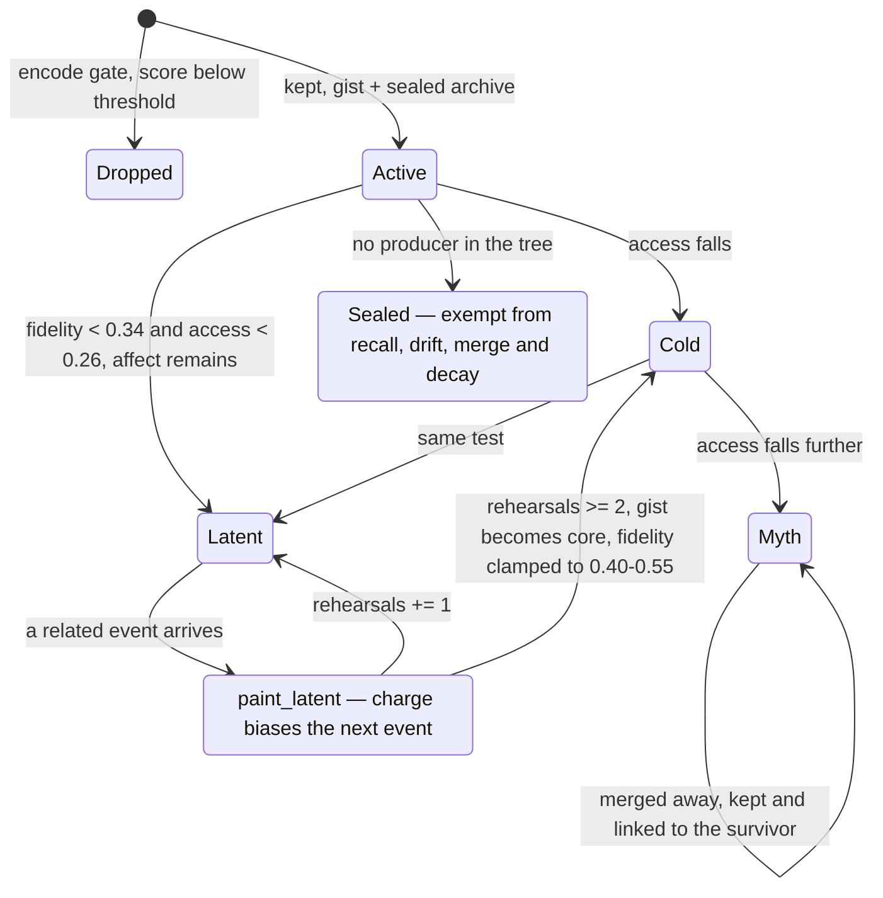

## 1. Executive Summary

SelMem is a memory organ for LLM entities, written in Rust with **zero Cargo dependencies** — 9,514 lines across `src/`, `tests/` and `examples/`, MIT, thirteen commits since 6 September 2026, and a hand-written FFI binding to the system `libsqlite3` rather than a crate. It is one week old and the version is 0.5.

Almost every memory system in this atlas is trying to remember accurately. **SelMem is trying to remember like a person, which means badly, and on purpose.** The README states the goal as a design constraint rather than an apology:

> *"An LLM maps context to the next token. A stack of unmodified facts maximises coverage, not deviation: more evidence, same average path. SelMem sculpts a particular past — forgotten, gilded, anchored — so two instances can diverge."*

The unit is a `MemoryTrace` with two texts: a `gist` that the narrator may rebuild and that drifts, and a `core` frozen at encode that grounding compares against. Beside it, a sealed `ArchiveRecord` holding the verbatim event, reachable only through `Engine::audit` and never handed to the narrator. A nightly `sleep` pass weathers, rewrites, merges and extinguishes, then promotes recurring material up a ladder — motif, belief, trait — into an identity the next encode is biased by. Two shipped profiles, `tender` and `austere`, differ only in coefficients, and the project's claim is that after a few nights on one corpus they no longer share a past.

**The defect is in the one state that would opt out.** `TraceStatus::Sealed` is the only status that exempts a trace from the whole machine: `MemoryStore::active_ids()` filters it out, and that function is the source of candidates for both recall and the entire sleep pass. Five call sites consume it, both persistence backends serialise and parse it — and **nothing in the repository ever assigns it**. In a design whose thesis is that memory must be allowed to deform, the single declared way to say *this one must not* cannot be granted by any code path, CLI command or HTTP route.

Two things are unusually well done and worth reading regardless of the above. `tests/engine.rs` contains the negative assertion this atlas argues for and rarely finds, with its positive control in the same test. And `PARAMETERS.md` grades every constant in the system by warrant — *Literature (qualitative)*, *Contrast pair*, *Discrete convenience*, *Ad hoc* — and says plainly: *"We have not learned these parameters… treat every digit as provisional."*

## 2. Mental Model

Two texts per episode, and only one of them is allowed to change.

```text
event ──gate──▶ dropped, no archive
          │
          └──▶ MemoryTrace                    ArchiveRecord
                 gist   "can drift"    ────▶    verbatim  (sealed)
                 core   "frozen at encode"      never handed to the narrator
                 fidelity, access, anchor
```

Recall does not replay: it *rebuilds* a sentence from the current trace, and the rebuild can write back. Grounding is the counterweight — when spoken sentences drift too far from `core`, a `DriftKind::Ground` event pulls the trace back and the recall carries the disclaimer *"pulled back toward the core"*. So the system holds a deliberate tension: the gist is free to deform, the core is the thing it deforms *away from*, and the archive is the thing neither of them can reach.



**`Latent` is the idea worth taking.** When a Selfhood trace falls below both thresholds but still carries affect or a schema, its status becomes `Latent` and the scene stops being tellable: `recall/retrieve.rs:38`, `recall/narrator.rs:86`, `recall/http.rs:58` and `encode/identity.rs:71` each skip it, the last excluding it from identity-axiom formation. What survives is the charge. `paint_latent` walks exactly the latent traces, and when a new event is related to one by schema or core it bends that event's valence and disgust toward the forgotten episode and may hand it the schema — the README's *"next experience is already colored"*, implemented.

## 3. Architecture

Nine modules, no dependencies, and a strict rule about who may talk to the model.

- `core/` — `model` (the trace, archive, axiom and mood types), `store`, `profile`, `talk`
- `encode/` — `intake` (the gate), `scoring`, `embed`, `affect`, `identity`
- `recall/` — `retrieve`, `narrator`, `ground`, `http`
- `dream/` — `night` (the sleep pass), `drift`, `singularite` (anchors)
- `persist/` — `sqlite` (690 lines of hand-written FFI), `file` (566 lines, a `SELMEM1` flat format)
- `net/` — `api`, `httpx`, a single-file UI

The persistence rule is stated as a boundary: *"Persistence is a vault, not the memory: the organ lives in RAM (`MemoryStore`); on `save` it is dumped, on `open` it is reloaded. The model never talks to the vault."* Both backends round-trip the same `Snapshot` of profile, mood and store.

### Deployment and ergonomics

The cost is close to zero and the dependency surface is empty: `cargo` with no crates, Rust 1.75, and a dynamic link against whatever `libsqlite3` the OS already ships. `run.sh` exists because that link is the only fiddly part — it adds Homebrew's lib path on macOS and fabricates a `libsqlite3.so` stub on Linux when the `-dev` package is missing. A vault with a non-database extension needs no SQLite at all.

The LLM is reached through `SpeakOnlyHttp`. Encoding, sleep and reconstruction stay local, which is what makes the experiment design below possible.

## 4. Essential Implementation Paths

### The encode gate

`encode/intake.rs` scores arousal, novelty, self-relevance, utility and goal alignment into one 0–1 number and compares it with the profile's threshold (`tender` 0.40, `austere` 0.55). `Channel::World` — operational facts — gets the threshold multiplied by 0.6, so the bar for remembering a fact is lower than for remembering an experience. A dropped event returns an `EncodeDecision { kept: false, .. }` and leaves nothing behind: no trace, no archive record.

### Sleep

`dream/night.rs` iterates `store.active_ids()` and, per trace: refreshes access, weathers, then either extinguishes or sculpts, then re-tests status. `Channel::World` traces are pinned to `Active` with `access = 1.0` under the comment *"Operational facts do not cool, mythologize, or go latent."* Afterwards come `rewrite_pass`, `merge_close`, axiom extraction, trait promotion and `apply_anchors`.

`extinguish` is fear extinction rather than deletion: on an unused Selfhood trace it decays `disgust` toward zero and logs a `Fade`, leaving the episode intact.

`merge_close` does not delete the loser. It sets the source to `Myth`, links the two ids, and writes a `Merge` drift on the survivor whose note names the merged id. **No code path in the tree removes a trace** — `traces.remove` and `traces.retain` do not appear.

### Grounding, and the archive it must not touch

`recall/ground.rs` compares a spoken sentence against the trace's frozen `core`. Consecutive departures raise `detach_strikes`; past the profile's `ground_strikes` the trace is pulled back, a `DriftKind::Ground` event is recorded, and the recall's disclaimer changes from `"lived account (fidelity 0.62)"` to `"pulled back toward the core"`. The pull-back target is `core`, never `verbatim` — which is the invariant the test in section 10 exists to defend.

### `Sealed`, and its missing writer

```rust
pub fn active_ids(&self) -> Vec<String> {
    self.traces.values()
        .filter(|t| t.status != TraceStatus::Sealed)
        // …
}
```

Five consumers depend on the state: `store.rs:48` above, `night.rs:50` (a World trace is not re-activated if sealed), `night.rs:89` (a sealed trace never becomes `Latent`), `night.rs:259` (a `-20` merge-weight penalty, the strongest, so a sealed trace is never chosen as a merge survivor), and `night.rs:316` (excluded from merge grouping). `persist/file.rs:501,510` and `persist/sqlite.rs:640,648` write and parse the string `"sealed"` in both directions.

The assignments in the whole tree are `intake.rs:123` (`Active` at encode) and six lines in `dream/night.rs` setting `Active`, `Latent`, `Myth` and `Cold`. `Sealed` is not among them, in `src/`, in `tests/`, in `examples/`, or in any fixture under `data/`. The round-trip through persistence means a hand-edited vault could introduce one; nothing the program does can.

The consequence is specific rather than cosmetic. `permanence >= 0.8` already exempts a trace from the status transitions, so the design is not without a protection — but `permanence` does not remove a trace from `active_ids()`, so a permanent trace is still recalled, still weathered, still a merge candidate. `Sealed` is the only *withdrawal*, and withdrawal is the operation a user asking to have something set aside would be asking for.

## 5. Memory Data Model

`MemoryTrace` carries twenty-two fields, and the ones that matter are the pair of texts and the four scalars that govern them:

| Field | Role |
| --- | --- |
| `gist` | the reconstructable story; drifts |
| `core` | a stable semantic reference frozen at encode; grounding's target |
| `fidelity` | how sharp the gist still is, 0 blur to 1 sharp |
| `access` | how findable it is; falls with disuse |
| `permanence` | how long it is meant to last; resists the gate drop |
| `anchor` | 0–1 resistance to decay and rewrite — *"trauma, triumph, vow"* |
| `drifts` | every mutation, with its deltas |
| `archive_id` | pointer into the sealed book; *"Never handed to the narrator"* |

`IdentityAxiom` carries `superseded_by: Option<String>` and an `AxiomLayer` of `Motif`, `Belief` or `Trait` — the consolidation ladder. Supersession is a chain, not a rejection keyed on a value, so it does not reach `tombstone` under this atlas's definition.

Every clock is record time: `created_at`, `last_recalled_at`, `last_consolidated_at`, and `DriftEvent.at`. Nothing records when a memory was *true*, so `bitemporal` is withheld.

## 6. Retrieval Mechanics

`recall/retrieve.rs` ranks `store.active_ids()` by `recall_score_emb` over cues, a 96-dimension embedding and mood congruence. The embedder is `HashEmbedder` by default — local, dependency-free — with `HttpEmbedder` available and falling back to the hash one when the endpoint is unusable, so retrieval never hard-fails on a missing service.

Two status filters sit in the loop: `Latent` is skipped outright, and `Cold` is skipped below a score of 0.12. Then each survivor is *reconstructed* by the narrator rather than emitted, `rehearsals` and `last_recalled_at` are updated, and the result carries a `disclaimer` naming how it was produced.

That last field is rarer than it sounds. A recalled memory arrives labelled with its own fidelity, so a consumer can tell a sharp account from a blurred one without inspecting the store.

## 7. Write Mechanics

Writes are synchronous and gated; everything expensive happens in `sleep`. There is no queue, no worker and no lock — the organ is a `MemoryStore` in process memory, and `save` dumps it.

The lifecycle is unusual in that **nothing is ever removed**. Events are refused at the gate, episodes decay to `Latent`, merged episodes become `Myth` with an edge to their survivor, and `prune_orphaned_archives` removes only archive records whose trace never existed. A store therefore grows monotonically in traces while shrinking in what any of them can still tell you.

## 8. Agent Integration

Three surfaces: the library, `selmemd` (an HTTP API with fifteen routes and a single-file UI), and `selmem-chat`, a French-language REPL whose `/sleep`, `/who`, `/mood`, `/talk` and `/forget` commands drive the organ directly. `/forget` clears the live conversation thread, not memory.

`GET /audit` is the operator's window onto the sealed archive: give it a trace id and it returns the verbatim event, which is what lets a person compare the drifted gist against what actually happened. It is the only surface that reads `verbatim`, and it is read-only — there is no route that corrects, approves or withdraws a trace. `human_review` is withheld on that basis: a display is not an adjudication.

## 9. Reliability, Safety, and Trust

Strengths:

- **Every mutation is recorded with its magnitude.** `drifts` is append-only across nine writers, persisted in both backends, and never cleared.
- **Nothing is destroyed**, so a merged or forgotten episode remains inspectable even when it is no longer tellable.
- **The archive is genuinely sealed** on the narrator path, and a test defends it rather than a comment asserting it.
- **Recalls are self-labelling**, carrying fidelity and a disclaimer.
- **Grounding is a real counterweight to drift**, keyed on a reference frozen at encode.
- **`PARAMETERS.md` grades its own constants by warrant** and states that none is fitted.

Gaps:

- **`TraceStatus::Sealed` has no producer**, so the only exemption from recall, drift, merge and decay cannot be granted.
- **`fidelity` and `access` drive everything and are set by hand-chosen coefficients** the project itself labels exploratory; there is no calibration against anything.
- **No scope key reaches any query.** Isolation between entities is one vault per entity — a partition, not a predicate.
- **A store never shrinks.** Traces accumulate for the life of an entity, and the only bound is the encode gate.
- **The `Latent` revival is not idempotent across profiles.** `maybe_revive_latent` clamps fidelity into `0.40..=0.55` regardless of how blurred the trace had become, so a deeply decayed episode returns as sharp as a lightly decayed one.

## 10. Tests, Evals, and Benchmarks

**Nothing was run.** `Cargo.toml` changed the day before this reading and `Cargo.lock` two days before, both inside the seven-day cooldown, so the tree was not built.

Fifty-nine tests across nine files. One of them is the reason this report carries `negative_eval`:

```rust
#[test]
fn grounding_never_exposes_the_archive() {
    // … secret planted in ArchiveRecord.verbatim, gist replaced with an
    //   unrelated sentence so grounding must fire
    for _ in 0..6 {
        let rec = mem.remember("la pluie");
        for r in &rec {
            assert!(!r.narrative.contains(secret), "narrative leaked the journal: {}", r.narrative);
            assert!(!r.disclaimer.contains(secret));
        }
        // …
    }
    assert!(!t.gist.contains(secret), "gist must not become the journal");
    assert!(mem.audit(&id).unwrap().contains(secret));
}
```

The last line is what makes the test worth copying. A suite that asserts only *"the secret is absent from the output"* passes just as well when the secret was never stored, when recall returns nothing, and when the store is empty. Proving the material is still there, in the same test, is the difference between an assertion and a hope — and it is the strict, content-about-a-read-path form of the mark rather than the looser projection form.

`latent_forgets_the_scene_keeps_the_reaction` is the second negative case, asserting a latent recall does not replay the scene's words and then that its charge colours a new event. Its positive half is weaker than the first test's: it is wrapped in `if let Some(t) = painted`, so if the encode gate drops the follow-up event the assertion is skipped and the test still passes.

`experiments/REPORT.md` is a small, honestly-scoped study. Three cells — no memory, a last-k verbatim log, and SelMem — over one model at `temp=0` with one seed, asking whether two clones stay interchangeable after one marked hour. It numbers three claims and says which are tested: *"Only the first two are tested here… Creativity. Deferred. Three items are logged, not scored."* The matched-length control arm (an administrative notice against an unjust cancellation) is the right shape. One seed and one model is not a result that generalises, and the document does not claim it is.

**No paper, arXiv reference, DOI or citation file exists in this repository.** The whitepaper is a design manifest in the tree.

## 11. For Your Own Build

### Steal

- **Two texts per memory: one that may drift and one that may not.** `gist` and `core`, with grounding comparing the spoken sentence against the frozen one, is a cheap and general answer to "how do I let a summary evolve without letting it become fiction."
- **Record the delta, not the event.** A mutation log saying `fidelity_delta: -0.08` under `DriftKind::Weather` answers questions an append-only "a write happened" log cannot.
- **Keep the verbatim, and make it unreachable from the generation path.** One accessor, one HTTP route, and a test that fails if it ever leaks.
- **Pair every must-not assertion with a proof the material exists.** The four lines at the end of `grounding_never_exposes_the_archive` are the pattern.
- **Grade your own constants.** `PARAMETERS.md`'s four-level warrant scale, and its refusal to dress a contrast pair up as a finding, is a better artifact than most tuning documentation.
- **Let a forgotten thing keep acting without being tellable.** `Latent` separates *can this be narrated* from *does this still shape me*, and most designs collapse the two.

### Avoid

- **A protective state with no way to enter it.** `Sealed` is consumed five times, persisted twice and written never. If a status exempts a record from your machinery, ship the command that sets it in the same change, or delete the variant.
- **A revival that forgets how far the thing had fallen.** Clamping restored fidelity into a fixed band discards the difference between nearly-lost and long-lost.
- **A positive control behind an `if let`.** An assertion that is skipped when its fixture is absent is a test that reports success for the case it was written to catch.
- **Unbounded growth as a consequence of never deleting.** Never destroying is defensible and here it is principled; it still needs an answer for the entity that has lived a hundred thousand hours.

### Fit

Take this if you are building a *character* rather than an assistant — an entity whose value is that it is particular, and whose past is supposed to be its own. The mechanisms are legible, the dependency cost is zero, and the pieces come apart: the gist/core pair, the drift log and the latent state are each adoptable without the rest.

Do not take it as a factual store. The design's explicit goal is that recall not reproduce the input, and `Channel::World` — the concession that operational facts must not decay — is a flag on a trace rather than a separate store with its own guarantees. If you need to know what the user actually said, that is what the sealed archive is for, and reading it is an operator action rather than something the entity can do.

## 12. Open Questions

- What was `Sealed` meant to be set by — an operator command, a `permanence` ceiling, or the entity itself? All five consumers agree on its meaning; only the writer is missing.
- Should the `Latent` revival restore fidelity proportional to what was lost rather than into a fixed band?
- Does the `tender`/`austere` divergence survive a second seed and a second model? The experiment is one of each and says so.
- What bounds a long-lived store, given that nothing is ever removed and `Myth` traces are kept for their edges?
- Is `Channel::World` sufficient for facts that must not drift, or does it need the archive's guarantees rather than an exemption from decay?

## Appendix: File Index

- **The model:** `src/core/model.rs` (`MemoryTrace`, `ArchiveRecord`, `IdentityAxiom`, `TraceStatus`, `DriftKind`, `DriftEvent`), `src/core/store.rs` (`active_ids`, `link`).
- **Encode:** `src/encode/intake.rs` (the gate), `scoring.rs`, `embed.rs` (96-dim hash and HTTP embedders), `identity.rs` (`paint_latent`, axiom formation).
- **Recall:** `src/recall/retrieve.rs` (ranking, the `Latent` and `Cold` filters, the disclaimer), `narrator.rs`, `ground.rs`, `http.rs`.
- **Sleep:** `src/dream/night.rs` (`extinguish`, `maybe_revive_latent`, `merge_weight`, `merge_close`, `extract_axioms`), `drift.rs`, `singularite.rs`.
- **Persistence:** `src/persist/sqlite.rs`, `file.rs`, `mod.rs` (`prune_orphaned_archives`).
- **Surfaces:** `src/net/api.rs` (fifteen routes, `GET /audit`), `src/bin/selmemd.rs`, `src/bin/selmem-chat.rs`, `src/engine.rs` (`audit`).
- **Evidence:** `tests/engine.rs`, `tests/scenes.rs`, `tests/bifurcation.rs`, `experiments/REPORT.md`, `PARAMETERS.md`.

### Searches behind the absence claims

Run from the repository root; each returned only what is described beside it.

```sh
# Sealed is consumed in five places and assigned in none
grep -rn 'Sealed\|"sealed"' src/ tests/ examples/ --include='*.rs'
grep -rn 'status = TraceStatus::\|status: TraceStatus::' src/ --include='*.rs'

# no code path removes a trace or truncates its history
grep -rn 'traces.remove\|traces.retain\|drifts.clear\|drifts.truncate\|drifts.drain' src/ --include='*.rs'

# verbatim is read by one accessor and one route
grep -rn 'verbatim' src/ --include='*.rs' | grep -v 'persist/'

# no paper, citation file or DOI
grep -rniE 'arxiv|@article|@misc|CITATION|\bdoi\b' --include='*.md' --include='*.toml' .
```

## History

**2026-09-14** — [`a4ace34a8cc4f03d681de9f7d1b43f841e6f5a4d`](https://github.com/jbsalles/Selmem/commit/a4ace34a8cc4f03d681de9f7d1b43f841e6f5a4d) — first reading, on the `main` default branch, thirteen commits from a repository created 6 September 2026. Screened before reading: no auto-executing surface, no build-time execution point, and both `Cargo.toml` and `Cargo.lock` changed within two days, so the tree was inside the seven-day cooldown — nothing was installed, nothing was built and no test was run. Every finding is static. Two marks are earned and the five withheld ones were each tested at the producer: `tombstone` fails because `IdentityAxiom.superseded_by` is a supersession chain rather than a value-keyed rejection, `trust_state` because `TraceStatus` is a threshold projection of `access` and `fidelity` recomputed every sleep, `bitemporal` because every clock is record time, `scope_enforced` because entity isolation is one vault per entity, and `human_review` because `GET /audit` displays the archive without offering any action on it.
