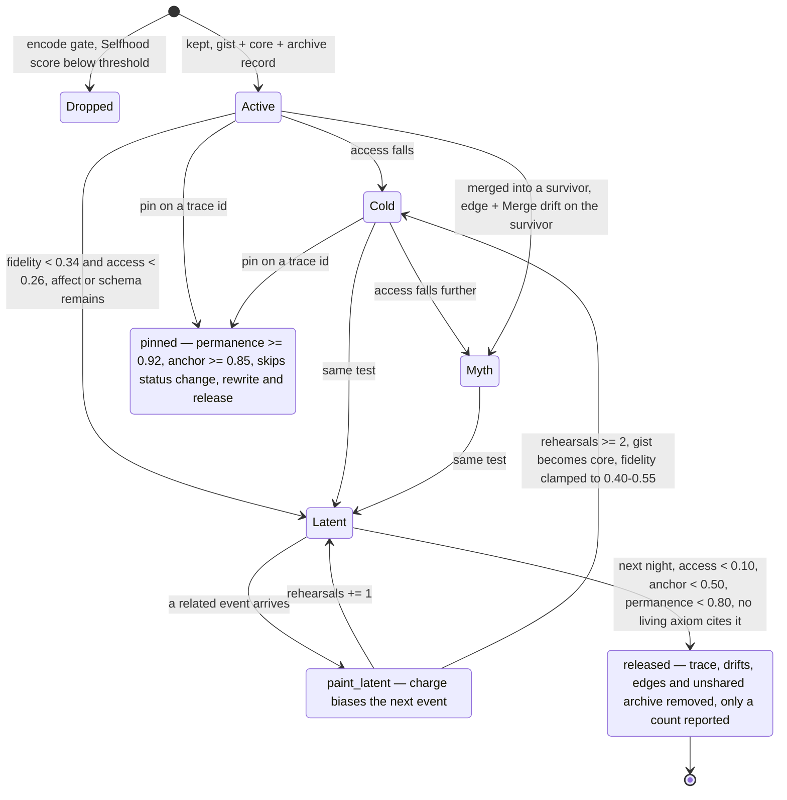

## 1. Executive Summary

SelMem is a memory organ for LLM entities, written in Rust with no Cargo dependencies and a hand-written binding to the system `libsqlite3`. It is built to remember like a person — selectively, reconstructively, and wrongly on purpose — and its test suite asserts what must not be reachable as well as what must. Its weak point is the end of forgetting: a spent episode leaves the store together with the only record of how it changed, and nothing notes that it existed.

The README states the goal as *"not more memory, but path-dependent memory"*, and narrows the claim to one testable sentence: two copies of one model that retained one hour on one side only stop remembering and forgetting the same things.

The unit is a `MemoryTrace` with two texts. A `gist` that the narrator rebuilds and that drifts; a `core` set at encode that grounding compares against. Beside it sits an `ArchiveRecord` holding the verbatim event, read by `SelectiveMemory::audit`, two operator routes and the sitting de-duplicator, and never handed to the narrator. A nightly `sleep` weathers, promotes recurring material up a motif–belief–trait ladder, rewrites, merges, and then releases what is spent.

**Forgetting ends in deletion without a record.** A Selfhood trace that was `Latent` before a night and stays spent through it — access under 0.10, anchor under 0.50, permanence under 0.80, cited by no living axiom — is removed by `MemoryStore::release_trace`. Its `drifts` go with it, its archive record goes if no other trace shares it, and its edges are cut. The night reports a count; the store keeps nothing (`src/core/store.rs:170-186`, `src/dream/release.rs:9-37`).

The per-trace drift log, which records each reconstruction with its deltas, is therefore not an audit record: its largest mutation erases it. `TraceStatus::Sealed`, a declared withdrawal state with no writer, was removed on 15 September 2026; its protective role went to `pin`, which keeps a trace from decaying and does not withdraw it from recall.

Two parts are unusually careful. `tests/engine.rs` pairs its must-not assertion with proof the material is in the store, before and after. And every place a model's output could enter the store is checked against the event: a proposed core may drop words and not add them, and a proposed segmentation must be contiguous excerpts.

## 2. Mental Model

Two texts per episode, and only one of them is rebuilt on every telling.

```text
event ──gate──▶ dropped, no archive
          │
          └──▶ MemoryTrace                    ArchiveRecord
                 gist   "can drift"    ────▶    verbatim
                 core   set at encode           never handed to the narrator
                 fidelity, access, anchor
                 drifts (deltas per change)
```

Recall does not replay: it *rebuilds* a sentence from the current trace, and the rebuild can write back. Grounding is the counterweight. A rule judge classifies each spoken sentence against `core` as hold, compress, elaborate, reframe, contradict or depart; enough misses pull the trace back, record a `DriftKind::Ground` event, and change the recall's disclaimer to *"pulled back toward the core"*. A reframe — irony, another speech act on the same event — is spoken and logged as `Color` without touching the gist.

The `core` is not strictly frozen. Merge appends up to four distinctive words from the absorbed episode's core to the survivor's (`src/dream/merge.rs:67`, `fuse_core` at 152-179), and an LLM narrator may replace it at encode with a subset of the event's own words.


```mermaid
%% caption: a decayed episode becomes Latent — withdrawn from recall while its affect biases what is encoded next — and, unless revived or cited by a living axiom, leaves the store a night later with its drift log and unshared archive, leaving no record
stateDiagram-v2
  [*] --> Dropped: encode gate, Selfhood score below threshold
  [*] --> Active: kept, gist + core + archive record

  Active --> Cold: access falls
  Cold --> Myth: access falls further
  Active --> Myth: merged into a survivor, edge + Merge drift on the survivor
  Active --> Latent: fidelity < 0.34 and access < 0.26, affect or schema remains
  Cold --> Latent: same test
  Myth --> Latent: same test

  state "paint_latent — charge biases the next event" as Paint
  Latent --> Paint: a related event arrives
  Paint --> Latent: rehearsals += 1
  Paint --> Cold: rehearsals >= 2, gist becomes core, fidelity clamped to 0.40-0.55

  state "released — trace, drifts, edges and unshared archive removed, only a count reported" as Released
  Latent --> Released: next night, access < 0.10, anchor < 0.50, permanence < 0.80, no living axiom cites it
  Released --> [*]

  state "pinned — permanence >= 0.92, anchor >= 0.85, skips status change, rewrite and release" as Pinned
  Active --> Pinned: pin on a trace id
  Cold --> Pinned: pin on a trace id
```

**`Latent` is the idea to take.** When a Selfhood trace falls below both thresholds but carries affect or a schema, its scene stops being tellable. Recall excludes it (`src/recall/retrieve.rs:223-226`), both narrators replace its scene with a fixed latent line (`src/recall/narrator.rs:97`, `src/recall/http.rs:76`), the night's rewrite skips it (`src/dream/rewrite.rs:33`) and the ladder does not let it mint a belief (`src/dream/ladder.rs:64`).

What survives is the charge. `paint_latent` walks exactly the latent traces, and when a new event is related to one by schema or core it bends that event's valence and disgust toward the forgotten episode and may hand it the schema (`src/encode/identity.rs:62-96`) — the README's *"next experience is already colored"*, implemented.

## 3. Architecture

Six module groups, no dependencies, and a rule that the model never touches the vault.

- `core/` — `model` (trace, archive, axiom, channel and status types, a scaled virtual clock), `store`, `profile`, `talk`
- `encode/` — `interpret`, `paint`, `split`, `gate`, `core`, `intake`, `scoring`, `embed`, `affect`, `identity`
- `recall/` — `retrieve`, `judge`, `pull`, `narrator`, `http`, `stance`, and `ground` as a re-export façade
- `dream/` — `night` (pass order and budget), `weather`, `ladder`, `rewrite`, `merge`, `release`, `drift`, `singularite`
- `persist/` — `snapshot` (one field list for both backends), `sqlite` (600 lines of hand-written FFI), `file` (484 lines, the `SELMEM1` format)
- `net/` — `api`, `httpx`, a single-file UI; beside them `benchmark`, `experiment` and `lexicon`

The organ lives in RAM as a `MemoryStore`; `save` dumps it and `open` reloads it. Both backends assemble traces through `persist/snapshot.rs`, so a field added to `MemoryTrace` cannot reach one vault and not the other. The SQLite save deletes every table's rows and re-inserts the store inside one transaction (`src/persist/sqlite.rs:215-219`); the file save writes a temporary file and renames it over the vault.

### Deployment and ergonomics

The dependency surface is empty: `cargo` with no crates, Rust 1.75, and a dynamic link against the OS's `libsqlite3`. `run.sh` handles that link — Homebrew's lib path on macOS, a fabricated `libsqlite3.so` stub on Linux when the `-dev` package is missing. A vault with a non-database extension needs no SQLite at all.

`selmemd` binds `127.0.0.1:7420` by default and takes an optional bearer token; without one, every route, including `POST /reset`, is open to any local caller. Model calls go out through `curl` as a subprocess whenever `curl` is installed, with the API key as a command-line argument (`src/net/httpx.rs:6-29`), where other local users can read it from the process list.

## 4. Essential Implementation Paths

### The encode gate

`encode/gate.rs` scores arousal, novelty, self-relevance, utility and goal alignment into one 0–1 number and compares it with the profile's threshold: `tender` 0.28, `austere` 0.40. A Selfhood event below it returns `EncodeDecision { kept: false, .. }` and leaves no trace and no archive record. World and Log events, and any event with `permanence >= 0.8`, are never dropped (`src/encode/gate.rs:140-161`).

Long events are split first. A narrator may propose the cut, and `lossless_parts` accepts it only if each unit is a contiguous excerpt of the source, in order, covering nearly all of it (`src/encode/split.rs:34-36`). After a keep, a narrator may propose a core, and `accept_core` rejects any proposal containing a content word the event did not (`src/encode/core.rs:17-34`).

### Sleep

`dream/night.rs` fixes the order as `weather, ladder, rewrite, merge, release` for a deep night and `weather, release` for a shallow one; a night is deep when enough Selfhood hours or enough charge accumulated since the last (`src/dream/night.rs:12-51`). `weather` pins World and Log traces to `Active` with `access = 1.0`, and skips status transitions for any trace with `permanence >= 0.8` (`src/dream/weather.rs:31-36`, `66-68`).

`extinguish` is fear extinction rather than deletion: on an unused Selfhood trace it decays `disgust` and logs a `Fade`. `rewrite` retells up to six traces a night from their neighbours and skips charged, pinned, anchored and axiom-cited hours (`src/dream/rewrite.rs:92-120`). `merge` sets the absorbed trace to `Myth`, links the two, re-points axiom support at the survivor, and writes a `Merge` drift on the survivor naming the absorbed id (`src/dream/merge.rs:87-106`).

### Release, and what it takes with it

`release::run` collects traces that were `Latent` before this night, are `Latent` after the other passes, are on the Selfhood channel, have `access < 0.10`, `anchor < 0.50` and `permanence < 0.80`, and are cited by no living axiom. Each goes through `release_trace`, which removes the trace, its edges in both directions, and its archive record when no other trace points at it (`src/dream/release.rs:9-37`, `src/core/store.rs:170-186`).

A second caller applies different guards. `fade_sitting`, run after every `POST /sleep` and every `/sleep` in `selmem-chat`, lowers the fidelity and access of each hour whose archive source is `talk` and whose permanence is under 0.80. At the floor it marks the hour `Latent`, and on the next pass releases it. It checks neither `anchor` nor living-axiom support, the two guards `release.rs` applies (`src/engine.rs:463-499`).

Neither caller writes anything down. `DreamReport.released` is a count returned in the `/sleep` response. A released trace's `drifts` leave with it, and the next save deletes their rows. A `Merge` drift on a survivor can then name an id that resolves to nothing. `POST /reset` empties the whole store and saves (`src/engine.rs:501-506`, `src/net/api.rs:349-355`).

### Grounding, and the archive it must not touch

`recall/judge.rs` is a deterministic classifier, English and French, over cause connectives, negation and frame words; embeddings rank recall and do not decide this. `recall/pull.rs` turns its verdict into action: a miss raises `detach_strikes`, and past a budget scaled by the trace's grip, the gist is rewritten toward the core and a `Ground` drift is recorded (`src/recall/pull.rs:197-210`). Cold, Myth and Latent traces have no grip and may warp freely. The pull-back target is `core`, never `verbatim`.

### `pin`, the protection that replaced `Sealed`

`TraceStatus::Sealed` was declared, consumed at five sites and persisted by both backends, and nothing assigned it. Commit [`fbdeb2e64d42472c07d58bf3847677c37785234d`](https://github.com/jbsalles/Selmem/commit/fbdeb2e64d42472c07d58bf3847677c37785234d) on 15 September 2026 deleted the variant; the file loader reads an old `"sealed"` as `Active` under the comment that it was never produced (`src/persist/file.rs:453-454`).

`SelectiveMemory::pin` raises `permanence` to at least 0.92, `anchor` to at least 0.85, and sets `Active` (`src/engine.rs:653-663`). That exempts the trace from status transitions, rewrite, release and `fade_sitting`, and makes it the survivor of any default merge. It does not withdraw the trace: a pinned hour is recalled, reconstructed and grounded like any other. `POST /pin` pins only a freshly encoded event built from the request or the sitting; no route pins an existing trace by id.

## 5. Memory Data Model

`MemoryTrace` carries twenty-four fields; the pair of texts, the drift log and four scalars govern it:

| Field | Role |
| --- | --- |
| `gist` | the reconstructable story; drifts |
| `core` | the reference set at encode; grounding's target; merge may extend it |
| `fidelity` | how sharp the gist is, 0 blur to 1 sharp |
| `access` | how findable it is; recomputed from time and use |
| `permanence` | how long it is meant to last; 0.8 exempts it from the gate drop and status change |
| `anchor` | 0–1 resistance to decay and rewrite; never lowered once raised |
| `drifts` | `DriftEvent { kind, at, note, fidelity_delta, valence_delta, disgust_delta }` per change |
| `archive_id` | pointer into the verbatim record |

Ten call sites append a `DriftEvent`, across reinterpretation, weathering, disgust amplification, embellishment, rewriting, extinction, merging, grounding and reframing. Nothing truncates the vector while the trace lives; `release_trace` discards it with the trace (`src/core/model.rs:137-145`, `175`).

`Channel` has three values: `Selfhood`, sculpted; `World`, operational facts; `Log`, tool and journal lines kept near-verbatim with the gate threshold at zero. The last two answer `true` to `Channel::verbatim()` and are exempt from weather, rewrite, merge and release (`src/core/model.rs:73-86`).

`IdentityAxiom` carries `superseded_by: Option<String>`, an `AxiomLayer` of `Motif`, `Belief` or `Trait` with a strength cap per layer, and `support_trace_ids`. Supersession is a chain, not a rejection keyed on a value, so it does not reach `tombstone` under this atlas's definition.

Every clock is record time: `created_at`, `last_recalled_at`, `last_consolidated_at` and `DriftEvent.at`, read from a virtual clock that scales wall time by up to 200 and can be jumped forward for a UI night (`src/core/model.rs:32-54`). Nothing records when a memory was *true*, so `bitemporal` is withheld.

## 6. Retrieval Mechanics

`recall/retrieve.rs` ranks every trace by `recall_score_emb` over cues, a 96-dimension embedding and mood congruence, and adds 0.12 to any hour a living axiom cites (`src/recall/retrieve.rs:139-143`). `HashEmbedder` is the default, local and dependency-free; `HttpEmbedder` falls back to it when the endpoint is unusable.

Three filters sit in the loop: a `talk` hour with access under 0.10 is dropped, `Latent` is ineligible, and `Cold` needs a score of 0.12 (`src/recall/retrieve.rs:136-138`, `223-231`). Each survivor is *reconstructed* by the narrator, and the result carries a `disclaimer` naming how it was produced — `"verbatim record, not distorted"` for World and Log traces. Live recall stamps `last_recalled_at`; rehearsal is counted only when `speak` hands the hour to the reply (`src/engine.rs:623-650`).

A recalled memory arrives labelled with its own fidelity, so a consumer can tell a sharp account from a blurred one without reading the store. Before the reply prompt, `pin_happened` appends *"(what happened: …)"* with the core whenever the retelling shares fewer than half the core's longer words (`src/engine.rs:667-685`).

`RecallWrite::ReadOnly` gives the experiments isolated probes that do not rehearse, ground or reconsolidate. `RecallBias` adds three probe-only ablations — force a marked trace in, drop it, or drop its whole lineage and the axioms it supports (`src/recall/retrieve.rs:22-33`, `251-259`). Live `speak` and `remember` always use `Observed`.

## 7. Write Mechanics

Writes are synchronous and gated; everything expensive happens in `sleep`. There is no queue and no worker: the organ is a `MemoryStore` in process memory, `selmemd` serialises writers on one lock, and `save` rewrites the vault from RAM. An encoded event is retrievable immediately.

Four paths remove material. `release` drops spent latent traces each night; `fade_sitting` drops husked `talk` hours after a chat sleep; `prune_orphaned_archives` drops archive records no trace points at, before every sleep (`src/persist/mod.rs:28-35`); and `POST /reset` empties the store. The first two bound growth for the hours nobody uses. `Myth`, `Cold`, pinned, World, Log and axiom-cited traces are kept for the life of the entity.

The night rewrites at most six gists and touches every trace's access and status, so a deep night is a pass over the whole store rather than over what changed.

## 8. Agent Integration

Three surfaces: the library, `selmemd` with twenty-one routes and a single-file UI, and `selmem-chat`, a French-language REPL whose `/sleep`, `/who`, `/mood`, `/talk` and `/forget` commands drive the organ directly. `/forget` clears the live conversation thread, not memory.

With an endpoint configured, `HttpNarrator` is the narrator for both binaries, and it calls the model to reconstruct recalls, rewrite gists at night, distil axioms, read affect, propose cores and segmentations, and reply (`src/recall/http.rs:74-272`). `SpeakOnlyHttp`, which sends only the reply to the model and keeps everything else on rules, is the experiments' client.

Two routes read the verbatim record. `GET /audit` returns one trace's verbatim event; `GET /book` returns every trace, axiom and archive record, verbatim included (`src/net/api.rs:137-148`, `404-462`). `GET /events` renders a timeline of encodes, drifts, axioms and archives from the current store, so a released trace is absent from it.

No route corrects, approves or withdraws a stored trace. `POST /pin` encodes and pins new text; `POST /reset` erases everything. `human_review` is withheld on that basis: displays and whole-store operations are not an adjudication of a waiting memory.

## 9. Reliability, Safety, and Trust

Strengths:

- **Every mutation of a living trace is recorded with its magnitude**, by ten writers, and persisted in both backends.
- **The archive is sealed on the narrator path**, and a test with three vacuity guards defends it.
- **Model output is admitted to the store only as the event's own words.** `accept_core` and `lossless_parts` refuse additions; reconsolidation writes back into the gist only when the retelling passes the same check against core or gist (`src/dream/drift.rs:16-21`).
- **Recalls are self-labelling**, carrying fidelity and a disclaimer.
- **`PARAMETERS.md` grades its own constants by warrant** — literature, contrast pair, discrete convenience, ad hoc — and states none is fitted.

Gaps:

- **Release erases history.** A released trace takes its drift log and, when unshared, its verbatim record; the store keeps no id, time or reason.
- **`fade_sitting` releases on weaker guards than the night does**, ignoring anchor and axiom support.
- **`fidelity` and `access` drive everything through hand-chosen coefficients** the project labels exploratory; nothing is calibrated.
- **No scope key reaches any query.** Isolation between entities is one vault per entity — a partition, not a predicate.
- **The `Latent` revival clamps fidelity into `0.40..=0.55`** regardless of how far the trace had fallen (`src/dream/weather.rs:130-144`).
- **Without a token, `selmemd` exposes every verbatim record and a store reset** to any local process.

### Withheld marks, and how close each came

`audit_log` comes closest. `drifts` is a per-trace delta log with ten writers, append-only while the trace lives, and `release_trace` deletes it with the trace while recording nothing, so the log cannot outlive the mutation it most needs to record. `tombstone`: `RecallBias::DropLineage` bans a marked id, its siblings and the axioms they support, for one isolated probe, as an argument that is never stored. After a release, the same text re-encodes as a new trace, and `keep_sitting`'s check against archived `talk` text loses its record with the archive (`src/engine.rs:435-442`).

`trust_state`: `TraceStatus` is recomputed from `access` and `fidelity` each night, and `pin` sets `Active` with high permanence — a protection, not a judgement about truth. `bitemporal`, `scope_enforced` and `human_review` fail as sections 5, 9 and 8 state.

## 10. Tests, Evals, and Benchmarks

**Nothing was built or run for this reading.** Every finding is static. The suite holds 133 `#[test]` functions in fifteen files under `tests/`; none sits under `src/`.

`grounding_never_exposes_the_archive` is the reason this report carries `negative_eval`:

```rust
#[test]
fn grounding_never_exposes_the_archive() {
    // … secret planted in ArchiveRecord.verbatim, gist replaced with an
    //   unrelated sentence so grounding must fire
    assert!(mem.audit(&id).unwrap().contains(secret), /* before */);
    for _ in 0..6 {
        let rec = mem.remember("the rain");
        assert!(!rec.is_empty(), /* an empty list would make the check vacuous */);
        for r in &rec {
            assert!(!r.narrative.contains(secret), "narrative leaked the journal: {}", r.narrative);
            assert!(!r.disclaimer.contains(secret));
        }
        // … break once a Ground drift is recorded
    }
    assert!(!t.gist.contains(secret), "gist must not become the journal");
    assert!(mem.audit(&id).unwrap().contains(secret), /* after */);
}
```

A suite that asserts only that the secret is absent passes when it was never stored, when recall returns nothing, and when the store is empty. This one closes all three in the same test (`tests/engine.rs:487-547`).

Three more committed cases assert that particular material must not be retrieved, each with a populated counterpart. `trivia_fades_repeated_aversion_does_not` asserts a one-shot colour is neither recalled nor named while a repeated aversion is, both asserted kept at encode (`tests/erasure.rs:4-24`). `horizon_year_one_stream` runs two clones through 360 days and asserts B neither holds nor retrieves the 3 January date A retrieves, and that neither retrieves an unrehearsed number (`tests/horizon.rs:269-280`). `drop_marked_keeps_the_book_and_deselects_t0` asserts T₀ stays in the book and out of the selected set (`tests/benchmark.rs:523-535`).

Release is tested in one direction: `spent_latent_hour_can_leave_the_book` asserts the trace is gone and `released >= 1`, and `one_night_does_not_release_a_fresh_hour` asserts the converse (`tests/engine.rs:846-891`). No test asserts what survives a release. `latent_forgets_the_scene_keeps_the_reaction` requires its follow-up event to clear the gate with `.expect`, so the paint assertion cannot be skipped (`tests/engine.rs:550-603`).

`experiments/REPORT.md` measures the claim on three columns — book, retrieval, mouth — over read-only probes, with Grok 4.3 and gpt-6-luna as speakers, one seed, `temp=0`. The five-cell P4 tables for both speakers, and the DropMarked and DropLineage grids, recompute from the six committed P4 dumps; one mean `D_speak` is 0.685 printed as 0.69.

Several cited result files are not in the repository and never were. `git log --all` finds none of the P1 file `REPORT.md` calls the published cell, the v0.1 ten-pair dump its four quoted excerpts come from, the P0 and rumination dumps, or the horizon-year Grok and Luna dumps. Those sections can be reproduced by running the examples and cannot be checked against a committed file.

The external pages are scoped as side tables. `experiments/EXTERNAL.md` reports LoCoMo category-1 baselines only — over 282 questions, last-8 answers 2 and the full log 281 — and states SelMem's cell was not run; the adapter README is a placeholder. The AMA-Bench numbers, 36 questions on three episodes with one model as answerer and judge, live in a README table with no dump. None of these bears on `negative_eval`.

No paper, arXiv reference, DOI or citation file exists in this repository. `WHITEPAPER.md` is a design manifest in the tree.

## 11. For Your Own Build

### Steal

- **Two texts per memory: one that may drift and one that anchors it.** `gist` and `core`, with a judge comparing the spoken sentence against the reference, answers "how do I let a summary evolve without letting it become fiction".
- **Record the delta, not the event.** A log saying `fidelity_delta: -0.08` under `DriftKind::Weather` answers questions an "a write happened" log cannot — provided it outlives the record it describes.
- **Admit model output only as a subset of the source.** `accept_core` lets a model shorten a core and never add to it; `lossless_parts` lets it cut a document and never paraphrase it.
- **Pair every must-not assertion with a proof the material exists**, before and after, and a proof the read returned something.
- **Grade your own constants.** `PARAMETERS.md`'s four-level warrant scale is better than most tuning documentation.
- **Let a forgotten thing keep acting without being tellable.** `Latent` separates *can this be narrated* from *does this still shape me*.

### Avoid

- **Deleting a record together with its only history.** Write the release — id, time, last drift, reason — somewhere the release cannot reach.
- **Two eviction paths with two guard sets.** `release.rs` and `fade_sitting` decide the same question differently.
- **A revival that forgets how far the thing had fallen.** Clamping restored fidelity into a fixed band discards the difference between nearly-lost and long-lost.
- **An operator dump of the sealed record on the same unauthenticated port as the chat.** `/book` makes the narrator's exclusion an in-process property only.

### Fit

Take this if you are building a *character* rather than an assistant — an entity whose value is that its past is particular. The mechanisms are legible, the dependency cost is zero, and the pieces come apart: the gist/core pair, the admission checks, the drift log and the latent state are each adoptable alone.

Do not take it as a factual store, or as one you must explain after the fact. Recall reproducing the input is the design's explicit non-goal, and a released episode cannot be reconstructed from anything the store keeps. `Channel::World` and `Channel::Log` keep operational facts undistorted, but they share one store, one vault and one reset with everything else.

## 12. Open Questions

- Should a release leave a record — id, time, last drift, the survivor it was merged into — so the store can say what it once held?
- Should `fade_sitting` apply the anchor and axiom-support guards `release.rs` applies?
- Should the `Latent` revival restore fidelity in proportion to what was lost?
- Does the book-level divergence survive a second seed? The P4 dumps show identical `Δfp` within a cell, which the project attributes to encode not using the model.
- Is a route to withhold an existing trace from recall — the role `Sealed` declared — wanted, or is `pin` the whole answer?

## Appendix: File Index

- **The model:** `src/core/model.rs` (`MemoryTrace`, `ArchiveRecord`, `IdentityAxiom`, `Channel`, `TraceStatus`, `DriftKind`, `DriftEvent`, the virtual clock), `src/core/store.rs` (`active_ids`, `lineage`, `release_trace`).
- **Encode:** `src/encode/gate.rs` (threshold, archive record), `core.rs` (`accept_core`), `split.rs` (`lossless_parts`), `interpret.rs`, `identity.rs` (`paint_latent`), `scoring.rs`, `embed.rs`.
- **Recall:** `src/recall/retrieve.rs` (ranking, filters, `RecallBias`), `judge.rs`, `pull.rs` (`apply_grounding`), `narrator.rs`, `http.rs` (`HttpNarrator`, `SpeakOnlyHttp`).
- **Sleep:** `src/dream/night.rs` (pass order, budget), `weather.rs`, `ladder.rs`, `rewrite.rs`, `merge.rs`, `release.rs`, `drift.rs`, `singularite.rs`.
- **Persistence:** `src/persist/snapshot.rs`, `sqlite.rs`, `file.rs`, `mod.rs` (`prune_orphaned_archives`).
- **Surfaces:** `src/engine.rs` (`sleep`, `fade_sitting`, `pin`, `audit`, `reset`), `src/net/api.rs`, `src/net/httpx.rs`, `src/bin/selmemd.rs`, `src/bin/selmem-chat.rs`.
- **Evidence:** `tests/engine.rs`, `tests/erasure.rs`, `tests/horizon.rs`, `tests/benchmark.rs`, `experiments/REPORT.md`, `experiments/EXTERNAL.md`, `experiments/ama_bench/README.md`, `PARAMETERS.md`.

### Searches behind the absence claims

Run from the repository root; each returned only what is described beside it.

```sh
# Sealed survives only as a legacy string mapped to Active
grep -rn 'Sealed\|"sealed"' src/ tests/ examples/ --include='*.rs'

# the removal paths: one trace removal, one archive remove, one archive retain
grep -rn 'traces\.\(remove\|retain\|clear\|drain\)\|archives\.\(remove\|retain\|clear\)\|drifts\.\(clear\|truncate\|drain\|retain\|remove\|pop\)' src/ --include='*.rs'
grep -rn 'release_trace' src/ examples/ tests/

# release writes no record: the report is a count
grep -rn 'released' src/ --include='*.rs'

# verbatim readers outside persistence
grep -rn 'verbatim' src/ --include='*.rs' | grep -v 'persist/' | grep -v 'channel.verbatim\|fn verbatim\|\.verbatim()'

# no route pins or withdraws an existing trace by id
grep -n '("\(GET\|POST\)", "/' src/net/api.rs

# cited result dumps never committed (empty output)
git log --all --name-only --format='' | grep -E 'selmem-(horizon|v01|persist-p0|ruminate|persist-p1-grok|persist-p1-drop)'

# no paper, citation file or DOI
grep -rniE 'arxiv|@article|@misc|bibtex|CITATION|\bdoi\b' --include='*.md' --include='*.toml' .

# no Cargo dependencies; no validity-time field; no scope key
grep -n 'dependencies' Cargo.toml
grep -rniE 'valid_from|valid_to|valid_at|valid_until|occurred_at|event_time|true_at' src/ --include='*.rs'
grep -rniE '\b(tenant|user_id|entity_id|scope|namespace|owner)\b' src/ --include='*.rs'

# release is asserted only as a count and as a missing trace; no test sits under src/
grep -rn 'release' tests/ --include='*.rs'
grep -rn '#\[test\]' src/ --include='*.rs'
```

## History

**2026-09-28** — [`8da0e8d1e90b1937861d1f76af2ec543c93db03c`](https://github.com/jbsalles/Selmem/commit/8da0e8d1e90b1937861d1f76af2ec543c93db03c) — 37 commits on. [`fbdeb2e64d42472c07d58bf3847677c37785234d`](https://github.com/jbsalles/Selmem/commit/fbdeb2e64d42472c07d58bf3847677c37785234d) deleted `TraceStatus::Sealed` and added `release`, which removes spent latent traces with their drift logs and unshared archive records and records nothing; `audit_log` is withdrawn on that ([section 4](#release-and-what-it-takes-with-it)). `negative_eval` holds, with three more cases. Four published claims were wrong at the first pin: `encode/identity.rs:71` was cited as a latent skip and is the loop that walks latent traces; merge extended `core`, which was called frozen; both binaries used a full LLM narrator, not a speak-only one; `MemoryTrace` has twenty-four fields, not twenty-two. Screened: no auto-run, build-time execution or cooldown finding. Nothing installed, built or run.

**2026-09-14** — [`a4ace34a8cc4f03d681de9f7d1b43f841e6f5a4d`](https://github.com/jbsalles/Selmem/commit/a4ace34a8cc4f03d681de9f7d1b43f841e6f5a4d) — first reading, on the `main` default branch, thirteen commits from a repository created 6 September 2026. Screened before reading: no auto-executing surface, no build-time execution point, and both `Cargo.toml` and `Cargo.lock` changed within two days, so the tree was inside the seven-day cooldown — nothing was installed, nothing was built and no test was run. Every finding is static. Two marks are earned and the five withheld ones were each tested at the producer: `tombstone` fails because `IdentityAxiom.superseded_by` is a supersession chain rather than a value-keyed rejection, `trust_state` because `TraceStatus` is a threshold projection of `access` and `fidelity` recomputed every sleep, `bitemporal` because every clock is record time, `scope_enforced` because entity isolation is one vault per entity, and `human_review` because `GET /audit` displays the archive without offering any action on it.
