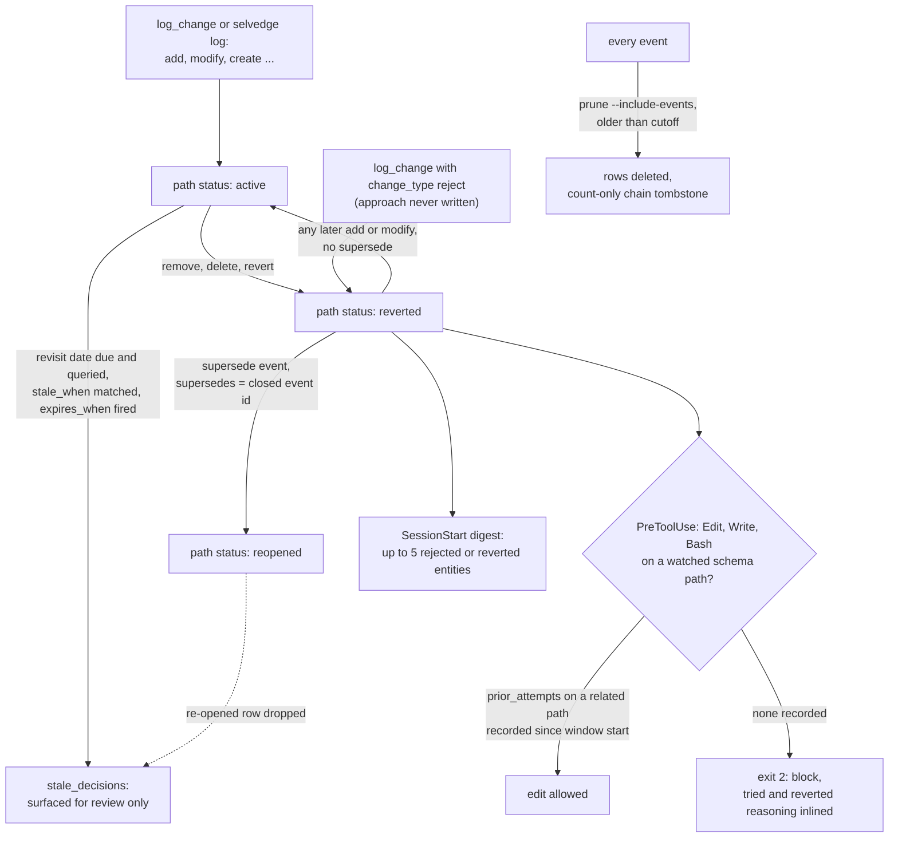

## 1. Executive Summary

Selvedge is a local decision memory for coding agents. An agent, or a person,
records a change event against a named code entity — a column, a function, a
route, a dependency — with the reasoning, the rejected alternative, and the
condition that would make the decision stale. A later session asks
`prior_attempts` before editing that entity and gets back what was tried,
what was reverted or rejected, and why. Storage is one SQLite file per project,
and no model is called on any write or read path.

What is notable is how the log handles being wrong. A rejection is its own
event type, a reversal of a rejection is a `supersede` event that links the
row it re-opens, and nothing is ever edited. Every write lands beside a
SHA-256 chain record in the same transaction, so a silent edit or deletion
fails `selvedge verify`. A Claude Code PreToolUse hook turns the "check before
editing" instruction into a block on schema and migration edits.

What is weak is that the verdict is only as durable as the last event. Status
is derived from whichever event on a path is newest, so a plain `modify`
logged after a `reject` makes the path `active` again with no supersede and no
warning. Scope is the database file. There is no way to delete one event, so a
secret pasted into reasoning — which the write path detects and stores anyway —
stays until an age-based prune removes everything older than it.

Two marks: `audit_log`, on the `event_chain` sidecar, and `negative_eval`, on
tests asserting a superseded decision drops out of the revisit surfaces while
an untargeted sibling stays. Section 9 names the five withheld.

## 2. Mental Model

A memory is a claim about why an entity is the way it is. It is written as one
`ChangeEvent` (`selvedge/models.py:59-133`) and becomes retrievable on commit.
There is no candidate state and no extraction: whoever writes it decides the
content, and the README says a saved explanation is *"an account supplied by a
person or agent"* that Selvedge does not verify.

**The state of a decision is computed, never stored.** `_derive_path_status`
reads the newest event on an entity path, exact or dotted prefix. A removal —
`remove`, `delete`, `index_remove`, `revert` or `reject` — means `reverted`; a
`supersede` means `reopened`; anything else means `active`
(`selvedge/storage.py:248-250`, `:318-340`). The docstring gives the reason:
the status *"can never drift from the events that imply it"*.

**A rejection is a record, not an absence.** `reject` exists for an approach
considered and never written. In `get_prior_attempts`, a reject that closes no
earlier attempt surfaces as its own row with `outcome="rejected"` and
`confidence="exact"`, so it clears the default confidence floor
(`storage.py:1650-1878`). The reasoning on that row is the memory.

**Re-opening is a new fact.** `log_supersede` writes a `supersede` event whose
`supersedes` column holds the id of the event it overrides. It auto-links to
the newest removal on the path when no id is given, and refuses when there is
nothing to re-open (`storage.py:775-873`). The overridden row is untouched, and
readers derive `superseded_by` from the link.

**What it cannot say.** Because the newest event wins, the store treats any
later attempt on a rejected path as the new standing state. The server
instructions say *"Never re-apply a reverted change without superseding it
first"* (`selvedge/server.py:92`, `:457`), and nothing on the write path
enforces it.

**How a memory dies.** Only by `selvedge prune --include-events`, which deletes
every event older than a cutoff after an interactive confirmation and with
`SELVEDGE_DESTRUCTIVE=1` in the environment (`selvedge/prune.py:172-237`).
`revisit_after`, `stale_when` and `expires_when` surface a decision for review;
none retires it.

## 3. Architecture

Selvedge is a Python package with three entry points: `selvedge-server`, a
FastMCP stdio server with eight tools (`selvedge/server.py`); the `selvedge`
CLI (`selvedge/cli.py`); and `selvedge-hook`, which the Claude Code plugin and
the per-client adapters call (`selvedge/hooks/`). All three open the same
`SelvedgeStorage` (`selvedge/storage.py:564`).

**One SQLite file holds everything.** `events` is the memory and `event_chain`
is the hash-chain sidecar (`selvedge/chain.py:94-104`). `tool_calls` is local
telemetry of every read and write call (`storage.py:71-80`), `path_migrations`
records path rewrites, and `embeddings` is created only by `selvedge index`
(`selvedge/semantic.py:68-74`). Connections use WAL, a 5-second busy timeout
and an application retry on lock errors (`storage.py:28-37`). Every write that
reads the chain head takes `BEGIN IMMEDIATE` first, so two processes cannot
fork the chain (`storage.py:587-617`).

**The database is found by walking up from the working directory.**
`SELVEDGE_DB` wins; otherwise the first `.selvedge/selvedge.db` that exists in
an ancestor directory; otherwise `~/.selvedge/selvedge.db`, with a one-time
stderr warning (`selvedge/config.py:92-113`).

Nothing runs in the background. The post-commit hook back-fills `git_commit`
on recent events, and semantic indexing runs on demand.

### Deployment and ergonomics

`uv tool install selvedge` then `selvedge setup`, which writes MCP config,
agent instructions and optional hooks for the clients it detects. The Claude
Code plugin fetches the package through `uvx` or `pipx` at a version pinned in
`bin/selvedge-resolve`. Nothing needs an API key or a network connection after
install; the optional semantic extra downloads a model2vec model on its first
`selvedge index`. The store is SQLite, readable with any client, and
`selvedge export --format markdown` writes a deterministic digest meant to be
committed beside it. Repairing a row by hand breaks `selvedge verify`, by
design.

## 4. Essential Implementation Paths

**Write.** `log_change` (`server.py:217-577`) records a telemetry row,
validates `rename_from` and `supersedes` against `change_type`, normalises
`revisit_after` and validates `expires_when` against a closed grammar. It then
runs `apply_event_limits`, byte caps on diff and reasoning plus a secret-shape
scan, all as warnings (`selvedge/validation.py:277-317`), and routes to
`log_rename` (two events), `log_supersede` or `log_event`. `log_event`
canonicalises the path and inserts the row and its chain record in one
immediate transaction (`storage.py:739-752`). The CLI's `selvedge log` and
`selvedge supersede` share the same storage calls.

**Import.** `selvedge import` reads SQL DDL and Alembic migrations
(`selvedge/importers.py`), git history for revert commits
(`selvedge/gitimport.py`, which stamps the commit date as `timestamp` at line
289), and Agent Trace v0.1.0 files with uuid5 ids. All go through
`log_event_batch`, one transaction per batch.

**Retrieval.** `get_prior_attempts` (`storage.py:1650-1878`) loads every event
on the path and its dotted children, pairs each attempt with the next removal,
labels the outcome and a confidence tier, adds standalone rejections, applies
the `min_confidence` floor and returns newest first. `get_decision_status`
(`:1880-1941`) returns the derived status and a templated status line.
`get_entity_history`, `get_blame`, `get_history`, `search` and `get_changeset`
are plain SQL (`:1301-1473`).

**Revisit surface.** `get_stale_decisions` (`:1972`) selects events carrying
any of the three revisit fields and drops ids a later supersede re-opened
(`:2150-2154`). It flags rows whose date passed with later read or changeset
activity, rows whose `stale_when` shares two or more tokens of four or more
letters with a later event among the 500 newest, and rows whose `expires_when`
fired.

**Context injection.** `build_digest` (`selvedge/hooks/sessionstart.py:51-134`)
emits up to five decisions due, up to five entities whose standing verdict is
rejected or reverted, and one line of recent changesets. It caps the result at
`digest_max_bytes` (default 4096) on a line boundary, or emits nothing.

**Gate.** `evaluate` (`selvedge/hooks/pretooluse.py:616-704`) matches touched
paths against watch globs (migrations, Alembic, schema, model and SQL files by
default), adds `table.column` tokens from the edit text, and blocks with exit 2
when any of those entities has status `reverted` and no `prior_attempts` call
on a related path is recorded since the session's window start.

**Delete.** `prune_events` (`storage.py:1110-1151`) counts chained casualties,
deletes by timestamp and appends a tombstone chain record, in one transaction.
`run_events_prune` re-checks `SELVEDGE_DESTRUCTIVE` itself.

## 5. Memory Data Model

| Field | Notes |
| --- | --- |
| `id`, `timestamp` | UUID4; canonical UTC with microseconds |
| `entity_path`, `entity_type` | path canonicalised on write; type coerced to `other` when unknown |
| `change_type` | closed enum of 13, including `reject`, `revert` and `supersede`; unknown values refused |
| `diff`, `reasoning` | free text, byte-capped with a visible truncation marker |
| `constraint`, `stale_when` | free text; `stale_when` is keyword-matched against later events |
| `revisit_after`, `expires_when` | ISO date or offset; closed grammar of `library:`, `entity:`, `date:`, `manual:` |
| `supersedes` | id of the event this one overrides; set only on `supersede` |
| `agent`, `session_id`, `project`, `changeset_id` | caller-supplied labels |
| `git_commit` | back-filled by the post-commit hook; outside the chain |
| `metadata` | JSON; carries `renamed_from` on rename pairs |

**Time is one column.** A live write stamps record time; the git importer
stamps commit time into the same `timestamp`. Validity is expressed as
conditions to review, not as an interval.

**Identity is the path.** History follows a rename through the
`rename`/`create` pair and `metadata.renamed_from`. `migrate-paths --apply`
rewrites stored paths after a canonicalisation change, writes a
`path_migrations` row and an `amend` chain record, and reports which distinct
paths it merged (`storage.py:1179-1273`).

**Attribution is self-reported.** `agent` and `session_id` are whatever the
caller passes, and `selvedge/ledger.py:1-5` says so in its header.

## 6. Retrieval Mechanics

Retrieval is lookup, not ranking. An entity query matches the canonical path
or any dotted child (`entity_path = ? OR entity_path LIKE 'p.%'`), backed by a
`NOCASE` index whose comment records the hook's p50 going from 68 ms to about
4.9 s at 890,000 events without it (`storage.py:103-116`). `search` and
`prior_attempts(description=...)` are escaped `LIKE` substring matches, with
the query truncated at 4,096 characters.

**The confidence tier is the only filter.** `prior_attempts` defaults to
`min_confidence="proximity_high"`. Attempts closed by an explicit `revert` or
`reject` (`exact`), and attempts closed by an implicit removal within seven
days, pass; open attempts and slow removals are dropped. The tool description
calls an empty list *"the normal, preferred answer"*.

**Fuzzy recall is optional and approximate.** With the semantic extra and a
built index, `fuzzy_events` takes the dot product of a model2vec query vector
with every stored vector, keeps those at or above 0.35, caps at `limit`, and
only then joins `events` (`semantic.py:231-300`). A vector whose event was
pruned still takes a slot and is then skipped.

**Injection is bounded and push-based.** The digest is the only automatic
injection: at most ten entries and a changeset line under 4,096 bytes by
default, and silent when there is nothing due, reverted or recent. It names
rejected entities by path and reasoning and tells the agent to call
`prior_attempts`.

## 7. Write Mechanics

Writes are explicit tool or CLI calls; nothing is extracted from transcripts.
The PreCompact hook names watched entities the session edited without logging
them and asks the agent to log them before compaction
(`selvedge/hooks/precompact.py:42-104`). It never blocks compaction.

**Validation warns.** Reasoning quality, entity-path shape, a missing revisit
date on an architectural change, a missing invalidation condition on a reject,
truncation and a secret shape all come back as `warnings` on a stored event.
The secret module states the trade-off: a false positive that blocked a write
would lose the reasoning, so it warns and stores (`selvedge/redaction.py:9-27`).

**Nothing is updated in place** except `git_commit`, which the post-commit
hook sets on every event from the last 60 minutes that has none
(`storage.py:948-972`), and `entity_path` under `migrate-paths --apply`.

**Conflict is not detected.** A second agent logging `modify` on a path a first
agent rejected becomes the path's status. Nothing compares the new event with
the standing verdict.

### Operational cost

- Write: synchronous, one immediate SQLite transaction, no model call. A
  memory is retrievable as soon as `log_change` returns.
- Background: none. Semantic indexing is a manual, incremental pass over
  events with non-empty reasoning.
- Read: the digest is at most 4,096 bytes once per session start. The gate
  runs a Python process per watched tool call and returns before importing
  storage when no watched path is touched.

## 8. Agent Integration

Eight MCP tools: `log_change`, `prior_attempts`, `blame`, `diff`, `history`,
`changeset`, `search` and `stale_decisions` (`server.py`). The agent holds the
write verb, the supersede verb as a `log_change` change type, and every read.
`selvedge prompt --install` writes a sentinel-bracketed instruction block into
`CLAUDE.md`, `AGENTS.md`, Cursor rules or `GEMINI.md`.

The Claude Code plugin (`.claude-plugin/`, `hooks/hooks.json`, `.mcp.json`)
registers the MCP server and three hooks. `selvedge/hooks/adapters.py`
translates Codex, Cursor, Copilot, Gemini and Windsurf hook payloads to the
same checks. Its header says compaction notices become user messages where a
client cannot inject model context at that event.

The `actions/review-context` GitHub Action renders the recorded trail for files
a pull request touches, from the base commit's database. It refuses a database
whose bytes differ from the base or that has WAL sidecars
(`docs/review-context.md`).

## 9. Reliability, Safety, and Trust

**The chain makes tampering visible, and says what it does not prove.** The
protected core is 17 columns, every `events` column except `git_commit`. Each
record binds its sequence number, its predecessor and a canonical-JSON digest.
The module header states the threat model: it catches a stray `UPDATE`, a buggy
path or a silent deletion, and is *"not proof against a motivated local
attacker"*, because there is no key (`chain.py:41-46`). Rows from before the
chain existed are reported as unchained, not invalid.

**The gate errs open, and its session check is not per session.**
`tool_calls` has no session column (`storage.py:71-80`). `_queried_this_session`
asks whether any `prior_attempts` call on a related path was recorded since the
window start, which is the session's first gated call minus 30 minutes
(`pretooluse.py:459-572`). A query by another agent, or by the same agent in an
earlier session inside that window, unblocks the edit. The docstring calls the
slack permissive by construction, and every error path allows.

**Deletion is all or nothing by age.** No surface deletes one event. A secret
the write path detected is stored, the store is designed to be committed, and
removing it means an age prune of everything older or a raw SQL delete that
fails `verify`. The embedding of that reasoning survives a prune: no code path
deletes from `embeddings`, and the comment at `semantic.py:295` reads *"no
delete path yet"*.

**Scope leaks at the fallback.** Outside a project directory with a database,
every client writes to `~/.selvedge/selvedge.db`. Only `history`,
`stale_decisions` and the changeset listing can filter on `project`, and only
when asked; the gate and the digest read the whole file.

Capability marks:

- `audit_log` — awarded. `event_chain` is an append-only record of every
  mutation the code performs on `events` except the `git_commit` back-fill,
  written in the mutating transaction. `path_migrations` adds the per-row
  rewrite list for path changes.
- `negative_eval` — awarded; section 10.
- `tombstone` — withheld. A `reject` records a rejected approach keyed on the
  entity path, not on the approach, and any later non-removal event on the path
  overrides it without a supersede. The prune "tombstone" is a deletion count.
- `trust_state` — withheld. `active`, `reverted` and `reopened` are derived
  from the newest event and describe whether a change stands, not whether a
  record is believed. The re-open filter in `get_stale_decisions` reads the
  `supersedes` link, not a status column.
- `bitemporal` — withheld. One `timestamp`, which the git importer sets to
  commit time.
- `scope_enforced` — withheld. `project` is on the row and filtered on three
  read paths only when the caller passes it; the recall paths ignore it. The
  boundary is the database file.
- `human_review` — withheld. No memory waits for anyone. The PR Action and
  `selvedge ledger` display, and `manual:` expiry labels surface a row without
  holding it.

## 10. Tests, Evals, and Benchmarks

I read the tests and committed results at the pin; nothing was installed or
run. CI runs `pytest` on Python 3.10 to 3.14 (`.github/workflows/test.yml:69`),
and `tests/conftest.py` points `SELVEDGE_DB` at a temporary file for every
test. The one skip marker is for Node-dependent plugin tests.

**The negative cases.** `tests/test_stale_supersede.py` builds a store with two
rejections on one path, supersedes one, and asserts the re-opened one is absent
from `get_stale_decisions` and from the digest's revisit section while the
other is present. It does so once with an explicit id (`:97-122`) and once
through the id-less auto-link with an untargeted sibling (`:125-171`). The
positive sits in the same assertion set each time, so an empty result fails.

**Tamper evidence.** `tests/test_tamper_evidence.py` covers a silent row
deletion (`:396-408`), a re-pointed `entity_path`, an edited chain table, a
consistently re-chained record, and a gated prune whose tombstone still
verifies (`:596-619`).

**Supersede semantics.** `tests/test_supersede.py` asserts a supersede never
mutates history (`:236`). `tests/test_prior_attempts.py:129` pins that an
id-less supersede re-opens at most the single newest removal.

**The pilot.** `bench/decision_memory/` runs Claude Code against four synthetic
configuration tasks under frozen schedules. The 1 October 2026 run's
`results.jsonl` recomputes to its headline: still-valid rejected options were
chosen in 4 of 6 eligible no-memory trials and 0 of 6 with injected
`prior_attempts` output, in 24 trials. The 25 September run's 48 rows
recompute to 12/12 correct for Selvedge, a decision file and inline facts, and
8/12 with no memory. In that run Selvedge was queried before the first edit in
9 of 12 pull trials. The bench README states the fixtures are author-written
and too small for a general claim.

**Not covered.** No test was found asserting that a `modify` after a `reject`
raises any warning, or that the gate distinguishes sessions. No paper or
citation block for Selvedge itself is in the tree; the arXiv identifiers in
`docs/` and the hook docstrings cite other work.

## 11. For Your Own Build

### Steal

- **Make "considered and rejected" a write.** An approach nobody implemented
  leaves no diff; a `reject` event with the reason and the invalidating
  condition is the only way the next session finds it.
- **Re-open by link, never by edit.** A `supersedes` id on a new event keeps
  the old verdict readable and lets every reader derive the current one.
- **Put the hash chain in a sidecar written in the same transaction.** Give
  legitimate rewrites an `amend` record and deletions a counted tombstone, and
  declare in the manifest what the chain does not cover.
- **Gate the expensive repeat, not every edit.** Blocking only watched paths
  whose verdict is reverted, with the old reasoning in the block message, keeps
  the false-block rate near zero.
- **Publish every trial, including the arm that tied.**

### Avoid

- **Deriving a verdict from "newest event wins" without guarding the write.**
  The protection a rejection gives is erased by the next ordinary write on the
  same key; refuse or warn on a non-supersede write to a reverted path.
- **Keying an enforcement check on telemetry that cannot tell callers apart.**
  "Queried this session" needs the session on the row it reads.
- **A derived index with no delete path.** Every table that copies memory
  content belongs in the deletion, or a prune leaves the text's embedding
  behind.

### Fit

This suits a team or a single developer who wants the reasons behind schema
and dependency choices to outlive the session, and who runs a coding agent that
can be told to log them. It assumes the agent cooperates: capture is explicit,
attribution is a label, and the reasoning is not checked. It does not suit
anyone who needs memories found by meaning across a large store, isolated per
tenant in one file, or individually erasable. The design gives up the third
deliberately to keep the log append-only.

## 12. Open Questions

- Does `SELVEDGE_HOOK_DISABLE=1`, which the block message suggests, reach the
  hook process when set from an agent's shell tool, or only from the harness
  environment?
- How often do agents log a plain `modify` on a rejected path in practice,
  given the instruction to supersede first?
- Does `_derive_path_status` over a prefix timeline give the intended status
  for a table whose columns carry different verdicts? It reads the newest event
  among all children; this was read, not reproduced.
- How large do real stores grow before the 500-event `stale_when` window misses
  the evidence a decision names?

## Appendix: File Index

- **Model and schema:** `selvedge/models.py`, `selvedge/storage.py:42-133`,
  `selvedge/migrations.py`, `selvedge/chain.py`.
- **Write:** `selvedge/server.py:217-577`, `selvedge/storage.py:739-946`,
  `selvedge/validation.py`, `selvedge/redaction.py`, `selvedge/importers.py`,
  `selvedge/gitimport.py`.
- **Read:** `selvedge/storage.py:1301-1941`, `:1972-2280`,
  `selvedge/presenters.py`, `selvedge/semantic.py`, `selvedge/ledger.py`.
- **Context and enforcement:** `selvedge/hooks/sessionstart.py`,
  `selvedge/hooks/pretooluse.py`, `selvedge/hooks/precompact.py`,
  `selvedge/hooks/adapters.py`, `hooks/hooks.json`.
- **Deletion and integrity:** `selvedge/prune.py`,
  `selvedge/storage.py:1110-1273`, `selvedge/verify.py`.
- **Tests and evals:** `tests/test_stale_supersede.py`,
  `tests/test_supersede.py`, `tests/test_tamper_evidence.py`,
  `tests/test_hook.py`, `tests/test_prior_attempts.py`,
  `bench/decision_memory/`.

### Recorded searches

Checked against the checkout at the pinned revision.

- `rg -n -i 'UPDATE events|DELETE FROM events|DELETE FROM event_chain|UPDATE event_chain|INSERT (OR REPLACE )?INTO events' --type py` — outside tests, only `storage.py:730` (insert), `:969` (git_commit back-fill), `:1147` (prune) and `:1235` (path rewrite).
- `rg -n 'embeddings' --type py -g '!tests/**'` and `rg -n 'DELETE FROM embeddings' .` — the table is written only in `semantic.py`; no delete anywhere.
- `rg -n -i 'def (forget|delete_event|redact_event|erase)' selvedge/` — no match; `rg -n '@cli\.command' selvedge/cli.py` lists no per-event delete command.
- `rg -n 'project' selvedge/storage.py` — `project = ?` predicates only in `get_history`, `list_changesets`, `get_stale_decisions` and `summarize`, each behind `if project:`.
- `sed -n 71,80p selvedge/storage.py` — `tool_calls` columns are id, timestamp, tool_name, entity_path, success, error_msg and agent; no session.
- `rg -n -i 'valid_from|valid_to|valid_at|recorded_at|observed_at|event_time|effective' selvedge/` — no validity-time column.
- `grep -rliE 'arxiv|bibtex|@article|@misc|doi\.org' . --exclude-dir=.git` — `CHANGELOG.md`, two hook files and four `docs/` pages, all citing third-party papers; no `CITATION.cff`.
- `rg -n -E 'pytest.mark.skip|skipif|importorskip' tests` — one, `test_plugin.py:474`, for Node.

## History

**2026-10-03** — [`10458144769b5f583785208594432591a6850a6c`](https://github.com/masondelan/selvedge/commit/10458144769b5f583785208594432591a6850a6c) — first reading, at the head of `main`, a commit dated 3 October 2026. Two marks, `audit_log` and `negative_eval`. Screened before reading: five auto-run surfaces (`.claude-plugin/`, `.mcp.json`, `hooks/`, `hooks/hooks.json`, a `server.json` launching through `uvx`), two build-time execution points (`selvedge/setup.py`, `tests/conftest.py`), two dependency files inside the cooldown — every file in a depth-1 clone dates to the tip — one unpinned surface (`pyproject.toml` with no lockfile), and `CLAUDE.md` recorded as data. The committed dogfood database was opened read-only. Nothing was installed, built or run.
