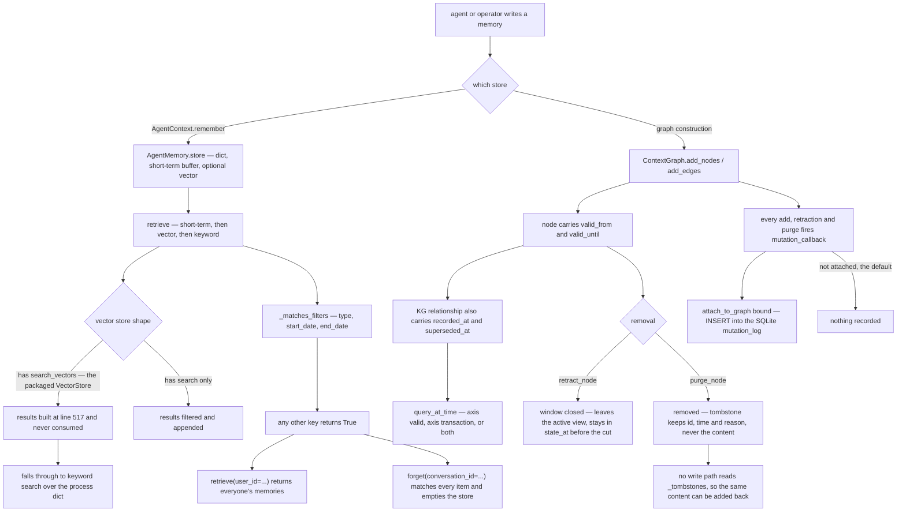

## 1. Executive Summary

Semantica is a graph-native context platform: ingest enterprise data, extract entities, build a context graph and a knowledge graph, reason over them deterministically, and keep decision provenance as a by-product of the structure. MIT, about 201,000 lines of Python across 377 modules in the package plus an MCP server, a React Explorer, 391 test files holding roughly 7,060 test functions, and a CHANGELOG running back to June 2025. No paper: `CITATION.cff` cites the software at v0.7.0 and nothing in the README or the docs points at an arXiv id or a DOI (`grep -rn -i "arxiv\|doi" README.md CITATION.cff` returns nothing).

**Two memory stores sit under one façade and only one of them is governed.** The `ContextGraph` has a temporal model worked out to a depth few systems here reach: `valid_from`/`valid_until` on every node and edge, `recorded_at`/`superseded_at` on knowledge-graph relationships, a query that takes either axis or both, retraction that closes a window rather than deleting, purge that removes the content and leaves a tombstone recording that a purge happened *without* the purged content, and a mutation callback that an attached version manager writes into an append-only SQLite log. Beside it, `AgentMemory` is a process dict with a JSON save file, and its filter predicate recognises three keys.

**That predicate is where the design fails, and it fails twice in the same function.** `AgentContext.forget` builds a filter dict from `memory_id`, `conversation_id`, `user_id` and `days_old` and passes it to `clear_memory`, which asks `_matches_filters` about each item. `_matches_filters` checks `type`, `start_date` and `end_date` and returns `True` for everything else (`semantica/context/agent_memory.py:995-1028`). So `forget(conversation_id="conv1")` — the second example in the method's own docstring — matches every item in the store and deletes all of them; `forget(user_id=...)` does the same. One commit before this pin, the maintainers fixed the third arm: `days_old` had mapped to `start_date`, so it deleted memories *newer* than the cutoff, and the regression file that landed with the fix tests `days_old` three ways and the other two arms not at all.

**The long-term retrieval arm is dead for the configuration the package ships.** `AgentMemory.retrieve` branches on the vector store's shape: `search_vectors` first, then `search`. The `search_vectors` branch builds result objects at `agent_memory.py:517` — and the loop that filters them and appends them to `results` sits inside the `elif` (`:524`, one indent level in from `:519`), so the first branch's work is discarded. `semantica.vector_store.VectorStore` defines both methods (`:740` and `:758`), so it takes the dead branch, `results` stays empty, and retrieval falls through to `_keyword_search` — word overlap over the in-process items.

**What is genuinely worth reading here is the vocabulary of removal.** Most systems in this atlas have one delete. This one has four, distinguished in code and in docstrings: close the window (`retract_node`), remove the data and keep a content-free receipt (`purge_node`), drive that across every store that holds a copy and return a record of which ones were reached (`ErasureCoordinator`), and supersede a fact retroactively while keeping the prior version queryable on the record-time axis (`apply_revision`). The purge docstring is unusually honest about its own limit: *"this is one step of an erasure workflow, not the whole of it,"* and callers *"should not treat a `True` here as proof the content is gone."*

## 2. Mental Model

A memory in the context graph is **an assertion with a lifetime**, and the design's central idea is that a lifetime has two axes. `valid_from`/`valid_until` say when the assertion was true of the world. `recorded_at`/`superseded_at` say when this store held it. `BiTemporalFact` (`semantica/kg/temporal_model.py:27-66`) carries all four, and `TemporalGraphQuery` turns the pair you name into the bounds it tests: `axis='valid'` for the first, `axis='transaction'` for the second, `time_axis='both'` to require both (`temporal_query.py:748-812`).

**Retraction is a temporal act, not a deletion, and the docstring draws the line the rubric cares about.** `retract_node` closes `valid_until` and records a retraction with a reason; the node stays in `has_node`, stays in `stats`, stays in `state_at` for any time before the cut, and leaves the active view. Its cascade is reasoned about rather than assumed: leaving edges active around an inactive node *"means `find_active_nodes` drops the node while its relationships still read as current."*

**Purge is the other act, and its tombstone is deliberately content-free.** `self._tombstones[("node", target)]` holds the entity id, the kind, `purged_at` and a reason — *"deliberately without the purged content, since retaining it would defeat the point."* That is correct for erasure and it is exactly why it is not a rejected-value tombstone: `grep -n "_tombstones" semantica/context/context_graph.py` returns eleven lines, and every one of them is a write, a clear, or one of the two accessors `get_tombstone`/`list_tombstones`. No write path consults it, so re-adding the purged content is not refused. Edge ids make the near-miss sharp, because `_default_edge_id` derives them from source, target, type, weight and metadata — the key is already the value, and one lookup in `add_edges` would close the gap.

**Belief is not a state anywhere in this system.** Conflicts are detected across five types and resolved by a strategy — voting, credibility-weighted, most-recent, first-seen, highest-confidence, or a flag for manual review — and the output is a `ResolutionResult` with `resolved: bool` and a confidence float. Nothing writes a status onto the stored fact, so the store cannot express "on record, not believed".



## 3. Architecture

One installable package with twenty-six subpackages, and nothing that has to be running for the core to work: graph construction, reasoning and provenance are deterministic, and `semantica.llms` is optional and vendor-neutral. What an operator actually stands up depends on how much of the platform they want.

The minimum is a Python process: `AgentContext` builds an `AgentMemory`, a `ContextGraph` and a `VectorStore` and holds them in memory, persisting on demand — `agent_memory.json`, a graph JSON or Markdown directory. Add a backend and the same interfaces move onto Neo4j, FalkorDB, AGE or Neptune for property graphs; Jena, RDF4J, Oxigraph, Blazegraph or Anzo for triples; FAISS, sqlite-vec, pgvector, Qdrant, Milvus, Pinecone or Weaviate for vectors. The audit trail needs one more deliberate step: a `TemporalVersionManager` constructed with a `storage_path` (without one it is in-memory) and attached to the graph.

Three access surfaces sit on top. A 22-group CLI shipped with the package. A FastAPI **Explorer** with routes for graph, memories, decisions, provenance, temporal, annotations, ontology, vocabulary, SPARQL, enrichment, export/import and Markdown resources, behind a React workspace UI. And a JSON-RPC **MCP server** (`semantica_mcp/`) exposing graph, retrieval, extraction, reasoning, decision and export tools, which is how an agent reaches any of this.

## 4. Essential Implementation Paths

**Write a memory** — `AgentMemory.store` (`agent_memory.py:323-451`): generate or accept an id, stamp an aware UTC timestamp (with a comment recording the bug that made that mandatory — a naive local stamp on a UTC+8 host pushed fresh memories eight hours outside every date window), append to the short-term buffer and prune it by count and token budget, embed and index if a vector store is bound, put the item in the dict and the id in a bounded deque, push entities into the knowledge graph, update statistics, apply retention.

**Read a memory** — `AgentMemory.retrieve` (`:456-575`): keyword-match the short-term buffer, then the vector branch described above, then `_keyword_search` if nothing has been collected, then sort by score and cut at `min_score` and `max_results`.

**Retract** — `ContextGraph.retract_node` (`context_graph.py:2680-2784`): under the graph lock, close `valid_until` with `_closing_valid_until` (which never widens an existing bound), write a retraction record, and cascade to incident edges — snapshotting the already-retracted edge ids before the loop, because `edge_id` is content-derived and not guaranteed unique, so reading the live dict inside the loop would let one duplicate block the other from ever being closed.

**Erase** — `ErasureCoordinator` (`context/erasure.py`): drives `purge_node` plus deletion in the memory store and the bound vector store, and returns a receipt recording which stores it reached.

**Correct retroactively** — `TemporalVersionManager.apply_revision` (`kg/temporal_query.py:1397-1465`): stamp the superseded fact's `superseded_at` with the revision time and keep it, insert a replacement with the new validity window, its own `recorded_at`, an id suffixed with a collision-resistant revision token and a provenance entry naming its role, and warn when the new window overlaps a sibling.

**Audit** — `TemporalVersionManager.attach_to_graph` (`change_management/managers.py:414-451`) binds `mutation_callback`; every `ADD_NODE`, `UPDATE_NODE`, `REMOVE_NODE` and the edge equivalents then INSERT a row into `mutation_log` with the full payload.

## 5. Memory Data Model

`MemoryItem` is content, timestamp, a free-form metadata dict, extracted entities and relationships, an optional embedding and an id. Embeddings are explicitly not persisted (`to_dict` drops them, `from_dict` sets them to `None`, "regenerate on demand"), and `load` refuses a legacy `.pkl` file rather than unpickling it — a deliberate, commented refusal.

`ContextNode` is id, type, content, metadata, properties and the two validity bounds. `ContextEdge` adds `edge_id` and `family_id`, both resolved by `_resolve_edge_identity` from the edge's own content when not supplied, so an identical edge re-added produces the same id — and a revision produces a new `edge_id` under the same `family_id`, which is how a corrected edge stays linked to what it replaced.

Knowledge-graph relationships are plain dicts, and the bitemporal wrapper says so in a design note: facts *"continue to live as plain relationship dicts in the graph,"* and `BiTemporalFact` exists only to normalise them so existing callers can keep reading `valid_from`/`valid_until` directly. That is the honest version of a backward-compatible migration, and it has a consequence worth naming: `recorded_at` defaults to `valid_from` when absent, so a fact written without a record time answers a transaction-axis query using its validity time. There is a committed test for exactly that fallback.

## 6. Retrieval Mechanics

`ContextRetriever` is the designed path: a vector arm and a BFS graph-expansion arm to a configurable hop limit, combined under `hybrid_alpha` (0 for vector only, 1 for graph only), with a content-hash dedup on non-graph results, a boost of up to 20% for graph results carrying more related entities, and another 20% for a result found by both arms.

`AgentMemory.retrieve` is the path an agent hits through `AgentContext`, and it has three arms of which one is broken. The short-term arm is a keyword match over the last few items. The long-term vector arm is the dead branch. The fallback is `_keyword_search` over word overlap. `min_score` defaults to `0.0`, so nothing is excluded by score unless a caller asks.

Filtering is where the two halves diverge most. The context graph's active view applies the temporal window on every read, and `find_active_nodes`, `state_at` and `ContextNode.is_active` all agree about it. `AgentMemory`'s filter recognises `type`, `start_date` and `end_date`. A `user_id` passed to `retrieve` is neither applied nor refused — the scope key is stored on the item and consulted only by `get_by_user`, which walks the dict itself.

## 7. Write Mechanics

Nothing is deferred. `store()` returns after the item is in the dict, in the buffer, in the vector index and in the graph, so a memory is retrievable immediately and the caller pays the embedding latency inline. There is no extraction model on the write path — entities and relationships are supplied by the caller or produced by a deterministic extraction stage beforehand — and no background consolidation rewrites the store.

The one thing that runs on every write is the retention policy, and it is applied *after* the insert (`:436`), which is why the `forget` regression test has to construct its context with `retention_days=None` to keep a deliberately aged fixture from being deleted on arrival.

The context graph's writes go through `add_nodes`/`add_edges` under a lock, with the mutation callback fired per entity when one is attached, and `_suspend_mutation_callback` guarding restores so that loading a saved graph does not replay as a stream of new mutations.

## 8. Agent Integration

The MCP server is the agent-facing surface: `semantica_mcp/mcp/tools/` holds graph, retrieval, extraction, reasoning, decision and export tool modules, dispatched by a JSON-RPC `tools/call` handler. `handle_retrieve_context`, `handle_store_document`, `handle_update_document` and `handle_remove_document` are the memory-shaped four; documents are chunked, id'd by a hash of source, version, index and text, and upserted with the previous version's rows removed by matching source and version.

`integrations/` carries adapters for Agno and CrewAI among others, each with its own test directory. The Explorer is for people rather than agents, and the Memory workspace there is the only place a stored memory can be edited by hand.

## 9. Reliability, Safety, and Trust

**The concurrency discipline is careful and the comments explain themselves.** Every `AgentMemory` state mutation runs under `_with_memory_lock`; the graph takes its own lock and snapshots payloads inside it, *"not read back after the lock is released: a concurrent `clear()` would otherwise wipe the record out from under the emission below."* `_snapshot_memory_state`/`_restore_memory_state` give the Markdown apply path a rollback.

**Provenance is the product.** Per-source credibility tracking, conflict detection across value, type, relationship, temporal and logical conflicts, decision records with causal chains and policy checks, a provenance manager with integrity verification, and an RDF exporter that emits both time axes. A regulated-domain reader will find more here than in almost anything else in this atlas.

**And the epistemic layer stops short of the store.** `_flag_for_manual_review` returns a `ResolutionResult` with `metadata={"requires_manual_review": True}`; `grep -rn "requires_manual_review"` finds the producer, one assertion in `tests/conflicts/test_conflicts.py:310`, and nothing else. The flag is returned to whoever called the resolver and is never persisted, queued or surfaced — the review workflow the module's docstring advertises is the caller's to build.

**The Explorer's route handlers are defensive in one direction only.** `temporal_patterns` catches `ImportError` and returns an empty list, catches every other exception and turns it into a 500 with the detail withheld. Broad, but it fails closed.

**The security posture around persistence is good.** Pickle loading is refused with a stated reason; YAML is parsed through a `SafeLoader` subclass that rejects duplicate keys rather than silently taking the last; SPARQL and Cypher have dedicated escaping and sanitising modules; Markdown writes are staged before rename.

## 10. Tests, Evals, and Benchmarks

**I did not run this suite.** Three dependency surfaces changed the day of the pin — inside the seven-day cooldown this atlas applies before installing anything — and four `conftest.py` files execute at pytest collection. Everything below is read from the committed code, and the one behavioural claim I verified was verified offline: I transcribed `_matches_filters` and `forget`'s filter-dict build into a scratch script and ran it over a three-item fixture, which deletes all three for both `forget(conversation_id=...)` and `forget(user_id=...)`.

391 test files, about 7,060 test functions, roughly 133,000 lines — larger than most implementations in this atlas. The context directory alone has 38 files, and the ones that pin the mechanisms above are worth naming: `test_context_graph_retraction.py` (retraction, purge, cascade, index integrity, the audit emission), `test_erasure_coordinator.py` (cross-store erasure receipts), `test_temporal_versioning.py` (revision, checksums, collision-resistant suffixes), `tests/kg/test_kg.py` (both time axes), `test_agent_memory_markdown.py` and `test_context_graph_markdown.py` (the revision-checked edit path).

The negative assertions are written the way this atlas asks for: `test_retracted_node_leaves_the_active_view` pairs `assertNotIn("alice", active)` with `assertIn("bob", active)` over the same populated graph, and `test_history_before_the_retraction_is_preserved` pairs presence before the cut with absence after it. Neither can pass over an empty result.

**Two coverage gaps are load-bearing.** No test passes a scope filter to `AgentMemory.retrieve` and asserts that another user's memories stay out — the assertion that would have caught the ignored filter key. And `test_agent_context_forget.py`, added with the fix one commit before this pin, tests `days_old` three ways and neither of the other two filter arms of the same function.

**The performance table is qualified in the README itself**, which is rarer than it should be: the 6,000× node-search figure is stated as a v0.5.0 measurement on a 118,000-node graph with the hardware named, and the deduplication figures are labelled *"historical measurements recorded in CHANGELOG.md rather than an automated `tests/` assertion,"* with a pointer to `tests/vector_store/test_performance_benchmarks.py` — which exists — for measuring your own. No result artifact is committed, so none of the numbers can be recomputed from this tree.

## 11. Patterns Worth Stealing

### Steal

**Separate retraction from erasure, and give each its own record.** Closing a validity window and destroying data are different operations with different audiences — one keeps a decision explainable, the other answers a legal request — and most systems in this atlas collapse them into one `deleted` flag. The purge tombstone that omits the content on purpose is the detail that shows the distinction was thought through rather than named.

**Return a receipt saying which stores an erasure actually reached.** `ErasureCoordinator` exists because a `True` from a single store is not proof, and the purge docstring says so to the caller who might otherwise believe it.

**Carry both time axes and let the query pick.** Four timestamps and one `time_axis` parameter answer "what was true then" and "what did we believe then" separately, which is the whole argument for bitemporality, and the fallback — record time defaults to validity time when absent — is tested rather than assumed.

**Derive an edge id from the edge's content, and keep a `family_id` across revisions.** Identity that survives a correction is what makes a supersession chain navigable, and it comes almost for free.

### Avoid

**Do not write a filter predicate that returns True for keys it does not know.** Every failure in this report's risk section is that one line. A predicate that raised on an unrecognised key would have turned three silent data-loss paths into three loud errors, and the cost is a `set` difference.

**Do not branch retrieval on `hasattr` across two method names.** The dispatch picked the branch whose consumption loop was indented into its sibling, and nothing failed — recall just got quietly worse, which is the hardest kind of regression to notice from outside.

**Do not ship a review flag with no queue behind it.** `requires_manual_review` in a returned dict is a suggestion to the caller; the module's own documentation calls it a workflow.

### Fit

Take this seriously if you are building **an auditable knowledge graph for a regulated domain** and memory is one consumer of it among several. The temporal model, the erasure vocabulary and the provenance machinery are the most complete treatment of "why does the system believe this" in this part of the atlas, and the deterministic-by-default stance means the graph does not change shape because a model was in a different mood.

Do not take it as a **drop-in agent memory**. The `AgentMemory` half is the least finished part of a large codebase: its long-term arm does not run in the packaged configuration, its filters silently ignore the scope keys it stores, and the deletion API deletes more than it is asked to. A team that wants Semantica's graph and its own memory layer can have exactly that — the two are separable, and the seam is `AgentContext`.

## 12. Antipatterns / Risks

**`forget(conversation_id=...)` and `forget(user_id=...)` empty the store.** Both appear in the method's docstring as examples. The filter dict is built correctly and the predicate that receives it recognises neither key.

**A scope key that is stored, documented, and not applied on the retrieval path.** `retrieve(query, user_id="alice")` returns every user's memories. Nothing raises, nothing logs.

**The packaged vector store takes a code path that discards its own results.** Silent recall degradation: retrieval still returns something, from a keyword fallback, so the symptom is worse answers rather than an error.

**The audit trail is off unless the adopter wires it, and in-memory unless they pass a path.** Nothing under `semantica/` calls `attach_to_graph`; the mechanism is real, the default is no record.

**A tombstone nothing consults.** Purge records what was removed and when, and the write paths never look at it, so the same content can be re-added immediately. The near-miss is one lookup wide for edges, whose ids are already content-derived.

**Surface area versus depth.** 201,000 lines across twenty-six subpackages, with seven vector backends, four graph backends and five triple stores. The parts this report examined closely divide sharply into carefully-reasoned and not-yet-finished, and there is no way to tell which is which from the module list.

## 13. Build-vs-Borrow Takeaways

**Borrow the temporal model.** Four fields and an axis parameter, portable to any store, and the semantics are already worked out including the awkward cases — retraction that never widens a window, a revision that keeps the superseded version queryable, a record-time fallback for facts written before the axis existed.

**Borrow the erasure vocabulary, not necessarily the code.** Retract, purge, receipt. Three words that make a correction policy expressible; most memory systems in this atlas cannot say the second without losing the first.

**Build your own memory item store, or bring one.** The graph is the reason to be here.

**If you adopt as is, pin the three fixes first**: make `_matches_filters` reject unknown keys, move the result-consumption loop out of the `elif`, and call `attach_to_graph` with a `storage_path` at startup. All three are small, and the first one is the difference between a scoped delete and an empty store.

## 14. Open Questions

- Was the `search_vectors` branch ever exercised in a deployment? Its result objects carry `.id`, `.score` and `.metadata` — exactly what the consumption loop wants — which suggests the loop was moved rather than never written.
- `_matches_filters` is the predicate behind `retrieve`, `clear_memory`, `count` and `list`. Whether the intended contract is "unknown keys are ignored" or "unknown keys narrow" changes what half the public API means, and the code does not say.
- `attach_to_graph` is the audit trail's only entry point and no caller under `semantica/` uses it. Whether the Explorer, the CLI or the MCP server is expected to wire it is not documented in the tree.
- The 118,000-node production graph behind the performance table is not in this repository, and no result artifact is committed, so the figures are unverifiable from the source.

## 15. Appendix: File Index

**Memory**
- `semantica/context/agent_memory.py` — `MemoryItem`, `AgentMemory`: `store` (:323), `retrieve` (:456), `_matches_filters` (:995), `clear_memory` (:680), `get_by_user` (:1478), the Markdown export/apply pair (:1674-1755)
- `semantica/context/agent_context.py` — the façade; `forget` (:654)
- `semantica/context/context_graph.py` — `ContextNode`/`ContextEdge` (:419, :462), `retract_node` (:2680), `purge_node` (:2842), `get_tombstone` (:3023), `_emit_mutation` (:3166)
- `semantica/context/erasure.py` — cross-store erasure with receipts
- `semantica/context/context_retriever.py` — hybrid vector plus graph expansion

**Temporal and audit**
- `semantica/kg/temporal_model.py` — `BiTemporalFact` (:27)
- `semantica/kg/temporal_query.py` — `_get_axis_bounds` (:748), `apply_revision` (:1397)
- `semantica/change_management/managers.py` — `attach_to_graph`, `record_mutation` (:414-451)
- `semantica/change_management/version_storage.py` — `mutation_log` schema (:317), `save_mutation` (:508)

**Surfaces**
- `semantica/explorer/routes/` — `memories.py`, `markdown.py`, `temporal.py`, `provenance.py`, `decisions.py`, and nine more
- `explorer/src/workspaces/MemoryWorkspace.tsx`, `GraphWorkspace/useMarkdownEditor.ts`
- `semantica_mcp/mcp/tools/` — graph, retrieval, extraction, reasoning, decisions, export

**Tests cited**
- `tests/context/test_context_graph_retraction.py`, `test_erasure_coordinator.py`, `test_agent_context_forget.py`, `test_agent_memory_markdown.py`
- `tests/kg/test_kg.py`, `tests/change_management/test_temporal_versioning.py`, `test_audit_trail.py`, `tests/conflicts/test_conflicts.py`

**Commands this reading used**
```sh
python3 scripts/screen_repo.py <checkout>
grep -n "_tombstones" semantica/context/context_graph.py        # writes, clears, two accessors
grep -rn "requires_manual_review" --include="*.py" .            # producer plus one test assertion
grep -rn "attach_to_graph" --include="*.py" .                   # tests only, nothing under semantica/
grep -rn "mutation_log" --include="*.py" .                      # one INSERT, one label-backfill UPDATE
grep -rn -i "arxiv\|doi" README.md CITATION.cff                 # no paper
awk 'NR>=494 && NR<=556 {match($0,/[^ ]/); ...}' semantica/context/agent_memory.py  # branch indentation
```

## History

**2026-09-12** — [`7057387775ecdf74c14e38d0067fd8e1267eaaf8`](https://github.com/semantica-agi/semantica/commit/7057387775ecdf74c14e38d0067fd8e1267eaaf8) — first reading, at the default branch's head on the day it was read. Screened before reading: no auto-run surface; four `conftest.py` files that execute at pytest collection; three dependency surfaces changed the same day, inside the seven-day cooldown; and two unpinned surfaces, `pyproject.toml` with no lockfile beside it and an Explorer `package.json` with forty floating ranges above a present lockfile. Nothing was installed, built or run, and no test in this repository was executed. The one behavioural claim in this report that is not read directly off the code — that `forget(conversation_id=...)` selects every stored item — was checked by transcribing `_matches_filters` and `forget`'s filter-dict build into a scratch script outside the tree and running it over a three-item fixture. Licence is MIT per `LICENSE`.
