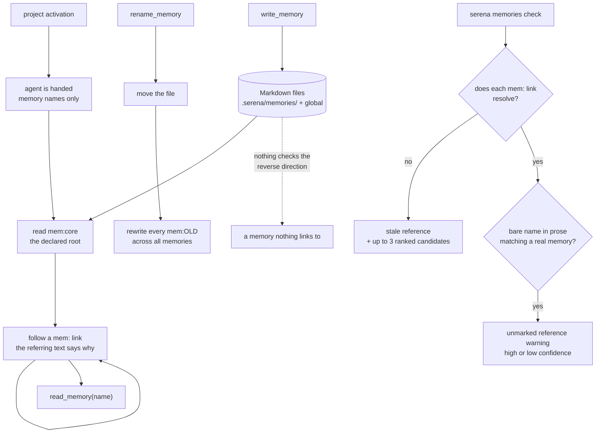

## 1. Executive Summary

Serena is an MIT-licensed MCP toolkit that gives a coding agent IDE-grade code
navigation — symbol search, references, symbol-level edits — over a language
server. That is the product, and it is not why this report exists.

Beside the LSP tools sits `src/serena/memories/`, 1,218 lines across two files,
implementing something the rest of this atlas mostly does not: **memory as a
graph of documents that cite each other, with a checker for the citations.**

A memory is a Markdown file with a name that may carry topic segments
(`frontend/debugging`). Inside a memory, a reference to another memory is written
`` `mem:frontend/debugging` ``. From that one convention three mechanisms follow.

`rename_memory_and_propagate_references` moves a memory and then rewrites every
`mem:` reference to it across every other memory, with a regex anchored on both
sides so `mem:auth` cannot match inside `mem:auth_tokens`, and skipping files
whose content does not mention it so untouched memories keep their mtime.

`validate_referential_integrity` reports two failure classes. **Stale references**
are `mem:` links whose target no longer exists, each carrying up to three
suggested replacements ranked by a similarity score. **Unmarked references** are
the inverse — a bare memory name sitting in prose that probably should have been a
link — split into high and low confidence by whether the name is
"name-shaped" enough to be unlikely as ordinary English. `serena memories check`
runs it; `auto_prefix_bare_references` fixes the second class, with a `dry_run`.

And the shipped `memory_maintenance.md` template makes the graph a stated
discipline rather than an emergent one: `mem:core` is the root, memories link
outward from it, and — the line worth quoting — *"Memories themselves should not
contain information about when to read them; this is the responsibility of the
referring memory."* Relevance is an edge property, not a node property.

The similarity scoring is where the care shows. Version suffixes are stripped
before comparison (`auth_v2` → `auth`), a token-Jaccard floor of 0.34 stops
`frontend/x-subtleties` matching `backend/y-subtleties` on their shared trailing
word, a fuzzy floor of 0.6 stops the prose word "repository" matching
`serena_repository_structure`, and `core` is hard-coded onto an ignore list
because it is also an English word. Each of those thresholds has a test naming the
false positive it exists to prevent.

Where it is weakest is that the graph is only checked in one direction. Serena
finds links pointing at nothing; it has no reachability pass, so a memory that
nothing links to — and which the agent will therefore never discover under the
declared traversal model — is invisible to the checker. Nothing here records that
a memory was ever wrong, and there is no retrieval of any kind: the model reads
names and decides.

## 2. Mental Model

A memory is **a note a person or an agent decided was worth writing down**, and
the system has an opinion about which notes qualify. The shipped maintenance
memory sets the threshold explicitly: add only *"stable, non-obvious project
conventions that avoid complex rediscovery in the future"*, and do not add
*"quick-read facts; generic language/framework knowledge; one-off task notes;
volatile line-level details; behavior likely to change soon."* That is a
memory-worthiness policy written as instructions to whoever is holding the write
tool, which in practice is the model.

The state machine is short because every transition is deliberate:

- **Written** by `write_memory`, into the project root or — with an explicit
  `global/` prefix and only when instructed — the shared one.
- **Listed.** At project activation the agent is handed the names of every
  project memory, and global names separately. Content is not included.
- **Read** by name, by the model's own judgement, or followed from a `mem:` link
  in a memory it already read.
- **Edited** in place, **renamed** with references propagated, or **deleted**.
- **Frozen or hidden.** A name matching `read_only_memory_patterns` refuses tool
  writes; a name matching `ignored_memory_patterns` is excluded from listing,
  reading and writing through the memory tools entirely.

There is no candidate state, no confidence, no supersession and no tombstone. A
memory that turns out to be wrong is edited or deleted, and nothing in the store
records that it ever said something else — the git history of `.serena/` does, if
the project commits it, which is a different mechanism.

The distinctive epistemic move is that **relevance lives on the edge**. Under the
maintenance template's discovery model, a memory does not say when to read it; the
memory that links to it does, and the referring text is required to *"provide more
precise guidance than the memory name alone."* That inverts the usual arrangement,
where each memory carries its own retrieval metadata and a ranker compares them.
Here the previous document decides what the next one is for.

## 3. Architecture

A Python MCP server, installed and run with `uv`, whose memory subsystem is two
modules with no external dependency beyond the standard library and a text helper:

| File | Lines | Concern |
| --- | --- | --- |
| `src/serena/memories/memory_manager.py` | 438 | paths, sandbox, CRUD, rename-with-propagation, read-only and ignore filters |
| `src/serena/memories/memory_reference_analysis.py` | 780 | reference detection, similarity scoring, integrity reporting, autofix |
| `src/serena/tools/memory_tools.py` | — | the six agent-facing tools |
| `src/serena/cli.py` | — | the `serena memories` command group |

Persistence is the filesystem: `<project>/.serena/memories/**.md`, plus one global
root from `SerenaPaths().global_memories_path`. There is no index, no database,
no embedding and no cache. Listing is an `os.walk`.

The rest of Serena — the language-server pool, the symbol tools, the dashboard —
is a much larger system and is not memory. It is worth naming only because it
explains the shape of this half: a project that already gives the agent precise
code retrieval does not need its memory to be searchable, because the code is
where the facts are and the memory is where the *conventions* are.

### Deployment and ergonomics

`uv` and a language server for the project's language. Nothing else runs: no
daemon for memory, no API key to store anything, and the whole memory path is
offline. First run seeds a `memory_maintenance` memory from a packaged template
unless a global copy exists, and never overwrites an existing one — *"users may
have customized them. To refresh from the shipped template, delete the existing
memory first."*

The store is Markdown in a directory the project can commit, which makes review by
pull request the natural correction path even though the code offers nothing of
the kind. Symlinked memory directories are explicitly supported for the monorepo
case, which is why the listing walk follows links and the containment check
deliberately does not resolve them.

## 4. Essential Implementation Paths

**Write.** `WriteMemoryTool.apply` bounds content at
`default_max_tool_answer_chars` and raises rather than truncating —
*"Please make the content shorter"* — then calls `MemoryManager.save_memory`,
which sanitizes the name, refuses an ignored one, checks read-only, and writes.

**Name resolution and sandbox.** `get_memory_file_path` sanitizes (strips a
stray `mem:` prefix, a `.md` suffix, and normalises OS separators — the docstring
says these are *"common mistakes made by LLMs"*), rejects `..` segments, absolute
names and empty segments, then routes `global/...` to the global root and
everything else to the project root. `_resolve_memory_path` then re-checks
containment with `os.path.normpath` **before** creating any directory, so a
rejected name cannot leave stray directories behind. The comment states the
choice: the check is *"deliberately lexical … directory symlinks placed inside the
memories folder are a supported way to share memories."*

**Read and list.** `load_memory` by exact name. `_iter_memory_files` walks with
`followlinks=True`, with a comment recording that `Path.rglob` only follows
symlinked directories from Python 3.13 and *"silently skips them"* before that.
`list_memories` partitions into `memories` and `read_only_memories`.

**Rename with propagation.** `move_memory` refuses to overwrite an existing target,
then `rename_memory_and_propagate_references` loads every memory, calls
`rename_references_to_memory`, and re-saves only those whose replacement count is
non-zero. The pattern is
`rf"(?<!{name_char}){re.escape(ref_old)}(?!{name_char})"` with
`name_char = r"[A-Za-z0-9_\-/]"`, so surrounding backticks, quotes and parentheses
are unconstrained while a longer name cannot be partially matched.

**Integrity.** `MemoryReferenceAnalyzer.validate_referential_integrity` returns a
`ReferentialIntegrityReport` with `stale_references`,
`high_confidence_unmarked_memories` and `low_confidence_unmarked_memories`, plus
`is_clean()` and a `format()` for the CLI that tags a stale reference whose source
is read-only.

**Autofix.** `auto_prefix_bare_references(include_flat_names, include_read_only,
include_global, dry_run)` rewrites bare occurrences of existing memory names to
carry the `mem:` prefix, skipping read-only sources by default and reporting what
it skipped.

## 5. Memory Data Model

There is no schema. A memory is a path and a body; its name is its identity and
its topic path is its only structure.

Scoping is two-valued and resolved at read time. A name beginning `global/`
addresses the shared root; anything else addresses this project's. Bare `global`
is rejected with a message telling the caller to use `global/<name>`. Both roots
are guarded by the same containment check. There is no user, tenant or agent
dimension — Serena is a local tool for one developer, and the atlas's usual
multi-tenancy questions do not apply.

Two name-pattern filters sit above that, both configured rather than stored:

- `read_only_memory_patterns` — a full-match regex list; a tool write raises
  `PermissionError`. Reads are unaffected, and the listing reports these
  separately, so the model can see that a memory exists and is frozen.
- `ignored_memory_patterns` — excluded from listing, reading *and* writing through
  the memory tools. The docstring names the bypass in the same breath: *"Use
  read_file on the raw path to access ignored memory files."*

That second one is worth being precise about. It is a *tool-surface* filter, not
an access boundary, and the code says so. A model with the file tools enabled can
read an ignored memory; what the filter buys is that it will not stumble into one
and will not clutter the activation listing.

There are no temporal fields, no versions, no provenance and no TTL. The only
metadata a memory carries is the one encoded in its name.

## 6. Retrieval Mechanics

**There is no retrieval mechanism at all**, and unlike most systems where that
sentence is a criticism, here it is the design.

The agent receives the list of memory names at project activation — names only,
no content, no descriptions. From there it either reads a name it judges relevant
(`ReadMemoryTool`'s own docstring says *"inferring relevance e.g. from the
name"*) or, under the maintenance template's model, starts at `mem:core` and
follows links, where each referring sentence explains what is behind the link.

The consequences are worth stating both ways.

In its favour: nothing is ranked, so nothing is mis-ranked; the cost per session
is a list of names rather than a block of content; and the guidance that decides
what to read next is written by a person who understood the relationship, not
computed from a similarity score. It also composes with Serena's other half — the
agent that needs a *fact* about the code asks the language server, and the memory
is reserved for conventions no amount of code reading would reveal.

Against it: discovery depends entirely on names and link text, so a badly named
memory is unreachable in practice; there is no fallback search when the traversal
misses; and — the gap the integrity checker does not close — a memory that nothing
links to will never be reached under the declared model, and nothing reports it.
The checker validates that every link points at something. It does not validate
that everything is pointed at.

## 7. Write Mechanics

Writes are **explicit tool calls, synchronous, and cost no model call of their
own**. There is no extraction, no summarisation, no hook-driven capture and no
background consolidation — every memory exists because something invoked
`write_memory` with a name and a body.

Consolidation is a human-or-model chore with tooling: `edit_memory` takes a
`needle`/`repl` pair in `literal` or `regex` mode with an explicit
`allow_multiple_occurrences` flag, so a careless multi-hit replacement has to be
asked for. `move_memory` supports moving between project and global scope, which
is how a convention that turned out to be general gets promoted.

Conflict handling is absent: two agents writing the same memory is last-write-wins
with no detection. For a single-developer local tool that is a defensible
omission, and it is worth noting that the atlas's usual concurrency question does
not have an answer here.

Noisy or malicious input is filtered only structurally. The name sandbox is
thorough — and it is the right thing to be thorough about, since a memory name is
attacker-reachable if any content the agent reads can influence what it writes.
The *content* of a memory is not examined at all, which matters because a memory
is instructions the agent will follow later.

### Operational cost

Zero on the write path — a file write. Zero background: `validate_referential_integrity`
and `auto_prefix_bare_references` are commands, not workers, and nothing re-reads
the store on a timer.

On the read path the always-on cost is **the list of names**, injected once at
project activation. That is bounded by how many memories exist and is stable for
the session, so it sits in the cached prefix rather than invalidating it — the
same index-in-the-prefix, body-on-demand arrangement
[cache-preserving injection](../../patterns/cache-preserving-injection/)
describes, reached here because there is nothing else to inject. Bodies arrive as
tool results, once each, and stay in the transcript.

The cost that is not bounded is the traversal: a graph whose root pulls in six
memories, each pulling in four more, is a lot of tool results, and nothing caps
depth or total bytes. The maintenance template's answer is editorial — *"dense
agent notes, not prose docs … avoid obvious context, rationale, and examples"* —
which is a policy, not a limit.

## 8. Agent Integration

Six MCP tools: `write_memory`, `read_memory`, `list_memories`, `delete_memory`,
`rename_memory`, `edit_memory`. Four are marked `ToolMarkerCanEdit`, so a
read-only Serena configuration drops them and keeps reading.

The agency allocation is unusually complete on the model's side. It may create,
read, edit, rename and delete, and the shipped maintenance memory is addressed to
it — the tool descriptions even carry the reference convention (*"References to
other memories should be inside backticks and prefixed with mem:"*), so the graph
discipline is taught through the tool schema. What the model may *not* do is
override a read-only pattern or touch an ignored one through these tools.

Injection at activation is a list, not content, and it is conditional: the code
checks `self._active_tools.contains_tool_class(ReadMemoryTool)` before including
it, so a configuration without memory tools does not advertise memories it cannot
read.

Porting the idea elsewhere is cheap. The whole mechanism is a naming convention, a
regex, and a directory — the two modules depend on nothing Serena-specific except
a path helper and a text replacer.

## 9. Reliability, Safety, and Trust

The strongest part of this design is its **path handling**, and it is worth
reading even if none of the rest applies to you. The sandbox has two independent
layers: up-front segment validation rejecting `..`, absolute names and empty
segments, and a lexical containment re-check inside `_resolve_memory_path`
described in the code as *"a defense-in-depth backstop … even if a crafted name
slipped through, the built path must never escape the memories sandbox (which
would let an agent read/write/delete arbitrary files)."* The absolute-name case
carries its own comment explaining the specific `pathlib` behaviour it defends
against — joining an absolute path discards the base — with `/etc/cron.d/backdoor`
as the worked example. Five committed tests cover it.

That care is proportionate: a memory name is model-supplied, and any content the
agent reads can try to influence it.

What is not defended:

- **Content.** A memory is instructions the agent will read later and nothing
  inspects what is in one. A repository that ships a `.serena/memories/` directory
  hands the next agent whatever it wants to say, and the activation listing makes
  those names visible immediately.
- **Correction has no memory.** Editing or deleting leaves no record. There is no
  supersession, no tombstone, and nothing stops the model writing back a
  convention a person removed last week — the failure the
  [rejected-value tombstone](../../patterns/rejected-value-tombstone/) exists for,
  entirely open here.
- **The ignore filter is not a boundary**, by its own documentation, and a reader
  who configures `ignored_memory_patterns` expecting secrecy will be wrong.
- **No concurrency control**, no backup, no sync beyond whatever the project's
  version control does with `.serena/`.

The near-miss on human review is the CLI. `serena memories check` and the
`dry_run` on the autofix are a person inspecting the memory *graph* — but never
the memory *content*, and never as a gate on a write. A person can be told a link
is dangling; nobody is asked whether a claim is true.

## 10. Tests, Evals, and Benchmarks

`test/serena/test_memories_manager.py` holds 55 test functions, and the
distribution says what the maintainers were worried about.

Five are sandbox-escape cases: an absolute project name, an absolute system path,
an absolute global name, a `..` segment, and a positive control asserting that
accepted names resolve inside the memories directory. One test reads and lists
memories behind a directory symlink, pinning the sharing case the containment
check was deliberately kept lexical for.

The rest are the similarity matrix, and they are the unusual part. There are tests
for high-similarity pairs, below-threshold pairs, above-threshold pairs, symmetry,
candidate ranking order, the empty result below threshold, a custom threshold, and
the capped candidate list. Then the false-positive cases, each named after the
mistake: `test_cross_topic_suffix_coincidence_is_rejected`,
`test_fuzzy_near_miss_rejects_substring_only_matches`,
`test_fuzzy_accepts_bare_token_when_jaccard_just_above_floor` paired with
`..._just_below_floor`, and three around the hard-coded ignore word. A heuristic
with a test on each side of its threshold is a heuristic somebody tuned against
real false positives rather than guessed.

What is missing is a test on the filters that matter for what a session sees. No
committed case asserts that a memory matching `ignored_memory_patterns` is absent
from `list_memories`, which is the assertion this atlas counts as a negative
evaluation and the one that would catch the ignore filter regressing. The
read-only tests exercise the *reporting* of read-only status in the integrity
report rather than the `PermissionError` on write.

There is no evaluation of whether the graph model works — whether an agent
following `mem:core` reaches what it needs — and no benchmark. There is no paper;
the README carries no citation block and no arXiv reference.

I ran nothing. Every claim here comes from reading the tree at
`946ad9817875cbf46b308423296c33eb65e3e728`.

## 11. For Your Own Build

### Steal

- **Give references a syntax and then check them.** One prefix (`mem:`), one
  character class defining a name's boundary, and a report of every link that
  points at nothing. It costs a regex and buys the failure mode that a
  document-based memory otherwise accumulates silently — a store full of pointers
  to things somebody deleted.
- **Propagate on rename.** If memories cite each other, a rename that does not
  rewrite the citations is a rename that breaks the store. Anchor the pattern on
  both sides so a short name cannot match inside a longer one, and skip files
  whose content does not contain the reference so you do not churn every mtime.
- **Report the inverse too, and grade it by confidence.** A bare memory name in
  prose is probably a link somebody forgot to mark. Splitting the warnings into
  high and low confidence by whether the name could plausibly be ordinary English
  is what makes the report readable rather than noise — and hard-coding an ignore
  list for words like `core` is the honest version of that.
- **Put relevance on the edge, not the node.** *"Memories themselves should not
  contain information about when to read them; this is the responsibility of the
  referring memory."* That single rule removes the per-memory retrieval metadata
  most designs accumulate, and it means the guidance is written by whoever
  understood the relationship.
- **Sanitize the names your model supplies, twice.** Validate segments up front,
  then re-check containment on the built path *before* creating directories. And
  write down why the check is lexical if you are supporting symlinks, because the
  next person will "fix" it to `resolve()`.

### Avoid

- **Do not check only one direction of the graph.** Dangling links are the easy
  half. A memory nothing points to is unreachable under a traversal model and
  costs a slot in every listing, and it takes the same walk to find.
- **Do not call a listing filter an access control.** Serena documents the bypass,
  which is the right thing to do; a system that shipped the same filter without
  that sentence would leave every reader with a wrong model of it.
- **Do not ship a graph discipline only as a template.** The maintenance memory is
  seeded once and never re-applied, so a project that deletes or ignores it keeps
  all the tooling and loses all the convention, and nothing notices.

### Fit

This is for a single developer, on a project whose *code* is already
machine-readable and whose *conventions* are not. That is a real and common
shape, and the design fits it exactly: no database, no ranking, no background
work, and a store that lives in the repository where pull-request review already
happens.

Walk away if memory has to be shared across people with different permissions,
or if it must be correctable in the sense the rest of this atlas means — nothing
here can say a memory was wrong, only that it is gone. And walk away if you were
hoping the memory would find you; the whole model assumes an agent willing to
navigate, and a store big enough that navigation fails has no fallback.

## 12. Open Questions

- Does anything in the wider tree perform a reachability pass over the memory
  graph? The analyzer covers outbound links; this reading found no inbound scan,
  but the dashboard and the workflow tools were only skimmed.
- Does the onboarding prompt actually instruct traversal from `mem:core`, or only
  reference the maintenance memory by name? `create_onboarding_prompt` receives
  the maintenance memory's name; the prompt template itself was not read.
- How large do these stores get in practice, and at what point does the
  name-listing at activation become the dominant cost? Nothing in the tree bounds
  the count.
- Is `PermissionError` on a read-only write surfaced to the model in a form it can
  act on, or does it abort the tool call? The raise is in the manager; the tool
  layer's error handling was not traced.

## Appendix: File Index

**Storage, sandbox and CRUD**
`src/serena/memories/memory_manager.py`

**Reference analysis and autofix**
`src/serena/memories/memory_reference_analysis.py`

**Agent surface**
`src/serena/tools/memory_tools.py` · `src/serena/tools/workflow_tools.py` ·
`src/serena/agent.py` (activation listing)

**Operator surface**
`src/serena/cli.py` (the `serena memories` command group)

**Shipped policy**
`src/serena/resources/memory_maintenance.md`

**Tests**
`test/serena/test_memories_manager.py`

## History

**2026-08-09** — [`946ad9817875cbf46b308423296c33eb65e3e728`](https://github.com/oraios/serena/commit/946ad9817875cbf46b308423296c33eb65e3e728) —
first reading, from the
[awesome-ai-tokenomics triage](https://github.com/QuesmaOrg/awesome-ai-tokenomics),
where the entry describes only the semantic code retrieval. Screened before
reading: 4 auto-run surfaces (`.devcontainer/devcontainer.json`,
`.github/copilot-instructions.md`, `.vscode/settings.json`, `server.json`), 4
dependency surfaces inside the seven-day cooldown including `uv.lock`, and 4
unpinned manifests, all four of which are fixture repositories under
`test/resources/repos/`. Nothing was executed and nothing was installed.
