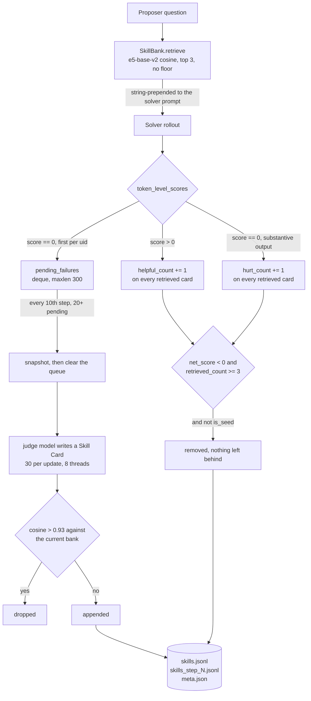

## 1. Executive Summary

SESA is a self-play reinforcement-learning framework for multi-hop search
agents: a **Proposer** composes questions hard enough to require several
sequential searches, a **Solver** answers them, and both are trained with GRPO on
a vendored fork of [verl](https://github.com/volcengine/verl). The memory system
is one file — `quarl/utils/skill_bank.py`, 617 lines — and it is the only thing
in the repository that survives a training run.

What makes it worth a report is not that an agent writes skills for itself;
[Voyager](../voyager/) established that shape and several systems here repeat it.
It is the direction of the write and the existence of a negative signal. **A card
is only ever written from a failure**, and every card carries `helpful_count`,
`hurt_count` and a derived `net_score` that the rollout scorer updates from the
same reward the model is trained on. A card retrieved at least three times whose
net score has gone negative is deleted. The
[skills-as-procedural-memory](../../patterns/skills-as-procedural-memory/)
pattern records that nothing in this atlas had a utility signal that would work
across a large library; this is the first instance where the signal exists, is
negative as well as positive, and is wired to eviction rather than to ranking.

The same file shows why that is harder than it looks. The eviction leaves no
record: `_evict_negatives` drops the row and dedup compares new cards only
against the *current* bank, so the next failure that resembles the deleted one
regenerates it. Credit assignment is uniform — all three retrieved cards receive
the outcome of a rollout that may have been decided by one of them. And
`retrieve()` accepts an `exclude_uids` argument, and `source_uid` is stored on
every generated card for exactly that purpose, and **nothing in the repository
ever passes it**, so a card distilled from a question can be retrieved for that
same question later in the run.

There is no `LICENSE` file in the tree, and the vendored `verl/` directory
carries none either. Everything below is read from source at the pinned commit;
nothing was installed or run.

## 2. Mental Model

Think of the skill bank as a **lesson book written only from losses, priced by
whether the lessons help, and pruned when they do not.**

Three phases per training step, stated in the module docstring and true of the
code:

- **rollout** — `retrieve(question)` is read-only and deterministic given the
  bank state.
- **reward** — `add_pending_failure(failure)` is append-only, and
  `update_usage_stats` writes counters.
- **boundary** — `maybe_apply_updates(global_step)` evicts, generates and
  persists.

The separation matters for a reason specific to RL rather than to memory: a
rollout that mutated the bank mid-batch would make the advantage estimate depend
on the order rollouts finished. The design keeps the read path frozen for the
duration of a step and does all mutation at the boundary, which is the same
discipline a serving system needs for a different reason.



The dashed truth of that diagram is the missing edge: nothing runs from `GONE`
back to `DEDUP`. Deletion and the duplicate check do not know about each other.

## 3. Architecture

The bank is a **detached, named Ray actor** — `@ray.remote(name='sesa_skill_bank',
lifetime='detached', max_concurrency=8)` at `quarl/utils/skill_bank.py:111` —
obtained through `get_or_create_skill_bank`, which calls `ray.get_actor` first and
constructs only on `ValueError`. Detached lifetime means the bank outlives the
driver that created it, so a trainer restart against a live Ray cluster attaches
to the same in-memory bank rather than reloading from disk.

State inside the actor is three fields: `self.skills`, a Python list of dicts;
`self.embeddings`, an `(n, 768)` float32 NumPy array positionally aligned with
that list; and `self.pending_failures`, a `deque(maxlen=300)`. A
`threading.Lock` guards all three, and `max_concurrency=8` means the actor really
does serve concurrent calls.

The embedder is loaded on the actor at construction — `AutoModel` and
`AutoTokenizer` for e5-base-v2, explicitly on CPU with a comment giving the
reason: *"to avoid GPU contention with training"*, at roughly 10 ms per query.
For a trainer already saturating its GPUs that is the correct trade, and it is
the kind of decision most memory systems in this atlas never have to make.

### Deployment and ergonomics

The bank is **off unless a launcher turns it on**. `rl_config.yaml` contains no
`skill_bank` block at all; the trainer reads `self.sp_config.get("skill_bank", {})`
and takes `enable=False` as the default
(`quarl/trainer/ppo/sesa_ray_trainer.py:116`). Every parameter is supplied by
`examples/train_sesa.sh:337-352` as Hydra `+` overrides — `retrieve_top_k=3`,
`update_freq=10`, `pending_queue_max=300`, `gen_per_update=30`,
`max_bank_size=800`, `dedup_threshold=0.93`, `min_retrieved_for_evict=3`. A
reader who studies only the config file will conclude the system has no memory.

Initialisation is wrapped in a `try` that logs and sets the handle back to
`None` on any failure, so a missing embedding model or judge endpoint degrades to
a trainer with no memory rather than a crash. `judge_token` is the one exception:
it is read as `os.environ['JUDGE_TOKEN']` with a bare subscript, so an unset
token raises `KeyError` *inside* the guarded block and is caught by the same
handler — the bank silently disables itself.

Two config paths exist and nothing in the tree fills them. `seed_skills_path`
loads a YAML of human-curated seed skills and `warm_start_path` loads a prior
`skills.jsonl`; the repository ships neither a seed file nor a checkpointed bank,
so a first run starts empty and the `is_seed` protection that runs through the
eviction code has nothing to protect.

## 4. Essential Implementation Paths

| Path | File | What it does |
| --- | --- | --- |
| Retrieve | `quarl/utils/skill_bank.py:273-290` | Embeds the question, dots against the whole matrix, sorts, returns top-k with `_retrieval_sim` attached |
| Inject | `quarl/utils/problem_extraction.py:354-392` | Renders the cards and prepends the block to `user_content`; records `retrieved_skill_ids` in `extra_info` |
| Score usage | `quarl/trainer/ppo/sesa_ray_trainer.py:2088-2164` | Turns `token_level_scores` into `(skill_id, helpful, hurt)` triples, one uid counted once |
| Queue failure | `quarl/trainer/ppo/sesa_ray_trainer.py:2002-2083` | Pushes one summary per failed uid, skipping format failures and dummy questions |
| Boundary hook | `quarl/trainer/ppo/sesa_ray_trainer.py:1068-1107` | Fires all of the above plus a non-blocking `maybe_apply_updates` future |
| Generate | `quarl/utils/skill_bank.py:411-483` | Eight-thread `ThreadPoolExecutor` over the judge, parsing a strict line-oriented format |
| Evict | `quarl/utils/skill_bank.py:485-513` | Negative-score eviction, then forced eviction to fit the size cap |
| Dedup and add | `quarl/utils/skill_bank.py:515-542` | Cosine against the existing bank and against cards added in the same pass |
| Persist | `quarl/utils/skill_bank.py:546-565` | Whole-file rewrite of `skills.jsonl`, a step-stamped copy, and `meta.json` |

## 5. Memory Data Model

One record type. A generated card, from `_generate_correctives`:

```text
skill_id          auto_<8 hex>          (seeds keep their yaml id)
category          one of eight, model-chosen
pattern           what kind of question this applies to
common_confusion  what typically gets mistaken
key_distinction   the concrete disambiguating signal
trigger_keywords  list[str]
queries           up to three search templates
example_question  first 200 chars of the failing question
source_uid        the failing rollout's uid
created_step      global step
retrieved_count / helpful_count / hurt_count / net_score
is_seed           present only on seeds
```

Two things are absent and both are load-bearing. There is **no scope key** — no
run id, no task family, no dataset — so a bank warm-started from a previous
experiment mixes with the current one and nothing can separate them again. And
there is **no validity interval**: `created_step` records when a card was
written, never the window in which it was useful, so a card that helped for two
hundred steps and then stopped is indistinguishable from one that never helped,
except through the counters, which are cumulative and never decay.

The schema is enforced by parsing rather than by a type. `_parse_skill_response`
partitions each line on the first colon and ignores lines without one; a card is
rejected only if `pattern` or `queries` came back empty. A judge response that
invents a ninth category, or writes `KEY_DISTINCTION` as three lines, degrades
silently into a card with missing fields.

## 6. Retrieval Mechanics

`retrieve()` embeds the question with the `query: ` prefix e5 expects, dots it
against the full matrix, sorts every index by similarity and slices the top three.

**There is no score floor.** If the bank holds eight hundred cards about
temporal disambiguation and the question is a geographic lookup, the three
nearest temporal cards are still prepended to the prompt, under the heading
*"Past learnings from similar failures"*. The retrieved similarity is computed
and attached to each returned card as `_retrieval_sim`, and no caller reads it.
This is the same failure the atlas records against
[Voyager](../voyager/) — retrieval with no threshold — reappearing in a system
that otherwise measures much more than Voyager does.

**The usefulness counters do not affect ranking.** `net_score` is read in exactly
two places, both inside eviction. A card with a net score of +40 and one with −2
that has been retrieved twice rank purely by cosine. The system has a quality
signal and spends it entirely on deletion.

Ranking is over the whole bank on every call. At the 800-card cap that is an
800×768 dot product per question, which is nothing next to a rollout; the cost
that matters is the CPU embedding of the query itself, and the author measured it
at about 10 ms.

`retrieve_batch` exists, vectorises the same work across a list of questions, and
is never called. So is `exclude_uids`.

## 7. Write Mechanics

The write path has four gates and they are unusually well chosen.

**Gate one: only failures.** `_skillbank_collect_failures` walks the solver batch
and skips anything with `scores[i] != 0`. Successes teach nothing here, which is
a defensible position — [Voyager](../voyager/) takes the opposite one and stores
only successes — and the two together frame the choice better than either alone.

**Gate two: only substantive failures.** A failed rollout must not be flagged
`extraction_failed`, must have a question that does not contain `dummy`, and must
contain both an `<information>` and an `<answer>` block, matched by regex over
the decoded response. A model that failed to produce the output format is a
training problem, not a memory-worthy lesson, and the code says so.

**Gate three: one per uid.** `seen_failed_uid` means five failed rollouts of the
same question contribute one queue entry, not five.

**Gate four: cosine dedup at 0.93**, against both the existing bank and the cards
already accepted in the same pass — the second check matters, because a batch of
thirty failures of one kind would otherwise produce thirty near-identical cards
that individually pass the first check.

Between the queue and generation sits a priority function, `_pick_top_failures`,
that scores each pending failure: +10 if skills were retrieved and it failed
anyway, +5 if the same uid failed more than once in the batch, +3 if the retrieved
material was long. The first term is the interesting one — **a failure that
happened despite the memory is worth more than one that happened without it** —
and it is expressed in four lines of arithmetic rather than in a model call.

The generation prompt (`skill_bank.py:34-68`) is worth reading in full for one
requirement: it passes the previously retrieved cards in as
`[Previous skills given to the agent (which DIDN'T help)]` and instructs the
judge to *"address what the previous skills MISSED (don't repeat them)"*, then
forbids vacuous advice and forbids naming entities from the failing question. The
last of those is a leakage control in prose — the card is meant to generalise, not
to memorise the answer — and it is the only place the leakage risk is addressed
at all.

### Operational cost

Per update: up to thirty judge completions at `judge_max_tokens` 4500 in the
launcher, eight in flight. Every update re-embeds **the whole bank** —
`_rebuild_embeddings` throws the matrix away and recomputes it from scratch after
each mutation, so an 800-card bank costs 800 CPU embeddings every tenth step to
add perhaps a dozen rows. The incremental alternative is one `np.vstack` and a
deletion mask.

Persistence rewrites `skills.jsonl` whole on every update and writes a second
full copy as `skills_step_N.jsonl`. Over a thousand-step run at `update_freq=10`
that is a hundred complete snapshots of the bank — accidentally the best audit
trail in the design, and the reason the missing mutation log costs less here than
it would in a serving system.

## 8. Agent Integration

There is no agent-facing API, no MCP server and no tool. The bank is reachable
only as a Ray actor handle, held in two places: the trainer, and the problem
extractor via `set_skill_bank_handle`.

Injection is string concatenation. `problem_extraction.py:363-367` formats the
cards and does `user_content = skill_block + "\n\n" + user_content`, so the
memory lands at the top of the *user* message rather than in the system prompt.
For a training rollout that is fine — the whole message varies per question
anyway — but it is worth noting for anyone lifting this into a serving path,
where the same choice would sit in front of the varying content and defeat prefix
caching in the way
[cache-preserving injection](../../patterns/cache-preserving-injection/)
describes.

The solver never sees a card id and cannot cite, reject or request one. The only
feedback channel from solver to bank is the scalar reward.

## 9. Reliability, Safety, and Trust

**Failures are consumed before they are used.** `maybe_apply_updates` snapshots
`pending_failures`, clears the deque, releases the lock, and only then calls the
judge. If generation raises, the handler logs and returns `{'error': ...}` — and
the snapshot is gone. Up to three hundred failed rollouts, each of which cost a
full multi-turn search rollout to produce, are discarded by one judge timeout.
The [recoverable background work](../../patterns/recoverable-background-work/)
pattern's cheapest form — a consumption cursor advanced only after the work
lands — would cost a few lines here.

**The queue is lossy by design.** `deque(maxlen=300)` silently drops the oldest
entry when full. With `update_freq=10` and a batch producing more than thirty
failures per step, the queue is at capacity before the boundary and the failures
that survive are the most recent, not the most informative — which inverts the
priority function that runs immediately afterwards.

**Eviction is not correction.** `_evict_negatives` removes the row and stops.
Nothing records that the value was rejected, and `_add_new_with_dedup` compares
only against `self.skills`, so the next failure that resembles the deleted card's
origin regenerates a card the bank has already measured as harmful — and the new
card starts at `net_score` 0 with `retrieved_count` 0, so it must lose three more
rollouts to be removed again. This is the exact failure the
[rejected-value tombstone](../../patterns/rejected-value-tombstone/) pattern
exists for, in a system that has the measurement to populate one.

**Credit assignment is uniform.** All three retrieved cards receive the same
`helpful`/`hurt` from one outcome. A genuinely harmful card retrieved alongside
two good ones is credited positively whenever the rollout happens to succeed, and
two good cards are punished whenever it does not. The `_retrieval_sim` already
attached to each card would support a similarity-weighted attribution for free.

**`hurt` is a coarse definition.** It fires whenever a scored rollout returns 0
with substantive output, which includes questions no skill could have saved. The
counter measures "was present when the agent lost", not "contributed to the
loss". The author bounded the noise where it was cheap to do so — format failures
are excluded, one uid counts once — and did not bound it where it is hard.

There is no scope, no trust state that withholds a card, no provenance beyond
`source_uid`, and no path by which a person inspects or approves what the judge
wrote.

## 10. Tests, Evals, and Benchmarks

**There are none for the memory system.** `quarl/` contains no test file of any
kind. The vendored `verl/` directory in this checkout is trimmed to
`pyproject.toml`, `requirements.txt`, `setup.py` and the package itself, so the
upstream test suite is not present either.

Nothing asserts that an evicted card stays evicted, that dedup rejects a
near-duplicate, that a card is not retrieved for the question it was distilled
from, or that the counters move in the direction the eviction rule assumes. Every
one of those is a pure-function test over the actor's own methods — the bank
takes a config dict and the embedder is the only external dependency — so the
absence is a choice about effort, not a structural obstacle.

The README reports the trained model on Hugging Face, and the repository contains
evaluation dataset preprocessing under `examples/data_preprocess/`. No result in
the tree separates the contribution of the skill bank from the contribution of
self-play, and no ablation is present.

## 11. For Your Own Build

### Steal

- **The negative usefulness counter, wired to deletion.** `helpful_count` and
  `hurt_count` written from the same signal that trains the model, with eviction
  gated on `net_score < 0` *and* a minimum retrieval count so a card is not
  removed on one unlucky draw. Most systems in this atlas track only positive
  usage, which cannot distinguish a memory that is unused from one that is
  actively wrong.
- **Failure as the write trigger.** Writing only from losses keeps the store
  small and every entry corrective by construction. The mirror-image choice in
  [Voyager](../voyager/) — write only from verified successes — is equally
  defensible, and the pair is the clearest statement of the trade in this atlas.
- **The priority function on the pending queue.** Ranking a failure higher
  *because memory was retrieved and it failed anyway* is a four-line heuristic
  that points generation at the cases where the store is demonstrably inadequate.
- **Passing the failed skills into the generation prompt** with an instruction
  not to repeat them, which is a cheap defence against a library that grows in
  volume without growing in coverage.
- **The read-only-during-rollout, mutate-at-boundary discipline**, and the reason
  for it: a store that mutates mid-batch makes results depend on completion
  order.

### Avoid

- **Deleting with no tombstone when you already know the value was harmful.**
  The bank measures a card into negative territory over at least three rollouts,
  removes it, and then lets an equivalent card back in at score zero.
- **A parameter that implements a safety property and is never passed.**
  `exclude_uids` and `source_uid` exist to stop a card being retrieved for the
  question it came from. No caller uses them. An unused defence reads as a
  present one.
- **Retrieval with no score floor.** Three cards are always injected, however far
  away, and the similarity that would gate them is computed and discarded.
- **Draining a work queue before the work succeeds.** Snapshot, clear, then call
  a remote model, with the failure handler logging and returning.
- **Recomputing the entire embedding matrix on every mutation.**
- **Configuration that exists only in a shell script.** The feature is invisible
  in `rl_config.yaml` and off by default.

### Fit

Copy the counter-and-eviction mechanism if you have a **cheap, automatic, and
honest outcome signal** — a test result, a task reward, a checked answer. That is
what makes this design work, and it is what most assistant-shaped products do not
have: without a real outcome, `hurt_count` becomes a proxy for user irritation
and eviction becomes noise amplification.

Do not copy the shape wholesale into a serving system. There is no scope key, no
per-user boundary, no review surface and no deletion path a person can invoke,
and all four are absent because a single-tenant training loop genuinely does not
need them.

## 12. Open Questions

- Was the skill bank ablated? Nothing in the tree separates its effect from
  self-play's, and the mechanism's whole claim is that it compounds.
- What did the counters actually look like after a run? `stats()` reports
  `skills_used_at_least_once`, which would answer whether an 800-card bank is
  mostly dead weight, and no logged run is committed.
- Why is `retrieve_batch` unused when the rollout retrieves per question in a
  loop, and `exclude_uids` unused when `source_uid` is written for it? Both read
  as a designed second pass that was not finished.
- Does the detached actor's survival across driver restarts help or hurt? A bank
  that outlives the trainer will carry counters earned by a different policy.

## Appendix: File Index

| File | Lines | Role |
| --- | --- | --- |
| `quarl/utils/skill_bank.py` | 617 | The entire memory system: actor, embedder, retrieval, generation, dedup, eviction, persistence |
| `quarl/trainer/ppo/sesa_ray_trainer.py` | 2494 | Self-play trainer; the memory hooks are at 116-150, 1068-1107, 2002-2164 |
| `quarl/utils/problem_extraction.py` | 571 | Question extraction and the only injection site, 354-392 |
| `quarl/config/rl_config.yaml` | 124 | Self-play configuration, containing no `skill_bank` block |
| `examples/train_sesa.sh` | — | The only place every skill-bank parameter is set, 337-352 |
| `quarl/utils/sesa_data_manager.py` | 319 | In-process problem pool; not persisted, so not memory by this atlas's bar |

## History

**2026-08-09** — [`74de5d77a19774cfba53d6950d47633a2d632430`](https://github.com/Zenghuang-Fu/SESA-Self-Evolving-Search-Agents/commit/74de5d77a19774cfba53d6950d47633a2d632430) — first reading. The screen reported one build-time execution surface (`verl/setup.py`) and three unpinned dependency surfaces, no auto-running hooks, and nothing inside the seven-day cooldown. Nothing was installed, built or run; the analysis is static over the tree. No `LICENSE` file exists at the repository root or in the vendored `verl/` directory, so the terms are unstated rather than permissive.
