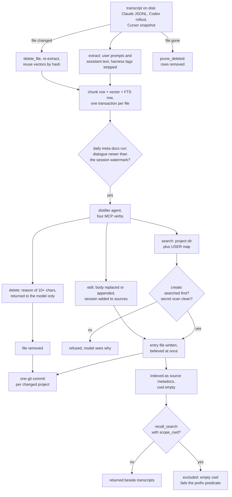

## 1. Executive Summary

Session Recall is a local Python MCP server that indexes every Claude Code,
Codex and Cursor transcript on a machine into one SQLite file and serves it
through five tools. Beside the index sits *meta docs*, a nightly distiller
that turns each session's dialogue into Markdown entries — bugs, procedures,
decisions and a map of where the user's data lives — in a git repository, and
indexes them into the same store. What is notable is the engineering of the
index: an embedding-space fingerprint that refuses to mix vectors, and a
distiller whose invariants are enforced by its tool server. What is weak is
that distilled entries reach every later session unreviewed, and cannot be
scoped or filtered by source.

The transcript index alone would not meet the atlas's bar: a chunk is a
verbatim record of what was said and cannot turn out to be false. The meta
docs entries can. An entry stating that a bug was fixed by a given change is a
claim an agent wrote, which a later session may contradict, and the distiller
is told to edit or delete it when that happens
(`src/session_recall/metadocs/distill.py:67-74`). That layer places the system
in scope, and most of sections 2, 7 and 9 are about it.

The transcript side is careful in ways that matter to an operator. A model
swap that keeps the dimension still changes the vector space, so the index
stores a fingerprint and turns semantic ranking off until every source is
re-embedded, reporting the reason in a `degraded` field rather than returning
noise (`src/session_recall/retrieve.py:76-90`). Both retrieval arms carry an
orphan guard, and a file's three deletes share one criterion inside the write
transaction (`src/session_recall/store.py:142-159`).

The meta docs side is where the gaps are. The distiller writes directly into
the store; git is the only review surface, after the fact. The `delete` tool
demands a reason and says *"deletions are audited"*, but the reason goes back
to the model and nowhere else. Entries are indexed with an empty `cwd`, so a
scoped search never returns them, and `source="metadocs"` is refused by the
validator its own docstring tells callers to use.

One mark, `negative_eval`: a committed case asserts the distiller's search
leaves out another project's entry while returning the global user map, and
another asserts a scoped recall leaves out a second repository after a global
positive control. Section 9 names the six withheld.

## 2. Mental Model

There are two stores of belief, and they behave differently.

**A transcript chunk is evidence, not a claim.** It is one user prompt or one
assistant text block, copied verbatim with its session, `uuid`, `cwd` and byte
offsets (`src/session_recall/extract.py:54-94`). It becomes retrievable when
the indexer embeds it, and stops being retrievable when the source file
changes (the file's rows are deleted and re-extracted) or disappears (`prune`).
Reminder blocks the host harness injects into user turns are stripped before
embedding (`src/session_recall/extract.py:19-47`).

**A meta docs entry is a claim, written by an agent.** The daily run reads only
`user` and `assistant` rows from the index, newer than each session's
watermark, and hands them to a distiller agent session by session
(`src/session_recall/metadocs/collect.py:86-113`). The distiller decides what
is durable and writes it through four verbs. An entry is believed from the
moment `create` writes the file. There is no candidate state, no confidence and
no second reader before the next search can return it.

**An entry stops being believed in three ways.** The distiller `edit`s it in
place, replacing or appending to the body; `delete`s the file when the
dialogue proves it wrong or obsolete; or a person edits or reverts the git
repository. Each run commits once per changed project
(`src/session_recall/metadocs/run.py:87-91`), so the prior text survives in
git history, not in the store. Nothing records that a value was rejected: a
later session that restates it can create it again.

**The distiller treats the dialogue as data.** Its prompt says so, and asks
that injection attempts be recorded as a bugs entry titled *"suspicious
content"* (`src/session_recall/metadocs/distill.py:83-85`). The guarantees that
do not rely on the model sit in the tool server: `create` refuses until a
`search` has run for that category in the process, and `create` and `edit` run
a regex secret scanner and refuse a flagged body
(`src/session_recall/metadocs/agent_server.py:39-75`).

## 3. Architecture

The product is one Python package with five entry points: the `session-recall`
CLI, the `session-recall-mcp` stdio server, the meta docs agent server spawned
per distill call, a team hub HTTP service, and a peer-to-peer share worker.

- **Index.** `Store` opens one SQLite file, loads `sqlite-vec`, and keeps a
  `chunks` table, a `vec0` table fixed at the configured dimension, an FTS5
  table, an `indexed_files` table of per-file signatures and a `meta` table for
  the embedding fingerprint (`src/session_recall/store.py:62-100`). The store
  refuses to open at a different dimension and names the fix
  (`src/session_recall/store.py:44-60`).
- **Embedders.** A bundled ONNX model picked by interaction language, Ollama,
  LM Studio, Voyage, OpenAI or any `/v1/embeddings` endpoint; a reranker only
  with Voyage or the inference gateway (`README.md`, *Embedding providers*).
- **Meta docs.** A git repository of Markdown entries
  (`src/session_recall/metadocs/entries.py:1-14`), a scheduler writing a
  launchd plist or systemd units, a flock-guarded runner, and a distiller that
  shells out to `claude -p` or `codex exec`.
- **Team hub.** A stdlib HTTP server behind nginx, one transcript tree per
  member, a timer-driven indexer that reuses `index_corpus`, and bearer keys
  stored as SHA-256 (`src/session_recall/hub/app.py:1-22`,
  `src/session_recall/hub/auth.py:1-20`). When a machine has joined a hub, the
  MCP tools proxy to it and the local index is not read
  (`src/session_recall/server.py:29-44`).
- **Share.** End-to-end encrypted envelopes over a folder or a blind relay, a
  worker that drafts answers into an outbox, and an approval step before
  anything is sent.

### Deployment and ergonomics

Nothing has to be running beyond the MCP server the host starts. The default
embedder downloads a model once into the data directory and runs on CPU, so no
API key is needed to store or search anything; a hosted embedder is opt-in.
Install is `pipx install` plus a host plugin. The index is a SQLite file and
can be deleted and rebuilt from the transcripts, which stay where the hosts
put them. Meta docs needs the `claude` or `codex` CLI on the path and a
subscription; its store is plain Markdown in git, readable and repairable by
hand. The hub needs a server, nginx for TLS, and an operator issuing keys.

## 4. Essential Implementation Paths

**Capture.** The SessionStart hook backgrounds `session-recall sync` under a
`pgrep` guard (`hooks/hooks.json:4-14`). `sync` runs `index` on a solo install
and pushes to the hub otherwise (`src/session_recall/cli.py:134-148`).
`index_corpus` walks Claude and Codex roots; per file it compares a signature,
snapshots vectors by content hash, deletes the file's rows, re-extracts, embeds
only the missing hashes and commits (`src/session_recall/index.py:91-193`).
Cursor follows, then `index_metadocs` when meta docs is configured
(`src/session_recall/cli.py:170-195`).

**Retrieval.** `recall_search` checks the stored fingerprint, embeds the
query, runs `Store.knn` and `Store.fts` with the same filters, drops rows that
vanished mid-search, collapses identical `content_hash`es and reranks
(`src/session_recall/retrieve.py:64-154`). The filter builder adds the scope,
source and date predicates (`src/session_recall/store.py:184-207`).

**Navigation.** `expand_around` and `step` resolve a session and `uuid` to
candidate files and stream to the anchor, keeping a bounded window
(`src/session_recall/retrieve.py:156-294`). `grep` streams every indexed file
and filters per event (`src/session_recall/retrieve.py:296-373`).

**Distillation.** `run_once` migrates the old one-file-per-category format if
present, then per project takes pending sessions oldest-first, splits marathon
sessions into chapters, calls the distiller, advances watermarks after each
successful chapter, and halts the project on the first failure
(`src/session_recall/metadocs/run.py:53-98`). The four verbs live in
`src/session_recall/metadocs/agent_server.py:49-139`; the cage is in
`src/session_recall/metadocs/distill.py:111-217`.

**Meta docs into the index.** `index_metadocs` turns each entry into one chunk
with `session_id` and `uuid` set to the entry id, `role="doc"`, `cwd=""` and
`source="metadocs"`, then prunes entries whose files are gone
(`src/session_recall/metadocs/indexing.py:44-89`).

**Peer answers.** `build_candidate` searches the owner's index, keeps anchors
whose `project` is granted to the peer, composes or digests an answer, scans it
and writes a `pending` candidate (`src/session_recall/share/worker.py:100-140`).
`approve` requires the exact version hash
(`src/session_recall/share/approval.py:143-148`).

## 5. Memory Data Model

The `chunks` columns are `session_id`, `uuid`, `role`, `text`, `project`,
`cwd`, `git_branch`, `ts`, `file_path`, `byte_offset`, `byte_len`,
`turn_index`, `content_hash` and `source` (`src/session_recall/store.py:15-17`).
`project` is the basename of the repository root, with worktrees collapsed
(`src/session_recall/scope.py:60-65`). There is no status, confidence or
validity column, and none is needed for a record of what was said.

An entry is a dataclass with `id`, `project` (empty for the user map),
`category`, `title`, `body`, `prs`, `sources`, `created` and `updated`
(`src/session_recall/metadocs/entries.py:30-40`). The file path encodes project
and category: `<repo>/<project>/<category>/<id>.md`, or `<repo>/USER/<id>.md`.
`sources` holds `source:session_id` keys, set from the distill call's
environment rather than from the model, and `edit` appends the current session
(`src/session_recall/metadocs/agent_server.py:69-73`, `:95-96`). The dates are
calendar days stamped at save; there is no validity time.

When indexed, the entry's `updated` date becomes `ts`, and `project` becomes
the entry's project or `user-map`. The `cwd` is empty
(`src/session_recall/metadocs/indexing.py:44-51`), which is what removes
entries from every scoped read (section 6).

The hub adds an owner, derived from the bearer key and the transcript path, as
attribution on each hit (`src/session_recall/hub/app.py:119-126`). It is not a
filter.

## 6. Retrieval Mechanics

**Hybrid, with one prefilter on both arms.** KNN puts the metadata predicate
inside the `chunk_id IN (SELECT …)` subquery, so a small repository or source
is not starved by a global top-k, and the unscoped form keeps the subquery as
an orphan guard (`src/session_recall/store.py:209-235`). FTS5 ORs the quoted
query terms, joins `chunks` and orders by `rank`
(`src/session_recall/store.py:237-262`). With no reranker, the order is KNN
first, then FTS-only hits with a `None` score rather than a fake zero
(`src/session_recall/retrieve.py:146-154`).

**Degradation is reported, not hidden.** An unreachable embedder or a
fingerprint mismatch produces FTS-only results with a `degraded` reason, and
the tool description tells the agent a miss is then inconclusive
(`src/session_recall/server.py:62-71`).

**Scope is a predicate the caller may supply.** `scope_clause` matches the
root exactly or anything under `root/`, escaping LIKE wildcards
(`src/session_recall/scope.py:38-50`). `recall_search`, `grep` and
`recent_sessions` accept it; omitting it searches everything. The bundled skill
tells the agent to *"retry globally if a scoped search is thin"*
(`skills/session-recall/SKILL.md:19-20`), and the recall subagent says the same
(`agents/recall.md:24-28`). `expand_around` and `step` take no scope at all.

**Meta docs entries fall outside every scoped read.** An entry's `cwd` is the
empty string, which equals no root and matches no `root/%`
(`src/session_recall/metadocs/indexing.py:47`, `src/session_recall/scope.py:49`).
A repository-scoped `recall_search` therefore never returns that repository's
own bugs or decisions, though the unscoped search does.

**The source filter cannot select them either.** `indexing.py` says
`source="metadocs"` filters (`src/session_recall/metadocs/indexing.py:7-8`),
but `_validate_source` accepts only `claude`, `codex`, `cursor` or nothing and
raises otherwise (`src/session_recall/retrieve.py:52-56`); the CLI choices
match (`src/session_recall/cli.py:99`). Unscoped `recent_sessions` also lists
each entry as a session, since it groups every chunk by `session_id`
(`src/session_recall/store.py:277-290`).

**In hub mode the entries are out of reach.** `sync` pushes instead of
indexing, so `index_metadocs` never runs, and the hub indexer walks only
member transcripts (`src/session_recall/cli.py:134-148`).

**Within the distiller, search is lexical and fresh.** Term overlap over title
and body, title hits doubled, read straight from the files so an entry created
seconds ago is seen (`src/session_recall/metadocs/entries.py:144-161`).

## 7. Write Mechanics

**Transcripts are re-derived, never edited.** A changed file's rows are
deleted and re-extracted inside one transaction with its signature, so a
rolled-back file never looks indexed (`src/session_recall/store.py:334-340`).
Prune runs only for sources whose roots were safe to scan and did not fail
(`src/session_recall/index.py:181-182`).

**Entries are written by an agent with four verbs.** The distiller runs with
`--allowedTools` set to the four MCP tools, every built-in tool disallowed by
name, slash commands off, an empty working directory and
`--no-session-persistence`; the codex engine disables the shell and other tool
families and runs `--ephemeral` (`src/session_recall/metadocs/distill.py:41-50`,
`:111-151`, `:167-217`). No distill transcript is persisted, and a filter on
temp-directory project names stops older runs' transcripts being distilled
(`src/session_recall/metadocs/collect.py:30-38`).

**Dedup is mandatory, consolidation is the model's call.** `create` refuses
until `search` has run; whether to `edit` an existing entry instead is left to
the model and its prompt (`src/session_recall/metadocs/distill.py:67-74`).

**Delete takes a reason and keeps none.** `do_delete` refuses a reason under
ten characters with *"deletions are audited"*, then returns the reason in the
tool result (`src/session_recall/metadocs/agent_server.py:101-106`). The runner
captures the CLI's output and prints only a stderr tail on failure
(`src/session_recall/metadocs/distill.py:135-149`), and the commit message
names the project and a session count (`src/session_recall/metadocs/run.py:87-89`).
The removed file is in git; the stated reason is not recorded anywhere.

**`edit` and `delete` reach across projects by id.** `entries.load` globs
`*/*/<id>.md` and `USER/<id>.md` with no project predicate
(`src/session_recall/metadocs/entries.py:102-111`), while `search` lists only
the current project and the user map. A distiller for one project can modify
another's entry if it learns the id, and every project's distiller can edit or
delete the shared user map.

### Operational cost

Indexing is synchronous inside a background process the hook detaches; the
agent never waits on it. New turns are retrievable after the next session
start, or the next manual `index`. Only new content hashes are embedded. Meta
docs costs one CLI agent call per session per day, with a 900-second timeout
and a 60,000-character ceiling per call, and runs as long as the backlog
needs (`src/session_recall/metadocs/collect.py:27-28`). Nothing is injected
into the prompt by default; retrieval is tool-mediated, so the prompt-prefix
cache is untouched.

## 8. Agent Integration

The MCP server registers `recall_search`, `expand_around`, `step`, `grep` and
`recent_sessions` (`src/session_recall/server.py:57-153`). The plugins for
Claude Code, Codex and Cursor ship the server, a skill, a recall subagent and
the hooks. The agent never writes memory: transcripts are indexed from disk,
and entries are written by a separate distiller agent the main agent cannot
reach. The SessionStart hook runs a sync and injects nothing.

The distiller is the one model with write power, and its surface is small
enough to adapt: four verbs, a process-local `_searched` set, and a scanner
call. The same cage pattern is used for the share composer, which runs with no
tools at all on the Claude path (`src/session_recall/share/compose.py:92-133`).

## 9. Reliability, Safety, and Trust

**Stored injection is the main risk, and it is acknowledged.** Sessions quote
untrusted text, the distiller reads it with write verbs, and its output is
served to every later unscoped search with no status attached. The tool server
holds the dedup and secret rules; nothing holds a rule about truth. The git
commit per project makes the effect reviewable after it has already been
indexed.

**Peer answers are gated; memory is not.** A share candidate is `pending`
until the owner approves the exact version hash, and the worker cannot send
(`src/session_recall/share/worker.py:1-20`,
`src/session_recall/share/approval.py:143-148`). That gate guards what leaves
the machine, not what the store believes. Peer grants are matched on
`project`, a repository basename, so two repositories with the same name share
a grant (`src/session_recall/share/worker.py:106-107`). The codex composer runs
with `--sandbox read-only`, which its docstring notes does not remove reads
(`src/session_recall/share/compose.py:163-167`).

**The hub pools by design.** Ingest writes only into the tree of the key's
owner, with a path resolver that rejects traversal and re-checks symlinks
(`src/session_recall/hub/storage.py:79-107`). Search, expand, grep and ask
read the whole pooled index for any valid key
(`src/session_recall/hub/app.py:266-327`). Client-side redaction and a hub
masking map run before bytes are stored.

**Concurrency is handled where it bit.** The hub service opens the index
read-only because a long-lived writable connection made the indexer's
`sqlite-vec` writes fail (`src/session_recall/store.py:22-31`); meta docs runs
and hub indexer runs each hold a flock (`src/session_recall/metadocs/lock.py:11-23`).

**Withheld marks.**

- `tombstone`: `delete` unlinks the file and keeps nothing keyed on the value;
  watermarks only stop the same turns being re-read
  (`src/session_recall/metadocs/entries.py:114-119`).
- `trust_state`: entries have no status field. The `pending`, `approved`,
  `rejected` and `expired` values on `Candidate` describe outbound answers,
  not stored memory (`src/session_recall/share/worker.py:63`).
- `bitemporal`: `created` and `updated` are save dates; there is no validity
  time.
- `scope_enforced`: the `cwd` predicate is real and tested, but optional on
  every tool, and the skill and subagent tell the agent to widen to a global
  search when a scoped one is thin. `expand_around` and `step` read by session
  id with no scope, and the hub reads every owner's rows. The meta docs search
  partitions by directory, while `load` for `edit` and `delete` does not.
- `audit_log`: the mutation record is git history in the entries repository,
  and the delete reason is discarded.
- `human_review`: the distiller writes straight into the store. The approval
  queue holds peer answers, which are not memory.

## 10. Tests, Evals, and Benchmarks

The suite is synthetic-fixture pytest. `addopts` deselects the `live` and
`smoke` markers (`pyproject.toml:50-54`); CI runs the default suite on Ubuntu
and macOS across three Python versions and the smoke cases in a separate job
(`.github/workflows/test.yml:11-72`). I read the tests; I ran none.

The store and retrieval tests cover what section 6 relies on: the prefix
boundary against a sibling such as `/repo-backend`
(`tests/test_store.py:197-217`), the prefilter not starving a small source
(`tests/test_store.py:116`), orphan rows (`tests/test_store.py:220`), a delete
racing an insert (`tests/test_store.py:265`), and the fingerprint degrade path
(`tests/test_retrieve.py:636-665`). The scoped-recall case asserts exclusion
after a global positive control (`tests/test_retrieve.py:166-184`).

`tests/test_metadocs.py` covers the four verbs and their invariants: create
refused before search, the secret scanner at create and edit with nothing
reaching disk, delete refusing a short reason, the distiller argv cages for
both engines, watermark order and the halt-on-failure rule. The project
boundary case asserts another project's entry is left out while the user map
is returned (`tests/test_metadocs.py:102-107`).

Missing, and wanted before trusting the meta docs layer: a case that a deleted
entry stops appearing in `recall_search`; a case for a scoped search returning
the repository's own entries; a case that `edit` refuses another project's id;
and any test of the distiller's judgement, which no committed fixture
exercises. No retrieval-quality eval and no benchmark are committed, and the
tree cites no paper.

## 11. For Your Own Build

### Steal

- **Fingerprint the embedding space and refuse to mix it.** Store provider,
  model and dimension per indexed unit, derive one index-wide marker that goes
  to `mixed` when any unit disagrees, and turn semantic ranking off with a
  stated reason until a full re-embed heals it.
- **Report degradation at the tool boundary.** A `degraded` field beside the
  hits tells the agent that a miss is inconclusive, which a silent FTS fallback
  cannot.
- **Put the metadata predicate inside the vector prefilter.** Filtering after
  a global top-k starves small scopes; filtering inside the `IN` subquery does
  not, and the same subquery doubles as an orphan guard.
- **Make the distiller's invariants server mechanics.** Refuse `create` until
  `search` has run in this process, and scan before the byte lands.
- **Leave no transcript from your own model calls**, or the memory distills
  its own exhaust.

### Avoid

- **A required reason that nothing stores.** If a delete verb demands a
  justification, write it into the record or the commit; otherwise it trains
  the model to type ten characters.
- **Indexing a derived layer without the key the read predicate uses.** An
  entry indexed with an empty `cwd` is excluded from every scoped query, and
  the scoped query is the one an agent is told to use first.
- **A validator and a docstring that disagree about a filter value.**
- **Lookup by id with no scope when search is scoped.** The boundary the model
  sees in search results is not the boundary the write path enforces.

### Fit

For one developer who switches between Claude Code, Codex and Cursor and wants
grounded recall over raw history, the transcript index is a strong, low-cost
choice: local, keyless by default, honest about degradation. Treat meta docs as
an experimental notebook kept in git, and read its commits; it has no review
step, its entries are invisible to scoped search, and its deletes leave no
reason. A team that needs per-member or per-project boundaries should not take
the hub, which pools everything for every key by design. The closest design
read for comparison is [OpenCode Session Recall](../opencode-session-recall/),
which derives cards from history rather than distilling claims.

## 12. Open Questions

- How often does the distiller edit or delete an existing entry rather than
  create a twin? No fixture or log shows its behaviour on real sessions.
- Is the empty `cwd` on indexed entries intended, so that repository-scoped
  recall stays transcript-only, or an oversight?
- Does a deployment wrapper capture the distiller's stdout and so keep the
  delete reasons this reading found discarded?
- How does a Codex hub composer's read access interact with the service user
  the operator configures?
- The decision record for meta docs describes a file-per-category store with a
  marker protocol; the code uses entry files and four verbs. Is a newer record
  planned?

## Appendix: File Index

- **Storage and schema:** `src/session_recall/store.py`,
  `src/session_recall/models.py`, `src/session_recall/config.py`.
- **Write path:** `src/session_recall/index.py`,
  `src/session_recall/extract.py`, `src/session_recall/transcripts.py`,
  `src/session_recall/cursor.py`.
- **Retrieval:** `src/session_recall/retrieve.py`,
  `src/session_recall/scope.py`, `src/session_recall/rerank.py`,
  `src/session_recall/embed.py`.
- **MCP and hooks:** `src/session_recall/server.py`, `hooks/hooks.json`,
  `hooks/hooks-cursor.json`, `skills/session-recall/SKILL.md`,
  `agents/recall.md`.
- **Meta docs:** `src/session_recall/metadocs/agent_server.py`, `entries.py`,
  `distill.py`, `run.py`, `collect.py`, `indexing.py`, `repo.py`, `lock.py`.
- **Hub:** `src/session_recall/hub/app.py`, `storage.py`, `auth.py`,
  `indexer.py`, `remote.py`, `ask.py`.
- **Share:** `src/session_recall/share/worker.py`, `approval.py`,
  `compose.py`, `trust.py`, `scanner.py`.
- **Tests:** `tests/test_store.py`, `tests/test_retrieve.py`,
  `tests/test_scope.py`, `tests/test_metadocs.py`, `tests/conftest.py`,
  `.github/workflows/test.yml`.

### Recorded searches

Checked against the checkout at the pinned revision.

- `grep -rn 'reason' src/session_recall/metadocs/` — the delete reason appears
  only in `agent_server.py` (validation, tool result, docstrings); no write to
  a file, log or commit message.
- `grep -n 'index_metadocs\|metadocs' src/session_recall/*.py src/session_recall/hub/*.py`
  — `index_metadocs` is called from `cli.py:192-193` on the local `index`
  path only; the hub imports only the meta docs lock.
- `grep -n 'metadocs' src/session_recall/transcripts.py src/session_recall/retrieve.py`
  — no match; `_validate_source` has no `metadocs` value.
- `grep -n -i 'scope_cwd\|metadocs\|meta docs\|approve' skills/session-recall/SKILL.md agents/recall.md commands/recall.md`
  — scope guidance at `SKILL.md:19` and `recall.md:16,26`; no meta docs or
  approval instruction.
- `grep -c 'def test_' tests/test_live_voyage.py tests/test_smoke_embed.py` —
  one and two; marked `live` and `smoke`.
- `grep -rliE 'arxiv|bibtex|@article|@misc|doi\.org' . --exclude-dir=.git` —
  no match, and no `CITATION` file.

## History

**2026-10-03** — [`0f3600bc3a96cba94ce092ed728e6f64a34d1fcf`](https://github.com/AbsoluteMode/session-recall/commit/0f3600bc3a96cba94ce092ed728e6f64a34d1fcf) — first reading, at the head of `main`, a commit dated 14 September 2026. One mark, `negative_eval`. Screened before reading: five auto-run surfaces (`.claude-plugin/`, `.mcp.json`, `mcp.json`, `hooks/` and `hooks/hooks.json` with SessionStart, UserPromptSubmit and Stop commands), one build-time execution point (`tests/conftest.py`), no file inside the cooldown, one unpinned surface (`pyproject.toml` with no lockfile), and `AGENTS.md` and `CLAUDE.md` read as data. Read with `grep` and `sed`; nothing installed, built or run.
