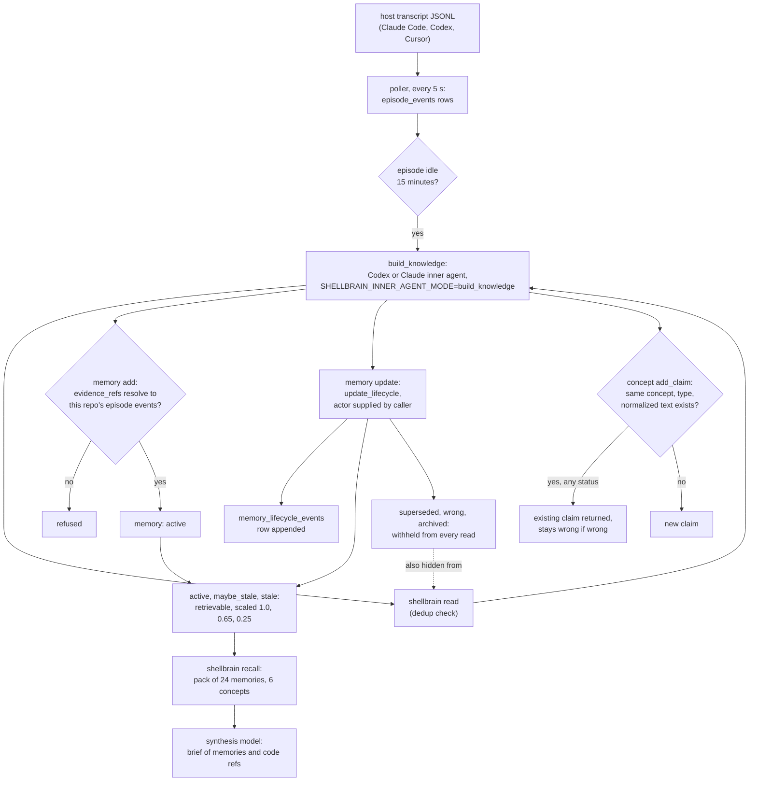

## 1. Executive Summary

ShellBrain is long-term memory for coding agents in Claude Code, Codex and Cursor: a Python CLI over a local Postgres with pgvector, keyed on the repository. A background poller copies host transcripts into episodes. Once a session goes quiet, a Codex or Claude *knowledge-builder* agent turns them into typed cases and a concept graph, writing through the same CLI and citing episode events. The working agent only calls `shellbrain recall`, which assembles a deterministic evidence pack and has a second model write a short brief. The lifecycle is the strong part: six statuses, three of them withheld by one predicate every read shares, each transition logged with its reason. The weak part is authority: the actor on a transition is a string the builder supplies, and both inner agents run Codex with the sandbox off.

What is notable is how much of the write discipline is enforced in code rather than in the prompt. `memory add` refuses a memory whose `evidence_refs` do not resolve to episode events visible to the same `repo_id`, so every memory points at the transcript event it came from (`app/core/use_cases/memories/reference_checks.py:66-103`). Every lifecycle change needs a rationale and at least one evidence item. The recall synthesiser's code references are rejected unless each appears verbatim in the evidence it was given (`app/core/use_cases/retrieval/build_context/execute.py:163-181`).

What is weak sits around the librarian. The route allowlist that confines it is `SHELLBRAIN_INNER_AGENT_MODE`, an environment variable its own shell inherits. Its write budgets are prompt text nothing counts. The duplicate check it is told to run goes through the same read that hides `wrong` memories, so a rejected memory is invisible at the moment the builder decides whether to write it again. The brief the working agent reads is model prose with no memory ids, so the agent cannot name the record it thinks is wrong.

No licence file is in the tree and `pyproject.toml` declares none, so the code is all rights reserved by default: it can be read and cited, not reused.

## 2. Mental Model

A memory is an immutable typed sentence: `problem`, `solution`, `failed_tactic`, `fact`, `preference` or `change` (`app/core/entities/memories.py:11-35`). A `solution` or `failed_tactic` must name its `problem`, and the link becomes a `structural_memory_relations` row (`solved_by`, `failed_with`). Beside the cases sits a concept graph: concepts with claims, relations, code *groundings* to anchors, and links to memories. Claims, relations, groundings and links carry the same six-value lifecycle as memories.

Memory is background-managed. The working agent is told never to write (`onboarding_assets/claude/skills/shellbrain/SKILL.md`). The writer is the knowledge builder, an inner Codex or Claude run launched against one episode's unprocessed event window. It reads the events, checks for duplicates with `read`, and writes with `memory add`, `memory update`, `concept add`, `concept update` and `scenario record`.

A memory is born `active` and treated as ground truth. Nothing ever deletes it. It stops being believed only when the builder issues `update_lifecycle` to `superseded`, `wrong` or `archived`, which removes it from every read. `maybe_stale` and `stale` stay retrievable at 0.65 and 0.25 of their score (`app/core/entities/memories.py:59-76`). Any status may move to any other. The only transition rule is that `superseded` names a replacement of the same kind in the same repository (`app/core/use_cases/memories/reference_checks.py:324-348`).

Supersession has two forms that do not meet. `fact_update_link` writes `superseded_by` and `explained_by_change` relations and leaves the old fact `active` (`app/core/use_cases/memories/update/execute.py:140-190`). A reader sees the old fact with its replacement attached as context, and only a separate `update_lifecycle` hides it.

## 3. Architecture

ShellBrain is one Python package with two console scripts, `shellbrain` and the installer entry point `_shellbrain-bootstrap` (`pyproject.toml`). Ports and use cases live under `app/core`, adapters under `app/infrastructure`, and wiring under `app/startup`. Storage is SQLAlchemy Core over Postgres 16 with the `pgvector` extension, migrated by Alembic across 41 migration files. The runtime database is a managed Docker container running `pgvector/pgvector:pg16` bound to `127.0.0.1` (`app/infrastructure/db/admin/provisioning/managed_local.py:44`), or an external DSN. Provisioning creates a separate app role and revokes `CREATE` on the public schema from it (`app/infrastructure/db/admin/privileges.py:22-37`).

Embeddings are local: `sentence-transformers/all-MiniLM-L6-v2` as ONNX at a pinned Hugging Face revision, 384 dimensions (`app/infrastructure/embeddings/local_provider.py:7-9`). The inner agents are external CLIs, `codex` or `claude` on `PATH`, or the Inception HTTP API for recall synthesis.

Three kinds of process run. The CLI invocation performs the operation and may start a per-repository poller (`app/infrastructure/process/episode_sync/`). The poller holds a lock file, syncs transcripts every 5 seconds and exits after 15 idle minutes (`app/infrastructure/process/episode_sync/poller.py:48-49`). The inner agents are subprocesses spawned by the poller or by `recall`. Separately, `shellbrain snapshot` copies the working tree into `.shellbrain/shadow.git`, and `scenario record` attaches a solution delta from those snapshots to a problem run.

### Deployment and ergonomics

Docker, Python 3.11 and a working `codex` or `claude` login are required. Storing anything needs Postgres. Storing anything *automatically* needs a model subscription, because the only intended writer is an inner agent. Recall returns an error envelope, not raw hits, when the synthesis provider fails (`app/entrypoints/cli/handlers/working_agent/recall.py:79-88`). Install is `curl -L shellbrain.ai/install | bash`, a hosted script not in the tree. The store is repairable by hand only through SQL. `admin backup create`, `verify` and `restore` produce logical backups and restore only into a fresh scratch database.

## 4. Essential Implementation Paths

**Capture.** `run_episode_poller` discovers host sessions for the repository and calls `sync_episode_from_host` for any whose transcript changed. It writes `episode_events` unique on `(episode_id, seq)` and `(episode_id, host_event_key)` (`app/infrastructure/process/episode_sync/poller.py:86-258`; `app/infrastructure/db/runtime/models/episodes.py:36-56`). Content is the JSON-serialised transcript event with no redaction pass.

**Extraction.** `_run_stable_builds_best_effort` plans builds for episodes whose watermark is stable and calls `execute_build_knowledge`. That takes an episode lock, skips when no events are past the last successful watermark, records a `running` row in `knowledge_build_runs`, and runs the provider (`app/core/use_cases/knowledge_builder/build_knowledge/execute.py:33-160`). The prompt is `_BUILD_KNOWLEDGE_PROMPT_TEMPLATE` plus a payload with the exact first command, a command lexicon and an output contract (`app/infrastructure/host_apps/inner_agents/prompt.py:65-200`, `254-381`).

**Write.** `execute_create_memory` validates, inserts the memory, upserts its embedding, attaches episode evidence and creates the structural problem link (`app/core/use_cases/memories/add/execute.py:23-121`). `execute_update_memory` dispatches to utility vote, association link, fact update link or lifecycle (`app/core/use_cases/memories/update/execute.py:46-101`).

**Retrieval.** `recall` and `read` both call `build_deterministic_graph_pack` (`app/core/use_cases/retrieval/deterministic_graph_recall.py:70-212`). It builds up to three query lanes, runs `retrieve_seeds` per lane and fuses with RRF. It then expands structural relations, discovers concepts by memory link and by concept FTS and vectors, traverses active high-signal links and relations, and selects the final memories under reserved-group budgets.

**Context assembly.** `execute_build_context` turns the pack into a synthesis pack, fits it to `max_input_tokens` (default 8,000, estimated at three bytes per token), and runs the synthesis model with `max_brief_tokens=500` (`app/core/use_cases/retrieval/build_context/execute.py:40-118`; `app/infrastructure/host_apps/inner_agents/prompt.py:203-226`).

**Correction.** `_write_lifecycle` loads the memory and replaces status, `updated_by`, `validated_at`, `invalidated_at` and `superseded_by_id`. It updates the row, appends a `memory_lifecycle_events` row and attaches the evidence (`app/core/use_cases/memories/update/execute.py:193-258`). The concept equivalent writes `concept_lifecycle_events` (`app/infrastructure/db/runtime/repos/relational/concepts_repo.py:384-432`).

**Route gate.** `_enforce_inner_agent_mode` rejects any command outside the allowlist for the mode named in `SHELLBRAIN_INNER_AGENT_MODE`. With the variable unset or empty, every route is open (`app/entrypoints/cli/runner.py:18-33`, `172-196`).

## 5. Memory Data Model

`memories` holds `id`, `repo_id`, `scope` (`repo` or `global`), `kind`, `text`, `created_at`, `status`, `validated_at`, `invalidated_at`, `superseded_by_id` and `updated_by`, with CHECK constraints on status and actor (`app/infrastructure/db/runtime/models/memories.py:16-38`). The covering index `idx_memories_read_visibility` is `(repo_id, status, scope, kind, id)`. `memory_lifecycle_events` carries `from_status`, `to_status`, a non-empty `rationale`, `actor` and `superseded_by_id` (`:40-73`). Embeddings sit in `memory_embeddings` with `model` and `dim`, and a query refuses to compare across a model or dimension mismatch (`app/infrastructure/db/runtime/repos/semantic/semantic_retrieval_repo.py:84-160`).

Provenance is a separate table pair. `evidence_refs` holds a source (`episode_event`, `anchor`, `memory`, `commit`, `transcript`, `test`, `manual`) deduplicated by a canonical hash per repository. `evidence_links` binds it to a target with a role such as `supports`, `contradicts` or `invalidated_by` (`app/infrastructure/db/runtime/models/evidence.py:18-103`). Relations between memories are `structural_memory_relations`, with their own status, and `association_edges`, with strength and observation counts over an append-only `association_observations`.

The temporal fields are record-time stamps. `invalidated_at` is set to the clock on a move to `stale`, `superseded` or `wrong`. `validated_at` is set to the clock on a move to `active` unless the caller supplies one (`app/core/use_cases/memories/update/execute.py:211-226`). Claims add `observed_at`, which the builder is told to set only when known. None of these is a validity interval.

## 6. Retrieval Mechanics

Each lane runs two arms. The keyword arm asks Postgres for FTS candidates with `websearch_to_tsquery` over an OR of normalised terms, capped at `max(limit * 25, 200)`, and reranks them with a Python BM25 over the visible rows (`app/infrastructure/db/runtime/repos/semantic/keyword_retrieval_repo.py:52-96`; `app/core/use_cases/retrieval/seed_retrieval.py:54-103`). When FTS matches nothing, the fallback loads the repository's entire visible corpus into Python. The semantic arm is pgvector cosine distance multiplied in SQL by the lifecycle weight, thresholded at 0.25 (`app/infrastructure/db/runtime/repos/semantic/semantic_retrieval_repo.py:52-82`; `app/core/entities/settings.py:20-23`).

Both arms carry `visible_memory_filters`: `repo_id` equality, `status IN (active, maybe_stale, stale)`, `scope IN (repo[, global])` and optional kinds (`app/infrastructure/db/runtime/repos/memory_visibility.py:11-27`). The same predicate gates structural-relation expansion (`app/infrastructure/db/runtime/repos/relational/read_policy_repo.py:100-123`). Graph-linked memories are hydrated by id and filtered in Python by `has_positive_retrieval_signal()` and `is_visible_in(repo_id)` (`app/core/use_cases/retrieval/deterministic_graph_recall.py:780-791`).

Those two definitions of `global` differ. The SQL predicate keeps `repo_id == repo_id`, so a global memory is only ever found by search from the repository that wrote it. `Memory.is_visible_in` returns true for any global memory from any repository (`app/core/entities/memories.py:177-180`), so one reached through a concept link crosses repositories. `test_learning_filters_apply_to_graph_linked_memories` asserts that crossing on a fake unit of work (`tests/operations/recall/execution/test_deterministic_graph_recall.py:883-904`). The builder's command lexicon never sets `scope`, so in intended use global memories are rare.

Concept claims are not filtered by status. `_claim_payloads` sorts active claims first and passes up to six per concept with their status. `_conflicts_from_concepts` lists stale, superseded and wrong claims as conflicts for the synthesiser (`app/core/use_cases/retrieval/deterministic_graph_recall.py:846-875`, `1036-1094`). A wrong claim reaches the model as a labelled wrong claim.

The working agent receives only the brief: `memories` as plain strings and up to three `code` locations (`app/infrastructure/host_apps/inner_agents/prompt.py:51-61`). Code locations are checked against the evidence text; memory strings are not.

## 7. Write Mechanics

Writes happen off the working agent's turn. The poller's idle threshold is `idle_stable_seconds`, default 900 (`app/core/entities/inner_agents.py:53`). A lesson from a session is therefore retrievable about fifteen minutes after the session goes quiet, plus the builder's run time, capped at 600 seconds by default (`app/startup/internal_agent_config.py:74-79`). Nothing re-reads the whole store; each build reads one episode window and issues targeted `read` calls.

The builder is an LLM with a prompt: one lesson per record, sentences of at most 20 words, proposals kept apart from completed and verified work, no guessed paths (`app/infrastructure/host_apps/inner_agents/prompt.py:65-110`). Code enforces the evidence requirement, the problem link on solutions and failed tactics, repo visibility of every referenced memory and event, and the same-kind rule for supersession. The prompt budgets, `max_shellbrain_reads` 8 and `max_write_commands` 20, are rendered into the payload and counted by nothing.

Deduplication of memories is the builder's judgement. `memory add` has no text or embedding check. Its duplicate search is `read`, which hides `superseded`, `wrong` and `archived` memories, so a lesson rejected once looks new when the next episode repeats it.

Concept claims behave differently by accident of their key. `add_claim` looks up `(repo_id, concept_id, claim_type, normalized_text)` with no status predicate and returns the existing row, and a total unique constraint on the same columns backs it (`app/infrastructure/db/runtime/repos/relational/concepts_repo.py:224-255`; `app/infrastructure/db/runtime/models/concepts.py:260-266`). A claim marked `wrong` stays `wrong` when re-added. The caller receives its id with no status, and the new evidence is attached as `supports` (`app/core/use_cases/concepts/update/execute.py:245-273`, `537-553`). Relations, groundings and memory links use partial unique indexes on `status = 'active'` instead, so those can be re-created after a rejection.

### Operational cost

Recall is synchronous and makes one model call per query. The default is Codex `gpt-5.6-luna` at low reasoning with a 90-second timeout, over a pack fitted to about 8,000 input tokens, returning at most 500 (`app/startup/internal_agent_config.py:64-72`). The brief is tool output, placed wherever the agent calls it, and does not sit in a cached prefix. Each `build_knowledge` run is a default `gpt-6-luna` at `xhigh` reasoning per quiet episode.

## 8. Agent Integration

Integration is a CLI and packaged instructions. The installer entry point adds a Claude Code `SessionStart` hook that exports caller-identity variables through `CLAUDE_ENV_FILE`, plus skill or rules files for Claude Code, Codex and Cursor (`app/infrastructure/host_apps/identity/claude_hook_install.py:100-111`; `onboarding_assets/`). The skill tells the working agent to emit an `SB:` line when its goal, surface, obstacle or hypothesis changes. It asks for `recall` with one self-contained question, `snapshot` after changing files, and never `read`, `events`, `memory`, `concept` or `scenario`.

That instruction is the only barrier for the working agent. With `SHELLBRAIN_INNER_AGENT_MODE` unset, every route including `memory update` is open to any shell. The inner agents get the variable from `_inner_agent_env` (`app/infrastructure/host_apps/inner_agents/codex_cli.py:405-416`). Claude is confined further by `--allowedTools "Bash(shellbrain *)"` (`app/infrastructure/host_apps/inner_agents/claude_cli.py:292-303`). Codex is launched with `--ask-for-approval never` and `--sandbox danger-full-access`, because its sandboxes block the TCP connection to Postgres (`codex_cli.py:29-31`, `243-266`). That applies to recall synthesis too, where the model is handed memory text derived from transcripts and told only to treat it as data.

Adapting it to another agent means a transcript parser under `app/infrastructure/host_apps/transcripts/` and an identity adapter; the memory core is host-neutral.

## 9. Reliability, Safety, and Trust

**Provenance is enforced at the write.** Each memory's `evidence_refs` must name episode events that exist and belong to the same repository (`app/core/use_cases/memories/reference_checks.py:66-103`). This ties a memory to what was said or run in a session. It does not establish that what was said was true; the builder is the only reader deciding that.

**The actor field records a claim, not an identity.** `actor` on a lifecycle update is an enum of `worker`, `librarian`, `manual` and `import`, taken from the payload (`app/core/use_cases/memories/update/request.py:125-134`). The builder is told to write `librarian`. The CLI help it is pointed at shows `"actor":"manual"` with the note *"Verified during review"* (`app/entrypoints/cli/parser/builder.py:150`). Nothing distinguishes a person's correction from the builder's.

**Prompt injection reaches a shell.** Transcripts are stored unredacted, the builder reads them, and recall passes memory text to Codex running with full access and no approval. The route allowlist is an environment variable in that shell, and an empty value disables it (`app/entrypoints/cli/runner.py:190-196`).

**Scope is inferred, not authenticated.** The repo id comes from registration or the git remote, and `--repo-id` overrides it on every command. On one machine that is a convenience; it is not a tenant boundary.

**Concurrency** is handled per episode: `acquire_episode_lock` and a stale-run check keep two builds of one episode apart (`app/core/use_cases/knowledge_builder/build_knowledge/execute.py:45-96`). Two episodes of one repository can build in parallel and write overlapping lessons.

**Deletion does not exist.** No application path deletes a memory, a claim or an event. A secret captured in a transcript stays in `episode_events`, and in any memory derived from it, until someone edits the database.

Capability marks:

- `trust_state` — awarded: `superseded`, `wrong` and `archived` are withheld by every read path. No `candidate` state exists, and claims carry statuses as labels only.
- `scope_enforced` — awarded: `repo_id` is on the row and in the SQL of both arms. The flag override and the concept-link path for `global` memories are the limits.
- `audit_log` — awarded: `memory_lifecycle_events` gets one row per transition with rationale and evidence. It is append-only by convention; the app role holds `DELETE` and no trigger guards the table.
- `tombstone` — awarded in its collided form, on concept claims only. The near miss is on memories: no value key exists, and the read the builder dedups with cannot see `wrong` rows.
- `negative_eval` — awarded; evidence in section 10.
- `human_review` — withheld. No surface holds a memory until a person acts: memories are born `active`, the `admin` command covers backups and the recall provider, and the `manual` actor is a value the producing agent may supply.
- `bitemporal` — withheld. `validated_at` and `invalidated_at` are transition stamps from the clock, and `observed_at` on claims is an observation time, not a validity interval.

## 10. Tests, Evals, and Benchmarks

Nothing was installed, built or run for this report; everything below is from reading the tests at the pin.

**The negative cases.** `test_keyword_lane_applies_visibility_scope_kind_and_status_filters_before_scoring` seeds five memories with the same text across two repositories, two scopes, two kinds and two statuses. It asserts the production keyword repository returns exactly `["repo-a-fact"]` with globals off and exactly `["repo-a-fact", "repo-a-global-fact"]` with them on (`tests/operations/read/execution/keyword/test_read_execution_keyword.py:149-192`). Exact-list equality makes the positive control part of the same assertion.

`test_read_excludes_non_positive_lifecycle_memories_from_direct_retrieval_and_all_expansion_paths` seeds archived, wrong and superseded memories on the direct, structural, fact-update, association and semantic paths. It asserts seven visible controls present and each excluded one absent (`tests/operations/read/execution/semantic/test_read_execution_semantic.py:204-403`). Its semantic lane runs through `DeterministicSemanticRetrievalRepo`, a test double that re-implements the status and scope predicate (`tests/operations/read/execution/conftest.py:328-400`). The direct-hit exclusions still hold on production code, because the excluded rows share the query's words and the keyword arm is not replaced.

**What runs.** The Postgres suites skip without `SHELLBRAIN_DB_DSN_TEST` (`tests/operations/_shared/integration_db_fixtures.py:68-75`). `scripts/run_tests` starts a Docker Postgres and exports the variable when it is unset, and CI runs that script, so the skip path is not the CI path.

**Other pinned behaviour.** The recall tests pin that archived links cannot discover a concept, that retired groundings cannot hide a current anchor, and that learning and recall select the same evidence (`tests/operations/recall/execution/test_deterministic_graph_recall.py:826-880`). The concept suite pins natural-key idempotency for an active re-apply (`tests/operations/concepts/execution/test_concept_update_use_case.py:111-137`).

**Missing.** No test re-adds a claim after marking it `wrong`, so the collided tombstone holds by a missing predicate that nothing pins. No test covers the environment-variable gate being emptied, or a working agent calling `memory update`. No benchmark, retrieval-quality eval or paper is committed; the searches are in the appendix.

## 11. For Your Own Build

### Steal

- **Make provenance a precondition of the write.** Refuse a memory whose evidence ids do not resolve to stored, same-scope source events. It costs one query and turns every memory into a pointer back to its origin.
- **Share one visibility predicate across every read.** One function building the SQL filter, used by the lexical arm, the vector arm, the fallback scan and the expansion step, removes the usual bug where one path forgets the status filter.
- **Check model-produced references against the input.** A substring check that each returned location appears in the evidence handed to the model is cheap and catches invented paths.
- **Separate the reader from the writer by role.** A working agent that only reads and a librarian that writes after the session is a clean split, as long as something other than prose enforces it.

### Avoid

- **A dedup read that shares the retrieval filter.** The builder needs to see rejected records when deciding whether to write; the working agent needs not to. One predicate for both makes rejection forgettable.
- **An allowlist the confined process can unset.** A route gate read from an environment variable in the agent's own shell, where an empty value means unrestricted, is advisory.
- **A caller-supplied actor on a correction.** If `manual` can be typed by the agent, the audit trail cannot answer who corrected a memory.
- **Two definitions of the same scope.** Write the scope predicate once, in the store, and hydrate by id through it.

### Fit

ShellBrain suits a single developer who already runs Claude Code or Codex daily, has Docker, and wants memory to accrue without asking the agent to save anything. It assumes a paid model subscription for both writing and reading, and a machine the operator controls, since the inner agents run with full filesystem access. It is not a team store: scope is a per-machine repository id with no authentication. Anyone whose threat model includes hostile text in transcripts should walk away until the synthesis step runs without a shell. The absent licence rules out adopting the code.

## 12. Open Questions

- Does a Codex inner agent, given hostile memory text, act on it under `danger-full-access`? That needs a run.
- How often does the builder re-extract a lesson that was marked `wrong`? That needs a populated store and several sessions.
- Is the collided behaviour of `add_claim` on `wrong` claims intended? Nothing in the tree says so.
- What does the hosted installer at `shellbrain.ai/install` run? It is not in the repository.
- How is `provider: auto` resolved when both `codex` and `claude` are installed? The resolver in `app/startup/internal_agents.py` was not traced in full.

## Appendix: File Index

- **Storage/schema:** `app/infrastructure/db/runtime/models/memories.py`, `concepts.py`, `evidence.py`, `experiences.py`, `episodes.py`, `knowledge_builder.py`; `migrations/versions/`
- **Write path:** `app/core/use_cases/memories/add/execute.py`, `update/execute.py`, `reference_checks.py`; `app/core/use_cases/concepts/update/execute.py`; `app/infrastructure/db/runtime/repos/relational/memories_repo.py`, `concepts_repo.py`
- **Retrieval path:** `app/core/use_cases/retrieval/deterministic_graph_recall.py`, `seed_retrieval.py`; `app/infrastructure/db/runtime/repos/memory_visibility.py`; `app/infrastructure/db/runtime/repos/semantic/`; `app/infrastructure/db/runtime/repos/relational/read_policy_repo.py`
- **Context assembly:** `app/core/use_cases/retrieval/build_context/execute.py`; `app/infrastructure/host_apps/inner_agents/prompt.py`
- **Background workers:** `app/infrastructure/process/episode_sync/poller.py`; `app/core/use_cases/knowledge_builder/build_knowledge/execute.py`; `app/infrastructure/host_apps/inner_agents/codex_cli.py`, `claude_cli.py`
- **CLI and integration:** `app/entrypoints/cli/runner.py`, `parser/builder.py`; `app/entrypoints/bootstrap.py`; `app/infrastructure/host_apps/identity/claude_hook_install.py`; `onboarding_assets/`
- **Tests/evals:** `tests/operations/read/execution/keyword/test_read_execution_keyword.py`; `tests/operations/read/execution/semantic/test_read_execution_semantic.py`; `tests/operations/recall/execution/test_deterministic_graph_recall.py`; `tests/operations/concepts/execution/test_concept_update_use_case.py`; `scripts/run_tests`; `.github/workflows/ci.yml`

### Recorded searches

Checked against the checkout at the pinned revision, each run once from the tree root.

- `git grep -nE 'delete\(|DELETE FROM' -- app` — telemetry cleanup and the session-state file store only; no path deletes a memory, claim or lifecycle event.
- `git grep -nE 'update\(memories\)|memory_lifecycle_events\.insert' -- app` — one UPDATE on `memories` (`memories_repo.py:105`) and one event insert (`:123`).
- `git grep -nE 'concept_claims\.insert' -- app` — one writer, `concepts_repo.py:243`.
- `git grep -nE 'normalized_text|\.text ==' -- app/core/use_cases/memories` — no match; memory add has no text dedup.
- `git grep -nE 'GRANT|REVOKE|CREATE TRIGGER' -- app migrations` — the app role is granted `SELECT, INSERT, UPDATE, DELETE`; no trigger.
- `git grep -nE 'max_write_commands|max_shellbrain_reads' -- app` — settings, request plumbing and the prompt payload; nothing counts invocations.
- `git grep -nE 'utility' -- app/core/use_cases/retrieval app/core/policies/retrieval app/infrastructure/db/runtime/repos/semantic` — no match; utility votes do not reach ranking.
- `git grep -niE 'redact|secret|api[_-]?key|scrub' -- app/infrastructure/host_apps/transcripts app/core/use_cases/episodes` — no match; transcripts are stored as parsed.
- `git grep -niE 'approve|pending|review' -- app/entrypoints app/core/entities/memories.py` — pending utility guidance and two CLI help examples; no review state or approve route.
- `git grep -nE 'semantic_retrieval_override_factory\(' -- tests/operations/read/execution/semantic/test_read_execution_semantic.py` — the semantic read tests replace the production repository at line 417.
- `git ls-files | grep -iE '(^|/)(licen[cs]e|copying|\.gitmodules)'` — no match; no licence file anywhere in the tree and no submodules.
- `git grep -niE 'licen[cs]e' -- pyproject.toml` — no match; the package metadata declares no licence.
- `git grep -liE 'arxiv|bibtex|@article|@misc|doi\.org|CITATION'` — no match; no paper or citation file.
- `git grep -niE 'renamed|formerly' -- README.md docs` — no match; no earlier name.

## History

**2026-09-28** — [`aacf66b297568378f430654f0215b9a2dfb86739`](https://github.com/cucupac/shellbrain/commit/aacf66b297568378f430654f0215b9a2dfb86739) — first reading, at the head of `main`, a commit dated 24 September 2026 and 27 commits after the one triage scored. Five marks: `tombstone`, `trust_state`, `scope_enforced`, `audit_log`, `negative_eval`. Screened before reading: no auto-run surface, 14 build-time execution points (`conftest.py` files), 2 dependency files inside the cooldown, every file in the depth-1 clone dating to the tip, and 2 unpinned surfaces. No LICENSE file. No agent-instruction file sits at the root; the `onboarding_assets/` skill and rules files were read as data. Read with `git grep` and `sed`; nothing installed, built or run.
