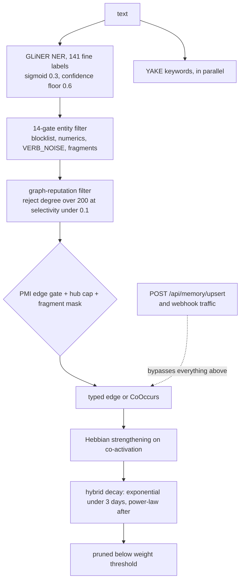

## 1. Executive Summary

Shodh-Memory is a persistent memory server for agents and robots with **no LLM
anywhere in the loop** — not at ingest, not at query. Apache-2.0, roughly
153,000 lines of Rust in `src/` (the repository is larger because it vendors a
spaCy model and a dependency parser), packaged to crates.io, npm, PyPI and
Docker, with MCP, HTTP, a TUI and a Zenoh/ROS2 transport for robotics.

The memory model is a Hebbian entity graph: text goes through NER and keyword
extraction, entities become nodes, co-occurrence and typed relations become
edges, edges strengthen with use and decay without it, and recall is vector plus
lexical search with spreading activation across the graph. Decay is
`src/decay.rs`'s hybrid model — exponential for the first three days, then
power-law — with the reasoning written out: pure exponential "produces a 'cliff'
effect", while "human memory follows a power-law for long-term retention".

**The reason this earns a report is `docs/graph-construction-audit.md`.**

It is a 677-line internal audit of the project's own graph construction, and its
evidence rules are the ones this atlas operates under, stated in its own words:

> Doc comments in this codebase are frequently stale, so nothing here rests on
> one. Where a comment and its code disagree, the contradiction is reported as a
> finding. Historical measurements … are **not** re-derivable from source and are
> therefore **not** cited — where a number would have been useful and cannot be
> re-derived, that is stated instead.

Every claim in it carries a `file:line`, and constants are resolved to numbers.
What it finds in its own codebase is the exact catalogue of defects this atlas
spends its time finding in others:

- **A dead resolver presented as the live one.** `src/entity_resolution.rs`'s
  `cluster()` and `resolve()` have "**zero production callers** — only
  `tests/entity_resolution_bridge.rs:80`. Its header … presents its head-block
  union-find as *the* resolver; it does not run."
- **A header contradicting its own code.** `ner.rs:10-12` says absent model
  assets fall back to the rule-based extractor; the code first attempts a
  network download unless `SHODH_OFFLINE` is set, "and only degrades if that
  also fails".
- **A quality gate the write path bypasses.** `POST /api/memory/upsert` runs a
  second path that "mints pure `CoOccurs` with **no PMI gate, no hub cap, no
  selectivity skip, no fragment mask and no typing**. Every PMI guarantee is
  void for upsert and webhook traffic."
- **A layer that returns zero on every call.** The mem↔mem co-activation
  function reads a flag defaulting to true; in that mode it only strengthens
  edges found through an index whose only writer is the branch the flag
  disables. "Default on ⇒ no key is ever written ⇒ the strengthen branch never
  finds anything ⇒ the function returns 0 for every call."
- **Silent skips.** Typing uses `try_read`; if a writer holds the user lock,
  "typing is skipped entirely for that memory, **silently**".

Section 4.4 is titled "Tier population is not measurable" and section 2.6 "The
read path filters nothing". The document ends with ranked, dated
recommendations.

**No other project in this atlas has published this.** The findings are more
severe than most reports here contain, and they are the project's own, with line
numbers, written by someone who went looking. A reader evaluating Shodh-Memory
should read that file before the README; a reader building anything should read
it as a model.

## 2. Mental Model

An `Experience` is captured and immediately decomposed by deterministic
components: a GLiNER-based neural NER emitting 141 fine labels rolled to four
coarse classes, YAKE keyword extraction running in parallel, an OpenIE relation
extractor, a dependency parser, and a gazetteer.

Entities become graph nodes. Pairs become edges — either typed relations or
plain co-occurrence — and the edge is where the epistemics live. Edges carry
weight, are strengthened by co-activation (Hebbian), decay by the hybrid model,
and sit in tiers with promotion rules between them.

Nothing is a "claim" that can be true or false. A memory is an experience; a
belief is an edge weight. That is a coherent position and it is why most of the
atlas's seven marks do not apply.

The dotted arrow is the audit's finding 2.4, drawn where the code puts it.

## 3. Architecture

A Rust server with one RocksDB instance **per user**, plus per-user graph
databases and vector indices, and a single shared database holding audit events
and cross-user state. A shared LRU block cache spans every instance to give "a
hard memory ceiling".

Ingest is fire-and-forget: `remember` spawns the graph pipeline
(`src/handlers/remember.rs:782`) and returns. The NER model is process-wide,
built once.

The dependency on vendored models is the operational fact that matters: a spaCy
model (`src/dep_parser/en_core_web_sm/model.json`) and a GLiNER bundle, with a
network download attempted when assets are absent unless `SHODH_OFFLINE` is set.
The audit's recommendation R3 — "Provision the spaCy bundle, or say loudly that
it is missing" — is about exactly this.

## 4. Essential Implementation Paths

**Ingest** — `src/handlers/remember.rs:412-442` (NER and YAKE in parallel) →
`AppState::process_experience_into_graph` (`src/handlers/state.rs:2589-3925`),
which the audit identifies as where graph *policy* actually lives, not
`graph_memory.rs`.

**Entity filtering** — `state.rs:2668-2862`: a fourteen-gate filter with a
~65-entry `VERB_NOISE` list, then `:2881-2899`, a graph-reputation filter
rejecting entities with degree over 200 at selectivity below 0.1.

**Edge creation** — the PMI gate, hub cap and fragment mask, audited in section
1.6.

**The bypass** — `MemorySystem::upsert` (`src/memory/mod.rs:8558-8617`) mints
co-occurrence edges directly.

**Decay** — `src/decay.rs`, applied to edges via `simulate_edge_aging` on a
production cadence of about six hours.

**Feedback** — `src/memory/feedback.rs`: implicit signals from entity overlap,
semantic similarity and user corrections, with "momentum-based updates with
type-dependent inertia to prevent noise from destabilizing useful memories".

## 5. Memory Data Model

RocksDB column families rather than tables. The structural pieces:

- **Experiences** with extracted entities, keywords and a type.
- **Graph nodes and edges** with weight, tier, selectivity and degree, indexed
  by a `mem_edge:` key for memory-to-memory links.
- **Feedback records** (`CF_FEEDBACK`) keeping up to 20 recent signals and 100
  context fingerprints per memory.
- **Audit events** in the shared database, keyed `{user_id}:{timestamp_nanos}`,
  carrying `event_type`, `memory_id` and `details`.
- **Watermarks** for incremental fact extraction, keyed per user.

There is no status column, no validity interval, no supersession pointer and no
rejected-value record. Correction happens by weight: a wrong edge decays,
competes and is pruned. That is a defensible model for an associative substrate
and it means a wrong fact fades rather than being retracted.

## 6. Retrieval Mechanics

Hybrid vector and lexical search (`src/memory/hybrid_search.rs`, Tantivy for the
lexical side) with graph retrieval by spreading activation
(`src/memory/graph_retrieval.rs`), no model at query time, and a query parser
handling temporal and structural constraints.

The audit's section 2.6 — "The read path filters nothing" — is the finding a
reader most needs, and its recommendation R2 is "A read-side floor on the
universe projection". Whatever the write path admits reaches ranking.

Isolation is by separate per-user RocksDB instances rather than by a predicate.
That is a real boundary — arguably a stronger one than a `WHERE` clause, since
no query can forget it — but it is not the mechanism the `scope_enforced` mark
describes, and no stored scope key is applied as a read filter. The mark is
withheld and the mechanism is worth more than the mark.

## 7. Write Mechanics

Fire-and-forget: the agent does not wait for the graph pipeline. A memory is
searchable when the pipeline lands, and the write path itself is cheap because
nothing calls a model.

The gates are the write mechanics. The fourteen-entity filter, the reputation
filter, the PMI gate, the hub cap and the fragment mask are all deterministic
and all documented with resolved constants in the audit. Their weakness is also
documented: they do not run on the upsert or webhook path, and the audit says
so with the line numbers.

Deletion is pruning by weight. There is no tombstone, no supersession and no
record of a removed edge beyond the audit event.

## 8. Agent Integration

MCP (`src/mcp.rs`), an HTTP API with SSE streaming, a TUI dashboard, a Zenoh
transport for ROS2 robotics, and packages on four registries. Two built-in web
UIs were retired and replaced with static tombstone pages at their old routes
(`src/handlers/router.rs:76`) — a small courtesy worth noting, since the usual
alternative is a 404.

## 9. Reliability, Safety, and Trust

**Audit log — awarded.** `AuditEvent { timestamp, event_type, memory_id,
details }` is written per user into a RocksDB column family keyed
`{user_id}:{timestamp_nanos}` in the shared database, with retention by both age
(`audit_retention_days`) and count (`audit_max_entries`), pruned in a two-pass
streaming rotation that flushes every 10,000 deletes to bound memory. Malformed
keys "sort first → get deleted", which is stated in a comment rather than left
to be discovered.

**Scope — withheld**, for the per-user-database reason in section 6.

**Trust state — no.** Edge tiers are about link quality, not about whether a
claim is believed, and the audit's own section 4.4 says tier population "is not
measurable".

**Tombstone, bitemporal, human review, negative eval — no.** The recall harness
(`src/recall_harness/`) is substantial — NDCG@k, recall@k, MRR, P@1, MAP, plus
dedicated harnesses for decay, forgetting, lineage, multi-hop, temporal and
ontology — and it *measures* rather than asserts. `SelectiveForgettingRow`
reports `important_retention`, `trivial_retention` and their `divergence` as a
curve against age; nothing asserts that particular material must not come back.

**The honest statement of risk is the audit itself**, and a reader should weigh
it as evidence in both directions: the defects it lists are real and severe, and
a project that finds and publishes them is more trustworthy than one whose
equivalent defects are found by an outside reader.

## 10. Tests, Evals, and Benchmarks

**No paper.** No arXiv reference, DOI or citation file; the cognitive claims cite
literature in prose and in module headers rather than a publication of their own.

The evaluation surface is unusual for a system with no LLM. `src/recall_harness/`
is an in-tree harness "designed to drive baseline-comparison CI gates and
embedder swap decisions", with a JSON report schema and baseline comparison, and
`benchmarks/` holds LoCoMo and LongMemEval converters, a LoCoMo gate builder and
layer/multiple-choice evaluators.

Two experimental designs are worth naming. The forgetting harness runs the
recall suite at increasing simulated ages and interprets the *shape*: "a FLAT
curve = stable memory … A sharply DECLINING curve = catastrophic forgetting … A
modest decline on a corpus with no reinforcement is expected and healthy; a
cliff is the failure mode." And the bridge-stressing curve deletes a share of
nodes uniformly at random versus bridge-first, **protecting gold memories from
deletion in both arms**, so the curves "isolate TOPOLOGY damage … from gold
availability". Holding the thing you are measuring constant across arms is
basic experimental hygiene and it is rare in this corpus.

**I ran nothing.** The screen flagged three auto-run surfaces — `.claude/hooks/`,
`.claude/settings.json` and `.mcp.json` — and fifteen dependency manifests
inside the seven-day cooldown, including `Cargo.lock`. No benchmark result is
committed to this tree.

## 11. For Your Own Build

### Steal

- **Write the audit, with the evidence rules at the top.** "Doc comments in this
  codebase are frequently stale, so nothing here rests on one" and "where a
  number would have been useful and cannot be re-derived, that is stated
  instead" are the two sentences that make a self-audit worth reading. Every
  claim gets a `file:line` and every constant is resolved.
- **Report where the policy actually lives.** The audit opens by saying graph
  policy is *not* in the file named after the graph — "An audit confined to
  `graph_memory.rs` misses the PMI gate, the hub cap, the fragment mask and the
  whole typing chain." Anyone auditing anything should start there.
- **Decay exponentially at first and by power law later.** The cliff that pure
  exponential produces is real, the module shows the numbers, and the two-phase
  model is a few lines.
- **Hold the measured thing constant across arms.** Protecting gold memories
  from deletion in *both* the random and targeted arms is what turns a
  destruction test into a measurement of topology.
- **Interpret a curve's shape, not a single number.** "A cliff is the failure
  mode" is a better acceptance criterion than a threshold on recall@10.
- **Leave a tombstone page at a retired route.** Cheaper than a 404 and it tells
  the next person what happened.
- **Bound your audit log with a two-pass rotation.** Count, compute the excess,
  then stream deletions with a batch flush — and decide deliberately what
  happens to malformed keys.

### Avoid

- **Do not let a second write path bypass your gates.** The PMI gate, hub cap,
  fragment mask and typing chain are the whole quality story, and `upsert` and
  every webhook skip all of them. A gate that one route honours is a gate that
  reports quality it does not have.
- **Do not default a flag to the value that makes its feature inert.**
  `SHODH_COACT_STRENGTHEN_ONLY` defaults to true, and the only writer of the
  index it reads is in the branch the flag disables — so the counter it feeds is
  always zero.
- **Do not `try_read` on a path whose failure is invisible.** Skipping typing
  when a writer holds the lock is a silent quality loss that no metric catches.
- **Do not let a header describe a resolver that has no callers.** Two resolvers
  exist, one is dead, and its header presents it as the live one.
- **Do not ship a read path that filters nothing.** Whatever survives ingest
  reaches the user; the audit's own R2 is to add a read-side floor.

### Fit

This suits someone who wants an associative memory with zero inference cost and
zero data egress — a robotics deployment, an offline agent, a privacy-hard
environment — and who is prepared to run a large Rust service with vendored
models. The no-LLM position is the whole design and it is consistent: nothing
here needs a key.

It is the wrong choice if you need correction semantics. There is no trust
state, no supersession, no tombstone and no review surface; a wrong memory fades
if nothing reinforces it, and reinforces if something does.

Read the audit first either way. It is the most useful document in this
repository and one of the most useful in this atlas.

## 12. Open Questions

- **Have the audit's findings been fixed?** The document is scoped to a branch
  (`fix/reinforce-tracked-unification`) and dates its recommendations; which of
  them landed by this commit on `main` was not traced, and section 2.1 is
  already marked "FIXED on this branch".
- **What does the graph look like with the PMI gate voided?** The audit says
  co-occurrence "dominates by construction, not by accident" and that tier
  population is not measurable — so the shape of a real store is not knowable
  from the code.
- **Does the recall harness run in CI?** It is described as designed to drive
  CI gates; no committed baseline or report was found.
- **What replaced the dead entity resolver?** The audit says only one resolver
  runs; which one, and whether its behaviour matches the dead one's documented
  intent, is the follow-up question.

## Appendix: File Index

**The self-audit** — `docs/graph-construction-audit.md` (the evidence rules at
`:1-13`, where policy lives `:17-27`, the NER chain `:29-64`, the dead resolver
`:65-90`, the PMI gate `:163-194`, the upsert bypass `:276-288`, the inert
co-activation layer `:289-302`, "the read path filters nothing" `:303-328`,
tier population `:526-540`, ranked recommendations `:541-`)

**Graph construction** — `src/handlers/state.rs:2589-3925`
(`process_experience_into_graph`, the fourteen gates at `:2668-2862`, the
reputation filter `:2881-2899`), `src/graph_memory.rs`,
`src/memory/mod.rs:8437-8619` (`upsert`)

**Extraction** — `src/embeddings/ner.rs`, `src/embeddings/gliner.rs`,
`src/openie.rs`, `src/dep_parser/`, `src/gazetteer/`, `src/relation_typer.rs`,
`src/entity_type/entity-type-schema.json`, `src/entity_resolution.rs` (the dead
one)

**Decay and feedback** — `src/decay.rs` (the hybrid model and its rationale),
`src/memory/feedback.rs` (`CF_FEEDBACK`, momentum updates)

**Retrieval** — `src/memory/hybrid_search.rs`, `src/memory/graph_retrieval.rs`,
`src/memory/query_parser.rs`, `src/relevance.rs`, `src/similarity.rs`

**Audit** — `src/handlers/state.rs:483` (the in-memory deques), `:503-570`
(`rotate_user_audit_logs`), `src/handlers/types.rs:27` (`AuditEvent`)

**Evaluation** — `src/recall_harness/` (`metrics.rs`, `fixtures.rs`,
`forgetting_harness.rs`, `lineage_harness.rs`, `multihop.rs`,
`temporal_harness.rs`, `ontology_harness.rs`, `report.rs`), `benchmarks/`

**Integration** — `src/mcp.rs`, `src/server.rs`, `src/handlers/router.rs`,
`src/zenoh_transport/`, `src/integrations/`, `src/cli.rs`

## History

**2026-08-09** — [`cac4c0b387d55e0549636e031811fd3a7eec4d5f`](https://github.com/varun29ankuS/shodh-memory/commit/cac4c0b387d55e0549636e031811fd3a7eec4d5f) — first reading. Screened before reading: three auto-run surfaces (`.claude/hooks/`, `.claude/settings.json`, `.mcp.json`), build-time execution in `front/build.rs` and an npm manifest, and fifteen dependency manifests inside the seven-day cooldown including `Cargo.lock`. The tree was read, never built, and no test or harness was run.
