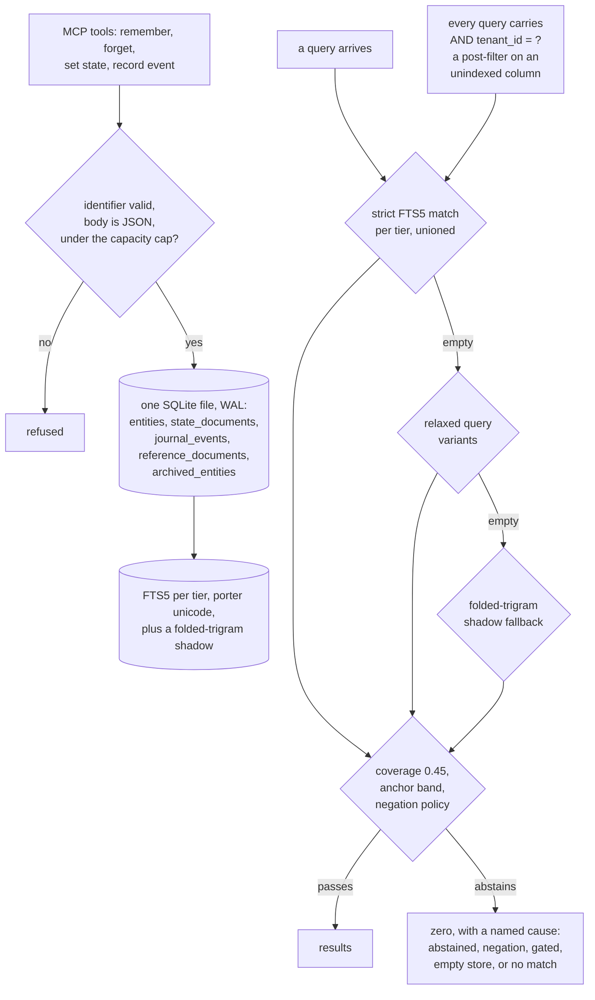

## 1. Executive Summary

Sibyl Memory is a local memory engine for agents — MIT, 68 commits between 20
May and 7 September 2026 by four authors, 16,000 lines of Python across five
published packages beside 18,948 lines of tests holding 1,055 test functions.
The screen found no auto-run surface, three build-time execution points and four
manifests inside the seven-day cooldown; nothing was installed or run, and the
read was made from a full clone. The tagline is *"file-based · zero
embeddings"*, and both halves are true: the store is one SQLite file, and a
search for any embedding, vector or ANN library across the source returns three
hits, all of them prose.

**The engine is here, not behind a service.** The schema, the writers, the FTS5
index, the trigram shadow, the ranking and the migrations are all in the client
package; there is no web framework anywhere in the tree, and the Docker
entrypoint is the stdio MCP server rather than a daemon. What is remote is
billing: a capacity check at the storage boundary and a usage heartbeat, neither
of which carries memory content.

**Three marks.** `scope_enforced` on a tenant key that is `NOT NULL` on every
base table, an unindexed column on every FTS5 table, and present in the WHERE
clause of every read — exact lookups, all four cross-tier searches and both
shadow queries. `human_review` on a skill-proposal queue where accepting
materialises the content into a reference document and rejecting materialises
nothing. `negative_eval` on four kinds of exclusion case, the best of which
seeds a prompt-injection payload as a real row and asserts three different
search surfaces do not return it.

**The most unusual thing here is what a zero result says.** Most stores return an
empty list and let the caller guess. This one attaches one of five causes —
abstained on a term, abstained on a negation, gated by a coverage or anchor
threshold, an empty store, or a genuine no-match — surfaced on the MCP wire and
as an attribute on the LangGraph store. A retrieve-then-verify layer sits over
the search with a coverage threshold of 0.45, an anchor band, a
document-frequency abstention and a negation policy that abstains rather than
answering. Distinguishing *I have nothing* from *I decline to answer this* is what the
verdict channel exists for, and it is the reason to read this repository.

Four findings sit against the design. **Tenant isolation is a post-filter, and
the authors say so.** The lock comment above the search query states that the
tenant clause is the only thing keeping the query inside the caller's tenant,
that the column is unindexed so this is a trailing filter rather than
index-enforced isolation, that index-level enforcement needs a migration that
would break existing databases, and that the situation is flagged for review and
guarded meanwhile by the comment and a named regression test. That is a better
disclosure than most projects manage, and the weakness is real.
**Four of twelve declared tables have no writer** — entity relations, revenue
events, error events and flagged actors — and the last is read by a lint check
using a column name the table does not have, inside a bare except that has kept
the mismatch invisible. **The review queue has no interface.** No MCP tool, CLI
subcommand or adapter reaches it, while a changelog entry and the schema comment
both name a `sibyl learn review` command that does not exist.
**The README understates the outbound calls.** It says tier verification is the
only one; a usage heartbeat fires every fifteen operations or ten minutes. The
project's own LangGraph README discloses both channels correctly, and the
capacity module's docstring says in as many words that an earlier, narrower
description of its payload understated it.

## 2. Mental Model

A memory has **a tier, and the tier decides its shape**. Warm entities are the
named things — a category, a name and a JSON body, unique per tenant. Hot state
is a keyed document that is replaced rather than versioned. Cold journal events
are append-only with a timestamp and four optional payloads. Reference documents
are text. Archived entities are bodies kept with a reason.

Retrieval is **lexical and laddered**. A strict FTS5 match per tier, unioned and
ordered by a proximity bucket before rank; if that comes back empty, relaxed
query variants; if those are empty too, a folded-trigram shadow that catches
misspellings and script differences. Over all of it sits a verification layer
that would rather abstain than answer badly.

Nothing decays, nothing consolidates and nothing summarises. A memory changes
because someone upserted it, and stops being current because someone archived
it.



## 3. Architecture

Five packages, and the ratio between them is the story. `sibyl-memory-client`
(8,233 lines) is the whole engine — storage, schema, FTS, the shadow, ranking,
the multi-record verification layer, the learner, the linter and the capacity
gate. `sibyl-memory-cli` (3,788) does activation, tier, setup and migration plus
three read-only memory commands. `sibyl-memory-hermes` (2,482) is a provider and
a plugin adapter. `sibyl-memory-mcp` (871) is eight stdio tools.
`sibyl-memory-langgraph` (626 lines of source against 5,102 lines of tests and
331 test functions) is a `BaseStore` adapter.

The schema is 369 lines: twelve base tables, five FTS5 virtual tables, and a
trigram shadow whose DDL is generated at runtime. Its header calls it a port of
a canonical Postgres schema, and the Docker ignore file excludes a private
schema directory that is not in this tree — so a fuller schema exists elsewhere,
while the SQLite port that ships is self-contained.

### Deployment and ergonomics

- **What has to run:** Python. The client's only third-party runtime dependency
  is a certificate bundle.
- **Fully local and offline:** the memory is. Two endpoints exist for tier
  checking and usage heartbeats, and neither carries content.
- **Hand-repairable:** one SQLite file with a readable schema.
- **Install:** five PyPI packages, or the Docker image whose entrypoint is the
  stdio server.

## 4. Essential Implementation Paths

- **Open the store.** `storage.py:181-246` creates the directory 0700, refuses a
  symlinked or hardlinked database or sidecar (`:191-212`), applies the schema,
  and tightens the file to 0600 (`:246`).
- **Write an entity.** `client.py:886` validates the identifiers and the body,
  runs the capacity gate (`:914`) — the only network-capable step on the path —
  takes a `BEGIN IMMEDIATE` transaction (`:915`), selects by tenant, category
  and name, then inserts (`:922-926`) or updates (`:929-934`), lets the FTS and
  shadow triggers maintain the indexes, re-reads the committed footprint under
  the write lock (`:936`) and commits.
- **Search a tier.** `client.py:1290-1369` matches the entities FTS table joined
  by rowid with the tenant clause, orders by rank, then re-ranks by a proximity
  bucket that reorders without dropping.
- **Search across tiers.** `client.py:1399-1542` runs one match per tier with the
  journal capped to a quarter of the limit, unions and sorts, then falls to
  relaxed variants and finally to the trigram shadow.
- **Verify before answering.** `multi_record.py:444` applies the coverage
  threshold (`:333`, `:747`), the anchor band and its high-water mark (`:334`,
  `:757`), a document-frequency abstention and the negation policy (`:297`,
  `:701`).
- **Name the zero.** `verdicts.py:80-108` defines the five causes; the MCP server
  puts one on the wire (`server.py:679-681`) and the LangGraph store exposes the
  last one as an attribute (`store.py:535-540`).
- **Propose and review a skill.** `learning.py:420-421` filters candidates
  against the pending slugs (`:683-690`); accepting stamps the row and writes the
  content into a reference document (`:552-558`, `:495`, `:522-534`); rejecting
  stamps the row (`:581-587`).

## 5. Memory Data Model

Five row shapes, described in the matrix, of which the warm entity is the one a
`UNIQUE (tenant_id, category, name)` constraint makes addressable. The
`skill_proposals` table is the sixth shape and the only one with a constrained
status vocabulary.

**Temporal:** `created_at` and `updated_at` on an entity, both record time. The
journal is the opposite case: a caller may supply the event timestamp and the
table has no second column for insertion time, so a supplied timestamp replaces
record time rather than sitting beside it. `bitemporal` withheld; a search for
any validity-time column name across the Python returns one hit and it is a
false positive on a test about valid TOML.

**Trust:** the entity status is a free-form nullable string written from caller
input and read back verbatim, filtered only when the caller passes one. No value
withholds. `trust_state` withheld — the proposal status does withhold and does
filter, but it governs proposals rather than stored memory, and an accepted
proposal becomes an ordinary reference document with no status at all.

**Scoping:** a tenant on every table and every query. `scope_enforced` earned.

**Tombstone:** withheld — see section 9.

**Four tables with no writer.** Entity relations, revenue events and error
events have no insert anywhere. Flagged actors is the fourth and the most
interesting: it has no writer either, and the linter's freshness check queries it
for a column named `identifier` when the table declares an actor handle and an
actor address, inside a bare `except Exception: pass`. The check is documented in
the linter's own rule table, has never run, and could not have passed.

## 6. Retrieval Mechanics

FTS5 with a porter unicode tokeniser over four external-content tables, plus a
folded-trigram shadow generated at runtime for the cases a stemmer misses. The
strict pass runs one match per tier and unions them, ordering by a proximity
bucket first so that a document where the query terms sit close together
outranks one where they are scattered, then by FTS rank, then by tier.

What sits above it is the part worth studying. The multi-record layer is a
retrieve-then-verify design: it will refuse to answer when coverage of the query
terms falls below a threshold, when no anchor term clears its band, when a term's
document frequency is zero, or when the query contains a negation it is not
willing to reason about. Every refusal is typed, and the type reaches the caller.

**Failure modes.** The tenant clause is a post-filter, so an FTS match scans
across tenants and discards afterwards — correct, and dependent on one clause
the authors have locked with a comment. The proximity re-rank reorders within
the limit rather than reaching past it, so a better match beyond the cut is not
recovered. And the shadow fallback only fires on an empty head, so a poor
non-empty result is not improved.

## 7. Write Mechanics

**Nothing extracts.** The model supplies the body; a JSON-validity check and an
identifier check are the only content gates. The one place a model could enter —
the learner's summariser — takes an inference function the caller must supply,
and nothing in this repository supplies one; both summariser classes are labelled
stubs in their own section headers.

**Upsert, archive, delete.** An entity is replaced in place by its unique key.
Archiving copies the body into the archive table with a reason and removes the
original. Deleting is a hard `DELETE` that leaves nothing.

**The same verb means two things.** The MCP `memory_forget` archives and is
documented as not destroying; the Hermes provider's `forget` hard-deletes, and
the Hermes memory tool's remove action routes to the destructive one. A reader
moving between the two surfaces will not expect that.

### Operational cost

- A write is one immediate transaction plus trigger maintenance, and at the
  capacity boundary one four-second HTTP call.
- A read is one to four FTS queries plus the verification layer, all in process.
- A heartbeat fires every fifteen operations or ten minutes.

## 8. Agent Integration

Eight stdio MCP tools, four of them writing. The Hermes provider hooks turn
context and remember, and the LangGraph adapter maps a namespace tuple onto the
entity category so a `BaseStore` consumer gets tenant and namespace scoping.

The human surfaces are the CLI's three read-only memory commands and the SQLite
file. The review queue is not among them.

## 9. Reliability, Safety, and Trust

**Scope — awarded, with the authors' own caveat carried forward.** The key is on
every table and in every query, including both shadow queries and the LangGraph
prefix filter. The lock comment is the right way to ship a known weakness: it
names the mechanism, explains why the fix is deferred, forbids the edits that
would break it, and names the regression test that guards it.

**Human review — awarded, narrowly, and the qualifications matter.** A proposal
carries required evidence, a confidence and a constrained status; accepting
writes the content into a reference document and rejecting writes nothing. But
the four methods are paid-tier gated, and nothing in any of the four adapter
packages calls them — a reviewer must import the library. The changelog and the
schema both name a `sibyl learn review` command; the CLI's subcommand list does
not contain it.

**Negative evaluation — awarded.** Four kinds of case, and the injection one is
the strongest: a real row carrying a prompt-injection payload sits in the store
and three different search surfaces are each asserted not to return it, with the
legitimate entity asserted present.

**Tombstone — withheld, and the near-miss is one query away.** A rejected skill
proposal is a durable, value-keyed record of something a person refused, with
the reason in a review note. The detector's de-duplication filter selects only
pending proposals, so a slug that was rejected is not in the exclusion set and
the next run proposes it again. The mechanism, the row and the reason all exist;
the filter looks at the wrong status.

**Trust state — withheld.** The entity status is free-form and filtered only on
request. The proposal status has the right shape and governs the wrong thing,
and its `superseded` value has no writer at all.

**Bitemporal — withheld.** Record time only, and on the journal a
caller-supplied timestamp replaces it rather than joining it.

**Audit log — withheld.** The journal is append-only and is agent content rather
than a mutation record: its only two producers are an agent-invoked tool and a
Hermes turn hook, and no entity write, state write, archive or delete records
itself. A hard delete leaves nothing behind. The learning-runs table is an
append-only log of detector runs rather than of memory mutations.

**What the README says and what the code says.** Three disclosure gaps, all
checkable and all contradicted somewhere inside the project itself. The README
says tier verification is the only outbound call; a heartbeat fires on ordinary
use, and the LangGraph README discloses both. The README enumerates the capacity
payload as four fields; the capacity module enumerates six and closes with a
sentence saying the earlier, narrower description understated it. And the
tier diagram draws five directory paths that do not exist — they are table
names in one file.

**No CI runs the tests.** Two workflows exist: a manually dispatched macOS
framework smoke test and a mirror job. A search for pytest across the workflow
directory returns nothing. There are 1,055 test functions and nothing executes
them automatically.

## 10. Tests, Evals, and Benchmarks

1,055 test functions in 90 files and 18,948 lines against 16,000 lines of
source. The distribution is unusual: the LangGraph adapter has 626 lines of
source and 331 test functions, covering `BaseStore` conformance, namespace
semantics, adversarial fuzzing, scale and isolation. The client's 403 tests are
dominated by search behaviour — proximity re-ranking, script-aware tokenising,
the trigram shadow, coverage gates, phrasing invariance — plus two dated audit
sweeps and a capacity suite that mocks the endpoint as a fake server rather than
touching a socket.

A verdict-contract test exists in all five packages, each asserting that no
zero-row response ships an OK verdict and that cause strings are not re-declared
outside the module that owns them. That is a contract test for the feature this
report considers the system's best idea, replicated across every surface.

**No benchmark artifact exists.** A release-notes document states that every
number in it comes from a run recorded in this repository and that nothing is
projected or inferred; no run record, harness, dataset or result file is in the
tree. The README carries a LongMemEval badge and a comparison claim against six
named systems, with an off-repository blog link as the only pointer. The linter's
expected schema version is two while the shipped schema is four.

## 11. For Your Own Build

### Steal

- **Name the cause of a zero result.** Five typed causes on the wire turn *I
  found nothing* into *I abstained on a negation*, and the difference decides
  whether the agent should ask again, rephrase, or accept the absence.
- **Abstain rather than answer a negation.** A store that will not reason about
  *not* is more useful than one that quietly ignores the word.
- **Put a contract test on the verdict in every surface package.** Five copies
  asserting no empty result carries an OK is how a contract survives four
  adapters.
- **Refuse to open a symlinked database file or sidecar.** Two checks at open
  time close a class of local attack most local-first tools never consider.
- **Document a known isolation weakness in a lock comment.** Naming the
  mechanism, the deferred fix, the forbidden edits and the guarding test is
  better engineering practice than a silent TODO, and better than shipping the
  claim without the caveat.
- **Ladder the fallback: strict, relaxed, then fuzzy.** Only firing the fuzzy
  arm on an empty head keeps the common case exact.

### Avoid

- **A review queue with no way to reach it.** The table, the methods and the
  status vocabulary are all built; no tool, command or adapter calls them, and
  the command the documentation names does not exist.
- **A de-duplication filter that ignores what was rejected.** Filtering
  candidates against pending proposals only means a rejected slug returns on the
  next run, which is the one thing a rejection should prevent.
- **Tables nobody writes**, especially one that a shipped check reads with a
  column name it does not have, inside a bare except.
- **A privacy claim narrower than the code.** The heartbeat is disclosed in one
  README and not the other, and the capacity module's own docstring says the
  earlier payload description understated it.

### Fit

Right for a local agent memory where the data must stay in one inspectable file,
retrieval must work airgapped, and knowing *why* a search returned nothing
matters more than squeezing the last point of recall. Wrong if you need a memory
that decays or consolidates, a stored state that withholds a record from being
treated as true, a validity axis, a mutation audit, or index-enforced tenant
isolation rather than a post-filter.

## 12. Open Questions

- Will the proposal de-duplication filter learn to see rejections? One status
  value in one query is the difference between a rejection that holds and one
  that is re-proposed next run.
- What reaches the review queue? The methods exist and no surface calls them.
- Will the flagged-actors check ever run? It reads a column the table does not
  have, behind an except that hides the mismatch.
- Which forget is the real one? Archive and hard delete share a verb across two
  surfaces, and only one of them is recoverable.

## Appendix: File Index

| Path | Lines | What it holds |
| --- | --- | --- |
| `sibyl-memory-client/src/sibyl_memory_client/schema.sql` | 369 | Twelve base tables, five FTS5 tables; entities (27-37), skill proposals (298-321), the shadow rationale (352-367) |
| `.../client.py` | 1,879 | Writers (886-1187), readers (940-1086), search (1290-1542), the strict ladder (1606-1789), the tenant lock comment (1332-1339) |
| `.../storage.py` | 763 | Open, schema, the symlink refusals (191-212), permissions (213, 246) |
| `.../shadow.py` | 1,268 | The runtime trigram shadow and its triggers |
| `.../multi_record.py` | 779 | The retrieve-then-verify layer, the coverage and anchor gates, the negation policy |
| `.../verdicts.py` | — | The five zero-result causes (80-108) |
| `.../learning.py` | 1,201 | Proposal detection, the pending-only filter (683-690), accept (552-558) and reject (581-587) |
| `.../lint.py` | — | The rule table, the flagged-actors check (359-381), the stale schema version (57) |
| `.../_capcheck.py`, `_heartbeat.py` | 855, — | The capacity gate and its endpoint (74), the usage heartbeat (36) |
| `sibyl-memory-mcp/src/sibyl_memory_mcp/server.py` | 824 | Eight tools (486-815) and the verdict on the wire (679-681) |
| `sibyl-memory-langgraph/src/.../store.py` | — | The `BaseStore` adapter, namespace as category (158-159), the verdict attribute (535-540) |
| tests | 18,948 in 90 files | 1,055 test functions; the injection case, the isolation cases, the verdict contracts |

**Searches recorded for the negative claims**

```sh
rg -ni 'embedding|faiss|hnsw|chromadb|qdrant|pgvector|sentence_transformers' -g '*.py' --glob '!*/tests/*' .   # 3, all prose
rg -ni 'valid_from|valid_to|observed_at|effective_at|as_of|bitemporal' -g '*.py' .   # 1, a false positive on valid TOML
rg -n 'audit_log|audit_trail|mutation_log|op_log' -g '*.py' --glob '!*/tests/*' .    # 0
rg -n 'tombstone|rejected_value|denylist|blocklist' -g '*.py' --glob '!*/tests/*' .  # 0
rg -n 'INSERT INTO flagged_actors|INSERT INTO entity_relations' .                    # 0: four tables have no writer
rg -n 'superseded' -g '*.py' --glob '!*/tests/*' .                                   # 0: the status value has no writer
rg -n 'skill_proposal|accept_skill|reject_skill' -g '*.py' sibyl-memory-mcp sibyl-memory-cli sibyl-memory-hermes sibyl-memory-langgraph  # 0: no surface reaches the queue
rg -ni 'fastapi|flask|uvicorn|starlette|http.server' -g '*.py' .                     # 0: the engine is local, not a service
rg -n 'pytest' .github/                                                              # 0: no CI runs the suite
```

## History

**2026-09-08** — [`761bfc64799f637dd1ff70fbd07bdb997c2fd806`](https://github.com/Sibyl-Labs/Sibyl-Memory/commit/761bfc64799f637dd1ff70fbd07bdb997c2fd806) — first reading, at the head of `main`, one day after the last commit. Screened before anything was read: no auto-run surface, three build-time execution points, four manifests inside the seven-day cooldown; nothing was installed or run, and the read was made from a full clone. The first question settled was whether the memory implementation is here or behind a hosted service: it is here, with no web framework in the tree and the Docker entrypoint a stdio server, and what is remote is a capacity gate and a usage heartbeat carrying no content. Three marks. `scope_enforced` rests on a tenant key in every read query, and the report carries the authors' own lock comment saying it is a post-filter on an unindexed column rather than index-enforced isolation. `human_review` rests on the skill-proposal accept and reject paths, with both qualifications stated — paid-tier gated, and reachable from no shipped interface. `negative_eval` rests on four kinds of exclusion case including a prompt-injection payload asserted absent from three search surfaces. `tombstone`, `trust_state`, `bitemporal` and `audit_log` were each examined and withheld, the first with its near-miss in section 9. The reading covers the schema, the write and search paths, the verification layer, the verdict channel and the learning queue; the CLI's activation and tier machinery, the Hermes plugin adapter and the capacity protocol were treated as context.
