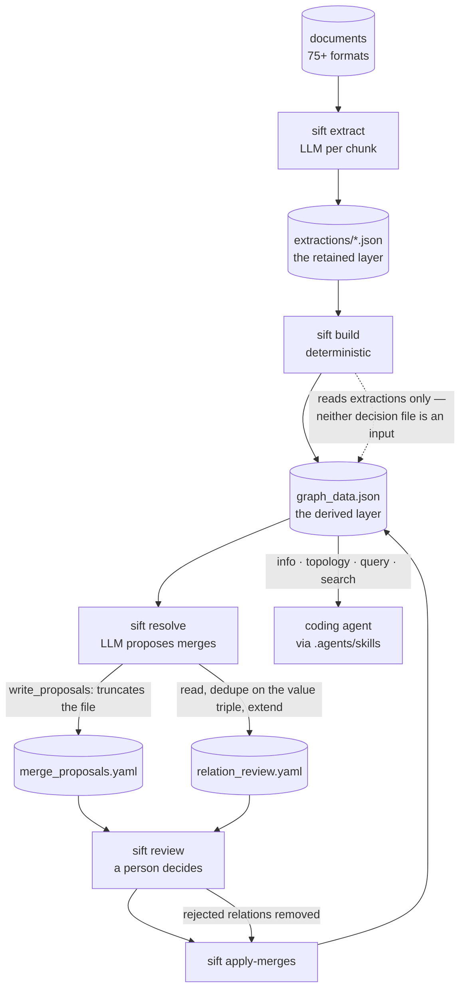

## 1. Executive Summary

sift-kg is a Python CLI that turns a folder of documents into a knowledge graph:
ingest (75+ formats, optional OCR) → LLM extraction of entities and relations
per chunk → deterministic graph build with community detection → LLM-proposed
entity merges → an interactive human review → apply → export or browse.

It is in this atlas because of the last mile rather than the pipeline. The
repository ships `.agents/skills/sift-kg/SKILL.md`, which tells a coding agent
that the graph is *"your persistent, structured memory of the user's world"*,
that it should orient from `sift topology` at session start, and that it should
query the graph before answering anything about the user's projects. An
extracted relation can be false, carries an id, and there is a surface for a
person to adjudicate it — which is the whole bar.

**Strongest:** the raw layer is kept. Extraction output is written per document
to `extractions/`, every entity node carries `source_documents`, every relation
carries an `evidence` quote, and the graph is rebuilt from those extractions
rather than mutated in place. That is
[evidence before belief](../../patterns/evidence-before-belief/) implemented
without being named, and it makes the derived layer honestly disposable.

**Weakest, and the finding worth the report:** the corrections live downstream
of the artifact that regenerates them. Merge decisions and relation rejections
are applied to `graph_data.json`; `sift build` reconstructs `graph_data.json`
from `extractions/` and reads neither decision file. The bundled skill instructs
the agent to run `sift extract` and `sift build` whenever the user adds
documents — so the documented workflow for growing the memory is also the
documented workflow for reverting every human judgement in it. Both persistence
semantics are present in one function, twenty lines apart: the relation-review
branch reads its file, dedupes on the value triple and extends it; the merge
branch overwrites.

## 2. Mental Model

A memory is an **entity** or a **relation** the model extracted from a document
chunk. Neither is authored by the agent; the agent reads.

```text
                 sift extract                    sift build
   document ──────────────────► extraction ──────────────────► entity / relation
                (LLM, per chunk)   (retained)     (deterministic)      │
                                                                       │
                                              sift resolve (LLM)       │
                                       DRAFT merge proposal ◄──────────┘
                                                │
                                    sift review │  a person decides
                                    ┌───────────┴───────────┐
                              CONFIRMED                 REJECTED
                                    │                        │
                        sift apply-merges          relation removed from graph
                                    │                        │
                                    └────────► graph_data.json ◄─────────┐
                                                              │          │
                                            next `sift build` regenerates
                                            this file from extractions ──┘
```

The status enum is the near-miss. `StatusType = Literal["DRAFT", "CONFIRMED",
"REJECTED"]` in `src/sift_kg/resolve/models.py` is a discrete state rather than
a float, and the float — `confidence`, per merge member and per entity — lives
separately. That is exactly the split this atlas asks for. It earns no
`trust_state` mark because the state is a property of a *proposal about* a
memory, not of the memory: no entity is withheld from a query because of it, and
`REJECTED` on a relation is executed as a deletion rather than held as a
standing refusal.

Memory is **background-managed** in the sense that a model writes it and
**user-controlled** at exactly one point, the review. The system treats what
survives that review as ground truth: `sift query` returns entities with no
status attached, and the skill tells the agent to *"base your answer on actual
entities and relationships from the graph."*

## 3. Architecture



**Runtime shape.** A single Typer CLI (`sift`), fourteen commands, no server, no
daemon, no database. `pipeline.py` holds the stage functions; `cli.py` is the
command surface and also where several stage-level decisions live.

**Persistence.** Files under one output directory: `extractions/*.json`,
`graph_data.json`, `merge_proposals.yaml`, `relation_review.yaml`, optional
`discovered_domain.yaml`, `narrative.md`, `entity_descriptions.json`. The graph
itself is a NetworkX `MultiDiGraph` serialised with `json.dumps(...,
default=str)` (`graph/knowledge_graph.py:331`). Exports to GraphML, GEXF, SQLite
and CSV are one-way.

**Search stack.** No embeddings on the read path — `resolve` can use embeddings
to *propose* merges (`--use-embeddings`), but `query` and `search` are name
matching plus graph traversal over the in-memory NetworkX object. Communities
and bridge entities are computed at build time by `graph/communities.py`.

**External dependencies.** An LLM provider for `extract`, `resolve` and
`narrate`; `kreuzberg` and `pdfplumber` for ingestion; optional OCR.

### Deployment and ergonomics

`pip install`, no services, fully local except the LLM calls — and those are
required to store anything at all, because extraction is the only writer. The
store is a readable JSON file; a corpus under ~500 entities can be loaded
whole into an agent's context, which the skill says explicitly and then tells
the agent not to do above that size. There is no lockfile beside
`pyproject.toml`.

## 4. Essential Implementation Paths

**Ingest.** `ingest/reader.py`, `ingest/chunker.py`, with
`kreuzberg_extractor.py` / `pdfplumber_extractor.py` and `ingest/ocr.py` behind
them.

**Extraction (write).** `extract/extractor.py` with prompts in
`extract/prompts.py` and the provider wrapper in `extract/llm_client.py`. Output
per document is an `ExtractionResult` (`extract/models.py`) carrying
`source_document`, `chunk_index`, entities with a `context` quote and relations
with an `evidence` quote, written to `extractions/`.

**Build (derive).** `cli.py:208` → `graph/builder.py` `load_extractions` then
`build_graph`, then community detection (`graph/communities.py`) and
`postprocessor.py` / `prededup.py`. `KnowledgeGraph.add_entity`
(`graph/knowledge_graph.py:92`) is idempotent by id: an existing node keeps the
higher `confidence`, unions `source_documents`, merges `attributes`, and fills
empty fields only. The result is saved over `graph_data.json`.

**Resolve (propose).** `cli.py:328` → `resolve/resolver.py`
`find_merge_candidates`, which returns a `MergeFile` of `DRAFT` proposals plus
variant relations. Then, in the same function:

- `cli.py:392` — `write_proposals(merge_file, proposals_path)`. No prior read.
  `resolve/io.py:13` opens with `"w"`, so every `CONFIRMED` and `REJECTED`
  status already in the file is replaced by fresh `DRAFT`s.
- `cli.py:396-408` — the relation branch reads the existing
  `relation_review.yaml`, builds `existing` from `(source_id, target_id,
  relation_type)`, and extends only with triples not already present.

**Review (adjudicate).** `resolve/reviewer.py` and `cli.py:491`, an interactive
pass setting each proposal and flagged relation to `CONFIRMED` or `REJECTED`.

**Apply.** `cli.py:426` `apply_merges_cmd` → `resolve/engine.py`. Merges act on
`merge_file.confirmed` only. `engine.py:152-179` removes rejected relations from
the graph, handling the symmetric case — *"if A→B rejected, B→A should be
too"* — and logs `Removed {removed} rejected relations`. The mutated graph is
saved back to `graph_data.json`.

**Read (retrieval).** `cli.py:1343` `query` — fuzzy name match or exact
`type:id` lookup, returning the matched entity with community membership and
bridge status plus the n-hop subgraph; `cli.py:565` `search` — lighter lookup
with optional relations and descriptions; `cli.py:1197` `topology` —
communities, bridges, community connections and isolated entities;
`cli.py:1078` `info` — counts and pipeline state. Every one takes `--json`.

**Agent integration.** `.agents/skills/sift-kg/SKILL.md`, 202 lines, read-only:
`info`, `topology`, `query`, `search`. The write commands appear in it only as
instructions to run *with the user's confirmation, because they cost money*.

**Tests.** `tests/` — sixteen files covering clustering, communities, config,
domains, export, extraction, graph, ingest, the LLM client, narration,
pre-dedup, resolve, review, view filters and CLI JSON.

## 5. Memory Data Model

**Entity node** (`add_entity`): `entity_id` (`type:slug`), `entity_type`,
`name`, `confidence` (float, default 0.5), `source_documents` (list, unioned
across chunks), `attributes` (dict), plus a `context` quote from the source text.

**Relation edge** (`add_relation`): `relation_id`, `source_id`, `target_id`,
`relation_type`, `confidence`, `evidence` (quote), on a `MultiDiGraph` so two
entities can carry several typed edges.

**Decision records**, in YAML beside the graph:

| Model | Fields |
| --- | --- |
| `MergeProposal` | `canonical_id`, `canonical_name`, `entity_type`, `status`, `members[{id, name, confidence}]`, `reason` |
| `RelationReviewFile` | flagged relations keyed by `(source_id, target_id, relation_type)` with a status |

**Scoping.** One output directory per corpus, no scope key anywhere on a node,
no filter on any read. For a single-user research tool that is a defensible
non-choice rather than a gap, and it means the graph cannot express *this
entity belongs to a project the asker may not see*.

**Temporal.** `KnowledgeGraph.updated_at` for the graph as a whole. Nothing
per-entity: no first-seen, no last-confirmed, no validity window. A fact
extracted from a 2019 document and one from last week are indistinguishable
inside the node.

**Versioning and correction.** A merge is destructive — members fold into the
canonical node — and there is no supersession chain, no tombstone, and no record
of a rejection that survives the next build.

## 6. Retrieval Mechanics

`query` matches on name (fuzzy) or exact id, optionally filtered by entity type,
and returns the entity plus its n-hop neighbourhood, its community and whether
it is a bridge. `topology` returns the structural map: communities with member
counts and top entity ids, bridges sorted by cross-community edge count,
community-to-community links, and isolated entities. `search` is the lighter
path.

There is **no embedding, no scoring and no ranking** on the read path. Where
several entities match a name, the top result is chosen by connection count and
the rest come back in `other_matches` — degree centrality standing in for
relevance, which is a reasonable default for a graph and a poor one for a
question about something peripheral.

**Token budgeting is advisory, not enforced.** The skill tells the agent that
under ~500 entities `graph_data.json` can be loaded whole and that above it the
agent must use `topology` and `query`, *"never attempt to load the full JSON."*
Nothing in the code enforces that; `--depth 2` on a hub entity can return a
large subgraph.

**Failure modes.** Community labels are `Community 1`, `Community 2` until
`sift narrate` has run, so an agent orienting from topology reads entity ids
rather than labels — the skill spends two paragraphs teaching it to decode
`person:harry_boyte` by convention. And the `confidence` float is stored,
merged by maximum, and never consulted by any read path.

## 7. Write Mechanics

Every write is an explicit command; there is no hot path and no background work.
Extraction is a per-chunk LLM call and is the only way material enters the store,
so an API key is required to create any memory at all.

**Deduplication** happens twice: deterministically at build time
(`graph/prededup.py`, and `add_entity`'s idempotent merge by id) and by LLM
proposal in `resolve`.

**Update is regeneration.** `sift build` does not mutate the previous graph; it
reconstructs one from all extraction files. Merges and rejections are mutations
of the *output*, so the next build discards them. The two most consequential
lines in the repository are therefore `cli.py:392` — the unconditional
`write_proposals` — and `cli.py:208`'s `load_extractions`, which decides what
the rebuild is allowed to know.

**The compound case is worth stating explicitly.** A user rejects a relation; it
is removed from the graph at apply time. New documents arrive; `sift extract`
and `sift build` run as the skill instructs; the relation is re-extracted from
the same source and returns to `graph_data.json`. `sift resolve` then does *not*
re-flag it, because the triple is already present in `relation_review.yaml` and
the dedupe skips it. The correction is reverted and the surface that would have
caught it is suppressed by its own memory of having asked once.

**Conflict handling.** None. Two contradictory relations between the same
entities coexist as separate edges on the MultiDiGraph; the `EXTENDS` variant
flow flags some of these for review, but nothing resolves a contradiction.

### Operational cost

Nothing is synchronous with an agent turn — the agent only reads. The cost is in
`extract` (one LLM call per chunk over the whole corpus) and `resolve` (an LLM
pass over merge candidates); the CLI prints `Cost: $X` after each. Write-to-
readable lag is the length of a pipeline run, and it is entirely
operator-driven. `build` is a full pass over every extraction file each time, so
its cost scales with the corpus rather than with the day's additions — acceptable
for a document corpus, and the reason the correction problem exists at all.

## 8. Agent Integration

One skill file, four read commands, `--json` on all of them, and no MCP server.
The model cannot write; the human runs the pipeline. That makes this a
**read-only memory** from the agent's perspective — closer to Basic Memory's
posture than to a store the agent maintains.

The skill is well built for what it does: orient once from `topology` at session
start and keep it for the session, query before answering, and *"if the entity
isn't in the graph, say so — don't invent connections."* Its most interesting
instruction is a reasoning pattern rather than an API — *link knowledge
islands*, which asks the agent to look for weakly connected community pairs and
propose what would bridge them. That is a use of graph structure the retrieval
API alone would not suggest.

## 9. Reliability, Safety, and Trust

**Provenance is real.** `source_documents` on every entity, an `evidence` quote
on every relation, a `context` quote on every extracted entity, and the
extractions kept per document. If a claim in the graph is wrong you can find
what produced it — the property most extraction-first systems in this corpus
lose.

**Trust representation is not.** `confidence` is written and never read.
Nothing marks an entity doubtful, and nothing distinguishes a fact asserted in
one document from one corroborated across ten, though the data to compute that
is present in `source_documents`.

**Injection.** Extracted text from arbitrary documents — including scanned PDFs
through OCR — reaches an agent's context through `query` output with no fencing
and no data envelope. The threat is real for the stated OSINT domain, where the
documents are by definition untrusted.

**Deletion.** There is no delete command. Removing a fact means editing or
deleting the extraction that produced it and rebuilding, which is coherent given
the architecture and is nowhere documented.

**Concurrency.** Single-process CLI, no locking; two pipelines pointed at one
output directory would interleave writes over the same JSON files.

## 10. Tests, Evals, and Benchmarks

Sixteen test files, covering the deterministic half well: clustering,
communities, graph construction and id generation, export round-trips, pre-dedup,
config, domains, view filters, and the resolve/review models including that an
empty or absent YAML file loads as an empty `MergeFile` rather than throwing
(`tests/test_resolve.py`).

`tests/test_graph.py:281` and `:287` assert entity ids never contain `.` or
`__` — negative assertions about an identifier's shape rather than about what a
read returns, which is why `negative_eval` is not marked.

**What is not tested is the finding.** There is no test that runs `resolve`
twice over a file containing decisions, and none that runs `build` after
`apply-merges`. Either would have caught the truncation and the revert. The
suite validates the parts and never the sequence the documented workflow
prescribes.

No benchmark, no eval harness, no published numbers, and no paper. The
`examples/` and `pages/` directories carry a demo graph rather than a
measurement.

## 11. For Your Own Build

### Steal

- **Keep the extraction output as its own layer and rebuild the derived store
  from it.** Per-document JSON, a quote on every entity and relation, and a
  build that is a pure function of that layer. It makes a bad extraction
  debuggable and the graph disposable.
- **Split the discrete state from the float.** `DRAFT`/`CONFIRMED`/`REJECTED`
  beside a per-member `confidence` is the right shape, and rarer in this corpus
  than it should be.
- **Dedupe a review queue on the value, not the record.** The relation branch
  keys on `(source_id, target_id, relation_type)`, so a person is not asked
  twice about the same claim.
- **Teach the agent to read your ids.** The skill explains that `top_entities`
  are ids and shows how to decode them, which is cheaper than generating labels
  and honest about what the data is.

### Avoid

- **Do not apply corrections to the artifact you regenerate.** If a store is
  rebuilt from a lower layer, every human decision has to be an input to the
  rebuild or it is a scheduled undo. The test that catches this is
  *apply a correction, run the regeneration, assert the correction held.*
- **Do not truncate a decision file on the pass that proposes new decisions.**
  Read, merge on the value key, and preserve what a person already answered —
  which the same file does correctly twenty lines later.
- **Do not let a dedupe guard on a review queue outlive the state it guarded.**
  Once the underlying record can return, "already asked" stops meaning "already
  handled".
- **Do not store a confidence you never read.** Either rank with it, filter with
  it, or drop it.

### Fit

This is a research tool for one person building a graph over their own document
collection, and it is a good one: the pipeline is legible, every stage is a
command you can inspect the output of, and the agent skill is the most thought-
through part of the repository. Take it if your corpus is largely static and you
will run the review once. Walk away if documents arrive continuously — that is
the workload where the rebuild runs often and the corrections are lost each
time — or if the graph must be trusted by anyone who did not watch it being
built, since nothing in the store records who approved what, or when.

## 12. Open Questions

- Is the merge-file truncation intentional? A comment or an issue would settle
  whether the design assumes review always runs immediately after resolve.
- What does `apply-merges` do to `source_documents` on a merge — the code unions
  them for entities added twice, but the merge path is where provenance would be
  easiest to lose, and no test covers it.
- Does anyone run this incrementally? The skill's *"user adds new documents and
  rebuilds"* pattern is the case the architecture handles worst, and only a real
  deployment would show how often it bites.
- No commit since 2026-05-11 at this pin; whether that is completion or
  abandonment is not visible from the tree.

## Appendix: File Index

- **Storage / schema:** `src/sift_kg/graph/knowledge_graph.py`, `src/sift_kg/resolve/models.py`, `src/sift_kg/extract/models.py`
- **Write path:** `src/sift_kg/extract/extractor.py`, `src/sift_kg/graph/builder.py`, `src/sift_kg/graph/prededup.py`
- **Correction path:** `src/sift_kg/cli.py` (`resolve`, `review`, `apply-merges`), `src/sift_kg/resolve/resolver.py`, `src/sift_kg/resolve/engine.py`, `src/sift_kg/resolve/io.py`, `src/sift_kg/resolve/reviewer.py`
- **Retrieval:** `src/sift_kg/cli.py` (`query`, `search`, `topology`, `info`), `src/sift_kg/graph/communities.py`
- **Agent integration:** `.agents/skills/sift-kg/SKILL.md`
- **Tests:** `tests/test_resolve.py`, `tests/test_review.py`, `tests/test_graph.py`, `tests/test_export.py`

## History

**2026-08-20** — [`d786991c024f5401f113fc0cb70aee96dd1bd3bf`](https://github.com/juanceresa/sift-kg/commit/d786991c024f5401f113fc0cb70aee96dd1bd3bf) — first reading. Screened before anything was read: 0 auto-executing surfaces, a `tests/conftest.py` that executes on pytest collection, and no lockfile beside `pyproject.toml`; nothing was installed and nothing was run. No commit on the repository since 2026-05-11.
