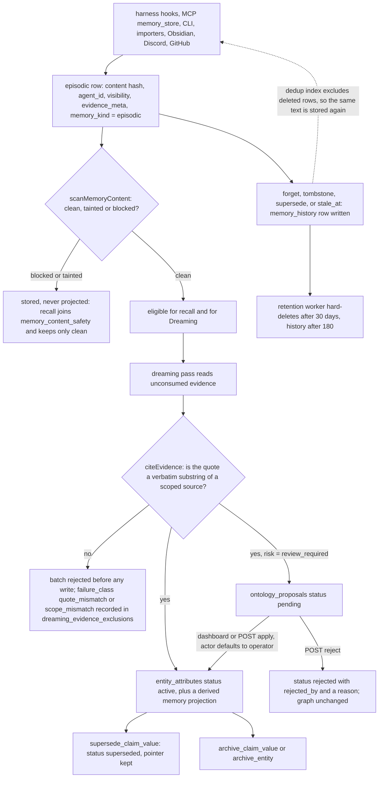

## 1. Executive Summary

Signet is a local memory daemon that sits underneath ten coding harnesses — Claude Code, Codex, OpenCode, OpenClaw, Kimi Code, Hermes Agent, Pi, Oh My Pi, Gemini CLI and ForgeCode — capturing their transcripts into one SQLite store, deriving a semantic entity graph from that store in background passes it calls *dreaming*, and serving recall back through MCP tools and session hooks. It also syncs the identity files those harnesses read (AGENTS.md, SOUL.md, USER.md, MEMORY.md) and keeps a separate encrypted secret store. Apache-2.0, 1,052 released versions between 0.1.53 on 19 February 2026 and 0.225.0 on 10 September 2026, about 230,000 lines of non-test TypeScript across `platform/`, `surfaces/`, `integrations/` and `libs/`, 152 SQLite migrations, and 464 test files holding 151,887 lines.

**The memory is its own, and the best part of it is a citation gate.** A dreaming pass may not write to the graph without citing a quote, and `citeEvidence` resolves that quote against the immutable episodic store — `record.content.includes(requested.quote)` at `platform/daemon/src/pipeline/dreaming-operations.ts:127` — with `validateRequestBeforeWrites` rejecting the whole batch before any write when a citation does not resolve (`:736`). The same function scopes the lookup by `agent_id`, so a citation to another agent's evidence fails as a scope mismatch. This is a code gate, not a prompt rule, and the prompt states it too.

**Two layers that deliberately do not merge.** An episodic row is primary evidence and is never edited by the pipeline; the semantic graph is derived and can be rebuilt. Migration 094 says so in as many words — *"remember/CLI/MCP/plugin/harness saves are immutable EPISODIC evidence… Only Dreaming derives semantic state from episodic rows"* — and the MCP `memory_store` description repeats it to the model. Deleting an imported source purges the claim projections derived from it (`platform/daemon/src/semantic-memory-projection.ts:9-50`), which is the half of forgetting a soft delete on the evidence row alone would miss.

**Prompt injection is treated as a memory problem.** `scanMemoryContent` (`platform/core/src/memory-content-safety.ts:110-138`) classifies every memory, artifact, transcript and summary `clean`, `tainted` or `blocked` against six named reasons, with defensive-context heuristics so that writing *about* an attack is not treated as one; the verdict is stored in `memory_content_safety` and joined into recall as `AND (mcs.source_id IS NULL OR (mcs.status = 'clean' AND mcs.context_eligible = 1))`, then re-scanned on the returned text. The policy never rewrites the evidence — only the projection.

**The weakest points are the published number and what the tests are allowed to prove.** The README badge claims 97.6% LongMemEval answer accuracy; no result artifact is committed, `memorybench/.gitignore:5` ignores `/data/`, the dataset is fetched from HuggingFace at run time, and the run ledger the docs point to opens with *"This is a development progress log, not a publishable benchmark claim"* over tables whose largest sample is 12 questions. Separately, no GitHub Actions workflow runs the suite: `bun run test:workspace` appears in `package.json:68` and in none of the 22 workflows, which run roughly 20 named files. And 12 cases in `synthesis-worker.test.ts` return early with a warning when no real database is present, reporting green having asserted nothing.

## 2. Mental Model

A memory is first a piece of **episodic evidence**: text an agent, a hook, a plugin or an importer handed over, stored with a content hash, an owning `agent_id`, a `visibility`, and optionally a canonical structured payload kept verbatim in `evidence_meta`. It is immediately retrievable and it is never rewritten by the pipeline. `memory_kind` labels it `episodic` by exclusion — anything whose `source_type` is not one of the daemon's own derived outputs (`extract`, `aggregate-recall`, `session_end`, `checkpoint`) is evidence.

Belief is a second layer built from the first. A dreaming pass reads episodic sources it has not consumed, and emits operations from a closed vocabulary — `create_entity`, `add_claim_value`, `set_claim_value`, `supersede_claim_value`, `merge_entities`, `archive_entity`, `archive_aspect`, `archive_claim_value`, `archive_link`, `update_link`, `flag`, `decline_attention`. Content operations must cite a verbatim quote; hygiene operations must cite an attention-flag id, and a flag is one-use. An `entity_attributes` row is `active`, and retrieval reads `status = 'active'`; supersession moves it to `superseded` with a pointer. Beside that sits `epistemic_assertions`, which records *who said what, when* under a predicate from `claims | believes | observed | decided | prefers | denies | questions`, kept separate from current graph truth on purpose, and `ontology_contradictions`, which stores two competing claim values side by side with both provenance snapshots rather than picking a winner.

Death is three different things. An episodic row is soft-deleted (`is_deleted = 1`), superseded (`superseded_by`), or marked `stale_at`; one predicate excludes all three from delivery. A claim value is archived or superseded. A *source* can be purged, which deletes its derived claim projections. Nothing keyed on the rejected text survives any of them: the uniqueness index is `WHERE content_hash IS NOT NULL AND is_deleted = 0` (`platform/core/src/migrations/056-agent-scoped-content-hash.ts:24-30`) and the dedup lookup filters `is_deleted = 0` (`platform/daemon/src/routes/memory-routes.ts:498`, `:519`), so a sentence that was forgotten is accepted as a new memory the next time it is said, and the next dreaming pass may cite it again.

Control is hybrid and the split is explicit: the agent writes evidence and reads recall, the daemon derives belief, and a person may adjudicate the subset of graph operations the dreaming model itself marked `review_required`.



## 3. Architecture

**One daemon, one database, one owner process.** `platform/daemon` is a Bun HTTP server on Hono with routes split across `routes/` (memory, ontology, hooks, sources, transcript import, inference, marketplace, secrets, telemetry). Every write goes through a db-owner protocol (`db-owner-protocol.md`, `db-accessor.ts`, `db-owner-worker.ts`) with lanes, deadlines and a work-unit budget, so long reads cannot starve the event loop; `yielding-writes.ts`, `async-yield.ts` and `event-loop-responsiveness.test.ts` exist for the same reason, and a dedicated CI workflow (`event-loop-contract.yml`) guards it. `platform/core` owns the schema: 152 migrations, an integrity audit table, and a `vec0` virtual table created inside a `try` so the store degrades to lexical-only when the sqlite-vec extension is absent (`platform/core/src/migrations/001-baseline.ts:95-103`).

**Embeddings are local by default.** The `native` provider loads `@huggingface/transformers` through `transformers-runtime.ts` with `nomic-embed-text-v1.5`; `platform/native` is a small napi-rs crate (`knn.rs`, `search.rs`, `vector.rs`, `normalization.rs`) for the scoring hot path. `ollama`, `llama-cpp`, `openai` and `none` are the alternatives. Vectors live in the same SQLite file.

**Dreaming needs a model, and it may be one you already run.** `inference-provider-factory.ts` offers `anthropic`, `openrouter`, `ollama`, `llama-cpp` and `acpx` — the last driving an existing agent over the Agent Client Protocol, so the dreaming pass can be executed by the coding agent the user already has rather than by a separate key.

### Deployment and ergonomics

A single installed binary plus a background daemon (launchd on macOS), one SQLite file, and a workspace directory holding the identity Markdown. It runs fully local and offline: local embeddings, local FTS5, and a local LLM through Ollama or llama.cpp for dreaming. Without any model, capture, recall, scoping and the safety ledger still work; what stops is the semantic graph. No API key is required to store anything. Telemetry is opt-in, content-free by its own header, and goes to PostHog. The store is ordinary SQLite and repairable by hand; `repair-actions.ts` (2,959 lines) and a database-integrity worker exist for when it is not. The surface is large for an operator: a daemon, a dashboard, a tray app, a desktop Electron build, a browser extension, and ten harness connectors.

## 4. Essential Implementation Paths

- **Capture.** Harness hooks post to `/api/hooks/session-start`, `/user-prompt-submit`, `/pre-compaction`, `/session-end` and `/session-checkpoint-extract` (`platform/daemon/src/routes/hooks-routes.ts:375-1132`), handled by `handleSessionStart`, `handleUserPromptSubmit`, `handlePreCompaction`, `handleSessionEnd` and `handleCheckpointExtract` (`platform/daemon/src/hooks.ts:674`, `:1616`, `:1359`, `:1991`, `:2345`). A transcript-capture worker and a recovery worker durably move harness JSONL into `session_transcripts` (`transcript-capture-worker.ts`, `transcript-recovery-worker.ts`, `session-transcripts.ts:511`, `:599`).
- **Write.** `POST /api/memory/remember` (`routes/memory-routes.ts:1487`) validates, hashes, dedups on `(content_hash, agent_id, scope)`, writes the row through `txIngestEnvelope` (`transactions.ts:269`), records a content-safety verdict, and inserts explicit temporal edges (`:1981`, `:2020`, `:2055`). The MCP `memory_store` tool is the agent-facing door onto the same path.
- **Dreaming.** `dreaming-worker.ts` sweeps every 5 minutes (`CHECK_INTERVAL_MS` at `:126`), alternating content and hygiene passes; `dreaming.ts` assembles the pass, `dreaming-agent-tools.ts` exposes `search_evidence`, `attention_list`, `runbook_read` and `apply_ontology_ops` to the model, and `dreaming-operations.ts` validates and applies. `dreaming_passes`, `dreaming_tool_calls`, `dreaming_attention`, `dreaming_evidence_consumption`, `dreaming_evidence_exclusions` and `dreaming_evidence_reviews` record what each pass saw, did and refused.
- **Retrieval.** `hybridRecall` (`memory-search.ts:1480`) builds a filter clause, runs lexical, vector, traversal, hint and temporal arms, authorizes candidates against the safety ledger and lifecycle predicate (`:780-820`), fuses structured evidence, dampens, optionally reranks, dedupes against what this session already saw, and finally bumps `access_count` on what it returned.
- **Context assembly.** `handleSessionStart` returns a `stableSystemPrompt` built by `buildSignetSystemPrompt` (`session-start-format.ts:37-49`) separately from a `dynamicContext`, with identity files selected by preset and per-file token budgets (`platform/core/src/identity.ts:159-195`); `context-budget.ts` truncates to fit.
- **Correction and forgetting.** `txModifyMemory`, `txForgetMemory`, `txSupersedeMemory`, `txRecoverMemory` (`transactions.ts:326`, `:586`, `:703`, `:827`), each writing a `memory_history` row; `POST /api/memory/forget` takes `mode: preview | execute` (`routes/memory-routes.ts:3087-3110`); `source-purge.ts` and `purgeAttributeMemoryProjectionsInTx` remove a source and its derived claims; `pipeline/retention-worker.ts` sweeps every 6 hours.
- **Human adjudication.** `ontology_proposals` written by `createOntologyProposalsInTx` (`ontology-proposals.ts:2317`) from `ontology-extraction.ts:751`, `ontology-consolidation.ts:342` and `dreaming-operations.ts:813`; applied or rejected through `routes/ontology-routes.ts:861-895` and `surfaces/dashboard/src/views/home.tsx:213-214`.
- **Secrets.** `platform/core/src/secrets.ts` for the encrypted store, `secrets-keyring.ts` for the OS keychain, `platform/daemon/src/routes/secrets-routes.ts` for the API, `plugins/bundled/secrets.ts` for the plugin manifest and the two MCP tools.

## 5. Memory Data Model

| Table | Holds |
| --- | --- |
| `memories` | `id`, `content`, `type`, `category`, `confidence`, `importance`, `tags`, `who`, `why`, `project`, `agent_id`, `visibility`, `scope`, `memory_kind`, `evidence_meta`, `content_hash`, `normalized_content`, `pinned`, `access_count`, `last_accessed`, `is_deleted`, `deleted_at`, `superseded_by`, `superseded_at`, `superseded_reason`, `stale_at`, `review_after`, `idempotency_key`, `version`, `vector_clock` |
| `memories_fts`, `embeddings`, `vec_embeddings` | FTS5 over content, an embedding row per content hash, and a sqlite-vec `FLOAT[768]` table |
| `memory_history` | append-only `event`, `old_content`, `new_content`, `changed_by`, `reason`, `metadata`, `actor_type`, `session_id`, `request_id` |
| `entities`, `entity_aspects`, `entity_attributes`, `entity_dependencies`, `entity_aliases`, `entity_communities` | the derived graph: an attribute is a claim value with `kind`, `content`, `normalized_content`, `confidence`, `status`, `superseded_by`, `claim_key`, `group_key`, `proposal_id` and `proposal_evidence` |
| `epistemic_assertions` | source-attributed assertions with `predicate`, `speaker`, `asserted_at`, `evidence`, `status` (`active`/`archived`/`superseded`), `supersedes_assertion_id`, `archived_by`, `archive_reason` |
| `ontology_contradictions` | two competing claim values kept whole — both contents, confidences, scopes, visibilities, source pointers and evidence — with `detector IN ('lexical','semantic','manual')` and `status IN ('active','resolved')` |
| `ontology_proposals` | `operation`, `status IN ('pending','applied','rejected','failed')`, `payload`, `confidence`, `rationale`, `evidence`, `risk`, `applied_by`, `rejected_by` |
| `memory_content_safety` | `status IN ('clean','tainted','blocked')`, `context_eligible`, `reasons_json`, `policy_version`, `scanned_at`, keyed on `(agent_id, source_kind, source_id)` |
| `temporal_edges` | `facet IN ('captured','session','source','observed','occurred','valid')`, `start_at`, `end_at`, `confidence`, `provenance_json` |
| `memory_artifacts`, `memory_artifact_tombstones`, `memory_md_heads`, `memory_head_revisions` | the rebuildable MEMORY.md rolling window, its head revisions, and per-session removal records |
| `session_transcripts`, `session_summaries`, `session_checkpoints`, `session_memories`, `session_claims` | captured harness history and its per-session derivatives |
| `dreaming_*` | passes, tool calls, attention, surprisal, evidence consumption, exclusions, reviews, runbook, failure backoff |

**Scoping is `agent_id` first.** Migration 043 adds an `agents` roster with a `read_policy` and a `policy_group`; `project` and a nullable `scope` column layer on top, the latter documented as being for benchmark and namespaced runs, defaulting to `m.scope IS NULL` so scoped rows stay out of ordinary recall (`memory-search.ts:303-314`).

**Temporal fields split three ways.** `created_at`/`updated_at` are record time. `captured_at`, `started_at`, `ended_at` on artifacts and summaries are the session's own clock. `temporal_edges` carries explicit validity, and `epistemic_assertions.asserted_at` carries utterance time beside the row's `created_at`.

## 6. Retrieval Mechanics

Default `alpha` is 0.7, `top_k` 20, `min_score` 0.3 (`memory-config.ts:424-426`). `hybridRecall` runs arms in parallel and keeps them separate before fusion — the project's own name for it is structured evidence, and the design note is that collapsing lexical, semantic, hint and traversal signal into one early score loses the ability to cap traversal-only candidates below directly anchored ones. Graph traversal degrades explicitly rather than silently: a timeout or failure sets `graphPartial` and a `degradation` of `graph_traversal_timeout` or `graph_traversal_failed` in the response meta (`memory-search.ts:1517-1533`), and lexical truncation reports `fts_incomplete`.

**Three filters run before ranking.** The lifecycle predicate, `currentMemorySql`, is written once and called at fourteen sites outside tests: `AND m.is_deleted = 0 AND m.superseded_by IS NULL AND m.stale_at IS NULL`. The scope clause is appended by `buildFilterClause` whenever an agent is known. The safety join keeps only `clean` rows, and then the returned text is scanned again, so a row edited directly in the database under a stale ledger entry is still caught (`memory-search.ts:814-818`).

**Recall is deduped per session.** `applyRecallDedupe` suppresses what this session already saw unless `includeRecalled` is set, and records the claim in `session_recall_events` with a context epoch that a session clear advances. This is a genuine ergonomic gain — the same three memories do not arrive at every prompt — and it means a recall's result depends on the session's history, not only on the query.

**Failure modes.** Traversal can return candidates whose only link to the query is graph adjacency, which is why they are dampened; the safety ledger is a regex policy and will occasionally block a legitimate technical note that quotes an instruction; and access counts are bumped for what is returned rather than for what is read, which is the right side of that choice. The `visibility = 'archived'` exclusion is hand-copied into eight files and, unlike the other two filters, is not centralised and not covered by any test.

## 7. Write Mechanics

A `remember` is **synchronous and cheap**: validation, a content hash, a dedup lookup, one insert, a content-safety scan, optional temporal edges, and embedding queued to a worker. There is no LLM on the write path. A memory is retrievable by lexical search as soon as the call returns; it is retrievable by vector search once the embedding worker reaches it, and `embedding-coverage.ts`, `embedding-health.ts` and `embedding-repair-state.ts` exist to measure and repair that gap.

**Consolidation is a separate, budgeted pass.** The dreaming worker wakes every 5 minutes, checks whether there is unconsumed evidence or queued attention, and runs one bounded pass. It does not re-read the whole store: `dreaming_evidence_consumption` records a per-source delivered offset, `dreaming_evidence_cursor` and the pass runbook carry the cutoff, and `dreaming_evidence_exclusions` holds sources it deliberately skipped with a `failure_class` from `incomplete_transcript | source_projection | scope_mismatch | quote_mismatch | unknown`, a retry count and a requeue timestamp. So the token bill scales with the day's activity rather than with the corpus — with the exception of hygiene passes over the attention queue, whose cost follows graph size.

**Correction is explicit and logged.** `POST /api/memory/forget` defaults to `mode: preview`, so the destructive call is the second one. `txSupersedeMemory` refuses a self-supersede and refuses a target in a different scope (`scope_mismatch`). Every one of these writes a `memory_history` row with an actor. Mutations can be frozen globally by a `pipelineV2.mutationsFrozen` kill switch that returns 503 on each mutation route.

**On the read path**, session start injects a `stableSystemPrompt` and a separate `dynamicContext`, and a second start for the same session returns a minimal stub rather than re-injecting. Keeping the invariant text in one block ahead of the variable text is the shape that preserves a provider's prompt-prefix cache; interleaving per-turn memories into the system prompt would invalidate it on every turn. Identity files are budgeted per file — 12,000 characters for AGENTS.md, 10,000 for MEMORY.md under the `openclaw` preset — and `applyTokenBudget` truncates the assembled injection.

**Nothing filters hostile input at write time**, by design: the evidence is stored as received and the safety verdict gates the projection. The consequence is in section 9.

## 8. Agent Integration

The MCP server's base tool set names 62 tools (`platform/daemon/src/mcp/tools.ts:164-227`), grouped as memory (`memory_search`, `memory_store`, `memory_get`, `memory_list`, `memory_modify`, `memory_forget`, `memory_feedback`), recall and sources (`signet_recall`, `signet_source_search`, `signet_session_search`, `signet_save_note`), knowledge (`knowledge_expand`, `knowledge_tree`, `knowledge_list_claims`, `signet_explain_claim`, `knowledge_hygiene_report`, `apply_ontology_ops`), entities, cross-agent messaging (`agent_peers`, `agent_message_send`, `agent_message_inbox`, `agent_message_ack`), secrets (`secret_list`, `secret_exec`, `secret_exec_status`), an MCP-proxy family, and a code-graph family. Tools are filtered per context and the server sends `toolListChanged` when the set moves.

**The model has a lot of agency over evidence and very little over belief.** It can store, modify and forget episodic rows freely. It cannot write a claim except through `apply_ontology_ops`, which enforces the citation gate, and a dreaming operation the model marks `review_required` lands in a queue instead of the graph. `memory_store`'s own description tells the model that a structured payload is retained as evidence and *"is not applied to the graph from this tool"*.

**Injection is by hook where a harness has them and by plugin where it does not.** Claude Code, Kimi Code and ForgeCode get hooks plus MCP; OpenCode, OpenClaw and Codex get native plugins; Hermes gets a memory-provider plugin; Pi and Oh My Pi get extensions; Gemini CLI gets MCP plus GEMINI.md sync. `libs/connector-base` and `libs/sdk` are the shared surface, and `integrations/openclaw/memory-adapter/src/index.ts` (2,645 lines, with a 2,550-line test file beside it) is the most complete example of adapting the daemon to a foreign memory interface.

## 9. Reliability, Safety, and Trust

**Secrets are handled well, and the report should say so plainly because the product claims it.** Values live in `<workspace>/.secrets/secrets.enc`, mode `0600` in a `0700` directory, each encrypted individually with libsodium `crypto_secretbox` (XSalsa20-Poly1305, random 24-byte nonce) at `platform/core/src/secrets.ts:457-466`. The 256-bit master key is generated with `randomBytes(32)` and stored in the OS keychain through `@napi-rs/keyring` under service `ai.signet.secrets` with a per-workspace account (`secrets-keyring.ts:30-38`); it never touches disk. Where no keychain exists the store falls back to a key derived from the host machine id (`getLegacyMasterKey`, `:314-320`) — obfuscation rather than encryption, since the machine id is world-readable — and the code says so, writes a `.degraded-warning` marker and reports `status: "degraded"`. There is **no secrets table in SQLite**: `grep -rliE "CREATE TABLE[^;]*secret" platform/core/src/migrations/` returns nothing. There is **no API, CLI or MCP verb that returns a secret value** — `GET /api/secrets` returns names, `POST /api/secrets/:name` writes, and the only way to use one is `secret_exec`, which resolves values into a child process's `env` (never argv), rejects shell metacharacters, redacts each value out of stdout and stderr by exact substring with an overlap buffer so a value split across chunks is still caught, and zeroes the resolved map on exit (`secrets.ts:968-1114`). 1Password is a one-way import into the local store; Bitwarden is an alternative backend reached through the `bw` CLI with item JSON on stdin. Nothing ships a secret to Signet: there is no hosted secret sync anywhere in the tree.

**The gap is on the other side of the boundary.** A credential a user pastes into a chat is captured like any other text: `transcript-capture-worker.ts` and `transcript-import-commit.ts` contain no redaction (grep for `redact|scrub|mask` in both returns nothing), and neither does `session-transcripts.ts`. The only value-scrubber in the tree is `redactSecrets` (`platform/daemon/src/session-checkpoints.ts:65-86`), five heuristic regexes, and its call sites are checkpoint digests, `recentRemembers`, and subagent context — not transcript storage. `memory-content-safety.ts` is not a credential scrubber; its `credential_harvesting` and `exfiltration` patterns match text *asking for* secrets, not secrets themselves. So the plugin's own prompt contribution telling agents to keep credentials out of *"chat, memory, logs, or source files"* is load-bearing advice rather than an enforced invariant. The git-sync route pushes `*.md` and `*.jsonl` to the user's own remote while `memories.db` is hard-denied; `.secrets/` is kept out of that push only by the extension allowlist `SIGNET_GIT_TRACKED_PATHS` (`platform/core/src/gitignore.ts:32-47`), not by the explicit deny list that protects `.daemon/` and `memory/*.db*`.

**Prompt-injected false memories are the one threat this design takes seriously at the memory layer.** The safety ledger is the mechanism and it is a good one, but it is a regex policy with a version string, so it is a filter, not a proof, and a novel phrasing passes.

**Scope holds on the read path and is not bound to a caller.** `buildAgentScopeClause` is real SQL on every recall arm and the tests for it cannot pass vacuously. But `shouldEnforceScope` returns false when `authMode === 'local'`, which is the default (`platform/daemon/src/auth/config.ts:32`), so `resolveScopedAgentId` accepts whatever agent id the request names. On a single-user machine that is the correct trade; in `team` or `hybrid` mode with claims, `authorizeMemoryMutationScope` and the project predicate do bind it. A reader evaluating this for more than one principal should read those two modes rather than the default.

**Withheld marks, stated once.**

`tombstone` — no. The repository has a table called `memory_artifact_tombstones` and a route called `/tombstone`, and neither is the mechanism. The table is keyed `(agent_id, session_token)` with `removed_paths`, a record of what the MEMORY.md rolling window dropped so a privacy removal survives re-index; the route calls `txForgetMemory` with `force: true`, which is a soft delete. Nothing is keyed on the rejected *value*: the unique index excludes deleted rows, the dedup lookup filters `is_deleted = 0`, and the retention worker hard-deletes the row after 30 days, after which even the content hash is gone. A user who says "forget that" and then discusses the same fact again gets it stored, and a later dreaming pass may cite the new row and re-assert the claim.

`trust_state` — no, and the near-miss is the most interesting thing in the schema. `memory_content_safety.status` is a genuine discrete field with `blocked` and `tainted` states that withhold a row from every prompt-facing projection, and it is filtered on in SQL on the read path — everything the mark's shape asks for. It is withheld because it answers *is this content instruction-shaped*, not *may this be treated as true*: it is recomputed deterministically from the bytes on every read (`memory-search.ts:816`), so it is a derived property of the text rather than an epistemic status a pass or a person can set. The two fields that do carry epistemic vocabulary fall the other way: `epistemic_assertions.status` is `active | archived | superseded`, lifecycle rather than belief, and its `predicate` enum (`claims`, `believes`, `denies`, `questions`) types the speech act rather than the system's stance; `entity_attributes.status` is `active | superseded | archived | deleted`, and every graph read path filters `status = 'active'`. No field anywhere says *recorded but not believed*.

**Declared and unwired: the review queue.** `GET /api/memory/review-queue` (`routes/memory-routes.ts:1292-1330`) selects `memory_history` rows `WHERE h.event IN ('DEDUP', 'REVIEW_NEEDED', 'BLOCKED_DESTRUCTIVE')`. Those three strings appear exactly once each in the entire tree — on that line. Every producer of `memory_history` writes `updated`, `deleted`, `superseded` or `recovered`, so the endpoint returns an empty list against every possible database state — and no test exercises it, so nothing notices. `human_review` is awarded on the ontology proposal queue and not on this one; the difference between the two is exactly the difference between a queue with a producer and a queue without.

**Retention deletes the audit.** History older than 180 days is purged on a 6-hourly sweep (`retention-worker.ts:75`, `:388`). That is a defensible default for a personal store and it means "why does the system believe this" has a horizon.

## 10. Tests, Evals, and Benchmarks

464 test files, 4,899 cases, 151,887 lines; about 65% of the cases are in the daemon package. I ran none of it.

**The marks rest on tests that cannot pass vacuously.** `memory-search.test.ts:1791-1828` writes the identical string `"agent-isolation-marker recall content"` under `agent-a` and `agent-b`, recalls as `agent-a`, asserts `toEqual(["mem-agent-a"])`, and then asserts the access counters are exactly `{mem-agent-a: 1, mem-agent-b: 0}` — the excluded row was not merely filtered from the output, it was never read. `memory-candidates.test.ts:95-108` asks `fetchTraversalCandidates` for five ids, asserts `toHaveLength(3)`, names each survivor's score and asserts `byId.has("memory-deleted")` and `byId.has("memory-superseded")` are both false. `hooks-recall.test.ts:824-829` pairs a `not.toContain` with an explicit `expect(body.meta?.noHits).toBeFalse()`.

**Two nearby tests read better than they assert, and a reader picking evidence should skip them.** `memory-similar-lifecycle.test.ts:138-185` has four `not.toContain` lines for deleted, superseded, stale and aggregate rows — under `expect(ids).toHaveLength(0)` at `:178`, which makes all four tautologies over an empty array; the file's own comment explains why the set is empty, and the sibling case at `:232-251` is the one with teeth. `memory-search.test.ts:1678-1708` seeds a live control row but queries a marker that does not match it, so an empty result passes the soft-delete exclusion silently.

**`visibility = 'archived'` is untested.** The predicate is hand-written into eight files; grepping `"archived"` across all 464 test files finds ontology entity archival and imported-source archival, and no case that seeds an archived memory and asserts it is absent from recall.

**The benchmark claim is not backed by an artifact in this tree.** The README badge and headline say 97.6% LongMemEval answer accuracy, and `web/docs/src/content/docs/benchmarking.md:17-25` repeats it as *"an average across the current tracked local and canary score set"* and points at `docs/BENCHMARKING-PROGRESS.md` as the ledger. That document opens: *"This is a development progress log, not a publishable benchmark claim. Run artifacts and reports remain ignored under `memorybench/data/runs/`"*. Its tables are six- and twelve-question samples — the largest denominator anywhere in the file is 12, against LongMemEval-S's 500 — and one passage records a denominator bug that had hidden two temporal failures behind a `9/10`. `memorybench/.gitignore:5` ignores `/data/`, the dataset is downloaded from HuggingFace at run time (`memorybench/src/benchmarks/longmemeval/index.ts:14-15`, `:95-118`), and no result file is committed anywhere in the repository. The docs page states the policy honestly — *"Benchmark reports and run artifacts stay under ignored paths and should not be committed until the team explicitly decides to publish a score"* — which is a reasonable internal rule that the README badge then publishes a number against. The harness itself computes accuracy, Hit@K, precision, recall, F1, MRR and NDCG and asserts none of them: there is no threshold, no baseline comparison and no `process.exit(1)` on a score in `memorybench/src/`.

**CI runs about twenty test files out of the 464 in the tree.** `bun run test:workspace` (`package.json:68`) appears in no workflow; the 22 workflows in `.github/workflows/` run named files plus lint, typecheck, build and doc-sync. `memorybench-dreaming-gate.yml:55-61` sounds like a score gate and runs four unit tests asserting corpus structure and ingestion scope. None of the isolation and lifecycle tests the marks rest on is executed by CI.

**Twelve tests can report green having asserted nothing.** `synthesis-worker.test.ts` opens each of its twelve cases with `if (!DB_AVAILABLE) { console.warn("SKIP: real DB not available"); return; }` — a pass, not a skip. The `describe.skipIf` uses elsewhere are honest by comparison, and `scripts/native-embedding-runtime-smoke.test.ts:261-264` is the counter-example worth crediting: it throws *"native binary not found"* rather than returning green.

**No paper.** `grep -rniE 'arxiv|bibtex|@article|@misc|CITATION|doi\.org'` over `README.md`, `docs/` and `web/docs/` returns a research-tracking reference to [arxiv:2601.07372](https://arxiv.org/abs/2601.07372) in `docs/specs/dependencies.yaml` as an input to a predictor design, and nothing else; there is no `CITATION.cff`.

## 11. For Your Own Build

### Steal

- **Validate a citation against the store, before the batch writes.** Have the consolidation model return `{quote, source_ref}` per operation, resolve the ref in the same scope the write targets, check the quote is a verbatim substring, and reject the whole batch on the first failure. Then record *why* it failed — `quote_mismatch`, `scope_mismatch`, `source_projection`, `incomplete_transcript` — so the failures are a queue you can retry rather than a log line.
- **Keep evidence immutable and make belief a projection.** Label rows as primary or derived, never let the pipeline edit a primary row, and make source deletion reach the derived rows. It converts "rebuild the graph" from a migration into a background pass.
- **Store contradictions whole instead of resolving them.** Both contents, both confidences, both provenance snapshots, a detector name and a resolution reason, with the attribute ids as soft links so the observation outlives the claim it was about.
- **Split the injected prompt into a stable half and a dynamic half.** One block of invariant instructions ahead of the per-turn context keeps a provider's prefix cache warm, and a second session-start for the same session should return a stub, not a re-injection.
- **Make a destructive bulk operation take `mode: preview | execute`.** Two calls, the first of which shows exactly which rows match.

### Avoid

- **Publishing a headline a reader cannot check.** A badge is a claim; a committed per-question output file is evidence. If the policy is that artifacts stay unpublished, the number should stay unpublished with them.
- **A consumer whose producer was never written.** Three event names in one `IN` clause and nowhere else is an endpoint that returns empty forever; a grep for each literal at the moment the reader is added costs nothing.
- **Copying a filter predicate into eight files.** The two predicates here that live in one function are tested; the one that is duplicated is not.
- **Letting a suite report PASS when its dependency is absent.** An early `return` inside a test is a pass. Use the runner's skip, or throw.
- **Treating a write-time content classifier as a credential control.** Detecting text that *asks* for secrets is not detecting secrets, and the transcript reaches the database either way.

### Fit

This is the heaviest system a single developer can reasonably run, and the question is whether the harness spread is what you need. If you work across three or four agents and the fragmentation of context between them is the actual pain, Signet is aimed precisely at that, and the ten-harness plumbing is most of what you are buying; the citation gate and the immutable evidence layer mean the derived graph is disposable, which is the property that makes a background consolidation pass safe to let run unattended. If you use one harness on one project, this is several services, a 152-migration schema and a dreaming model's token bill to solve a problem a much smaller store would solve. Walk away if you need a memory layer you can fully audit yourself in an afternoon, if you need the semantic layer's behaviour pinned by CI before you depend on it, or if transcripts of your sessions must not sit unredacted in a local database.

## 12. Open Questions

- What the dreaming pass costs per day on a real store, and how the hygiene half scales with graph size rather than with the day's activity — the attention queue's size is the variable and nothing in the tree bounds it against corpus size.
- Whether the 97.6% figure comes from runs at the twelve-question scale of the committed ledger or from larger unpublished runs; the ledger is the only in-tree evidence and its largest denominator is 12.
- How often the deterministic safety policy blocks a legitimate technical memory. `platform/core/src/memory-content-safety.test.ts` exercises the defensive-context heuristics, but nothing measures the false-positive rate on a real corpus, and a blocked row is invisible to recall without being visibly missing.
- Whether `entity_attributes.status` was intended to carry a candidate state; the column has a free-text default of `'active'` with no CHECK constraint, unlike every later status column in the schema.

## Appendix: File Index

- Schema: `platform/core/src/migrations/` (001 baseline, 002 pipeline-v2, 019 knowledge-structure, 033 scope, 043 agents, 051 MEMORY.md lineage, 056 content hash, 067 proposals, 071 assertions, 076 temporal edges, 094 memory kind, 125 content safety, 127 contradictions), `platform/core/src/database.ts`, `fts-schema.ts`.
- Write and correction: `platform/daemon/src/transactions.ts`, `routes/memory-routes.ts`, `source-purge.ts`, `semantic-memory-projection.ts`, `pipeline/retention-worker.ts`.
- Retrieval: `platform/daemon/src/memory-search.ts`, `memory-candidates.ts`, `memory-access-scope.ts`, `temporal-recall.ts`, `pipeline/graph-traversal.ts`, `pipeline/reranker*.ts`, `pipeline/structured-evidence.ts`.
- Context assembly: `platform/daemon/src/hooks.ts`, `session-start-format.ts`, `context-budget.ts`, `subagent-context.ts`, `platform/core/src/identity.ts`.
- Dreaming: `platform/daemon/src/pipeline/dreaming.ts`, `dreaming-worker.ts`, `dreaming-operations.ts`, `dreaming-operation-contract.ts`, `dreaming-evidence.ts`, `dreaming-evidence-retry.ts`, `dreaming-agent-tools.ts`, `platform/daemon/src/ontology-proposals.ts`, `ontology-extraction.ts`, `ontology-contradictions.ts`, `ontology-assertions.ts`.
- Safety and secrets: `platform/core/src/memory-content-safety.ts`, `platform/daemon/src/memory-content-safety.ts`, `platform/core/src/secrets.ts`, `secrets-keyring.ts`, `platform/daemon/src/routes/secrets-routes.ts`, `plugins/bundled/secrets.ts`, `platform/core/src/gitignore.ts`.
- Integration: `platform/daemon/src/mcp/tools.ts`, `routes/hooks-routes.ts`, `routes/ontology-routes.ts`, `libs/sdk/`, `libs/connector-base/`, `integrations/*/connector/`, `integrations/openclaw/memory-adapter/`.
- Tests and benchmarks: `platform/daemon/src/memory-search.test.ts`, `memory-candidates.test.ts`, `hooks-recall.test.ts`, `transactions.test.ts`, `ontology-proposals.test.ts`, `memory-similar-lifecycle.test.ts`, `memorybench/`, `docs/BENCHMARKING-PROGRESS.md`, `.github/workflows/`.

**Searches recorded for the negative claims**

```sh
grep -rn "REVIEW_NEEDED\|BLOCKED_DESTRUCTIVE\|'DEDUP'" --include='*.ts' .          # one hit each, all on memory-routes.ts:1313 — the SELECT; no producer
grep -rn "INSERT INTO memory_history" --include='*.ts' .                            # producers: database.ts:488, transactions.ts:226, memory-routes.ts:4352, db-owner-maintenance.ts:993
grep -rn "insertHistoryEvent" --include='*.ts' .                                    # events written: updated, deleted, superseded, recovered — no others
grep -rliE "CREATE TABLE[^;]*secret" platform/core/src/migrations/                  # 0: no secrets table in SQLite
grep -niE "redact|scrub|mask" platform/daemon/src/transcript-capture-worker.ts platform/daemon/src/transcript-import-commit.ts platform/daemon/src/session-transcripts.ts   # 0: transcripts are stored unscrubbed
grep -rn "redactSecrets" --include='*.ts' .                                         # call sites: session-checkpoints.ts and subagent-context.ts only
grep -rn "getSecret(" platform/daemon/src/routes/secrets-routes.ts                  # only the 1Password/Bitwarden backend tokens; no route returns a user secret
grep -rn "temporal_edges" --include='*.ts' . | grep -v migrations                   # one writer: memory-routes.ts:223, reached from POST /api/memory/remember
grep -rn "applyOntologyProposal\|rejectOntologyProposal" --include='*.ts' --include='*.tsx' .   # routes + dashboard home.tsx:213-214
grep -rn "archived" --include='*.test.ts' .                                         # entity and imported-source archival only; no archived-memory recall exclusion test
grep -rn "test:workspace\|bun run test\b\|bun test" .github/workflows/              # 0 matches for the workspace suite; named files only
grep -rn -i 'arxiv|bibtex|@article|@misc|CITATION|doi\.org' README.md docs web/docs # one research-tracking arxiv reference in docs/specs/dependencies.yaml; no paper, no CITATION.cff
find memorybench -name '*result*' -o -name '*report*.json' -o -name '*run*.json'    # 0 committed result artifacts; memorybench/.gitignore:5 ignores /data/
grep -rn "97\.6" --include='*.md' --include='*.json' --include='*.ts' .             # README.md:10,12,140 and web/docs benchmarking.md:17 — no data file
```

## History

**2026-09-12** — [`088e02e22d42142a12f133cb58ca1a0d48a201fe`](https://github.com/Signet-AI/signetai/commit/088e02e22d42142a12f133cb58ca1a0d48a201fe) — first reading. Screened with `scripts/screen_repo.py` before any file was opened: one auto-run surface (a committed `.githooks/` with `commit-msg` and `pre-commit`, inert until `core.hooksPath` points at it, which the root `prepare` script would do on an install), no `.gitattributes` filter, five build-time execution paths (`postinstall`, two `prepublishOnly`, a `prepare`, and `platform/native/build.rs`), 44 manifests reading as inside the seven-day cooldown because the depth-1 clone dates every file to the pin, and 31 unpinned surfaces in web, dashboard and template tooling; `AGENTS.md` and `CLAUDE.md` read as data. Nothing was installed, built or run.
