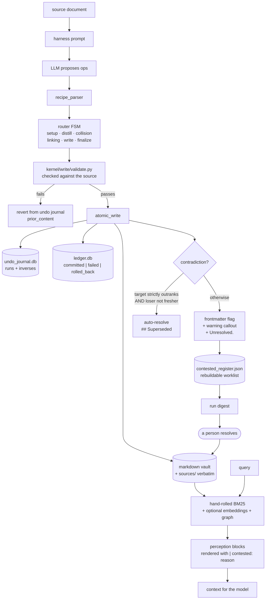

## 1. Executive Summary

Silica is an AGPL-3.0 harness that governs a folder of markdown — an Obsidian
vault, a codebase's docs, research material — as agent-writable memory. About
72,700 lines of Python across 208 modules, 955 commits since 25 May 2026, with a
CLI, a Claude Code plugin, an MCP server and a web UI over one vault. It targets
the Open Knowledge Format v0.2 and runs local inference optionally.

Its thesis is in one sentence of the README: *"the harness guides, the LLM
proposes, a parser and an FSM verify and execute, and every write is verified
against a source, reverted if corrupted."* The model never writes; it proposes
into a state machine that does.

Four marks, and three of the mechanisms behind them are among the better
instances this atlas has read.

**A contradiction is kept, not settled.** `contested.py` records it on the
existing note as a frontmatter flag and a warning callout and leaves it *"until
a human resolves it"*, with an `Unresolved.` tail, and one contradiction can be
closed while its siblings stay open. Pure functions, no I/O, no model.

**The auto-resolver is asymmetric on purpose, and says why.**
`suppress_contest` will let reliability settle a contest, but recency can only
*veto* — *"recency never resolves a contest here, it only refuses to let
reliability resolve one it would get wrong."* An unknown clock on the target
vetoes a dated incoming claim, because *"silence about when a note was last true
is not evidence that it still is"*, and the trade is stated: *"declining to
auto-resolve leaves a visible contest, while resolving wrongly buries a live
claim under `## Superseded`."*

**The per-claim clock is a comment, and the reason is good.** `valid_from` rides
in `<!-- silica: valid_from=2023-05-08 run=b07f1268 -->` rather than in
frontmatter, because frontmatter is per note *"while a note accumulates claims
from many sources on different dates"*, and a comment is invisible in preview,
greppable, and survives every write path byte-for-byte with no YAML round-trip.

**And the evaluation harness has something this atlas has been asking for
without a name.** `evals/negative_controls.py` does not check whether the system
answers correctly. It checks whether each deterministic gate metric *can still
fail* — see section 10, which is the part of this report to read if you read one.

**Weakest:** a contested note is still retrieved. The flag reaches the reader as
a rendered `| contested: <reason>` on the recall block rather than as a gate on
admissibility, so the disputed claim goes into the prompt with its dispute
attached. That is a defensible design and a different one from what the
`trust_state` mark measures, which is why the mark is withheld.

## 2. Mental Model

```text
source document ──► harness guides ──► LLM proposes ops
                                            │
                              parser + FSM  │  setup → distill → collision
                                            │  → linking → write → finalize
                                            ▼
                                   validate against source
                                            │
                        ┌───────────────────┴───────────────────┐
                     verified                              corrupted
                        │                                       │
                 atomic write                              revert from
                 + inverse row                             undo journal
                 + ledger row                              (prior_content)
                        │
              contradiction found?
                        │
        ┌───────────────┴────────────────┐
   strictly outranked                 otherwise
   AND no fresher loser                   │
        │                          flag the note:
   auto-resolve                    contested: <reason>
   (`## Superseded`)               + Unresolved.
                                   + register the path
                                          │
                                   run digest ──► a human decides
```

The design's premise is that the expensive failure is not a missing memory but a
**wrong write into a folder the user also edits by hand**. Everything follows
from that: the FSM, the source verification, the inverse per path, the atomic
write, and a contradiction policy that would rather leave a visible mess than
bury a live claim.

## 3. Architecture



**Runtime.** `silica/` holds `kernel` (write, recall, link, organize, report,
code, calendar), `router` (the FSM, orchestrator, coordinator), `driver`,
`tools`, `sources`, `capabilities`, `agent`, `ui` (a web server and renderer),
`skills`, `recipes`, `overlays` and `onboarding`. Four interfaces: a CLI, an MCP
server, a Claude Code plugin registering SessionStart / PreCompact / Stop hooks,
and a web UI.

**Persistence.** The memory is the vault — markdown the user owns and can edit
outside the tool. SQLite sits beside it for machinery: `~/.silica/ledger.db` for
per-op outcomes and `~/.silica/undo_journal.db` for inverses, plus per-vault
index directories. `sources/` keeps the verbatim original of every ingested
document and is **retrieval-invisible by construction** — `is_source_leaf`
excludes it from search, search context and embeddings — so the source is
reachable for verification without competing with the notes derived from it.
That is the cleanest separation of *evidence* from *belief* in the corpus, and
it is what `reliability_tier` reads.

## 4. Essential Implementation Paths

**The FSM.** `router/base_fsm.py` with states in `router/states/` — `setup`,
`distill`, `collision`, `linking`, `write`, `finalize` — driven by
`orchestrator.py` and `coordinator.py`. A proposal that does not parse does not
reach a state that writes.

**Verification and atomicity.** `kernel/write/validate.py` is a thousand lines of
checks against the source; `atomic_write.py` and `tools/atomic.py` do the write;
`undo_journal.py` records an inverse — kind, prior content, post-hash, and a
`to_path` for moves — before the change is considered done, which is what makes
`/revert` mechanical.

**The contested layer.** `CONTESTED_KEY = "contested"`,
`CONTRADICTIONS_KEY = "contradictions"`, `_UNRESOLVED_TAIL = "Unresolved."`, and
`resolve_contested` for closing one contradiction at a time.
`mark_superseded_by` exists because of a named prior failure: *"The merge loser
used to be left on disk with overlapping content and no link to the winner: two
notes saying the same thing and no record that one replaced the other."*

**`suppress_contest`, quoted at length in section 1**, is the atlas's favourite
kind of function: a policy, its two conditions, the asymmetry, the reason for the
asymmetry, and its measured precision with and without the guard — all in the
docstring, over a named fixture directory.

**The claim stamp.** `stamp(**fields)` renders
`<!-- silica: valid_from=… run=… -->` with caller-ordered keys so the line is
deterministic and empty fields drop out. `note_clock` returns the freshest
`valid_from` or an OKF `verified.at`, and treats *neither* as silence rather than
freshness.

## 5. Memory Data Model

A note is a markdown file with OKF-shaped frontmatter. The atlas-relevant fields
are the `contested` flag with its reason, the `contradictions` list, an OKF
`verified.at` a person writes when they read the note, and the per-claim
`valid_from` stamps in the body.

**Reliability is derived, not declared.** `reliability_tier` reads whether the
note's verbatim source is retained under `sources/` — so the tier is a fact about
what can be checked, not a number a writer chose. Keeping the source costs disk
and *"nothing else"* because the folder is retrieval-invisible, and
`--no-keep-sources` opts out at the cost of the tier.

**Two clocks and they are separate.** `valid_from` is when a claim held, from the
source document's own date supplied at ingest as `--seen`; the run id in the same
stamp, and the ledger and journal rows, say when the system wrote it. That is the
bi-temporal split, and the CLI guards the parse of `--seen` because a typo would
*"poison note_clock vault-wide."*

**No principal key inside a vault.** Separation is per vault — an index
directory, a ledger and a manifest each — which is partition-shaped isolation and
the reason the scope mark is withheld.

## 6. Retrieval Mechanics

A hand-rolled BM25 with optional embeddings, a graph layer
(`kernel/recall/graph_export.py`, `mindmap.py`, `tools/graph.py`), and a context
builder that assembles blocks for the prompt. The README puts the embedding
advantage at about six percentage points over the CPU-only fallback, which is an
unusually modest claim to make for one's own optional component.

**A contested note is retrieved and labelled.** `kernel/recall/perception.py`
carries `contested: str | None` as *"correction reason when flagged, else
None"*, and renders it into the block head as `| contested: <reason>`. So the
model sees the claim and the dispute together.

That is a real choice with a real cost, and it is worth stating both ways.
Against withholding: a disputed claim is often the best available answer, and
hiding it produces a confident silence rather than a hedged answer. For
withholding: nothing prevents the model from using the claim anyway, and the
atlas's rubric asks for a state that can refuse. Silica labels; it does not
refuse. `trust_state` is withheld on that, not on absence.

**`sources/` is invisible by construction**, so a query never retrieves the raw
document over the note distilled from it — the failure mode where a vault's
search results collapse into whole source files.

## 7. Write Mechanics

Every write is a proposal validated against its source, executed atomically, and
recorded twice: an inverse row that can undo it and a ledger row that says what
happened.

**The ledger records refusals, and then overwrites them.** `status ∈ {committed,
failed, rolled_back}` is better than most stores here manage — a failure is a
row, not a log line. But the schema carries a `UNIQUE` constraint on
`(source_canonical, path)` with UPSERT semantics, for a good reason (idempotent
resume: a re-run skips a source whose ops all committed with a matching content
hash and whose outputs are still on disk). The consequence is that the record of
a failed attempt is replaced by the success that follows it, so the ledger
answers *what is the state of this path* and cannot answer *how many times did
this fail before it worked*. The undo journal, which is per run and
append-only, is where that history actually survives.

**Corruption is handled rather than assumed away.** A corrupt undo journal is
quarantined and recreated with a warning, on the stated ground that it *"must not
brick startup or the /revert of future runs"*, and git is named as the durable
backstop for older history via `SILICA_GIT_COMMIT=auto`. Naming your own
mechanism's backstop is rarer than shipping the mechanism.

## 8. Agent Integration

Four surfaces over one vault: a CLI, an MCP server (`mcp.json`, plus a
`mcp.codex.json`), a Claude Code plugin whose `hooks/hooks.json` registers
SessionStart, PreCompact and Stop, and a web UI. The screen flagged all of these
as auto-run surfaces, correctly — a plugin manifest and a hook registration are
exactly the things that execute without a command being typed, and a reader
installing this should look at `hooks/hooks.json` first.

The screen also produced one false positive worth recording, because it is a
useful demonstration of what the tool does and does not know:
`silica/router/states/setup.py` was flagged as *"executes arbitrary Python at
install time"* on the strength of its filename. It is an FSM state named `setup`,
not a packaging script. The heuristic is right to be filename-driven and a reader
still has to open the file.

## 9. Reliability, Safety, and Trust

**The write path is the safety story** and it is layered: parse, verify against
source, atomic write, inverse recorded, ledger updated, revert available. The
README's *"100% write integrity across a real 796-note vault"* is a claim about
that path; it is one run over one vault, which the README says.

**The contested layer is the trust story** and it is honest about being partial.
A contradiction is visible, attributed, dated per claim, and left for a person —
and while it waits, it is still retrievable.

**The evaluation harness is the third layer** and section 10 is about it.

**What is missing:** no value-keyed refusal, so a claim a person deleted can be
re-ingested from the same source on the next run; no principal scoping inside a
vault; and the reliability tier depends on `sources/` being kept, which
`--no-keep-sources` turns off with the consequence stated but not enforced.

## 10. Tests, Evals, and Benchmarks

387 test files under `tests/`, plus an `evals/` tree carrying LoCoMo,
LongMemEval, MuSiQue, FactScore, a golden 796-note vault with its own probes,
paired statistics, and a set of `probe_*` modules. The README reports 82.1%
answerable accuracy and 87.2% correct refusals on LoCoMo, *"one run, both
numbers"* — the qualifier is the project's own.

**`evals/negative_controls.py` is the reason to read this repository even if you
never install it.** It is not a negative control on the *system*; it is a
negative control on the *metrics*, and its opening line states the problem
exactly: *"A metric that cannot fail reports PASS regardless of the arm, and the
gate reads as a result."*

Each entry pins a metric against cases it must score exactly, and the rule is
that **at least two cases must disagree** — *"a metric stuck at 1.0 and a metric
stuck at 0.0 are both dead, and only a pair of fixtures separates a live metric
from either."* `assert_metrics_discriminate` takes the names the runner is about
to compute and refuses any it does not recognise, so adding a gate metric without
a control fails the run rather than passing quietly. It runs before any model
work, *"so a dead metric costs zero tokens."*

The docstring then lists the times this bit them, with commit shas: `a333ce0`,
where the L3 gate scored the recomposed floor and not the note; `e8ddf63`, where
the decompose cap cut long notes mid-fact and never judged the tail; a PPR
phase-0 kill gate that was vacuous because 3-hop reached 98% of the vault; and
the pure form — two eval metrics matching `\d+` against citation IDs guaranteed
to contain a letter, so both scored 1.0 on every input and *"two rows of its
summary table were decoration."* It also names the hole it cannot close: a runner
that never mentions its new metric in the call at all. And it scopes itself out
of LLM judges, because *"a judge cannot be pinned to an expected value."*

This atlas has repeatedly found the failure this module exists to prevent — most
recently one report ago, in a negative retrieval test that asserted `every` over
an array a fresh database guaranteed to be empty. Silica has generalised that
into a registry with a rule that fails the build.

**`evals/golden/probe_supersede.py` is the second one**, and it reports its own
insufficiency. Over the golden vault — 796 notes, 1,064 pairs, 54 tier-split — it
measures 0 resolution inversions under `merge_rank = (tier, len)` against 43
under the bare `len(body)` it replaced, rates 0.0000 and 0.0209. Then:
*"the gate does catch a revert of §6.2, though only just: 2.09pp against a 2pp
tolerance. A partial revert would slip under it. Tighten the tolerance for this
key."* A probe that publishes the margin by which it barely works is doing the
thing this atlas asks of benchmark authors.

**`probe_abstention_rubric.py`** re-judges stored responses with the current
abstention rubric and asserts three known false negatives flip to true while a
synthetic confabulation stays false — a calibration check on the judge rather
than on the system, and correctly labelled as such.

The `negative_eval` mark itself rests on the ordinary tests:
`test_embed_search_topk.py` asserts a named note is absent from a top-*k* result
over a seeded vault, `test_context_builder.py` asserts a heading is absent from
assembled context, and `test_cohesion.py` asserts specific notes are not among a
note's related list.

## 11. For Your Own Build

### Steal

- **Write a negative control for every deterministic gate metric, and make the
  registry refuse an unknown name.** Two fixtures that must disagree, checked
  before any model work. This is the cheapest defence against an eval suite that
  reports PASS because it cannot report anything else, and almost nothing in this
  corpus has it.
- **Make the auto-resolver asymmetric and say which way.** Reliability may
  settle a contest; recency may only veto. An unknown clock on the incumbent
  vetoes a dated challenger, because silence is not evidence of freshness.
- **Keep the contradiction visible instead of resolving it away.** A flag, a
  reason, an `Unresolved.` tail, and a rebuildable worklist the digest reads —
  and the ability to close one contradiction while its siblings stay open.
- **Put the claim clock on the claim, not the note.** A note accumulates claims
  from many sources on many dates; one frontmatter date cannot carry that. An
  HTML comment is invisible in preview, greppable, and survives write paths that
  a YAML round-trip would perturb.
- **Keep the verbatim source and make it retrieval-invisible.** Evidence you can
  check without it competing with the notes derived from it — and a reliability
  tier that reads whether the evidence is still there rather than what a writer
  claimed.
- **Guard the one string that poisons everything.** The `--seen` date becomes
  `valid_from` on every claim of a run; parsing it at the boundary with the blast
  radius written in the comment is four lines.
- **Publish the margin by which your gate works.** 2.09pp against a 2pp
  tolerance, with "a partial revert would slip under it" written next to it.

### Avoid

- **Do not let a label stand in for a gate if you need one.** A contested claim
  rendered with its reason still reaches the model; if the requirement is that a
  disputed memory not be acted on, a rendered reason is not that.
- **Do not let an idempotency index double as an audit.** The op ledger's UPSERT
  is right for resume and wrong for history: the record of a failure is replaced
  by the success that follows it.
- **Do not report one run as a rate.** The README is explicit that its LoCoMo
  numbers are one run each, which is the right disclosure and still one run.

### Fit

Take Silica if your memory is a folder a person also edits, and the failure you
fear is a wrong write rather than a missing recall. The FSM, the source
verification and the inverse-per-write are built for exactly that, and the
contested layer is the most careful treatment of "two claims disagree" in this
corpus.

Take `negative_controls.py` regardless of what you are building. It is 146 lines
and it is separable from everything else here.

Look elsewhere if you need multi-principal scoping inside one store, or a state
that can refuse to serve a disputed claim rather than annotate it.

## 12. Open Questions

- **Should `contested` gate admissibility as well as render?** The flag, the
  reason and the register all exist; the recall path chooses to label. An opt-in
  that withholds contested claims from assembled context would cost one predicate
  and would make the mark's question answerable either way.
- **What does the ledger's UPSERT hide?** A path that failed four times and
  committed on the fifth is indistinguishable from one that committed first
  time. The undo journal keeps per-run history; the two are not joined.
- **How often does `suppress_contest` decline?** Its precision with the veto is
  measured on a fixture directory; its *rate* on a live vault — how many contests
  a person is actually asked to resolve per run — is the number that decides
  whether the design is usable at scale.
- **Does `--no-keep-sources` degrade the tier silently?** The comment says
  `reliability_tier` reads exactly the retained source. Whether a vault built
  without sources reports its tiers as unknown or as low is the difference
  between a caveat and a wrong number.
- **Are the LoCoMo numbers stable?** One run each, stated as such. The harness
  has `paired_stats.py` and the fixtures to say more.

## Appendix: File Index

- **Write kernel:** `silica/kernel/write/` — `validate.py`, `atomic_write.py`,
  `ops.py`, `ops_io.py`, `bulk.py`, `merge.py`, `frontmatter.py`,
  `checkpoints.py`, `session_changes.py`, `timeline.py`, `templates.py`
- **Contested layer:** `silica/kernel/write/contested.py` (`stamp`,
  `note_clock`, `suppress_contest`, `resolve_contested`, `mark_superseded_by`),
  `silica/kernel/contested_register.py`
- **Audit and revert:** `silica/kernel/write/undo_journal.py`,
  `silica/kernel/write/ledger.py`, `silica/kernel/write/provenance.py`,
  `silica/router/warning_ledger.py`
- **FSM:** `silica/router/base_fsm.py`, `orchestrator.py`, `coordinator.py`,
  `recipe_parser.py`, `states/` (`setup`, `distill`, `collision`, `linking`,
  `write`, `finalize`)
- **Recall:** `silica/kernel/recall/` — `perception.py` (the contested
  rendering), `curator.py`, `mindmap.py`, `graph_export.py`, `episodic.py`,
  `paths.py` (`is_source_leaf`)
- **Evals:** `evals/negative_controls.py`, `evals/golden/probe_supersede.py`,
  `evals/probe_abstention_rubric.py`, `evals/paired_stats.py`,
  `evals/locomo/`, `evals/longmemeval/`, `evals/musique/`, `evals/factscore/`,
  `evals/golden/fixtures/contests`
- **Tests:** `tests/` — 387 files; `test_embed_search_topk.py`,
  `test_context_builder.py`, `test_cohesion.py` carry the negative retrieval
  assertions, `test_bitemporal_invariants.py` the stamp invariants

## History

**2026-08-23** — [`300fab2e1686e6401a059ec62161ba5a46fce356`](https://github.com/kiycoh/silica-harness/commit/300fab2e1686e6401a059ec62161ba5a46fce356) — first reading, AGPL-3.0, ~72,700 lines of Python across 208 modules, 955 commits since 25 May 2026. Screened before anything was read: four auto-run surfaces — a `.claude-plugin/` marketplace and plugin manifest, a `hooks/hooks.json` registering SessionStart, PreCompact and Stop, and an `mcp.json` — three build-time execution points, and both `pyproject.toml` and `uv.lock` changed the day of the pin, inside the cooldown. Nothing was installed, no hook was registered, no eval was run and no vault was opened. One screen finding is a false positive worth recording: `silica/router/states/setup.py` was flagged as install-time execution on its filename and is an FSM state. Four marks. `trust_state` is withheld deliberately rather than for absence — the contested flag is rendered into the recall block as `| contested: <reason>` instead of gating admissibility, so a disputed claim reaches the model annotated rather than withheld. `scope_enforced` is withheld because separation is per vault; `tombstone` because nothing keys on a removed value.
