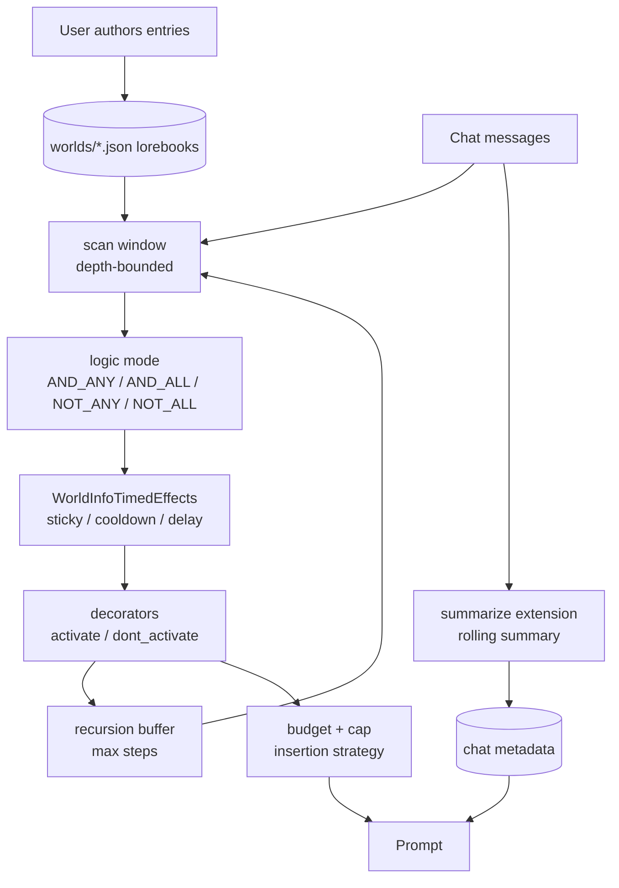

## 1. Executive Summary

SillyTavern is a chat front-end for roleplay, and by hours of use its **World
Info** system is plausibly the most-exercised agent memory implementation in
existence. It is also the one this atlas is least equipped to describe, because
it inverts the premise every other entry shares: **nothing is extracted, and no
model decides what to remember.** A person writes an entry, gives it keywords,
and the entry appears in the prompt when those keywords appear in the
conversation.

`public/scripts/world-info.js` is 6,289 lines, refined against a very large user
base. What that pressure produced is a retrieval system with mechanisms the
research systems do not have:

- **Four logic modes** per entry — `AND_ANY`, `AND_ALL`, `NOT_ALL`, `NOT_ANY`
  (`:33`) — over primary and secondary keys, so an entry can require that
  something is present *and something else is absent*.
- **Sticky, cooldown and delay** as first-class activation state, managed by
  `class WorldInfoTimedEffects` (`:479`), which tracks effects across chat
  messages. An entry can stay active for N messages after firing, refuse to fire
  again for N messages, or refuse to fire until N messages into the chat.
- **Recursive activation**, bounded by `world_info_max_recursion_steps` (`:82`),
  where activated entries are themselves scanned for keys — with a per-entry
  `delayUntilRecursion` (`:4024`) making an entry reachable only through another.
- **A token budget**: `world_info_budget = 25` (`:73`) with a separate
  `world_info_budget_cap` (`:81`), and an insertion strategy choosing between
  evenly, character-first and global-first (`:27`).
- **`@@activate` and `@@dont_activate` decorators** (`:100`), which force or
  suppress an entry irrespective of its keys.

What it has none of is the second half of this atlas's rubric. An entry carries
no author, no timestamp, no source, no confidence and no state. It is as true as
whoever typed it, and the system has no opinion. That is coherent — the user *is*
the memory system and World Info is its index — right up to the point where
lorebooks are shared, which they are, constantly.

## 2. Mental Model

A memory is a **World Info entry**: content, a set of keys, a logic mode, an
insertion position, an `order`, a `depth`, and optional timed-effect settings.

The state machine here is not about belief. It is about **activation**, and it is
the richest in the atlas:

```text
   for each message turn:

     scan window = last `depth` messages (DEFAULT_DEPTH 4, MAX_SCAN_DEPTH 1000)
          │
          ▼
     key match under the entry's logic mode
       AND_ANY   — any primary key, plus any secondary
       AND_ALL   — all secondary keys required
       NOT_ANY   — suppressed if any secondary key present
       NOT_ALL   — suppressed only if all secondary keys present
          │
          ├── delay active?    ──► too early in the chat; stay quiet
          ├── cooldown active? ──► fired recently; stay quiet
          ├── @@dont_activate  ──► "suppressed by @@dont_activate decorator"
          ├── @@activate       ──► fires regardless of keys
          └── otherwise fires
                 │
                 ├── sticky N  ──► remains active for the next N messages
                 └── content enters the recursion buffer
                          │
                          ▼
                 scan_state = RECURSION — activated content is itself scanned
                 for keys, up to world_info_max_recursion_steps
          │
          ▼
     budget: world_info_budget (25%) with world_info_budget_cap
     insertion: evenly | character_first | global_first, by order and position
```

`scan_state` has a fourth value, `MIN_ACTIVATIONS` (`:59`), for a pass that skews
the depth to reach a minimum number of activations — the system will widen its
own window rather than return nothing.

Memory is **entirely user-controlled**. Nothing observes the conversation and
decides to remember; the only automatic writer is the optional summarize
extension, and it writes one rolling summary rather than entries.

## 3. Architecture

JavaScript, AGPL-3.0, a Node server with a browser front-end. Two memory
mechanisms, unrelated to each other:

- **World Info** — `public/scripts/world-info.js` (6,289 lines), with lorebooks
  stored as JSON files per world under the user's `worlds/` directory and served
  by `src/endpoints/worldinfo.js`.
- **The summarize extension** — `public/scripts/extensions/memory/index.js`
  (1,131 lines), module id `1_memory`, maintaining a rolling summary in chat
  metadata from one of several sources (a main-API call, WebLLM in-browser, or an
  Extras server).



### Deployment and ergonomics

- **What has to be running:** the SillyTavern server. Lorebooks are JSON files on
  disk; there is no database, no index and no embedding model.
- **Local and offline: completely.** World Info needs no model at all — it is
  string matching. Only the summarize extension calls one, and it can use WebLLM
  in the browser.
- **No API key is needed to store anything**, because storing is writing a file.
- **Hand-repairable: it is hand-*authored*.** The store is a JSON file a person
  edits in a purpose-built editor, which makes it the only system here where
  repair and authoring are the same activity.

## 4. Essential Implementation Paths

**Constants and modes.** `public/scripts/world-info.js:27` —
`world_info_insertion_strategy`; `:33` — `world_info_logic`; `:43` —
`scan_state`, with `MIN_ACTIVATIONS` at `:59`; `:73` — `world_info_budget = 25`;
`:81` — `world_info_budget_cap`; `:82` — `world_info_max_recursion_steps`; `:96`
— `DEFAULT_DEPTH = 4`; `:98` — `MAX_SCAN_DEPTH = 1000`; `:100` —
`KNOWN_DECORATORS = ['@@activate', '@@dont_activate']`.

**Recursion.** `:323` — the recurse buffer is drained only when
`scanState !== scan_state.MIN_ACTIVATIONS`, so the minimum-activation pass does
not cascade. `:4643` — `.filter(entry => entry.delayUntilRecursion)` selects the
entries held back for a later hop; `:4024` declares its default as a number, so
it doubles as a recursion *level*.

**Timed effects.** `class WorldInfoTimedEffects` (`:479`) holds the chat, the
entries, a dry-run flag and a buffer per effect type. `#checkTimedEffectOfType`
runs for `'sticky'` and `'cooldown'` at `:684-685`, `#checkDelayEffect` at
`:687`, and `#setTimedEffectOfType` at `:733-734` after an entry fires.
`isEffectActive('sticky', entry)` gates activation at `:4733`.

**Decorators.** `:4763` — `@@activate`, logging *"activated by @@activate
decorator"*; `:4769` — `@@dont_activate`, logging *"suppressed by
@@dont_activate decorator"*.

**Persistence.** `src/endpoints/worldinfo.js` reads and writes
`path.join(request.user.directories.worlds, filename)` — one JSON file per world,
per user.

**Summarisation.** `public/scripts/extensions/memory/index.js` —
`MODULE_NAME = '1_memory'`, `summary_sources` including `webllm` and `extras`,
`formatMemoryValue` applying a user template, and a debounced `saveChat`.

## 5. Memory Data Model

An entry carries `content`, primary keys, secondary keys, a `selectiveLogic`
mode, `position` and `depth` for insertion, `order` for precedence,
`probability`, `sticky`, `cooldown`, `delay`, `delayUntilRecursion`,
`decorators`, and flags for constant versus selective activation.

That is a rich *retrieval* schema and an empty *epistemic* one. There is no
author, no created-at, no source, no confidence, no verification state, no
supersession pointer and no tombstone. Two contradictory entries both fire if
both match; the model resolves them, or does not.

**Scoping** is by lorebook: entries live in a named world, worlds are bound to a
character or enabled globally, and `world_info_insertion_strategy` decides
precedence when both apply. That is a real partition of what can be retrieved,
but it is a content-organisation boundary rather than a principal boundary —
there is no user or tenant key, because the deployment model is one person's
machine. `scope_enforced` is withheld on that basis.

## 6. Retrieval Mechanics

This is the section worth reading, and the mechanisms are unusual enough to list
against the problem each one solves.

**Negative keys.** `NOT_ANY` and `NOT_ALL` let an entry declare conditions under
which it must *not* fire. Almost every retrieval system in this atlas can only
express similarity; this one can express "relevant to X unless Y is also being
discussed", per entry, authored by hand.

**Cooldown solves a problem embeddings create.** A vector store returns the same
top hit every turn while the topic persists, and the model repeats itself.
`cooldown` says: having fired, be quiet for N messages. `sticky` says the
opposite — having fired, stay in context so a thread is not dropped mid-scene.
Together they are a hysteresis band around activation, and nothing else in this
atlas has one. [Project N.E.K.O.](../neko/) attacks the same repetition problem
from the generation side with a BM25 corpus over its own output; this attacks it
from the retrieval side with per-entry state.

**Recursion with a bound and an opt-in.** Activated content is rescanned for
keys, so an entry about a city can pull in the entry about its ruler.
`world_info_max_recursion_steps` bounds the cascade, and `delayUntilRecursion`
lets an author mark an entry as reachable *only* through recursion — a
deliberate two-hop design, and the recurse buffer is skipped during the
minimum-activation pass so the widening does not compound.

**A budget with a cap, and a minimum-activation pass.** The budget bounds tokens
as a percentage; the cap bounds them absolutely; `MIN_ACTIVATIONS` widens the
scan depth when too little fired. Bounding and back-filling in the same system is
more than most manage.

The failure mode is the obvious one, and it is why lorebook authorship is a
craft: activation is a function of keyword coincidence, so a common word as a key
fires constantly while a specific phrase never fires at all. Nothing measures
whether an entry is pulling its weight, and with recursion in play the effective
context is hard to predict from the entries alone.

## 7. Write Mechanics

**A person types it.** There is no capture, no extraction, no consolidation and
no dedup, because the write path is an editor.

That has one advantage worth stating plainly: **the memory is exactly what
someone decided it should be.** No extraction error, no hallucinated fact, no
summarisation drift, no silent re-derivation. Every failure mode this atlas
catalogues on the write path is absent, because there is no automatic write path.

The cost is equally plain: it does not scale past what a person will maintain,
and it learns nothing. A user who tells the character something important in chat
has told the *model*, not the lorebook, and it is gone at the next context
overflow unless they go and write it down.

The **summarize extension** is the partial answer — a rolling LLM summary of the
conversation kept in chat metadata, regenerated on a trigger, injected at a
configured position. It is a single mutable blob rather than a store: no identity
per fact, no correction, and each regeneration is free to lose whatever the
previous one held. It is the [chained lossy summarization](../cowagent/) risk
this atlas records elsewhere, shipped as the default automatic memory for a very
large number of users.

### Operational cost

- **World Info costs no tokens to maintain and no model to run.** Scanning is
  string matching over a bounded window, on the hot path but cheap.
- **The lag between writing and retrieval is zero** — save the entry and it is
  live on the next scan.
- **No background pass exists** for lorebooks. The summarize extension is the
  only deferred work, and it is bounded by one summary per trigger.
- **On the read path the budget is explicit**, which is more than most systems
  here offer, and the cap makes it bounded in absolute terms rather than only as
  a percentage. Injection at author-chosen depths sits inside the conversation
  rather than in a stable prefix, so it invalidates prompt-prefix caching by
  design.

## 8. Agent Integration

There is no agent API. SillyTavern *is* the client: entries are injected into the
prompt at author-chosen positions and depths, and the model never calls a tool to
retrieve them. The agent has no agency over memory whatsoever — it cannot save,
search, or correct.

Portability is via the lorebook JSON format, which has become a de facto
interchange format across several front-ends. That is arguably SillyTavern's most
consequential contribution to this space: a character card with an embedded
lorebook carries its memory with it between applications, which is a property
none of the framework-bound memory systems in this atlas have.

## 9. Reliability, Safety, and Trust

**No trust model, and for its original purpose it does not need one.** Entries
are authored by the person who will read the output. The atlas's usual question —
how does the system know this is true — has the answer "a human asserted it",
which is the strongest provenance available and the reason no field records it.

That answer stops working in the case that dominates in practice: **lorebooks are
shared.** Character cards with embedded World Info are downloaded and imported
routinely, at which point the content is authored by a stranger and injected into
a prompt by keyword match. There is no author field, no provenance, and no marker
distinguishing an imported entry from one you wrote — and `@@activate` fires an
entry regardless of keys, so an imported entry can be unconditional. A lorebook
is a prompt-injection surface with a distribution channel, and nothing in the
data model acknowledges it.

**Correction is editing.** Delete the entry or change its text. There is no
version, no supersession record, and no tombstone — but there is also no
extractor to re-assert what you removed, which is why the absence costs less here
than it does elsewhere in this atlas. `@@dont_activate` is the closest thing to a
suppression record: it disables an entry while keeping it, a genuinely useful
third state between present and deleted, though it is a property of the entry
rather than a record of a rejected value.

**Data loss** is whatever happens to a JSON file: no replication, no backup, no
sync. The corresponding advantage is that a backup is `cp`.

**Uncertainty cannot be represented at all.** An entry is text that either enters
the prompt or does not.

## 10. Tests, Evals, and Benchmarks

No memory-specific test suite was found for World Info — no fixture asserting
that a given chat and lorebook produce a given activation set, which for a system
this intricate is the gap most worth closing. Activation depends on scan depth,
logic mode, recursion step, three timed effects, decorators, probability and
budget interacting; that is exactly the shape that benefits from table-driven
tests, and exactly the shape where a regression is invisible in manual use.

No benchmarks, and none of the ones in [this atlas's benchmark
survey](../../benchmarks/) would be meaningful here — they measure recall of
extracted facts, and nothing is extracted. The real evaluation is whether a
roleplay stays coherent, which its users perform continuously and informally, at
a volume no benchmark matches.

`negative_eval` is withheld, and the irony is worth naming: the *entry format*
supports negative assertions through `NOT_ANY` and `NOT_ALL`, so this system can
express "must not surface when X" better than most systems in this atlas — and
nothing tests that it holds.

## 11. For Your Own Build

### Steal

- **Cooldown and sticky on a retrieval unit.** A hysteresis band around
  activation solves repetition and dropped threads at once, and both are one
  integer per entry. Vector stores that return the same hit every turn have this
  problem and no vocabulary for it.
- **Negative keys.** Letting an entry declare when it must *not* surface is
  cheap, authorable, and expressible in no embedding model.
- **Bound the recursion and let authors opt into it.** `delayUntilRecursion`
  makes two-hop retrieval a deliberate design choice rather than an emergent
  cascade, and skipping the buffer during the widening pass keeps the two
  mechanisms from compounding.
- **A minimum-activation pass.** Widening the scan when too little fired is a
  better failure mode than returning nothing, and it pairs naturally with a
  budget bounding the other end.
- **Ship an interchange format.** The lorebook JSON travelling inside character
  cards is why this design outlived its own application.

### Avoid

- **Importing memory with no author field.** Shared entries are untrusted text
  that enters a prompt by keyword match, and a force-activate decorator bypasses
  even that gate. One `source` field distinguishing authored from imported would
  cost nothing, and is the single change this design most needs.
- **A rolling summary as the only automatic memory.** One mutable blob rewritten
  by a model, with no per-fact identity and no history, loses things silently —
  and it is the default for everyone who never opens the entry editor.
- **An intricate activation pipeline with no activation tests.** Seven
  interacting mechanisms and no fixture asserting what fires is a regression
  surface, however well the manual experience has been tuned.

### Fit

If your memory is small, curated, and matters more than it scales — a character,
a world, a domain glossary, a set of standing instructions — this design beats a
vector store, and this is the most refined implementation of it in the open. The
maintenance budget it assumes is a person who enjoys the authoring, which is a
real assumption and not a small one.

If your memory must *learn*, this is the wrong shape entirely, and its own users
demonstrate the gap: the summarize extension exists because people wanted the
character to remember what happened, and a hand-authored lorebook cannot do that.

The most transferable thing here for a builder of automatic systems is the
activation vocabulary. Sticky, cooldown, delay, negative keys and bounded
recursion are answers to problems that extraction-based systems also have and
mostly express as tuning constants, if at all.

## 12. Open Questions

- **How do `sticky` and `cooldown` interact when both are set on one entry?** The
  buffers are checked separately at `:684-685`; the precedence when an entry is
  simultaneously sticky and cooling was not traced.
- **Is timed-effect state persisted across a reload?** The class holds chat and
  entries in memory; whether the buffers survive a restart determines whether a
  cooldown outlives the browser tab.
- **What proportion of users rely on the summarize extension** versus authored
  lorebooks? It decides which of the two mechanisms is the real memory system for
  most people, and nothing in the repository answers it.
- **Does any other front-end consuming lorebook JSON implement the timed
  effects?** If the interchange format carries `sticky`/`cooldown` that importers
  ignore, an entry behaves differently depending on where it is loaded.
- **Is there a lorebook linter anywhere in the ecosystem?** With this many
  interacting activation mechanisms, a static check for keys that can never fire
  — or always will — would be worth more than most runtime features.

## Appendix: File Index

**World Info**

- `public/scripts/world-info.js` — insertion strategy (27), logic modes (33),
  `scan_state` (43–59), budget (73), cap and recursion steps (81–82), depth
  constants (96–98), `KNOWN_DECORATORS` (100), recurse-buffer gate (323),
  `WorldInfoTimedEffects` (479), effect checks (684–687), effect setting
  (733–734), `delayUntilRecursion` default (4024), recursion-delayed filter
  (4643), sticky gate (4733), decorator handling (4763–4770)
- `src/endpoints/worldinfo.js` — per-user `worlds/` JSON storage

**Summarisation**

- `public/scripts/extensions/memory/index.js` — `1_memory`, summary sources,
  `formatMemoryValue`, debounced `saveChat`
- `public/scripts/extensions/memory/settings.html`

## History

**2026-07-29** — [`8172dcd0ee672d3cd9a5e5f7af134f91a45cd2b8`](https://github.com/SillyTavern/SillyTavern/commit/8172dcd0ee672d3cd9a5e5f7af134f91a45cd2b8) — first reading.
