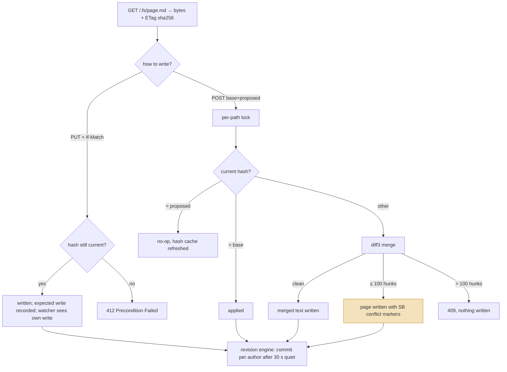
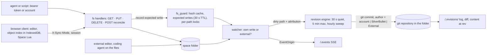

## 1. Executive Summary

SilverBullet is a Markdown wiki — a folder of pages served by a Rust binary
to a browser client that indexes, links and runs scripts over them — in
development since February 2022 under the MIT licence, at version 2.10.0 at
this commit. It has no memory subsystem, no model call in its core and no
MCP server. It is in this atlas because its **file API is the write contract
most memory stores in this atlas lack**, and because it answers the question
the [Logseq](../logseq/) and [Joplin](../joplin/) reports leave open: what
happens when a person and a process edit the same note at the same time.

Every read of `/.fs/{path}` returns an `ETag` of the form `"sha256:<hash>"`
over the bytes. A write may carry `If-Match: "sha256:<hash>"`, and a create
may carry `If-None-Match: *`; a precondition that does not hold returns `412`
rather than overwriting (`docs/HTTP API.md:47-50`,
`server/src/handlers/fs.rs:230-262`). An ETag list the server cannot evaluate
fails closed. A client that wants the server to resolve the collision sends
`POST /.fs/{path}` with the text it started from and the text it proposes,
each with its hash; the handler takes a per-path lock, fast-forwards when the
file is unchanged, otherwise runs a three-way line merge and writes back
either the clean result or the page with Git-style conflict markers between
the two sides, capped at one hundred conflicting hunks
(`fs.rs:445-640`, `server-merge/src/diff3.rs:12`).

The second mechanism is **attribution that reaches the history**. A write
carries the acting account from the session, an opaque `X-Client-Id`, and an
`X-Source` of `editor`, `sync` or `external` that is recorded when declared
and ignored when not, because *attribution is never load-bearing*
(`fs.rs:20-38`). The file watcher classifies each change as the server's own
expected write or as external — a script, another editor, a coding agent
touching the folder — and the revision engine commits each author's dirty
paths separately, thirty seconds after quiet and at least every five
minutes, with the account's name and email as git author and *SilverBullet*
as committer (`server/src/revisions/engine.rs:9-27,316-336`,
`store.rs:178-206`). An agent that edits the space through the API is a named
author; one that edits the files directly is *External*.

Every mark is withheld, on definitions. The history is git, which the atlas
treats as a different mechanism from an append-only record inside the store;
the conflict markers are written live into the page, which is a surface a
person happens to be able to fix rather than one that withholds a pending
value; access is per space, not a key on a memory. What the report is for is
the write path. A team building a store an agent and a person both edit can
take the ETag contract, the fail-closed preconditions and the merge-or-mark
handler as they stand.

## 2. Mental Model

A memory is a **page**: bytes at a path, named by their hash. There is no
belief model, no state on content and no lifecycle beyond exists, changed,
deleted. The machinery is entirely about *who changed it and against what*:

The highlighted state is the one to notice. A conflicted merge is not
rejected and not silently resolved: the page is written with both versions
between markers and the hash of each side in the marker line, and the client
is told `conflicted`. From then on the page is a task for a person, and the
handler refuses to merge into a page that already contains markers. The
system's answer to *which writer was right* is *neither, and here are both*.

## 3. Architecture

Rust for the server (`server/`, `server-common/`, `server-merge/`, 30,809
lines in the first two), TypeScript for the client and plugs (117,293 lines),
Lua for user scripting inside the browser. 3,653 commits since 2022-02-16.
755 Rust tests across the three crates and 430 end-to-end cases in 51 files.

**The server owns the files and nothing else.** There is no database: the
page is the record, the git repository is the history, the index is the
client's. `server/src/fs_guard.rs` keeps a hash cache and a table of
*expected writes* with a thirty-second TTL (line 17) so the watcher can
recognise the server's own writes when the filesystem reports them;
`server/src/watcher.rs:89-98` carries the origin — kind, display name, an
email that is never serialised to other members, the client id — on each
change event.

### Deployment and ergonomics

- **What has to run:** one binary over a folder. Revisions need `git` on the
  same machine; without it the views are empty rather than broken
  (`docs/Features/Revisions.md`).
- **Fully local and offline:** yes. The client keeps working offline and
  syncs later; nothing in the core calls a model.
- **Hand-repairable:** entirely. The pages are files, the history is a git
  repository a person can open with git, and a conflicted page is text.
- **Install:** a binary or a Docker image; a desktop app wraps the same
  server.

## 4. Essential Implementation Paths

**Read.** `handle_fs_get` (`fs.rs:86`) serves the bytes with the hash as
`ETag`. `X-Sync-Mode: true` marks a request from the client rather than an
outside caller (`docs/HTTP API.md:11`).

**Conditional write.** `handle_fs_put` (`fs.rs:288`) calls
`evaluate_preconditions` (`fs.rs:230-262`): `If-None-Match: *` passes only
when the file is absent, any other `If-None-Match` value fails closed,
`If-Match: *` passes only when the file exists, and `If-Match: "sha256:…"`
is compared against the current hash. A failure returns `412`. Delete
(`fs.rs:360`) takes the same preconditions.

**Reconcile.** `handle_fs_reconcile` (`fs.rs:445-517`) parses a body of
`baseHash`, `baseText`, `proposedHash`, `proposedText`, checks that each
hash is the SHA-256 of its text, refuses input that already holds markers,
takes `fs_guard.path_lock(path)` and calls `reconcile_locked` (`fs.rs:573`),
which reads the current file and branches on its hash: absent or equal to
the base, apply; equal to the proposed, no-op; otherwise `merge(base,
proposed, current)` from `server-merge/src/diff3.rs:12`, clean or
conflicted, with `CONFLICT_HUNK_LIMIT` of 100 (`fs.rs:44`),
`MERGE_SIZE_LIMIT` of one mebibyte on either text
(`server-common/src/space/disk.rs:464`) and three attempts against a racing
writer (`fs.rs:49`). The write goes through
`write_and_record` (`fs.rs:547-560`), which records the hash and the expected
write so the watcher attributes the change correctly.

**Attribution.** `WriteAttribution { actor, client_id, source }` is built
from the session's `Actor`, `X-Client-Id` and `X-Source` (`fs.rs:20-38`).
The watcher turns it into an `EventOrigin`; `attribution_for`
(`engine.rs:316-336`) maps an origin with no user kind to `External`, a user
with a name to `Account`, a user with only an email to an account named from
it, and a user with neither to `LocalUser`. `identity_for` (`engine.rs:75-77`)
renders `Account` as its name and email, `LocalUser` and `System` as
*SilverBullet*, `External` as *External*.

**Commit.** `RevisionStore::commit_staged` (`store.rs:178-206`) stages the
paths with `git add -A -f -- :(literal)…` and commits with
`GIT_AUTHOR_NAME`/`GIT_AUTHOR_EMAIL` from the attribution and a fixed
committer of *SilverBullet* (`store.rs:6-7`), skipping the commit when the
index is clean. The engine batches by author: one commit per author per
quiet period (`engine.rs:9-13`: quiet 30 s, maximum interval 300 s, sweep
3,600 s).

**Identity.** `server/src/auth/identity.rs:10-14` — `UserProfile { username,
full_name, email }` resolved from the verified username on a request; on a
multi-space server an admin or the user sets the name and email that become
the git author.

## 5. Memory Data Model

**The page is the unit and the hash is its identity.** A page has a path, a
content type, a modification time and a SHA-256; nothing else is stored
about it on the server. Metadata a person writes — frontmatter, `#tags`,
`[key: value]` attributes, tasks — is parsed by the client into **objects**
attached to the page and kept in the browser's IndexedDB
(`docs/Concepts/Object Index.md`). The index is rebuilt from scratch on a
fresh client and updated in the background after each save, and the
documentation says plainly that a query immediately after an edit may return
a stale result.

**Temporal:** the file's modification time and, when revisions are managed,
the commit timestamps. No validity interval; `bitemporal` is withheld.

**Scoping:** a space is a folder. On a multi-space server each account has
`read`, `write` or no access per space, with the maximum of a space-wide
`access` and the member's role deciding (`docs/Features/Space Manager.md:57-60`);
the check runs before the handler. Inside a space there is no principal on
a page and no key on a read, so `scope_enforced` is withheld: the boundary is
the store, as with a Logseq graph or a Joplin profile.

**Trust:** none on content. What the system knows about a change is who made
it, and that knowledge lives in the event origin and the commit author, not
on the page. The `-- @name` notation lets a person sign a block
(`docs/Concepts/Authorship.md:13-14`); it is a label the writer chose, not an
authenticated fact, and the documentation says it does not cascade. An
agent can be given an identity with `identity.define`
(`docs/API/identity.md:11-16`) so its blocks and mentions have a name; the
name is declared by whoever writes the definition.

## 6. Retrieval Mechanics

There is no retriever a memory system would recognise. The client offers:

1. **The search API** — a fuzzy ranker over page names and page text,
   run in the browser against the object index.
2. **The index API** — objects by tag and attribute, `index.tag("task")`,
   `query[[ from index.tag "book" where _.rating > 4 ]]` in Space Lua.
3. **Page and meta pickers** built on the same index.

Nothing is embedded, nothing is ranked by a model and nothing runs on the
server: an agent that reads over HTTP gets `GET /.fs/` listings and file
contents, and must search on its own side. `rg -n -i 'embedding|vector|mcp'
-g '*.rs' server server-common` finds one SHA-256 test vector and nothing
else.

**Failure modes:** the index lags saves by seconds and is per browser, so
two clients can disagree about what a query returns; a caller over HTTP has
no index at all; and a page that grows large is fetched whole.

## 7. Write Mechanics

**Literal.** A write stores the bytes. No extraction, no dedupe, no model.
What the system adds is the contract around the write:

- **Precondition or merge, never a blind overwrite from the client.** The
  API document describes the preconditions for outside callers
  (`docs/HTTP API.md:47-50`); the reconcile endpoint is described on the
  collaboration page and the route table, not in the API document.
- **The merge is the server's, under a lock.** Two clients editing one page
  cannot interleave, and a merge that fails the size or hunk limits returns
  `409` with nothing written.
- **Conflict markers are content.** The marker line carries `SB sha256:` and
  the side's hash (`docs/Features/Collaboration.md:38-41`); a page holding
  markers is refused as input to a further merge until a person cleans it.
- **Idempotence.** Proposing the text the file already holds is a no-op that
  refreshes the hash cache and records no write
  (`fs.rs:1676`, the test that says so).

**Delete** is a conditional file delete. With revisions managed the commit
records the removal under the author; without, the bytes are gone.

**Malicious input:** the documentation treats write access as code
execution — a page can carry Space Lua that runs in every reader's browser —
and says so in bold: *grant `write` only to people you'd trust to act as any
member of every space they can reach* (`docs/Security.md:11,27`). An agent
with write access is a member with that trust.

### Operational cost

- A write is a file write plus a hash and a table entry; a reconcile adds a
  line diff bounded by the size limit.
- Retrievable immediately over HTTP; in the client after the index catches
  up.
- Background work is the watcher and the revision engine, whose cost is git
  on the dirty paths every quiet period.
- Nothing is injected anywhere. The system has no prompt.

## 8. Agent Integration

There is no agent surface by design; the file API is the surface. What an
agent gets:

- **Authentication** as a single-space bearer token `SB_AUTH_TOKEN`
  (`docs/Install/Configuration.md:32`) or as an account on a multi-space
  server, with the account's read or write role per space.
- **The ETag contract**, the same one the client uses, so an agent can hold
  a page's hash across its reasoning and fail rather than clobber if a person
  edited meanwhile.
- **The reconcile endpoint**, so it can send what it started from and what it
  proposes and let the server merge or mark.
- **`/.events`**, a Server-Sent Events stream of change events with origin,
  so it can watch the space (`server/src/handlers/events.rs`).
- **`/.revisions/`** to read the log, a file at a revision, or a diff
  (`docs/HTTP API.md:57-63`).
- **An identity** under `identity.define`, so its signed blocks and mentions
  resolve to a name.

A coding agent that works on the folder directly bypasses all of this and
shows up as *External* in the history, with its changes committed on the
engine's clock rather than its own. The documentation names that case
(`docs/Features/Revisions.md`, the *External* author).

## 9. Reliability, Safety, and Trust

**What holds.** Preconditions fail closed on anything the server cannot
evaluate; the reconcile handler checks each hash against its text before
trusting either; a per-path lock serialises writers; a merge that would
produce a marker-laden page beyond a hundred hunks is refused; the watcher
distinguishes the server's writes from external ones by a recorded
expectation rather than by timing alone; and the revision engine never
commits in *Unmanaged* mode, so an existing git repository is read and not
written to unless a person turns *Managed* on.

**What is withheld, and why.** `audit_log`: the history is git, attributed
and browsable, and the atlas keeps git history as a separate mechanism from
an append-only record in the store; the commit granularity is also the
engine's quiet period, not the write. `human_review`: a conflicted page is
written live with both sides and left for a person, which is the best
conflict surface in this family, but it is the page itself and not a queue
that withholds a pending value from readers. `trust_state`, `tombstone`,
`bitemporal`: nothing on content. `scope_enforced`: per space, not per
memory. `negative_eval`: the reconcile and precondition tests assert what a
write must not do; no retrieval test asserts what a query must not return.

**Attribution is honest about itself.** `X-Source` is ignored when
unrecognised because nothing depends on it; the acting account comes from
the session, not from a header; the email on an event origin is kept
in-process and never sent to other members. A self-declared `-- @name` is
documented as a label.

**Concurrency:** the lock is per path within one server; the documented
contract allows a writer that bypasses it, and the handler retries three
times against one.

## 10. Tests, Evals, and Benchmarks

755 Rust tests across `server`, `server-common` and `server-merge`, and 430
end-to-end cases in 51 files. The ones that carry this report:

- `server/src/handlers/fs.rs` — 39 tests in the file, including
  `reconcile_fast_forward_applies_proposed` (line 1594),
  `reconcile_records_an_expected_write_for_the_applied_revision` (1638),
  `reconcile_idempotent_when_current_already_matches_proposed` (1676),
  `reconcile_clean_merge_combines_non_overlapping_edits` (1717), and the
  header cases for a valid, an unrecognised and an oversized `X-Client-Id`
  and `X-Source` (1167-1221).
- `server/src/revisions/store.rs` — `commit_batch_commits_writes_and_deletes_with_author`
  (474), `commit_batch_with_no_effective_change_creates_no_commit` (516), a
  pathspec-magic case (557).
- `e2e/attribution-label.test.ts:106` — *caret label names the account that
  made the edit*, the collaboration cursor showing the account behind a
  remote change.
- `server-merge` — the diff3 walker's own cases.

No memory benchmark applies. There is nothing to extract or rank; what could
be measured is merge quality, and the tests measure it by example.

## 11. For Your Own Build

### Steal

- **Name content by its hash and make the hash the write precondition.**
  `ETag: "sha256:…"` on every read, `If-Match` on every write, `412` on
  mismatch, fail closed on anything you cannot evaluate. This is the cheapest
  fix for the *agent overwrote the person's edit* failure that Logseq and
  Joplin leave open, and it needs no database.
- **Offer reconcile beside conditional write.** A client that lost the race
  sends base and proposed; the server merges under a lock or writes both
  sides with markers. Bound it — size, hunk count, attempts — and refuse
  input that already holds markers.
- **Record your own writes so the watcher can tell them from strangers.**
  An expected-write table with a TTL turns *something changed this file*
  into *someone else changed this file*, which is the fact attribution
  needs.
- **Carry attribution to the history, and say which parts are trusted.** The
  account from the session is; the `X-Source` header is a hint; the block
  signature is a label. The documentation draws each line.

### Avoid

- **Storing facts as pages and calling it memory.** No state, no
  supersession, no dedupe, no scope inside a space; an agent that writes
  memories here writes a wiki.
- **Giving an agent write access to a space with Space Lua** unless you
  would give it a shell in every reader's browser. The security page is
  explicit.
- **Relying on the object index for an agent's recall.** It is per browser,
  lags saves, and does not exist for an HTTP caller.

### Fit

SilverBullet fits a person who wants a scriptable Markdown wiki that agents
and scripts can edit *safely alongside them* — the write contract is the
reason to choose it over a plain folder, and the *External* author in the
history is the reason to run it over a folder a coding agent also touches.
It does not fit as an agent's own memory, and its authors do not claim it
does.

## 12. Open Questions

- **Which writes does the client reconcile and which does it guard with
  `If-Match` alone?** The browser sync engine and the desktop app's Rust sync
  were not traced.
- **How does a multi-space `read` member's request fail** — `403` or `404`
  — and does the answer leak the existence of a page?
- **Will the engine ever commit on the write rather than the quiet period?**
  Per-write commits would make the history a mutation log.

## Appendix: File Index

**File API**

- `server/src/router.rs` — the `/.fs/{*path}` routes: GET (236), PUT (239),
  DELETE (240), POST reconcile with an 8 MB body limit (241–244)
- `server/src/handlers/fs.rs` — `VALID_WRITE_SOURCES` (22), `client_id_header`
  (27), `source_header` (37), `CONFLICT_HUNK_LIMIT` (44),
  `MAX_RECONCILE_ATTEMPTS` (49), `handle_fs_get` (86), `evaluate_preconditions`
  (230–262), `handle_fs_put` (288), `handle_fs_delete` (360),
  `handle_fs_reconcile` (445–517), `write_and_record` (547–560),
  `reconcile_locked` (573–640)
- `server-merge/src/diff3.rs` — `MergeOutcome` (7), `merge` (12)
- `server-common/src/space/disk.rs` — `MERGE_SIZE_LIMIT` (464),
  `is_merge_eligible` (468)
- `server-common/src/reconcile.rs` — `ReconcileRequest` and the response
  variants
- `server/src/handlers/events.rs` — `/.events`
- `docs/HTTP API.md` — `X-Sync-Mode` (11), preconditions (47–50),
  `/.revisions/` (57–63)

**Attribution and revisions**

- `server/src/fs_guard.rs` — `EXPECTED_WRITE_TTL` (17), `record_expected_write`
  (142)
- `server/src/watcher.rs` — `EventOrigin` (89–98)
- `server/src/revisions/engine.rs` — timing constants (9–17), `Attribution`
  (22–27), `identity_for` (75–77), `attribution_for` (316–336)
- `server/src/revisions/store.rs` — committer constants (6–7),
  `discover_repo_root` (24), `commit_staged` (178–206)
- `server/src/auth/identity.rs` — `UserProfile` (10–14)
- `docs/Features/Revisions.md`, `docs/Features/Collaboration.md` (31–41),
  `docs/Concepts/Authorship.md` (13–36), `docs/API/identity.md` (11–16),
  `docs/Features/Space Manager.md` (57–60), `docs/Security.md` (11, 27),
  `docs/Install/Configuration.md` (32), `docs/Concepts/Object Index.md`

**Tests**

- `server/src/handlers/fs.rs` — 39 tests (1167–2027)
- `server/src/revisions/store.rs` — tests (474–727)
- `e2e/attribution-label.test.ts` (106)

**Searches recorded for the negative claims**

- `rg -n -i 'embedding|vector|mcp' -g '*.rs' server server-common` — one
  hit, a SHA-256 test vector; no model and no MCP server in the core.
- `rg -n 'tombstone|soft.?delete' -g '*.rs' server server-common` — no hit;
  delete is a conditional file delete.
- `rg -n 'reconcile|X-Source|X-Client-Id' "docs/HTTP API.md"` — no hit; the
  reconcile endpoint and the two attribution headers are undocumented in
  the API page.

## History

**2026-09-07** — [`6331add131438431da8ee384949964828c791b2c`](https://github.com/silverbulletmd/silverbullet/commit/6331add131438431da8ee384949964828c791b2c) — first reading.
