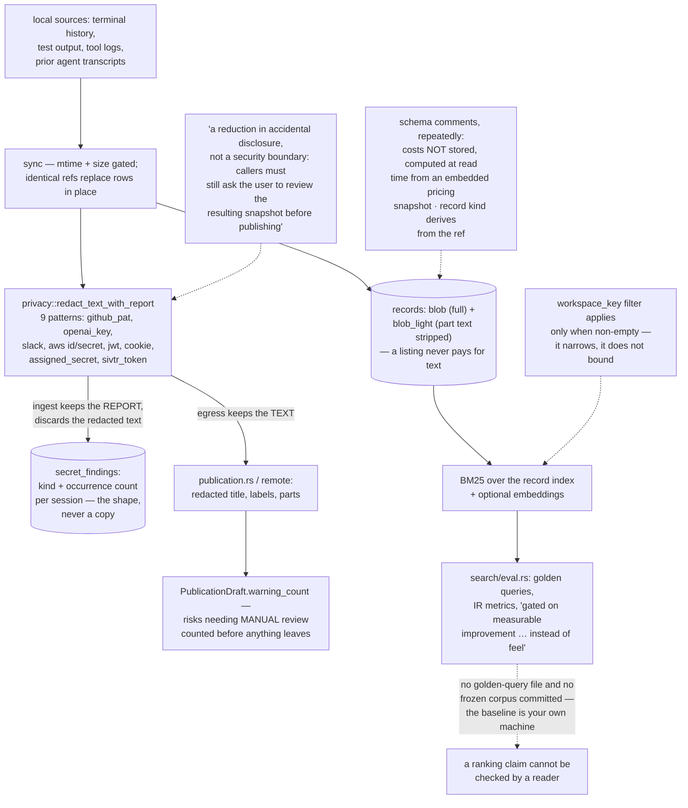

## 1. Executive Summary

sivtr — "一个面向智能体和人的统一的记忆空间", a unified memory space for agents and
people — is Apache-2.0 Rust, version 0.7.1, 74,339 lines with 768 test
functions, shipping a CLI, a VS Code extension, an MCP surface and a packaged
skill.

Its premise is that the memory already exists: "[d]evelopers and agents lose
time reconstructing context that already exists locally: terminal failures, test
output, tool logs, and previous AI sessions." So it syncs provider transcripts
and terminal history into a SQLite archive and makes them searchable, rather
than asking anyone to write memories down.

Capturing your terminal into a searchable index has an obvious problem, and the
way sivtr handles it is the reason to read it.

`privacy.rs` holds nine credential patterns — GitHub PATs, OpenAI keys, Slack
tokens, AWS ids and secrets, JWTs, cookies, an assigned-secret heuristic, and
its own token format — and a header that refuses to oversell them:

> "This module deliberately only removes high-signal credential formats. It is a
> reduction in accidental disclosure, not a security boundary: callers must
> still ask the user to review the resulting snapshot before publishing."

That is a correctly scoped claim, which is rarer in this corpus than the feature
it describes.

The interesting part is what happens with the scan's two outputs.
`redact_text_with_report` returns the redacted text *and* a report of what it
found. On the publication and remote paths, the text is what gets used. On the
ingest path, `replace_secret_findings` does this:

```
let (_, report) = crate::privacy::redact_text_with_report(&record.combined_text())?;
```

It throws the redacted text away and keeps only the report, writing one
`secret_findings` row per kind with an occurrence count. So the archive records
that a session contains three GitHub-token-shaped strings, and does not store a
copy of them — while the record itself stays in full, locally, because a
terminal log with its credentials blanked out is often the log you needed.

Detect on ingest, store the finding rather than the secret, redact on egress.
Three decisions, each made separately, each defensible.

The same discipline shows up in the schema comments, which are consistently
about *not* storing things. Costs "are NOT stored: they are computed at read
time from the embedded pricing snapshot, so a pricing refresh re-prices history
without touching these rows." The terminal/agent kind "is not stored: it derives
from the record ref." Every record is held twice on purpose — `blob` in full and
`blob_light` with the part text stripped — so a listing never pays to read text
it will not show.

The gap is on the retrieval side, and it is a reproducibility gap rather than a
correctness one. `search/eval.rs` is a proper IR harness: golden queries, metrics,
and a stated policy that "ranking changes are gated on measurable improvement
over a fixed baseline instead of feel." But no golden-query file and no frozen
corpus are committed anywhere in the tree — the only committed snapshot is
`pricing_snapshot.json.gz`. The baseline is whatever is on the machine running
`sivtr eval`, so a ranking claim cannot be checked by a reader and a regression
cannot be reproduced by a contributor.

## 2. Mental Model

A **record** is one terminal command or one agent turn: title, times, outcome,
exit code, and its parts in a MessagePack blob.

A **session** groups records from one provider, keyed by workspace and working
directory.

A **finding** is the shape of a secret — a kind and a count — not the secret.

An **origin** is where memory comes from: a local workspace or a remote device
mount, behind one display type so nothing above branches on which.



## 3. Architecture

| Area | Role |
| --- | --- |
| `crates/sivtr-core/src/privacy.rs` | Nine patterns, two outputs, and an honest header |
| `crates/sivtr-core/src/archive/schema.rs` | The tables, and comments about what is deliberately not stored |
| `crates/sivtr-core/src/archive/store.rs` | Sync, the workspace filter, and `replace_secret_findings` |
| `crates/sivtr-core/src/publication.rs` | Redaction on egress and the manual-review risk count |
| `crates/sivtr-core/src/origin.rs` | Local workspaces and remote mounts behind one type |
| `crates/sivtr-core/src/search/` | BM25, filters, expansion, and the eval harness |
| `crates/sivtr-core/src/record/` | The work-record model and its refs |
| `editors/vscode`, `skills/sivtr-memory` | The other two surfaces |

## 4. Essential Implementation Paths

`privacy.rs:1-6` for the claim, then `archive/store.rs:657-682` for what ingest
does with the scan, then any of the `publication.rs` call sites for what egress
does with it. Reading the three together is the design.

`archive/schema.rs:140-215` for the schema and its comments, which are worth
reading as a set of decisions rather than as documentation.

## 5. Memory Data Model

A session carries provider, session id, source path, working directory and a
normalised form of it, a workspace key, title, start and end, a record count, a
project, a starred flag, mtime and size for sync gating, and a synced-at.

A record carries a title, times, outcome, exit code and two blobs. The comment
explains the pair: `blob` is the full MessagePack record, `blob_light` is "the
metadata view with part text stripped (the light-load view)", and "[p]art text
lives inside the blob, so a re-sync that produces identical refs simply replaces
rows in place."

`secret_findings` is keyed `(session_row, kind)` with an occurrence count, and
`ON DELETE CASCADE` from the session. On each sync the session's findings are
deleted and rewritten, so the counts describe the current content rather than
accumulating.

There is no status, confidence, supersession or validity interval on a record,
which follows from what a record is: an observation of something that actually
happened, with an exit code. It is not a claim that can later be wrong. That is
a coherent position, and it is why this report carries no marks — the atlas's
questions about belief do not apply to a log, and the questions about scope are
answered by "one person's machine".

## 6. Retrieval Mechanics

BM25 over the record index with field selection and filters, expansion, an index
cache, and optional embeddings in `record_embeddings` with an
`embedding_generations` table so a model change can be tracked rather than
silently mixed.

The eval harness deserves credit for existing. A `GoldenQuery` names a query and
the `relevant` records it should surface as whole `WorkRef` strings, and the
module's stated purpose is to gate ranking changes on measurement. Most projects
in this corpus that ship retrieval ship no way to tell whether a change made it
better.

Two things limit it. The corpus is not in the repository, so the numbers are
personal. And `relevant` is the only labelled set — there is no
`must_not_surface`, so the harness measures whether the right records come back
and not whether a specific wrong one stays away. For a memory built out of
terminal history, the second question has teeth: the failing command from a
different project, the superseded fix, the log from the branch you abandoned.

## 7. Write Mechanics

Ingest is a sync from provider transcripts and terminal history, gated on mtime
and size so an unchanged file is skipped, with identical refs replacing rows in
place rather than duplicating. `usage_events` carries a `dedup_key` with a
partial unique index that "collapses duplicate extraction across re-syncs",
which is the same instinct applied to a different table.

Nothing here writes a memory by hand, which is the point — the tool's claim is
that the work already happened and the record already exists.

## 8. Agent Integration

A CLI, an MCP surface, a VS Code extension, and a packaged `sivtr-memory` skill.
An agent searches the same archive the person does, which is the "unified memory
space" of the tagline and is a genuinely better answer than a separate agent
memory that has to be told what the terminal did.

The `Origin` registry is worth noting for anyone building the same shape: local
workspaces and remote device mounts are both `Origin` with the same four fields,
and "[k]ind-specific details (root paths, peer/share ids) never enter `Origin`" —
the display layer never learns which kind it is holding, and only the resolution
layer dispatches on `Reach`. Keeping the identity of a source separate from how
to reach it is the distinction that lets a memory space span machines without
every caller knowing it does.

## 9. Reliability, Safety, and Trust

The privacy story is the trust story and it is told accurately. The scan is
best-effort, says so, and the publication path counts the risks that need manual
review before a person confirms — `PublicationDraft::warning_count` sums the
risks whose kind `is_manual_warning`, which is the number a confirmation prompt
should be showing.

The residual exposure is stated by the module itself and is worth restating
plainly for a reader deciding whether to point this at their terminal: the
archive holds the raw text, unredacted, including whatever the nine patterns did
not match. That is the correct trade for a local index — a redacted log is often
useless — and it means the SQLite file is as sensitive as the shell history it
was built from, and should be treated that way.

## 10. Tests, Evals, and Benchmarks

768 test functions, two DHAT and hot-path browse benchmarks, and the eval
harness. `tests/` holds fixtures and an MCP session-recovery test.

The gap named above is the one that matters: a harness whose corpus is not
committed cannot gate a pull request, only a maintainer's local run. Committing
a small synthetic corpus with labelled queries — including a few records that
must *not* surface — would turn the existing code into something a contributor
can be held to.

## 11. For Your Own Build

Separate the two outputs of a secret scan. The redacted text and the report of
what was found are different products, and they belong on different paths: keep
the report where the data lives, keep the redaction where the data leaves. sivtr
writes this as one function returning a tuple and two call sites using opposite
halves, which is about as clear as the idea can be expressed.

Index the shape, not the secret. A row saying "this session contains three
GitHub-token-shaped strings" is useful for triage, audit and warning a user, and
carries none of the risk of storing the match.

Say what your redactor is not. "[A] reduction in accidental disclosure, not a
security boundary" is one sentence that prevents a category of misuse, and it
costs nothing.

Write the comment about what you deliberately did not store. "Costs are NOT
stored: they are computed at read time from the embedded pricing snapshot, so a
pricing refresh re-prices history without touching these rows" tells the next
maintainer both the rule and the reason, and stops the denormalisation that
would otherwise look like an optimisation.

And if you build a retrieval eval, commit the corpus. A golden-query harness
that runs against the developer's own machine measures something real and proves
nothing to anyone else.

## 12. Open Questions

Whether the secret findings are surfaced to the user. The table exists and the
publication path counts risks; whether a user browsing a session is told it
contains credentials was not traced.

Whether a golden-query corpus exists outside the repository. The harness is
built for one and the format is defined; nothing in the tree ships an instance.

What the remote device mount implies for the privacy split. Ingest keeps raw
text locally on the assumption that local is safe; a remote mount moves the
boundary, and `src/remote/redact.rs` redacting on that path suggests the question
was considered, but the interaction was not followed here.

## Appendix: File Index

| Path | What to read it for |
| --- | --- |
| `crates/sivtr-core/src/privacy.rs` | Nine patterns, and a header that refuses to oversell them |
| `crates/sivtr-core/src/archive/store.rs:657-682` | The scan whose redaction is discarded and whose report is kept |
| `crates/sivtr-core/src/archive/schema.rs:140-215` | A schema commented with what it deliberately does not store |
| `crates/sivtr-core/src/publication.rs` | Redaction on egress, and the manual-review count |
| `crates/sivtr-core/src/origin.rs` | Source identity kept separate from how to reach it |
| `crates/sivtr-core/src/search/eval.rs` | A real IR harness with no committed corpus |

## History

**2026-09-16** — [`a26dc8a38b3eaa0e62e3e0ed128ad7fa25bd6b98`](https://github.com/Ariestar/sivtr/commit/a26dc8a38b3eaa0e62e3e0ed128ad7fa25bd6b98) — first reading, at a commit dated 16 September 2026. Screened before opening, from a shallow clone: thirteen files scanned, no auto-run surfaces, one build-time execution point, two unpinned surfaces, seven dependency files inside the seven-day cooldown, and the `CLAUDE.md` and `AGENTS.md` read as data. Nothing was installed, built or run.
