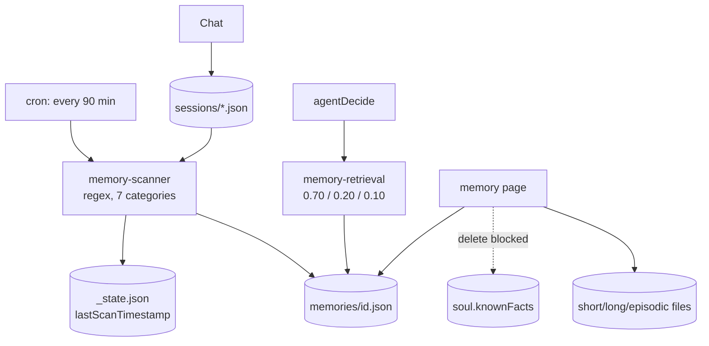

## 1. Executive Summary

Skales is a private, local-first desktop assistant — Electron around a Next.js
app, storing everything under `.skales-data/` on the user's machine. Its memory
is three separate subsystems that do not share a model:

1. **Extracted memories** — regex-mined from conversations on a 90-minute scan,
   one JSON file each, retrieved by keyword score.
2. **Tiered memory files** — `short-term`, `long-term` and `episodic`, managed
   from the memory page.
3. **The soul's known facts** — a key-value profile of email, phone, address and
   preferences.

Two things here are good and worth separating from the finding. The capture path
uses **no model at all**: seven categories mined by regex, run on a schedule,
watermarked so a conversation is scanned once. And the retrieval path is the
cheapest in this atlas — `keyword_overlap × 0.70 + recency × 0.20 +
category_boost × 0.10`, top five, behind a 30-second cache, with a stated budget
of under 100 ms because it runs *inside* `agentDecide()` before the LLM call.
Both are [zero-LLM capture](../../patterns/zero-llm-capture/) done without
apology, and every extracted memory carries `source_conversation_id`, so
provenance survives.

The finding is the third subsystem. The memory page renders a delete button beside
every known fact. Clicking it asks *"Delete fact «key»?"*, and on confirmation the
handler computes the object with that key removed, **discards it**, and opens a
modal reading: *"Deletion not yet supported in UI. Ask Skales to 'forget the fact
{key}' in chat."*

There is no forget verb in the application. Searching the tree for `forget`
outside the locale files returns exactly two hits, and both point the other way:
`memory-retrieval.ts:84` lists `forget` as a **retrieval keyword** that boosts
`action_item` memories, and `memory-scanner.ts:185` is a **capture pattern**
matching `don't forget …` and storing it as a new memory. The words the UI tells
the user to type are wired into the two paths that make memory more present, and
into nothing that removes it.

## 2. Mental Model

There is no single mental model, which is itself the architecture: three stores,
three lifecycles, one memory page.

An **`ExtractedMemory`** is the only one with a schema:

```ts
{ id, category, content, source_conversation_id, extracted_at, relevance_keywords }
```

with `category` drawn from `preference | fact | action_item | contact | url |
location | topic`. Those seven are a reasonable cut of what a personal assistant
needs, and `action_item` is prospective-memory-shaped — a `don't forget to …`
becomes a stored intention, though nothing surfaces it at a due time.

```text
   conversation files in .skales-data/sessions/
        │
        │  every 90 minutes, files with mtime > lastScanTimestamp
        ▼
   regex extraction — seven categories, no LLM
        │
        ▼
   .skales-data/memories/{id}.json        ← provenance: source_conversation_id
        │
        ├── retrieval: keyword 0.70 + recency 0.20 + category 0.10, top 5
        │              (synchronous, <100ms, inside agentDecide, 30s cache)
        │
        └── memory page ── delete ──► file removed, cache invalidated  ✓

   tiered files (short-term / long-term / episodic) ── delete ──►  ✓

   soul.memory.knownFacts ── delete ──►  ✗  "ask in chat"  ──► no such verb
```

Nothing has a state. No memory is a candidate, verified, superseded or rejected;
`extracted_at` is the only temporal field, so nothing is bi-temporal. The scan
watermark (`lastScanTimestamp`, advanced to `Date.now()` after each run) is what
stops a conversation being re-mined — a processing guard rather than a correction
one, so a deleted extracted memory whose source conversation is later touched
could return.

## 3. Architecture

TypeScript, **Business Source License 1.1** — source-available rather than open
source, which is worth knowing before reading the "steal" section below and is
unusual in this atlas.

- `apps/web/src/lib/memory-scanner.ts` (366) — categories, regex patterns, scan,
  list, delete, state.
- `apps/web/src/lib/memory-retrieval.ts` (160) — the scoring function and cache.
- `apps/web/src/actions/memories.ts` (35) — server-action wrappers.
- `apps/web/src/app/memory/page.tsx` (882) — the management UI.
- `apps/web/src/app/api/memory/scan/route.ts`, `api/buddy-memory/route.ts` —
  endpoints.
- `apps/web/src/actions/identity.ts` — the soul, known facts, and the tiered
  `deleteMemory(type, filename)`.



### Deployment and ergonomics

- **What has to run:** the desktop app. Storage is JSON files under
  `.skales-data/`; there is no database and no server.
- **Local and offline:** the memory subsystem entirely — capture and retrieval
  are regex and arithmetic. The assistant needs a model; its memory does not.
- **No API key is required to store or retrieve memories.**
- **Hand-repairable: completely**, and for known facts it is the *only* repair —
  editing the soul JSON is what the UI cannot do.

## 4. Essential Implementation Paths

**Capture.** `memory-scanner.ts` — `runMemoryScan()` selects session files whose
`mtimeMs > state.lastScanTimestamp` (303), applies the pattern table, writes
`{id}.json`, and saves `{ lastScanTimestamp: Date.now() }` (342). The header
documents the cadence: *"Runs every 90 minutes via /api/memory/scan endpoint."*

**Patterns.** Line 185 is representative:
`/\bdon['']t forget (?:to|about|that)?\s+([^.!?,\n]{5,80})/gi`, transformed to
`Don't forget: …` and filed as an `action_item`.

**Retrieval.** `memory-retrieval.ts` — the header states the algorithm, the budget
(*"Must complete in < 100ms — no LLM calls"*), the cap (five, score > 0) and the
30-second cache. Line 84 is the `action_item` keyword list, which includes
`forget`.

**Delete, where it works.** `actions/memories.ts` — `removeExtractedMemory(id)`
calls `deleteExtractedMemory` then `invalidateMemoryCache()`, so the read cache
cannot serve a deleted memory. Tiered files go through
`deleteMemory(type, filename)` in `actions/identity.ts`.

**Delete, where it does not.** `app/memory/page.tsx:612-626`, quoted because the
code narrates its own abandonment:

```ts
if (confirm(`Delete fact "${key}"?`)) {
    const newFacts = { ...soul.memory.knownFacts };
    delete newFacts[key];
    // We save the WHOLE soul object manually here to support deletion,
    // since saveHumanProfile only merges.
    // ideally we'd have a specific removeFact action, but this works for MVP.
    // ACTUALLY: Let's use saveHumanProfile to overwrite with 'null' or handle differently?
    // No, let's just use the server action directly if we could, but we can't from client easily…
    // Workaround: We'll implement a 'deleteFact' action next time.
    // For now, let's just show them. Editing comes later.
    setDeleteNotSupportedKey(key);
}
```

`newFacts` is computed and never used. The modal (861–877) then instructs the
user to ask in chat.

## 5. Memory Data Model

`ExtractedMemory` is the only typed record, and it is decently chosen:
`source_conversation_id` gives every derived memory a link back to what produced
it, and `relevance_keywords` is the retrieval key computed at write time rather
than at query time — a cheap, sensible trade for a store this size.

Everything else is untyped JSON. The tiered memories are files named by
convention; the soul's `knownFacts` is a plain key-value map, which is why
deleting a key requires rewriting the whole object and why the merge-only
`saveHumanProfile` cannot express it.

**No scope of any kind.** This is a single-user desktop application, so there is
no user, project or tenant key anywhere in the memory path — a defensible product
boundary and the reason `scope_enforced` is withheld rather than a criticism.

**No trust, no confidence, no validity interval, no version chain, and no
tombstone.** A regex hit becomes a memory; nothing downstream can say it was
wrong.

## 6. Retrieval Mechanics

The cheapest retrieval design in this atlas, and among the most honest:

```text
score = keyword_overlap × 0.70 + recency_score × 0.20 + category_boost × 0.10
top 5, score > 0, 30-second cache, < 100 ms, no LLM
```

It runs synchronously inside `agentDecide()` before the model call, so memory is
a prompt ingredient rather than a tool the model chooses to invoke. For a personal
assistant with hundreds of memories that is the right shape: no embedding model to
download, no index to corrupt, no latency to hide.

The failure modes are the ones the design accepts. Keyword overlap misses
paraphrase entirely — a memory recorded as "I work at Acme" will not surface for
"who is my employer". Recency at 0.20 means a durable preference decays against
recent noise. And the `action_item` keyword list containing `forget` means the
word most associated with removal is a signal to retrieve *more*.

## 7. Write Mechanics

**Regex, on a timer, with no model.** Seven categories, a pattern table, and a
watermark so each conversation is mined once. That is a legitimate and underrated
position: it costs nothing, it is inspectable, and a user can predict what will be
captured by reading the patterns.

The costs are the ones regex always has. No deduplication, so the same sentiment
in two conversations becomes two memories. No conflict detection, so "I love X"
and "I hate X" coexist and both score. And no filter on what enters — a credential
pasted into chat that matches a `fact` pattern is stored in a plaintext file.

### Operational cost

- **The write path never blocks the agent** — the scan is a separate cron-driven
  endpoint.
- **Lag before a memory is retrievable is up to 90 minutes**, which is the
  clearest stated write lag in this atlas and worth crediting: most systems here
  leave it to be inferred.
- **The scan is incremental**, bounded by mtime against the watermark, so cost
  scales with new conversations rather than with the corpus.
- **On the read path**, five memories and a 30-second cache bound both tokens and
  I/O.

## 8. Agent Integration

Memory is injected, not called. `memory-retrieval` runs inside `agentDecide()`
and the top five memories go into the prompt; the model has no memory tool, no
save verb and no forget verb. Everything the user can do to memory happens on the
memory page or not at all.

That is a coherent choice for a consumer product — and it is precisely what makes
the fact-deletion modal misleading, because it directs the user to a
conversational capability the architecture never gave the model.

## 9. Reliability, Safety, and Trust

**Provenance is present and useful.** Every extracted memory names the
conversation it came from, so the memory page can show a user why something is
known. Few consumer assistants bother.

**Deletion works in two of three subsystems, and the third is documented as
working when it is not.** Extracted memories delete and invalidate the cache;
tiered files delete behind a confirm dialog. Known facts do neither. The user
journey is: click the bin icon, confirm a destructive-sounding prompt, and receive
a modal telling them to ask in chat — where the phrase they are told to use,
*"forget the fact X"*, matches no handler, boosts `action_item` retrieval via the
keyword list, and in the nearby phrasing *"don't forget X"* would be **captured as
a new memory** by the scanner.

This is the sharpest instance in the atlas of the failure the
[benchmarks page](../../benchmarks/) argues nothing measures: the interface
asserts a deletion capability, the store has none, and nothing in the system
notices the contradiction. It is also, to be fair, **disclosed** — the modal says
"not yet supported", the code comments admit the shortcut, and no marketing claim
was found asserting otherwise. The defect is that the fallback it offers does not
exist either.

**No secret filtering on the write path**, and memories are plaintext JSON in a
user directory. For a product whose pitch is privacy through locality the threat
model is coherent — the data never leaves the machine — but anything with
filesystem access reads it.

**No tests of any kind** were found: zero `.test.ts`, `.test.tsx` or `.spec.ts`
files in the repository. None of the above is guarded against regression, and the
90-minute scanner has no fixture proving what it extracts.

## 10. Tests, Evals, and Benchmarks

There are none. No unit tests, no integration tests, no eval harness, no
benchmark. For a regex extraction pipeline this is the cheapest gap in the atlas
to close — the pattern table is a pure function over strings, and a fixture of 20
conversations with expected extractions would pin the whole capture path in an
afternoon.

`negative_eval` is withheld for the obvious reason, and the test that would matter
most here is a negative one: assert that after deleting a memory it does not
appear in the retrieval output — which would also catch a stale 30-second cache.

## 11. For Your Own Build

### Steal

- **Regex capture on a schedule with an mtime watermark.** Seven categories and a
  pattern table give a user something they can read and predict, cost no tokens,
  and scale with new conversation rather than with corpus size.
- **State the retrieval budget in the file header.** *"Must complete in < 100ms —
  no LLM calls"* is a constraint that survives refactoring because it is written
  where the next person will look.
- **Invalidate the read cache inside the delete action.** `removeExtractedMemory`
  calls `invalidateMemoryCache()` in the same function; the alternative is a
  deleted memory that keeps surfacing for thirty seconds and a bug nobody can
  reproduce.
- **Record the source conversation on every derived memory.** One field, and it is
  the difference between a memory page that can explain itself and one that
  cannot.

### Avoid

- **Offering a deletion affordance you have not implemented.** A bin icon and a
  confirm dialog are a promise. If the action is unavailable, disable the control
  and say why — do not confirm, compute the result, discard it, and redirect the
  user to a capability that does not exist.
- **Redirecting a user to a conversational verb without checking the agent has
  one.** The fallback in the modal is the only deletion path the product
  documents, and no handler implements it.
- **Letting the same word be a removal instruction in the UI and a retrieval boost
  in the ranker.** `forget` in the `action_item` keyword list is a small thing
  that makes the documented workaround actively counterproductive.
- **A merge-only profile writer.** `saveHumanProfile` merging rather than
  replacing is the root cause: with no way to express absence, deletion has
  nowhere to go, and the UI ends up apologising for the data layer.

### Fit

For a user who wants a local assistant that quietly remembers preferences and
action items without shipping conversations to a vendor, this is a reasonable
product and the memory design is proportionate — cheap capture, cheap retrieval,
an inspectable store, and a page where you can see and remove what it learned.

Do not treat it as a system of record, and do not rely on being able to remove a
known fact through the product. Until `deleteFact` exists, correcting the soul's
profile means editing JSON under `.skales-data/` by hand. That is a small fix and
it is not yet made, which is the whole report.

Anyone building on the code should also note the **BSL 1.1** licence: this is
source-available, not open source, so the transferable ideas above are patterns
rather than an invitation to copy the implementation.

## 12. Open Questions

- **Is `deleteFact` planned?** The comments say "next time"; nothing read here
  schedules it.
- **What happens to an extracted memory whose source conversation is deleted?** No
  cascade was found, so `source_conversation_id` would dangle.
- **Can a deleted extracted memory be re-extracted?** The watermark stops a
  conversation being re-scanned, but a conversation file touched after a deletion
  would pass the `mtime` check and re-mine the same sentence.
- **What drives the 90-minute cron in the packaged desktop app**, and does it run
  when the app is closed?
- **Do the tiered short-term, long-term and episodic files have distinct
  semantics**, or are they three directories with the same content model? The
  memory page treats them uniformly.

## Appendix: File Index

**Capture**

- `apps/web/src/lib/memory-scanner.ts` — categories, patterns (185), `mtime`
  watermark (303), state save (342)
- `apps/web/src/app/api/memory/scan/route.ts`

**Retrieval**

- `apps/web/src/lib/memory-retrieval.ts` — scoring header, `action_item`
  keywords (84), 30-second cache

**Actions**

- `apps/web/src/actions/memories.ts` — `removeExtractedMemory`,
  `triggerMemoryScan`
- `apps/web/src/actions/identity.ts` — soul, known facts,
  `deleteMemory(type, filename)`

**UI**

- `apps/web/src/app/memory/page.tsx` — management page; fact-delete handler
  (612–626); not-supported modal (861–877)

**Endpoints**

- `apps/web/src/app/api/buddy-memory/route.ts`

**Licence**

- `LICENSE` (BSL 1.1), `COMMERCIAL-LICENSE.md`
