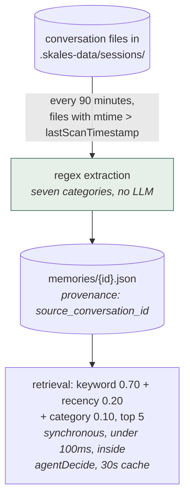
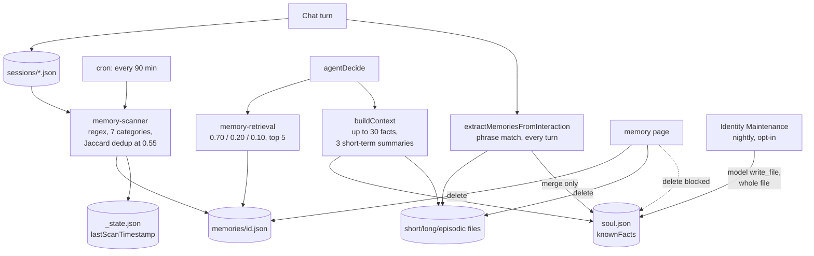

## 1. Executive Summary

**Upstream's history does not contain the code this report reads.** On 18 September 2026
the project re-created `main` without `apps/`, `electron/`, `scripts/` and the
npm manifests — 306 files — in any commit, after
[`c97206f4dce42a57ea121257e08af0c6544ec079`](https://github.com/skalesapp/skales/commit/c97206f4dce42a57ea121257e08af0c6544ec079)
announced the snapshot's removal with release 12.9.30. Its stated reason is that
the snapshot had stopped describing the product and drew security reports about
code the shipped app does not contain. The head of `main`,
[`d30bf27b835785c8af80c12cbc31df829c5caac8`](https://github.com/skalesapp/skales/commit/d30bf27b835785c8af80c12cbc31df829c5caac8),
holds 29 files and no source under a proprietary licence. The pinned tree
survives in the atlas archive, on
[`agent-memory-atlas-archive/2026-09-22-10-00-00`](https://github.com/agent-memory-atlas-archive/skalesapp--skales/tree/agent-memory-atlas-archive/2026-09-22-10-00-00),
and every path below cites it; the evidence is in
[Recorded Searches](#appendix-recorded-searches).

Skales is a private, local-first desktop assistant — Electron around a Next.js
app, storing everything under `.skales-data/` on the user's machine. The snapshot
is **v7.1.0**, current in March 2026 with one security fix in July. The product
ships as closed binaries, at 12.9.41 on 26 September 2026, and the repository
carries its release notes, install guides and issue tracker. What follows describes the
snapshot, the only Skales code that can be read; whether the shipped app
has these three subsystems, or the finding below, is not checkable. The
snapshot's memory is three separate subsystems that do not share a model:

1. **Extracted memories** — regex-mined from conversations on a 90-minute scan,
   one JSON file each, retrieved by keyword score.
2. **Tiered memory files** — `short-term`, `long-term` and `episodic`, written
   after each chat turn and managed from the memory page.
3. **The soul's known facts** — a key-value profile of email, phone, address and
   preferences, added from chat phrases and injected into every prompt.

Two things here are good and separate from the finding. The capture path
uses **no model at all**: seven categories mined by regex, run on a schedule,
watermarked so a conversation is scanned once. And the retrieval path is
arithmetic — `keyword_overlap × 0.70 + recency × 0.20 +
category_boost × 0.10`, top five, behind a 30-second cache, with a stated budget
of under 100 ms because it runs *inside* `agentDecide()` before the LLM call.
Both are [zero-LLM capture](../../patterns/zero-llm-capture/) done without
apology, and every extracted memory carries `source_conversation_id`, so
provenance survives.

The finding is the third subsystem. The memory page renders a delete button beside
every known fact. Clicking it asks *"Delete fact «key»?"*, and on confirmation the
handler computes the object with that key removed, **discards it**, and opens a
modal reading: *"Deletion not yet supported in UI. Ask Skales to 'forget the fact
{key}' in chat."*

There is no forget verb in the application. Outside the locale files, `forget`
appears in the snapshot's source as `fire-and-forget` in comments and at two
places that point the other way: `memory-retrieval.ts:84` lists `forget` as a
**retrieval keyword** that boosts `action_item` memories, and
`memory-scanner.ts:185` is a **capture pattern** matching `don't forget …` and
storing it as a new memory. The words the UI tells the user to type are wired
into the two paths that make memory more present, and into nothing that removes
it. The request itself is saved, as the episodic record every chat turn leaves
([Write Mechanics](#7-write-mechanics)).

The user guide at the head of upstream `main`, `docs/skales-guide.html`, describes a different
memory for the shipped app: an index and topic files, a search box with an
optional embedding mode, memory tools the model can call, and a page where
entries can be viewed, edited or deleted (1555–1598). That is documentation of
closed code. Nothing in the tree confirms it, and it does not say whether a
known fact can be deleted.

## 2. Mental Model

There is no single mental model, which is itself the architecture: three stores,
three lifecycles, one memory page.

An **`ExtractedMemory`** is the only one with a schema:

```ts
{ id, category, content, source_conversation_id, extracted_at, relevance_keywords }
```

with `category` drawn from `preference | fact | action_item | contact | url |
location | topic`. Those seven are a reasonable cut of what a personal assistant
needs, and `action_item` is prospective-memory-shaped — a `don't forget to …`
becomes a stored intention, though nothing surfaces it at a due time.


```mermaid
%% caption: extraction is regex over seven categories with no model call, and retrieval is a fixed weighted sum run synchronously inside the agent's decision
flowchart TB
    S[("conversation files in<br/>.skales-data/sessions/")]
    S -->|"every 90 minutes,<br/>files with mtime > lastScanTimestamp"| EX["regex extraction<br/><i>seven categories, no LLM</i>"]
    EX --> M[("memories/{id}.json<br/><i>provenance: source_conversation_id</i>")]
    M --> R["retrieval: keyword 0.70 + recency 0.20<br/>+ category 0.10, top 5<br/><i>synchronous, under 100ms, inside<br/>agentDecide, 30s cache</i>"]

    style EX fill:#e7efe9,stroke:#3d6b59
```

Extraction uses no model at all — seven regex categories, which is the
[zero-LLM capture](../../patterns/zero-llm-capture/) pattern taken to its
cheapest end and the reason the whole pass fits in 90-minute sweeps.

**Delete works on two of the three stores.** The memory page is one surface over
three, and they do not agree:

| Store | Delete from the memory page | What happens |
| --- | --- | --- |
| `memories/{id}.json` | yes | file removed, cache invalidated |
| tiered files — short-term, long-term, episodic | yes | removed |
| `soul.memory.knownFacts` | **no** | the UI says "ask in chat", and no such verb exists |

The third row is a delete button that discards its own computation: the page
knows which facts it is showing and tells the user to go somewhere that cannot
act.

Nothing has a state. No memory is a candidate, verified, superseded or rejected;
`extracted_at` is the only temporal field, so nothing is bi-temporal. The scan
watermark (`lastScanTimestamp`, advanced to `Date.now()` after each run) is what
stops a conversation being re-mined — a processing guard rather than a correction
one, so a deleted extracted memory whose source conversation is later touched
could return.

## 3. Architecture

The snapshot is TypeScript under the **Business Source License 1.1** —
source-available rather than open source, so the "steal" section below offers
patterns, not code to copy. From release 12.9.30 the repository's `LICENSE` is
the proprietary Skales End User Licence Agreement 1.2, and its README states that
releases up to 12.9.27 keep what the BSL granted. The memory paths, in the
archived snapshot:

- `apps/web/src/lib/memory-scanner.ts` (366) — categories, regex patterns, scan,
  list, delete, state.
- `apps/web/src/lib/memory-retrieval.ts` (160) — the scoring function and cache.
- `apps/web/src/actions/memories.ts` (35) — server-action wrappers.
- `apps/web/src/app/memory/page.tsx` (882) — the management UI.
- `apps/web/src/app/api/memory/scan/route.ts`, `api/buddy-memory/route.ts` —
  endpoints.
- `apps/web/src/actions/identity.ts` — the soul, known facts, and the tiered
  `deleteMemory(type, filename)`.


```mermaid
%% caption: two writers feed three stores; chat can add a known fact, the memory page cannot remove one, and the only thing that rewrites the soul file whole is a model following the nightly maintenance prompt
flowchart TB
    CH[Chat turn] --> S[(sessions/*.json)]
    CH --> EX[extractMemoriesFromInteraction<br/>phrase match, every turn]
    EX --> TF[(short/long/episodic files)]
    EX -->|merge only| KF[(soul.json<br/>knownFacts)]
    CRON[cron: every 90 min] --> SC[memory-scanner<br/>regex, 7 categories,<br/>Jaccard dedup at 0.55]
    S --> SC
    SC --> M[(memories/id.json)]
    SC --> ST[(_state.json<br/>lastScanTimestamp)]
    AD[agentDecide] --> R[memory-retrieval<br/>0.70 / 0.20 / 0.10, top 5]
    R --> M
    AD --> BC[buildContext<br/>up to 30 facts,<br/>3 short-term summaries]
    BC --> KF
    BC --> TF
    UI[memory page] -->|delete| M
    UI -->|delete| TF
    UI -.->|delete blocked| KF
    IM[Identity Maintenance<br/>nightly, opt-in] -->|model write_file,<br/>whole file| KF
```

### Deployment and ergonomics

- **What has to run:** the desktop app. Storage is JSON files under
  `.skales-data/`; there is no database and no server.
- **Local and offline:** the memory subsystem entirely — capture and retrieval
  are regex and arithmetic. The assistant needs a model; its memory does not.
- **No API key is required to store or retrieve memories.**
- **Hand-repairable: completely**, and for known facts it is the *only* repair —
  editing the soul JSON is what the UI cannot do.

## 4. Essential Implementation Paths

**Capture.** `memory-scanner.ts` — `runMemoryScan()` selects session files whose
`mtimeMs > state.lastScanTimestamp` (303), applies the pattern table, writes
`{id}.json`, and saves `{ lastScanTimestamp: Date.now() }` (342). The header
documents the cadence: *"Runs every 90 minutes via /api/memory/scan endpoint."*

**Patterns.** Line 185 is representative:
`/\bdon['']t forget (?:to|about|that)?\s+([^.!?,\n]{5,80})/gi`, transformed to
`Don't forget: …` and filed as an `action_item`.

**Retrieval.** `memory-retrieval.ts` — the header states the algorithm, the budget
(*"Must complete in < 100ms — no LLM calls"*), the cap (five, score > 0) and the
30-second cache. Line 84 is the `action_item` keyword list, which includes
`forget`.

**Delete, where it works.** `actions/memories.ts` — `removeExtractedMemory(id)`
calls `deleteExtractedMemory` then `invalidateMemoryCache()`, so the read cache
cannot serve a deleted memory. Tiered files go through
`deleteMemory(type, filename)` in `actions/identity.ts`.

**Delete, where it does not.** `app/memory/page.tsx:612-626`, quoted because the
code narrates its own abandonment:

```ts
if (confirm(`Delete fact "${key}"?`)) {
    const newFacts = { ...soul.memory.knownFacts };
    delete newFacts[key];
    // We save the WHOLE soul object manually here to support deletion,
    // since saveHumanProfile only merges.
    // ideally we'd have a specific removeFact action, but this works for MVP.
    // ACTUALLY: Let's use saveHumanProfile to overwrite with 'null' or handle differently?
    // No, let's just use the server action directly if we could, but we can't from client easily…
    // Workaround: We'll implement a 'deleteFact' action next time.
    // For now, let's just show them. Editing comes later.
    setDeleteNotSupportedKey(key);
}
```

`newFacts` is computed and never used. The modal (861–877) then instructs the
user to ask in chat.

## 5. Memory Data Model

`ExtractedMemory` is the only typed record, and it is decently chosen:
`source_conversation_id` gives every derived memory a link back to what produced
it, and `relevance_keywords` is the retrieval key computed at write time rather
than at query time — a cheap, sensible trade for a store this size.

Everything else is untyped JSON. The tiered memories are files named by
convention; the soul's `knownFacts` is a plain key-value map, which is why
deleting a key requires rewriting the whole object and why the merge-only
`saveHumanProfile` cannot express it.

**No scope of any kind.** This is a single-user desktop application, so there is
no user, project or tenant key anywhere in the memory path — a defensible product
boundary and the reason `scope_enforced` is withheld rather than a criticism.

**No trust, no confidence, no validity interval, no version chain, and no
tombstone.** A regex hit becomes a memory; nothing downstream can say it was
wrong.

## 6. Retrieval Mechanics

Retrieval is a fixed weighted sum with no index and no model:

```text
score = keyword_overlap × 0.70 + recency_score × 0.20 + category_boost × 0.10
top 5, score > 0, 30-second cache, < 100 ms, no LLM
```

It runs synchronously inside `agentDecide()` before the model call, so memory is
a prompt ingredient rather than a tool the model chooses to invoke. For a personal
assistant with hundreds of memories that is the right shape: no embedding model to
download, no index to corrupt, no latency to hide.

The failure modes are the ones the design accepts. Keyword overlap misses
paraphrase entirely — a memory recorded as "I work at Acme" will not surface for
"who is my employer". Recency at 0.20 means a durable preference decays against
recent noise. And the `action_item` keyword list containing `forget` means the
word most associated with removal is a signal to retrieve *more*.

## 7. Write Mechanics

**Regex, on a timer, with no model.** Seven categories, a pattern table, and a
watermark so each conversation is mined once. That is a legitimate and underrated
position: it costs nothing, it is inspectable, and a user can predict what will be
captured by reading the patterns.

Deduplication is by token overlap, and it is blind to negation. A candidate is
dropped when its tokens — lower-cased, with stop words and words of three letters
or fewer removed — reach a Jaccard similarity of 0.55 against any stored or
same-scan memory (`memory-scanner.ts:69-96`, `:241`). `not` and `no` are stop
words, and the like and dislike rules differ by one token, so whether a reversal
is kept depends on the length of its object. *"User dislikes coffee"* scores 0.50
against *"User likes coffee"* and both are stored; *"User dislikes dark roast
coffee"* scores 0.67 against its opposite and is discarded.

Nothing detects a conflict among what is kept. And nothing filters what enters —
a credential pasted into chat that matches a `fact` pattern is stored in a
plaintext file.

**A second writer runs on every chat turn, with no schedule.**
`extractMemoriesFromInteraction` (`actions/identity.ts:425-492`) is called after
each reply from the chat page (`app/chat/page.tsx:2341`), the chat action
(`actions/chat.ts:927`) and the Telegram route. It matches phrases rather than
patterns: *"my name is"* or *"call me"* writes a `name` fact (445), and
*"remember that"*, *"save this"* or *"note:"* writes a long-term memory and,
when the sentence reads *X is Y*, a known fact (461). Every turn also becomes an
episodic record holding the user's message (478). Facts reach the soul through
the merge-only `saveHumanProfile` (488), so chat can add a known fact and no
code path removes a single one; only onboarding's `completeBootstrap` replaces
the whole soul with the default (295-299).

### Operational cost

- **The write path never blocks the agent** — the scan is a separate cron-driven
  endpoint.
- **Lag before an extracted memory is retrievable is up to 90 minutes**, stated
  in the scanner's header rather than left to be inferred. The per-turn writer
  lands before the next turn.
- **The scan is incremental**, bounded by mtime against the watermark, so cost
  scales with new conversations rather than with the corpus.
- **On the read path**, five memories and a 30-second cache bound both tokens and
  I/O.

## 8. Agent Integration

Memory is injected, not called. `memory-retrieval` runs inside `agentDecide()`
and the top five extracted memories go into the prompt. `buildContext()` adds up
to 30 known facts under the instruction *"use these values exactly — never
guess"*, and three recent short-term summaries (`actions/identity.ts:191-260`).
The model has no memory tool: `check_identity` reads, and nothing saves or
forgets.

The user can write memory from chat by phrase, through the per-turn writer in
[Write Mechanics](#7-write-mechanics), and remove it only on the memory page.
The soul file is reachable through the general file tools: the path guard admits
the data directory in every file-access mode (`actions/orchestrator.ts:57-61`),
and `write_file` is marked for user confirmation (367). No handler maps a chat
request to that route.

The memory page uses the route on purpose. Its opt-in *Identity Maintenance* job,
scheduled for 03:00 nightly, prompts the model to read `../identity/soul.json`,
update `totalInteractions` and `learnings`, and write the whole file back
(`app/memory/page.tsx:231-256`). The prompt does not mention `knownFacts`, which
travel in the same file, so the one component that rewrites the file holding the
facts is a model. Whether a scheduled run waits for the confirmation was not
traced.

## 9. Reliability, Safety, and Trust

**Provenance is recorded and never read.** Every extracted memory names the
conversation it came from, and no code reads the field. The memory page shows
category, content and extraction time (`app/memory/page.tsx:804-830`), and the
prompt line carries category and content (`memory-retrieval.ts:156-160`). The
link back exists for an explanation nothing renders.

**Deletion works in two of three subsystems, and the third is documented as
working when it is not.** Extracted memories delete and invalidate the cache;
tiered files delete behind a confirm dialog. Known facts do neither. The user
journey is: click the bin icon, confirm a destructive-sounding prompt, and receive
a modal telling them to ask in chat. There the phrase they are told to use,
*"forget the fact X"*, matches no handler and boosts `action_item` retrieval via
the keyword list. The request is **stored as an episodic record** of the turn,
and the nearby phrasing *"don't forget X"* would be captured as a new memory by
the scanner. The fact itself goes on being injected into every prompt as a
value to use exactly.

This is the failure the [benchmarks page](../../benchmarks/) argues nothing
measures: the interface
asserts a deletion capability, the store has none, and nothing in the system
notices the contradiction. It is also, to be fair, **disclosed** — the modal says
"not yet supported", the code comments admit the shortcut, and no marketing claim
was found asserting otherwise. The defect is that the fallback it offers does not
exist either.

**No secret filtering on the write path**, and memories are plaintext JSON in a
user directory. For a product whose pitch is privacy through locality the threat
model is coherent — the store stays on the machine, though the facts and
memories injected into a prompt go to whichever provider answers — but anything
with filesystem access reads it.

**No tests of any kind** were found: zero `.test.ts`, `.test.tsx` or `.spec.ts`
files in the snapshot. None of the above is guarded against regression, and the
90-minute scanner has no fixture proving what it extracts.

## 10. Tests, Evals, and Benchmarks

There are none. No unit tests, no
integration tests, no eval harness, no benchmark. For a regex extraction pipeline
the gap was cheap to close — the pattern table is a pure function over strings,
and a fixture of 20 conversations with expected extractions would pin the whole
capture path in an afternoon. With the source out of the repository, nobody
outside the project can close it.

`negative_eval` is withheld for the obvious reason, and the test that would matter
most here is a negative one: assert that after deleting a memory it does not
appear in the retrieval output — which would also catch a stale 30-second cache.

## 11. For Your Own Build

### Steal

- **Regex capture on a schedule with an mtime watermark.** Seven categories and a
  pattern table give a user something they can read and predict, cost no tokens,
  and scale with new conversation rather than with corpus size.
- **State the retrieval budget in the file header.** *"Must complete in < 100ms —
  no LLM calls"* is a constraint that survives refactoring because it is written
  where the next person will look.
- **Invalidate the read cache inside the delete action.** `removeExtractedMemory`
  calls `invalidateMemoryCache()` in the same function; the alternative is a
  deleted memory that keeps surfacing for thirty seconds and a bug nobody can
  reproduce.
- **Record the source conversation on every derived memory, and show it.** One
  field is the difference between a memory page that can explain itself and one
  that cannot; Skales records it and its page never displays it.

### Avoid

- **Offering a deletion affordance you have not implemented.** A bin icon and a
  confirm dialog are a promise. If the action is unavailable, disable the control
  and say why — do not confirm, compute the result, discard it, and redirect the
  user to a capability that does not exist.
- **Redirecting a user to a conversational verb without checking the agent has
  one.** The fallback in the modal is the only deletion path the product
  documents, and no handler implements it.
- **Letting the same word be a removal instruction in the UI and a retrieval boost
  in the ranker.** `forget` in the `action_item` keyword list is a small thing
  that makes the documented workaround actively counterproductive.
- **A merge-only profile writer.** `saveHumanProfile` merging rather than
  replacing is the root cause: with no way to express absence, deletion has
  nowhere to go, and the UI ends up apologising for the data layer.

### Fit

For a user who wants a local assistant that quietly remembers preferences and
action items without shipping conversations to a vendor, this is a reasonable
product and the memory design is proportionate — cheap capture, cheap retrieval,
an inspectable store, and a page where you can see and remove what it learned.

Do not treat it as a system of record, and do not rely on being able to remove a
known fact through the snapshot. Without `deleteFact`, correcting the soul's
profile means editing JSON under `.skales-data/` by hand. The fix is small, and
the snapshot never made it.

The snapshot was supplied under **BSL 1.1**, source-available rather than open
source, so the transferable ideas above are patterns rather than an invitation to
copy the implementation. It was never what runs: the product a user installs is
five major versions on, proprietary, and documented by a guide describing a
different memory. The repository is where a bug in that product is filed, and
the snapshot is readable only from the atlas archive.

## 12. Open Questions

- **Did `deleteFact` ship?** The comments say "next time"; the release notes at
  the head of upstream `main` do not name it, and the binary cannot be read.
- **What happens to an extracted memory whose source conversation is deleted?** No
  cascade was found, so `source_conversation_id` would dangle.
- **Can a deleted extracted memory be re-extracted?** The watermark stops a
  conversation being re-scanned, but a conversation file touched after a deletion
  would pass the `mtime` check and re-mine the same sentence.
- **What drives the 90-minute cron in the packaged desktop app**, and does it run
  when the app is closed?
- **Do the tiered short-term, long-term and episodic files have distinct
  semantics**, or are they three directories with the same content model? The
  memory page treats them uniformly.

## Appendix: File Index

Every path is in the archived snapshot at
[`ce47854afe004af4e5c30df623f861fe140a5b4d`](https://github.com/agent-memory-atlas-archive/skalesapp--skales/tree/ce47854afe004af4e5c30df623f861fe140a5b4d);
none exists in upstream's history.

**Capture**

- `apps/web/src/lib/memory-scanner.ts` — categories, patterns (185), `mtime`
  watermark (303), state save (342)
- `apps/web/src/app/api/memory/scan/route.ts`

**Retrieval**

- `apps/web/src/lib/memory-retrieval.ts` — scoring header, `action_item`
  keywords (84), 30-second cache

**Actions**

- `apps/web/src/actions/memories.ts` — `removeExtractedMemory`,
  `triggerMemoryScan`
- `apps/web/src/actions/identity.ts` — soul, known facts,
  `deleteMemory(type, filename)`

**UI**

- `apps/web/src/app/memory/page.tsx` — management page; fact-delete handler
  (612–626); not-supported modal (861–877)

**Endpoints**

- `apps/web/src/app/api/buddy-memory/route.ts`

**Licence**

- `LICENSE` (BSL 1.1), `COMMERCIAL-LICENSE.md`

## Appendix: Recorded Searches

Run in a full clone of upstream `main` at `d30bf27b835785c8af80c12cbc31df829c5caac8`, after
`git fetch https://github.com/agent-memory-atlas-archive/skalesapp--skales 'refs/heads/*:refs/remotes/archive/*'`,
with `P=ce47854afe004af4e5c30df623f861fe140a5b4d`, the archived pin, and
`F=f8b18131332a5808b12138d5d8aee51179249621`, the upstream commit carrying its
author date and message.

| Claim | Check | Result |
| --- | --- | --- |
| The pin is not in upstream history | `git merge-base --is-ancestor $P origin/main; git merge-base $P origin/main` | Exit 1 from both: no common ancestor. `git rev-list --max-parents=0 origin/main` is `fc197205f47182510887f13a8ceea2bfd451e3bf`, dated 24 July 2026; the pin's root is dated 8 March 2026 |
| `main` was re-created on 18 September 2026 | `curl -s 'https://api.github.com/repos/skalesapp/skales/events?per_page=100&page=2'`, filtered for `PushEvent` | At 2026-09-18T00:25:16Z `main` moved from the pin to `b7d5eb6fd4cc84048e6300de34b0172e8213fe13`, which does not descend from it and already lacks the source; two more pushes by 01:20:57Z reached today's history |
| The pin's tree exists nowhere upstream | `git log origin/main --format=%T \| grep -c 56d3a66b1f548692247ac014f6a27041f16d62c9` | 0 |
| The rewrite removed exactly the source | `git diff --stat $F $P` | 306 files changed, 98,684 insertions, no deletions: 282 under `apps/`, 18 under `electron/`, 3 under `scripts/`, plus `package.json`, `package-lock.json` and `electron-builder.yml` |
| No upstream commit carries the source | `git log origin/main --format=%H -- apps electron scripts package.json package-lock.json electron-builder.yml \| wc -l` | 0 |
| No test of any kind at the upstream head | `git ls-files \| grep -E '(^\|/)(tests?\|__tests__)/\|\.test\.\|\.spec\.\|(^\|/)test_'` | Nothing; the tree is 29 files of documents, licence texts, one HTML guide and pet sprite packs |
| No test of any kind in the snapshot | `git ls-tree -r --name-only $P \| grep -E '(^\|/)(tests?\|__tests__)/\|\.test\.\|\.spec\.\|(^\|/)test_'` | Five paths, all Next.js API routes rather than tests: `api/calendar/apple/test/route.ts`, `api/calendar/outlook/test/route.ts`, `api/custom-endpoint/test/route.ts`, `api/ftp/test/route.ts` and `api/replicate/test/route.ts` — connection-test endpoints a user triggers to check an integration |
| No forget verb in the snapshot | `git grep -n -i -E 'forget' $P -- apps electron ':!apps/web/src/locales'` | 15 lines: 12 `fire-and-forget` comments, `memory-retrieval.ts:84`, and `memory-scanner.ts:185` and `:187`, the pattern and transform of one capture rule |
| No `deleteFact` action in the snapshot | `git grep -n -E 'deleteFact\|removeFact' $P -- apps electron` | Two comment lines, `app/memory/page.tsx:619` and `:622` |
| The release notes do not name fact deletion | `git grep -n -i -E 'deleteFact\|known ?facts?\|forget the fact' HEAD -- CHANGELOG.md` | Nothing |
| Deduplication is Jaccard at 0.55 and runs on both capture branches | `git grep -n -E 'isDuplicate' $P -- apps` | Defined at `memory-scanner.ts:94`, called at `:241` and `:259` |
| The per-turn writer runs from three call sites | `git grep -n -E 'extractMemoriesFromInteraction\(' $P -- apps` | `actions/chat.ts:927`, `api/chat/telegram/route.ts:567`, `app/chat/page.tsx:2341`, and the definition at `actions/identity.ts:425` |
| Only two writers touch the soul file in code | `git grep -n -E 'saveSoul\(' $P -- apps` | `identity.ts:298` in `completeBootstrap` and `:387` in `saveHumanProfile`, beside the definition at `:123`; the Identity Maintenance job writes it through the model's `write_file` |
| No secret filter on either writer | `git grep -n -i -E 'secret\|redact\|password\|api.?key' $P -- apps/web/src/lib/memory-scanner.ts apps/web/src/actions/identity.ts` | Nothing |
| No user, project or tenant key in the extracted-memory path | `git grep -n -i -E 'user_?id\|tenant\|project\|workspace' $P -- apps/web/src/lib/memory-scanner.ts apps/web/src/lib/memory-retrieval.ts apps/web/src/actions/memories.ts` | Nothing |
| Nothing surfaces an `action_item` at a due time | `git grep -n -E "'action_item'" $P -- apps ':!apps/web/src/locales'` | The type and five capture rules in `memory-scanner.ts`, and two colour choices in `app/memory/page.tsx:812` and `:816` |
| No cascade from a deleted conversation | `git grep -n -E 'source_conversation_id' $P -- apps` | The field at `memory-scanner.ts:33` and its two writes at `:248` and `:264`; nothing reads it |

## History

**2026-09-28** — [`ce47854afe004af4e5c30df623f861fe140a5b4d`](https://github.com/skalesapp/skales/commit/ce47854afe004af4e5c30df623f861fe140a5b4d) — same pin, whole report re-read. On 18 September 2026 upstream re-created `main` without its source. The pin's counterpart, [`f8b18131332a5808b12138d5d8aee51179249621`](https://github.com/skalesapp/skales/commit/f8b18131332a5808b12138d5d8aee51179249621), has its author date, message and every other blob; `git diff --stat` from it to the pin adds exactly 306 files under `apps/`, `electron/`, `scripts/` and the npm manifests, and no upstream commit touches those paths. The pin is kept because the code exists only in the [archive](https://github.com/agent-memory-atlas-archive/skalesapp--skales/commit/ce47854afe004af4e5c30df623f861fe140a5b4d); [§1](#1-executive-summary) says so. Marks stay at none. Three claims were wrong at every pin: the scanner deduplicates, by token overlap blind to negation; a second writer records every chat turn and adds known facts from chat phrases; and nothing reads the provenance field ([§7](#7-write-mechanics), [§9](#9-reliability-safety-and-trust)). Nothing installed, built or run.

**2026-09-17** — [`ce47854afe004af4e5c30df623f861fe140a5b4d`](https://github.com/skalesapp/skales/commit/ce47854afe004af4e5c30df623f861fe140a5b4d) — re-read three commits on and not one of them touches code. `apps`, `electron`, `pets`, `scripts`, `package.json` and `package-lock.json` are byte-identical by tree or blob sha, as are the licence, the security policy and every install guide; the changes are `CHANGELOG.md` (+475), `README.md`, and the public guide moved from the repository root into `docs/`. Marks unchanged at none, and every line anchor in this report still names the same code because the code did not move.

The one thing worth recording is what those commits say about the gap this report is built on. The committed changelog now runs to **v12.9.27** while the tree stays the frozen v7.1.0 snapshot, so the repository's most actively maintained file documents releases of a binary nobody can read the source of. Section 1 states that rather than leaving the version pair to a reader's arithmetic. Screened again before reading: no auto-run surface, one build-time execution surface, two unpinned surfaces, nothing inside the cooldown. Nothing was installed and nothing was run.

**2026-09-07** — [`522a16ea3d90c2e7688368ab320615d1a9d96563`](https://github.com/skalesapp/skales/commit/522a16ea3d90c2e7688368ab320615d1a9d96563) — re-pinned 53 commits on. Every one of them is documentation and release notes except two: a fixed strip in `apps/web/src/app/layout.tsx` and a launch dialog in `electron/main.js`, both saying the checked-in source is a v7.1.0 snapshot from March 2026 that is no longer what ships. The memory subsystems this report describes are byte-identical to the previous pin, so every finding stands for the snapshot; section 1 and the fit paragraph state what the snapshot is. The product moved from 7.1.0 to 12.9.26 as closed binaries in the same period and cannot be read. Screened first: no auto-run surface, a `postinstall` that runs a nested `npm install`, lockfiles unchanged for 171 days; nothing installed or run.

**2026-07-29** — [`128103e732465a00a2d2ab4bf7d322e32c17ad4d`](https://github.com/skalesapp/skales/commit/128103e732465a00a2d2ab4bf7d322e32c17ad4d) — first reading.
