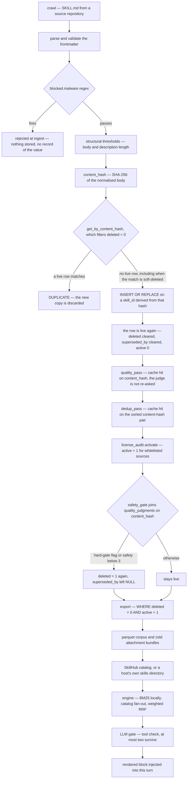

## 1. Executive Summary

SkillCorpus is EverMind's open pipeline for turning public `SKILL.md` files into an agent's procedural memory. It has two halves that share nothing but a parquet file: a **producer** (Apache-2.0 Python, `skillcorpus/`) that crawls source repositories, filters and judges what it finds, and writes a corpus; and a **consumer** (`skillcorpus_plugin/`, Python and TypeScript engines plus five host plugins) that searches that corpus on the turn and puts at most two skills into the agent's context. 297 tracked files, roughly 34,000 lines of Python and TypeScript, MIT on `match/` and `evaluate/`, and a paper — [arXiv:2607.15557](https://arxiv.org/abs/2607.15557), submitted 17 July 2026 — whose abstract reports ~821,000 crawled skills filtered to 96,401.

**The mechanism worth reading is that every curation decision is keyed on the hash of the content it judged, not on the row it landed on.** `quality_judgments` has `content_hash TEXT PRIMARY KEY` (`skillcorpus/curate/quality.py:200-208`) and `dedup_judgments` has a `pair_key` of two sorted content hashes (`skillcorpus/curate/dedup.py:35-44`). The build's fixed tail re-runs the gates that read them on every pass (`skillcorpus/cli.py:302-338`), so a skill excluded for a `cmd_injection` flag is excluded again the next time the same body is crawled, by the same cached verdict, without anyone having recorded a rejection anywhere else. That is the rejected-value tombstone this atlas asks for, arrived at sideways — the table was built as a cache to avoid paying the judge twice.

**The row-level markers, by contrast, do not survive a re-crawl, and the code shows exactly where.** `get_by_content_hash` filters `deleted = 0` (`skillcorpus/core/store.py:272-278`), `skill_id` is derived from the content hash, and `insert` is `INSERT OR REPLACE` (`:142-186`) writing `deleted` from a freshly built record. So re-ingesting an excluded body finds no duplicate, overwrites the excluded row, and clears both `deleted` and `superseded_by`. The exclusion comes back only because the gate runs afterwards. One `AND deleted = 0` is the entire difference between a store whose flags are load-bearing and one whose flags are a cache of a decision held elsewhere — and here the decision genuinely is held elsewhere, which is why the design survives its own clobbering.

**Nothing an agent does ever writes back.** There is no feedback surface, no usage counter, no outcome signal, no promotion of a skill that worked: the corpus flows one way, from public repositories through a batch build to a read-only artifact. The data model says so in its own header — `SkillRecord` is adapted from another project's and "drops the 4 counters / lineage / evolution fields (no execution tracking or evolution)" (`skillcorpus/core/models.py:1-6`). Compared with the atlas's reference for this shape, Voyager, the verification gate that makes a skill library trustworthy has been moved off the agent's execution and onto an LLM reviewer at build time.

**The consumer half is the more carefully engineered of the two**, and its care is about the turn rather than about truth: every optional stage degrades to a no-op, the rewrite and the gate each carry their own deadline, and `retrieve` returns `""` on any internal failure because "a retrieval problem must cost the turn its skills, never the turn itself" (`skillcorpus_plugin/engine-python/skillsearch/engine.py:19-22`). The bundle installer that materialises a remote skill's scripts is the one place where untrusted bytes reach the disk, and it is written like it knows that — path-traversal rejection, an extension allowlist, size caps, staging plus atomic rename (`hub_client.py:263-295`).

## 2. Mental Model

A memory here is **a procedure someone else wrote**, admitted to the library by a pipeline and retrieved by similarity to the task. It is not learned, not revised by use, and not owned by the agent that reads it. The epistemic question the system answers is therefore not "is this true" but "may this be shipped" — and it answers it twice, with two booleans owned by two different gates that deliberately do not share a column.

`active` is the licence bit. `license_audit activate` sets it from a GREEN whitelist of source repositories; `export` filters `WHERE s.deleted = 0 AND s.active = 1` (`skillcorpus/export/corpus.py:38`). `deleted` is everything else — a near-duplicate loser (with `superseded_by` pointing at the winner) or a safety exclusion (with `superseded_by` left NULL, so the two are distinguishable afterwards). The safety gate's header explains the choice and is the clearest statement of the design's own reasoning: `active` "is the licence bit that `license_audit activate` owns and would re-set to 1, so using it here lets a later `activate` silently revive an excluded skill" (`skillcorpus/curate/safety_gate.py:7-13`).

**There is no third state, and that is why the trust-state mark is withheld.** A skill is in the corpus or out of it. Nothing expresses "held on record but not believed": an excluded skill is not retrievable at all, so no reader is ever handed something the system doubts. The three LLM facets that could ground such a state — utility, robustness, safety, each 0-10 — are a score, spent on a threshold at the gate and on a weighted `quality_score` used for ranking, exactly the collapse the rubric separates a state from.

**What is durable is the judgement, not the row.** Both LLM passes write their verdict under the hash of what they judged and skip a hash they have already seen. A rebuilt library therefore re-derives its exclusions from the same verdicts rather than re-asking, which makes the decisions stable across builds and immune to a re-crawl re-admitting a body under a new record.



## 3. Architecture

Two deployments that never run in the same process.

**The producer** is a CLI over a library directory, defaulting to `~/.skillcorpus` and relocatable by `SKILLCORPUS_HOME` (`skillcorpus/core/paths.py`). `cli build` reads a registry of sources from `configs/`, discovers repositories, clones or pulls them into a cache, and ingests every `SKILL.md` it finds. Then a fixed tail runs five stages as subprocesses — quality judging, cross-source dedup, licence activation, the safety gate, export — each isolated so an LLM or embedding pass cannot leak memory into the next (`skillcorpus/cli.py:293-300`). Standing this up needs an OpenAI-compatible chat endpoint for the judges, an embedding endpoint for near-duplicate detection, and a GitHub token for the licence refresh; every one of them is optional and the pipeline degrades, which is the operator-facing point: a no-LLM build produces a corpus that has passed the structural filters and the regex block and nothing else, and the safety gate prints a warning saying precisely that (`skillcorpus/curate/safety_gate.py:63-77`).

**The retrieval models** are a separate, self-hostable pair: a fine-tuned Qwen3-0.6B bi-encoder and a Qwen3-0.6B reranker behind an HTTP server with `/embed` and `/score`, about 2.5 GB of VRAM for both (`skillcorpus/match/serve.py`, `skillcorpus/match/README.md`). The training recipe for both — query synthesis, random negatives, listwise reranker data — is committed beside them.

**The consumer** is a library, not a service. `SkillSearch` is built once at host startup and holds its sources' indexes and connection pools; a host calls `retrieve(query)` and gets a rendered block, or `hits(query)` and renders its own (`skillcorpus_plugin/engine-python/skillsearch/engine.py:270-305`). The same design exists file-for-file in TypeScript (`engine-typescript/src/`: `bm25.ts`, `fusion.ts`, `gate.ts`, `hub-source.ts`, `refs.ts`, `zip.ts`), because the hosts are split between the two languages. Five plugins wrap it, and the WorkBuddy package shows both delivery modes in one tree: `hooks/hooks.json` registers a `UserPromptSubmit` command hook with a 10-second timeout for automatic mode, and `mcp/servers.json` registers a stdio MCP server exposing `skill_search` for on-demand mode.

## 4. Essential Implementation Paths

**Ingest one skill** — `Ingester.ingest` (`skillcorpus/curate/pipeline.py:318-515`): find and parse `SKILL.md`, validate the frontmatter, run `check_safety` and reject on any `blocked.*` flag, apply body and description length thresholds, compute `content_hash` and `name_hash`, look for an exact live duplicate, then hand off to `_finalize_and_insert` (`:228-317`) which collects near-duplicate candidates, judges them, picks a single winner before acting, copies the bundle into the library, inserts, and only then supersedes the losers — "so a failed copy/insert cannot destroy the losers and leave a dangling `superseded_by`".

**Judge quality** — `quality_pass` (`skillcorpus/curate/quality_pass.py`) selects the hashes with no cached judgment, calls the LLM with a few-shot calibration prompt over three facets and a 19-flag vocabulary, and writes one row per content hash.

**Exclude the unsafe** — `run_safety_gate` (`skillcorpus/curate/safety_gate.py:29-79`) joins the cache to every live row and soft-deletes those with `safety < 3` or a flag in `HARD_GATE_FLAGS` (`prompt_injection`, `cmd_injection`, `unsafe_exec`, `auth_bypass`, `csam_risk`, …). It then counts active rows with no judgment at all and warns that the active set "is NOT fully safety-vetted" — a fail-open it refuses to leave silent.

**Export** — `write_corpus` (`skillcorpus/export/corpus.py:198`) reads `WHERE s.deleted = 0 AND s.active = 1`, LEFT JOINs the quality subscores into a native struct column, and writes `skills.parquet` plus per-skill attachment tarballs.

**Retrieve on the turn** — `SkillSearch._search` (`engine.py:308-361`): optionally rewrite the query under `rewrite_timeout_s`; fan out across sources and fuse; hydrate bodies for metadata-only hits; drop exact-body duplicates; resolve `{baseDir}` references for local hits *before* the gate, because an unresolved path reads to the gate like a missing file; run the gate under `gate_timeout_s`, degrading to the top `max_select` on timeout; truncate to `top_k`; materialise remote bundles; resolve PathGuard placeholders.

## 5. Memory Data Model

One table holds the memories (`skillcorpus/core/models.py:130-167`). A `skills` row carries identity (`skill_id`, `name`, `description`, `body`, raw frontmatter), provenance (`source`, `source_url`, `source_path`, `license`), two hashes (`content_hash` of the normalised body, `name_hash` of the lowercased name), classification (`category` from a 16-class enum with per-class descriptions in the same file, `tags`), judgement (`quality_score` 0-1, `safety_flags`, `body_tokens`), structure (`has_scripts`, `has_references`), status (`deleted`, `superseded_by`, and an `active` column that exists in SQL but not on the dataclass), timestamps (`added_at`, `updated_at`) and `stored_path`.

Two more tables hold the judgements, and they are the durable half. `quality_judgments(content_hash PRIMARY KEY, score, reason, judged_at, subscores)` — with a comment stating the contract: the judge "is frozen for this release, so the cache is keyed on `content_hash` alone — same body → same score" (`quality.py:210-214`). `dedup_judgments(pair_key PRIMARY KEY, is_duplicate, confidence, reason, judged_at)` where `pair_key` is the two content hashes sorted and joined. A `vec_skills` sqlite-vec table and a FAISS sidecar hold embeddings for near-duplicate search only.

Time is single: `added_at` and `updated_at`, the latter overwritten in place, with no record of when a skill was valid as distinct from when the library learned it. No bi-temporal mark.

`active` deserves a note because it is invisible from Python. `SkillRecord` has no such field, and `insert` hardcodes `active = 0` on every write with the comment "a row lands inactive and `curate.license_audit` flips it per the GREEN whitelist" (`store.py:143-145`). The consequence is that `SkillStore.update`, which re-inserts the mutated record, would silently deactivate whatever it touched — which does not bite, because `update` and `delete` have no caller anywhere in the repository (`grep -rn '\.update(' --include='*.py' skillcorpus/ scripts/` finds only dict updates in tests and release scripts; `grep -rn '\.delete(' --include='*.py' skillcorpus/ scripts/` finds none). They are library surface with no producer; the correction path that exists is the pipeline.

## 6. Retrieval Mechanics

The producer's vector index is not a retrieval arm. `find_near_duplicates` queries it at write time to find merge candidates; nothing reads it to answer a question.

The consumer's retrieval is a fan-out. The local arm is a self-contained Okapi BM25 over every `SKILL.md` under the configured directories — workspace skills, a packaged builtin directory, and any extra named directories — with CJK-aware tokenisation and a stopword pass that prunes terms appearing in over half a corpus of at least a guard size, so that a directory of file-handling skills asked about the weather returns nothing rather than whichever skill happened to share the word "skill" (`skillsearch/local_pool.py`, `skillsearch/bm25.py`). The catalog arm is an HTTP call to SkillHub, filtered twice on the way back: a `hub_min_safety` floor of 0.7 on the published safety score, and `check_keyword_relevance`, a lexical guard whose `passed` is read at `sources/hub_source.py:73` and which requires a non-generic query term to match the name, description or tags. Two marketplace arms, ClawHub and skillhub.cn, are configured the same way.

Fusion is weighted RRF at `k = 60` with per-source trust weights — local 1.0, hub 0.85, marketplaces 0.75 — collapsing cross-source duplicates and keeping the highest-scoring copy as the representative (`skillsearch/fusion.py`). The gate then sees name, description and a 300-character excerpt for each of up to `gate_pool = 10` candidates plus the tool names the agent holds this turn, and returns at most `max_select = 2`; `top_k` is also 2. An empty gate result is a valid "inject nothing"; a gate failure or timeout falls back to the top hits rather than to nothing, so a broken gate cannot silently empty the block.

No scope key is applied anywhere on this path. The separation between a team's own skills and a public catalog is a physical one — different directories, different endpoints, different weights — which the rubric counts as a real boundary and a different mechanism, so the scope mark is withheld.

## 7. Write Mechanics

Writes do not happen on the turn. They happen when an operator runs `cli build`, and the whole library is re-derived: every source re-cloned or pulled, every skill re-ingested, every unjudged hash judged, every gate re-run, the corpus rewritten. There is no incremental refresh state and no cadence — `run_refresh`'s own docstring says so.

Nothing blocks an agent, because nothing an agent does is a write. The lag between a skill being written and being retrievable is the lag of a build plus, for a host's own directory, one `invalidate()` — the local scan is cached for the life of the `SkillSearch` object, so a `SKILL.md` written after the first search is invisible until the host that watches the directory says otherwise (`engine.py:104-119`). A background pass does rewrite the whole store, and it is the build itself.

Ingest-time exclusion has three shapes with different durability. A `blocked.malware` regex hit rejects before any write, so nothing records the value and a re-crawl simply re-rejects by the same rule. A structural threshold failure does the same. Everything after that lands in the database and is excluded afterwards by a gate reading a hash-keyed cache — which is the only one of the three whose decision is both recorded and re-appliable.

## 8. Agent Integration

Two modes, exclusive by design. **Automatic**: a host hook fires before the model answers, calls `retrieve`, and injects a rendered block — no tool call, no skill names to remember. **On demand** (the default since 2 September 2026): the agent gets a `skill_search` MCP tool and decides when to pay for retrieval, which on a long task means paying at the step that needs it and not on the turns that do not.

The five packaged hosts are OpenClaw 1.x and 2.0 (two packages, because 2.0 dropped the hook the 1.x plugin injected through), WorkBuddy, Hermes, Raven and the DeepSeek Harness. The README is explicit that Raven's automatic mode is shipped inert — it "will claim the `skills` stage once Raven merges its upstream `context_segments` slot, and is inert until then" — which is an unusual and welcome thing to say in a feature table.

The engine is host-agnostic by construction: `extra_sources` takes anything with a `SkillSource` shape, "a host's memory backend, a private library, a second catalog", and `set_provider` exists so that a host's live `/model` switch moves retrieval to the new provider rather than leaving the rewriter and gate calling the credential that just stopped working.

## 9. Reliability, Safety, and Trust

**What is defended well.** The injection path treats the corpus as untrusted bytes. `_safe_extract` (`hub_client.py:263-295`) resolves each zip entry against the destination and raises on anything not `is_relative_to` it, skips disallowed extensions, caps per-file and total uncompressed size, and extracts into a staging directory renamed atomically into place so a partially extracted bundle is never visible under the final name. Placeholder resolution — mapping `{{SKILL_DIR}}`, `{{HOME}}` and friends onto the host's real filesystem — is off by default and documented as being only for a corpus a trusted PathGuard pass produced, "not for arbitrary third-party skills" (`engine.py:499-509`). Every optional stage fails closed toward *fewer* skills, and the one place that fails open — a gate error keeping the top hits — is stated as a deliberate choice with its reason.

**What is not defended, because it cannot be here.** The content is third-party procedural instructions, selected by similarity, rendered into the agent's context, with the paths to its executable scripts resolved to real locations on the host. The only barrier between a hostile `SKILL.md` and the agent's context is the LLM's own judgement at build time — the five hard-gate flags including `prompt_injection` and `unsafe_exec` — plus a single-pattern regex whose one rule matches a specific tool name (`skillcorpus/curate/safety.py:19-21`). The project is candid about what it removed and why: substring heuristics for suspicious content were dropped after "a stratified audit measured their false-positive rate above 90%". A build run without a reachable LLM applies none of this, and the gate says so in capitals.

**Provenance is real and licence-aware.** Every row keeps the source repository, the path within it and the upstream licence string; `license_audit` fetches SPDX ids from the GitHub API, builds a whitelist of GREEN categories, and activates only sources on it. `audit/license_safe_sources.json` in the tree is the demo whitelist — four public permissive sources — and its `_note` says the production whitelist is generated from a private CSV and not shipped. A drift test pins the JSON's `green_categories` against the code's `GREEN_LICENSES` (`skillcorpus/tests/test_license_filter.py`).

**No mutation audit exists.** `grep -rn "CREATE TABLE" --include="*.py" skillcorpus/` returns three tables — `skills`, `quality_judgments`, `dedup_judgments` — and none is an event log; no JSONL or append-only file records what changed. The engine can write a gate decision log to a path named by `SKILLSEARCH_GATE_LOG_PATH`, but that records a retrieval decision rather than a mutation, which is the other half of the pattern and not this mark.

**No human review surface.** The nearest things are the licence whitelist, which a person maintains but which adjudicates *sources* rather than content, and `dedup_pass --dry-run`, which prints the merges it would make. Nothing queues a skill for approval and nothing in the tree drains such a queue.

## 10. Tests, Evals, and Benchmarks

**I did not run this suite.** The screen (`scripts/screen_repo.py`) reported sixteen dependency surfaces changed within a day of the pinned commit — the pin is the day after the tree was last touched — and this atlas does not install a third-party dependency published inside a seven-day window. Everything below is read from the committed code.

`make test` is `pytest -q skillcorpus/tests`: sixteen files covering the build chain, classification, clone safety, export, dedup, licence drift, safety, and an upgrade smoke test that reproduces a specific past failure — a schema migration that left every row `active = 0` and therefore exported an empty corpus. The engines carry their own suites (eleven files in `engine-python/tests`, and the TypeScript mirror), and the repository additionally runs four repository-hygiene checks in `make check-repo` — asset presence, file sizes, a project inventory, and release-version agreement across the plugin packages.

Two suites hold must-not assertions and both are written against populated fixtures with controls, which is what keeps them from passing vacuously:

- `test_an_unrelated_query_gets_nothing_from_the_local_source` (`engine-python/tests/test_bm25_stopwords.py:59-88`) builds twelve file-handling skills, asserts the weather query returns `""`, and then asserts `pdf-forms` comes back for `"fill an acroform"` from the same directory.
- `test_write_corpus_full` (`skillcorpus/tests/test_corpus_export.py:65-106`) exports a three-row database — one live, one `deleted = 1`, one `active = 0` — and asserts exactly one row survives and which one; `test_safety_gate_excludes_unsafe` excludes two of four skills and asserts the clean one and the soft-flagged one stay.

**The published benchmark numbers are not reproducible from this repository.** `skillcorpus/evaluate/` holds three harnesses — SkillsBench, GDPVal and QwenClawBench — with runners, graders, task definitions and a results *format* document, but no result artifact: `find . -path ./.git -prune -o -type f \( -name "*.json" -o -name "*.csv" -o -name "*.jsonl" -o -name "*.parquet" \) -print` returns manifests, lockfiles, one example task and one test fixture, and nothing else. The README's Table 1 — pass rates from 8.8 to 13.0 on SkillsBench for OpenClaw with Qwen3.5-27B, up to 9.2 to 22.6 for Raven with Qwen3.5-397B, pooled deltas of +7.5, +1.51 and +2.79 percentage points — is cited to the paper and appears in the tree only in the two README files. The paper's abstract states the same headline (+7.5 pp, largest on SkillsBench) and adds what the README does not: that an operational analysis traces the gains to "a coverage boundary and a harness boundary", and that the corpus behind those numbers is 96,401 skills filtered from ~821,000 crawled. The public demo corpus is 1,000.

## 11. Patterns Worth Stealing

### Steal

**Key a curation decision on the hash of what was judged, not on the row.** Two tables, one primary key each, and the property falls out: a re-crawl cannot re-admit a body under a new record, and a re-run cannot re-roll a verdict. It costs a column and it is the difference between an exclusion that holds and one that holds until the next import.

**Make the exclusion flags orthogonal on purpose, and write down why.** Using `deleted` for safety and `active` for licence, with a comment explaining that the reverse would let a later `activate` revive an excluded skill, is a two-line decision that prevents a whole class of order-dependent bug. So is leaving `superseded_by` NULL on a safety exclusion so the two kinds of exclusion stay distinguishable afterwards.

**Warn loudly when a gate could not run.** The safety gate counts active rows with no judgment and prints that the active set is not fully safety-vetted. A gate that silently passes everything when its judge is unreachable is the failure this catches, and it is cheap.

**Bound each model call on the hot path separately, and degrade differently at each.** A timed-out rewrite searches the raw query; a timed-out gate keeps the top two; a failed retrieval injects nothing. Three different fallbacks because three different things are being protected.

### Avoid

**Do not let a library API that nobody calls stand in for a correction path.** `SkillStore.update` and `SkillStore.delete` are unwired, and `update` would additionally reset `active` to 0 through the shared `insert`. If the pipeline is the only correction surface, say so and delete the rest.

**Do not read a value-keyed dedup index through a filter that hides the rejections.** `get_by_content_hash` filtering `deleted = 0` is what makes the row-level markers non-durable. The fix is one clause, and without the gates re-running afterwards it would be a live re-admission bug.

**Do not assume a quality score can carry an epistemic state.** Three 0-10 facets are enough to build a `candidate`/`admitted`/`rejected` ladder, and this design spends them on a threshold and a ranking weight instead, leaving "may this be acted on" expressible only as in-or-out.

### Fit

Read this if you are building **procedural memory from third-party content** — a skill layer, a playbook library, a prompt registry — and the hard part is curation rather than recall. The producer is the half worth borrowing, and its ideas survive being lifted out of Python: hash-keyed judgement caches, orthogonal exclusion flags, a fixed re-derived tail.

Do not read it for **experiential memory**. Nothing here observes an agent, and the atlas's own pattern page is direct about what that costs: Voyager's gate is stronger than any judgment-based gate because "did it run and produce the intended state?" is checkable in a way an LLM's opinion of a document is not. Operationally, the producer is a batch job needing a chat endpoint, an embedding endpoint, a GitHub token and disk; the consumer is a library with a BM25 index and, at most, two model calls per turn, and a team that only wants the second half can take it without running the first.

## 12. Antipatterns / Risks

**The corpus is an injection surface by construction.** Retrieved-by-similarity third-party instructions, rendered into context, with script paths resolved onto the host. The defence is one LLM's build-time opinion plus a one-rule regex, and the automatic mode puts it on every turn without the agent asking.

**A build without an LLM produces a corpus that looks the same and has passed almost nothing.** The warning is printed; the artifact carries no marker distinguishing a fully gated corpus from a structurally filtered one.

**The `deleted` marker is not self-sufficient.** It survives only because the gates re-run. A consumer that reads the SQLite library directly rather than the exported parquet, or a pipeline variant that skips `_post_actions`, loses the exclusion without any error.

**Provenance stops at the source repository.** A skill's licence is inherited from its repo's SPDX id; a vendored or copied skill inside a permissive repository is activated on its host's licence, not its own. `_extract_license` prefers a frontmatter `license` field and falls back to the *name* of a LICENSE file in the skill directory, which is a filename rather than a licence.

**No usage signal means no pruning signal.** The library has no way to learn that a skill is never selected, never helps, or actively hurts — the pattern page names exactly this ("the library has no utility signal to prune by") as one of the ways a skill library fails over time.

## 13. Build-vs-Borrow Takeaways

**Borrow the consumer** if you want per-turn skill retrieval in an existing host: it is a library with a small surface, both languages are shipped, the plugin packages exist for five hosts, and the failure behaviour is already right.

**Borrow the producer's shape, not its deployment**, if you are curating third-party content: the hash-keyed judgement cache and the re-derived tail are portable to any store in an afternoon, and they are the parts that make repeated builds safe.

**Build your own gate** if the content is executable and the stakes are real. This one is a single LLM call over a 300-character excerpt at build time, with a hard-gate vocabulary chosen by the paper. An adopter running skills in a sandbox with observable effects can do materially better by gating on execution.

**Do not adopt this as a memory layer.** It stores what other people wrote, not what your agent learned, and the two problems share a retrieval stack and nothing else.

## 14. Open Questions

- The hosted SkillHub catalog is where most adopters' skills will come from, and its curation, its safety scores and its update cadence are not in this repository. The `hub_min_safety` default of 0.7 filters on a number this tree neither computes nor documents the scale of.
- `skill_id` is `{source}__{slug}__{hash8}` — an 8-character prefix of the content hash. Two distinct bodies colliding on the prefix with the same source and name would collide as records; nothing in the tree checks for it, and the exact-duplicate path compares the full hash, so a collision would be an overwrite rather than a merge.
- The paper reports 96,401 curated skills and a coverage-boundary analysis; the repository ships a 1,000-skill demo. What the gates reject at full scale — the ratio of structural to safety to duplicate exclusions — is measurable only by someone who runs the full crawl.
- `evaluate/` can produce the published table but no committed run does. A single committed result file per benchmark would let a reader recompute a pooled delta rather than take it from a README.

## 15. Appendix: File Index

**Producer**
- `skillcorpus/core/models.py` — `SkillRecord`, the 16-class `Category` enum, `SCHEMA_SQL`
- `skillcorpus/core/store.py` — `SkillStore`: `insert` (`INSERT OR REPLACE`), `get_by_content_hash`, `supersede`, `find_near_duplicates`, the FAISS sidecar
- `skillcorpus/curate/pipeline.py` — `Ingester.ingest`, `_finalize_and_insert`, `_collect_near_dup_candidates`, `_make_id`
- `skillcorpus/curate/quality.py` — `QUALITY_JUDGMENT_SCHEMA`, `HARD_GATE_FLAGS`, the few-shot judge
- `skillcorpus/curate/safety.py` / `safety_gate.py` — the regex block at ingest; the hard gate over cached judgments
- `skillcorpus/curate/dedup.py` / `dedup_pass.py` — `DEDUP_JUDGMENT_SCHEMA`, the cross-source merge
- `skillcorpus/curate/license.py` / `license_audit.py` — GREEN/YELLOW/RED categories, `refresh`/`build`/`validate`/`apply`/`activate`
- `skillcorpus/export/corpus.py` — `write_corpus`, the parquet schema, attachment tarballs
- `skillcorpus/cli.py` — `_post_actions` (the fixed tail), `run_refresh`
- `skillcorpus/match/` — bi-encoder and reranker training, `serve.py`, `eval_compare.py`

**Consumer**
- `skillcorpus_plugin/engine-python/skillsearch/engine.py` — `SkillSearch.retrieve`, `_search`, `_run_gate`, `_hydrate_refs`
- `.../skillsearch/fusion.py`, `bm25.py`, `local_pool.py`, `relevance.py`, `gate.py`, `rewriter.py`, `refs.py`
- `.../skillsearch/hub_client.py` — `_safe_extract`, install caching
- `skillcorpus_plugin/engine-typescript/src/` — the same design in TypeScript
- `skillcorpus_plugin/plugin-workbuddy/hooks/hooks.json`, `mcp/servers.json` — automatic and on-demand delivery

**Tests cited**
- `skillcorpus/tests/test_safety_gate.py`, `test_corpus_export.py`, `test_license_filter.py`, `test_upgrade_smoke.py`
- `skillcorpus_plugin/engine-python/tests/test_bm25_stopwords.py`, `test_gate_defaults.py`, `test_relevance.py`

**Commands this reading used**
```sh
python3 scripts/screen_repo.py <checkout>
grep -rn "CREATE TABLE" --include="*.py" skillcorpus/
grep -rn "DELETE FROM quality_judgments\|DROP TABLE" --include="*.py" .
grep -rn "\.update(\|\.delete(" --include="*.py" skillcorpus/ scripts/
grep -rn "supersede(" --include="*.py" .
find . -path ./.git -prune -o -type f \( -name "*.json" -o -name "*.csv" -o -name "*.jsonl" -o -name "*.parquet" \) -print
```

## History

**2026-09-12** — [`c82ca38dfd49a74bba656305915b80b56e9f17fc`](https://github.com/EverMind-AI/SkillCorpus/commit/c82ca38dfd49a74bba656305915b80b56e9f17fc) — first reading, at a commit dated 11 September 2026. Screened before reading: no auto-run surface, one build-time execution path (the `Makefile`, whose default target was checked), sixteen dependency surfaces inside the seven-day cooldown, and twelve unpinned surfaces across the requirements files, the two `pyproject.toml` files without lockfiles beside them, and four plugin manifests whose `^` ranges sit above present lockfiles. The cooldown finding is what it looks like — the pin is one day after the tree was last touched — and the posture that follows is the same either way: nothing was installed, nothing was built, and no test in this repository was run, so every claim above is read from the committed code. The shipped WorkBuddy plugin's `hooks/hooks.json` and `mcp/servers.json` register a `UserPromptSubmit` command hook and a stdio MCP server in an adopting host rather than in this checkout, and are described in section 8 as delivery mechanisms rather than as screening findings. Licence is Apache-2.0 per `LICENSE`, with `skillcorpus/match/` and `skillcorpus/evaluate/skillsbench/` carrying their own MIT files.
