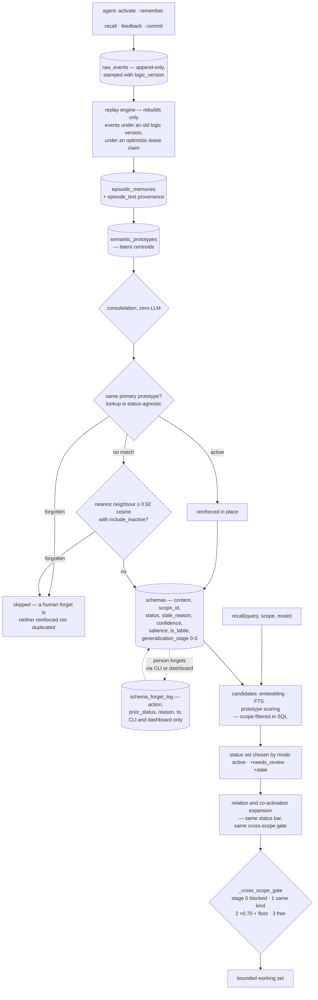

## 1. Executive Summary

Slowave is a local memory layer for coding agents built on a claim that most of
this corpus does not make: the memory core performs no LLM call at all. Ingest,
consolidation and recall are geometric — embeddings from a local ONNX encoder,
clustering into latent prototypes, symbolic schemas formed over them, and
retrieval by hybrid search with graph expansion. The agent supplies judgement;
the store supplies memory.

AGPL-3.0-or-later with a commercial licence offered separately, and a CLA. 505
commits between 8 June and 10 September 2026, the last on the day of this
reading, from two human contributors and a release bot; 32,305 lines of Python
across 78 files, against 34,348 lines of test in 134 files carrying 898 test
functions. The screen found no auto-run surface, five build-time execution paths
— an install-time client-setup module and three pytest `conftest.py` files —
one unpinned dependency surface, and **two manifests changed the same day**, so
nothing was installed, built or run.

**Six of seven marks, and the tombstone is the one worth the trip.** When a
person forgets a schema, consolidation is written not to undo it, in two places.
The prototype lookup is deliberately status-agnostic, so re-consolidating the
same prototype finds the forgotten row and skips: *"a copy that was retired by
explicit client feedback is the same engram and must not be recreated as a
duplicate."* And because the ordinary embedding search excludes non-active rows,
a second search runs with `include_inactive=True` — a nearest neighbour at or
above 0.92 cosine whose status is `forgotten` also skips, under a comment naming
both failures it prevents: reinforcing it *"would silently undo the user's
forget"*, and creating a duplicate *"would defeat it."* The key is the claim's
embedding, so a re-derivation in different words inside that radius is caught
too — which is more than a normalised-string key can do.

**Cross-scope reach is earned, not granted.** Every schema carries a scope, the
candidate paths filter on it in SQL, and a four-stage generalization ladder
decides what may travel: stage 0 hard-blocked, stage 1 only within the same
scope kind and above a score floor, stage 2 admitted with its score multiplied
by 0.70 and the floor re-checked, stage 3 unrestricted. The gate is one function
serving both the direct-candidate filter and the graph expansion, and the
docstring says why — *"a single source of truth instead of two
independently-drifting rules."* This atlas has found exactly that drift in three
other stores; here it is designed against and commented.

**The event store is the spine.** `raw_events` is append-only and stamped with
the `logic_version` under which it was ingested, so when the consolidation
algorithm changes the fix is to replay the events processed under the old logic
rather than to migrate derived state — with an optimistic-lease claim so the
daemon, worker and CLI cannot all rebuild at once.

**Forgetting is a person's act by construction.** It is reachable from the CLI
and the dashboard and deliberately absent from MCP, because *"forgetting requires
a human looking at a specific schema id, not an agent inferring intent from
conversational subtext."* The forget log records the status the schema held
before, so unforget restores `superseded` rather than guessing `active`.

**What it does not have is validity time.** Every timestamp here is a record
time — first formed, last updated, last touched. There is no world-state
interval and no as-of query, so `bitemporal` is withheld on an absence rather
than on an unwired mechanism.

## 2. Mental Model

Three layers, and the arrow only points one way.

At the bottom, **raw events**: what was said, appended, embedded, stamped with
the version of the code that ingested it. Nothing is derived here and nothing is
lost.

In the middle, the **latent layer**: episodes grouped from events, clustered
into semantic prototypes that are centroids rather than sentences. This is where
similarity lives.

At the top, the **symbolic layer**: schemas, which are the claims an agent
actually reads. A schema has content text, a scope, a lifecycle status, evidence
links back down to episodes and raw events, and a generalization stage recording
how far its usefulness has been shown to travel.

Everything above the event store is derived, and the project treats that as a
feature: change the logic, bump the version, replay. That is why the version
stamp is on the event rather than on the schema.

Correction runs through feedback rather than editing. The agent reports that a
retrieved memory helped, was irrelevant, or has gone stale — and a stale report
can name the replacement. The store applies the lifecycle; it does not judge the
claim. The source says so twice: contradiction and supersession are
*"client-owned history and are never inferred by this store or by
consolidation."*

Forgetting is the one thing an agent cannot ask for. A person opens the CLI or
the dashboard, looks at a specific schema, and suppresses it — and from then on
consolidation has to check whether the thing it is about to form is the thing
somebody deleted.



## 3. Architecture

Five subsystems under one package. `storage` is a single `schema.sql` of 623
lines and a SQLite wrapper. `latent` holds the episodic and semantic stores, the
graph manager, the replay engine, salience, temporal handling, a transition
model and a VSA module. `symbolic` holds the encoder, the ONNX encoder, the
2,065-line schema store, procedural memory and the raw log. `core` holds the
engine, the context and working-memory gate, consolidation, feedback, scope,
continuity, graph health, and a `services/` layer splitting ingest, retrieval,
retrieval access, feedback, feedback events, consolidation, pattern completion
and rebuild. Above them, an MCP server with five tools, a CLI, and a dashboard.

The database is the design document. `schema.sql` carries the arguments as well
as the DDL: why `forgotten` is a distinct status from `archived`, why
`schema_coactivation` is separate from `schema_relations` (usage-based versus
content-based, with STDP-like directional plasticity so `src → dst` strengthens
when src was recalled first), why the logic version is on the event rather than
the schema, and why the facet blobs *"support topical relation diagnostics and
replay inspection; they do not determine semantic truth."*

The proportions are worth stating plainly. Three months of work has produced 28
tables, a 4,239-line dashboard, a 2,330-line CLI and a 2,124-line client-setup
module that runs at install time and writes configuration for eight agent
clients. That is a lot of surface per commit-month, and the setup module is the
part most worth a reader's attention before installing, because it edits files
outside the project.

## 4. Essential Implementation Paths

- **Ingest.** the MCP tools append to `raw_events` with an embedding and the
  current `logic_version` → episodes are grouped with their provenance in
  `episode_text` → prototypes are formed or updated in the latent store.
- **Consolidate.** `core/consolidation.py:278` looks up
  `find_by_primary_prototype` status-agnostically → a `forgotten` match returns
  `skipped`, an active one is reinforced in place → otherwise `:309` checks the
  ordinary nearest neighbour against the 0.92 near-duplicate cosine, and `:344`
  re-checks with `include_inactive=True` specifically for a `forgotten` match →
  only then is a new schema written, classified and related.
- **Recall.** `core/services/retrieval.py:376` normalises the scope → candidates
  from embedding search, FTS and prototype scoring, each scope-filtered → `:474`
  computes the status set from the mode → `:485` drops anything outside it →
  `:492` applies `_cross_scope_gate` → `:539` expands along `schema_relations`
  under the same status bar and the same gate → the working-memory gate bounds
  the result.
- **Cross-scope.** `_cross_scope_gate` at `:688` returns true immediately for a
  same-scope, unscoped, `global` or `user` schema; otherwise cross-scope is only
  reachable in `strict_scope` mode, and then by stage — 3 free, 2 discounted by
  0.70 and floored, 1 same-kind and floored, 0 blocked.
- **Forget.** `schema_store.forget()` writes `schema_forget_log` with the
  current status *before* overwriting it, and returns early if the schema is
  already forgotten so `prior_status` cannot be clobbered → `unforget()` reads
  the most recent `forget` row and restores that status, appending its own row.
- **Rebuild.** `RebuildService.try_claim` takes an optimistic lease on a
  `logic_versions` row so exactly one of the daemon, worker or CLI replays;
  replay is scoped to events ingested under an older version.

## 5. Memory Data Model

Twenty-eight tables. The ones that carry the report:

**`schemas`** — the durable claim. Content text, facets and tags as JSON, a
scope id and kind, a status defaulting to `active`, a `stale_reason` drawn from
contradicted / superseded / outdated / unsupported / withdrawn, a confidence and
a salience, an embedding with optional packed facet axes and strengths, the
supporting episode ids, an `is_labile` flag, a `generalization_stage` from 0 to
3, first-formed and last-updated stamps, and the logic version it was formed
under. Five indexes, including ones on status, scope, labile and stage — the
fields the read path actually filters on.

**`schema_evidence`** — a normalised link from a schema to an episode or raw
event with a quote and a weight, with the note that the legacy JSON arrays are
kept for compatibility but *"new code should prefer this table."* Provenance is
a join, not a blob.

**`schema_relations` and `schema_coactivation`** — content-based and usage-based
edges, deliberately separate. Relations carry a confidence and a reason;
co-activation carries a decaying weight and a last-touched stamp so decay can be
applied per row. Note that the store writes only the symmetric `relates_to`
relation itself: contradiction and supersession are client-owned.

**`schema_forget_log`** — action, prior status, reason, timestamp.

**`raw_events` and `logic_versions`** — the replay spine, with the version stamp
on the event and the lease on the version.

**`feedback_events`** — an unusually complete feedback record: the retrieval it
belongs to, the target kind and id, an optional replacement target, an
assessment, a stale reason, an effect, a contribution, a reason, a coverage of
partial or complete, a status of accepted or rejected with a rejection reason,
the source contract, a `refines_event_id` so a correction to a feedback event is
itself an event, and a `mutation_mode` of shadow or active so a signal can be
recorded without being applied.

**What is missing is validity time.** Every temporal column here is about the
record: when it was formed, updated, touched, ingested. There is no interval
describing when a claim was true in the world, and no as-of parameter on any
read.

## 6. Retrieval Mechanics

Candidates come from three places — embedding search over schema vectors, FTS
over content, and prototype scoring — and all three are scope-filtered as they
are gathered rather than afterwards, which is the ordering that keeps a small
scope from being starved out of a page.

Status is then applied by mode. The default admits `active` only; a wider
profile admits `needs_review`; a history-seeking mode admits `stale` as well.
`archived` and `forgotten` are admitted by nothing. A labile schema that is
otherwise active is handled specially at `:497`, so a trace the system has
marked temporarily uncertain does not simply rank like a settled one.

Graph expansion follows `schema_relations`, and it is held to the same two bars.
The status check is repeated in the neighbour loop with a comment saying the
filter exists *"so a stale edge can't leak"*, and the cross-scope gate is the
same function object the direct path used. Two independent filters over the same
rule is the shape that has failed elsewhere in this corpus; one function called
twice is the fix.

Beside the relation graph, `schema_coactivation` records that two schemas were
recalled in the same session, with the edge strengthening in the direction of
recall order and decaying on a roughly seven-day half-life. That is a usage
signal kept deliberately apart from the content signal, so a pair that is often
useful together does not become a pair the system believes is topically related.

The whole path runs without an LLM call. The scoring is embeddings, BM25,
salience, confidence and graph weight; the encoder is local ONNX.

## 7. Write Mechanics

The agent writes; the store maintains. `slowave_remember` is the explicit path,
and the ordinary path is a session: `activate` opens it, `recall` asks, feedback
reports what helped, `commit` closes it. Everything lands in `raw_events` first,
so the derived layers can always be discarded and rebuilt.

Consolidation is the interesting write path, because it has to decide whether
the thing it is forming already exists. Three answers, in order: the same primary
prototype means the same engram, so reinforce in place — *"one schema per primary
prototype"* — unless it is forgotten, in which case skip; a near-duplicate above
0.92 cosine means reinforce or, if it is forgotten, skip; otherwise form a new
schema, classify it, and relate it.

`dedup_exact` handles the other duplicate case: exact normalised duplicates are
marked `archived` with their salience dropped to 0.05 and related to the
canonical row, with the reason recorded on the relation. Keeping `archived`
distinct from `forgotten` is what lets the duplicate-ratio statistics stay
meaningful while a human forget stays a human forget.

Reinforcement is bounded by a shared `SALIENCE_CEILING`, used by both
`reinforce()` and `adjust_feedback_state()` *"so the two code paths stay bounded
consistently instead of one capping and the other not"* — the same
one-rule-two-callers discipline as the scope gate.

## 8. Agent Integration

Five MCP tools — `slowave_activate`, `slowave_recall`, `slowave_remember`,
`slowave_feedback`, `slowave_commit` — and a `slowave setup` that detects and
configures Claude Code, Codex, Cursor, Cline, Windsurf, Devin Desktop, OpenCode
and Claude Desktop, with a `--dry-run` first. Published on PyPI; no API key
required for anything.

The tool set encodes the intended rhythm rather than exposing the store. There
is no MCP verb for forgetting, none for editing a schema's status directly, and
none for the dashboard's lifecycle operations. What an agent can do is open a
session, ask, report, and close — and the feedback report is where the lifecycle
actually moves, which is a defensible place to put it.

The dashboard is the human half: a local web application with a Cytoscape graph
view over memories, retrievals, feedback, procedures and system activity, and
the forget and unforget controls.

## 9. Reliability, Safety, and Trust

**Tombstone — awarded, and it is the strongest form in this reading.** The key
is an embedding rather than a normalised string, so the guard survives a
paraphrase within the near-duplicate radius; the check runs on the write path of
the process most likely to resurrect the claim; and the comment names both wrong
answers it is avoiding. The bound worth stating: the radius is a 0.92 cosine, so
a re-derivation *outside* it forms a new schema, and the forget is scoped to the
schema that was forgotten rather than to the proposition in general.

**Trust state — awarded.** Five statuses, three of which withhold, gated per
mode, applied identically on both retrieval paths, with `is_labile` kept
explicitly distinct from `needs_review` in the schema comment — a distinction
several systems in this corpus collapse.

**Scope enforced — awarded, in the graduated form.** The generalization ladder is
the part to steal: a memory earns the right to cross a boundary by demonstrating
it travels, rather than being marked global at write time by whoever wrote it.

**Audit log — awarded, and narrow.** `schema_forget_log` is a real mutation
record with the prior status, and it exists so an undo is exact. It covers the
forget lifecycle; other mutations are traceable through the append-only event
store and the consolidation trace rather than through a general mutation
journal.

**Human review — awarded.** The trust-boundary argument for keeping forget off
MCP is the clearest statement of that idea in this corpus, and it is enforced by
the tool list rather than by a flag.

**Negative evaluation — awarded.** The gold contract requires the required set
and forbids the forbidden and history-only sets in the same evaluation, so
neither half can pass alone.

**Bitemporal — withheld, on an absence.** No validity interval, no as-of
parameter. For a store whose central case is *"the current refund window is 14
days, and it used to be 30"*, the lifecycle answers it through supersession
rather than through time, which is a coherent choice and a different one.

**Two things a reader should weigh.** The install path executes: a 2,124-line
setup module writes configuration into eight clients' files, and the dependency
manifests changed the day of this reading, which is the standard reason to wait
out a cooldown. And the licence is AGPL-3.0-or-later with a commercial licence
offered separately and a CLA in the tree — open for use and study, and a
deliberate constraint on building a closed product over it.

## 10. Tests, Evals, and Benchmarks

898 test functions across 134 files and 34,348 lines — more test code than source
— split into four trees that mean different things: `unit` for the rules,
`regression` for bugs that have happened, `acceptance` for end-to-end memory
lifecycles against a harness, and `retrieval_quality` for the gold contracts.

**The gold contract is the reusable artifact.** `RetrievalGold` carries
`required_contents`, `forbidden_contents`, `historical_only_contents`,
`optional_contents`, an `expected_empty` flag and a `max_items` budget, and
`evaluate` reports precision, strict precision, an intrusion character count and
a boolean `passed` that requires all of: nothing required missing, nothing
forbidden found, nothing history-only found, and the budget respected. A memory
system that can express *"this must come back, that must not, and the answer must
fit in eight items"* as data has made its retrieval requirements testable.

**The regression tests document their own bugs.** `test_scope_rejection_filter`
opens with the date and the mechanism: an exact-match check against a bare
`"scope_mismatch"` string that the gate never actually produces, because real
reason strings are compound diagnostics ending in that token — *"the broken check
let every scope-rejected candidate through, which is what fed the cross-scope
co-activation leak."* It then includes a test whose only job is to demonstrate
that the old check would have missed the real string. That is the shape a
regression test should have.

**The benchmark page is careful about what it measured.** The headline is
binary LLM-judge evidence containment — 71.84% on LoCoMo across 1,534 answerable
questions in categories one to four, 65.20% on a LongMemEval oracle
configuration over all 500 questions — with the judge model and temperature
named and described as evaluation infrastructure rather than part of the system.
Three disclosures matter more than the numbers. The LongMemEval run is an oracle
setup and the page says outright *"this is not a distractor-retrieval test."* The
lower-scoring categories are analysed rather than buried, with the argument that
commonsense at 35.79% *"is not a pure memory-recall task and should not be used
alone to judge the memory layer."* And the raw evaluation records are stated to
be absent from the public repository, with the commands to reproduce a run given
instead — an honest limitation, and one that means the published figures cannot
be checked from the tree.

No paper: a search of the README and `docs/` for `arxiv`, `bibtex`,
`CITATION.cff` and a DOI returns nothing.

## 11. For Your Own Build

### Steal

- **Make the forget survive the pass that would recreate it.** A deletion that
  only changes a status is undone by the next consolidation. Look the claim up
  by embedding with the inactive rows included, and skip — neither reinforcing
  (which undoes the person's decision) nor writing a duplicate (which defeats
  it).
- **Record the prior status before you overwrite it.** `unforget` restoring
  `superseded` rather than guessing `active` costs one column, and the
  idempotence guard that stops a repeated forget from clobbering it costs one
  early return.
- **Keep the forget off the agent's tool surface.** *"Forgetting requires a human
  looking at a specific schema id, not an agent inferring intent from
  conversational subtext"* is the right reason, and enforcing it by omission from
  the tool list is the right mechanism.
- **Let a memory earn its way out of its scope.** Four stages with a hard block
  at the bottom, a same-kind restriction and a score floor in the middle, and a
  discount before admission at stage two, beats a global flag somebody set at
  write time.
- **Write the shared rule once and call it twice.** The cross-scope gate and the
  salience ceiling are both single functions used by two paths, each with a
  comment saying that two copies would drift. This corpus has repeatedly found
  the version where they did.
- **Stamp the event with the logic version that processed it.** Then an
  algorithm change is a scoped replay rather than a migration, and a lease on the
  version row stops three processes doing it at once.
- **Express retrieval requirements as data.** Required, forbidden, history-only,
  optional, a budget and an expected-empty flag — with `passed` requiring all of
  them — turns "it should not surface the old policy" into a case that fails.

### Avoid

- **A status field with no reason field.** `stale_reason` distinguishing
  contradicted from outdated from withdrawn is what lets a later reader tell a
  correction from an expiry.
- **Inferring supersession geometrically.** The store writes only the symmetric
  association and leaves contradiction and supersession to the client, which is
  the conservative call for a system with no LLM in the loop.
- **Publishing judged numbers whose records are not in the tree.** The
  reproduction commands are given and the raw evaluation records are not, so the
  figures have to be taken on trust or re-run.

### Fit

Slowave suits someone running several coding agents against the same projects
who wants one local store, no API key for memory operations, and a per-project
boundary that holds by default. Read it for the forget guard, the generalization
ladder and the retrieval-gold contract whatever you end up building. Weigh three
things before adopting: the AGPL with its commercial-licence path, an install
that writes configuration into eight clients through a module that executes at
install time, and three months of very fast growth across a wide surface — wait
out the dependency cooldown, and read `slowave/cli/setup.py` before running it.

## 12. Open Questions

- Is a validity interval planned? The lifecycle answers "what is true now" by
  supersession, and cannot answer "what did we believe in July".
- What happens to a forgotten schema's evidence? The rows cascade on delete, but
  a forget is a status change, so the episodes that supported it stay and could
  in principle re-derive the claim outside the 0.92 radius.
- How is the generalization stage advanced? The sweep exists and corrects stale
  high stages; the promotion criteria are the interesting half.
- Will the raw evaluation records be published? The benchmark page is careful
  enough that the missing records are the only thing standing between it and
  full reproducibility.

## Appendix: File Index

| Path | Lines | What it holds |
| --- | --- | --- |
| `slowave/storage/schema.sql` | 623 | Twenty-eight tables with their design commentary: `schemas` (167-206), `schema_evidence` (208), `schema_relations` and `schema_coactivation` (236-277), `schema_forget_log` (278-292), `raw_events` and `logic_versions` (115-151), `feedback_events` (481-510), `scope_registry` (566) |
| `slowave/symbolic/schema_store.py` | 2065 | `VALID_STATUS` and the forgotten-versus-archived argument (29-45), the salience ceiling, `forget` and `unforget` (728-780), `dedup_exact` (1677-1755) |
| `slowave/core/consolidation.py` | — | The status-agnostic prototype lookup and its forgotten skip (278-292), the near-duplicate guard and the inactive-inclusive forgotten check (309-355) |
| `slowave/core/services/retrieval.py` | 999 | Scope normalisation and candidate filtering (376-447), the mode-gated status sets (474-497), the neighbour walk under the same bar (539-543), `_cross_scope_gate` (688-735) |
| `slowave/core/services/feedback.py` | 859 | The lifecycle transitions feedback drives, including the forgotten guards |
| `slowave/dashboard/app.py` | 4239 | The local review surface and the forget/unforget paths (1693-1740) |
| `slowave/cli/setup.py` | 2124 | Client detection and configuration; executes at install time |
| `slowave/mcp/tools.py` | 1689 | The five tools — activate, recall, remember, feedback, commit |
| `tests/retrieval_quality/contracts.py` | — | `RetrievalGold` (24-26) and `evaluate` with its `passed` conjunction (94-120) |
| `tests/acceptance/test_memory_lifecycle.py` | — | The stale-replacement case (295-337), the present-versus-absent case, and six cases using `forbidden_contents` |
| `tests/unit/test_scope_rejection_filter.py` | — | The regression test that documents the bug it prevents |
| `docs/benchmarks.md` | — | LoCoMo and LongMemEval oracle figures with the judge named and the oracle caveat stated |

Searches behind the absence claims above, run from the repository root:

```sh
grep -rn 'valid_from\|valid_to\|valid_until\|effective_' slowave/storage/schema.sql slowave --include='*.py'  # no validity time anywhere; the hits are ports and query strings
grep -rn -i 'arxiv\|bibtex\|CITATION\.cff\|doi\.org' README.md docs   # nothing: no paper
grep -rn "'forgotten'" slowave --include='*.py'                        # the consolidation guards, the feedback guards, the store, the CLI and the dashboard — no MCP path
```

## History

**2026-09-10** — [`281d5cc7682680931ff8d4b3c46040cc6b57096d`](https://github.com/slowave-ai/slowave/commit/281d5cc7682680931ff8d4b3c46040cc6b57096d) — first reading, at the head of `main`, a commit from the day of the reading. Screened before reading: no auto-run surface, two dependency manifests changed the same day and so inside the seven-day cooldown, five build-time execution paths — the install-time client-setup module and three pytest collection hooks — and one unpinned dependency surface; nothing was installed, built or run, and the read was made from a full clone. Six marks. The reading covered the SQL schema and its commentary, the schema store's lifecycle and forget paths, consolidation's duplicate and forgotten guards, the retrieval service's status and scope gating, the feedback event model, the MCP tool surface, and the acceptance and retrieval-quality test contracts; the latent subsystem's replay, salience and transition modules, the procedural memory, the dashboard implementation and the benchmark harnesses were read as context rather than as subject.
