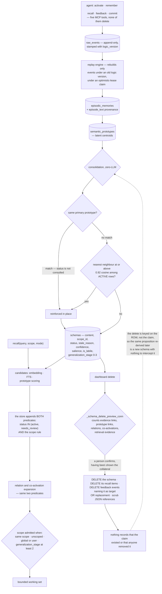

## 1. Executive Summary

Slowave is a local memory layer for coding agents built on a claim that most of
this corpus does not make: the memory core performs no LLM call at all. Ingest,
consolidation and recall are geometric — embeddings from a local ONNX encoder,
clustering into latent prototypes, symbolic schemas formed over them, and
retrieval by hybrid search with graph expansion. The agent supplies judgement;
the store supplies memory.

AGPL-3.0-or-later with a commercial licence offered separately, and a CLA. 517
commits between 8 June and 14 September 2026 from two human contributors and a
release bot; version 0.20.3, 32,690 lines of Python across 79 files, against
34,527 lines of test in 136 files carrying 903 test functions. The screen found
one auto-run surface, five build-time execution paths — an install-time
client-setup module and three pytest `conftest.py` files — one unpinned
dependency surface, and two manifests changed inside the seven-day cooldown, so
nothing was installed, built or run.

**The removal path is a hard delete, and it takes the record with it.** A person
removes a schema from the dashboard; the row goes from `schemas`, and the recall
items, the feedback events naming it as a target or a replacement, and the JSON
references that mention it are scrubbed in the same transaction. As erasure this
is thorough — better than most of this corpus, which leaves a memory's id
scattered across tables that outlive it. As memory it leaves nothing behind. No
status marks the claim as one a person rejected, no row records that a deletion
happened, and the key is the schema id rather than the claim, so the same
proposition arriving from a later session is a new schema with nothing to
intercept it. The store can forget a memory completely; it cannot remember
having done so.

The migration that introduced this says what it replaced:

> "Forget/unforget was removed in favour of explicit hard deletion. Preserve
> previously suppressed schemas by restoring their recorded prior state before
> removing the obsolete audit table."

`sqlite_db.py` restores every schema whose status is `forgotten` to the status it
held before — defaulting to `active` where the log has no row for it — and then
drops the log table. A store upgraded across this boundary returns to ordinary
retrieval the memories a person had previously suppressed, which is the honest
reading of "preserve" here: the schemas are preserved, and the decisions about
them are not.

**Cross-scope reach is earned, not granted.** Every schema carries a scope, the
candidate paths filter on it in SQL, and the widening rule lives in the predicate
rather than in the callers: a row is admitted when its scope matches, when it is
unscoped, when it sits in `('global', 'user')`, or when its `generalization_stage`
has reached 2. The same shape appears on the direct-candidate filter and on the
graph-expansion walk — the drift this atlas most often finds between exactly
those two paths.

**The event store is the spine.** `raw_events` is append-only and stamped with
the `logic_version` under which it was ingested, so when the consolidation
algorithm changes the fix is to replay the events processed under the old logic
rather than to migrate derived state — with an optimistic-lease claim so the
daemon, worker and CLI cannot all rebuild at once. It is the reason a store whose
derived memory carries no mutation log is still reconstructible: the evidence is
kept even where the decisions are not.

**Removal is a person's act by construction.** The five MCP tools are activate,
recall, remember, feedback and commit — an agent can write a memory and send
feedback about one, and no verb reaches the delete. What a person gets instead
is a preview: `_schema_delete_preview_conn` walks the evidence links, prototype
links, relations, co-activations and retrieval evidence that point at the schema
and returns a count for each, so the confirmation names what else is about to go.

**What it does not have is validity time.** Every timestamp here is a record
time — first formed, last updated, last touched. There is no world-state
interval and no as-of query, so `bitemporal` is withheld on an absence rather
than on an unwired mechanism.

## 2. Mental Model

Three layers, and the arrow only points one way.

At the bottom, **raw events**: what was said, appended, embedded, stamped with
the version of the code that ingested it. Nothing is derived here and nothing is
lost.

In the middle, the **latent layer**: episodes grouped from events, clustered
into semantic prototypes that are centroids rather than sentences. This is where
similarity lives.

At the top, the **symbolic layer**: schemas, which are the claims an agent
actually reads. A schema has content text, a scope, a lifecycle status, evidence
links back down to episodes and raw events, and a generalization stage recording
how far its usefulness has been shown to travel.

Everything above the event store is derived, and the project treats that as a
feature: change the logic, bump the version, replay. That is why the version
stamp is on the event rather than on the schema.

Correction runs through feedback rather than editing. The agent reports that a
retrieved memory helped, was irrelevant, or has gone stale — and a stale report
can name the replacement. The store applies the lifecycle; it does not judge the
claim. The source says so twice: contradiction and supersession are
*"client-owned history and are never inferred by this store or by
consolidation."*

Removal is the one thing an agent cannot ask for. A person opens the dashboard,
looks at a specific schema, sees a count of the evidence links, relations and
co-activations that point at it, and deletes it. What the pass that runs
afterwards knows about that decision is nothing: the row is gone, and
consolidation's identity key is the primary prototype of whatever it is forming
now.

**That is a permission boundary, and the 2026-09-19 re-read decided it is not
`human_review`.** The five MCP tools are activate, recall, remember, feedback and
commit, and none of them removes anything — the boundary is real and the delete
preview in front of it, which counts the evidence links, prototype links,
relations, co-activations and retrieval evidence that would go with the row, is
the kind of confirmation dialog this atlas rarely sees. What the mark asks for is
different: a memory that waits in a state until a person resolves it. Nothing
here waits. The one status that reads like a review queue, `needs_review`, is
admitted by the broad retrieval profile, by the consolidation merge check, by
pattern completion and by the store's candidate queries — and written by nothing
in the tree. `update_status` is called three times, all from feedback, and all
three write `stale`; the docstring in `core/feedback.py:61-62` says
*"needs_review is set unconditionally by FeedbackConfig.apply_stale_wrong_review"*
and that config path is one of those three. So the dashboard's review counter,
`SELECT COUNT(*) … WHERE status = 'needs_review'` (`dashboard/app.py:1250`), is
structurally zero, while a *different* field is surfaced under the same word one
file over: `ops.py:801` maps the API's `needs_review` key to `s.is_labile`, which
the schema's own comment calls *"distinct from the unrelated
status='needs_review'"*. A queue with no writer and a display name shared with
something else is the near-miss worth recording, not the mark.



## 3. Architecture

Five subsystems under one package. `storage` is a single `schema.sql` of 623
lines and a SQLite wrapper. `latent` holds the episodic and semantic stores, the
graph manager, the replay engine, salience, temporal handling, a transition
model and a VSA module. `symbolic` holds the encoder, the ONNX encoder, the
2,065-line schema store, procedural memory and the raw log. `core` holds the
engine, the context and working-memory gate, consolidation, feedback, scope,
continuity, graph health, and a `services/` layer splitting ingest, retrieval,
retrieval access, feedback, feedback events, consolidation, pattern completion
and rebuild. Above them, an MCP server with five tools, a CLI, and a dashboard.

The database is the design document. `schema.sql` carries the arguments as well
as the DDL: why a stale reason is kept beside the status rather than inside it, why
`schema_coactivation` is separate from `schema_relations` (usage-based versus
content-based, with STDP-like directional plasticity so `src → dst` strengthens
when src was recalled first), why the logic version is on the event rather than
the schema, and why the facet blobs *"support topical relation diagnostics and
replay inspection; they do not determine semantic truth."*

The proportions are worth stating plainly. Three months of work has produced 27
tables, a dashboard of over 4,000 lines, a CLI of over 2,000, and a client-setup
module of similar size that runs at install time and writes configuration for
eight agent clients. That is a lot of surface per commit-month, and the setup module is the
part most worth a reader's attention before installing, because it edits files
outside the project.

## 4. Essential Implementation Paths

- **Ingest.** the MCP tools append to `raw_events` with an embedding and the
  current `logic_version` → episodes are grouped with their provenance in
  `episode_text` → prototypes are formed or updated in the latent store.
- **Consolidate.** `core/consolidation.py:282` looks up
  `find_by_primary_prototype` and reinforces any match in place — the status is
  not consulted, so a schema in any lifecycle state is reactivated rather than
  duplicated → otherwise `:300` checks the nearest active neighbour against the
  0.92 near-duplicate cosine and strengthens it → only then is a new schema
  written, classified and related.
- **Recall.** `core/services/retrieval.py:413` computes the status set from the
  mode — `active` by default, plus `needs_review` when broad, plus `stale` only
  in debug, and `archived` never → `:425` drops anything outside it → `:430`
  applies `_cross_scope_gate` → `:505` expands along `schema_relations` through
  the same gate → the working-memory gate bounds the result.
- **Cross-scope.** `_cross_scope_gate` at `:629` admits a same-scope, unscoped,
  `global` or `user` schema immediately; otherwise cross-scope is reachable only
  in `strict_scope` mode, and then by stage. Underneath it the store's own
  predicate carries the same rule, admitting a row whose `generalization_stage`
  has reached 2.
- **Delete.** `dashboard/app.py:1750` previews what a removal will take —
  evidence links, prototype links, relations, co-activations and retrieval
  evidence, counted per kind → `:1828` deletes the recall items, the feedback
  events naming the schema as target or replacement, the JSON references, and
  then the row, in one transaction.
- **Rebuild.** `RebuildService.try_claim` takes an optimistic lease on a
  `logic_versions` row so exactly one of the daemon, worker or CLI replays;
  replay is scoped to events ingested under an older version.

## 5. Memory Data Model

Twenty-eight tables. The ones that carry the report:

**`schemas`** — the durable claim. Content text, facets and tags as JSON, a
scope id and kind, a status defaulting to `active`, a `stale_reason` drawn from
contradicted / superseded / outdated / unsupported / withdrawn, a confidence and
a salience, an embedding with optional packed facet axes and strengths, the
supporting episode ids, an `is_labile` flag, a `generalization_stage` from 0 to
3, first-formed and last-updated stamps, and the logic version it was formed
under. Five indexes, including ones on status, scope, labile and stage — the
fields the read path actually filters on.

**`schema_evidence`** — a normalised link from a schema to an episode or raw
event with a quote and a weight, with the note that the legacy JSON arrays are
kept for compatibility but *"new code should prefer this table."* Provenance is
a join, not a blob.

**`schema_relations` and `schema_coactivation`** — content-based and usage-based
edges, deliberately separate. Relations carry a confidence and a reason;
co-activation carries a decaying weight and a last-touched stamp so decay can be
applied per row. Note that the store writes only the symmetric `relates_to`
relation itself: contradiction and supersession are client-owned.

**`raw_events` and `logic_versions`** — the replay spine, with the version stamp
on the event and the lease on the version.

**`feedback_events`** — an unusually complete feedback record: the retrieval it
belongs to, the target kind and id, an optional replacement target, an
assessment, a stale reason, an effect, a contribution, a reason, a coverage of
partial or complete, a status of accepted or rejected with a rejection reason,
the source contract, a `refines_event_id` so a correction to a feedback event is
itself an event, and a `mutation_mode` of shadow or active so a signal can be
recorded without being applied.

**What is missing is validity time.** Every temporal column here is about the
record: when it was formed, updated, touched, ingested. There is no interval
describing when a claim was true in the world, and no as-of parameter on any
read.

## 6. Retrieval Mechanics

Candidates come from three places — embedding search over schema vectors, FTS
over content, and prototype scoring — and all three are scope-filtered as they
are gathered rather than afterwards, which is the ordering that keeps a small
scope from being starved out of a page.

Status is then applied by mode. The default and `strict_scope` admit `active`
only; a broad profile admits `needs_review`; `debug` admits `stale` as well.
`archived` is admitted by nothing. A labile schema that is otherwise active is
handled specially, so a trace the system has marked temporarily uncertain does
not simply rank like a settled one.

Graph expansion follows `schema_relations`, and it is held to the same two bars.
The status check is repeated in the neighbour loop with a comment saying the
filter exists *"so a stale edge can't leak"*, and the cross-scope gate is the
same function object the direct path used. Two independent filters over the same
rule is the shape that has failed elsewhere in this corpus; one function called
twice is the fix.

Beside the relation graph, `schema_coactivation` records that two schemas were
recalled in the same session, with the edge strengthening in the direction of
recall order and decaying on a roughly seven-day half-life. That is a usage
signal kept deliberately apart from the content signal, so a pair that is often
useful together does not become a pair the system believes is topically related.

The whole path runs without an LLM call. The scoring is embeddings, BM25,
salience, confidence and graph weight; the encoder is local ONNX.

## 7. Write Mechanics

The agent writes; the store maintains. `slowave_remember` is the explicit path,
and the ordinary path is a session: `activate` opens it, `recall` asks, feedback
reports what helped, `commit` closes it. Everything lands in `raw_events` first,
so the derived layers can always be discarded and rebuilt.

Consolidation is the interesting write path, because it has to decide whether
the thing it is forming already exists. Two answers, in order: the same primary
prototype means the same engram, so reinforce in place — *"one schema per primary
prototype"* — and the status is not consulted, so a schema in any lifecycle state
is reactivated by a match rather than duplicated; a nearest active neighbour at
or above 0.92 cosine is strengthened instead of copied; otherwise form a new
schema, classify it, and relate it.

`dedup_exact` handles the other duplicate case: exact normalised duplicates are
marked `archived` with their salience dropped to 0.05 and related to the
canonical row, with the reason recorded on the relation. That keeps the
duplicate-ratio statistics meaningful without removing anything.

Reinforcement is bounded by a shared `SALIENCE_CEILING`, used by both
`reinforce()` and `adjust_feedback_state()` *"so the two code paths stay bounded
consistently instead of one capping and the other not"* — the same
one-rule-two-callers discipline as the scope gate.

## 8. Agent Integration

Five MCP tools — `slowave_activate`, `slowave_recall`, `slowave_remember`,
`slowave_feedback`, `slowave_commit` — and a `slowave setup` that detects and
configures Claude Code, Codex, Cursor, Cline, Windsurf, Devin Desktop, OpenCode
and Claude Desktop, with a `--dry-run` first. Published on PyPI; no API key
required for anything.

The tool set encodes the intended rhythm rather than exposing the store. There
is no MCP verb for deleting, none for editing a schema's status directly, and
none for the dashboard's lifecycle operations. What an agent can do is open a
session, ask, report, and close — and the feedback report is where the lifecycle
actually moves, which is a defensible place to put it.

The dashboard is the human half: a local web application with a Cytoscape graph
view over memories, retrievals, feedback, procedures and system activity, and
the delete controls with their preview.

## 9. Reliability, Safety, and Trust

**Tombstone — withheld, on a deliberate design choice.** Removal here is a hard
delete keyed on the schema id. Nothing survives it to be consulted on a later
write: the row is gone, the rows naming it are scrubbed, and the identity key
consolidation uses is the primary prototype of whatever it is forming now. A
person who removes a claim has removed a row, not registered a judgement about
the claim, so the same proposition re-derived from a later session forms a new
schema with nothing in the store positioned to intercept it. The trade is real
and runs the other way too: erasure this thorough is uncommon in this corpus,
and a store that keeps no record of what it deleted is a store with nothing to
leak.

**Trust state — awarded.** Four statuses, gated per mode, applied identically on
both retrieval paths, with `is_labile` kept explicitly distinct from
`needs_review` in the schema comment — a distinction several systems in this
corpus collapse. The weak seam is the write: `update_status` ends with
`status = status if status in VALID_STATUS else "active"`, so an unrecognised
value becomes the most-trusted one rather than an error.

**Scope enforced — awarded, in the graduated form.** The generalization ladder is
the part to steal: a memory earns the right to cross a boundary by demonstrating
it travels, rather than being marked global at write time by whoever wrote it.

**Audit log — withheld.** No table records mutations to the derived memory. The
schema holds an append-only `raw_events` store and an append-only
`consolidation_debug` trace, and both are valuable — the first is what makes the
whole derived layer reconstructible — but they are the evidence the memory is
built from and a diagnostic of how it was built, not a record of what was
changed and by whom. `update_status` writes no row beside the status it
overwrites. `feedback_events` comes closest, carrying an assessment, a stale
reason, a named replacement and an accepted-or-rejected status, but it is keyed
to a retrieval and cascades away when that retrieval is deleted, so it is not a
durable record of the mutations it caused.

**Human review — awarded.** A person is the only actor who can remove a memory,
and this is enforced by the tool list rather than by a flag: the five MCP verbs
are activate, recall, remember, feedback and commit, and none of them deletes.
What lifts it above a bare permission split is the preview — the dashboard walks
the evidence links, prototype links, relations, co-activations and retrieval
evidence pointing at the schema and counts each before the person confirms, so
the decision is made against the collateral rather than against a row id.

**Negative evaluation — awarded.** The gold contract requires the required set
and forbids the forbidden and history-only sets in the same evaluation, so
neither half can pass alone.

**Bitemporal — withheld, on an absence.** No validity interval, no as-of
parameter. For a store whose central case is *"the current refund window is 14
days, and it used to be 30"*, the lifecycle answers it through supersession
rather than through time, which is a coherent choice and a different one.

**Two things a reader should weigh.** The install path executes: a 2,124-line
setup module writes configuration into eight clients' files, and the dependency
manifests changed the day of this reading, which is the standard reason to wait
out a cooldown. And the licence is AGPL-3.0-or-later with a commercial licence
offered separately and a CLA in the tree — open for use and study, and a
deliberate constraint on building a closed product over it.

## 10. Tests, Evals, and Benchmarks

898 test functions across 134 files and 34,348 lines — more test code than source
— split into four trees that mean different things: `unit` for the rules,
`regression` for bugs that have happened, `acceptance` for end-to-end memory
lifecycles against a harness, and `retrieval_quality` for the gold contracts.

**The gold contract is the reusable artifact.** `RetrievalGold` carries
`required_contents`, `forbidden_contents`, `historical_only_contents`,
`optional_contents`, an `expected_empty` flag and a `max_items` budget, and
`evaluate` reports precision, strict precision, an intrusion character count and
a boolean `passed` that requires all of: nothing required missing, nothing
forbidden found, nothing history-only found, and the budget respected. A memory
system that can express *"this must come back, that must not, and the answer must
fit in eight items"* as data has made its retrieval requirements testable.

**The regression tests document their own bugs.** `test_scope_rejection_filter`
opens with the date and the mechanism: an exact-match check against a bare
`"scope_mismatch"` string that the gate never actually produces, because real
reason strings are compound diagnostics ending in that token — *"the broken check
let every scope-rejected candidate through, which is what fed the cross-scope
co-activation leak."* It then includes a test whose only job is to demonstrate
that the old check would have missed the real string. That is the shape a
regression test should have.

**The benchmark page is careful about what it measured.** The headline is
binary LLM-judge evidence containment — 71.84% on LoCoMo across 1,534 answerable
questions in categories one to four, 65.20% on a LongMemEval oracle
configuration over all 500 questions — with the judge model and temperature
named and described as evaluation infrastructure rather than part of the system.
Three disclosures matter more than the numbers. The LongMemEval run is an oracle
setup and the page says outright *"this is not a distractor-retrieval test."* The
lower-scoring categories are analysed rather than buried, with the argument that
commonsense at 35.79% *"is not a pure memory-recall task and should not be used
alone to judge the memory layer."* And the raw evaluation records are stated to
be absent from the public repository, with the commands to reproduce a run given
instead — an honest limitation, and one that means the published figures cannot
be checked from the tree.

No paper: a search of the README and `docs/` for `arxiv`, `bibtex`,
`CITATION.cff` and a DOI returns nothing.

## 11. For Your Own Build

### Steal

- **Show the collateral before the confirmation.** The delete preview counts the
  evidence links, prototype links, relations, co-activations and retrieval
  evidence that point at the row, so a person deciding sees what else the
  deletion takes. It costs one read per referencing table and turns a
  destructive click into an informed one.
- **Scrub the references in the same transaction as the row.** The delete clears
  the recall items, the feedback events naming the schema as target *or* as
  replacement, and the JSON fields mentioning it, then removes the schema. Most
  stores in this corpus leave a deleted memory's id behind in tables nobody
  thought to sweep.
- **Keep removal off the agent's tool surface.** Five verbs that write and read
  and none that deletes is a permission boundary enforced by omission rather
  than by a flag, which is the version of it that cannot be misconfigured.
- **Let a memory earn its way out of its scope.** Four stages with a hard block
  at the bottom, a same-kind restriction and a score floor in the middle, and a
  discount before admission at stage two, beats a global flag somebody set at
  write time.
- **Write the shared rule once and call it twice.** The cross-scope gate and the
  salience ceiling are both single functions used by two paths, each with a
  comment saying that two copies would drift. This corpus has repeatedly found
  the version where they did.
- **Stamp the event with the logic version that processed it.** Then an
  algorithm change is a scoped replay rather than a migration, and a lease on the
  version row stops three processes doing it at once.
- **Express retrieval requirements as data.** Required, forbidden, history-only,
  optional, a budget and an expected-empty flag — with `passed` requiring all of
  them — turns "it should not surface the old policy" into a case that fails.

### Avoid

- **A status field with no reason field.** `stale_reason` distinguishing
  contradicted from outdated from withdrawn is what lets a later reader tell a
  correction from an expiry.
- **Inferring supersession geometrically.** The store writes only the symmetric
  association and leaves contradiction and supersession to the client, which is
  the conservative call for a system with no LLM in the loop.
- **Publishing judged numbers whose records are not in the tree.** The
  reproduction commands are given and the raw evaluation records are not, so the
  figures have to be taken on trust or re-run.

### Fit

Slowave suits someone running several coding agents against the same projects
who wants one local store, no API key for memory operations, and a per-project
boundary that holds by default. Read it for the generalization ladder, the
delete preview and the retrieval-gold contract whatever you end up building. Weigh three
things before adopting: the AGPL with its commercial-licence path, an install
that writes configuration into eight clients through a module that executes at
install time, and three months of very fast growth across a wide surface — wait
out the dependency cooldown, and read `slowave/cli/setup.py` before running it.

## 12. Open Questions

- Is a validity interval planned? The lifecycle answers "what is true now" by
  supersession, and cannot answer "what did we believe in July".
- What stops a deleted claim coming back? The schema row and its references go,
  but the `raw_events` and episodes it was derived from are the replay spine and
  stay, so the next consolidation pass over that evidence can form the claim
  again with nothing recording that a person removed it.
- Should a removal leave anything behind at all? Keeping a value-keyed marker
  would let the store refuse a re-derivation, at the cost of retaining a trace
  of precisely the content someone asked to be rid of. The project has chosen
  the erasure side of that trade explicitly.
- How is the generalization stage advanced? The sweep exists and corrects stale
  high stages; the promotion criteria are the interesting half.
- Will the raw evaluation records be published? The benchmark page is careful
  enough that the missing records are the only thing standing between it and
  full reproducibility.

## Appendix: File Index

| Path | Lines | What it holds |
| --- | --- | --- |
| `slowave/storage/schema.sql` | 606 | Twenty-seven tables with their design commentary: `schemas` (167-206), `schema_evidence` (208), `schema_relations` and `schema_coactivation` (236-275), `raw_events` and `logic_versions` (115-151), `feedback_events` (464-493), `scope_registry` (549) |
| `slowave/symbolic/schema_store.py` | 2089 | `VALID_STATUS` (29-34), `update_status` with its fold-to-stale and its coercion to `active` (690-715), the status and scope predicates on the candidate paths (1424, 1514-1518, 1580-1585, 1934, 2019-2024) |
| `slowave/core/consolidation.py` | — | The primary-prototype lookup that reinforces without consulting status (278-293), and the near-duplicate guard over active rows (296-320) |
| `slowave/core/services/retrieval.py` | 975 | The mode-gated status sets (413-419), the candidate filter (425-435), `_cross_scope_gate` (629) and its two call sites (430, 505) |
| `slowave/core/services/feedback.py` | 855 | The lifecycle transitions feedback drives |
| `slowave/dashboard/app.py` | 4436 | The local review surface, the delete preview (1750-1790) and the delete itself (1828-1848) |
| `slowave/storage/sqlite_db.py` | — | The migration that restores every `forgotten` schema and drops the audit table (304-318) |
| `slowave/cli/setup.py` | 2124 | Client detection and configuration; executes at install time |
| `slowave/mcp/tools.py` | 1694 | The five tools — activate, recall, remember, feedback, commit — and no delete |
| `tests/retrieval_quality/contracts.py` | — | `RetrievalGold` (20-28) and `evaluate` with its `passed` conjunction (94-124) |
| `tests/acceptance/test_memory_lifecycle.py` | — | The lifecycle cases, with `forbidden` content asserted in fifteen places |
| `tests/unit/test_dashboard_delete.py` | — | The preview-and-cascade case (68), and the migration case that pins the removal of the audit table (191) |
| `tests/unit/test_scope_rejection_filter.py` | — | The regression test that documents the bug it prevents |
| `docs/benchmarks.md` | — | LoCoMo and LongMemEval oracle figures with the judge named and the oracle caveat stated |

Searches behind the absence claims above, run from the repository root:

```sh
grep -rn 'valid_from\|valid_to\|valid_until\|effective_' slowave/storage/schema.sql slowave --include='*.py'  # no validity time; the hits are an effective_query string and a port helper
grep -rn -i 'arxiv\|bibtex\|CITATION\.cff\|doi\.org' README.md docs   # nothing: no paper
grep -rn "'forgotten'" slowave --include='*.py'                        # only the migration that removes the status
grep -rn 'DELETE FROM schemas' slowave --include='*.py'                # one site: the dashboard delete
grep -rn '_log' slowave/storage/schema.sql                             # no mutation-log table
```

## History

**2026-09-19** — re-read at the same pin [`8d538b370c37243a39e19e52e4a5fdb35c9527b5`](https://github.com/slowave-ai/slowave/commit/8d538b370c37243a39e19e52e4a5fdb35c9527b5), still the tip. **`human_review` is withdrawn; three marks stand.** Nothing upstream moved, so this is a correction. The evidence the mark rested on is accurate and stays in section 4: five MCP tools, none of which removes anything, and a delete preview that names the collateral before a person confirms. That is a permission boundary over a destructive act, not a state a memory waits in. The state that would have been one is `needs_review`, and it has no writer: eleven appearances outside the tests, every one a read, `update_status` called three times and writing `stale` each time — including from the very config flag whose docstring claims it sets `needs_review`. The dashboard's review counter is therefore structurally zero, and `ops.py:801` publishes a different field, `is_labile`, under the same key, which the schema comment explicitly separates from it. Recorded as a qualification on `trust_state` too, which now rests on `stale` and `archived`. Screened again first; nothing installed or run.

**2026-09-16** — [`8d538b370c37243a39e19e52e4a5fdb35c9527b5`](https://github.com/slowave-ai/slowave/commit/8d538b370c37243a39e19e52e4a5fdb35c9527b5) — re-read at a commit dated 14 September 2026, twelve commits past the previous pin. Forget and unforget were removed in favour of explicit hard deletion: `forgotten` is gone from `VALID_STATUS`, both consolidation guards that protected a forgotten schema were deleted, and a migration restores every previously forgotten schema to its prior status before dropping `schema_forget_log`. The tombstone and mutation-audit marks are withdrawn, the code they rested on being gone; trust state, scope enforcement, human review and negative evaluation are re-tested and hold, with human review re-grounded on the delete preview and the absence of any delete verb among the five MCP tools. Screened before reading: one auto-run surface, five build-time execution points, one unpinned dependency surface and two dependency files inside the seven-day cooldown, with `uv.lock` present. Nothing was installed, built or run.

**2026-09-10** — [`281d5cc7682680931ff8d4b3c46040cc6b57096d`](https://github.com/slowave-ai/slowave/commit/281d5cc7682680931ff8d4b3c46040cc6b57096d) — first reading, at the head of `main`, a commit from the day of the reading. Screened before reading: no auto-run surface, two dependency manifests changed the same day and so inside the seven-day cooldown, five build-time execution paths — the install-time client-setup module and three pytest collection hooks — and one unpinned dependency surface; nothing was installed, built or run, and the read was made from a full clone. Six marks. The reading covered the SQL schema and its commentary, the schema store's lifecycle and forget paths, consolidation's duplicate and forgotten guards, the retrieval service's status and scope gating, the feedback event model, the MCP tool surface, and the acceptance and retrieval-quality test contracts; the latent subsystem's replay, salience and transition modules, the procedural memory, the dashboard implementation and the benchmark harnesses were read as context rather than as subject.
